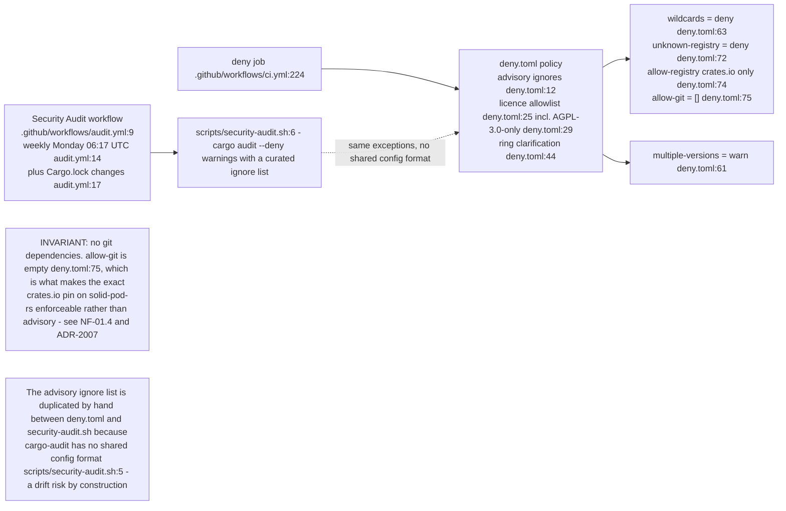
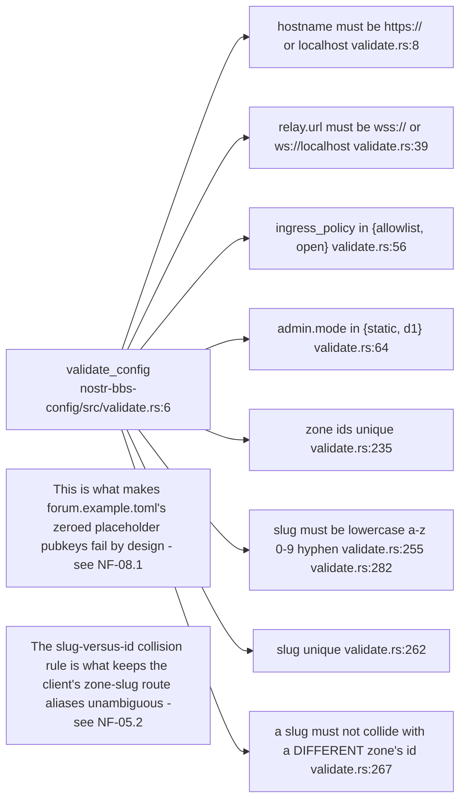
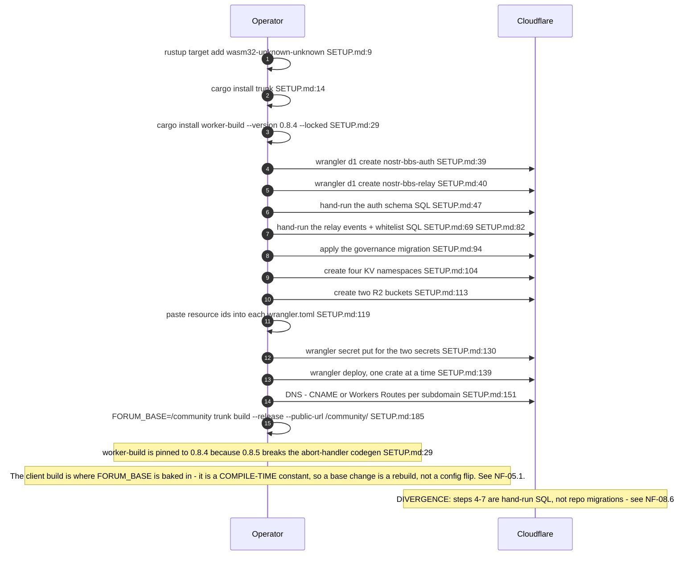
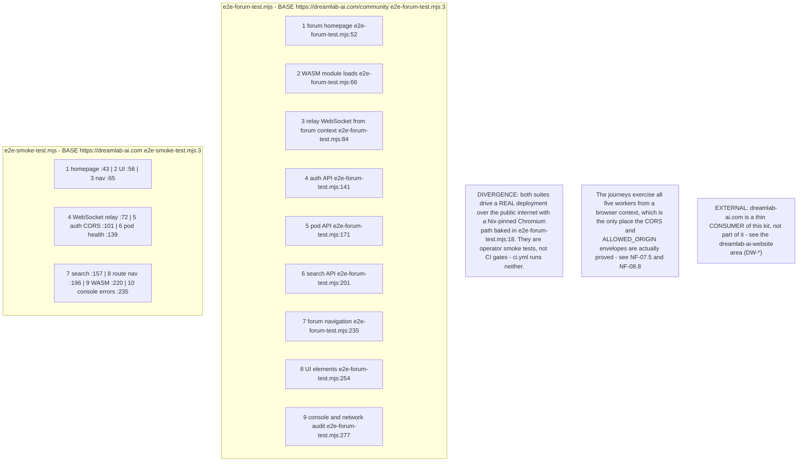
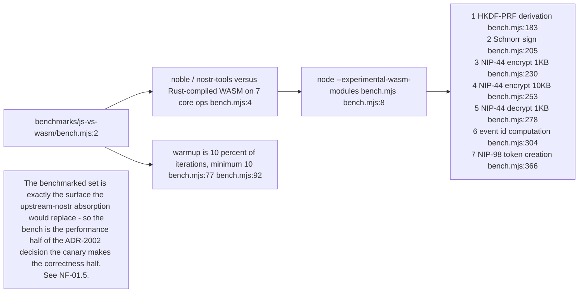
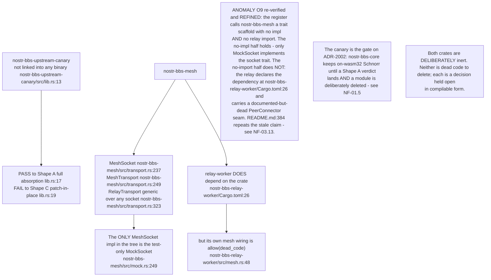
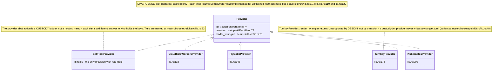

## NF-09.1 The CI gate graph

```mermaid
flowchart TB
    subgraph gates["Eight required jobs"]
        FMT["fmt - cargo fmt --all --check<br/>.github/workflows/ci.yml:58 .github/workflows/ci.yml:69"]
        CLIP["clippy - workspace, all targets, all features, -D warnings<br/>.github/workflows/ci.yml:74 .github/workflows/ci.yml:87"]
        TEST["test - cargo test --workspace --all-targets --all-features<br/>.github/workflows/ci.yml:92 .github/workflows/ci.yml:103"]
        SEC["test-security - six security-critical crates re-run alone<br/>.github/workflows/ci.yml:121 .github/workflows/ci.yml:134"]
        WASM["wasm32 check - cargo check --workspace --target wasm32-unknown-unknown<br/>.github/workflows/ci.yml:156 .github/workflows/ci.yml:174"]
        DOC["doc - cargo doc --workspace --no-deps<br/>.github/workflows/ci.yml:179 .github/workflows/ci.yml:194"]
        COV["coverage - cargo llvm-cov lcov artefact<br/>.github/workflows/ci.yml:196 .github/workflows/ci.yml:213"]
        DENY["deny - cargo deny check<br/>.github/workflows/ci.yml:224 .github/workflows/ci.yml:244"]
    end
    PASS["ci-pass - the single branch-protection target named CI required<br/>.github/workflows/ci.yml:251 .github/workflows/ci.yml:265"]

    FMT & CLIP & TEST & SEC & WASM & DOC & COV & DENY --> PASS

    N1["The test job also validates the shipped configuration contract by running the kit's own validator<br/>over forum.example.toml .github/workflows/ci.yml:107"]
    N2["The security crates re-run is nostr-bbs-core, relay-worker, pod-worker, auth-worker, preview-worker<br/>and config .github/workflows/ci.yml:136 through .github/workflows/ci.yml:141"]
    N3["The wasm32 job installs libc6-dev-i386 so the secp256k1-sys cross-compile succeeds<br/>.github/workflows/ci.yml:171 - which is why it can check the WHOLE workspace, not the two crates<br/>workspace.metadata.ci.wasm-check-packages names Cargo.toml:49. See NF-01.2."]
    N4["ci-pass iterates every job result and fails the aggregate unless all succeeded<br/>.github/workflows/ci.yml:277"]
```

## NF-09.2 Supply-chain policy

## NF-09.3 Repository scripts

```mermaid
flowchart TB
    ADR["adr-index-gen.js:5 - walk the ADR tree, validate frontmatter, regenerate README index"]
    DRIFT["anti-drift-lint.sh:2 - ADR-077 P3: reject SUPERSEDED Schnorr verification-key identifiers<br/>after the ADR-125 did:nostr Multikey convergence anti-drift-lint.sh:5"]
    PARITY["identity-vector-parity.mjs:3 - the JavaScript half of the ADR-2003 parity proof,<br/>loading the SAME versioned fixture as the Rust suite identity-vector-parity.mjs:6"]
    PKG["package-repo.sh:2 - package code + metadata into one review blob, ~800K tokens package-repo.sh:4"]
    SEC["security-audit.sh:6 - cargo audit with the curated ignore list"]
    SYNC["sync-fixtures.sh:4 - ADR-082 D5: clone VisionClaw, copy tests/fixtures, write a CHECKSUM"]
    VAL["validate-forum-config.sh:7 - run the kit's own nostr-bbs-config validator binary"]

    N1["INVARIANT ADR-2003: derive_subkey is a BYTE-FOR-BYTE cross-stack contract with agentbox's JS<br/>mirror derivation. The Rust half is the known-answer vector nostr-bbs-core/src/keys.rs:478 with the<br/>expected digest at nostr-bbs-core/src/keys.rs:483; the JS half is identity-vector-parity.mjs. Both read<br/>ONE fixture, so they cannot drift. EXTERNAL: see AB-11 and ES-04."]
    N2["DIVERGENCE: neither anti-drift-lint.sh nor identity-vector-parity.mjs is invoked by ci.yml or<br/>audit.yml - both are manual. Only validate-forum-config.sh is wired in, at .github/workflows/ci.yml:107"]
    N3["Fixtures come FROM VisionClaw, so a fixture-suite change there is an unversioned input here -<br/>EXTERNAL: see the VisionClaw area (VC-*)"]
```

## NF-09.4 Config validation rules the kit enforces

## NF-09.5 Deploy — the wrangler sequence

## NF-09.6 End-to-end journeys — against production, not a fixture

## NF-09.7 Benchmarks — JS versus WASM on the seven core operations

## NF-09.8 Canary and mesh — the two crates that prove rather than serve

## NF-09.9 The setup-skill provider scaffold

