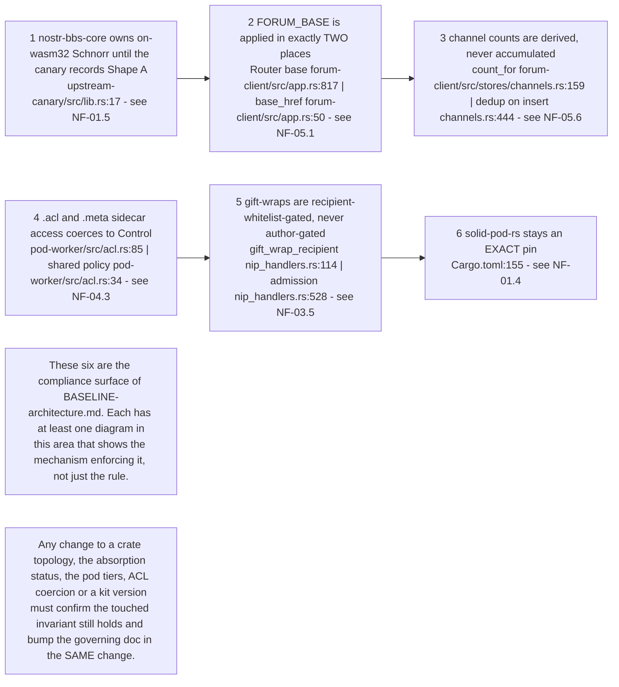
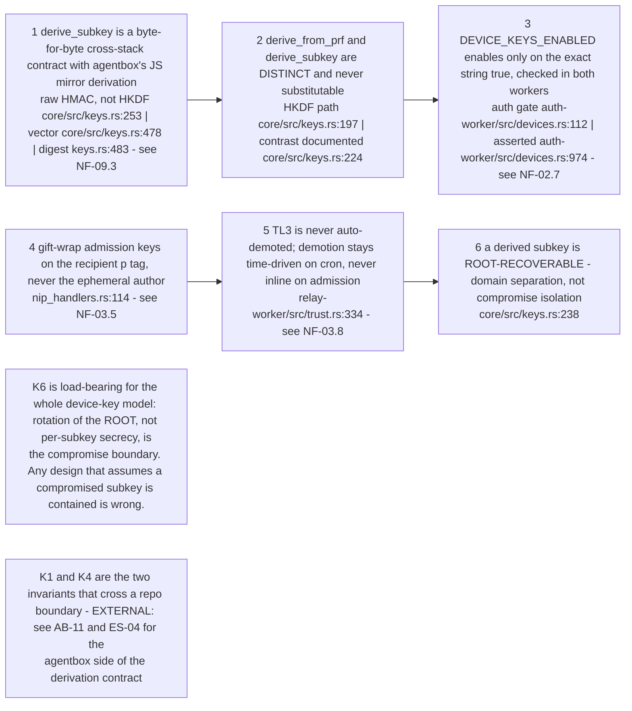
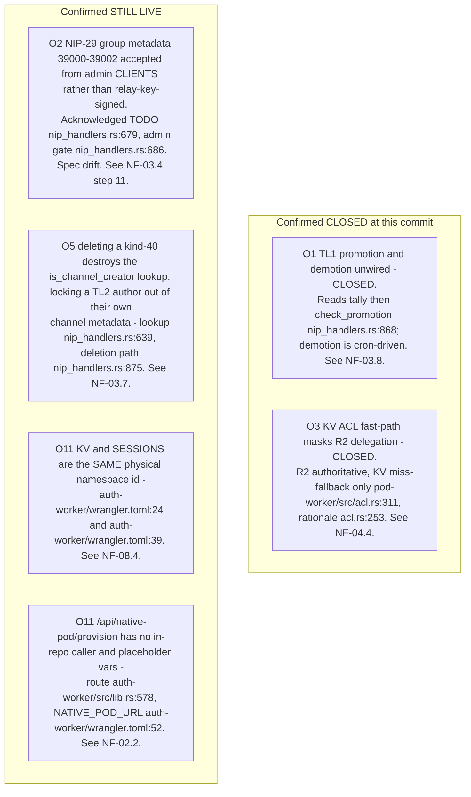
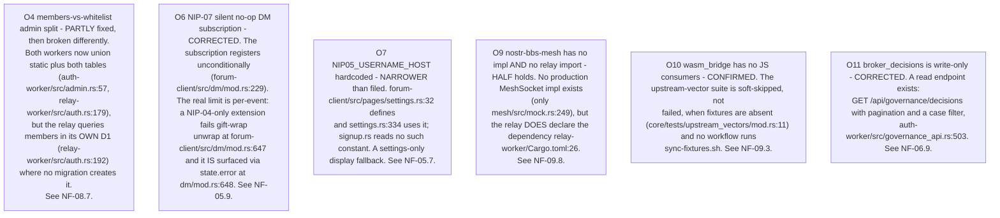
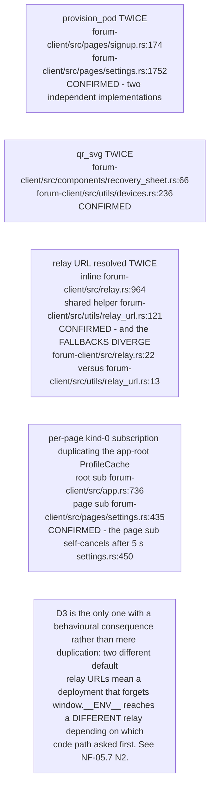
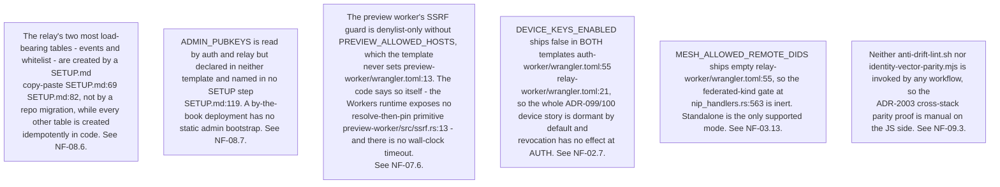
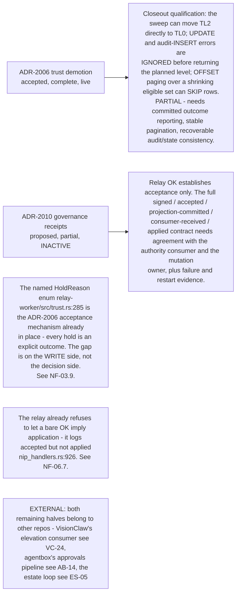
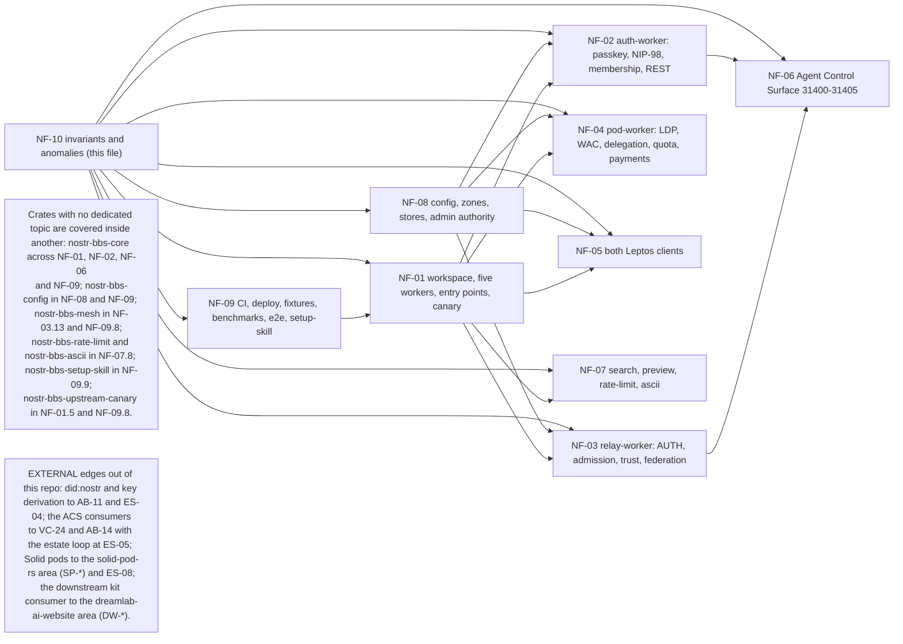

## NF-10.1 The compliance surface — BASELINE-architecture invariants

## NF-10.2 The compliance surface — IDENTITY invariants

## NF-10.3 Anomaly register — closed and still live

## NF-10.4 Anomaly register — refined or corrected by this pass

## NF-10.5 O8 duplications — each re-verified

## NF-10.6 New doc-drift found in this pass

```mermaid
flowchart TB
    DD1["README.md:383 calls NIP-42 AUTH scaffolded with auth_required false. The code says otherwise:<br/>nip42 is the DEFAULT nip42.rs:62, the template ships AUTH_MODE nip42 relay-worker/wrangler.toml:31,<br/>and every EVENT passes the gate first nip_handlers.rs:514. The row understates a shipped feature.<br/>See NF-03.3."]
    DD2["README.md:384 says nostr-bbs-mesh is NOT a dependency of the relay-worker.<br/>relay-worker/Cargo.toml:26 declares it. See NF-09.8."]
    DD3["relay-worker/wrangler.toml:10 asserts there is no ADMIN_PUBKEYS reader in src/.<br/>relay-worker/src/auth.rs:183 reads it, and so does auth-worker/src/admin.rs:71.<br/>Only search-worker/wrangler.toml:33 declares the var. See NF-08.7."]
    DD4["Cargo.toml:49 workspace.metadata.ci.wasm-check-packages names two crates and is read by NOTHING -<br/>the wasm job checks the whole workspace .github/workflows/ci.yml:174. Inert metadata. See NF-01.2."]
    DD5["upstream-canary/src/lib.rs:10 names a five-NIP build matrix but only three smokes exist<br/>lib.rs:35 lib.rs:56 lib.rs:89 - nip04, nip59 and nip98 are unexercised. The same doc calls the crate<br/>nostr-upstream-canary lib.rs:14 while the package is nostr-bbs-upstream-canary. See NF-01.5."]
    DD6["The search-worker cron runs every five minutes and reindexes NOTHING - the handler body is a<br/>load_store warm touch search-worker/src/lib.rs:708. See NF-07.1."]
    DD7["core/src/governance.rs:295 KIND_GOVERNANCE_AUDIT_LOG is numerically the SAME kind as<br/>KIND_PANEL_RETIRED core/src/governance.rs:32, and only three of the six documented ACS types have<br/>Rust structs. See NF-06.1 and NF-06.2."]
    DD8["docs/consumer-surface-map.md:20 lists the git panel as calling /.well-known/apps; the client fetches<br/>/apps/manifest.json and no .well-known path exists in that crate. See NF-05.10."]
```

## NF-10.7 Deployment-shaped divergences

## NF-10.8 ADR-2006 and ADR-2010 — what the closeout holds open

## NF-10.9 Coverage map

