## NF-11.1 The Durable Object and its in-memory state

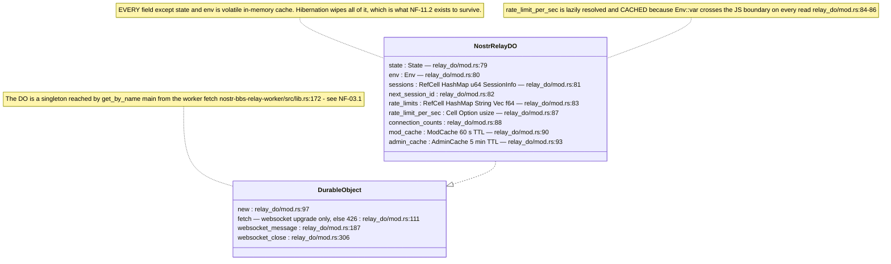

## NF-11.2 Hibernation — what survives, and why the challenge must not be re-minted

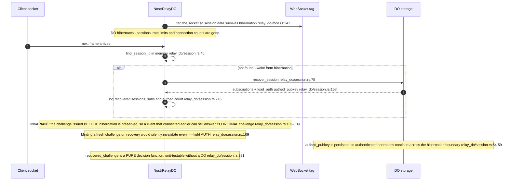

## NF-11.3 Frame dispatch

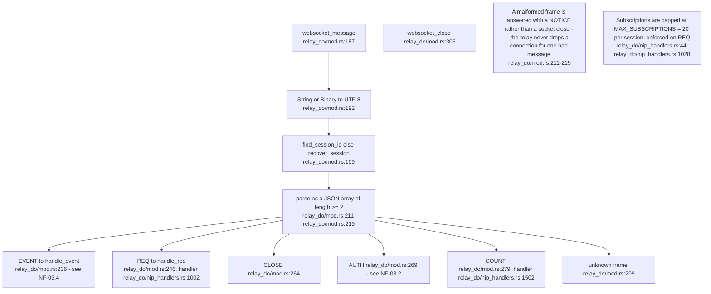

## NF-11.4 Storage — NIP-16 treatment decides what a save deletes

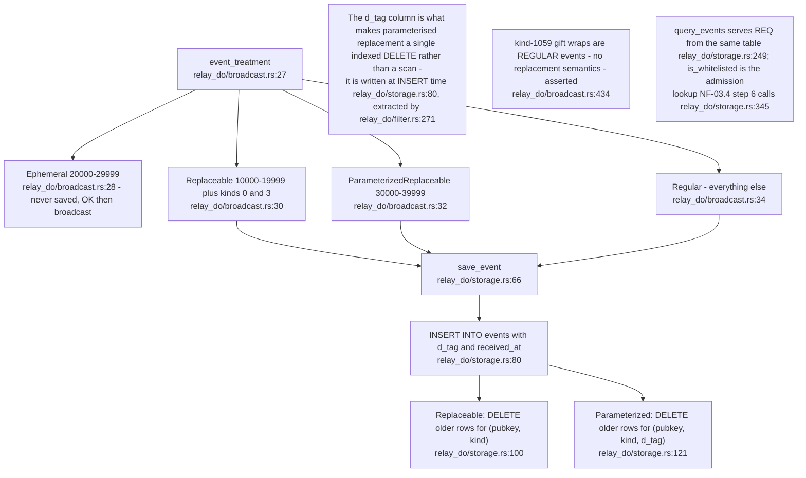

## NF-11.5 Broadcast — the kind-1059 delivery gate

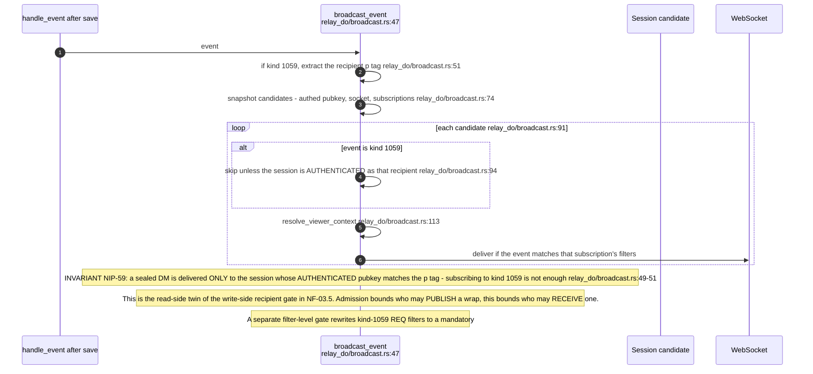

## NF-11.6 Subscription matching — the REQ filter predicate

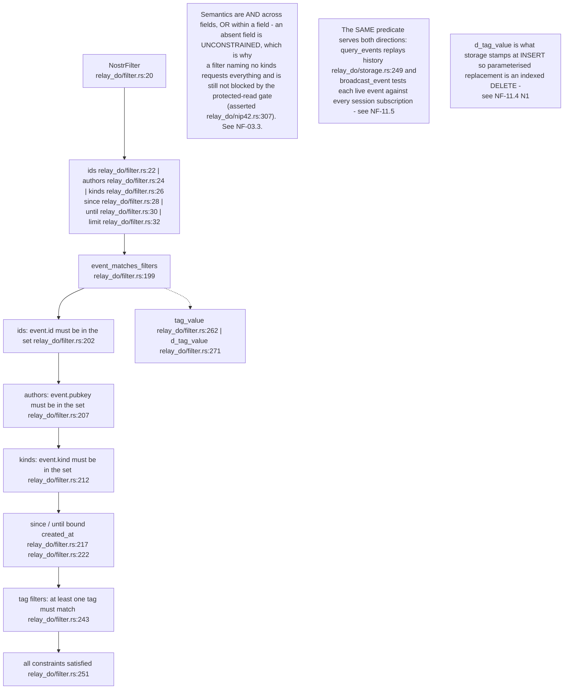

## NF-11.7 ModCache — a 60-second ban gate that fails CLOSED

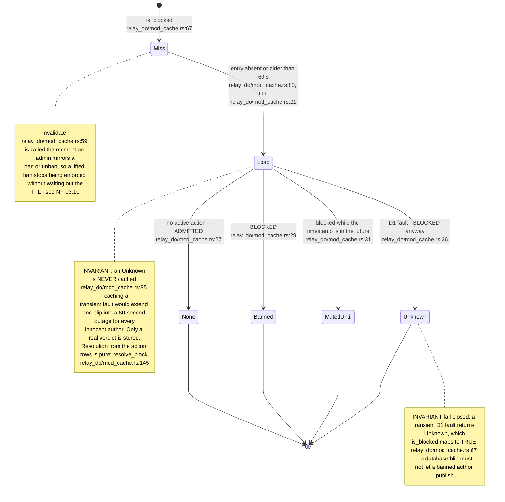

## NF-11.8 The tiered NIP-52 calendar projection — the README's "tiered calendar"

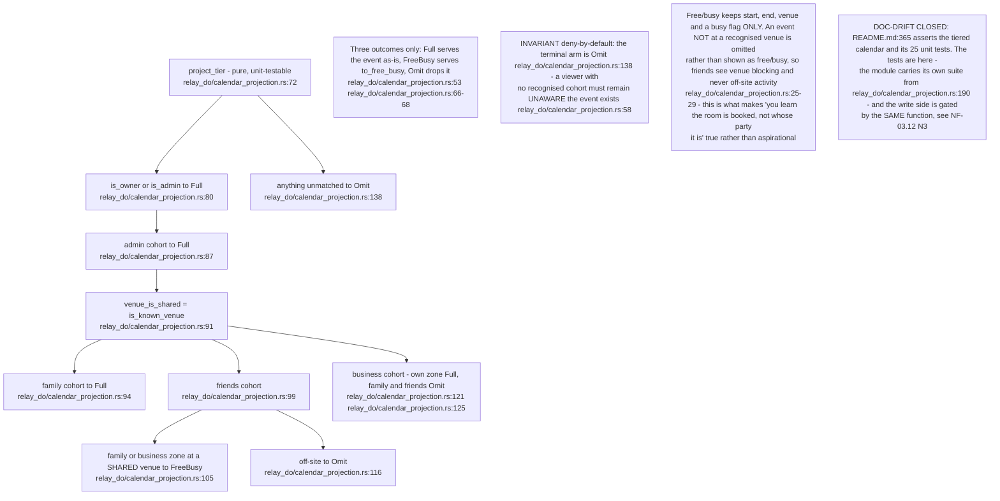

## NF-11.9 Governance receipts — ADR-2010 is implemented, not merely proposed

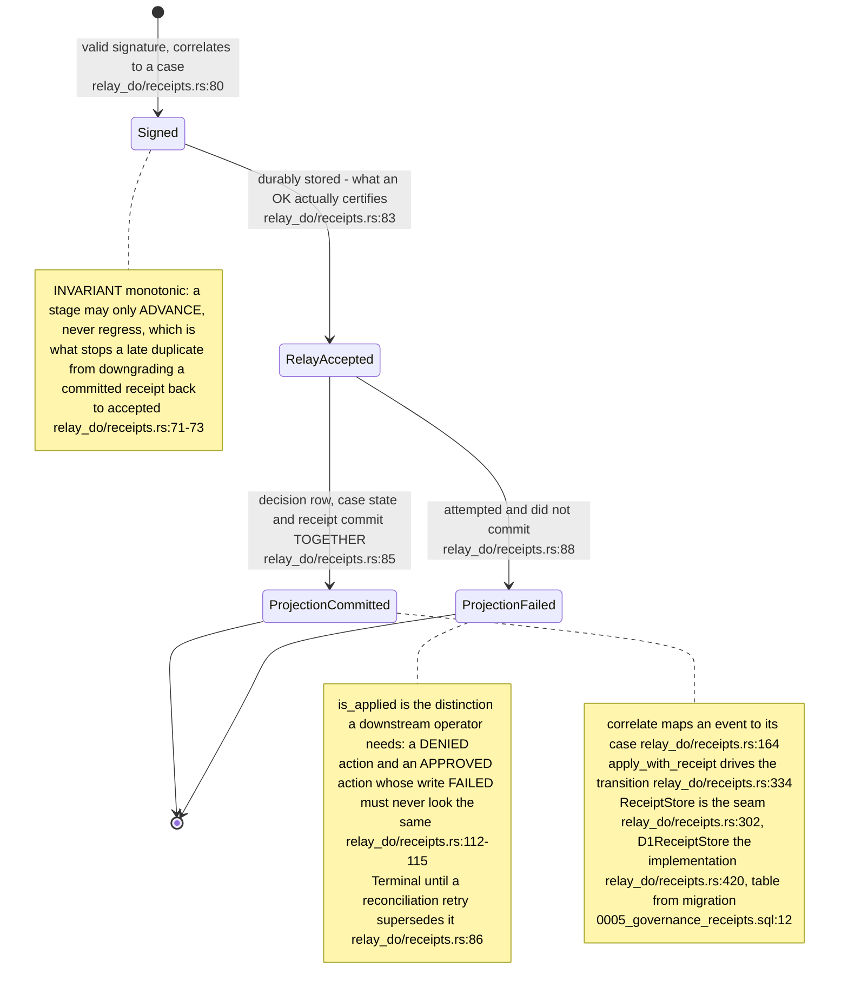

## NF-11.10 What ADR-2010 still leaves open

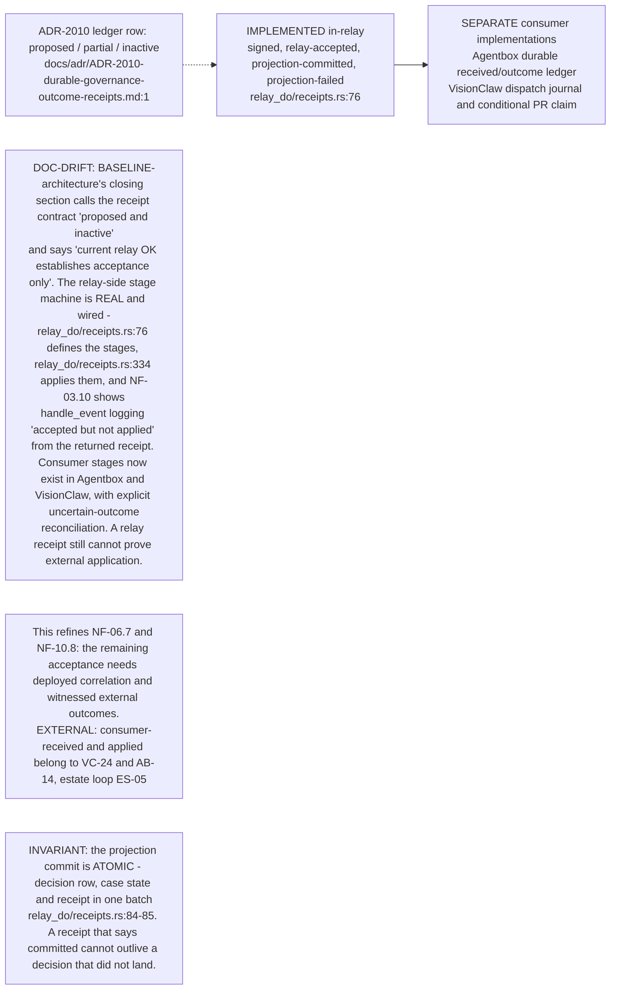

## NF-11.11 The trust demotion sweep — keyset paging, explicit outcomes

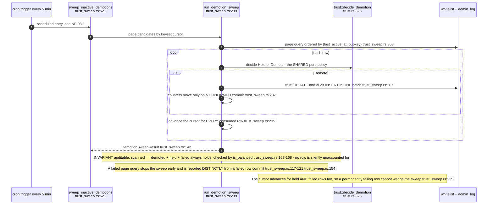

## NF-11.12 Why the sweep is keyset — and why the closeout qualification is now stale

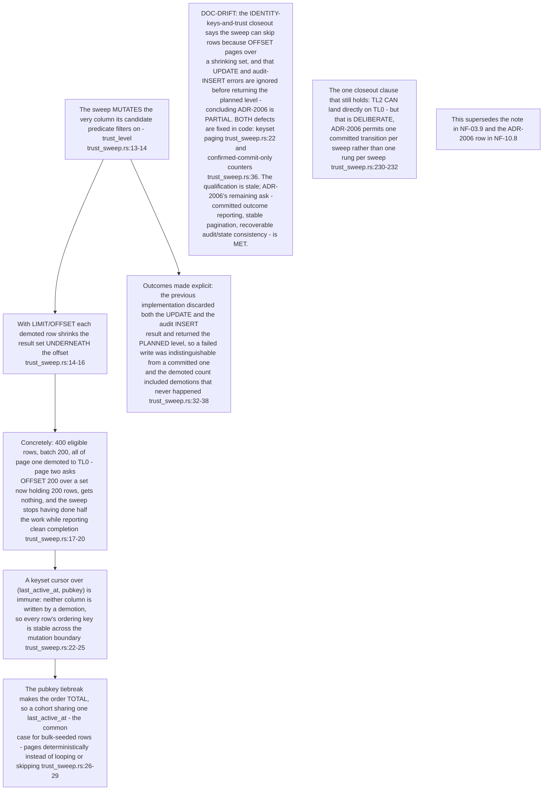

## NF-11.13 The other scheduled work

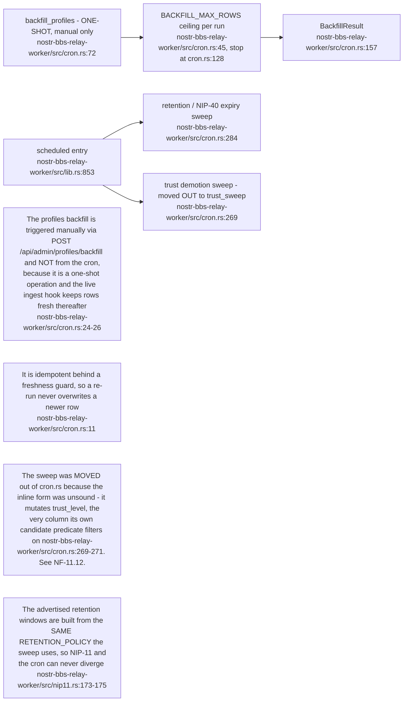

## NF-11.14 NIP-11 — the relay information document cannot lie about its own gate

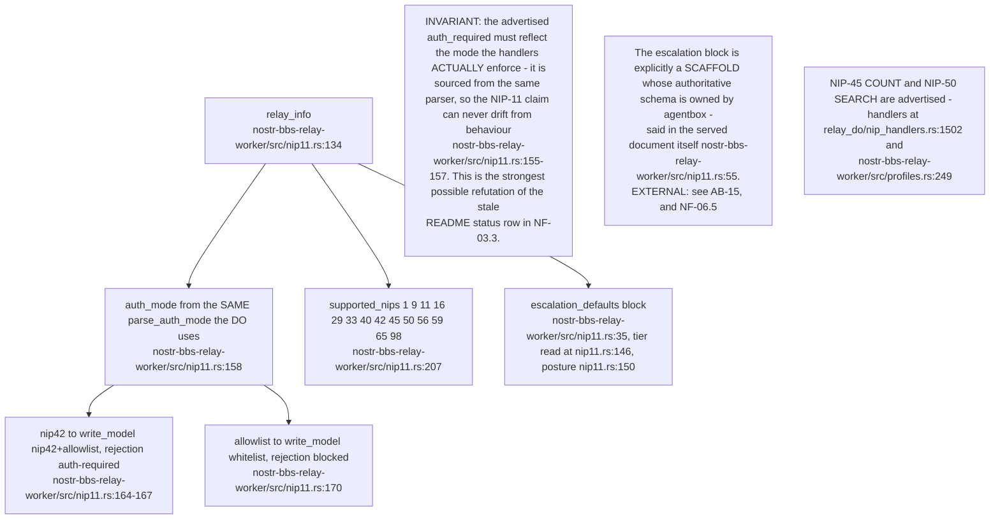

## NF-11.15 Admin and moderation surfaces on the worker

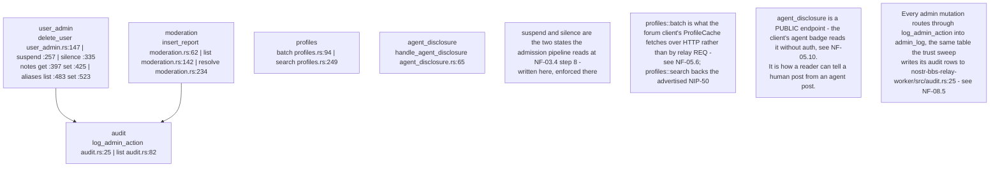
