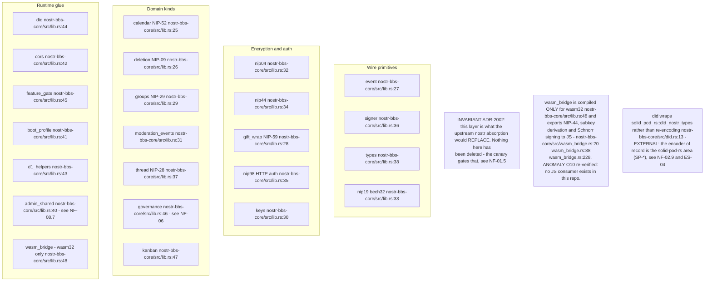
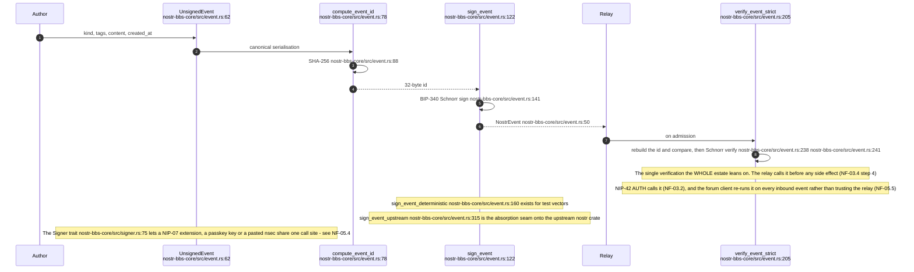
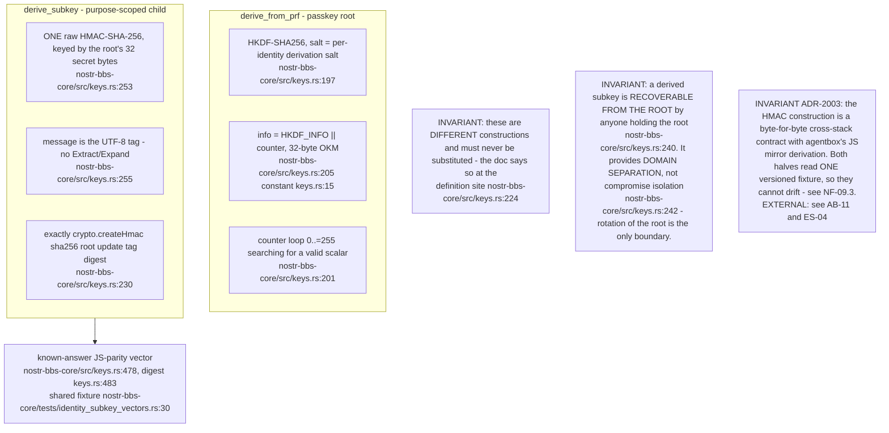
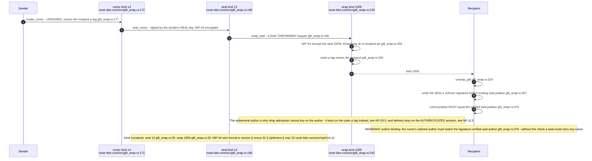
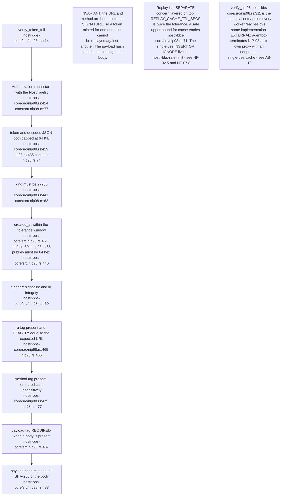
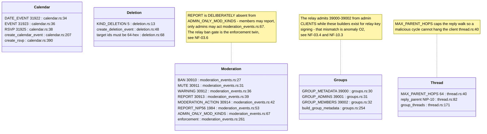
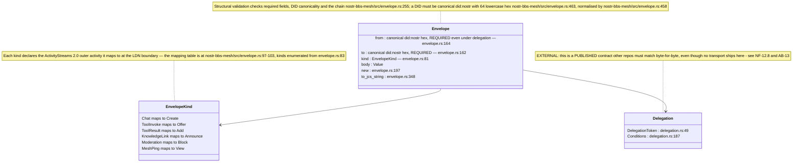
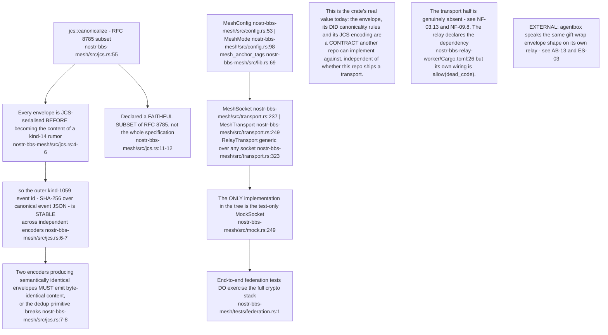

## NF-12.1 Module map — what the workers and clients all link

## NF-12.2 Event identity and the signing path

## NF-12.3 The two key derivations, side by side

## NF-12.4 NIP-59 gift wrap — three layers, and what each hides

## NF-12.5 NIP-98 — the ten checks every REST call passes

## NF-12.6 Domain kinds this crate owns

## NF-12.7 The IS-Envelope — a published cross-repo wire contract

## NF-12.8 Why JCS — and why federation is still not wired

## NF-12.9 Small shared surfaces with outsized reach

```mermaid
flowchart LR
    CORS["POD_CORS_HEADERS nostr-bbs-core/src/cors.rs:46<br/>STANDARD_CORS_HEADERS nostr-bbs-core/src/cors.rs:31"]
    FG["DEVICE_KEYS_ENABLED_VAR nostr-bbs-core/src/feature_gate.rs:42<br/>device_keys_enabled nostr-bbs-core/src/feature_gate.rs:64"]
    BP["BOOTPROFILE_MODE nostr-bbs-core/src/boot_profile.rs:41<br/>is_pwa_boot nostr-bbs-core/src/boot_profile.rs:97<br/>parse_boot_profile nostr-bbs-core/src/boot_profile.rs:107"]
    D1H["js_str D1 binding helper nostr-bbs-core/src/d1_helpers.rs:13"]
    N19["encode_npub nostr-bbs-core/src/nip19.rs:77 | decode_nsec nostr-bbs-core/src/nip19.rs:129<br/>encode_nprofile nostr-bbs-core/src/nip19.rs:180 | decode_naddr nostr-bbs-core/src/nip19.rs:249"]
    TYP["EventId nostr-bbs-core/src/types.rs:31 | PublicKey nostr-bbs-core/src/types.rs:108<br/>Timestamp nostr-bbs-core/src/types.rs:219 | Tag nostr-bbs-core/src/types.rs:253"]

    N1["feature_gate is why the two workers cannot disagree on what DEVICE_KEYS_ENABLED means - each reads its<br/>OWN binding but shares the PARSE rule, so ADR-2004's lockstep requirement holds by construction rather<br/>than by review - see NF-02.7 and NF-08.8"]
    N2["cors is why the pod worker's DPoP, Updates-Via, WAC and payment header envelope cannot drift per<br/>worker - see NF-04.1"]
    N3["boot_profile is consumed by the BBS client's zone-bound one-shot PWA - see NF-05.11"]
    N4["nip19 is the only place bech32 npub, nsec, nprofile and naddr are encoded; the recovery sheet's QR<br/>codes carry its output - see NF-05.8"]
```

