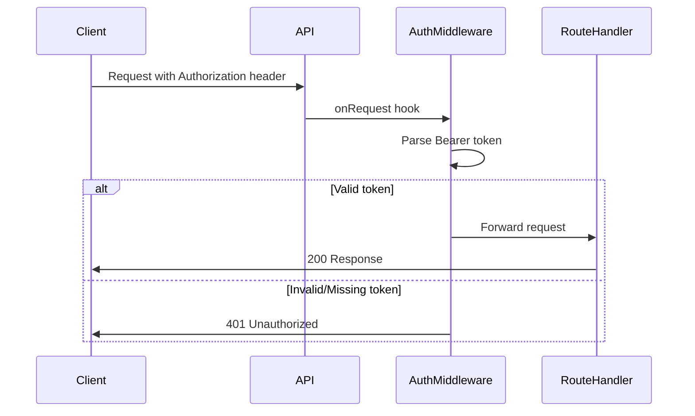
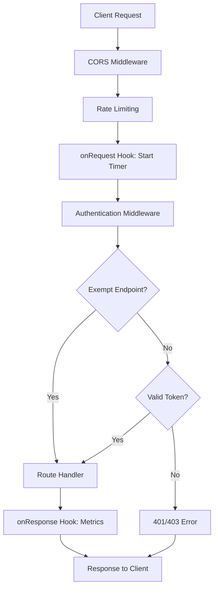
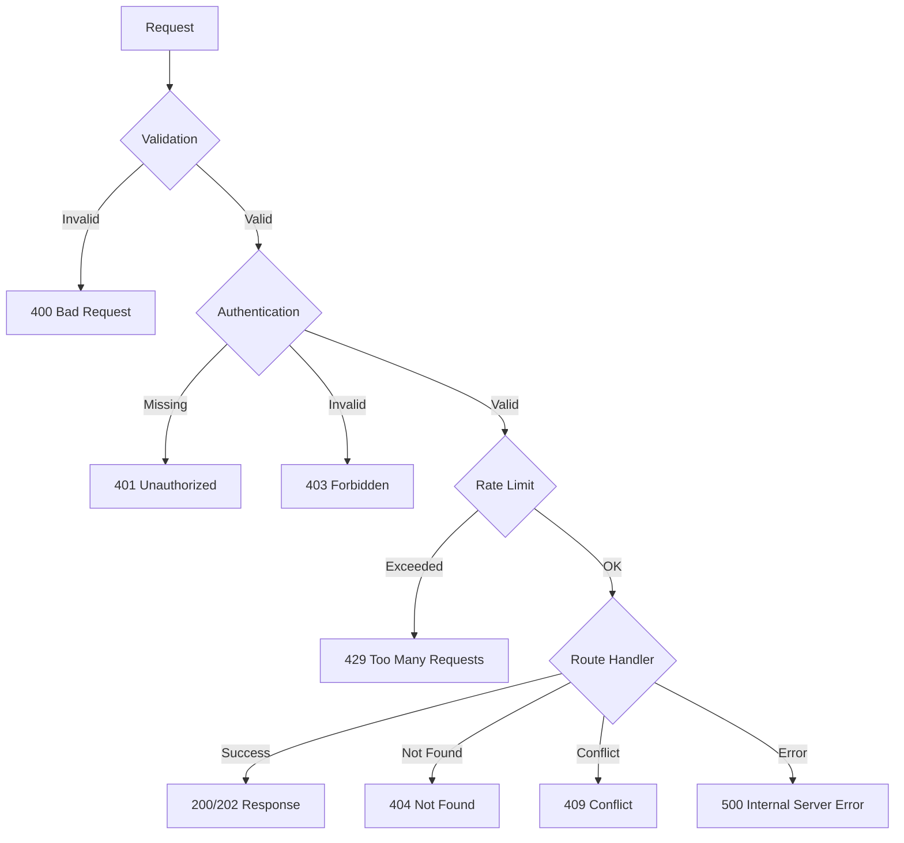
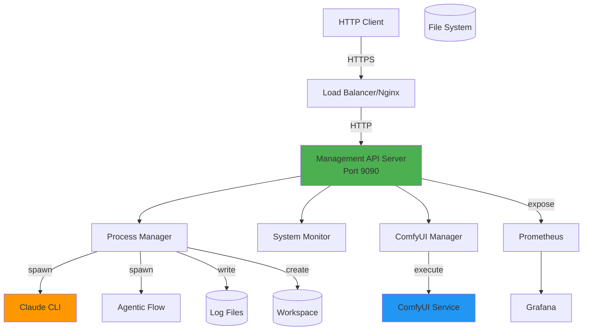
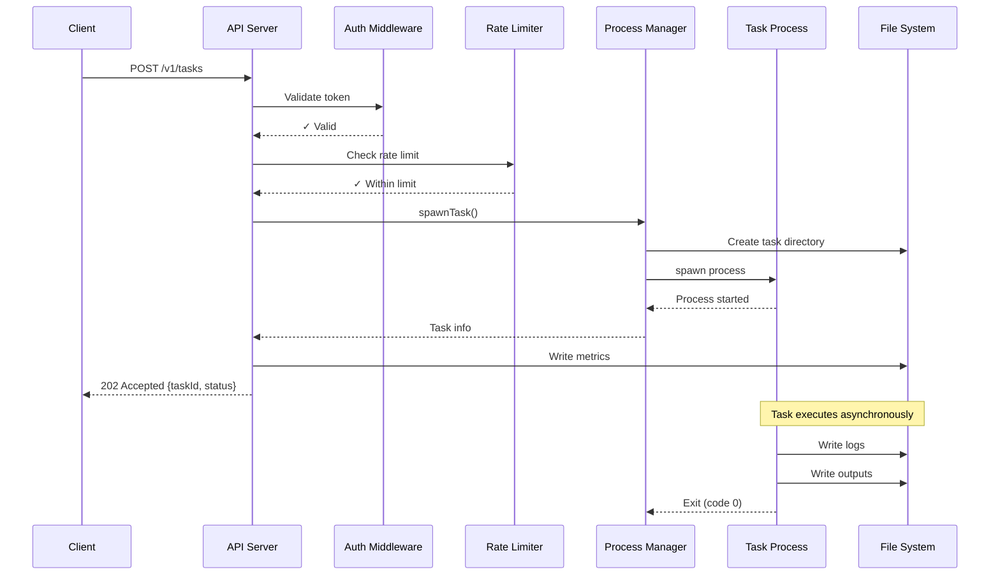

# REST API Architecture Documentation
## Agentic Flow Management API v2.1.0

**Base URL:** `http://localhost:9090`
**Framework:** Fastify 4.26.0
**Authentication:** Bearer Token (API Key)
**Documentation:** `/docs` (Swagger UI)
**Metrics:** `/metrics` (Prometheus)

---

## Table of Contents

1. [Overview](#overview)
2. [Authentication & Authorization](#authentication--authorization)
3. [Rate Limiting & Throttling](#rate-limiting--throttling)
4. [API Versioning Strategy](#api-versioning-strategy)
5. [Middleware Pipeline](#middleware-pipeline)
6. [Complete Endpoint Catalog](#complete-endpoint-catalog)
7. [Request/Response Formats](#requestresponse-formats)
8. [Error Handling & Status Codes](#error-handling--status-codes)
9. [Response Caching Strategies](#response-caching-strategies)
10. [API Gateway Patterns](#api-gateway-patterns)
11. [Request Validation & Sanitization](#request-validation--sanitization)
12. [OpenAPI/Swagger Specifications](#openapiswagger-specifications)
13. [Performance Metrics](#performance-metrics)

---

## Overview

The Agentic Flow Management API provides HTTP endpoints for managing AI agent workflows, ComfyUI image generation, system monitoring, and metrics collection. Built on Fastify for maximum performance with comprehensive middleware for security, logging, and observability.

### Architecture Principles

- **Container-native:** Designed for Docker/Kubernetes deployment
- **Observable:** Prometheus metrics, structured JSON logging (Pino)
- **Resilient:** Graceful shutdown, process isolation, automatic cleanup
- **Scalable:** Rate limiting, connection pooling, async-first design
- **Secure:** Bearer token authentication, input validation, CORS protection

### Technology Stack

| Component | Technology | Version |
|-----------|-----------|---------|
| Server Framework | Fastify | 4.26.0 |
| CORS | @fastify/cors | 9.0.1 |
| Rate Limiting | @fastify/rate-limit | 9.1.0 |
| WebSocket | @fastify/websocket | 10.0.1 |
| API Docs | @fastify/swagger + swagger-ui | 8.14.0 + 3.0.0 |
| Logger | Pino + pino-pretty | 8.19.0 + 11.0.0 |
| Metrics | prom-client | 15.1.0 |
| Process Management | Node.js child_process | Native |

---

## Authentication & Authorization

### Authentication Flow

**Scheme:** Bearer Token Authentication
**Header:** `Authorization: Bearer <token>`
**Alternative:** `X-API-Key: <token>` (legacy support)



### Authentication Middleware

**File:** `middleware/auth.js`

```javascript
function createAuthMiddleware(validToken) {
  return async function authMiddleware(request, reply) {
    const authHeader = request.headers.authorization;

    if (!authHeader) {
      return reply.code(401).send({
        error: 'Unauthorized',
        message: 'Missing Authorization header'
      });
    }

    const [type, token] = authHeader.split(' ');

    if (type !== 'Bearer' || !token) {
      return reply.code(401).send({
        error: 'Unauthorized',
        message: 'Invalid Authorization format. Expected: Bearer <token>'
      });
    }

    if (token !== validToken) {
      return reply.code(403).send({
        error: 'Forbidden',
        message: 'Invalid API token'
      });
    }
  };
}
```

### Exempt Endpoints

The following endpoints do **NOT** require authentication:

- `GET /health` - Health check probe
- `GET /ready` - Readiness probe
- `GET /metrics` - Prometheus metrics (internal network)

### Token Configuration

**Environment Variable:** `MANAGEMENT_API_KEY`
**Default:** `change-this-secret-key` ⚠️ **CHANGE IN PRODUCTION**

```bash
# Set custom API key
export MANAGEMENT_API_KEY="your-secure-api-key-here"
```

### Request Examples

**✅ Correct Authentication:**

```bash
# Bearer token format (preferred)
curl -H "Authorization: Bearer your-api-key" \
  http://localhost:9090/v1/status

# X-API-Key format (legacy)
curl -H "X-API-Key: your-api-key" \
  http://localhost:9090/v1/tasks
```

**❌ Authentication Errors:**

```bash
# Missing authentication
$ curl http://localhost:9090/v1/status
{
  "error": "Unauthorized",
  "message": "Missing Authorization header",
  "statusCode": 401
}

# Invalid token
$ curl -H "Authorization: Bearer wrong-token" \
  http://localhost:9090/v1/status
{
  "error": "Forbidden",
  "message": "Invalid API token",
  "statusCode": 403
}
```

---

## Rate Limiting & Throttling

### Rate Limit Configuration

**Plugin:** `@fastify/rate-limit` v9.1.0

```javascript
app.register(rateLimit, {
  max: 100,                    // Maximum requests per time window
  timeWindow: '1 minute',      // Time window (60 seconds)
  cache: 10000,                // Cache size for rate limit tracking
  allowList: ['127.0.0.1'],    // IPs exempt from rate limiting
  continueExceeding: true,     // Continue tracking after limit hit
  skipOnError: false           // Don't skip rate limiting on errors
});
```

### Rate Limit Headers

All responses include rate limit information:

```http
X-RateLimit-Limit: 100
X-RateLimit-Remaining: 87
X-RateLimit-Reset: 1702345678
```

### Rate Limit Exceeded Response

**Status Code:** `429 Too Many Requests`

```json
{
  "error": "Too Many Requests",
  "message": "Rate limit exceeded",
  "statusCode": 429,
  "retryAfter": 42
}
```

### Throttling Strategy

| User Type | Rate Limit | Time Window | Notes |
|-----------|-----------|-------------|-------|
| Standard | 100 req/min | 60 seconds | Default for all authenticated users |
| Localhost | Unlimited | N/A | `127.0.0.1` on allowList |
| Webhooks | 100 req/min | 60 seconds | Same as standard |
| Streaming | No limit | N/A | WebSocket/SSE connections not rate-limited |

### Bypass Rate Limiting

```bash
# Add to allowList in server.js
allowList: ['127.0.0.1', '10.0.0.0/8', 'your-trusted-ip']
```

---

## API Versioning Strategy

### Current Version: v1

**Versioning Scheme:** URL Path Versioning
**Format:** `/v{version}/{resource}`

```
/v1/tasks          ← Current version
/v1/comfyui        ← Current version
/v1/status         ← Current version
```

### Version Management

| Version | Status | Deprecation Date | End of Life |
|---------|--------|-----------------|-------------|
| v1 | Current | N/A | N/A |
| v2 | Planned | TBD | TBD |

### Version Header Support

```bash
# Optional: Specify API version via header
curl -H "Accept: application/vnd.agenticflow.v1+json" \
     -H "Authorization: Bearer token" \
     http://localhost:9090/tasks
```

### Breaking Change Policy

- **Major version bump** required for breaking changes
- **Deprecation warnings** provided 6 months before removal
- **Backward compatibility** maintained within major version
- **Migration guides** provided for version transitions

### Future Versioning

```
/v2/workflows      ← Future: Renamed from /tasks
/v2/images         ← Future: Renamed from /comfyui
/v2/health         ← Future: Enhanced monitoring
```

---

## Middleware Pipeline

### Request Lifecycle



### Middleware Execution Order

1. **CORS** (`@fastify/cors`) - Priority: 0
   - Origin validation
   - Credential handling
   - Preflight response

2. **Rate Limiting** (`@fastify/rate-limit`) - Priority: 1
   - Request counting
   - IP tracking
   - Limit enforcement

3. **onRequest Hook: Timer** - Priority: 2
   - Start request timer for metrics

4. **Authentication** - Priority: 3
   - Token validation
   - Endpoint exemption check

5. **WebSocket Upgrade** (`@fastify/websocket`) - Priority: 4
   - WebSocket connection handling

6. **Route Handler** - Priority: 5
   - Business logic execution

7. **onResponse Hook: Metrics** - Priority: 6
   - Record HTTP metrics
   - Calculate duration
   - Update Prometheus counters

8. **Error Handler** - Priority: 7
   - Catch all errors
   - Format error response
   - Record error metrics

### CORS Configuration

```javascript
app.register(cors, {
  origin: true,              // Allow all origins (configure for production)
  credentials: true,         // Allow cookies/auth headers
  methods: ['GET', 'POST', 'PUT', 'DELETE', 'PATCH', 'OPTIONS'],
  allowedHeaders: ['Authorization', 'Content-Type', 'X-API-Key'],
  exposedHeaders: ['X-RateLimit-Limit', 'X-RateLimit-Remaining']
});
```

### Request ID Tracking

Every request receives a unique ID for log correlation:

```json
{
  "reqId": "req-1a2b3c4d",
  "msg": "Request completed",
  "statusCode": 200,
  "responseTime": 42
}
```

### Trust Proxy Configuration

```javascript
const app = fastify({
  trustProxy: true,          // Trust X-Forwarded-* headers
  requestIdLogLabel: 'reqId',
  disableRequestLogging: false
});
```

---

## Complete Endpoint Catalog

### Endpoint Summary Table

| Method | Path | Auth | Description | Version |
|--------|------|------|-------------|---------|
| GET | `/` | ❌ | API information | v1 |
| GET | `/health` | ❌ | Health check | v1 |
| GET | `/ready` | ❌ | Readiness probe | v1 |
| GET | `/metrics` | ❌ | Prometheus metrics | v1 |
| GET | `/docs` | ❌ | Swagger UI | v1 |
| **Tasks** |
| POST | `/v1/tasks` | ✅ | Create task | v1 |
| GET | `/v1/tasks` | ✅ | List tasks | v1 |
| GET | `/v1/tasks/:taskId` | ✅ | Get task status | v1 |
| DELETE | `/v1/tasks/:taskId` | ✅ | Stop task | v1 |
| GET | `/v1/tasks/:taskId/logs/stream` | ✅ | Stream logs (SSE) | v1 |
| **ComfyUI** |
| POST | `/v1/comfyui/workflow` | ✅ | Submit workflow | v1 |
| GET | `/v1/comfyui/workflow/:workflowId` | ✅ | Workflow status | v1 |
| DELETE | `/v1/comfyui/workflow/:workflowId` | ✅ | Cancel workflow | v1 |
| GET | `/v1/comfyui/models` | ✅ | List models | v1 |
| GET | `/v1/comfyui/outputs` | ✅ | List outputs | v1 |
| WS | `/v1/comfyui/stream` | ✅ | WebSocket stream | v1 |
| **Monitoring** |
| GET | `/v1/status` | ✅ | System status | v1 |

---

## Request/Response Formats

### Root Endpoint

**GET /** - API Information

**Authentication:** Not required

**Response:** 200 OK
```json
{
  "name": "Agentic Flow Management API",
  "version": "2.1.0",
  "endpoints": {
    "tasks": {
      "create": "POST /v1/tasks",
      "get": "GET /v1/tasks/:taskId",
      "list": "GET /v1/tasks",
      "stop": "DELETE /v1/tasks/:taskId"
    },
    "comfyui": {
      "submit": "POST /v1/comfyui/workflow",
      "status": "GET /v1/comfyui/workflow/:workflowId",
      "cancel": "DELETE /v1/comfyui/workflow/:workflowId",
      "models": "GET /v1/comfyui/models",
      "outputs": "GET /v1/comfyui/outputs",
      "stream": "WS /v1/comfyui/stream"
    },
    "monitoring": {
      "status": "GET /v1/status",
      "health": "GET /health",
      "ready": "GET /ready",
      "metrics": "GET /metrics"
    }
  },
  "documentation": "/docs",
  "authentication": "X-API-Key header required (except /health, /ready, /metrics)"
}
```

---

### Health & Monitoring Endpoints

#### GET /health

**Purpose:** Kubernetes liveness probe, load balancer health check

**Authentication:** Not required

**Response:** 200 OK
```json
{
  "status": "healthy",
  "timestamp": "2025-12-05T10:30:00.000Z"
}
```

**Example:**
```bash
curl http://localhost:9090/health
```

---

#### GET /ready

**Purpose:** Kubernetes readiness probe

**Authentication:** Not required

**Response:** 200 OK
```json
{
  "ready": true,
  "activeTasks": 3,
  "timestamp": "2025-12-05T10:30:00.000Z"
}
```

**Example:**
```bash
curl http://localhost:9090/ready
```

---

#### GET /v1/status

**Purpose:** Comprehensive system health with GPU, providers, resources

**Authentication:** Required

**Response:** 200 OK
```json
{
  "timestamp": "2025-12-05T10:30:00.000Z",
  "api": {
    "uptime": 86400,
    "version": "1.0.0",
    "pid": 1234
  },
  "tasks": {
    "active": 3
  },
  "gpu": {
    "available": true,
    "gpus": [
      {
        "index": 0,
        "name": "NVIDIA GeForce RTX 4090",
        "utilization": 45.5,
        "memory": {
          "used": 8192.0,
          "total": 24576.0,
          "percentUsed": "33.33"
        },
        "temperature": 65.0
      }
    ]
  },
  "providers": {
    "gemini": "configured",
    "openai": "configured",
    "claude": "configured",
    "openrouter": "not_configured",
    "xinference": "disabled"
  },
  "system": {
    "cpu": {
      "loadAverage": {
        "load1": 2.5,
        "load5": 2.2,
        "load15": 1.8
      }
    },
    "memory": {
      "total": 32768,
      "used": 16384,
      "free": 16384,
      "percentUsed": "50.00"
    },
    "disk": {
      "size": "500G",
      "used": "250G",
      "available": "250G",
      "percentUsed": "50%"
    }
  }
}
```

**Example:**
```bash
curl -H "Authorization: Bearer your-api-key" \
  http://localhost:9090/v1/status
```

---

### Task Management Endpoints

#### POST /v1/tasks

**Purpose:** Create and start a new AI agent task

**Authentication:** Required

**Request Body:**
```json
{
  "agent": "coder",
  "task": "Build a REST API with Express",
  "provider": "claude-flow"
}
```

**Request Schema:**
```typescript
{
  agent: string;           // Agent type (required)
  task: string;            // Task description (required)
  provider?: string;       // Provider: claude-flow, gemini, openai (default: claude-flow)
}
```

**Response:** 202 Accepted
```json
{
  "taskId": "550e8400-e29b-41d4-a716-446655440000",
  "status": "accepted",
  "message": "Task started successfully",
  "taskDir": "/home/devuser/workspace/tasks/550e8400-e29b-41d4-a716-446655440000",
  "logFile": "/home/devuser/logs/tasks/550e8400-e29b-41d4-a716-446655440000.log"
}
```

**Error Response:** 500 Internal Server Error
```json
{
  "error": "Internal Server Error",
  "message": "Failed to start task",
  "details": "spawn claude ENOENT",
  "statusCode": 500
}
```

**Example:**
```bash
curl -X POST http://localhost:9090/v1/tasks \
  -H "Authorization: Bearer your-api-key" \
  -H "Content-Type: application/json" \
  -d '{
    "agent": "coder",
    "task": "Create a React component with hooks",
    "provider": "claude-flow"
  }'
```

---

#### GET /v1/tasks/:taskId

**Purpose:** Get task status and log tail

**Authentication:** Required

**Path Parameters:**
- `taskId` (string) - Task UUID

**Response:** 200 OK
```json
{
  "taskId": "550e8400-e29b-41d4-a716-446655440000",
  "agent": "coder",
  "task": "Build a REST API with Express",
  "provider": "claude-flow",
  "status": "running",
  "startTime": 1702345678000,
  "exitTime": null,
  "exitCode": null,
  "duration": 42000,
  "logTail": "[2025-12-05 10:30:00] Starting task...\n[2025-12-05 10:30:01] Loading agent...\n..."
}
```

**Status Values:**
- `running` - Task currently executing
- `completed` - Task finished successfully (exitCode 0)
- `failed` - Task exited with error (exitCode != 0)
- `stopped` - Task manually stopped via DELETE

**Error Response:** 404 Not Found
```json
{
  "error": "Not Found",
  "message": "Task 550e8400-e29b-41d4-a716-446655440000 not found",
  "statusCode": 404
}
```

**Example:**
```bash
curl -H "Authorization: Bearer your-api-key" \
  http://localhost:9090/v1/tasks/550e8400-e29b-41d4-a716-446655440000
```

---

#### GET /v1/tasks

**Purpose:** List all active tasks

**Authentication:** Required

**Response:** 200 OK
```json
{
  "activeTasks": [
    {
      "taskId": "550e8400-e29b-41d4-a716-446655440000",
      "agent": "coder",
      "startTime": 1702345678000,
      "duration": 42000
    },
    {
      "taskId": "660e8400-e29b-41d4-a716-446655440001",
      "agent": "researcher",
      "startTime": 1702345680000,
      "duration": 40000
    }
  ],
  "count": 2
}
```

**Example:**
```bash
curl -H "Authorization: Bearer your-api-key" \
  http://localhost:9090/v1/tasks
```

---

#### DELETE /v1/tasks/:taskId

**Purpose:** Stop a running task (sends SIGTERM)

**Authentication:** Required

**Path Parameters:**
- `taskId` (string) - Task UUID

**Response:** 200 OK
```json
{
  "taskId": "550e8400-e29b-41d4-a716-446655440000",
  "status": "stopped",
  "message": "Task stop signal sent successfully"
}
```

**Error Responses:**

**404 Not Found:**
```json
{
  "error": "Not Found",
  "message": "Task 550e8400-e29b-41d4-a716-446655440000 not found",
  "statusCode": 404
}
```

**409 Conflict:**
```json
{
  "error": "Conflict",
  "message": "Task 550e8400-e29b-41d4-a716-446655440000 cannot be stopped",
  "currentStatus": "completed",
  "statusCode": 409
}
```

**Example:**
```bash
curl -X DELETE \
  -H "Authorization: Bearer your-api-key" \
  http://localhost:9090/v1/tasks/550e8400-e29b-41d4-a716-446655440000
```

**Behavior:**
1. Sends `SIGTERM` to task process
2. Updates status to `stopped`
3. Schedules `SIGKILL` after 10 seconds if process doesn't exit
4. Returns immediately (non-blocking)

---

#### GET /v1/tasks/:taskId/logs/stream

**Purpose:** Stream task logs in real-time using Server-Sent Events (SSE)

**Authentication:** Required

**Path Parameters:**
- `taskId` (string) - Task UUID

**Response Headers:**
```http
Content-Type: text/event-stream
Cache-Control: no-cache
Connection: keep-alive
X-Accel-Buffering: no
```

**Event Format:**
```
data: {"line":"[2025-12-05 10:30:00] Starting task...","timestamp":1702345678000}

data: {"line":"[2025-12-05 10:30:01] Loading agent...","timestamp":1702345679000}

: heartbeat

event: task-complete
data: {"status":"completed","exitCode":0,"timestamp":1702345700000}
```

**Event Types:**
- `data` - Log line with timestamp
- `: heartbeat` - Keepalive every 30 seconds
- `event: task-complete` - Task finished (with status and exitCode)

**Example (curl):**
```bash
curl -N -H "Authorization: Bearer your-api-key" \
  http://localhost:9090/v1/tasks/550e8400-e29b-41d4-a716-446655440000/logs/stream
```

**Example (JavaScript):**
```javascript
const eventSource = new EventSource(
  'http://localhost:9090/v1/tasks/550e8400-e29b-41d4-a716-446655440000/logs/stream',
  {
    headers: {
      'Authorization': 'Bearer your-api-key'
    }
  }
);

eventSource.onmessage = (event) => {
  const data = JSON.parse(event.data);
  console.log(data.line);
};

eventSource.addEventListener('task-complete', (event) => {
  const data = JSON.parse(event.data);
  console.log('Task completed:', data.status);
  eventSource.close();
});

eventSource.onerror = (error) => {
  console.error('SSE error:', error);
  eventSource.close();
};
```

---

### ComfyUI Workflow Endpoints

#### POST /v1/comfyui/workflow

**Purpose:** Submit ComfyUI workflow for image generation

**Authentication:** Required

**Request Body:**
```json
{
  "workflow": {
    "nodes": [...],
    "links": [...],
    "groups": [],
    "config": {}
  },
  "priority": "normal",
  "gpu": "local"
}
```

**Request Schema:**
```typescript
{
  workflow: object;           // ComfyUI workflow JSON (required)
  priority?: 'low' | 'normal' | 'high';  // Default: normal
  gpu?: 'local' | 'salad';    // GPU target (default: local)
}
```

**Response:** 202 Accepted
```json
{
  "workflowId": "770e8400-e29b-41d4-a716-446655440000",
  "status": "queued",
  "queuePosition": 2
}
```

**Example:**
```bash
curl -X POST http://localhost:9090/v1/comfyui/workflow \
  -H "Authorization: Bearer your-api-key" \
  -H "Content-Type: application/json" \
  -d @workflow.json
```

---

#### GET /v1/comfyui/workflow/:workflowId

**Purpose:** Get workflow execution status and progress

**Authentication:** Required

**Path Parameters:**
- `workflowId` (string) - Workflow UUID

**Response:** 200 OK
```json
{
  "workflowId": "770e8400-e29b-41d4-a716-446655440000",
  "status": "running",
  "progress": 65,
  "currentNode": "node_6",
  "startTime": 1702345678000,
  "completionTime": null,
  "outputs": [],
  "error": null
}
```

**Status Values:**
- `queued` - Waiting in queue
- `running` - Currently executing
- `completed` - Successfully finished
- `cancelled` - Cancelled by user
- `failed` - Error during execution

**Example:**
```bash
curl -H "Authorization: Bearer your-api-key" \
  http://localhost:9090/v1/comfyui/workflow/770e8400-e29b-41d4-a716-446655440000
```

---

#### DELETE /v1/comfyui/workflow/:workflowId

**Purpose:** Cancel a running or queued workflow

**Authentication:** Required

**Path Parameters:**
- `workflowId` (string) - Workflow UUID

**Response:** 200 OK
```json
{
  "workflowId": "770e8400-e29b-41d4-a716-446655440000",
  "status": "cancelled"
}
```

**Error Responses:**

**404 Not Found:**
```json
{
  "error": "Not Found",
  "message": "Workflow 770e8400-e29b-41d4-a716-446655440000 not found"
}
```

**409 Conflict:**
```json
{
  "error": "Conflict",
  "message": "Workflow cannot be cancelled",
  "currentStatus": "completed"
}
```

**Example:**
```bash
curl -X DELETE \
  -H "Authorization: Bearer your-api-key" \
  http://localhost:9090/v1/comfyui/workflow/770e8400-e29b-41d4-a716-446655440000
```

---

#### GET /v1/comfyui/models

**Purpose:** List available ComfyUI models

**Authentication:** Required

**Query Parameters:**
- `type` (optional) - Filter by model type: `checkpoints`, `loras`, `vae`, `controlnet`, `upscale`

**Response:** 200 OK
```json
{
  "models": [
    {
      "name": "sd_xl_base_1.0.safetensors",
      "type": "checkpoints",
      "size": 6938034832,
      "hash": null
    },
    {
      "name": "sd_xl_refiner_1.0.safetensors",
      "type": "checkpoints",
      "size": 6075981930,
      "hash": null
    },
    {
      "name": "detail-tweaker-xl.safetensors",
      "type": "loras",
      "size": 143131746,
      "hash": null
    }
  ]
}
```

**Example:**
```bash
# List all models
curl -H "Authorization: Bearer your-api-key" \
  http://localhost:9090/v1/comfyui/models

# List only checkpoints
curl -H "Authorization: Bearer your-api-key" \
  "http://localhost:9090/v1/comfyui/models?type=checkpoints"

# List only LoRAs
curl -H "Authorization: Bearer your-api-key" \
  "http://localhost:9090/v1/comfyui/models?type=loras"
```

---

#### GET /v1/comfyui/outputs

**Purpose:** List generated workflow outputs

**Authentication:** Required

**Query Parameters:**
- `workflowId` (optional) - Filter by workflow ID
- `limit` (optional) - Max results (default: 50)

**Response:** 200 OK
```json
{
  "outputs": [
    {
      "filename": "770e8400-e29b-41d4-a716-446655440000_00001.png",
      "workflowId": "770e8400-e29b-41d4-a716-446655440000",
      "type": "png",
      "size": 2457600,
      "createdAt": 1702345700000,
      "url": "/v1/comfyui/output/770e8400-e29b-41d4-a716-446655440000_00001.png"
    },
    {
      "filename": "770e8400-e29b-41d4-a716-446655440000_00002.png",
      "workflowId": "770e8400-e29b-41d4-a716-446655440000",
      "type": "png",
      "size": 2398476,
      "createdAt": 1702345705000,
      "url": "/v1/comfyui/output/770e8400-e29b-41d4-a716-446655440000_00002.png"
    }
  ]
}
```

**Example:**
```bash
# List all outputs
curl -H "Authorization: Bearer your-api-key" \
  http://localhost:9090/v1/comfyui/outputs

# List outputs for specific workflow
curl -H "Authorization: Bearer your-api-key" \
  "http://localhost:9090/v1/comfyui/outputs?workflowId=770e8400-e29b-41d4-a716-446655440000"

# Limit results
curl -H "Authorization: Bearer your-api-key" \
  "http://localhost:9090/v1/comfyui/outputs?limit=10"
```

---

#### WS /v1/comfyui/stream

**Purpose:** WebSocket for real-time workflow updates

**Authentication:** Required (via query parameter or Sec-WebSocket-Protocol header)

**Connection:**
```javascript
const ws = new WebSocket(
  'ws://localhost:9090/v1/comfyui/stream',
  ['Bearer', 'your-api-key']
);
```

**Client Messages:**
```json
// Subscribe to workflow updates
{
  "type": "subscribe",
  "workflowId": "770e8400-e29b-41d4-a716-446655440000"
}

// Unsubscribe from workflow
{
  "type": "unsubscribe",
  "workflowId": "770e8400-e29b-41d4-a716-446655440000"
}

// Ping (keepalive)
{
  "type": "ping"
}
```

**Server Events:**
```json
// Workflow queued
{
  "type": "workflow:queued",
  "workflowId": "770e8400-e29b-41d4-a716-446655440000",
  "queuePosition": 2,
  "timestamp": 1702345678000
}

// Workflow started
{
  "type": "workflow:started",
  "workflowId": "770e8400-e29b-41d4-a716-446655440000",
  "timestamp": 1702345680000
}

// Progress update
{
  "type": "workflow:progress",
  "workflowId": "770e8400-e29b-41d4-a716-446655440000",
  "progress": 65,
  "currentNode": "node_6",
  "timestamp": 1702345690000
}

// Workflow completed
{
  "type": "workflow:completed",
  "workflowId": "770e8400-e29b-41d4-a716-446655440000",
  "duration": 42.5,
  "timestamp": 1702345720000
}

// Pong response
{
  "type": "pong"
}
```

**Example (JavaScript):**
```javascript
const ws = new WebSocket(
  'ws://localhost:9090/v1/comfyui/stream',
  ['Bearer', 'your-api-key']
);

ws.onopen = () => {
  // Subscribe to workflow
  ws.send(JSON.stringify({
    type: 'subscribe',
    workflowId: '770e8400-e29b-41d4-a716-446655440000'
  }));

  // Send periodic pings
  setInterval(() => {
    ws.send(JSON.stringify({ type: 'ping' }));
  }, 30000);
};

ws.onmessage = (event) => {
  const data = JSON.parse(event.data);

  switch(data.type) {
    case 'workflow:progress':
      console.log(`Progress: ${data.progress}% - ${data.currentNode}`);
      break;
    case 'workflow:completed':
      console.log(`Completed in ${data.duration}s`);
      ws.close();
      break;
  }
};

ws.onerror = (error) => {
  console.error('WebSocket error:', error);
};

ws.onclose = () => {
  console.log('WebSocket closed');
};
```

---

## Error Handling & Status Codes

### HTTP Status Codes

| Code | Name | Description | Usage |
|------|------|-------------|-------|
| 200 | OK | Request succeeded | GET requests |
| 202 | Accepted | Async request accepted | POST /tasks, POST /workflow |
| 400 | Bad Request | Invalid request body/parameters | Validation errors |
| 401 | Unauthorized | Missing authentication | No Authorization header |
| 403 | Forbidden | Invalid authentication | Wrong token |
| 404 | Not Found | Resource not found | Unknown taskId/workflowId |
| 409 | Conflict | Resource state conflict | Stop completed task |
| 429 | Too Many Requests | Rate limit exceeded | >100 req/min |
| 500 | Internal Server Error | Server-side error | Process spawn failure |
| 503 | Service Unavailable | Server overloaded | Too many active tasks |

### Error Response Format

All errors follow consistent JSON structure:

```json
{
  "error": "Error Name",
  "message": "Human-readable error description",
  "statusCode": 500,
  "details": "Optional additional context"
}
```

### Error Handling Flow



### Global Error Handler

**File:** `server.js`

```javascript
app.setErrorHandler((error, request, reply) => {
  logger.error({ error, reqId: request.id }, 'Request error');

  // Record error in metrics
  metrics.recordError(
    error.name || 'UnknownError',
    request.routerPath || request.url
  );

  reply.code(error.statusCode || 500).send({
    error: error.name || 'Internal Server Error',
    message: error.message,
    statusCode: error.statusCode || 500
  });
});
```

### Common Error Examples

**400 Bad Request:**
```json
{
  "error": "Bad Request",
  "message": "body must have required property 'agent'",
  "statusCode": 400
}
```

**401 Unauthorized:**
```json
{
  "error": "Unauthorized",
  "message": "Missing Authorization header",
  "statusCode": 401
}
```

**403 Forbidden:**
```json
{
  "error": "Forbidden",
  "message": "Invalid API token",
  "statusCode": 403
}
```

**404 Not Found:**
```json
{
  "error": "Not Found",
  "message": "Task 550e8400-e29b-41d4-a716-446655440000 not found",
  "statusCode": 404
}
```

**429 Too Many Requests:**
```json
{
  "error": "Too Many Requests",
  "message": "Rate limit exceeded",
  "statusCode": 429,
  "retryAfter": 42
}
```

**500 Internal Server Error:**
```json
{
  "error": "Internal Server Error",
  "message": "Failed to start task",
  "statusCode": 500,
  "details": "spawn claude ENOENT"
}
```

---

## Response Caching Strategies

### Cache-Control Headers

```javascript
// No caching for dynamic endpoints
reply.header('Cache-Control', 'no-store, no-cache, must-revalidate');

// Short cache for status endpoints
reply.header('Cache-Control', 'public, max-age=5');

// Long cache for static resources
reply.header('Cache-Control', 'public, max-age=31536000, immutable');
```

### Endpoint Caching Strategy

| Endpoint | Strategy | TTL | Reasoning |
|----------|----------|-----|-----------|
| `/v1/tasks` | No cache | 0s | Real-time task list |
| `/v1/tasks/:id` | No cache | 0s | Real-time status |
| `/v1/status` | Short cache | 5s | System metrics change slowly |
| `/health` | Short cache | 10s | Health rarely changes |
| `/metrics` | No cache | 0s | Prometheus scrapes need fresh data |
| `/v1/comfyui/models` | Medium cache | 300s | Models change infrequently |
| `/v1/comfyui/outputs` | Short cache | 30s | New outputs arrive periodically |

### ETag Support

```javascript
// Calculate ETag for response
const etag = crypto
  .createHash('md5')
  .update(JSON.stringify(responseData))
  .digest('hex');

reply.header('ETag', `"${etag}"`);

// Check If-None-Match header
if (request.headers['if-none-match'] === `"${etag}"`) {
  return reply.code(304).send();
}
```

### Compression

```javascript
// Fastify automatically compresses responses > 1KB
app.register(require('@fastify/compress'), {
  global: true,
  threshold: 1024,
  encodings: ['gzip', 'deflate', 'br']
});
```

---

## API Gateway Patterns

### Reverse Proxy Configuration (Nginx)

```nginx
upstream management_api {
  server localhost:9090;
  keepalive 64;
}

server {
  listen 80;
  server_name api.example.com;

  location /api/ {
    proxy_pass http://management_api/;
    proxy_http_version 1.1;
    proxy_set_header Connection "";
    proxy_set_header Host $host;
    proxy_set_header X-Real-IP $remote_addr;
    proxy_set_header X-Forwarded-For $proxy_add_x_forwarded_for;
    proxy_set_header X-Forwarded-Proto $scheme;

    # WebSocket support
    proxy_set_header Upgrade $http_upgrade;
    proxy_set_header Connection "upgrade";

    # SSE support
    proxy_buffering off;
    proxy_cache off;
    proxy_read_timeout 86400s;
  }

  # Rate limiting at gateway level
  limit_req_zone $binary_remote_addr zone=api_limit:10m rate=100r/m;
  limit_req zone=api_limit burst=20 nodelay;
}
```

### Load Balancing

```nginx
upstream management_api_cluster {
  least_conn;

  server api1:9090 max_fails=3 fail_timeout=30s;
  server api2:9090 max_fails=3 fail_timeout=30s;
  server api3:9090 max_fails=3 fail_timeout=30s;

  keepalive 128;
}
```

### Circuit Breaker Pattern

```javascript
// In production, use resilience libraries like opossum
const CircuitBreaker = require('opossum');

const options = {
  timeout: 30000,           // 30s timeout
  errorThresholdPercentage: 50,
  resetTimeout: 30000       // Try again after 30s
};

const breaker = new CircuitBreaker(processManager.spawnTask, options);

breaker.fallback(() => ({
  error: 'Service temporarily unavailable',
  message: 'Circuit breaker open - too many failures',
  statusCode: 503
}));
```

### Service Mesh Integration (Kubernetes)

```yaml
apiVersion: v1
kind: Service
metadata:
  name: management-api
  labels:
    app: management-api
spec:
  selector:
    app: management-api
  ports:
    - name: http
      port: 9090
      targetPort: 9090
    - name: metrics
      port: 9091
      targetPort: 9091
  type: ClusterIP
---
apiVersion: networking.istio.io/v1beta1
kind: VirtualService
metadata:
  name: management-api
spec:
  hosts:
    - management-api
  http:
    - match:
        - uri:
            prefix: /v1/
      route:
        - destination:
            host: management-api
            port:
              number: 9090
      timeout: 300s
      retries:
        attempts: 3
        perTryTimeout: 60s
```

---

## Request Validation & Sanitization

### JSON Schema Validation

Fastify uses JSON Schema for automatic request/response validation:

```javascript
fastify.post('/v1/tasks', {
  schema: {
    body: {
      type: 'object',
      required: ['agent', 'task'],
      properties: {
        agent: {
          type: 'string',
          minLength: 1,
          maxLength: 100
        },
        task: {
          type: 'string',
          minLength: 1,
          maxLength: 10000
        },
        provider: {
          type: 'string',
          enum: ['claude-flow', 'gemini', 'openai'],
          default: 'claude-flow'
        }
      },
      additionalProperties: false
    },
    response: {
      202: {
        type: 'object',
        properties: {
          taskId: { type: 'string' },
          status: { type: 'string' },
          message: { type: 'string' }
        }
      }
    }
  }
}, async (request, reply) => {
  // Request body is already validated
  const { agent, task, provider } = request.body;
  // ...
});
```

### Input Sanitization

```javascript
// UUID validation
const UUID_REGEX = /^[0-9a-f]{8}-[0-9a-f]{4}-[0-9a-f]{4}-[0-9a-f]{4}-[0-9a-f]{12}$/i;

function validateTaskId(taskId) {
  if (!UUID_REGEX.test(taskId)) {
    throw new Error('Invalid task ID format');
  }
  return taskId;
}

// Path traversal prevention
function sanitizeFilename(filename) {
  return path.basename(filename).replace(/[^a-z0-9_.-]/gi, '_');
}

// Command injection prevention
function sanitizeTaskDescription(task) {
  // Remove shell metacharacters
  return task.replace(/[;&|<>$`\\]/g, '');
}
```

### Content-Type Validation

```javascript
app.addHook('preHandler', (request, reply, done) => {
  if (['POST', 'PUT', 'PATCH'].includes(request.method)) {
    const contentType = request.headers['content-type'];

    if (!contentType || !contentType.includes('application/json')) {
      return reply.code(415).send({
        error: 'Unsupported Media Type',
        message: 'Content-Type must be application/json'
      });
    }
  }
  done();
});
```

### Size Limits

```javascript
const app = fastify({
  bodyLimit: 10485760,  // 10MB max body size
  requestIdHeader: 'x-request-id',
  trustProxy: true
});
```

---

## OpenAPI/Swagger Specifications

### Accessing API Documentation

**Swagger UI:** `http://localhost:9090/docs`
**OpenAPI JSON:** `http://localhost:9090/docs/json`
**OpenAPI YAML:** `http://localhost:9090/docs/yaml`

### OpenAPI Configuration

```javascript
app.register(require('@fastify/swagger'), {
  openapi: {
    openapi: '3.0.0',
    info: {
      title: 'Agentic Flow Management API',
      description: 'HTTP API for managing AI agent workflows and MCP tools',
      version: '2.1.0',
      contact: {
        name: 'Agentic Flow',
        url: 'https://github.com/ruvnet/agentic-flow'
      },
      license: {
        name: 'MIT',
        url: 'https://opensource.org/licenses/MIT'
      }
    },
    servers: [
      {
        url: 'http://localhost:9090',
        description: 'Development server'
      },
      {
        url: 'https://api.example.com',
        description: 'Production server'
      }
    ],
    components: {
      securitySchemes: {
        apiKey: {
          type: 'apiKey',
          name: 'X-API-Key',
          in: 'header',
          description: 'API key for authentication'
        },
        bearerAuth: {
          type: 'http',
          scheme: 'bearer',
          bearerFormat: 'JWT'
        }
      }
    },
    security: [
      { apiKey: [] },
      { bearerAuth: [] }
    ],
    tags: [
      {
        name: 'tasks',
        description: 'Task management endpoints'
      },
      {
        name: 'comfyui',
        description: 'ComfyUI workflow management'
      },
      {
        name: 'monitoring',
        description: 'System monitoring and health'
      },
      {
        name: 'metrics',
        description: 'Prometheus metrics'
      }
    ]
  }
});

app.register(require('@fastify/swagger-ui'), {
  routePrefix: '/docs',
  uiConfig: {
    docExpansion: 'list',
    deepLinking: true,
    defaultModelsExpandDepth: 3,
    displayRequestDuration: true,
    filter: true,
    showExtensions: true,
    showCommonExtensions: true,
    syntaxHighlight: {
      activate: true,
      theme: 'monokai'
    }
  },
  staticCSP: true,
  transformStaticCSP: (header) => header,
  transformSpecification: (swaggerObject, request, reply) => {
    return swaggerObject;
  },
  transformSpecificationClone: true
});
```

### Complete OpenAPI Specification

**Download:** `curl http://localhost:9090/docs/json > openapi.json`

```yaml
openapi: 3.0.0
info:
  title: Agentic Flow Management API
  version: 2.1.0
  description: HTTP API for managing AI agent workflows and MCP tools
  contact:
    name: Agentic Flow
    url: https://github.com/ruvnet/agentic-flow

servers:
  - url: http://localhost:9090
    description: Development server

security:
  - apiKey: []

paths:
  /v1/tasks:
    post:
      summary: Create and start a new task
      tags: [tasks]
      requestBody:
        required: true
        content:
          application/json:
            schema:
              type: object
              required: [agent, task]
              properties:
                agent:
                  type: string
                  description: Agent type (coder, researcher, etc.)
                  example: coder
                task:
                  type: string
                  description: Task description
                  example: Build a REST API with Express
                provider:
                  type: string
                  enum: [claude-flow, gemini, openai]
                  default: claude-flow
      responses:
        '202':
          description: Task accepted and started
          content:
            application/json:
              schema:
                type: object
                properties:
                  taskId:
                    type: string
                    format: uuid
                  status:
                    type: string
                    enum: [accepted]
                  message:
                    type: string

    get:
      summary: List all active tasks
      tags: [tasks]
      responses:
        '200':
          description: List of active tasks
          content:
            application/json:
              schema:
                type: object
                properties:
                  activeTasks:
                    type: array
                    items:
                      type: object
                  count:
                    type: integer

  /v1/tasks/{taskId}:
    get:
      summary: Get task status
      tags: [tasks]
      parameters:
        - name: taskId
          in: path
          required: true
          schema:
            type: string
            format: uuid
      responses:
        '200':
          description: Task status and log tail
        '404':
          description: Task not found

    delete:
      summary: Stop a running task
      tags: [tasks]
      parameters:
        - name: taskId
          in: path
          required: true
          schema:
            type: string
            format: uuid
      responses:
        '200':
          description: Task stop signal sent
        '404':
          description: Task not found
        '409':
          description: Task cannot be stopped

components:
  securitySchemes:
    apiKey:
      type: apiKey
      in: header
      name: X-API-Key
      description: API key authentication
```

---

## Performance Metrics

### Prometheus Metrics Endpoint

**GET /metrics** - Prometheus-compatible metrics

**Format:** Text (Prometheus exposition format)

**Example Response:**
```
# HELP http_request_duration_seconds Duration of HTTP requests in seconds
# TYPE http_request_duration_seconds histogram
http_request_duration_seconds_bucket{method="GET",route="/v1/status",status_code="200",le="0.001"} 42
http_request_duration_seconds_bucket{method="GET",route="/v1/status",status_code="200",le="0.005"} 95
http_request_duration_seconds_bucket{method="GET",route="/v1/status",status_code="200",le="0.015"} 120
http_request_duration_seconds_bucket{method="GET",route="/v1/status",status_code="200",le="+Inf"} 150
http_request_duration_seconds_sum{method="GET",route="/v1/status",status_code="200"} 1.234
http_request_duration_seconds_count{method="GET",route="/v1/status",status_code="200"} 150

# HELP http_requests_total Total number of HTTP requests
# TYPE http_requests_total counter
http_requests_total{method="GET",route="/v1/status",status_code="200"} 150
http_requests_total{method="POST",route="/v1/tasks",status_code="202"} 42
http_requests_total{method="GET",route="/v1/tasks/:taskId",status_code="404"} 5

# HELP active_tasks_total Number of currently active tasks
# TYPE active_tasks_total gauge
active_tasks_total 3

# HELP completed_tasks_total Total number of completed tasks
# TYPE completed_tasks_total counter
completed_tasks_total{status="completed"} 42
completed_tasks_total{status="failed"} 5
completed_tasks_total{status="stopped"} 2

# HELP task_duration_seconds Duration of task execution in seconds
# TYPE task_duration_seconds histogram
task_duration_seconds_bucket{task_type="coder",status="completed",le="60"} 10
task_duration_seconds_bucket{task_type="coder",status="completed",le="300"} 30
task_duration_seconds_bucket{task_type="coder",status="completed",le="+Inf"} 42

# HELP api_errors_total Total number of API errors
# TYPE api_errors_total counter
api_errors_total{error_type="ValidationError",route="/v1/tasks"} 3
api_errors_total{error_type="NotFoundError",route="/v1/tasks/:taskId"} 5

# HELP comfyui_workflow_total Total number of ComfyUI workflows
# TYPE comfyui_workflow_total counter
comfyui_workflow_total{status="queued"} 15
comfyui_workflow_total{status="completed"} 12
comfyui_workflow_total{status="failed"} 2

# HELP comfyui_workflow_duration_seconds Duration of ComfyUI workflow execution
# TYPE comfyui_workflow_duration_seconds histogram
comfyui_workflow_duration_seconds_bucket{gpu_type="local",le="30"} 5
comfyui_workflow_duration_seconds_bucket{gpu_type="local",le="60"} 10
comfyui_workflow_duration_seconds_bucket{gpu_type="local",le="+Inf"} 12

# HELP comfyui_gpu_utilization GPU utilization percentage for ComfyUI
# TYPE comfyui_gpu_utilization gauge
comfyui_gpu_utilization{gpu_id="0"} 45.5

# HELP comfyui_vram_usage_bytes VRAM usage in bytes for ComfyUI
# TYPE comfyui_vram_usage_bytes gauge
comfyui_vram_usage_bytes{gpu_id="0"} 8589934592

# HELP comfyui_queue_length Number of workflows in queue
# TYPE comfyui_queue_length gauge
comfyui_queue_length 3
```

### Available Metrics

#### HTTP Metrics

| Metric | Type | Labels | Description |
|--------|------|--------|-------------|
| `http_request_duration_seconds` | Histogram | method, route, status_code | Request duration |
| `http_requests_total` | Counter | method, route, status_code | Total requests |
| `api_errors_total` | Counter | error_type, route | Total API errors |

#### Task Metrics

| Metric | Type | Labels | Description |
|--------|------|--------|-------------|
| `active_tasks_total` | Gauge | - | Currently active tasks |
| `completed_tasks_total` | Counter | status | Total completed tasks |
| `task_duration_seconds` | Histogram | task_type, status | Task execution duration |

#### MCP Tool Metrics

| Metric | Type | Labels | Description |
|--------|------|--------|-------------|
| `mcp_tool_invocations_total` | Counter | tool_name, status | MCP tool calls |
| `mcp_tool_duration_seconds` | Histogram | tool_name | Tool execution time |

#### ComfyUI Metrics

| Metric | Type | Labels | Description |
|--------|------|--------|-------------|
| `comfyui_workflow_total` | Counter | status | Total workflows |
| `comfyui_workflow_duration_seconds` | Histogram | gpu_type | Workflow duration |
| `comfyui_workflow_errors_total` | Counter | error_type | Workflow errors |
| `comfyui_gpu_utilization` | Gauge | gpu_id | GPU usage % |
| `comfyui_vram_usage_bytes` | Gauge | gpu_id | VRAM usage |
| `comfyui_queue_length` | Gauge | - | Queue depth |

#### System Metrics (Node.js default)

- `process_cpu_user_seconds_total`
- `process_cpu_system_seconds_total`
- `process_heap_bytes`
- `process_resident_memory_bytes`
- `nodejs_eventloop_lag_seconds`
- `nodejs_gc_duration_seconds`

### Grafana Dashboard

**Sample PromQL Queries:**

```promql
# Request rate by endpoint
rate(http_requests_total[5m])

# 95th percentile latency
histogram_quantile(0.95, rate(http_request_duration_seconds_bucket[5m]))

# Error rate
rate(api_errors_total[5m])

# Active task count
active_tasks_total

# Task completion rate
rate(completed_tasks_total{status="completed"}[5m])

# ComfyUI queue depth
comfyui_queue_length

# GPU utilization
comfyui_gpu_utilization{gpu_id="0"}
```

### Metrics Collection

```javascript
// Record HTTP request metrics
app.addHook('onResponse', async (request, reply) => {
  const duration = (Date.now() - request.startTime) / 1000;
  metrics.recordHttpRequest(
    request.method,
    request.routerPath || request.url,
    reply.statusCode,
    duration
  );
});

// Record task completion
metrics.recordTask('coder', 'completed', duration);

// Record ComfyUI workflow
metrics.recordComfyUIWorkflow('completed', duration, 'local');

// Update GPU metrics
metrics.setComfyUIGpuMetrics('0', 45.5, 8589934592);
```

---

## Architecture Diagrams

### System Architecture



### Request Flow



---

## Security Best Practices

### Production Checklist

- [ ] Change default `MANAGEMENT_API_KEY` environment variable
- [ ] Enable HTTPS with valid TLS certificate
- [ ] Restrict CORS origins (don't use `origin: true`)
- [ ] Enable request body size limits (already configured: 10MB)
- [ ] Configure rate limiting per user/IP
- [ ] Enable Helmet for security headers
- [ ] Implement API key rotation policy
- [ ] Set up centralized logging (ELK, CloudWatch)
- [ ] Configure firewall rules (allow only necessary ports)
- [ ] Enable audit logging for sensitive operations
- [ ] Implement webhook signature validation
- [ ] Use environment-specific configurations
- [ ] Enable process monitoring (PM2, supervisord)
- [ ] Set up health checks for orchestrator
- [ ] Configure backup/disaster recovery

### Recommended Headers

```javascript
// Install @fastify/helmet
app.register(require('@fastify/helmet'), {
  contentSecurityPolicy: {
    directives: {
      defaultSrc: ["'self'"],
      styleSrc: ["'self'", "'unsafe-inline'"],
      scriptSrc: ["'self'"],
      imgSrc: ["'self'", 'data:', 'https:']
    }
  },
  hsts: {
    maxAge: 31536000,
    includeSubDomains: true,
    preload: true
  }
});
```

---

## Deployment Examples

### Docker Compose

```yaml
version: '3.8'

services:
  management-api:
    image: turbo-flow-unified:latest
    container_name: management-api
    ports:
      - "9090:9090"
    environment:
      - MANAGEMENT_API_KEY=${MANAGEMENT_API_KEY}
      - ANTHROPIC_API_KEY=${ANTHROPIC_API_KEY}
      - GOOGLE_GEMINI_API_KEY=${GOOGLE_GEMINI_API_KEY}
      - LOG_LEVEL=info
      - NODE_ENV=production
    volumes:
      - workspace:/home/devuser/workspace
      - logs:/home/devuser/logs
    restart: unless-stopped
    healthcheck:
      test: ["CMD", "curl", "-f", "http://localhost:9090/health"]
      interval: 30s
      timeout: 10s
      retries: 3
      start_period: 40s

volumes:
  workspace:
  logs:
```

### Kubernetes Deployment

```yaml
apiVersion: apps/v1
kind: Deployment
metadata:
  name: management-api
  labels:
    app: management-api
spec:
  replicas: 3
  selector:
    matchLabels:
      app: management-api
  template:
    metadata:
      labels:
        app: management-api
    spec:
      containers:
      - name: management-api
        image: turbo-flow-unified:latest
        ports:
        - containerPort: 9090
          name: http
        - containerPort: 9091
          name: metrics
        env:
        - name: MANAGEMENT_API_KEY
          valueFrom:
            secretKeyRef:
              name: api-secrets
              key: api-key
        - name: NODE_ENV
          value: production
        livenessProbe:
          httpGet:
            path: /health
            port: 9090
          initialDelaySeconds: 30
          periodSeconds: 10
        readinessProbe:
          httpGet:
            path: /ready
            port: 9090
          initialDelaySeconds: 10
          periodSeconds: 5
        resources:
          requests:
            memory: "512Mi"
            cpu: "500m"
          limits:
            memory: "2Gi"
            cpu: "2000m"
```

---

---

## Related Documentation

- [ComfyUI MCP Server Integration with Management API](../../../comfyui-integration-design.md)
- [ComfyUI Management API Integration - Summary](../../../comfyui-management-api-integration-summary.md)
- [VisionFlow Testing Infrastructure Architecture](../../infrastructure/testing/test-architecture.md)
- [VisionFlow Client Architecture - Deep Analysis](../../../archive/analysis/client-architecture-analysis-2025-12.md)
- [XR/VR System Architecture - Complete Documentation](../../client/xr/xr-architecture-complete.md)

## Conclusion

This REST API provides comprehensive capabilities for managing AI agent workflows, ComfyUI image generation, and system monitoring. The architecture prioritizes:

- **Security** through bearer token authentication and rate limiting
- **Observability** via structured logging and Prometheus metrics
- **Reliability** with graceful shutdown, process isolation, and health checks
- **Performance** using Fastify's high-throughput architecture
- **Developer Experience** with Swagger UI documentation and SSE/WebSocket streaming

For additional support, see:
- **OpenAPI Docs:** `http://localhost:9090/docs`
- **Metrics:** `http://localhost:9090/metrics`
- **Source Code:** `/home/devuser/workspace/project/multi-agent-docker/management-api/`

---

**Document Version:** 1.0.0
**Last Updated:** 2025-12-05
**API Version:** 2.1.0
