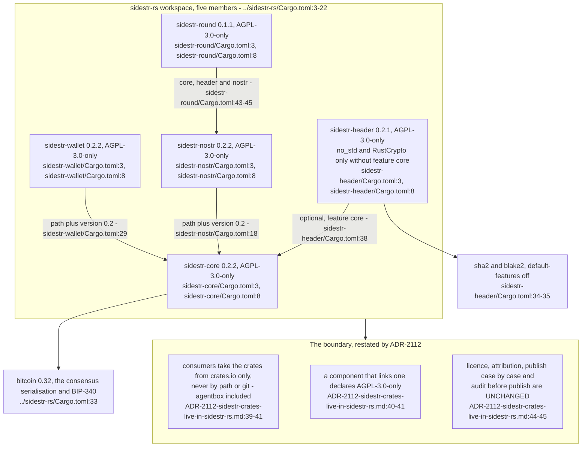
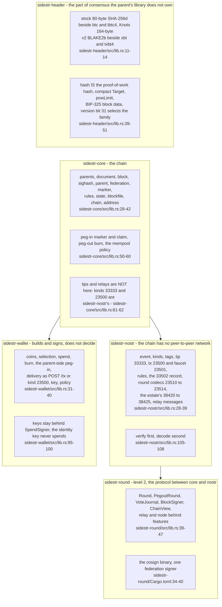
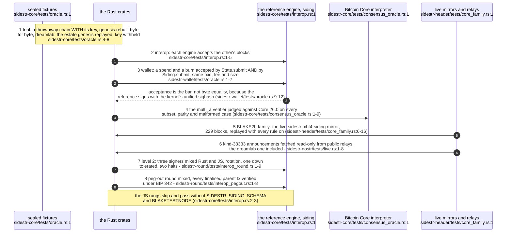
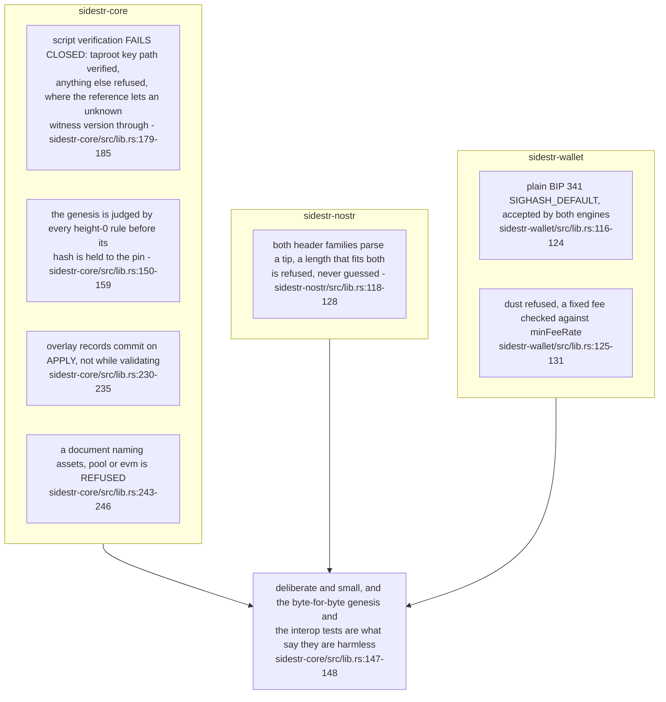
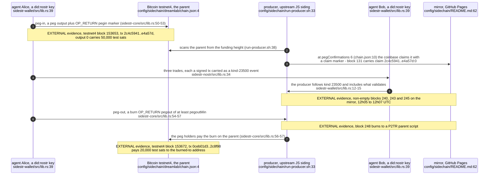
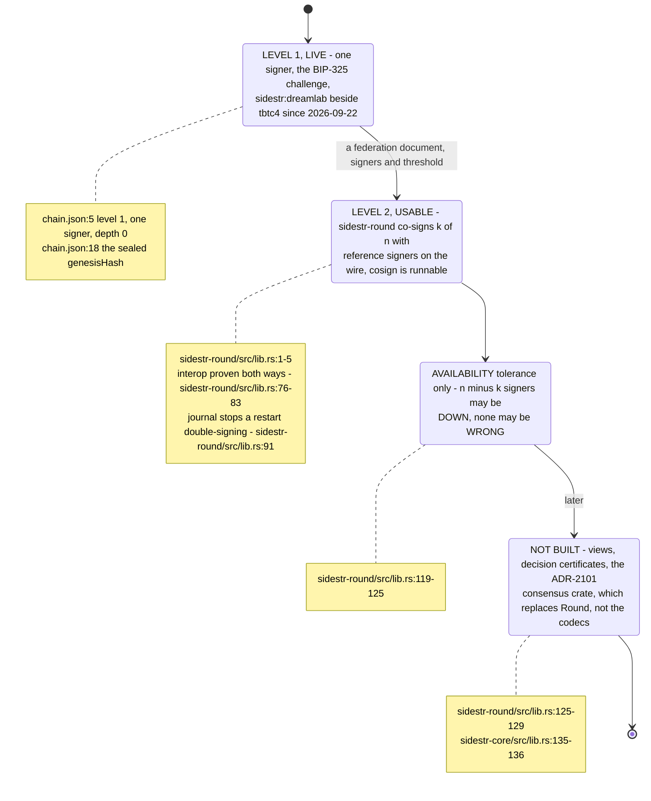

## For developers

sidestr-rs — Rust port of Melvin Carvalho's sidestr sidechains, AGPL-3.0-only: the economic engine for did:nostr agents. A did:nostr key is a sidechain wallet. The five crates were built in agentbox under `crates/sidestr/` (AB-33) and split out with their history on 2026-09-23; ADR-2112 moves source, CI, changelogs, audits and releases to this repository and leaves agentbox the chain *instance* in `config/sidechain/` (`ADR-2112-sidestr-crates-live-in-sidestr-rs.md:34-38`). This topic reads the workspace at sidestr-rs `59a3f39`, the `origin/main` head on the day of writing, and the chain instance at agentbox `ad45e7bf8`.

Each crate names the reference function it ports, carries upstream's licence, and is held to the reference engine by tests rather than by assertion. The table of what each crate owns is its crate-level rustdoc; the diagrams below cite those tables rather than restating them.

## For the business

This is the estate's settlement code as a stand-alone library: anyone running a `did:nostr` agent can check a sidestr chain, hold coins on it and pay with it, with the same key the agent already logs in with. It is copyleft (AGPL-3.0-only) because it is a faithful port of the original author's reference, and it is tested against that reference so the two cannot quietly disagree. Everything here is on test networks only; no real funds are held or moved.

## SR-01.1 The crate graph and the AGPL boundary

**Invariant:** the header edge points one way only — `sidestr-header` depends on `sidestr-core` behind feature `core`, and `sidestr-core` never depends back (`../sidestr-rs/sidestr-header/Cargo.toml:37-38`, `../sidestr-rs/sidestr-header/src/lib.rs:32`), which is what lets the header crate stay `no_std` for a consumer that wants only the proof of work.

**Drift (ADR-2112 vs the workspace metadata):** ADR-2112 moves the crates to sidestr-rs (`../project/agentbox/docs/adr/ADR-2112-sidestr-crates-live-in-sidestr-rs.md:34-35`), but at `59a3f39` the workspace still declares `repository = "https://github.com/DreamLab-AI/agentbox"` (`../sidestr-rs/Cargo.toml:27`), and that is the repository every published version on crates.io links to.

## SR-01.2 What each crate owns

**Invariant:** a key is reached only through named operations — `sidestr-nostr`'s `SignRequest` has no public constructor, so a signer is driven only through the `sign_*` functions and sees the whole event (`../sidestr-rs/sidestr-nostr/src/lib.rs:98-102`); a wallet builder computes the sighash and asks the port, never holding a secret (`../sidestr-rs/sidestr-wallet/src/lib.rs:95-97`).

**Open:** the sixth crate, `sidestr-agent` (the `did:nostr` key as a wallet, generalised from the tool that ran SR-01.5), is being added now and is not on `origin/main` at `59a3f39` (`../sidestr-rs/Cargo.toml:3-22` lists five members); this topic records nothing about it until it lands.

## SR-01.3 The oracle ladder against upstream

**Invariant:** every port names the upstream revision it was taken from — siding at `2de40bda…` for the core (`../sidestr-rs/sidestr-core/src/lib.rs:17-22`) and the schema kernel at `b8cbf633…` for the header (`../sidestr-rs/sidestr-header/src/lib.rs:126-135`) — so a divergence can be read side by side.

**Debt:** at `59a3f39` the repository carries no CI workflow at all; ADR-2112 deleted agentbox's `sidestr-crates.yml` with the move and records that sidestr-rs must carry that CI, which its remote did not have at the split (`../project/agentbox/docs/adr/ADR-2112-sidestr-crates-live-in-sidestr-rs.md:50-52`), so every rung above runs only where someone runs it.

## SR-01.4 Where the ports deliberately depart from siding

**Invariant:** zero BIP-340 auxiliary randomness everywhere, so a block, an event and a spend are each a pure function of their inputs and the key (`../sidestr-rs/sidestr-core/src/lib.rs:106-109`, `../sidestr-rs/sidestr-wallet/src/lib.rs:132-133`).

## SR-01.5 The first agent loop on sidestr:dreamlab, 2026-09-23

**Invariant:** the chain is test-only by construction — the sealed document's own comment says level 1, one signer, and coins carrying no value, with mainnet parents behind the P21 gate (`../project/agentbox/config/sidechain/dreamlab/chain.json:5`).

**Tension (the component vs the running chain):** the loop ran on a chain the upstream JavaScript engine produces (`../project/agentbox/config/sidechain/run-producer.sh:33-34`; ADR-2112 says nothing in agentbox links the crates, `../project/agentbox/docs/adr/ADR-2112-sidestr-crates-live-in-sidestr-rs.md:28-29`), so what sidestr-rs contributed was the agents' side; a Rust producer is still unbuilt (`../project/agentbox/config/sidechain/README.md:66-69`).

## SR-01.6 Level 1 runs, level 2 is usable, BFT is not built

**Open:** no estate chain runs at level 2 yet — `sidestr:dreamlab` is sealed as level 1 with one signer (`../project/agentbox/config/sidechain/dreamlab/chain.json:5`), so `sidestr-round`'s live evidence is the mixed-engine tests, not a federation the estate operates.
