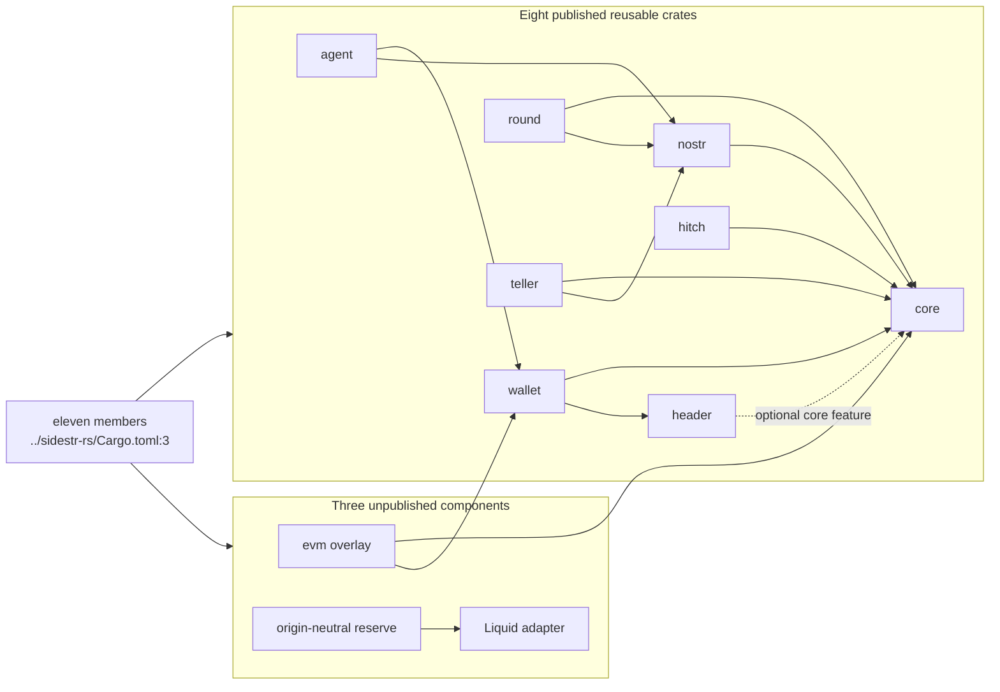
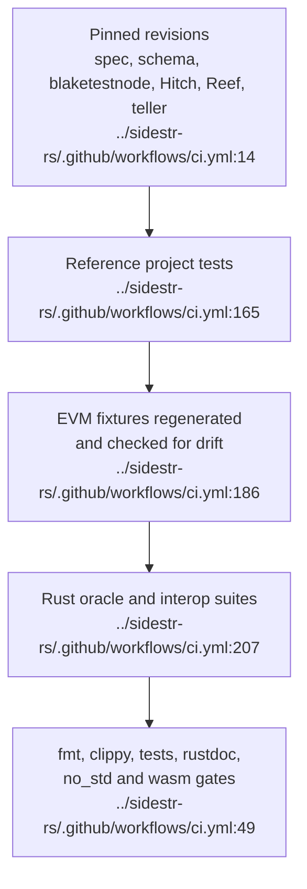
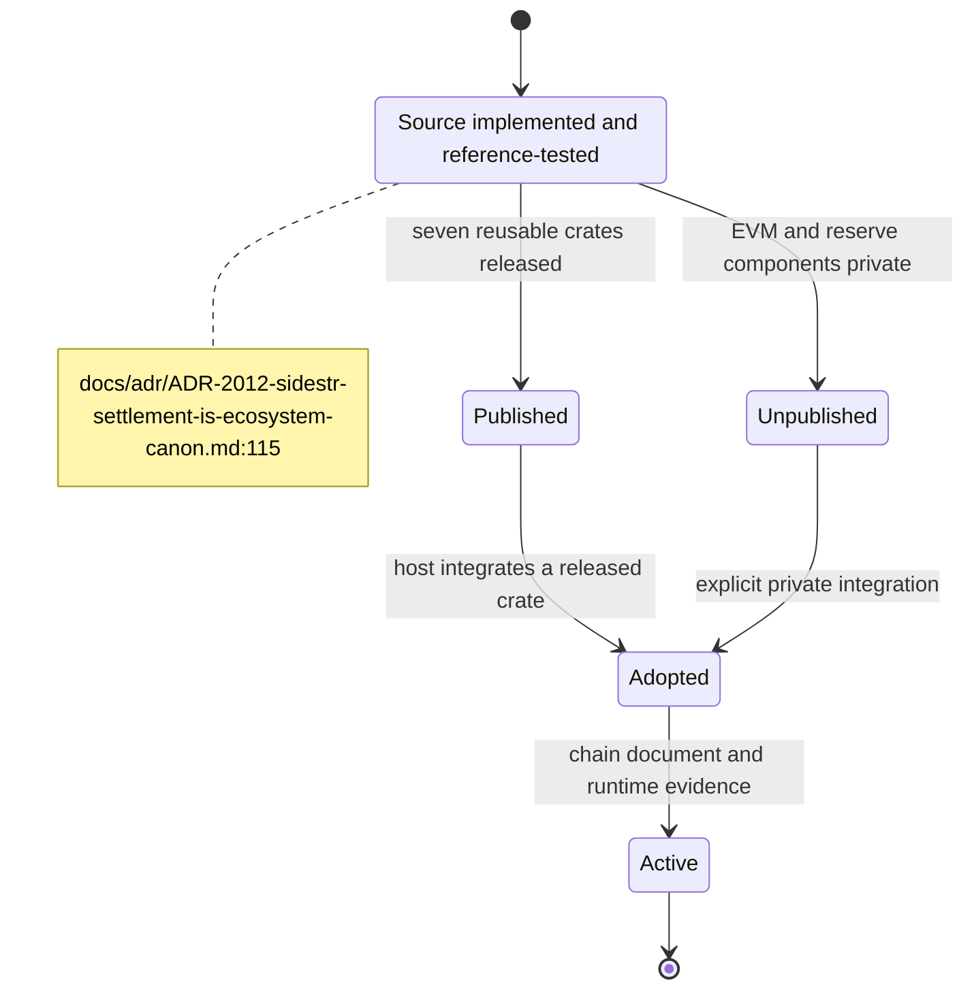
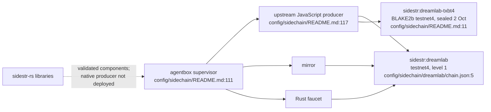

## For developers

`sidestr-rs` now has eleven workspace members. Eight published crates carry the reusable chain, wallet, Nostr, federation, agent, Hitch and teller surfaces; EVM and the two reserve crates remain separate, unpublished components. Compatibility is judged against pinned upstream revisions and regenerated fixtures rather than inferred from similar APIs.

## For the business

New source expands what the estate can validate and eventually operate, but it does not change what is live. `sidestr:dreamlab` is still a test-only chain produced by the upstream JavaScript engine, and a second sealed research chain, `sidestr:dreamlab-txbt4` beside a BLAKE2b parent, is also produced by that engine. Publication, source completeness and deployment are tracked as separate facts.

## SR-01.1 Workspace ownership

**What it shows.** The root manifest names eleven members and explicitly keeps EVM and the reserve components unpublished (`../sidestr-rs/Cargo.toml:30`, `../sidestr-rs/Cargo.toml:38`); the teller is a pure, publishable member (`../sidestr-rs/Cargo.toml:42`). **Drift (README vs manifests):** the README's crate table still lists seven published crates and no teller row, while the workspace now carries eleven members with `webledgers-teller` publishable (`../sidestr-rs/README.md:41`, `../sidestr-rs/Cargo.toml:43`).

**Why it is this way.** Optional execution and origin adapters can evolve without pulling their dependency trees into every validator. The local crate-boundary decision records this separation (`../sidestr-rs/docs/adr/ADR-0002-keep-optional-execution-and-services-behind-crate-boundaries.md:27`).

## SR-01.2 The compatibility ladder

**What it shows.** CI checks the reference repositories out at fixed revisions, runs their relevant tests, regenerates the EVM corpus, then runs the Rust workspace against those sources (`../sidestr-rs/.github/workflows/ci.yml:99`, `../sidestr-rs/.github/workflows/ci.yml:207`). Since `cd177ecc` the reference set grew again: Reef's BIP 21 parser, the oracle for `sidestr-wallet`'s payment requests, is repinned from `648487a` to `2bd3cb8` (`../sidestr-rs/.github/workflows/ci.yml:25`), and the teller joins as a sixth reference at `7c00cea`, the oracle for `webledgers-teller` and the RFC 8785 JCS of `sidestr-reserve`'s canonical attestation bytes (`../sidestr-rs/.github/workflows/ci.yml:30`), handed to the oracle suites alongside Hitch and Reef (`../sidestr-rs/.github/workflows/ci.yml:214`, `../sidestr-rs/.github/workflows/ci.yml:215`). The Hitch pin is still `62f8e39` and blaketestnode `f1da4a6` (`../sidestr-rs/.github/workflows/ci.yml:22`, `../sidestr-rs/.github/workflows/ci.yml:19`).

**Why it is this way.** The reference engine is the compatibility contract. A green Rust-only test suite cannot prove wire or consensus parity on its own (`../sidestr-rs/docs/adr/ADR-0001-reference-oracle-is-the-compatibility-contract.md:27`). **Drift (ADR-0001 vs CI):** the record says CI pins "all four reference repositories", but the workflow now pins six: spec, schema, blaketestnode, Hitch, Reef and teller (`../sidestr-rs/docs/adr/ADR-0001-reference-oracle-is-the-compatibility-contract.md:27`, `../sidestr-rs/.github/workflows/ci.yml:14`).

## SR-01.3 Source, publication and activation are separate states

**What it shows.** VisionFlow records source implementation as partial while keeping the ecosystem decision proposed and activation inactive (`docs/adr/ADR-2012-sidestr-settlement-is-ecosystem-canon.md:115`, `docs/adr/ADR-2012-sidestr-settlement-is-ecosystem-canon.md:130`).

**Why it is this way.** A library can be correct and published without any estate service importing it or any chain activating its rules. The master board closes source parity in N-9 and keeps estate adoption open in N-10 (`../project/docs/TODO-unified.md:100`, `../project/docs/TODO-unified.md:101`). Two releases after that closure, `sidestr-wallet` 0.5.1 (BIP 21 with the Reef oracle) and `sidestr-hitch` 0.2.0, are recorded as an annotation on the closed N-9 row, with adoption left under N-10 (`../project/docs/TODO-unified.md:114`).

**Invariant:** source evidence may promote implementation status; it cannot promote activation status.

## SR-01.4 The live boundary

**What it shows.** Agentbox supervises the producer, mirror and faucet, but the producer runs the upstream JavaScript engine baked at the upstream pins (`../project/agentbox/config/sidechain/README.md:111`, `../project/agentbox/config/sidechain/README.md:117`). A second chain, `sidestr:dreamlab-txbt4`, was sealed on 2 October beside a BLAKE2b testnet4 parent (`../project/agentbox/config/sidechain/README.md:11`). The sealed `sidestr:dreamlab` is level 1, and its document reaches `containmentDigest` without a `rules` field (`../project/agentbox/config/sidechain/dreamlab/chain.json:5`, `../project/agentbox/config/sidechain/dreamlab/chain.json:28`).

**Why it is this way.** The Rust workspace is currently a validated library component. No Rust producer is deployed on either chain; adoption stays under the estate board's open row (`../project/docs/TODO-unified.md:101`).

**Open:** deploy and prove a native producer before describing the Rust engine as the running estate chain.
