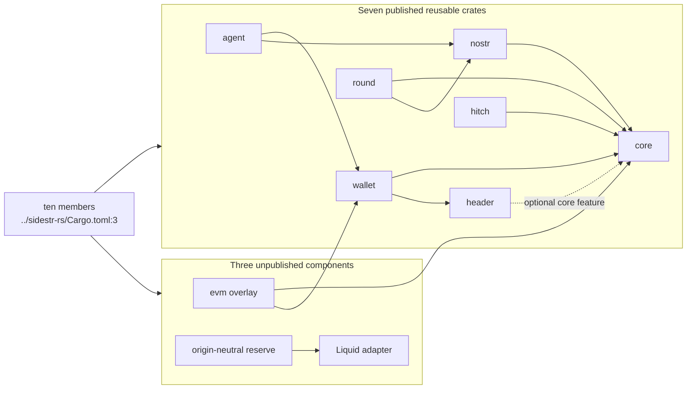
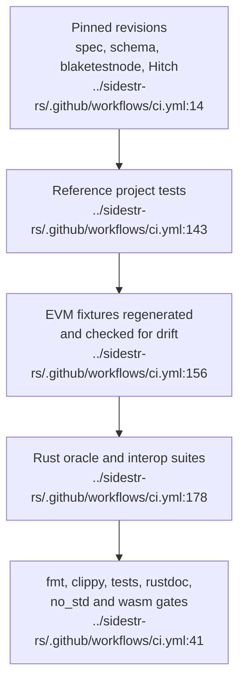
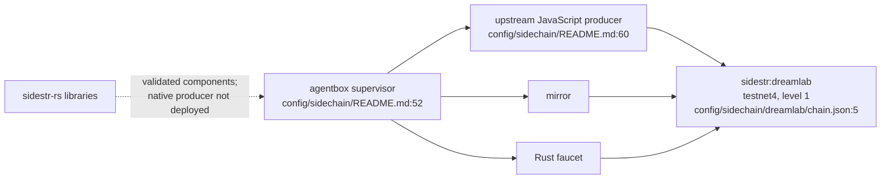

## For developers

`sidestr-rs` now has ten crates. Seven published crates carry the reusable chain, wallet, Nostr, federation, agent and Hitch surfaces; EVM and the two reserve crates remain separate, unpublished components. Compatibility is judged against pinned upstream revisions and regenerated fixtures rather than inferred from similar APIs.

## For the business

New source expands what the estate can validate and eventually operate, but it does not change what is live. `sidestr:dreamlab` is still a test-only chain produced by the upstream JavaScript engine. Publication, source completeness and deployment are tracked as separate facts.

## SR-01.1 Workspace ownership

**What it shows.** The root manifest names ten members and explicitly keeps EVM, reserve attestations and the Liquid adapter out of the published core graph (`../sidestr-rs/Cargo.toml:28`, `../sidestr-rs/Cargo.toml:32`).

**Why it is this way.** Optional execution and origin adapters can evolve without pulling their dependency trees into every validator. The local crate-boundary decision records this separation (`../sidestr-rs/docs/adr/ADR-0002-keep-optional-execution-and-services-behind-crate-boundaries.md:27`).

## SR-01.2 The compatibility ladder

**What it shows.** CI checks the reference repositories out at fixed revisions, runs their relevant tests, regenerates the EVM corpus, then runs the Rust workspace against those sources (`../sidestr-rs/.github/workflows/ci.yml:97`, `../sidestr-rs/.github/workflows/ci.yml:162`).

**Why it is this way.** The reference engine is the compatibility contract. A green Rust-only test suite cannot prove wire or consensus parity on its own (`../sidestr-rs/docs/adr/ADR-0001-reference-oracle-is-the-compatibility-contract.md:27`).

## SR-01.3 Source, publication and activation are separate states

**What it shows.** VisionFlow records source implementation as partial while keeping the ecosystem decision proposed and activation inactive (`docs/adr/ADR-2012-sidestr-settlement-is-ecosystem-canon.md:98`, `docs/adr/ADR-2012-sidestr-settlement-is-ecosystem-canon.md:112`).

**Why it is this way.** A library can be correct and published without any estate service importing it or any chain activating its rules. The master board closes source parity in N-9 and keeps estate adoption open in N-10 (`../project/docs/TODO-unified.md:100`, `../project/docs/TODO-unified.md:101`).

**Invariant:** source evidence may promote implementation status; it cannot promote activation status.

## SR-01.4 The live boundary

**What it shows.** Agentbox supervises the producer, mirror and faucet, but the producer runs the upstream JavaScript engine (`../project/agentbox/config/sidechain/README.md:52`, `../project/agentbox/config/sidechain/README.md:60`). The sealed chain is level 1, and its document reaches `containmentDigest` without a `rules` field (`../project/agentbox/config/sidechain/dreamlab/chain.json:5`, `../project/agentbox/config/sidechain/dreamlab/chain.json:28`).

**Why it is this way.** The Rust workspace is currently a validated library component. A native producer, authenticated chain proxy and host adoption need their own implementation and runtime receipts (`../project/agentbox/config/sidechain/README.md:77`).

**Open:** deploy and prove a native producer before describing the Rust engine as the running estate chain.
