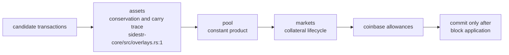
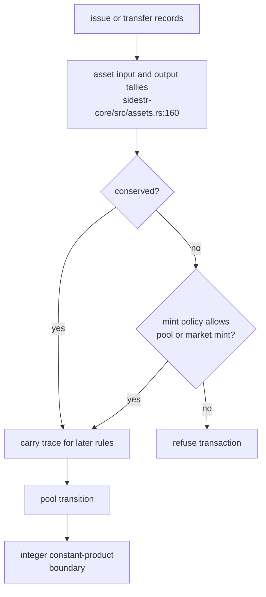
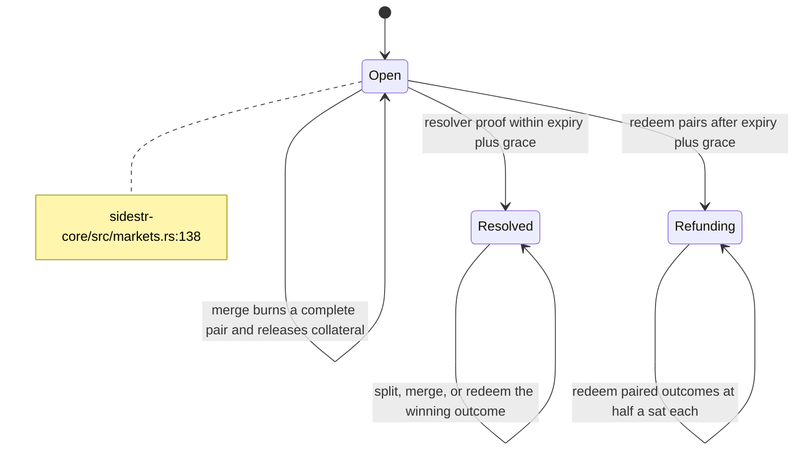
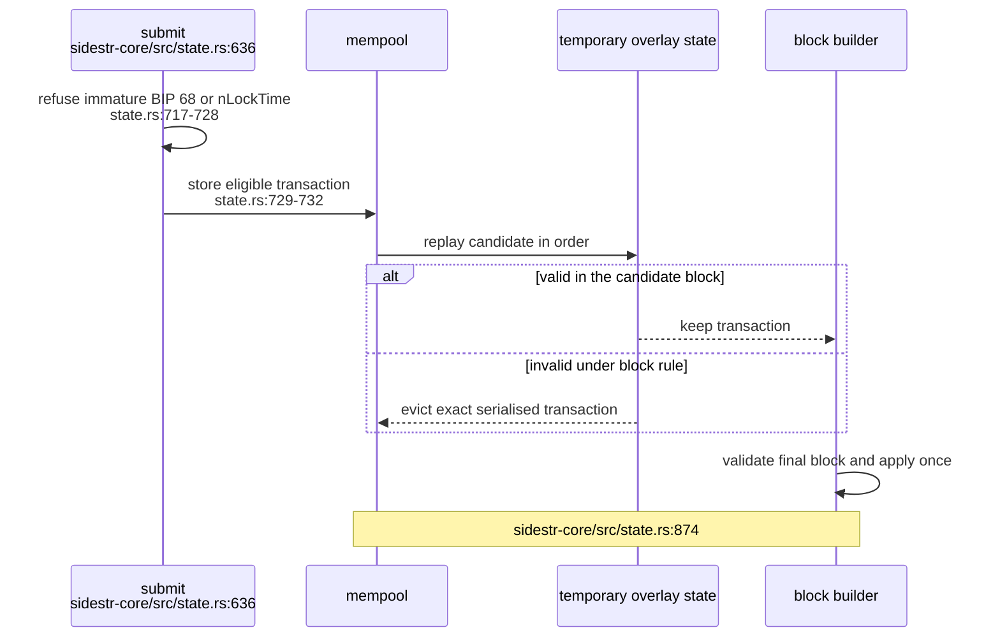

## For developers

`BlockRule` is the extension seam for rule-local validation, coinbase allowances and applied-block commits. The lightweight overlays always execute as assets, pool, then markets, and producer selection evaluates candidates against temporary state before final block validation.

## For the business

Source now represents issued assets, automated pools and binary markets without changing the base UTXO ledger. These are source capabilities only: the live estate chain has no rules field and therefore offers none of them.

## SR-02.1 The ordered rule pipeline

**What it shows.** The compositor installs assets before pool before markets so later rules can inspect the same candidate block's asset carry trace (`../sidestr-rs/sidestr-core/src/overlays.rs:1`, `../sidestr-rs/sidestr-core/src/overlays.rs:65`). `BlockRule` separates checking from committing applied state (`../sidestr-rs/sidestr-core/src/rules.rs:534`).

**Why it is this way.** Pool shares and market outcome tokens are authorised asset mints. Fixed ordering lets those rules grant a mint while the asset rule still enforces conservation.

**Invariant:** overlay order is consensus behaviour and cannot be rearranged as an implementation detail.

## SR-02.2 Assets and constant-product pools

**What it shows.** The asset rule classifies transactions, totals inputs and outputs, and delegates exceptional minting to a policy supplied by the pool and market views (`../sidestr-rs/sidestr-core/src/assets.rs:160`, `../sidestr-rs/sidestr-core/src/overlays.rs:34`). Pools then enforce their transition and constant-product boundary (`../sidestr-rs/sidestr-core/src/pool.rs:80`, `../sidestr-rs/sidestr-core/src/pool.rs:213`).

**Why it is this way.** One conservation rule stays authoritative while purpose-built rules can create only the assets their own state transition justifies.

## SR-02.3 Binary market lifecycle

**What it shows.** A market is opened with its collateral and resolver terms, then supports split, merge, resolve, redeem and refund transitions (`../sidestr-rs/sidestr-core/src/markets.rs:138`, `../sidestr-rs/sidestr-core/src/markets.rs:260`). Resolver proof is checked before the status can advance (`../sidestr-rs/sidestr-core/src/markets.rs:202`).

**Why it is this way.** Every creation or release of outcome assets stays traceable to locked collateral and the market's current status.

## SR-02.4 Admission is not block eligibility

**What it shows.** Admission refuses a transaction whose BIP 68 relative lock or `nLockTime` has not matured at the next height, so an immature channel sweep or HTLC refund never enters the mempool and production is never asked to evict it (`../sidestr-rs/sidestr-core/src/state.rs:628`, `../sidestr-rs/sidestr-core/src/state.rs:721`). When admission and block validation still disagree, the builder walks the mempool in order and removes transactions that admission accepted but current block state rejects (`../sidestr-rs/sidestr-core/src/state.rs:874`). Eviction matches the exact transaction bytes, so a witness-repaired transaction with the same txid is not removed accidentally (`../sidestr-rs/sidestr-core/src/state.rs:759`, `../sidestr-rs/sidestr-core/tests/eviction.rs:16`).

**Why it is this way.** Rule state changes as earlier candidates enter a block. Turning immature locks away at admission means they can be submitted again once their height arrives instead of being evicted from a produced block (`../sidestr-rs/sidestr-core/src/state.rs:631`). Exact-byte eviction prevents one invalid witness form from suppressing a repaired form that shares its txid.

**Open:** assets, pools and markets remain inactive on `sidestr:dreamlab`; its sealed document reaches `containmentDigest` without a `rules` field (`../project/agentbox/config/sidechain/dreamlab/chain.json:5`, `../project/agentbox/config/sidechain/dreamlab/chain.json:28`).
