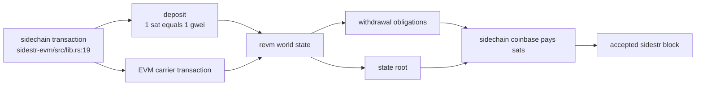
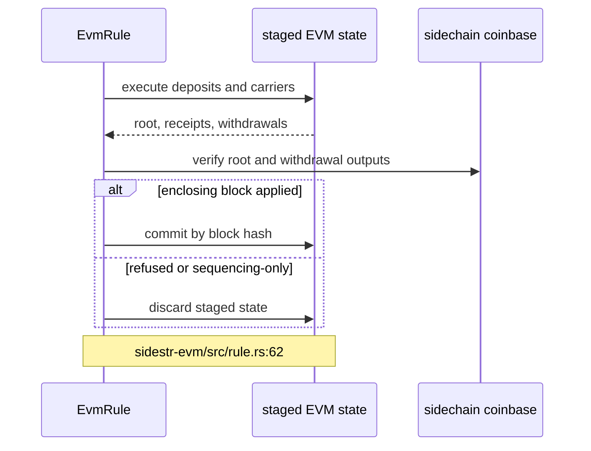
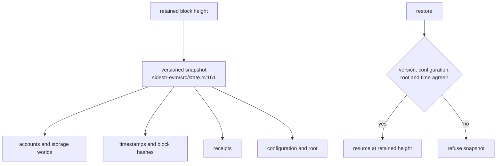
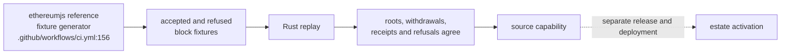

## For developers

`sidestr-evm` implements the chain's optional `evm` rule using `revm`. Sidechain transactions carry deposits and Ethereum transactions; the coinbase commits the resulting state root and pays withdrawals. Rule state commits only after the enclosing sidechain block is accepted.

## For the business

This adds smart-contract execution inside a sidestr chain. It does not create a separate Ethereum settlement rail: value enters and leaves as the same chain's sats, and the chain's signers still order and validate every block. The crate is unpublished and the estate chain has not activated it.

## SR-03.1 One chain, two coordinated state views

**What it shows.** The overlay recognises deposits, carried Ethereum transactions, withdrawals and the root committed by the sidechain coinbase (`../sidestr-rs/sidestr-evm/src/lib.rs:19`). One sat maps to one gwei inside the overlay (`../sidestr-rs/sidestr-evm/src/lib.rs:10`).

**Why it is this way.** Deposits and withdrawals remain accountable in the host chain's block. Estate policy therefore treats EVM as in-chain execution rather than a second value rail (`../project/agentbox/docs/adr/ADR-2096-sidestr-sidechains-are-the-sole-value-instrument.md:116`).

**Invariant:** an EVM withdrawal is valid only when the same block's coinbase pays the required sidechain satoshis.

## SR-03.2 Check, prepare, then commit

**What it shows.** `EvmRule` exposes validation, coinbase allowance and applied-block commit through the core rule interface (`../sidestr-rs/sidestr-evm/src/rule.rs:62`). Preparation checks both the root and withdrawal payments before state can commit (`../sidestr-rs/sidestr-evm/src/state.rs:459`).

**Why it is this way.** Validation and producer sequencing must not mutate durable state. The crate deliberately commits only an applied block (`../sidestr-rs/sidestr-evm/src/lib.rs:78`).

## SR-03.3 Retained-height snapshots

**What it shows.** A snapshot contains the versioned execution worlds, times, block hashes and receipts (`../sidestr-rs/sidestr-evm/src/state.rs:161`). Restore verifies version, configuration, root and time, then clears transient execution state (`../sidestr-rs/sidestr-evm/src/state.rs:291`).

**Why it is this way.** A follower can resume from any retained sidechain height without treating unverified serialised state as consensus truth.

## SR-03.4 Evidence and activation boundary

**What it shows.** CI regenerates the EVM fixtures against the pinned reference and fails on drift (`../sidestr-rs/.github/workflows/ci.yml:156`). The oracle suite checks roots, withdrawals, hashes, receipts and refused blocks (`../sidestr-rs/sidestr-evm/tests/oracle.rs:1`).

**Why it is this way.** Byte-level parity supports a source claim. It does not publish the crate or alter a sealed chain document. VisionFlow records both limits explicitly (`docs/adr/ADR-2012-sidestr-settlement-is-ecosystem-canon.md:106`).

**Open:** `sidestr-evm` is unpublished, and the `sidestr:dreamlab` document reaches `containmentDigest` without an `evm` rule (`../project/agentbox/config/sidechain/dreamlab/chain.json:5`, `../project/agentbox/config/sidechain/dreamlab/chain.json:28`).
