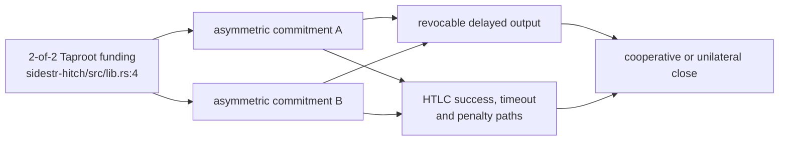
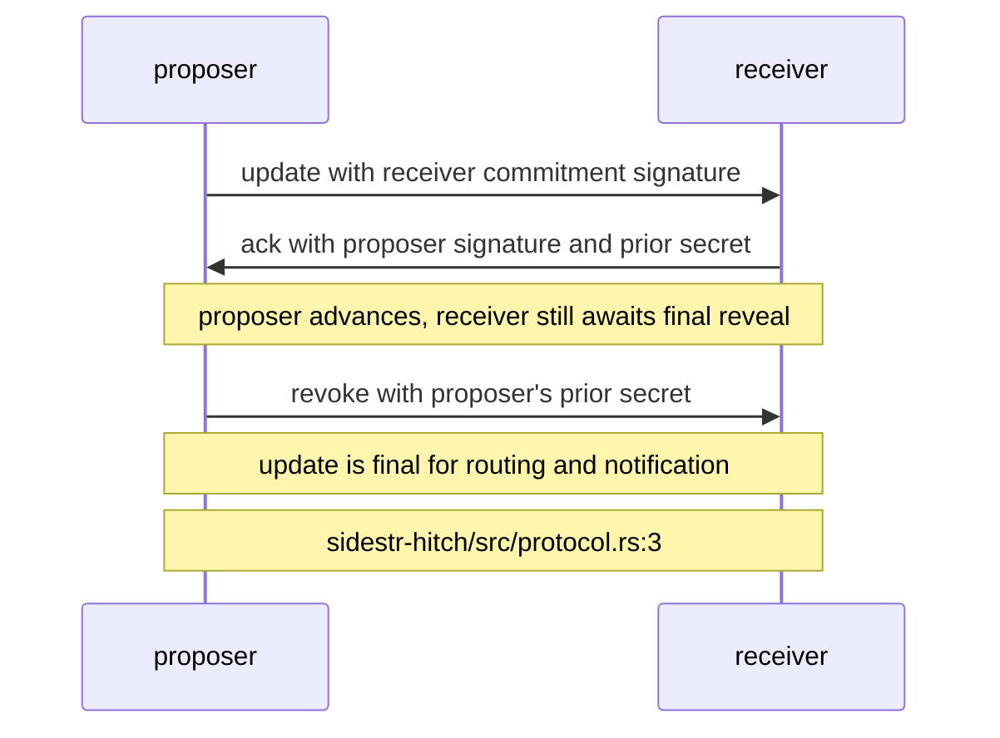
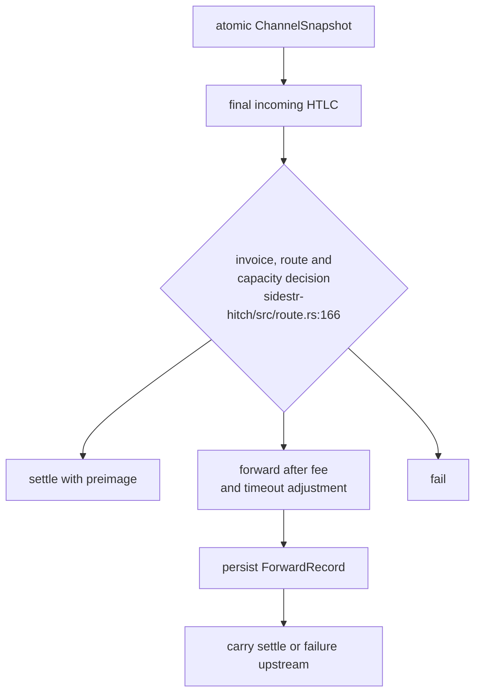
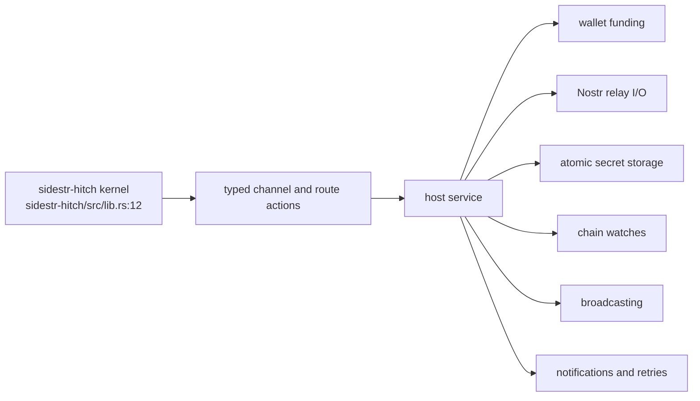

## For developers

`sidestr-hitch` is a pure channel kernel. It constructs Hitch funding, commitment, HTLC and close transactions, implements the update protocol as a state machine, serialises recovery snapshots, and returns routing actions for a host to execute.

## For the business

Hitch gives two sidestr users fast off-chain updates and a one-hop hub path. It is Lightning-shaped but cannot connect to Lightning peers. A usable service still needs wallet funding, relay transport, secure storage, chain watching and transaction broadcasting.

## SR-04.1 Channel transaction boundary

**What it shows.** The crate builds the funding, asymmetric revocable commitments and optional HTLC paths for both ordinary BIP-341 and the Knots unified sighash (`../sidestr-rs/sidestr-hitch/src/lib.rs:4`, `../sidestr-rs/sidestr-hitch/src/lib.rs:15`).

**Why it is this way.** The kernel contains the money-bearing script and signature rules while leaving networking and custody to the embedding service.

**Invariant:** Hitch is not a Lightning node and does not speak the Lightning peer protocol (`../sidestr-rs/sidestr-hitch/src/lib.rs:16`).

## SR-04.2 Update finality

**What it shows.** Hitch uses an update, acknowledgement and revocation handshake. The receiver treats the new state as final only after the last secret reveal (`../sidestr-rs/sidestr-hitch/src/protocol.rs:3`). Simultaneous proposals use a deterministic winner while retaining any signed alternative until it is safe to discard (`../sidestr-rs/sidestr-hitch/src/protocol.rs:11`).

**Why it is this way.** Each peer must hold the remedy for an old commitment before external code treats the balance change as settled.

## SR-04.3 Durable recovery and one-hop routing

**What it shows.** The pure router returns settle, forward or fail actions and includes a durable link between upstream and downstream HTLCs (`../sidestr-rs/sidestr-hitch/src/route.rs:120`, `../sidestr-rs/sidestr-hitch/src/route.rs:166`). The channel snapshot contains signing keys, revocation secrets and preimages (`../sidestr-rs/sidestr-hitch/src/protocol.rs:665`).

**Why it is this way.** The host can persist the full recovery boundary atomically before sending a message, then replay routing outcomes after a restart. Snapshot storage must be protected as wallet key material (`../sidestr-rs/sidestr-hitch/src/protocol.rs:667`).

## SR-04.4 What the host must still supply

**What it shows.** Opening starts from a wallet-selected outpoint, and the wallet remains responsible for broadcast and watch duties (`../sidestr-rs/sidestr-hitch/src/protocol.rs:714`). The route module also assigns channel lookup, retries, persistence and user notifications to the host (`../sidestr-rs/sidestr-hitch/src/route.rs:1`).

**Why it is this way.** Keeping side effects outside the protocol state machine makes the kernel testable against Hitch's JavaScript transaction and wire oracles, which CI pins separately (`../sidestr-rs/.github/workflows/ci.yml:20`, `../sidestr-rs/.github/workflows/ci.yml:118`).

**Open:** no estate host supplies the complete service boundary. VisionClaw ADR-2111 remains proposed, unimplemented and inactive (`../project/docs/adr/ADR-2111-re-sequence-rgb-for-bridged-assets-and-delete-the-host-payment-store.md:83`).
