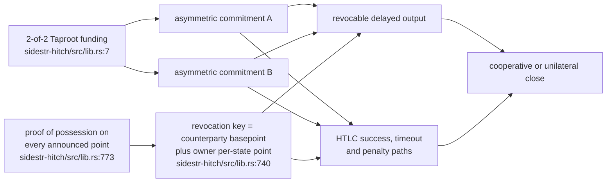
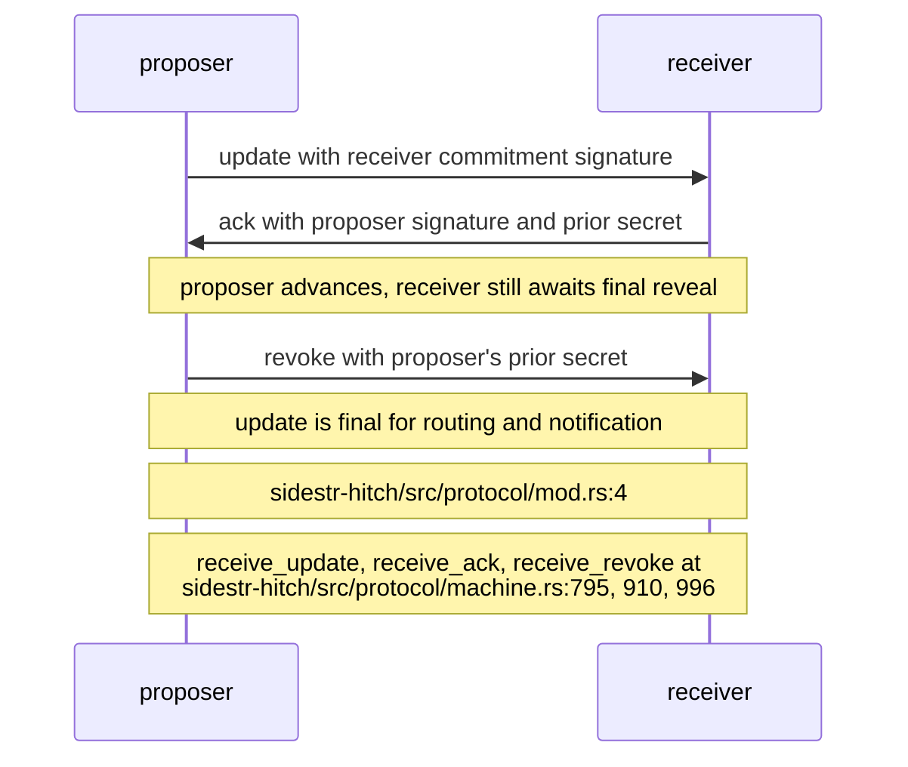
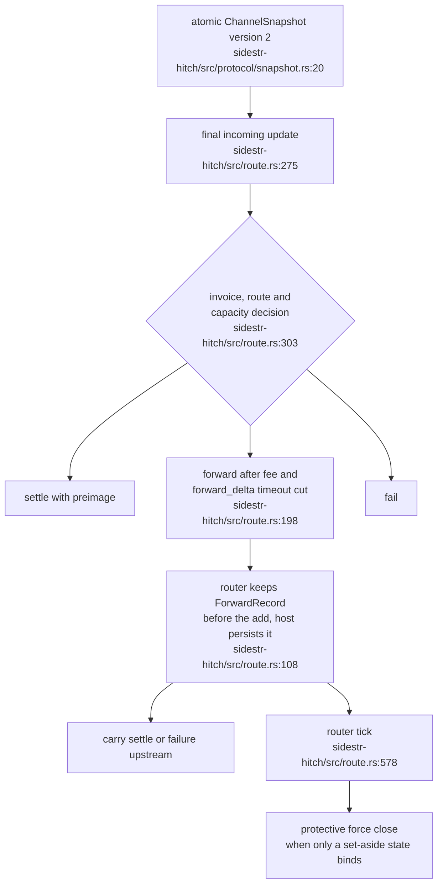
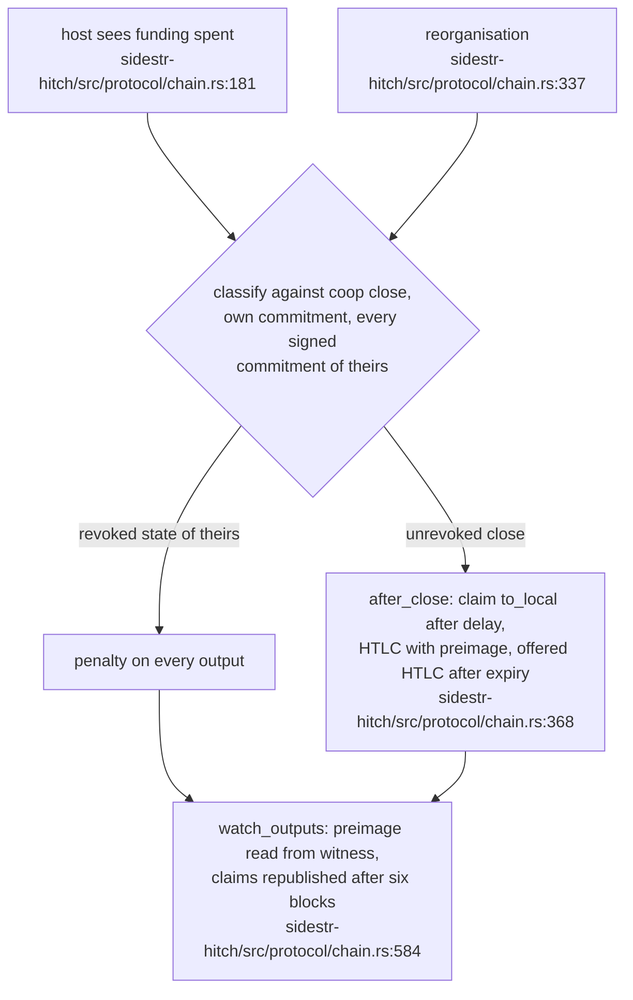
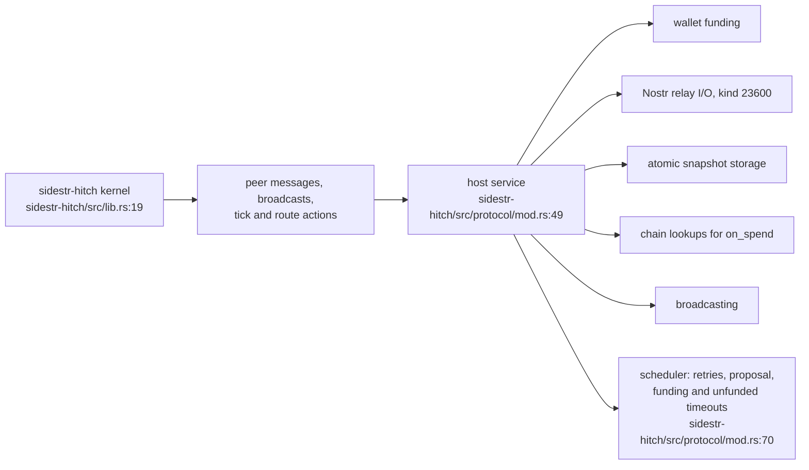

## For developers

`sidestr-hitch` is a pure channel kernel. Since 0.2.0 (sidestr-rs `5a1e89ae`, 1 Oct) it tracks Hitch at `62f8e39`, through the five rounds of Hitch's adversarial review: `lib/channel.mjs` for the transactions, `lib/peer.mjs` for the sans-IO peer machine and `lib/route.mjs` for the router. The single 2,972-line `protocol.rs` of 0.1 is now a `protocol/` module split by concern: wire messages, opening, the update machine, chain following and snapshots. It constructs Hitch funding, commitment, HTLC and close transactions, runs the update protocol, answers a close seen on the chain with penalties, sweeps and claims, serialises recovery snapshots, and returns routing actions for a host to execute. The release is breaking. Commitments now use a two-party revocation key, so the transactions differ and a 0.1 channel cannot be restored by 0.2: the 0.1 key let a commitment's owner spend its own revocation leaf, which is the flaw this release fixes. Read SR-04.1 for the revocation construction, SR-04.2 for finality, SR-04.3 for recovery and routing, SR-04.4 for the chain side and SR-04.5 for what a host still owes. The estate has no host for any of it (VisionClaw ADR-2111 is proposed and unimplemented).

## For the business

Hitch gives two sidestr users fast off-chain updates and a one-hop hub path. It is Lightning-shaped but cannot connect to Lightning peers. Version 0.2.0 closes a hole in which a party could cheat with its own penalty path. It also takes over the money-bearing reactions to a channel being closed on the chain: punishing an old state and claiming what is owed. Any channel opened with the earlier version has to be closed with that version. Nobody in the estate runs one. A usable service still needs wallet funding, relay transport, secure storage, chain watching, transaction broadcasting and the retry and timeout scheduler.

## SR-04.1 Channel transaction boundary and the two-party revocation key

**What it shows.** The crate builds the funding, asymmetric revocable commitments and optional HTLC paths for both ordinary BIP-341 and the Knots unified sighash (`../sidestr-rs/sidestr-hitch/src/lib.rs:7`, `../sidestr-rs/sidestr-hitch/src/lib.rs:22`). A commitment's revocation key combines the counterparty's basepoint with the owner's per-state point, so the owner never holds its secret; the counterparty signs with `revocation_key` once it learns the per-state secret (`../sidestr-rs/sidestr-hitch/src/lib.rs:11`, `../sidestr-rs/sidestr-hitch/src/lib.rs:740`, `../sidestr-rs/sidestr-hitch/src/lib.rs:753`). Every announced point carries a proof of possession so neither side can choose a point that cancels the other's (`../sidestr-rs/sidestr-hitch/src/lib.rs:773`, `../sidestr-rs/sidestr-hitch/src/lib.rs:785`).

**Why it is this way.** The kernel contains the money-bearing script and signature rules while leaving networking and custody to the embedding service. The two-party key arrived with Hitch `62f8e39` and is the reason commitments changed in 0.2.0 (`../sidestr-rs/sidestr-hitch/CHANGELOG.md:3`, `../sidestr-rs/sidestr-hitch/CHANGELOG.md:10`).

**Invariant:** Hitch is not a Lightning node and does not speak the Lightning peer protocol (`../sidestr-rs/sidestr-hitch/src/lib.rs:24`). **Invariant:** the owner of a commitment can never spend its own revocation leaf; the transaction oracle runs an owner's attempt through the schema interpreter and expects refusal (`../sidestr-rs/sidestr-hitch/src/protocol/mod.rs:14`, `../sidestr-rs/sidestr-hitch/tests/oracle.rs:465`).

## SR-04.2 Update finality

**What it shows.** Hitch uses an update, acknowledgement and revocation handshake. The receiver treats the new state as final only after the last secret reveal, and until then nothing is forwarded, settled or announced and no further update is accepted or proposed (`../sidestr-rs/sidestr-hitch/src/protocol/mod.rs:4`, `../sidestr-rs/sidestr-hitch/src/protocol/mod.rs:27`). A pending update is never simply dropped: on a collision the lower key's update stands, and the other signed state, like a rejected one, is kept as an alternative whose HTLCs stay bound until that state number is revoked or the funding is spent by something else (`../sidestr-rs/sidestr-hitch/src/protocol/mod.rs:20`, `../sidestr-rs/sidestr-hitch/src/protocol/machine.rs:561`).

**Why it is this way.** Each peer must hold the remedy for an old commitment before external code treats the balance change as settled. 0.2.0 added the `reject` message and the binding of set-aside states from Hitch's peer (`../sidestr-rs/sidestr-hitch/CHANGELOG.md:3`). **Invariant:** every field of every message is shape-checked before use, and nothing is written to the channel until the message is verified in full (`../sidestr-rs/sidestr-hitch/src/protocol/mod.rs:43`).

## SR-04.3 Durable recovery and one-hop routing

**What it shows.** The router now keeps forwards itself, recorded before the downstream `add` and keyed by downstream channel and payment hash, so a restart or a second payment in flight cannot lose them; the host persists the record the `Forward` action carries (`../sidestr-rs/sidestr-hitch/src/route.rs:7`, `../sidestr-rs/sidestr-hitch/src/route.rs:173`). The router decides settle, forward or fail on a finalised update and, on its tick, settles, fails or force-closes forwards whose downstream state is lost or held only by a set-aside alternative (`../sidestr-rs/sidestr-hitch/src/route.rs:303`, `../sidestr-rs/sidestr-hitch/src/route.rs:570`). The channel snapshot contains the signing key, the revocation basepoint and per-state secrets, and preimages (`../sidestr-rs/sidestr-hitch/src/protocol/snapshot.rs:22`).

**Why it is this way.** The host persists the full recovery boundary atomically before sending anything the call returned, and restores the previous snapshot if the save fails (`../sidestr-rs/sidestr-hitch/src/protocol/mod.rs:30`). Snapshot storage must be protected as wallet key material (`../sidestr-rs/sidestr-hitch/src/protocol/snapshot.rs:24`).

**Invariant:** only version 2 snapshots restore; a 0.1 (version 1) snapshot is refused because its single-party revocation keys let the owner spend its own revocation leaf, so such a channel must be closed with 0.1 (`../sidestr-rs/sidestr-hitch/src/protocol/snapshot.rs:29`, `../sidestr-rs/sidestr-hitch/src/protocol/snapshot.rs:182`).

## SR-04.4 Following a close on the chain

**What it shows.** Chain handling moved into the kernel in 0.2.0. `on_spend` classifies a funding spend and answers a revoked close with a penalty on each output; `after_close` claims what this peer is owed; `watch_outputs` follows every output, reads a preimage from the other side's HTLC claim and republishes an unconfirmed claim; `un_spend` undoes a reorganised spend without reopening the channel (`../sidestr-rs/sidestr-hitch/src/protocol/chain.rs:175`, `../sidestr-rs/sidestr-hitch/src/protocol/chain.rs:363`, `../sidestr-rs/sidestr-hitch/src/protocol/chain.rs:577`, `../sidestr-rs/sidestr-hitch/src/protocol/chain.rs:332`). The machine's own tick takes a claimable HTLC to the chain `delay + CLAIM_MARGIN` blocks before expiry (`../sidestr-rs/sidestr-hitch/src/protocol/machine.rs:1306`).

**Why it is this way.** Hitch's peer does these steps itself; keeping them in the sans-IO machine means a host only supplies the chain lookups and broadcasts the returned transactions. Every transaction a Rust protocol run broadcasts is checked by Hitch's module and the schema interpreter (`../sidestr-rs/sidestr-hitch/tests/oracle.rs:358`).

## SR-04.5 What the host must still supply

**What it shows.** The machine performs no IO: a host carries each peer message as a kind-23600 Nostr event and supplies wallet funding, atomic snapshot storage, chain watches and broadcasting (`../sidestr-rs/sidestr-hitch/src/protocol/mod.rs:49`, `../sidestr-rs/sidestr-hitch/src/protocol/mod.rs:105`). Opening starts from a wallet-selected outpoint with proofs of possession, and the wallet remains responsible for broadcasting and watching the funding (`../sidestr-rs/sidestr-hitch/src/protocol/opening.rs:178`). Hitch keeps failed broadcasts, retry timers and the proposal, funding and unfunded timeouts on its channel document; here they are the host's scheduler, with the constants exported (`../sidestr-rs/sidestr-hitch/src/protocol/mod.rs:70`, `../sidestr-rs/sidestr-hitch/src/protocol/mod.rs:121`). The router expects the host to retry a retryable action (Hitch tries twenty times) (`../sidestr-rs/sidestr-hitch/src/route.rs:13`).

**Why it is this way.** Keeping side effects outside the protocol state machine makes the kernel testable against Hitch's JavaScript transaction and wire oracles, which CI pins separately at `62f8e39` (`../sidestr-rs/.github/workflows/ci.yml:20`, `../sidestr-rs/.github/workflows/ci.yml:22`, `../sidestr-rs/.github/workflows/ci.yml:120`). Every message kind, `reject` included, passes Hitch's own validator, and Hitch's peer and adversarial suites run in Rust (`../sidestr-rs/sidestr-hitch/tests/wire_oracle.rs:185`, `../sidestr-rs/sidestr-hitch/tests/peer_scenarios.rs:1`, `../sidestr-rs/sidestr-hitch/tests/adversarial_scenarios.rs:1`). **Tension (Hitch vs port):** a point off the curve is refused at deserialisation and dropped without a `reject`, where Hitch replies with a reject at the proof-of-possession check; the port records this as a deliberate, tested departure (`../sidestr-rs/sidestr-hitch/src/protocol/mod.rs:63`).

**Open:** no estate host supplies the complete service boundary, which 0.2.0 widened by the scheduler and chain-lookup duties. VisionClaw ADR-2111 remains proposed, unimplemented and inactive (`../project/docs/adr/ADR-2111-re-sequence-rgb-for-bridged-assets-and-delete-the-host-payment-store.md:83`), and the board leaves Hitch adoption under N-10 (`../project/docs/TODO-unified.md:101`, `../project/docs/TODO-unified.md:114`).
