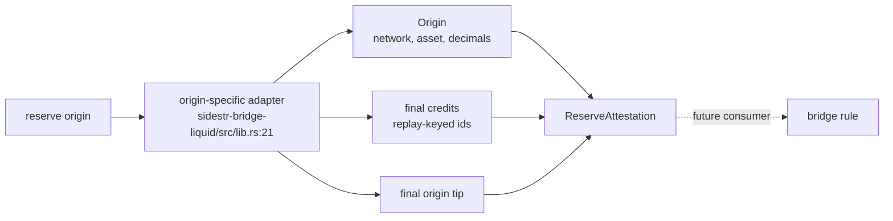
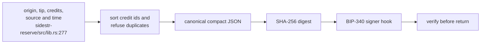
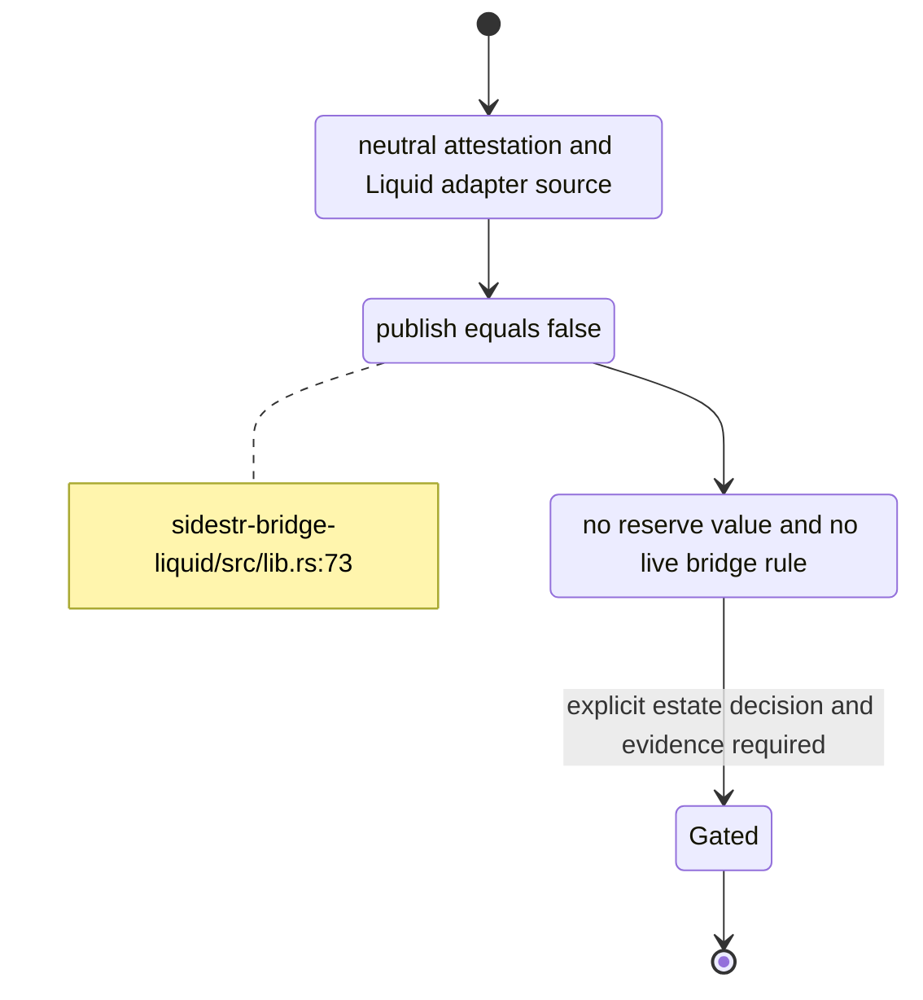

## For developers

`sidestr-reserve` defines a deterministic statement about a reserve origin, its replay-keyed credits and the final origin tip. `sidestr-bridge-liquid` is one adapter that reads a Liquid wallet through LWK and produces that statement. Neither crate implements or activates the consuming `bridge` rule.

## For the business

Source can describe and sign what a private reserve wallet held at a specific origin-chain tip. It does not fund a reserve, issue a redeemable asset or put a bridge into service. Both crates remain unpublished and the format is a private project contract.

## SR-05.1 Adapter boundary

**What it shows.** The neutral crate identifies an origin by network, asset and decimals and identifies each credit by an origin-appropriate replay key (`../sidestr-rs/sidestr-reserve/src/lib.rs:132`, `../sidestr-rs/sidestr-reserve/src/lib.rs:223`). A Liquid-specific adapter supplies the wallet, sync and registry interpretation (`../sidestr-rs/sidestr-bridge-liquid/src/lib.rs:14`).

**Why it is this way.** Another origin can provide a sibling adapter while a future bridge rule consumes one stable statement shape. The local ADR keeps origin dependencies isolated (`../sidestr-rs/docs/adr/ADR-0003-keep-reserve-attestations-origin-neutral-and-private.md:26`).

## SR-05.2 Deterministic statement and signature

**What it shows.** Attestation construction sorts credits, refuses duplicate ids and totals amounts with checked arithmetic (`../sidestr-rs/sidestr-reserve/src/lib.rs:277`). Canonical JSON fixes key and credit order before SHA-256 and BIP-340 signing (`../sidestr-rs/sidestr-reserve/src/lib.rs:323`, `../sidestr-rs/sidestr-reserve/src/lib.rs:368`).

**Why it is this way.** Independent adapters and validators must reproduce exactly the bytes that were signed, and a credit must not support two mints.

## SR-05.3 Private, unpublished and inactive

**What it shows.** The adapter's crate documentation says it is private, unfunded, unpublished and not live (`../sidestr-rs/sidestr-bridge-liquid/src/lib.rs:5`, `../sidestr-rs/sidestr-bridge-liquid/src/lib.rs:73`). The local ADR states that neither crate activates a bridge rule, funds a reserve or deploys a chain (`../sidestr-rs/docs/adr/ADR-0003-keep-reserve-attestations-origin-neutral-and-private.md:32`).

**Why it is this way.** A signed data format is only one input to a custody system. Funding, issuance, supply validation and activation require separate estate evidence under ADR-2117.

**Open:** the master board keeps reserve custody and service-account isolation open; publishing source does not close those runtime gates (`../project/docs/TODO-unified.md:97`).
