## SP-01.1 Eight workspace members and the library-first split

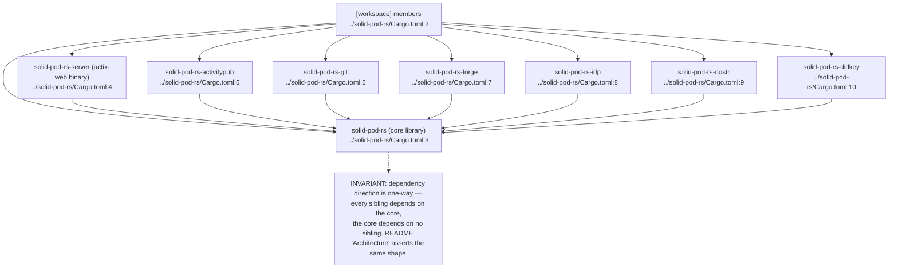

## SP-01.2 Workspace-inherited package metadata

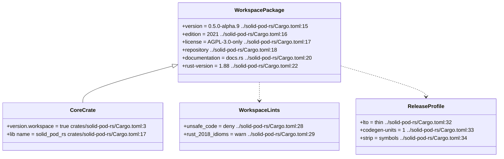

## SP-01.3 Core library module surface

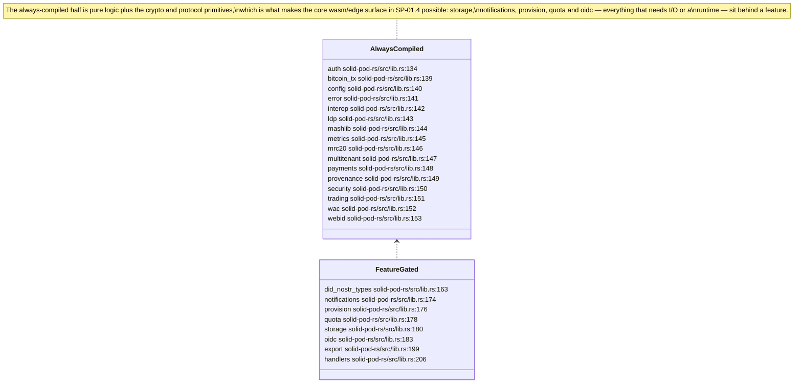

## SP-01.4 `core` — the no-IO wasm/edge subset

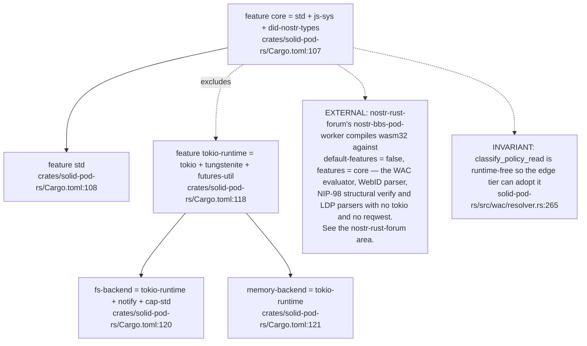

## SP-01.5 Core feature graph — auth and identity flags

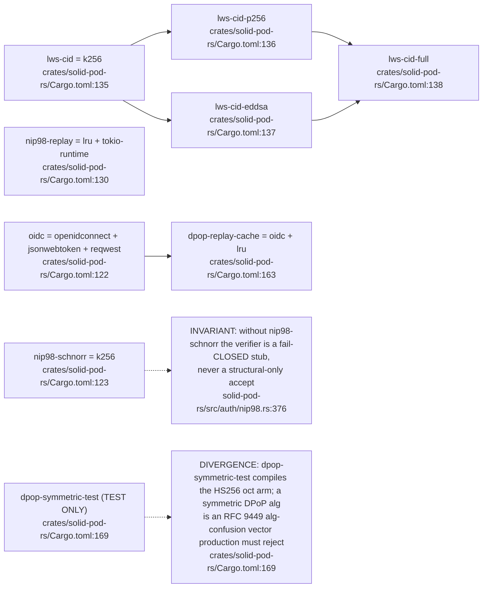

## SP-01.6 Core feature graph — JSS-parity umbrella

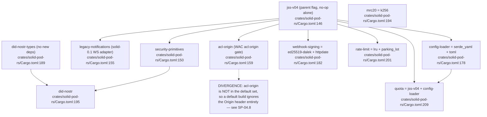

## SP-01.7 Default feature set versus the empty server default

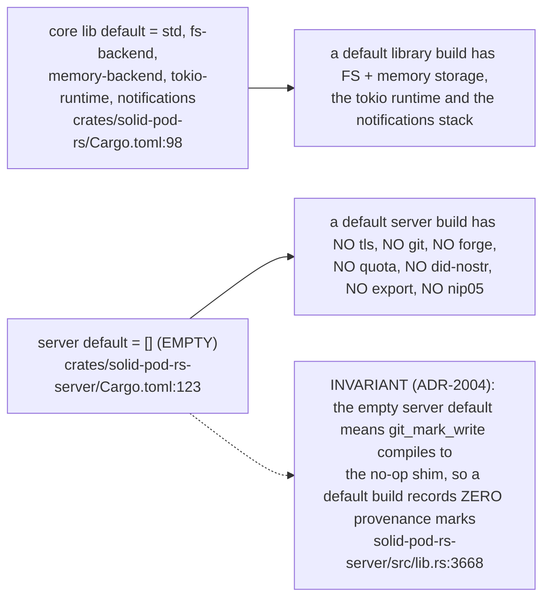

## SP-01.8 Server feature pass-throughs and the git/forge chain

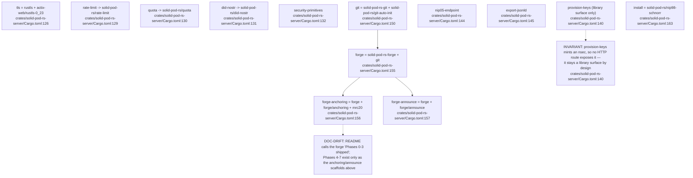

## SP-01.9 Sibling crate feature surfaces

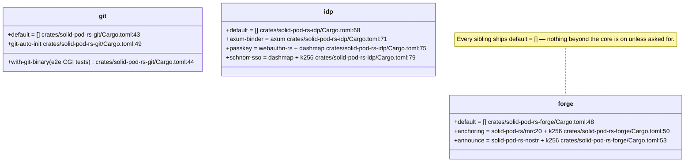

## SP-01.10 The one trait every consumer bolts onto

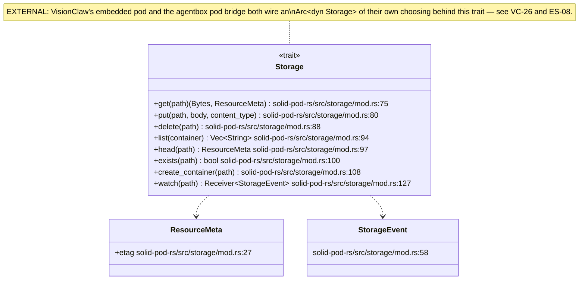

## SP-01.11 Supply-chain gates the workspace applies to itself

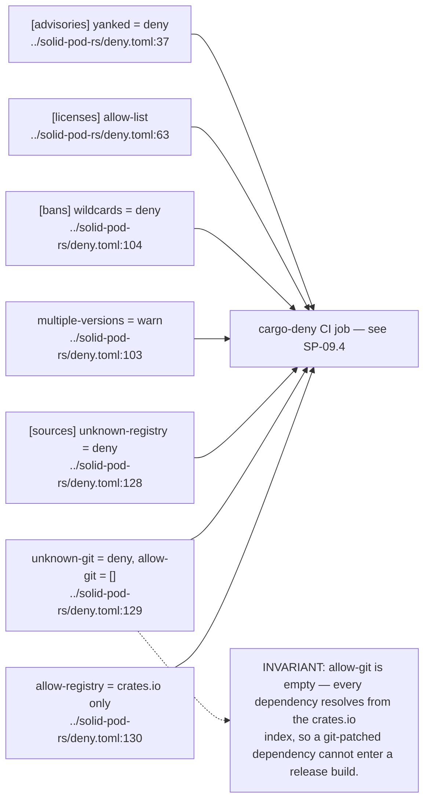

## SP-01.12 The `examples/` integration surface — the library-first contract

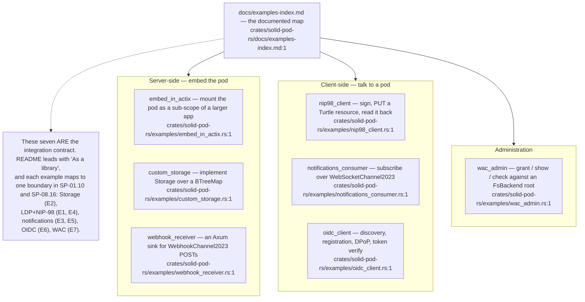

## SP-01.13 Example registration and the compilation gate

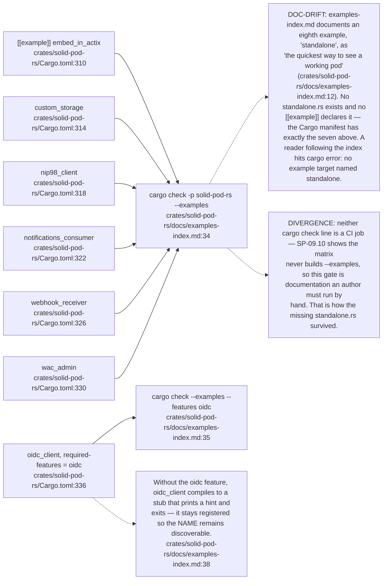
