## SP-02.1 Process entry point — CLI to listening socket

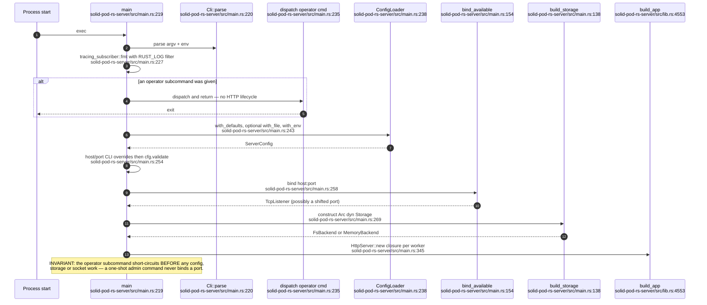

## SP-02.2 AppState assembly order

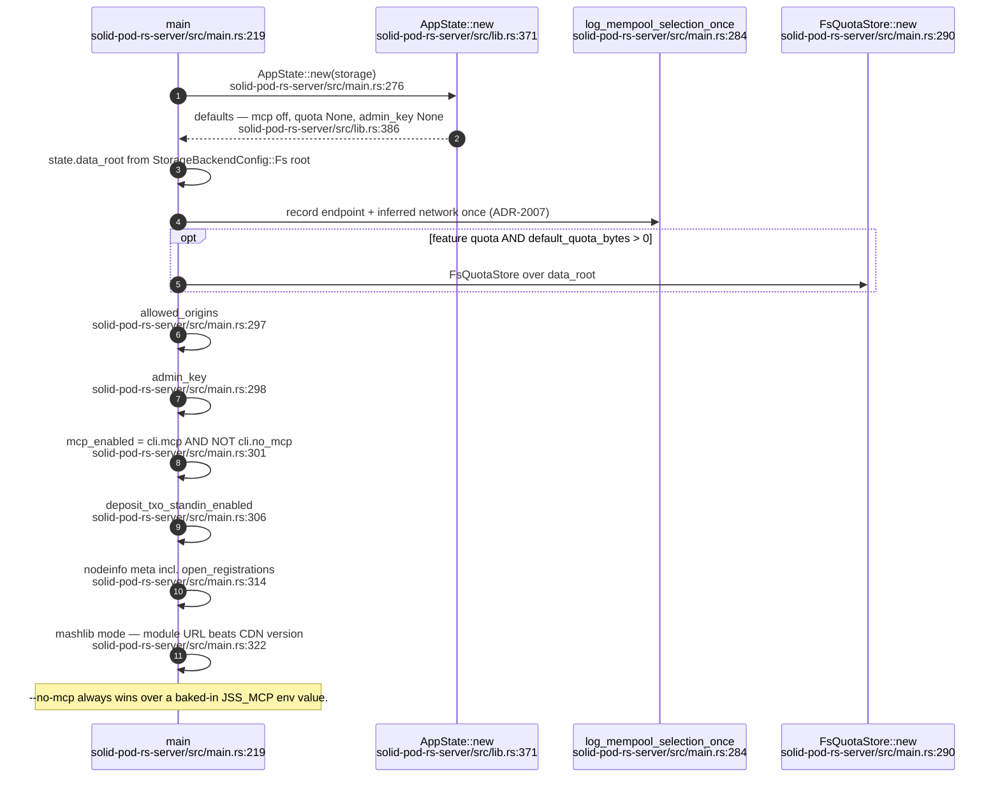

## SP-02.3 The security-relevant CLI/env register

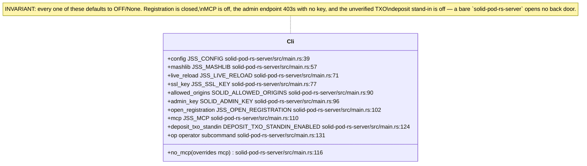

## SP-02.4 Layered configuration resolution

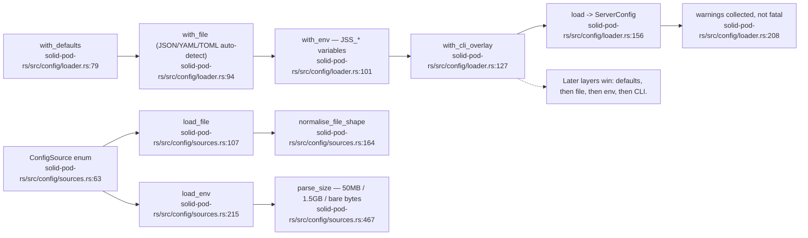

## SP-02.5 ServerConfig shape and the one hard validation

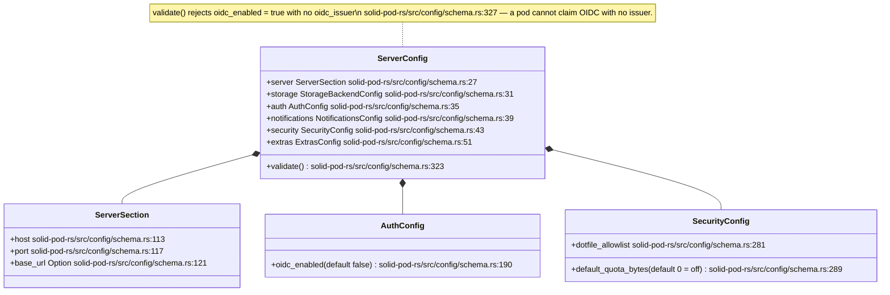

## SP-02.6 Storage backend selection — only two survive

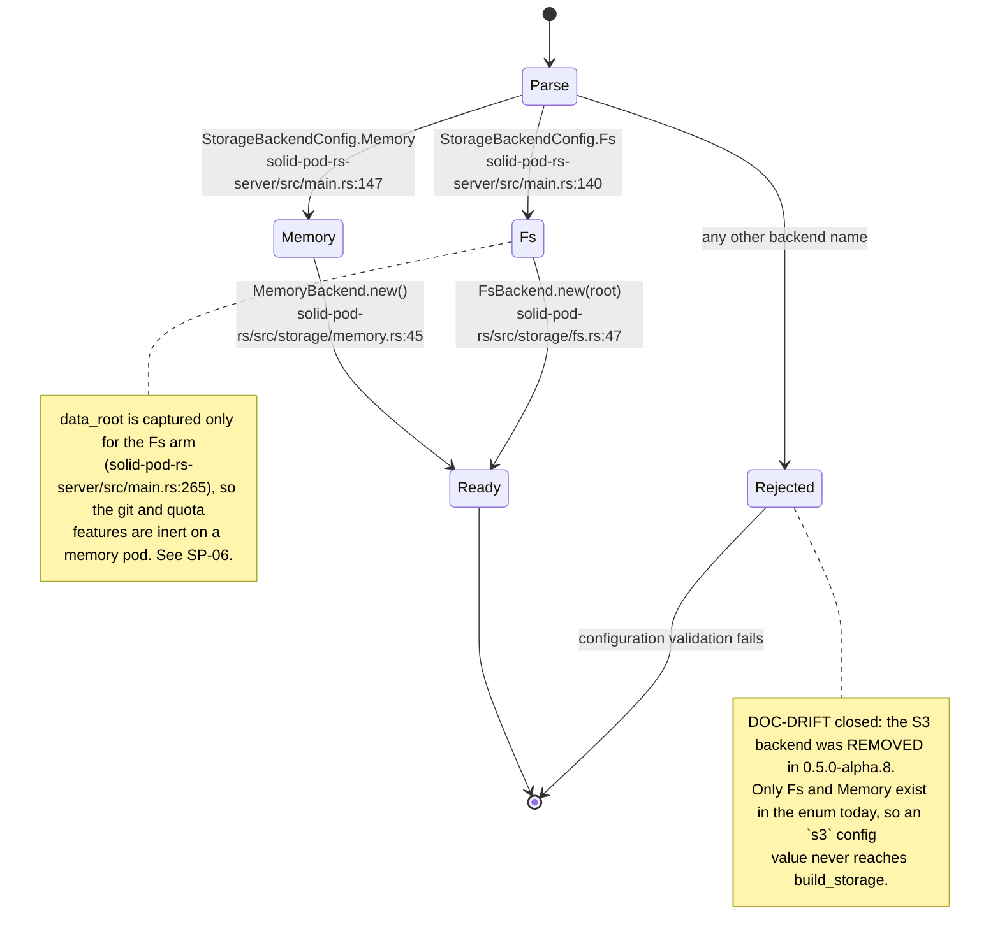

## SP-02.7 Port binding — busy-port shift

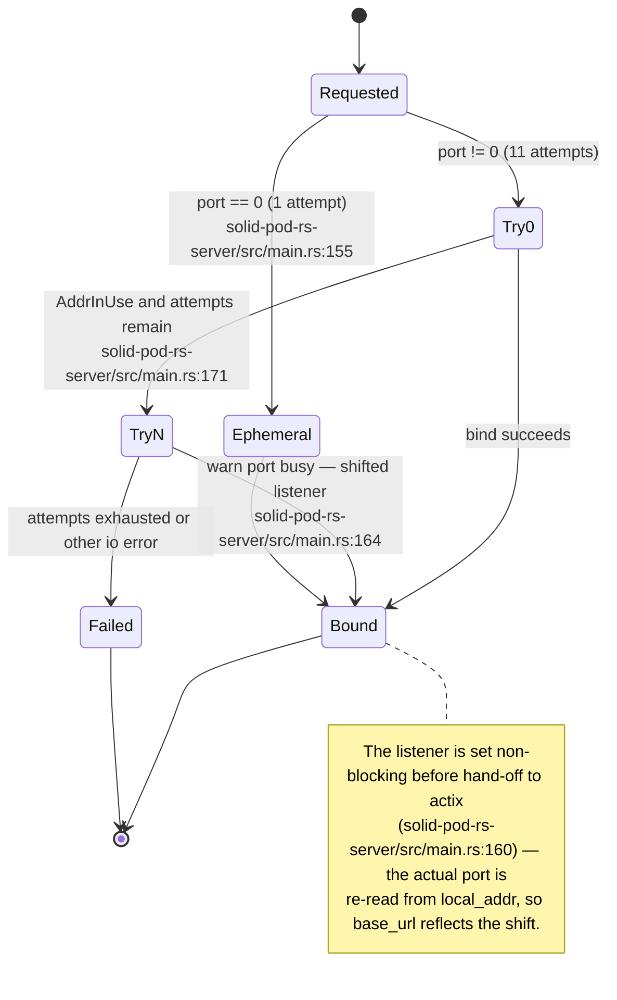

## SP-02.8 Middleware stack — registration order versus execution order

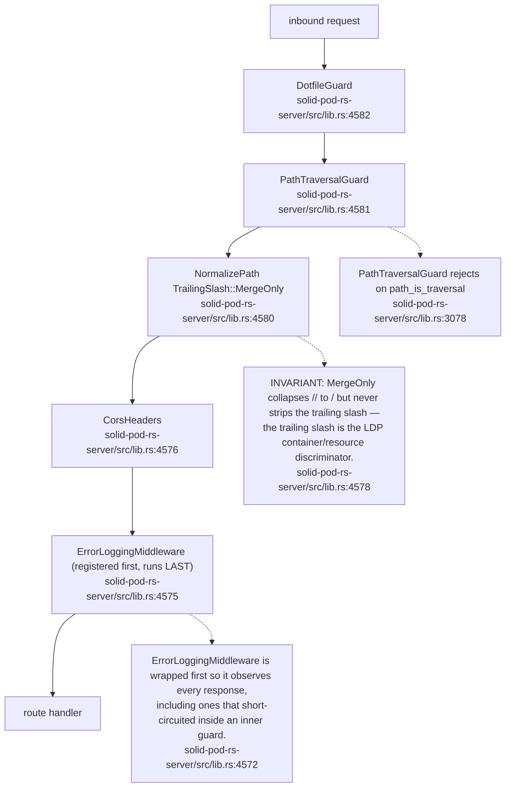

## SP-02.9 Route table — discovery, payments, admin and account routes

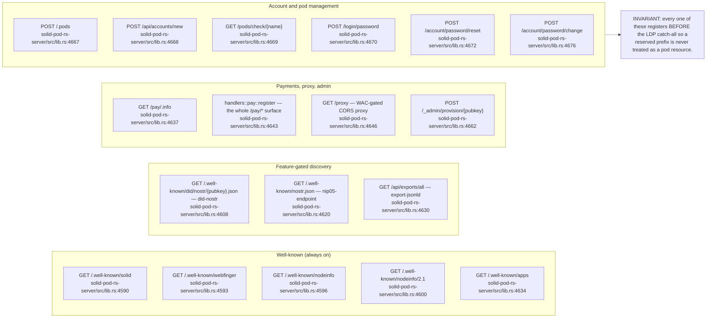

## SP-02.10 Route table — git, forge and MCP surfaces

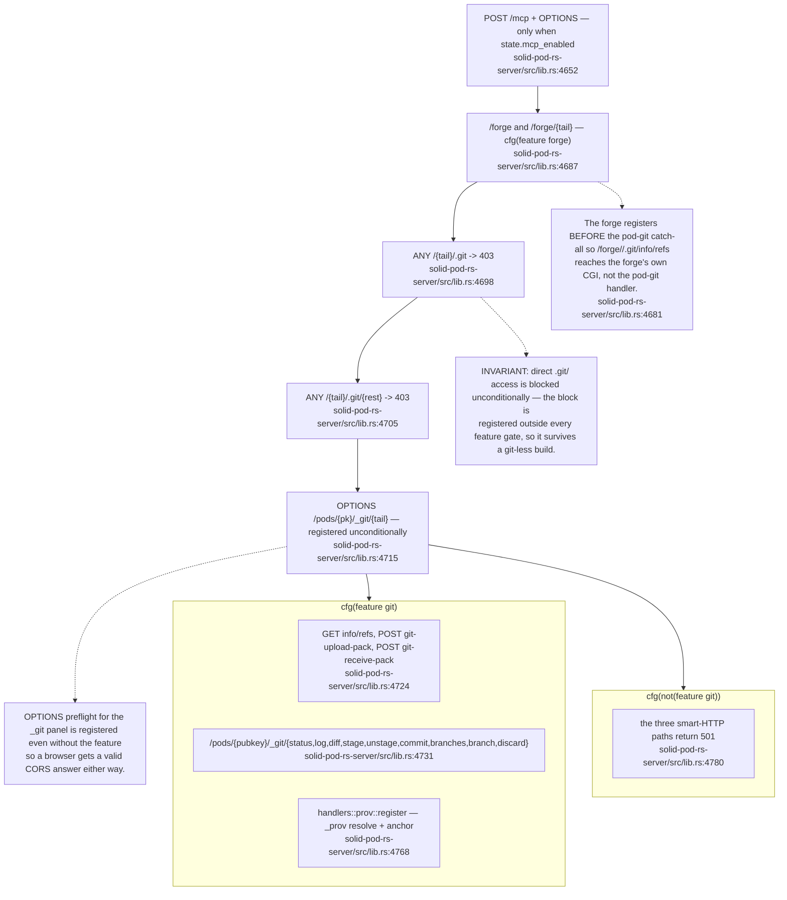

## SP-02.11 Route table — the LDP catch-all, registered last

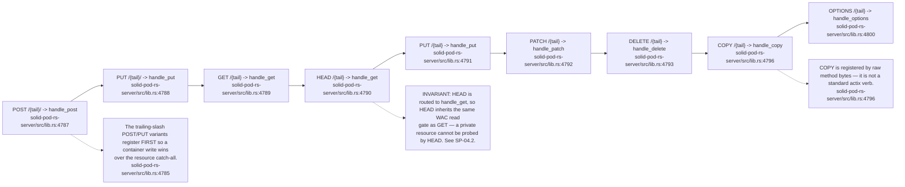

## SP-02.12 Graceful shutdown

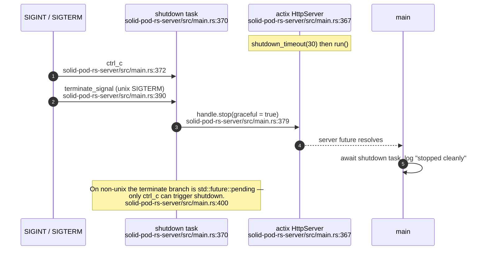

## SP-02.13 Operator subcommands — the no-HTTP path

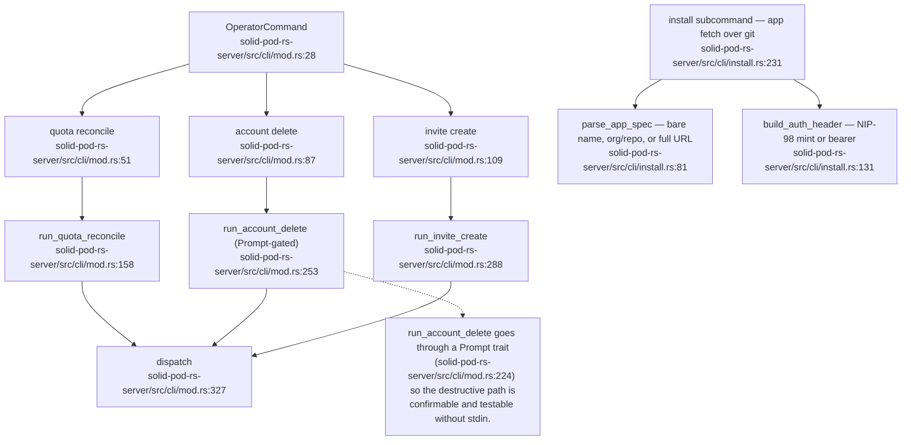
