## SP-03.1 GET — the full read path

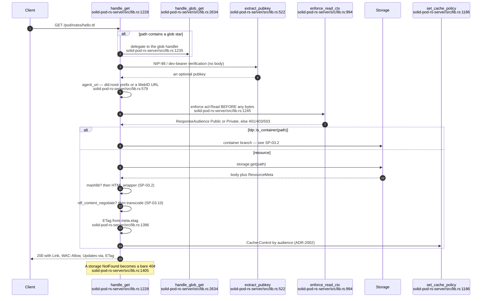

## SP-03.2 Container GET — three representations

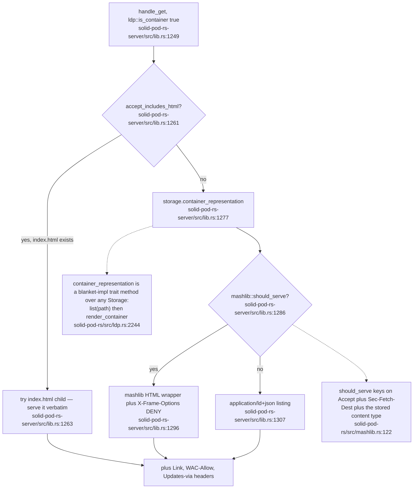

## SP-03.3 PUT — resource and container creation

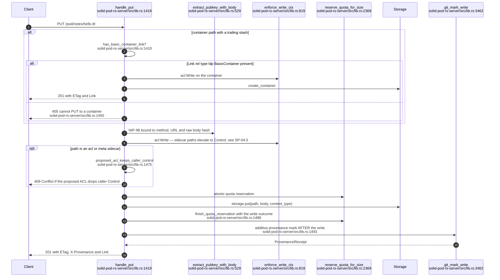

## SP-03.4 POST — Append, Slug resolution and unique-name minting

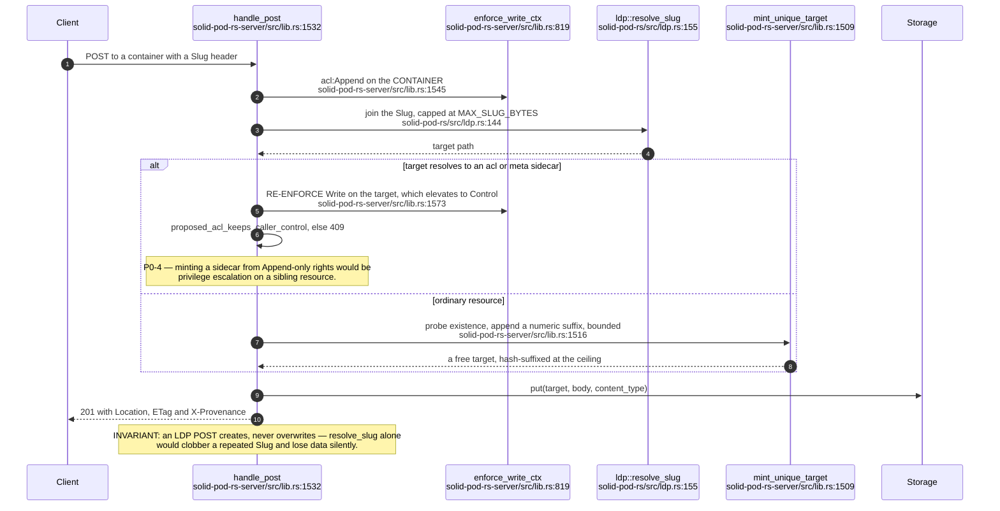

## SP-03.5 PATCH — non-destructive, three dialects

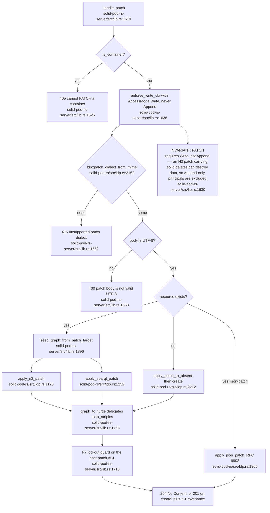

## SP-03.6 The non-destructive-write invariant

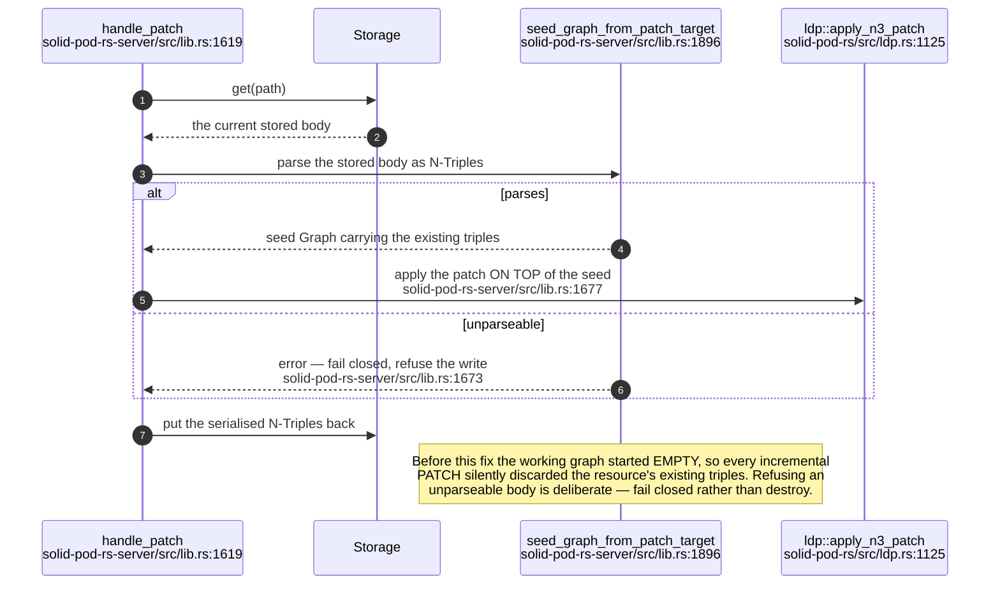

## SP-03.7 DELETE and OPTIONS

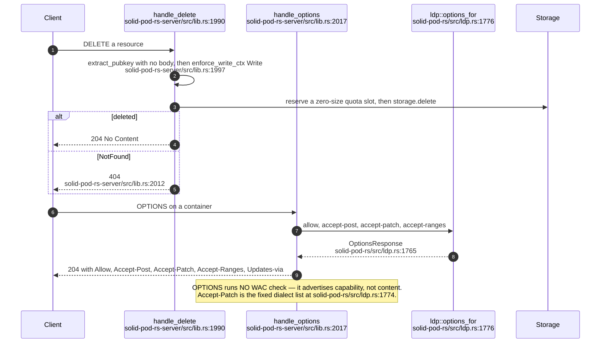

## SP-03.8 COPY — the non-standard verb

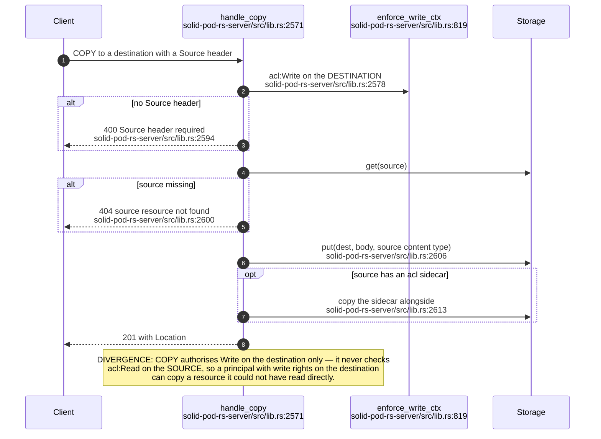

## SP-03.9 Glob GET

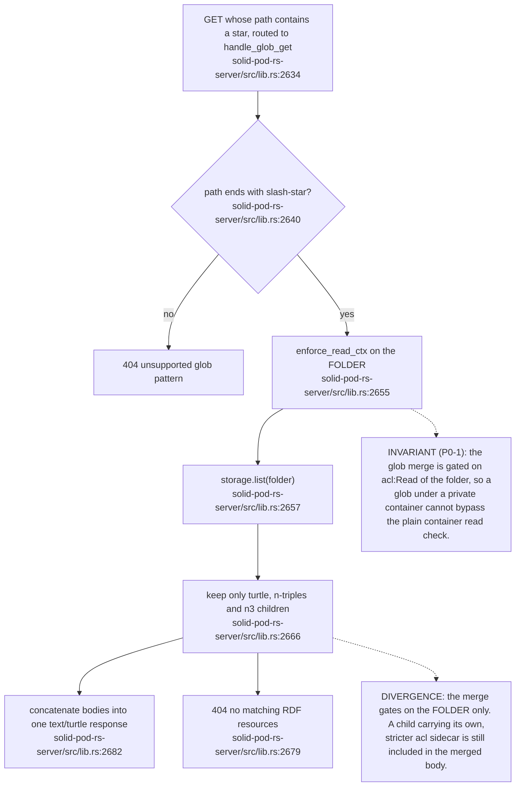

## SP-03.10 RDF content negotiation

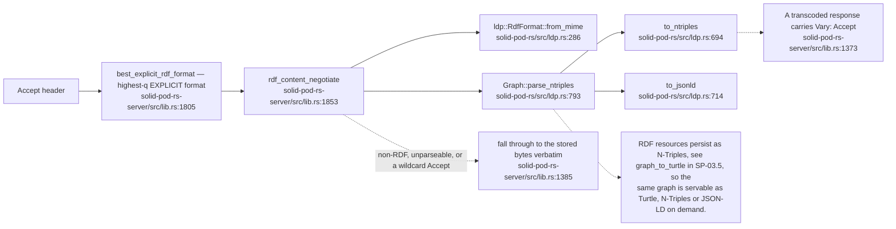

## SP-03.11 Response headers set on every LDP response

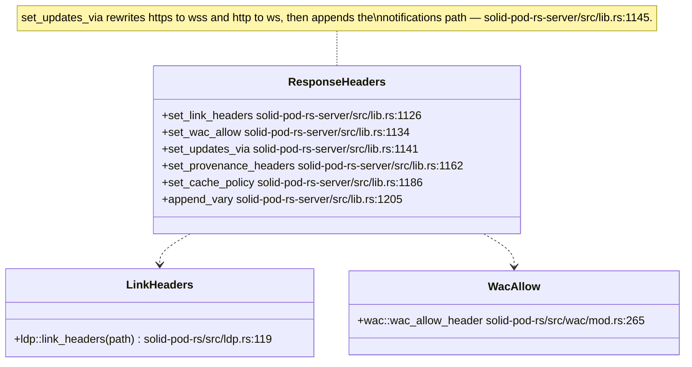

## SP-03.12 ADR-2002 cache policy — audience beats media type

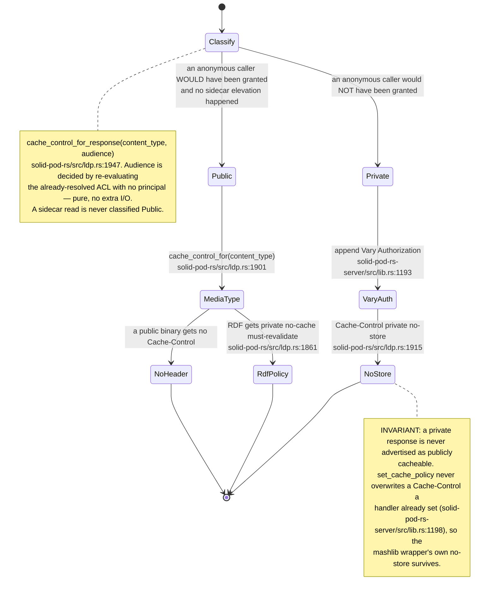

## SP-03.13 Error translation — PodError to HTTP status

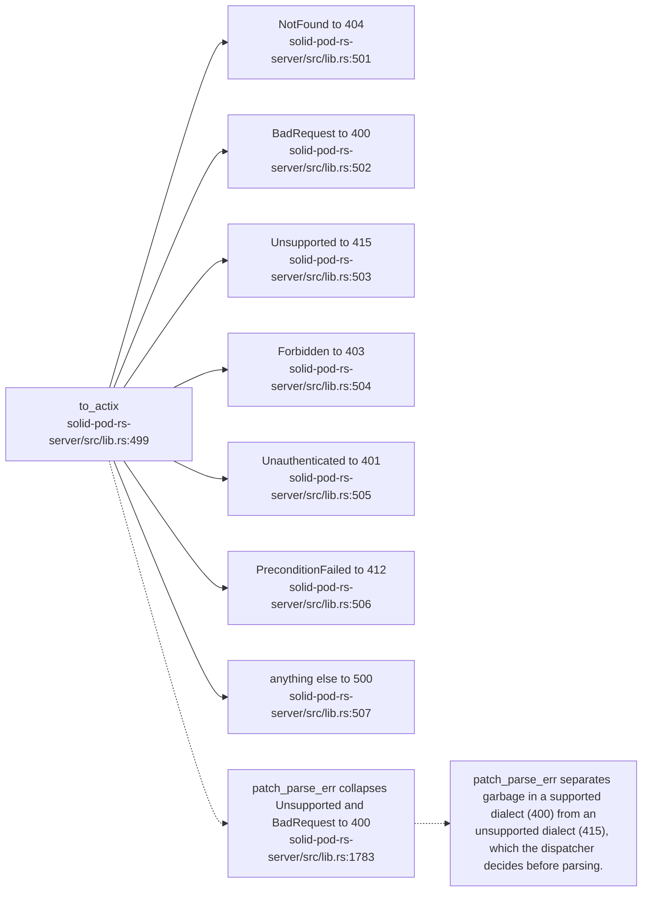
