## SP-04.1 The write gate, end to end

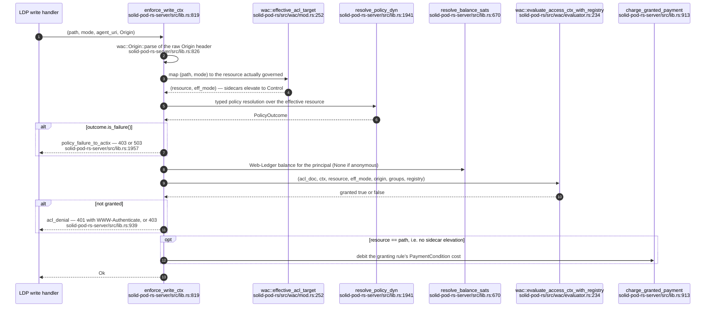

## SP-04.2 The read gate and the ADR-2002 audience classification

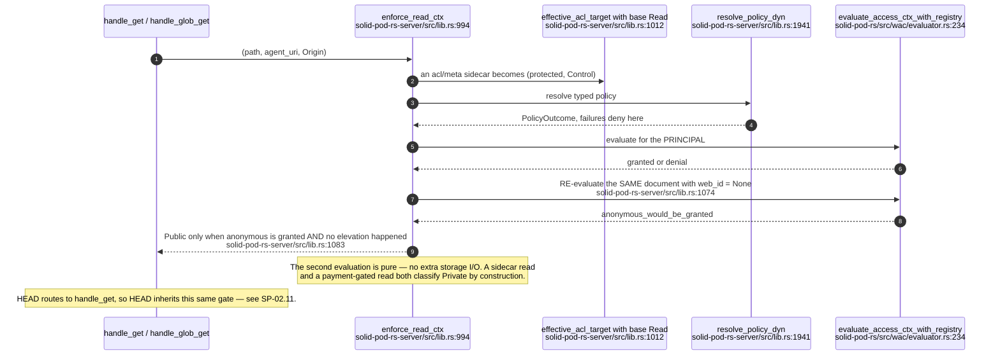

## SP-04.3 Typed policy outcomes — only absence inherits

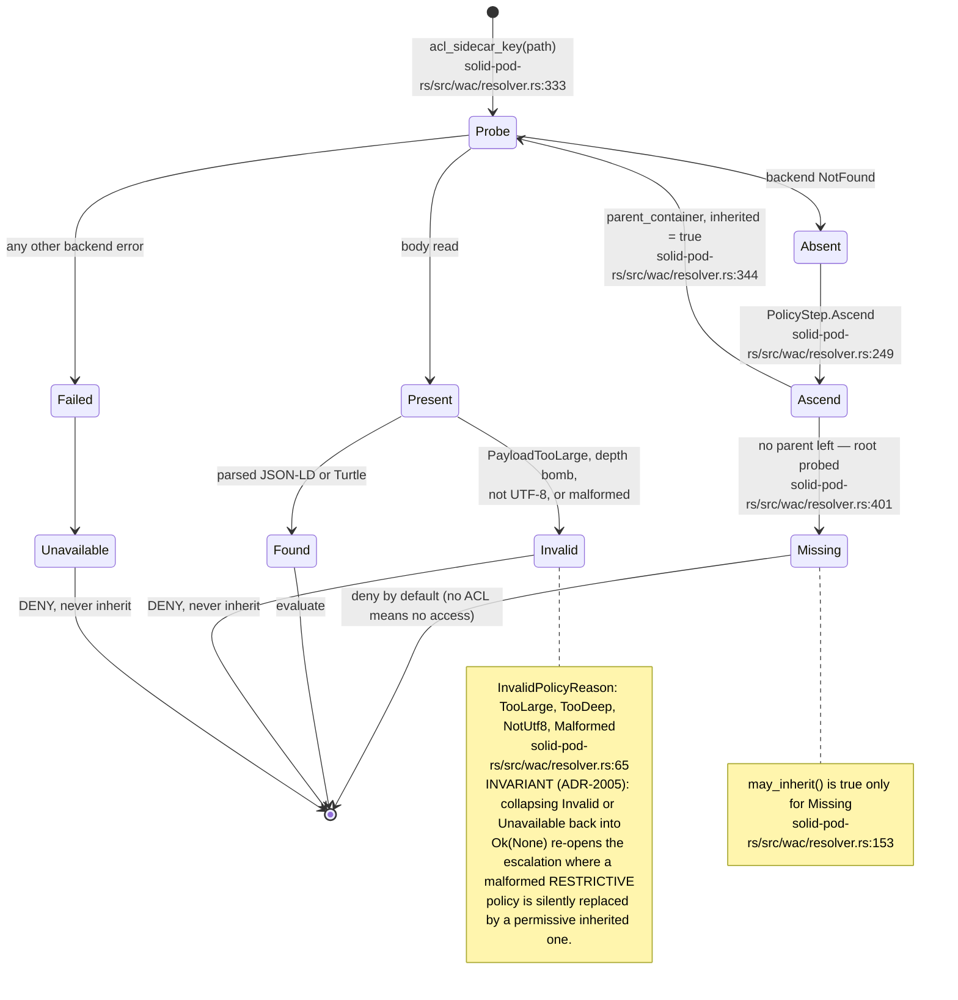

## SP-04.4 classify_policy_read — one level, runtime-free

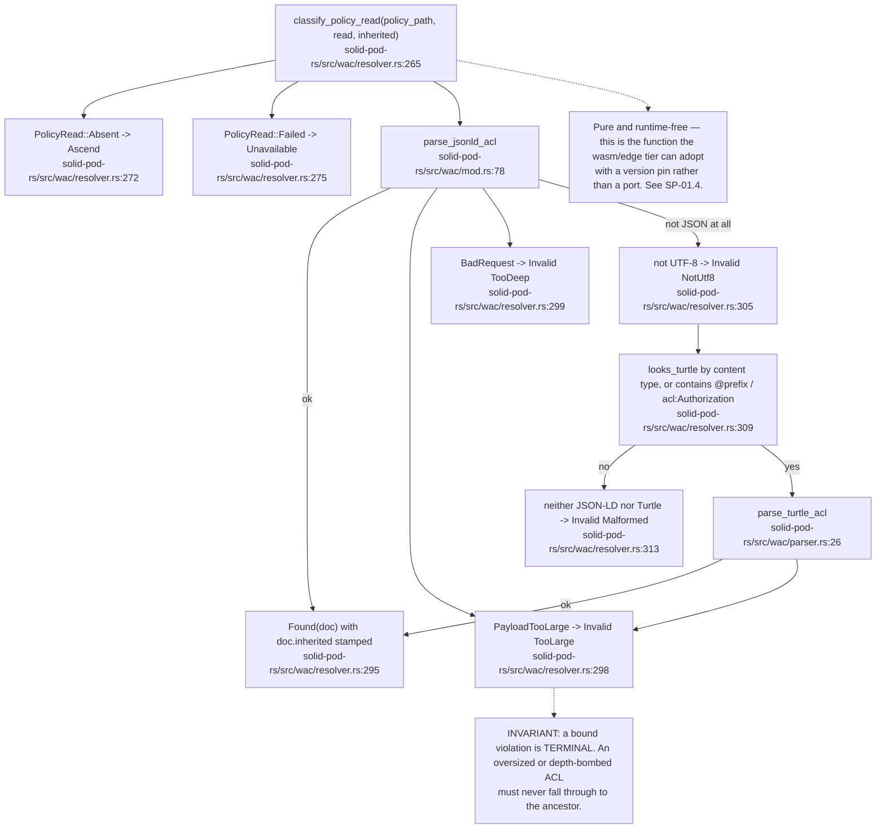

## SP-04.5 The sidecar rule — one function for read and write

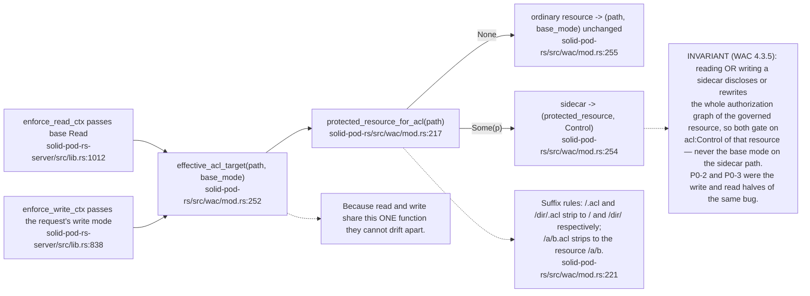

## SP-04.6 The lockout guard — you may not ACL yourself out

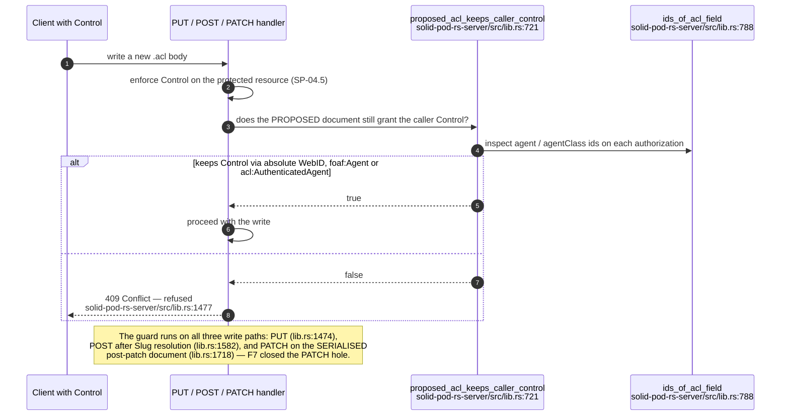

## SP-04.7 evaluate_access_ctx_inner — the decision loop

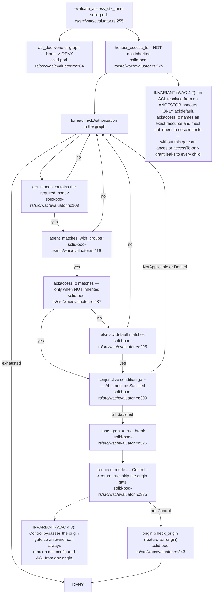

## SP-04.8 The origin gate — off by default

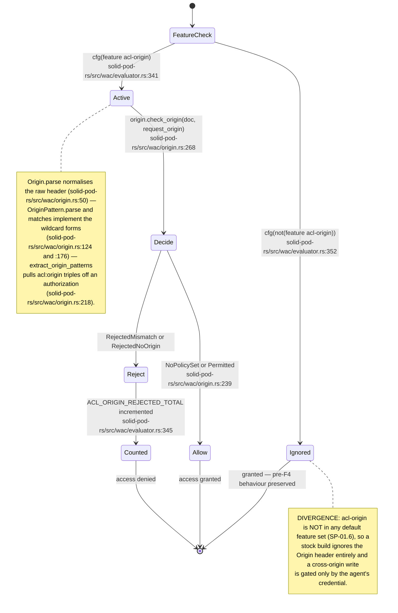

## SP-04.9 Parser bounds — fail closed at the boundary

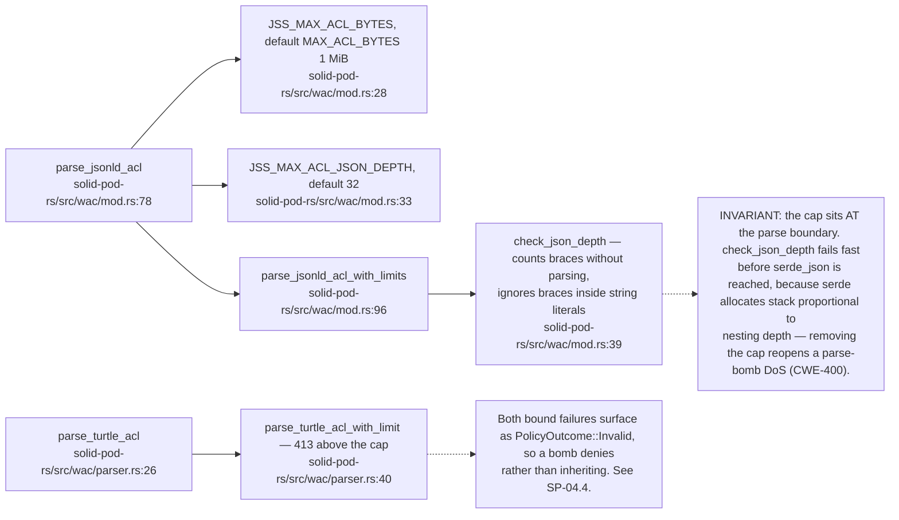

## SP-04.10 The Turtle ACL parser

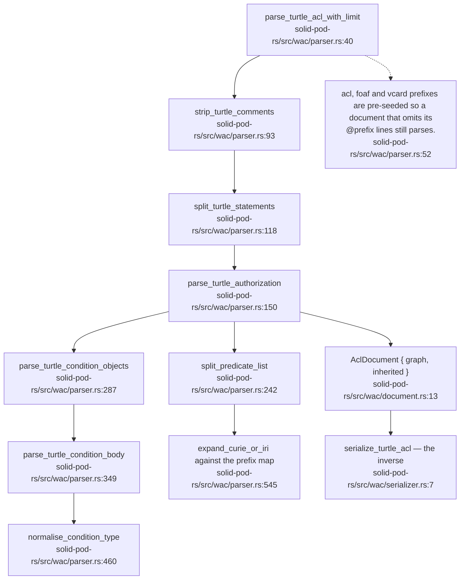

## SP-04.11 Access modes and the ACL document model

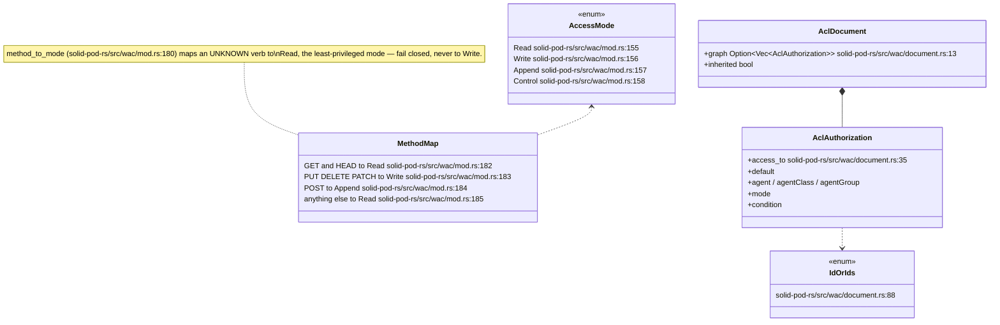

## SP-04.12 The condition registry

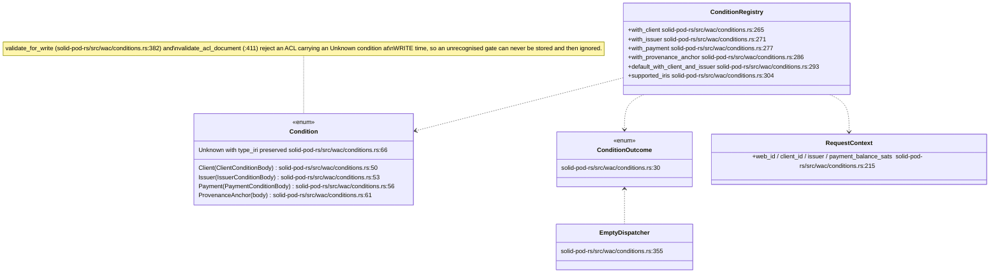

## SP-04.13 Payment, client, issuer and provenance-anchor conditions

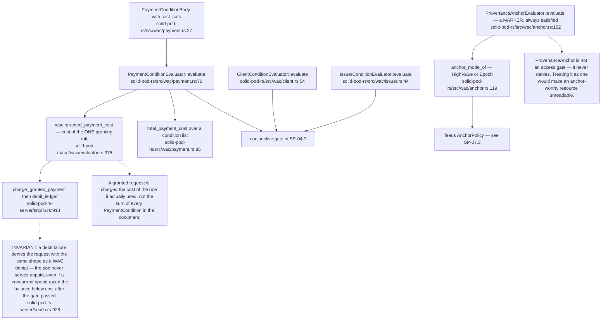

## SP-04.14 Denial shape

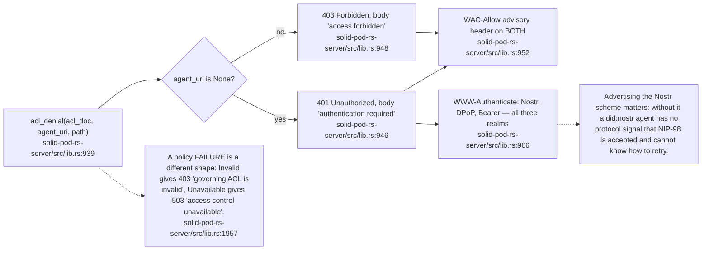
