**Repair note — 2026-11-03:** selected counterexamples below have a [scoped successor verification](15-authority-and-payment-repairs.md). The successor states the repaired contracts and acceptance boundaries at its own revision.

## SP-04.1 The write gate, end to end

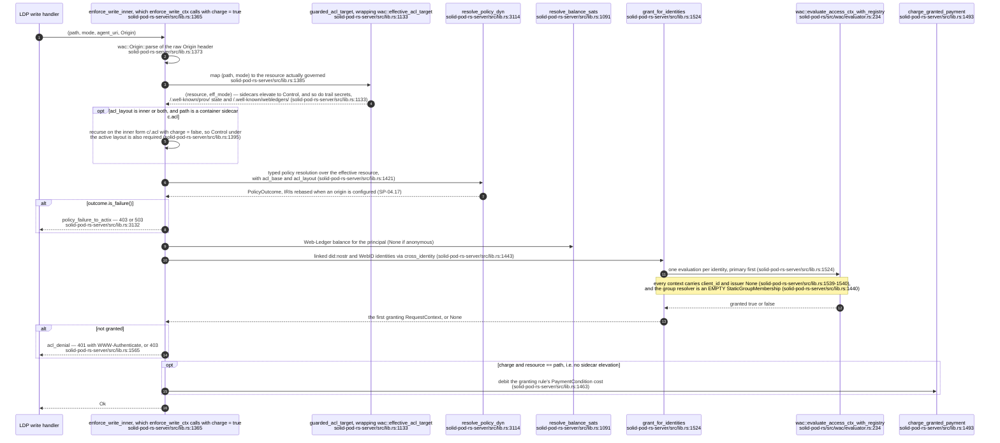
```mermaid
sequenceDiagram
    autonumber
    participant H as LDP write handler
    participant EW as enforce_write_inner, which enforce_write_ctx calls with charge = true<br/>solid-pod-rs-server/src/lib.rs:1365
    participant ET as guarded_acl_target, wrapping wac::effective_acl_target<br/>solid-pod-rs-server/src/lib.rs:1133
    participant RP as resolve_policy_dyn<br/>solid-pod-rs-server/src/lib.rs:3114
    participant BAL as resolve_balance_sats<br/>solid-pod-rs-server/src/lib.rs:1091
    participant GI as grant_for_identities<br/>solid-pod-rs-server/src/lib.rs:1524
    participant EV as wac::evaluate_access_ctx_with_registry<br/>solid-pod-rs/src/wac/evaluator.rs:234
    participant CH as charge_granted_payment<br/>solid-pod-rs-server/src/lib.rs:1493

    H->>EW: (path, mode, agent_uri, Origin)
    EW->>EW: wac::Origin::parse of the raw Origin header<br/>solid-pod-rs-server/src/lib.rs:1373
    EW->>ET: map (path, mode) to the resource actually governed<br/>solid-pod-rs-server/src/lib.rs:1385
    ET-->>EW: (resource, eff_mode) — sidecars elevate to Control, and so do trail secrets,<br/>/.well-known/prov/ state and /.well-known/webledgers/ (solid-pod-rs-server/src/lib.rs:1133)
    opt acl_layout is inner or both, and path is a container sidecar c.acl
        EW->>EW: recurse on the inner form c/.acl with charge = false, so Control under<br/>the active layout is also required (solid-pod-rs-server/src/lib.rs:1395)
    end
    EW->>RP: typed policy resolution over the effective resource,<br/>with acl_base and acl_layout (solid-pod-rs-server/src/lib.rs:1421)
    RP-->>EW: PolicyOutcome, IRIs rebased when an origin is configured (SP-04.17)
    alt outcome.is_failure()
        EW-->>H: policy_failure_to_actix — 403 or 503<br/>solid-pod-rs-server/src/lib.rs:3132
    end
    EW->>BAL: Web-Ledger balance for the principal (None if anonymous)
    EW->>GI: linked did:nostr and WebID identities via cross_identity (solid-pod-rs-server/src/lib.rs:1443)
    GI->>EV: one evaluation per identity, primary first (solid-pod-rs-server/src/lib.rs:1524)
    Note over GI,EV: every context carries client_id and issuer None (solid-pod-rs-server/src/lib.rs:1539-1540),<br/>and the group resolver is an EMPTY StaticGroupMembership (solid-pod-rs-server/src/lib.rs:1440)
    EV-->>GI: granted true or false
    GI-->>EW: the first granting RequestContext, or None
    alt not granted
        EW-->>H: acl_denial — 401 with WWW-Authenticate, or 403<br/>solid-pod-rs-server/src/lib.rs:1565
    end
    opt charge and resource == path, i.e. no sidecar elevation
        EW->>CH: debit the granting rule's PaymentCondition cost<br/>(solid-pod-rs-server/src/lib.rs:1463)
    end
    EW-->>H: Ok
```

**What it shows / Why it is this way:** the write gate no longer calls `effective_acl_target` directly: `guarded_acl_target` adds the server-managed state paths, and `grant_for_identities` evaluates the ACL once per linked identity so a `did:nostr` caller with a verified WebID link matches an ACL naming either.

**Invariant:** trail secrets, `/.well-known/prov/` state and `/.well-known/webledgers/` are evaluated as `acl:Control` on themselves, so no ordinary Read or Write grant reaches them over HTTP (`solid-pod-rs-server/src/lib.rs:1133`). A path that cannot be canonicalised is also held to Control (`solid-pod-rs-server/src/lib.rs:1146`).

**Tension:** the admission context is narrower than the WAC 2.0 vocabulary the evaluator accepts. The native gate never supplies a client or issuer, and it passes an empty group map, so `acl:agentGroup`, and client or issuer conditions other than the `foaf:Agent` class, cannot grant here (see SP-04.13 and SP-04.15).

## SP-04.2 The read gate and the ADR-2002 audience classification

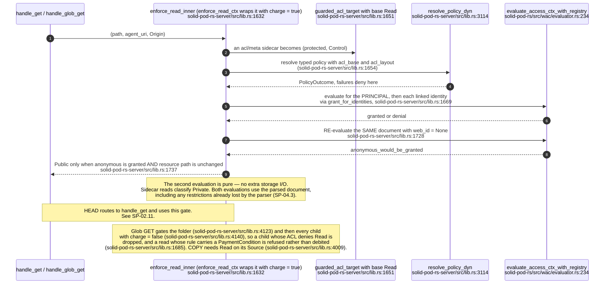
```mermaid
sequenceDiagram
    autonumber
    participant H as handle_get / handle_glob_get
    participant ER as enforce_read_inner (enforce_read_ctx wraps it with charge = true)<br/>solid-pod-rs-server/src/lib.rs:1632
    participant ET as guarded_acl_target with base Read<br/>solid-pod-rs-server/src/lib.rs:1651
    participant RP as resolve_policy_dyn<br/>solid-pod-rs-server/src/lib.rs:3114
    participant EV as evaluate_access_ctx_with_registry<br/>solid-pod-rs/src/wac/evaluator.rs:234

    H->>ER: (path, agent_uri, Origin)
    ER->>ET: an acl/meta sidecar becomes (protected, Control)
    ER->>RP: resolve typed policy with acl_base and acl_layout<br/>(solid-pod-rs-server/src/lib.rs:1654)
    RP-->>ER: PolicyOutcome, failures deny here
    ER->>EV: evaluate for the PRINCIPAL, then each linked identity<br/>via grant_for_identities, solid-pod-rs-server/src/lib.rs:1669
    EV-->>ER: granted or denial
    ER->>EV: RE-evaluate the SAME document with web_id = None<br/>solid-pod-rs-server/src/lib.rs:1728
    EV-->>ER: anonymous_would_be_granted
    ER-->>H: Public only when anonymous is granted AND resource path is unchanged<br/>solid-pod-rs-server/src/lib.rs:1737
    Note over ER: The second evaluation is pure — no extra storage I/O.<br/>Sidecar reads classify Private. Both evaluations use the parsed document,<br/>including any restrictions already lost by the parser (SP-04.3).
    Note over H,ER: HEAD routes to handle_get and uses this gate.<br/>See SP-02.11.
    Note over ER: Glob GET gates the folder (solid-pod-rs-server/src/lib.rs:4123) and then every child<br/>with charge = false (solid-pod-rs-server/src/lib.rs:4140), so a child whose ACL denies Read is<br/>dropped, and a read whose rule carries a PaymentCondition is refused rather than debited<br/>(solid-pod-rs-server/src/lib.rs:1685). COPY needs Read on its Source (solid-pod-rs-server/src/lib.rs:4009).
```

## SP-04.3 Typed policy outcomes — only absence inherits

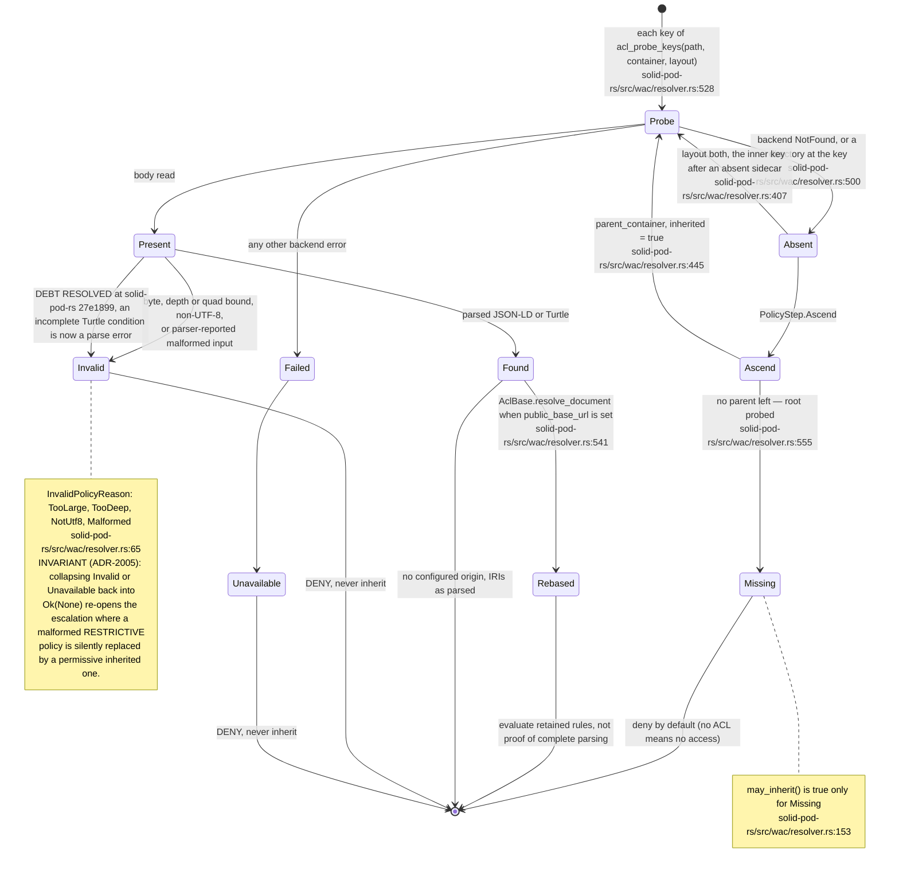
```mermaid
stateDiagram-v2
    [*] --> Probe: each key of acl_probe_keys(path, container, layout)<br/>solid-pod-rs/src/wac/resolver.rs:528
    Probe --> Absent: backend NotFound, or a directory at the key<br/>solid-pod-rs/src/wac/resolver.rs:500
    Probe --> Present: body read
    Probe --> Failed: any other backend error

    %% Source: solid-pod-rs/src/wac/resolver.rs:249
    Absent --> Probe: layout both, the inner key after an absent sidecar<br/>solid-pod-rs/src/wac/resolver.rs:407
    Absent --> Ascend: PolicyStep.Ascend
    Ascend --> Probe: parent_container, inherited = true<br/>solid-pod-rs/src/wac/resolver.rs:445
    Ascend --> Missing: no parent left — root probed<br/>solid-pod-rs/src/wac/resolver.rs:555

    Present --> Found: parsed JSON-LD or Turtle
    Present --> Invalid: byte, depth or quad bound, non-UTF-8,<br/>or parser-reported malformed input
    Present --> Invalid: DEBT RESOLVED at solid-pod-rs 27e1899, an incomplete Turtle condition is now a parse error
    Failed --> Unavailable

    Missing --> [*]: deny by default (no ACL means no access)
    Found --> Rebased: AclBase.resolve_document when public_base_url is set<br/>solid-pod-rs/src/wac/resolver.rs:541
    Rebased --> [*]: evaluate retained rules, not proof of complete parsing
    Found --> [*]: no configured origin, IRIs as parsed
    Invalid --> [*]: DENY, never inherit
    Unavailable --> [*]: DENY, never inherit

    note right of Invalid
      InvalidPolicyReason: TooLarge, TooDeep, NotUtf8, Malformed
      solid-pod-rs/src/wac/resolver.rs:65
      INVARIANT (ADR-2005): collapsing Invalid or Unavailable back into
      Ok(None) re-opens the escalation where a malformed RESTRICTIVE
      policy is silently replaced by a permissive inherited one.
    end note
    note right of Missing
      may_inherit() is true only for Missing
      solid-pod-rs/src/wac/resolver.rs:153
    end note
```

**Debt:** RESOLVED at solid-pod-rs 27e1899. The typed resolver prevents fallback after reported failure, and the Turtle parser now reports an unbalanced or typeless condition as an error (`solid-pod-rs/src/wac/parser.rs:484-486`, `solid-pod-rs/src/wac/parser.rs:489-491`) that the resolver maps to Malformed (`solid-pod-rs/src/wac/resolver.rs:209-211`), instead of reporting Found after discarding it. [Native probes](../../estate-review/2026-11-01-solid-policy-parsing.md) distinguish that direct grant from inheritance.

## SP-04.4 classify_policy_read — one level, runtime-free

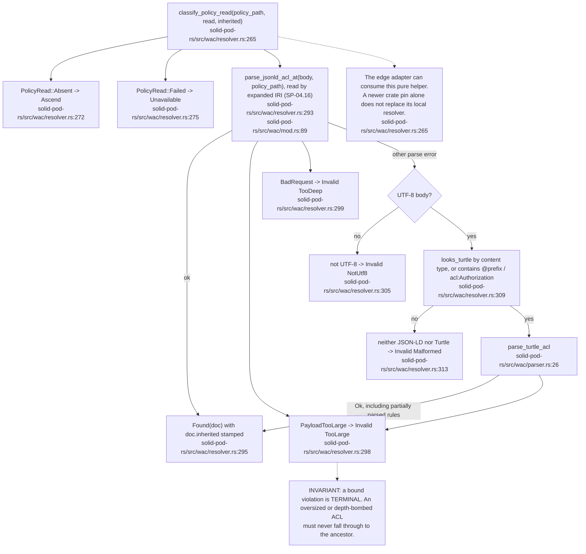
```mermaid
flowchart TD
    IN["classify_policy_read(policy_path, read, inherited)<br/>solid-pod-rs/src/wac/resolver.rs:265"]
    ABS["PolicyRead::Absent -> Ascend<br/>solid-pod-rs/src/wac/resolver.rs:272"]
    FAIL["PolicyRead::Failed -> Unavailable<br/>solid-pod-rs/src/wac/resolver.rs:275"]
    JL["parse_jsonld_acl_at(body, policy_path), read by expanded IRI (SP-04.16)<br/>solid-pod-rs/src/wac/resolver.rs:293<br/>solid-pod-rs/src/wac/mod.rs:89"]
    TOOBIG["PayloadTooLarge -> Invalid TooLarge<br/>solid-pod-rs/src/wac/resolver.rs:298"]
    TOODEEP["BadRequest -> Invalid TooDeep<br/>solid-pod-rs/src/wac/resolver.rs:299"]
    UTF["not UTF-8 -> Invalid NotUtf8<br/>solid-pod-rs/src/wac/resolver.rs:305"]
    SNIFF["looks_turtle by content type, or contains @prefix / acl:Authorization<br/>solid-pod-rs/src/wac/resolver.rs:309"]
    MAL["neither JSON-LD nor Turtle -> Invalid Malformed<br/>solid-pod-rs/src/wac/resolver.rs:313"]
    TT["parse_turtle_acl<br/>solid-pod-rs/src/wac/parser.rs:26"]
    FOUND["Found(doc) with doc.inherited stamped<br/>solid-pod-rs/src/wac/resolver.rs:295"]

    IN --> ABS
    IN --> FAIL
    IN --> JL
    JL -- ok --> FOUND
    JL --> TOOBIG
    JL --> TOODEEP
    JL -- "other parse error" --> DEC{"UTF-8 body?"}
    DEC -- no --> UTF
    DEC -- yes --> SNIFF
    SNIFF -- no --> MAL
    SNIFF -- yes --> TT
    TT -- "Ok, including partially parsed rules" --> FOUND
    TT --> TOOBIG

    N["INVARIANT: a bound violation is TERMINAL. An oversized or depth-bombed ACL<br/>must never fall through to the ancestor."]
    TOOBIG -.-> N
    N2["The edge adapter can consume this pure helper.<br/>A newer crate pin alone does not replace its local resolver.<br/>solid-pod-rs/src/wac/resolver.rs:265"]
    IN -.-> N2
```

## SP-04.5 The sidecar rule — one function for read and write

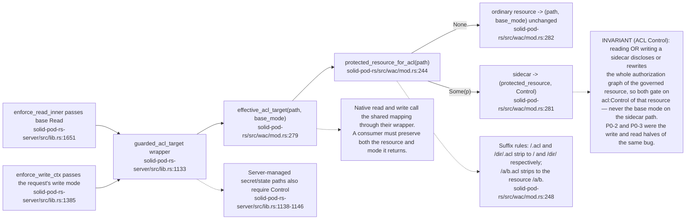
```mermaid
flowchart LR
    IN["effective_acl_target(path, base_mode)<br/>solid-pod-rs/src/wac/mod.rs:279"]
    PR["protected_resource_for_acl(path)<br/>solid-pod-rs/src/wac/mod.rs:244"]
    ORD["ordinary resource -> (path, base_mode) unchanged<br/>solid-pod-rs/src/wac/mod.rs:282"]
    ELV["sidecar -> (protected_resource, Control)<br/>solid-pod-rs/src/wac/mod.rs:281"]
    RD["enforce_read_inner passes base Read<br/>solid-pod-rs-server/src/lib.rs:1651"]
    WR["enforce_write_ctx passes the request's write mode<br/>solid-pod-rs-server/src/lib.rs:1385"]

    IN --> PR
    PR -- None --> ORD
    PR -- "Some(p)" --> ELV
    RD --> GUARD["guarded_acl_target wrapper<br/>solid-pod-rs-server/src/lib.rs:1133"]
    WR --> GUARD
    GUARD --> IN
    GUARD -.-> EXTRA["Server-managed secret/state paths also require Control<br/>solid-pod-rs-server/src/lib.rs:1138-1146"]

    N1["Suffix rules: /.acl and /dir/.acl strip to / and /dir/ respectively;<br/>/a/b.acl strips to the resource /a/b.<br/>solid-pod-rs/src/wac/mod.rs:248"]
    PR -.-> N1
    N2["INVARIANT (ACL Control): reading OR writing a sidecar discloses or rewrites<br/>the whole authorization graph of the governed resource, so both gate on<br/>acl:Control of that resource — never the base mode on the sidecar path.<br/>P0-2 and P0-3 were the write and read halves of the same bug."]
    ELV -.-> N2
    N3["Native read and write call the shared mapping through their wrapper.<br/>A consumer must preserve both the resource and mode it returns."]
    IN -.-> N3
```

**Open:** narrowed, not closed, by the opt-in container ACL layout (SP-04.18). `protected_resource_for_acl` maps `/dir/.acl` to `/dir/` (`solid-pod-rs/src/wac/mod.rs:247`), so writing it needs Control on `/dir/`. Under the default `sidecar` layout the resolver still reads only `/dir.acl` (`solid-pod-rs/src/wac/resolver.rs:405`), so a stored `/dir/.acl` stays protected but never enforced; `inner` reads only the inner form and `both` reads it when the sidecar is absent (`solid-pod-rs/src/wac/resolver.rs:406-407`). Discovery advertises the key the active layout writes (`solid-pod-rs/src/ldp.rs:160`), and the operator reviews existing copies with `--acl-layout-report` before opting in (`solid-pod-rs-server/src/main.rs:394`).

## SP-04.6 The lockout guard — an unparseable body is 400, a lockout is 409

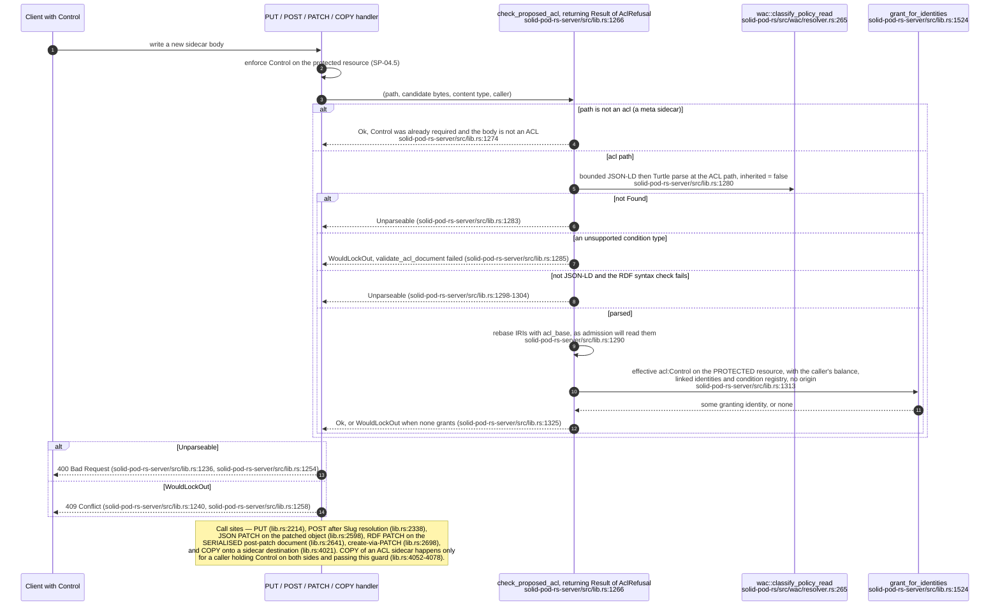
```mermaid
sequenceDiagram
    autonumber
    participant C as Client with Control
    participant H as PUT / POST / PATCH / COPY handler
    participant G as check_proposed_acl, returning Result of AclRefusal<br/>solid-pod-rs-server/src/lib.rs:1266
    participant CP as wac::classify_policy_read<br/>solid-pod-rs/src/wac/resolver.rs:265
    participant GI as grant_for_identities<br/>solid-pod-rs-server/src/lib.rs:1524

    C->>H: write a new sidecar body
    H->>H: enforce Control on the protected resource (SP-04.5)
    H->>G: (path, candidate bytes, content type, caller)
    alt path is not an acl (a meta sidecar)
        G-->>H: Ok, Control was already required and the body is not an ACL<br/>solid-pod-rs-server/src/lib.rs:1274
    else acl path
        G->>CP: bounded JSON-LD then Turtle parse at the ACL path, inherited = false<br/>solid-pod-rs-server/src/lib.rs:1280
        alt not Found
            G-->>H: Unparseable (solid-pod-rs-server/src/lib.rs:1283)
        else an unsupported condition type
            G-->>H: WouldLockOut, validate_acl_document failed (solid-pod-rs-server/src/lib.rs:1285)
        else not JSON-LD and the RDF syntax check fails
            G-->>H: Unparseable (solid-pod-rs-server/src/lib.rs:1298-1304)
        else parsed
            G->>G: rebase IRIs with acl_base, as admission will read them<br/>solid-pod-rs-server/src/lib.rs:1290
            G->>GI: effective acl:Control on the PROTECTED resource, with the caller's balance,<br/>linked identities and condition registry, no origin<br/>solid-pod-rs-server/src/lib.rs:1313
            GI-->>G: some granting identity, or none
            G-->>H: Ok, or WouldLockOut when none grants (solid-pod-rs-server/src/lib.rs:1325)
        end
    end
    alt Unparseable
        H-->>C: 400 Bad Request (solid-pod-rs-server/src/lib.rs:1236, solid-pod-rs-server/src/lib.rs:1254)
    else WouldLockOut
        H-->>C: 409 Conflict (solid-pod-rs-server/src/lib.rs:1240, solid-pod-rs-server/src/lib.rs:1258)
    end
    Note over H: Call sites — PUT (lib.rs:2214), POST after Slug resolution (lib.rs:2338),<br/>JSON PATCH on the patched object (lib.rs:2598), RDF PATCH on the<br/>SERIALISED post-patch document (lib.rs:2641), create-via-PATCH (lib.rs:2698),<br/>and COPY onto a sidecar destination (lib.rs:4021). COPY of an ACL sidecar happens only<br/>for a caller holding Control on both sides and passing this guard (lib.rs:4052-4078).
```

**What changed:** at `09ec90f` the guard was synchronous and syntactic; `daff10d` replaced it with an evaluation of effective Control on the protected resource, using the same identities, balance and conditions as admission. Since the SP-PAR-266 fixes in this range the guard returns a typed refusal: a body neither reader accepts is 400 for PUT, POST, PATCH results and COPY alike, and a well-formed ACL that would not leave the caller Control, or that carries an unsupported condition, is 409. Source tracing only; no HTTP run in this audit.

**Debt:** the guard still evaluates what the lenient Turtle reader retained, so a condition the parser discards is invisible to it as it is to enforcement (SP-04.3). It passes an empty group map, so a candidate whose only Control grant is an `acl:agentGroup` is refused (`solid-pod-rs-server/src/lib.rs:1310`). An RDF PATCH result is guarded as `text/turtle`, the type it is stored under (`solid-pod-rs-server/src/lib.rs:2401`), and one carrying `acl:condition` is refused with 409 before the guard runs (`solid-pod-rs-server/src/lib.rs:2631-2632`).

## SP-04.7 evaluate_access_ctx_inner — the decision loop

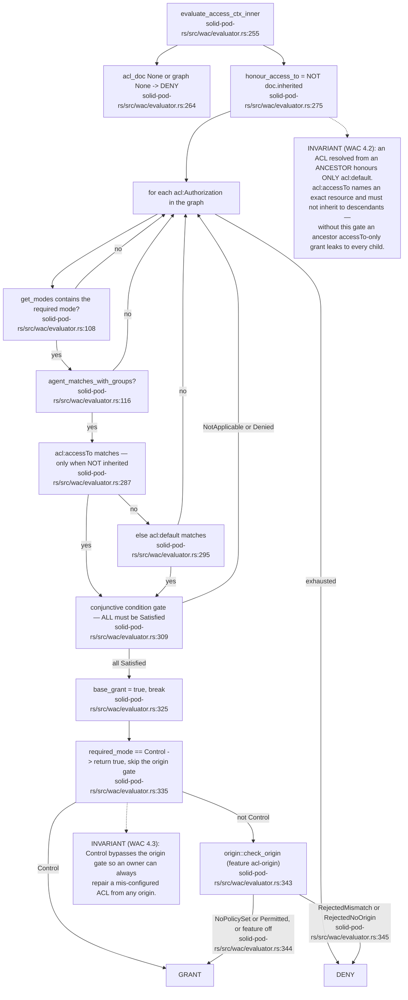
```mermaid
flowchart TD
    START["evaluate_access_ctx_inner<br/>solid-pod-rs/src/wac/evaluator.rs:255"]
    NODOC["acl_doc None or graph None -> DENY<br/>solid-pod-rs/src/wac/evaluator.rs:264"]
    INH["honour_access_to = NOT doc.inherited<br/>solid-pod-rs/src/wac/evaluator.rs:275"]
    LOOP["for each acl:Authorization in the graph"]
    MODE["get_modes contains the required mode?<br/>solid-pod-rs/src/wac/evaluator.rs:108"]
    AGENT["agent_matches_with_groups?<br/>solid-pod-rs/src/wac/evaluator.rs:116"]
    PATHA["acl:accessTo matches — only when NOT inherited<br/>solid-pod-rs/src/wac/evaluator.rs:287"]
    PATHD["else acl:default matches<br/>solid-pod-rs/src/wac/evaluator.rs:295"]
    COND["conjunctive condition gate — ALL must be Satisfied<br/>solid-pod-rs/src/wac/evaluator.rs:309"]
    GRANT["base_grant = true, break<br/>solid-pod-rs/src/wac/evaluator.rs:325"]
    CTRL["required_mode == Control -> return true, skip the origin gate<br/>solid-pod-rs/src/wac/evaluator.rs:335"]
    ORG["origin::check_origin (feature acl-origin)<br/>solid-pod-rs/src/wac/evaluator.rs:343"]
    ALLOW["GRANT"]
    DENY["DENY"]

    START --> NODOC
    START --> INH --> LOOP --> MODE
    MODE -- no --> LOOP
    MODE -- yes --> AGENT
    AGENT -- no --> LOOP
    AGENT -- yes --> PATHA
    PATHA -- no --> PATHD
    PATHD -- no --> LOOP
    PATHA -- yes --> COND
    PATHD -- yes --> COND
    COND -- "NotApplicable or Denied" --> LOOP
    COND -- all Satisfied --> GRANT
    LOOP -- exhausted --> DENY
    GRANT --> CTRL
    CTRL -- Control --> ALLOW
    CTRL -- not Control --> ORG
    ORG -- "NoPolicySet or Permitted, or feature off<br/>solid-pod-rs/src/wac/evaluator.rs:344" --> ALLOW
    ORG -- "RejectedMismatch or RejectedNoOrigin<br/>solid-pod-rs/src/wac/evaluator.rs:345" --> DENY

    N["INVARIANT (WAC 4.2): an ACL resolved from an ANCESTOR honours ONLY acl:default.<br/>acl:accessTo names an exact resource and must not inherit to descendants —<br/>without this gate an ancestor accessTo-only grant leaks to every child."]
    INH -.-> N
    N2["INVARIANT (WAC 4.3): Control bypasses the origin gate so an owner can always<br/>repair a mis-configured ACL from any origin."]
    CTRL -.-> N2
```

## SP-04.8 The origin gate — off in the library, on in the server

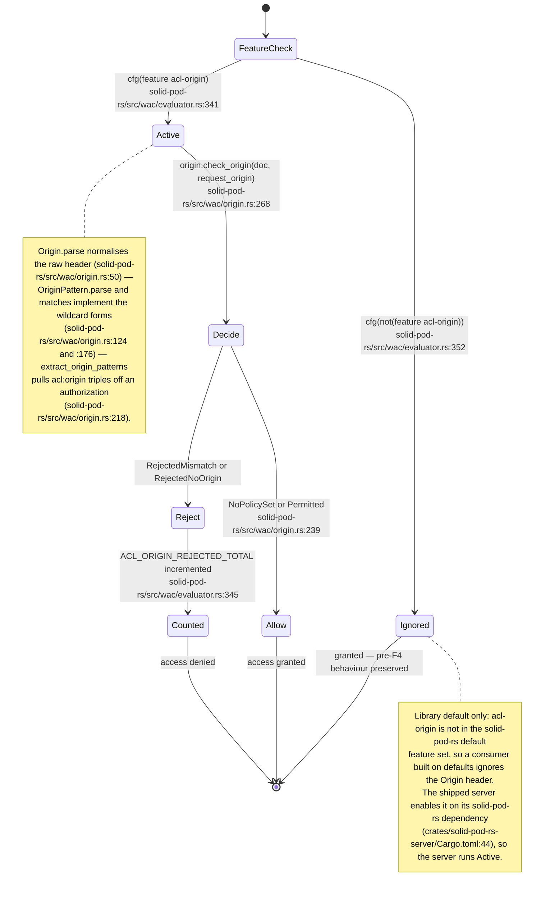
```mermaid
stateDiagram-v2
    [*] --> FeatureCheck
    FeatureCheck --> Ignored: cfg(not(feature acl-origin))<br/>solid-pod-rs/src/wac/evaluator.rs:352
    FeatureCheck --> Active: cfg(feature acl-origin)<br/>solid-pod-rs/src/wac/evaluator.rs:341

    Active --> Decide: origin.check_origin(doc, request_origin)<br/>solid-pod-rs/src/wac/origin.rs:268
    Decide --> Allow: NoPolicySet or Permitted<br/>solid-pod-rs/src/wac/origin.rs:239
    Decide --> Reject: RejectedMismatch or RejectedNoOrigin
    Reject --> Counted: ACL_ORIGIN_REJECTED_TOTAL incremented<br/>solid-pod-rs/src/wac/evaluator.rs:345
    Counted --> [*]: access denied
    Allow --> [*]: access granted
    Ignored --> [*]: granted — pre-F4 behaviour preserved

    note right of Active
      Origin.parse normalises the raw header (solid-pod-rs/src/wac/origin.rs:50) —
      OriginPattern.parse and matches implement the wildcard forms
      (solid-pod-rs/src/wac/origin.rs:124 and :176) — extract_origin_patterns
      pulls acl:origin triples off an authorization
      (solid-pod-rs/src/wac/origin.rs:218).
    end note
    note right of Ignored
      Library default only: acl-origin is not in the solid-pod-rs default
      feature set, so a consumer built on defaults ignores the Origin header.
      The shipped server enables it on its solid-pod-rs dependency
      (crates/solid-pod-rs-server/Cargo.toml:44), so the server runs Active.
    end note
```

**Drift:** this panel used to say that no default build enables `acl-origin`, so a stock server ignored the Origin header. The server crate has enabled the feature on its `solid-pod-rs` dependency since `51ecbf4` (2026-07-03), and still does at this revision (`crates/solid-pod-rs-server/Cargo.toml:42-44`). The core crate's own comment that the replay guard is "Wired into the default server build (unlike `acl-origin`)" is stale in the same way (`crates/solid-pod-rs/Cargo.toml:154-155`).

**Tension:** under the shipped server the gate is document-wide, not per rule. `check_origin` gathers `acl:origin` patterns from every authorisation in the document (`solid-pod-rs/src/wac/origin.rs:282-304`). So one rule with an origin restriction makes every non-Control grant in that ACL require a matching `Origin`, and a request with no `Origin` header, such as a server-to-server or command-line client, is refused as RejectedNoOrigin. That follows from source; it was not exercised over HTTP.

## SP-04.9 Parser bounds — fail closed at the boundary

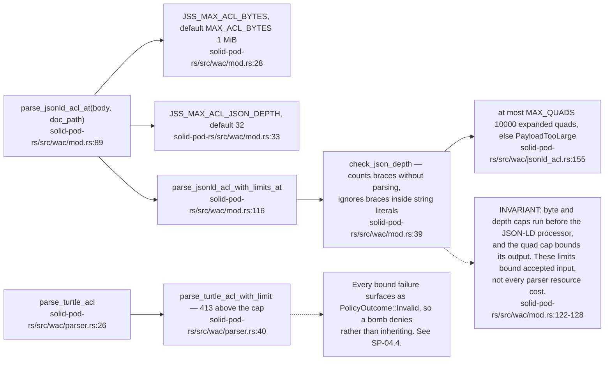
```mermaid
flowchart LR
    JSONLD["parse_jsonld_acl_at(body, doc_path)<br/>solid-pod-rs/src/wac/mod.rs:89"]
    ENVB["JSS_MAX_ACL_BYTES, default MAX_ACL_BYTES 1 MiB<br/>solid-pod-rs/src/wac/mod.rs:28"]
    ENVD["JSS_MAX_ACL_JSON_DEPTH, default 32<br/>solid-pod-rs/src/wac/mod.rs:33"]
    WL["parse_jsonld_acl_with_limits_at<br/>solid-pod-rs/src/wac/mod.rs:116"]
    DEPTH["check_json_depth — counts braces without parsing,<br/>ignores braces inside string literals<br/>solid-pod-rs/src/wac/mod.rs:39"]
    QUADS["at most MAX_QUADS 10000 expanded quads, else PayloadTooLarge<br/>solid-pod-rs/src/wac/jsonld_acl.rs:155"]
    TURTLE["parse_turtle_acl<br/>solid-pod-rs/src/wac/parser.rs:26"]
    TWL["parse_turtle_acl_with_limit — 413 above the cap<br/>solid-pod-rs/src/wac/parser.rs:40"]

    JSONLD --> ENVB
    JSONLD --> ENVD
    JSONLD --> WL --> DEPTH --> QUADS
    TURTLE --> TWL

    N["INVARIANT: byte and depth caps run before the JSON-LD processor,<br/>and the quad cap bounds its output. These limits bound accepted input,<br/>not every parser resource cost.<br/>solid-pod-rs/src/wac/mod.rs:122-128"]
    DEPTH -.-> N
    N2["Every bound failure surfaces as PolicyOutcome::Invalid, so a bomb denies<br/>rather than inheriting. See SP-04.4."]
    TWL -.-> N2
```

## SP-04.10 The Turtle ACL parser

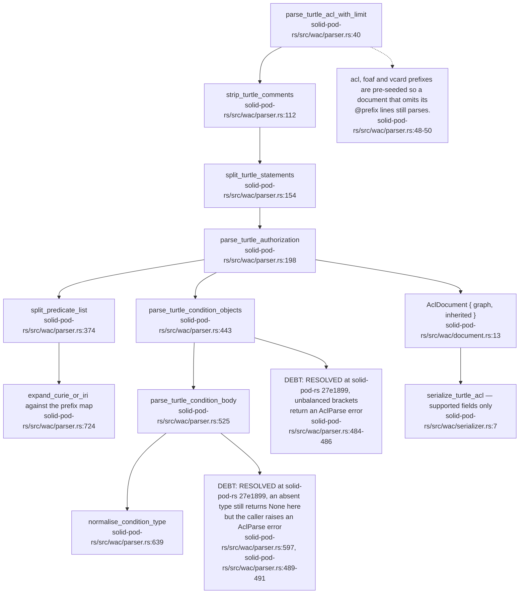
```mermaid
flowchart TD
    IN["parse_turtle_acl_with_limit<br/>solid-pod-rs/src/wac/parser.rs:40"]
    STRIP["strip_turtle_comments<br/>solid-pod-rs/src/wac/parser.rs:112"]
    SPLIT["split_turtle_statements<br/>solid-pod-rs/src/wac/parser.rs:154"]
    AUTH["parse_turtle_authorization<br/>solid-pod-rs/src/wac/parser.rs:198"]
    PRED["split_predicate_list<br/>solid-pod-rs/src/wac/parser.rs:374"]
    COBJ["parse_turtle_condition_objects<br/>solid-pod-rs/src/wac/parser.rs:443"]
    CBOD["parse_turtle_condition_body<br/>solid-pod-rs/src/wac/parser.rs:525"]
    NORM["normalise_condition_type<br/>solid-pod-rs/src/wac/parser.rs:639"]
    CURIE["expand_curie_or_iri against the prefix map<br/>solid-pod-rs/src/wac/parser.rs:724"]
    DOC["AclDocument { graph, inherited }<br/>solid-pod-rs/src/wac/document.rs:13"]
    SER["serialize_turtle_acl — supported fields only<br/>solid-pod-rs/src/wac/serializer.rs:7"]

    IN --> STRIP --> SPLIT --> AUTH
    AUTH --> PRED --> CURIE
    AUTH --> COBJ --> CBOD --> NORM
    COBJ --> LOST["DEBT: RESOLVED at solid-pod-rs 27e1899, unbalanced brackets<br/>return an AclParse error<br/>solid-pod-rs/src/wac/parser.rs:484-486"]
    CBOD --> LOST2["DEBT: RESOLVED at solid-pod-rs 27e1899, an absent type still returns None here<br/>but the caller raises an AclParse error<br/>solid-pod-rs/src/wac/parser.rs:597, solid-pod-rs/src/wac/parser.rs:489-491"]
    AUTH --> DOC
    DOC --> SER

    N["acl, foaf and vcard prefixes are pre-seeded so a document that omits its<br/>@prefix lines still parses.<br/>solid-pod-rs/src/wac/parser.rs:48-50"]
    IN -.-> N
```

## SP-04.13 Payment, client, issuer and provenance-anchor conditions

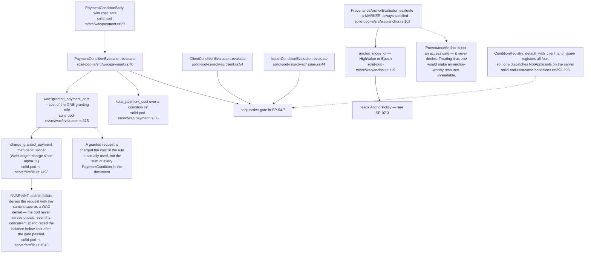
```mermaid
flowchart TD
    PAY["PaymentConditionEvaluator::evaluate<br/>solid-pod-rs/src/wac/payment.rs:70"]
    BODY["PaymentConditionBody with cost_sats<br/>solid-pod-rs/src/wac/payment.rs:27"]
    TOT["total_payment_cost over a condition list<br/>solid-pod-rs/src/wac/payment.rs:85"]
    GPC["wac::granted_payment_cost — cost of the ONE granting rule<br/>solid-pod-rs/src/wac/evaluator.rs:375"]
    CG["charge_granted_payment then debit_ledger<br/>(WebLedger::charge since alpha.11)<br/>solid-pod-rs-server/src/lib.rs:1493"]
    CLI["ClientConditionEvaluator::evaluate<br/>solid-pod-rs/src/wac/client.rs:54"]
    ISS["IssuerConditionEvaluator::evaluate<br/>solid-pod-rs/src/wac/issuer.rs:44"]
    ANC["ProvenanceAnchorEvaluator::evaluate — a MARKER, always satisfied<br/>solid-pod-rs/src/wac/anchor.rs:102"]
    MODE["anchor_mode_of — HighValue or Epoch<br/>solid-pod-rs/src/wac/anchor.rs:119"]

    BODY --> PAY --> GPC --> CG
    PAY --> TOT
    CLI --> GATE["conjunctive gate in SP-04.7"]
    ISS --> GATE
    PAY --> GATE
    ANC --> MODE --> PROV["feeds AnchorPolicy — see SP-07.3"]

    N1["A granted request is charged the cost of the rule it actually used, not the<br/>sum of every PaymentCondition in the document."]
    GPC -.-> N1
    N2["INVARIANT: a debit failure denies the request with the same shape as a WAC<br/>denial — the pod never serves unpaid, even if a concurrent spend raced the<br/>balance below cost after the gate passed.<br/>solid-pod-rs-server/src/lib.rs:1510"]
    CG -.-> N2
    N3["ProvenanceAnchor is not an access gate — it never denies. Treating it as one<br/>would make an anchor-worthy resource unreadable."]
    ANC -.-> N3
    REG["ConditionRegistry::default_with_client_and_issuer registers all four,<br/>so none dispatches NotApplicable on the server<br/>solid-pod-rs/src/wac/conditions.rs:293-298"]
    REG -.-> GATE
```

**Debt:** client and issuer conditions are registered but never fed. Every admission context the server builds sets `client_id` and `issuer` to `None` (`solid-pod-rs-server/src/lib.rs:1539-1540`, `solid-pod-rs-server/src/lib.rs:1724-1725`). So `ClientConditionEvaluator` can be satisfied only by the `foaf:Agent` class shortcut (`solid-pod-rs/src/wac/client.rs:61-64`), and `IssuerConditionEvaluator` denies whenever no class matches (`solid-pod-rs/src/wac/issuer.rs:57-61`). Any rule carrying a specific client or issuer condition cannot grant on this server.

## SP-04.14 Denial shape

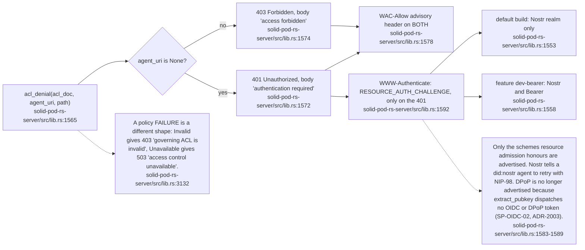
```mermaid
flowchart LR
    IN["acl_denial(acl_doc, agent_uri, path)<br/>solid-pod-rs-server/src/lib.rs:1565"]
    ANON{"agent_uri is None?"}
    U401["401 Unauthorized, body 'authentication required'<br/>solid-pod-rs-server/src/lib.rs:1572"]
    F403["403 Forbidden, body 'access forbidden'<br/>solid-pod-rs-server/src/lib.rs:1574"]
    WA["WAC-Allow advisory header on BOTH<br/>solid-pod-rs-server/src/lib.rs:1578"]
    CH["WWW-Authenticate: RESOURCE_AUTH_CHALLENGE, only on the 401<br/>solid-pod-rs-server/src/lib.rs:1592"]
    NOS["default build: Nostr realm only<br/>solid-pod-rs-server/src/lib.rs:1553"]
    DEV["feature dev-bearer: Nostr and Bearer<br/>solid-pod-rs-server/src/lib.rs:1558"]

    IN --> ANON
    ANON -- yes --> U401 --> WA
    ANON -- no --> F403 --> WA
    U401 --> CH
    CH --> NOS
    CH --> DEV

    N["Only the schemes resource admission honours are advertised. Nostr tells a<br/>did:nostr agent to retry with NIP-98. DPoP is no longer advertised because<br/>extract_pubkey dispatches no OIDC or DPoP token (SP-OIDC-02, ADR-2003).<br/>solid-pod-rs-server/src/lib.rs:1583-1589"]
    CH -.-> N
    N2["A policy FAILURE is a different shape: Invalid gives 403 'governing ACL is<br/>invalid', Unavailable gives 503 'access control unavailable'.<br/>solid-pod-rs-server/src/lib.rs:3132"]
    IN -.-> N2
```

## SP-04.15 Agent and group matching, and accessTo-vs-default containment

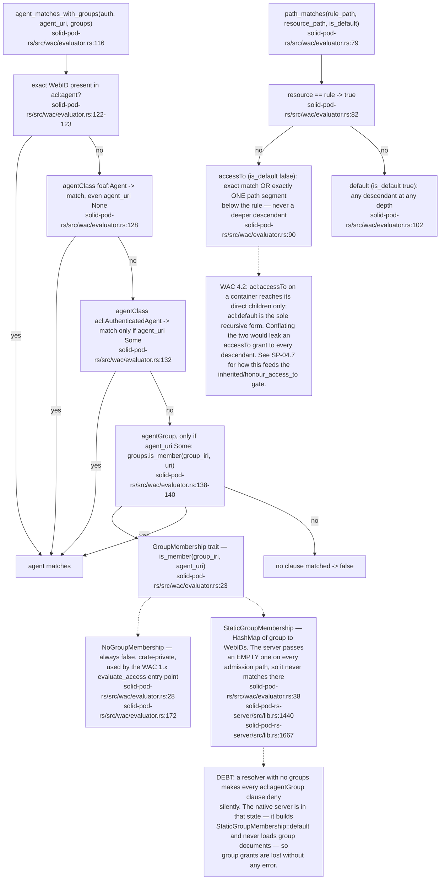
```mermaid
flowchart TD
    AM["agent_matches_with_groups(auth, agent_uri, groups)<br/>solid-pod-rs/src/wac/evaluator.rs:116"]
    WEBID["exact WebID present in acl:agent?<br/>solid-pod-rs/src/wac/evaluator.rs:122-123"]
    FOAF["agentClass foaf:Agent -> match, even agent_uri None<br/>solid-pod-rs/src/wac/evaluator.rs:128"]
    AUTHC["agentClass acl:AuthenticatedAgent -> match only if agent_uri Some<br/>solid-pod-rs/src/wac/evaluator.rs:132"]
    GRP["agentGroup, only if agent_uri Some: groups.is_member(group_iri, uri)<br/>solid-pod-rs/src/wac/evaluator.rs:138-140"]
    NM["no clause matched -> false"]
    TRAIT["GroupMembership trait — is_member(group_iri, agent_uri)<br/>solid-pod-rs/src/wac/evaluator.rs:23"]
    NOOP["NoGroupMembership — always false, crate-private,<br/>used by the WAC 1.x evaluate_access entry point<br/>solid-pod-rs/src/wac/evaluator.rs:28<br/>solid-pod-rs/src/wac/evaluator.rs:172"]
    STATIC["StaticGroupMembership — HashMap of group to WebIDs. The server passes<br/>an EMPTY one on every admission path, so it never matches there<br/>solid-pod-rs/src/wac/evaluator.rs:38<br/>solid-pod-rs-server/src/lib.rs:1440<br/>solid-pod-rs-server/src/lib.rs:1667"]

    AM --> WEBID
    WEBID -- yes --> GRANT["agent matches"]
    WEBID -- no --> FOAF
    FOAF -- yes --> GRANT
    FOAF -- no --> AUTHC
    AUTHC -- yes --> GRANT
    AUTHC -- no --> GRP
    GRP --> TRAIT
    TRAIT -.-> NOOP
    TRAIT -.-> STATIC
    GRP -- yes --> GRANT
    GRP -- no --> NM

    PM["path_matches(rule_path, resource_path, is_default)<br/>solid-pod-rs/src/wac/evaluator.rs:79"]
    EXACT["resource == rule -> true<br/>solid-pod-rs/src/wac/evaluator.rs:82"]
    ACCTO["accessTo (is_default false): exact match OR exactly ONE path segment<br/>below the rule — never a deeper descendant<br/>solid-pod-rs/src/wac/evaluator.rs:90"]
    DFLT["default (is_default true): any descendant at any depth<br/>solid-pod-rs/src/wac/evaluator.rs:102"]

    PM --> EXACT
    EXACT -- no --> ACCTO
    EXACT -- no --> DFLT

    N1["DEBT: a resolver with no groups makes every acl:agentGroup clause deny<br/>silently. The native server is in that state — it builds<br/>StaticGroupMembership::default and never loads group documents — so<br/>group grants are lost without any error."]
    STATIC -.-> N1
    N2["WAC 4.2: acl:accessTo on a container reaches its direct children only;<br/>acl:default is the sole recursive form. Conflating the two would leak an<br/>accessTo grant to every descendant. See SP-04.7 for how this feeds the<br/>inherited/honour_access_to gate."]
    ACCTO -.-> N2
```

## SP-04.16 JSON-LD ACLs are read by expanded IRI

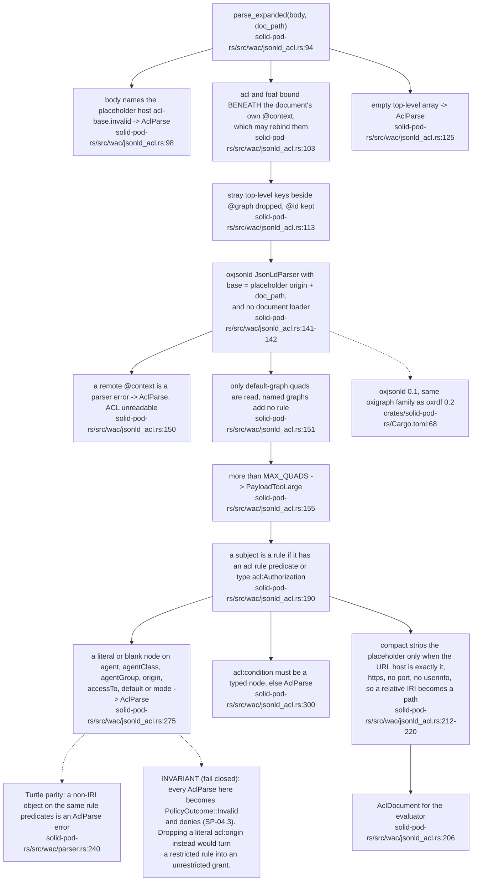
```mermaid
flowchart TD
    IN["parse_expanded(body, doc_path)<br/>solid-pod-rs/src/wac/jsonld_acl.rs:94"]
    SENT["body names the placeholder host acl-base.invalid -> AclParse<br/>solid-pod-rs/src/wac/jsonld_acl.rs:98"]
    CTX["acl and foaf bound BENEATH the document's own @context,<br/>which may rebind them<br/>solid-pod-rs/src/wac/jsonld_acl.rs:103"]
    STRAY["stray top-level keys beside @graph dropped, @id kept<br/>solid-pod-rs/src/wac/jsonld_acl.rs:113"]
    EMPTY["empty top-level array -> AclParse<br/>solid-pod-rs/src/wac/jsonld_acl.rs:125"]
    PARSE["oxjsonld JsonLdParser with base = placeholder origin + doc_path,<br/>and no document loader<br/>solid-pod-rs/src/wac/jsonld_acl.rs:141-142"]
    REMOTE["a remote @context is a parser error -> AclParse, ACL unreadable<br/>solid-pod-rs/src/wac/jsonld_acl.rs:150"]
    DG["only default-graph quads are read, named graphs add no rule<br/>solid-pod-rs/src/wac/jsonld_acl.rs:151"]
    CAP["more than MAX_QUADS -> PayloadTooLarge<br/>solid-pod-rs/src/wac/jsonld_acl.rs:155"]
    RULE["a subject is a rule if it has an acl rule predicate or type acl:Authorization<br/>solid-pod-rs/src/wac/jsonld_acl.rs:190"]
    NONIRI["a literal or blank node on agent, agentClass, agentGroup, origin,<br/>accessTo, default or mode -> AclParse<br/>solid-pod-rs/src/wac/jsonld_acl.rs:275"]
    COND["acl:condition must be a typed node, else AclParse<br/>solid-pod-rs/src/wac/jsonld_acl.rs:300"]
    COMPACT["compact strips the placeholder only when the URL host is exactly it,<br/>https, no port, no userinfo, so a relative IRI becomes a path<br/>solid-pod-rs/src/wac/jsonld_acl.rs:212-220"]
    OUT["AclDocument for the evaluator<br/>solid-pod-rs/src/wac/jsonld_acl.rs:206"]

    IN --> SENT
    IN --> CTX --> STRAY --> PARSE
    IN --> EMPTY
    PARSE --> REMOTE
    PARSE --> DG --> CAP --> RULE --> NONIRI
    RULE --> COND
    RULE --> COMPACT --> OUT

    TT["Turtle parity: a non-IRI object on the same rule predicates is an AclParse error<br/>solid-pod-rs/src/wac/parser.rs:240"]
    NONIRI -.-> TT
    N["INVARIANT (fail closed): every AclParse here becomes PolicyOutcome::Invalid<br/>and denies (SP-04.3). Dropping a literal acl:origin instead would turn<br/>a restricted rule into an unrestricted grant."]
    NONIRI -.-> N
    DEP["oxjsonld 0.1, same oxigraph family as oxrdf 0.2<br/>crates/solid-pod-rs/Cargo.toml:68"]
    PARSE -.-> DEP
```

## SP-04.17 ACL IRIs resolve against the configured pod origin

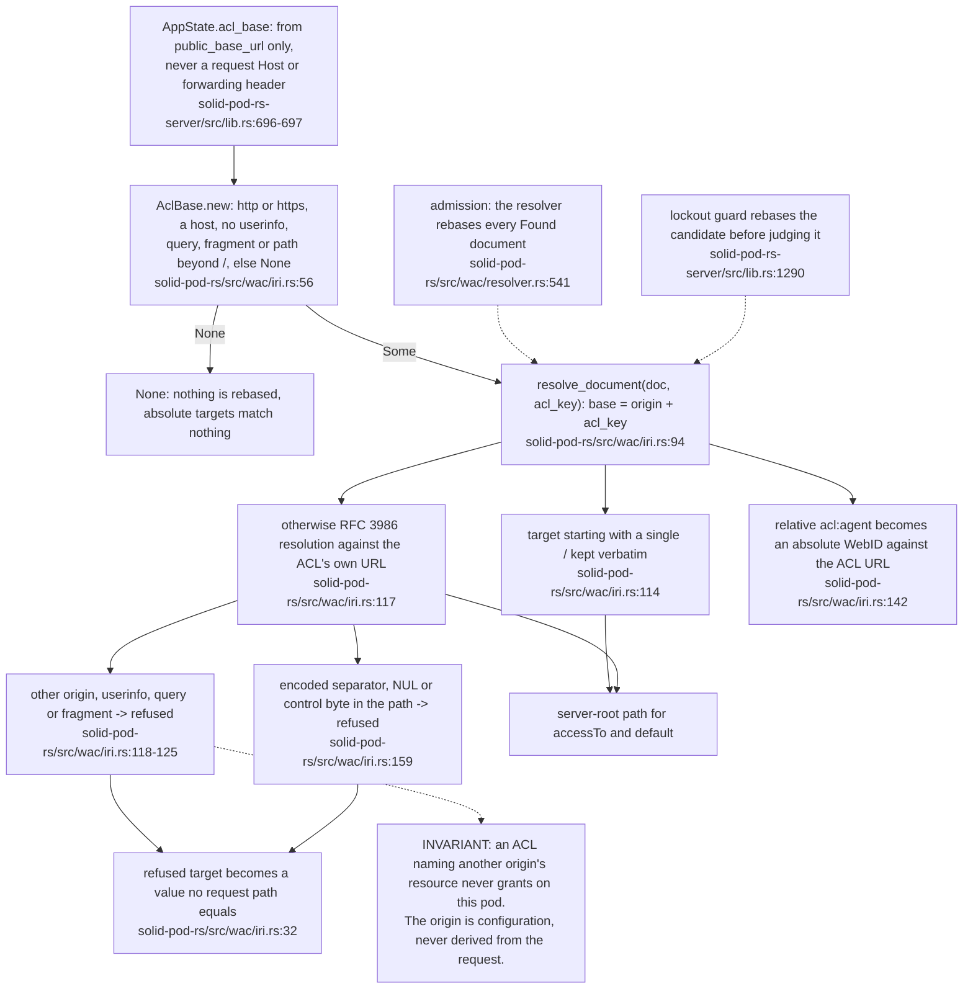
```mermaid
flowchart TD
    CFG["AppState.acl_base: from public_base_url only,<br/>never a request Host or forwarding header<br/>solid-pod-rs-server/src/lib.rs:696-697"]
    NEW["AclBase.new: http or https, a host, no userinfo,<br/>query, fragment or path beyond /, else None<br/>solid-pod-rs/src/wac/iri.rs:56"]
    NONE["None: nothing is rebased, absolute targets match nothing"]
    RES["resolve_document(doc, acl_key): base = origin + acl_key<br/>solid-pod-rs/src/wac/iri.rs:94"]
    ROOT["target starting with a single / kept verbatim<br/>solid-pod-rs/src/wac/iri.rs:114"]
    JOIN["otherwise RFC 3986 resolution against the ACL's own URL<br/>solid-pod-rs/src/wac/iri.rs:117"]
    ORIG["other origin, userinfo, query or fragment -> refused<br/>solid-pod-rs/src/wac/iri.rs:118-125"]
    ENC["encoded separator, NUL or control byte in the path -> refused<br/>solid-pod-rs/src/wac/iri.rs:159"]
    NEVER["refused target becomes a value no request path equals<br/>solid-pod-rs/src/wac/iri.rs:32"]
    PATH["server-root path for accessTo and default"]
    AG["relative acl:agent becomes an absolute WebID against the ACL URL<br/>solid-pod-rs/src/wac/iri.rs:142"]

    CFG --> NEW
    NEW -- None --> NONE
    NEW -- Some --> RES
    RES --> ROOT --> PATH
    RES --> JOIN --> ORIG --> NEVER
    JOIN --> ENC --> NEVER
    JOIN --> PATH
    RES --> AG

    USE1["admission: the resolver rebases every Found document<br/>solid-pod-rs/src/wac/resolver.rs:541"]
    USE2["lockout guard rebases the candidate before judging it<br/>solid-pod-rs-server/src/lib.rs:1290"]
    USE1 -.-> RES
    USE2 -.-> RES
    N["INVARIANT: an ACL naming another origin's resource never grants on this pod.<br/>The origin is configuration, never derived from the request."]
    ORIG -.-> N
```

## SP-04.18 Container ACL layout — sidecar, inner or both

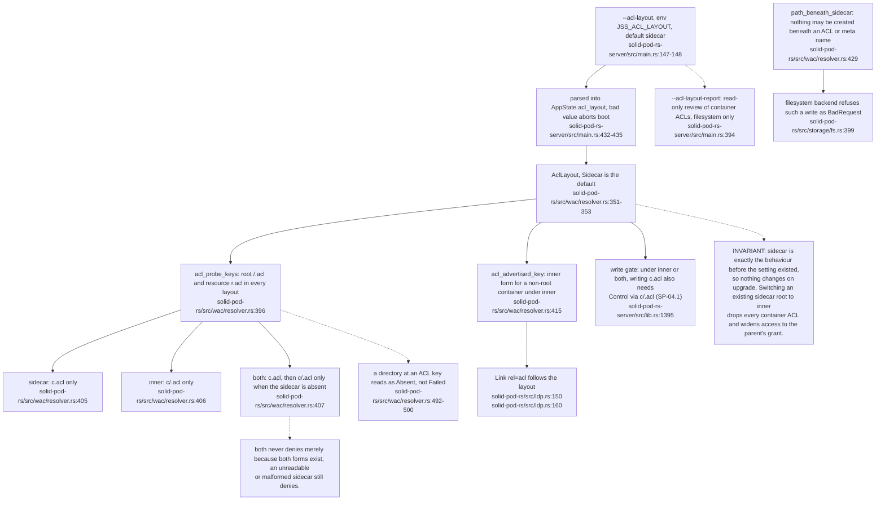
```mermaid
flowchart TD
    FLAG["--acl-layout, env JSS_ACL_LAYOUT, default sidecar<br/>solid-pod-rs-server/src/main.rs:147-148"]
    PARSEL["parsed into AppState.acl_layout, bad value aborts boot<br/>solid-pod-rs-server/src/main.rs:432-435"]
    ENUM["AclLayout, Sidecar is the default<br/>solid-pod-rs/src/wac/resolver.rs:351-353"]
    PROBE["acl_probe_keys: root /.acl and resource r.acl in every layout<br/>solid-pod-rs/src/wac/resolver.rs:396"]
    SC["sidecar: c.acl only<br/>solid-pod-rs/src/wac/resolver.rs:405"]
    IN["inner: c/.acl only<br/>solid-pod-rs/src/wac/resolver.rs:406"]
    BO["both: c.acl, then c/.acl only when the sidecar is absent<br/>solid-pod-rs/src/wac/resolver.rs:407"]
    ADV["acl_advertised_key: inner form for a non-root container under inner<br/>solid-pod-rs/src/wac/resolver.rs:415"]
    LINK["Link rel=acl follows the layout<br/>solid-pod-rs/src/ldp.rs:150<br/>solid-pod-rs/src/ldp.rs:160"]
    WG["write gate: under inner or both, writing c.acl also needs<br/>Control via c/.acl (SP-04.1)<br/>solid-pod-rs-server/src/lib.rs:1395"]
    DIR["a directory at an ACL key reads as Absent, not Failed<br/>solid-pod-rs/src/wac/resolver.rs:492-500"]
    BEN["path_beneath_sidecar: nothing may be created beneath an ACL or meta name<br/>solid-pod-rs/src/wac/resolver.rs:429"]
    FS["filesystem backend refuses such a write as BadRequest<br/>solid-pod-rs/src/storage/fs.rs:399"]
    REP["--acl-layout-report: read-only review of container ACLs, filesystem only<br/>solid-pod-rs-server/src/main.rs:394"]

    FLAG --> PARSEL --> ENUM --> PROBE
    PROBE --> SC
    PROBE --> IN
    PROBE --> BO
    ENUM --> ADV --> LINK
    ENUM --> WG
    PROBE -.-> DIR
    BEN --> FS
    FLAG -.-> REP

    N["INVARIANT: sidecar is exactly the behaviour before the setting existed,<br/>so nothing changes on upgrade. Switching an existing sidecar root to inner<br/>drops every container ACL and widens access to the parent's grant."]
    ENUM -.-> N
    N2["both never denies merely because both forms exist, an unreadable<br/>or malformed sidecar still denies."]
    BO -.-> N2
```
