## SP-05.1 Two auth paths, one AuthContext

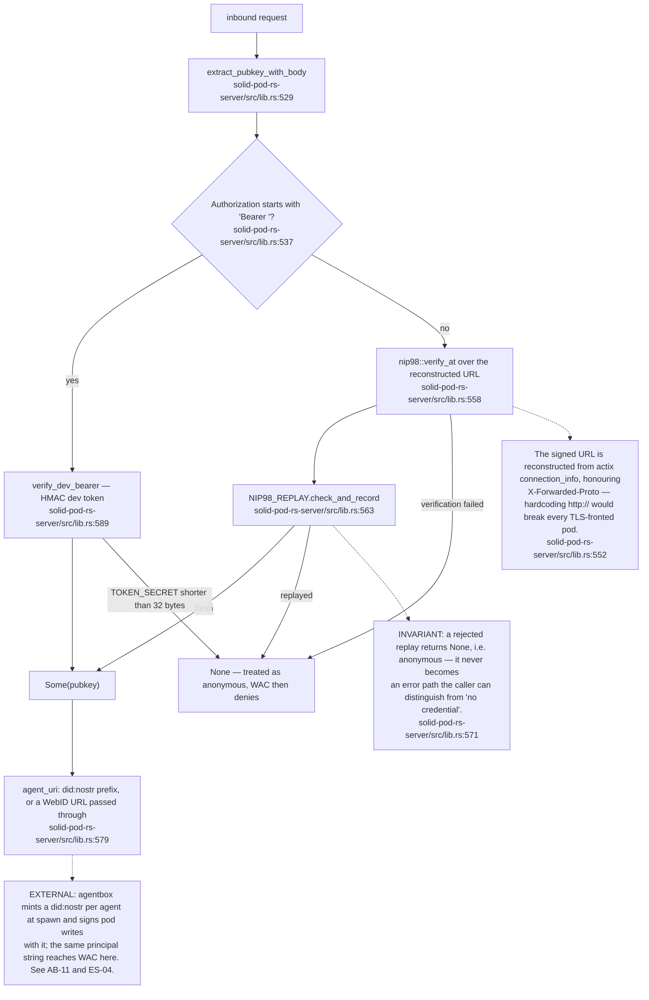
```mermaid
flowchart TD
    REQ["inbound request"]
    EX["extract_pubkey_with_body<br/>solid-pod-rs-server/src/lib.rs:529"]
    BEAR{"Authorization starts with 'Bearer '?<br/>solid-pod-rs-server/src/lib.rs:537"}
    DEV["verify_dev_bearer — HMAC dev token<br/>solid-pod-rs-server/src/lib.rs:589"]
    N98["nip98::verify_at over the reconstructed URL<br/>solid-pod-rs-server/src/lib.rs:558"]
    REPLAY["NIP98_REPLAY.check_and_record<br/>solid-pod-rs-server/src/lib.rs:563"]
    PK["Some(pubkey)"]
    ANON["None — treated as anonymous, WAC then denies"]
    AGENT["agent_uri: did:nostr prefix, or a WebID URL passed through<br/>solid-pod-rs-server/src/lib.rs:579"]

    REQ --> EX --> BEAR
    BEAR -- yes --> DEV
    BEAR -- no --> N98 --> REPLAY
    REPLAY -- fresh --> PK
    REPLAY -- replayed --> ANON
    DEV --> PK
    DEV -- "TOKEN_SECRET shorter than 32 bytes" --> ANON
    N98 -- verification failed --> ANON
    PK --> AGENT

    N1["The signed URL is reconstructed from actix connection_info, honouring<br/>X-Forwarded-Proto — hardcoding http:// would break every TLS-fronted pod.<br/>solid-pod-rs-server/src/lib.rs:552"]
    N98 -.-> N1
    N2["INVARIANT: a rejected replay returns None, i.e. anonymous — it never becomes<br/>an error path the caller can distinguish from 'no credential'.<br/>solid-pod-rs-server/src/lib.rs:571"]
    REPLAY -.-> N2
    N3["EXTERNAL: agentbox mints a did:nostr per agent at spawn and signs pod writes<br/>with it; the same principal string reaches WAC here. See AB-11 and ES-04."]
    AGENT -.-> N3
```

## SP-05.2 NIP-98 verification, step by step

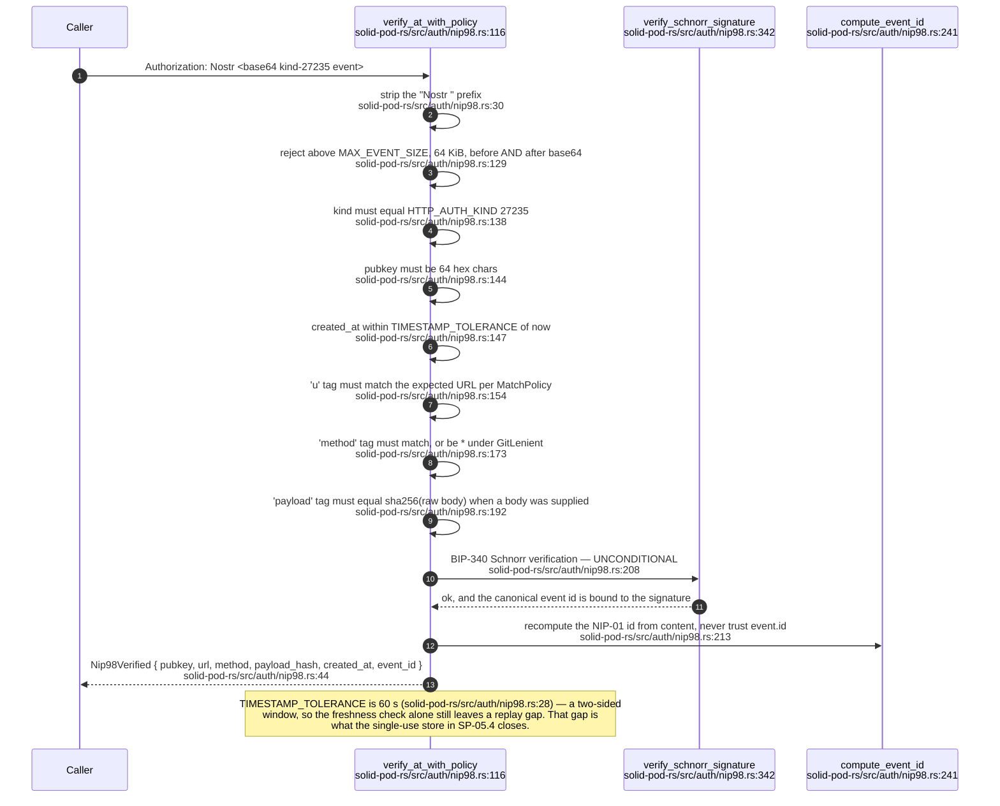
```mermaid
sequenceDiagram
    autonumber
    participant C as Caller
    participant V as verify_at_with_policy<br/>solid-pod-rs/src/auth/nip98.rs:116
    participant S as verify_schnorr_signature<br/>solid-pod-rs/src/auth/nip98.rs:342
    participant ID as compute_event_id<br/>solid-pod-rs/src/auth/nip98.rs:241

    C->>V: Authorization: Nostr <base64 kind-27235 event>
    V->>V: strip the "Nostr " prefix<br/>solid-pod-rs/src/auth/nip98.rs:30
    V->>V: reject above MAX_EVENT_SIZE, 64 KiB, before AND after base64<br/>solid-pod-rs/src/auth/nip98.rs:129
    V->>V: kind must equal HTTP_AUTH_KIND 27235<br/>solid-pod-rs/src/auth/nip98.rs:138
    V->>V: pubkey must be 64 hex chars<br/>solid-pod-rs/src/auth/nip98.rs:144
    V->>V: created_at within TIMESTAMP_TOLERANCE of now<br/>solid-pod-rs/src/auth/nip98.rs:147
    V->>V: 'u' tag must match the expected URL per MatchPolicy<br/>solid-pod-rs/src/auth/nip98.rs:154
    V->>V: 'method' tag must match, or be * under GitLenient<br/>solid-pod-rs/src/auth/nip98.rs:173
    V->>V: 'payload' tag must equal sha256(raw body) when a body was supplied<br/>solid-pod-rs/src/auth/nip98.rs:192
    V->>S: BIP-340 Schnorr verification — UNCONDITIONAL<br/>solid-pod-rs/src/auth/nip98.rs:208
    S-->>V: ok, and the canonical event id is bound to the signature
    V->>ID: recompute the NIP-01 id from content, never trust event.id<br/>solid-pod-rs/src/auth/nip98.rs:213
    V-->>C: Nip98Verified { pubkey, url, method, payload_hash, created_at, event_id }<br/>solid-pod-rs/src/auth/nip98.rs:44
    Note over V: TIMESTAMP_TOLERANCE is 60 s (solid-pod-rs/src/auth/nip98.rs:28) — a two-sided<br/>window, so the freshness check alone still leaves a replay gap. That gap is<br/>what the single-use store in SP-05.4 closes.
```

## SP-05.3 The two match policies

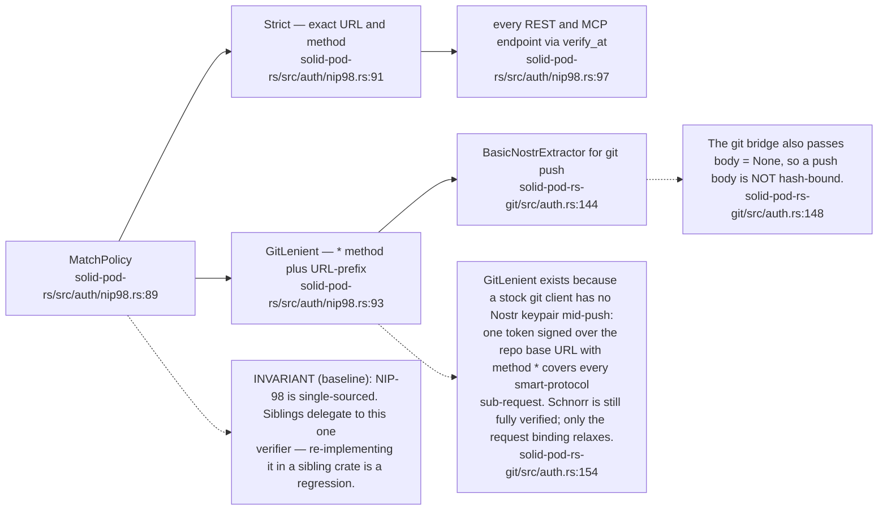
```mermaid
flowchart LR
    MP["MatchPolicy<br/>solid-pod-rs/src/auth/nip98.rs:89"]
    ST["Strict — exact URL and method<br/>solid-pod-rs/src/auth/nip98.rs:91"]
    GL["GitLenient — * method plus URL-prefix<br/>solid-pod-rs/src/auth/nip98.rs:93"]
    REST["every REST and MCP endpoint via verify_at<br/>solid-pod-rs/src/auth/nip98.rs:97"]
    GIT["BasicNostrExtractor for git push<br/>solid-pod-rs-git/src/auth.rs:144"]

    MP --> ST --> REST
    MP --> GL --> GIT

    N["GitLenient exists because a stock git client has no Nostr keypair mid-push:<br/>one token signed over the repo base URL with method * covers every smart-protocol<br/>sub-request. Schnorr is still fully verified; only the request binding relaxes.<br/>solid-pod-rs-git/src/auth.rs:154"]
    GL -.-> N
    N2["The git bridge also passes body = None, so a push body is NOT hash-bound.<br/>solid-pod-rs-git/src/auth.rs:148"]
    GIT -.-> N2
    N3["INVARIANT (baseline): NIP-98 is single-sourced. Siblings delegate to this one<br/>verifier — re-implementing it in a sibling crate is a regression."]
    MP -.-> N3
```

## SP-05.4 The single-use replay store (ADR-2006)

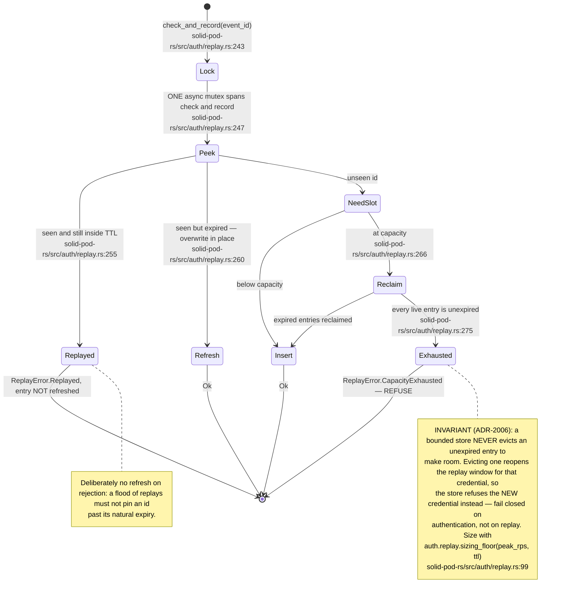
```mermaid
stateDiagram-v2
    [*] --> Lock: check_and_record(event_id)<br/>solid-pod-rs/src/auth/replay.rs:243
    Lock --> Peek: ONE async mutex spans check and record<br/>solid-pod-rs/src/auth/replay.rs:247
    Peek --> Replayed: seen and still inside TTL<br/>solid-pod-rs/src/auth/replay.rs:255
    Peek --> Refresh: seen but expired — overwrite in place<br/>solid-pod-rs/src/auth/replay.rs:260
    Peek --> NeedSlot: unseen id

    NeedSlot --> Insert: below capacity
    NeedSlot --> Reclaim: at capacity<br/>solid-pod-rs/src/auth/replay.rs:266
    Reclaim --> Insert: expired entries reclaimed
    Reclaim --> Exhausted: every live entry is unexpired<br/>solid-pod-rs/src/auth/replay.rs:275

    Replayed --> [*]: ReplayError.Replayed, entry NOT refreshed
    Exhausted --> [*]: ReplayError.CapacityExhausted — REFUSE
    Insert --> [*]: Ok
    Refresh --> [*]: Ok

    note right of Exhausted
      INVARIANT (ADR-2006): a bounded store NEVER evicts an unexpired entry to
      make room. Evicting one reopens the replay window for that credential, so
      the store refuses the NEW credential instead — fail closed on
      authentication, not on replay. Size with
      auth.replay.sizing_floor(peak_rps, ttl)
      solid-pod-rs/src/auth/replay.rs:99
    end note
    note right of Replayed
      Deliberately no refresh on rejection: a flood of replays must not pin an id
      past its natural expiry.
    end note
```

## SP-05.5 The ReplayStore seam and its tier limits

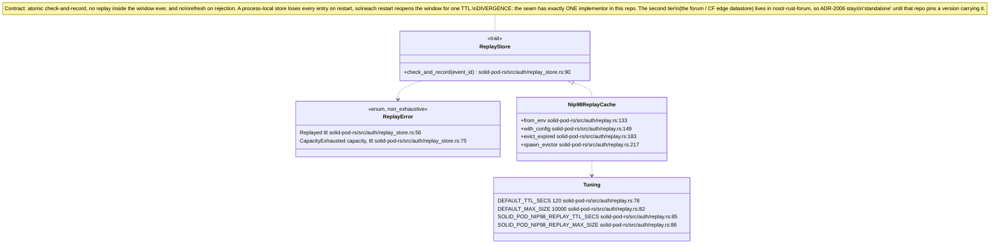
```mermaid
classDiagram
    class ReplayStore {
        <<trait>>
        +check_and_record(event_id)  solid-pod-rs/src/auth/replay_store.rs:90
    }
    class ReplayError {
        <<enum, non_exhaustive>>
        Replayed  ttl   solid-pod-rs/src/auth/replay_store.rs:56
        CapacityExhausted  capacity, ttl   solid-pod-rs/src/auth/replay_store.rs:75
    }
    class Nip98ReplayCache {
        +from_env  solid-pod-rs/src/auth/replay.rs:133
        +with_config  solid-pod-rs/src/auth/replay.rs:149
        +evict_expired  solid-pod-rs/src/auth/replay.rs:183
        +spawn_evictor  solid-pod-rs/src/auth/replay.rs:217
    }
    class Tuning {
        DEFAULT_TTL_SECS 120  solid-pod-rs/src/auth/replay.rs:78
        DEFAULT_MAX_SIZE 10000  solid-pod-rs/src/auth/replay.rs:82
        SOLID_POD_NIP98_REPLAY_TTL_SECS  solid-pod-rs/src/auth/replay.rs:85
        SOLID_POD_NIP98_REPLAY_MAX_SIZE  solid-pod-rs/src/auth/replay.rs:86
    }
    ReplayStore <|.. Nip98ReplayCache
    ReplayStore ..> ReplayError
    Nip98ReplayCache ..> Tuning
    note for ReplayStore "Contract: atomic check-and-record, no replay inside the window ever, and no\nrefresh on rejection. A process-local store loses every entry on restart, so\neach restart reopens the window for one TTL.\nDIVERGENCE: the seam has exactly ONE implementor in this repo. The second tier\n(the forum / CF edge datastore) lives in nostr-rust-forum, so ADR-2006 stays\n'standalone' until that repo pins a version carrying it."
```

## SP-05.6 The process-local replay guard in the server

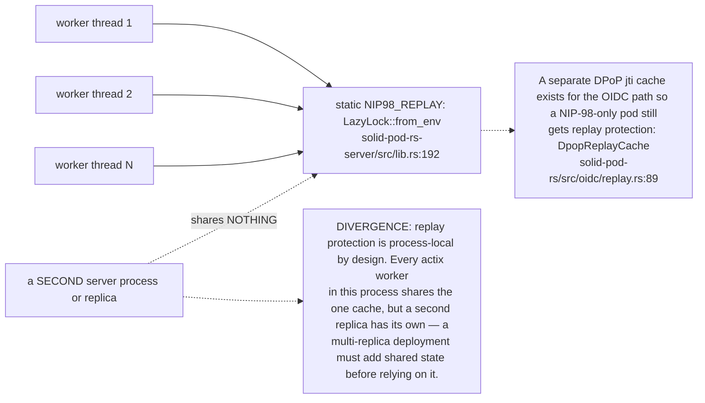
```mermaid
flowchart LR
    ST["static NIP98_REPLAY: LazyLock<Nip98ReplayCache>::from_env<br/>solid-pod-rs-server/src/lib.rs:192"]
    R1["worker thread 1"]
    R2["worker thread 2"]
    RN["worker thread N"]
    P2["a SECOND server process or replica"]

    R1 --> ST
    R2 --> ST
    RN --> ST
    P2 -. "shares NOTHING" .-> ST

    N["DIVERGENCE: replay protection is process-local by design. Every actix worker<br/>in this process shares the one cache, but a second replica has its own — a<br/>multi-replica deployment must add shared state before relying on it."]
    P2 -.-> N
    N2["A separate DPoP jti cache exists for the OIDC path so a NIP-98-only pod still<br/>gets replay protection: DpopReplayCache<br/>solid-pod-rs/src/oidc/replay.rs:89"]
    ST -.-> N2
```

## SP-05.7 Solid-OIDC — DPoP proof verification

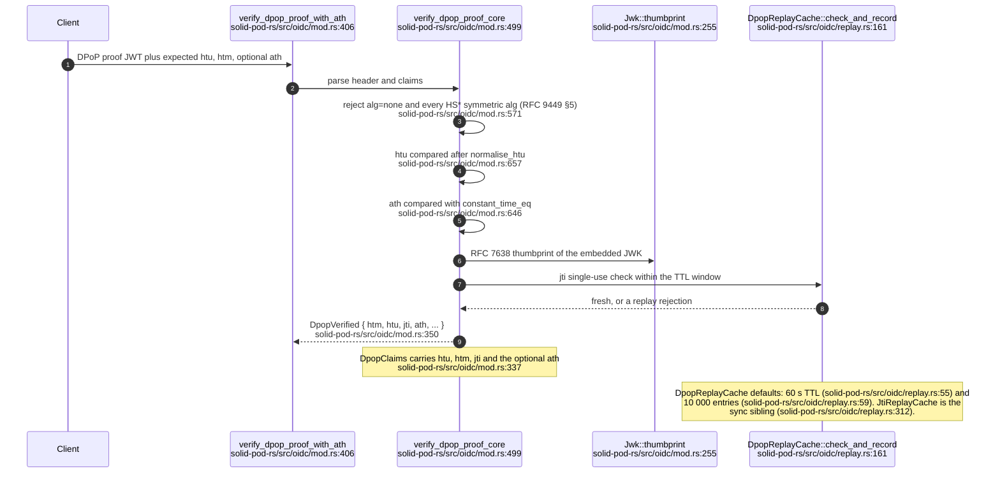
```mermaid
sequenceDiagram
    autonumber
    participant C as Client
    participant D as verify_dpop_proof_with_ath<br/>solid-pod-rs/src/oidc/mod.rs:406
    participant C2 as verify_dpop_proof_core<br/>solid-pod-rs/src/oidc/mod.rs:499
    participant J as Jwk::thumbprint<br/>solid-pod-rs/src/oidc/mod.rs:255
    participant R as DpopReplayCache::check_and_record<br/>solid-pod-rs/src/oidc/replay.rs:161

    C->>D: DPoP proof JWT plus expected htu, htm, optional ath
    D->>C2: parse header and claims
    C2->>C2: reject alg=none and every HS* symmetric alg (RFC 9449 §5)<br/>solid-pod-rs/src/oidc/mod.rs:571
    C2->>C2: htu compared after normalise_htu<br/>solid-pod-rs/src/oidc/mod.rs:657
    C2->>C2: ath compared with constant_time_eq<br/>solid-pod-rs/src/oidc/mod.rs:646
    C2->>J: RFC 7638 thumbprint of the embedded JWK
    C2->>R: jti single-use check within the TTL window
    R-->>C2: fresh, or a replay rejection
    C2-->>D: DpopVerified { htm, htu, jti, ath, ... }<br/>solid-pod-rs/src/oidc/mod.rs:350
    Note over C2: DpopClaims carries htu, htm, jti and the optional ath<br/>solid-pod-rs/src/oidc/mod.rs:337
    Note over R: DpopReplayCache defaults: 60 s TTL (solid-pod-rs/src/oidc/replay.rs:55) and<br/>10 000 entries (solid-pod-rs/src/oidc/replay.rs:59). JtiReplayCache is the<br/>sync sibling (solid-pod-rs/src/oidc/replay.rs:312).
```

## SP-05.8 Access-token verification and its three divergences

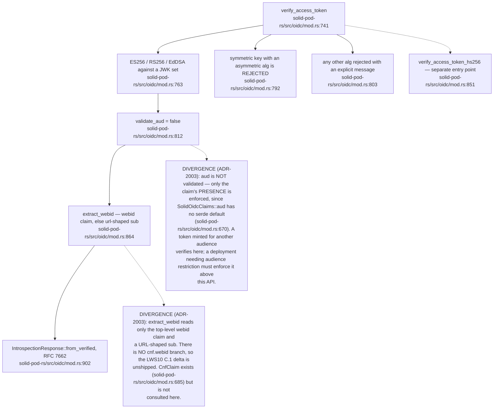
```mermaid
flowchart TD
    VT["verify_access_token<br/>solid-pod-rs/src/oidc/mod.rs:741"]
    ASYM["ES256 / RS256 / EdDSA against a JWK set<br/>solid-pod-rs/src/oidc/mod.rs:763"]
    SYMR["symmetric key with an asymmetric alg is REJECTED<br/>solid-pod-rs/src/oidc/mod.rs:792"]
    OTHER["any other alg rejected with an explicit message<br/>solid-pod-rs/src/oidc/mod.rs:803"]
    AUD["validate_aud = false<br/>solid-pod-rs/src/oidc/mod.rs:812"]
    WID["extract_webid — webid claim, else url-shaped sub<br/>solid-pod-rs/src/oidc/mod.rs:864"]
    HS["verify_access_token_hs256 — separate entry point<br/>solid-pod-rs/src/oidc/mod.rs:851"]
    INTRO["IntrospectionResponse::from_verified, RFC 7662<br/>solid-pod-rs/src/oidc/mod.rs:902"]

    VT --> ASYM --> AUD --> WID --> INTRO
    VT --> SYMR
    VT --> OTHER
    VT -.-> HS

    D1["DIVERGENCE (ADR-2003): aud is NOT validated — only the claim's PRESENCE is<br/>enforced, since SolidOidcClaims::aud has no serde default<br/>(solid-pod-rs/src/oidc/mod.rs:670). A token minted for another audience<br/>verifies here; a deployment needing audience restriction must enforce it above<br/>this API."]
    AUD -.-> D1
    D2["DIVERGENCE (ADR-2003): extract_webid reads only the top-level webid claim and<br/>a URL-shaped sub. There is NO cnf.webid branch, so the LWS10 C.1 delta is<br/>unshipped. CnfClaim exists (solid-pod-rs/src/oidc/mod.rs:685) but is not<br/>consulted here."]
    WID -.-> D2
```

## SP-05.9 Discovery metadata versus the crypto path

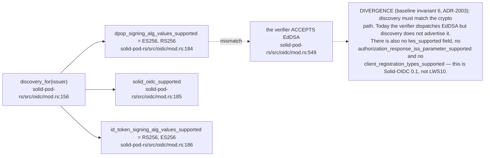
```mermaid
flowchart LR
    DISC["discovery_for(issuer)<br/>solid-pod-rs/src/oidc/mod.rs:156"]
    ADV["dpop_signing_alg_values_supported = ES256, RS256<br/>solid-pod-rs/src/oidc/mod.rs:184"]
    SOL["solid_oidc_supported<br/>solid-pod-rs/src/oidc/mod.rs:185"]
    IDT["id_token_signing_alg_values_supported = RS256, ES256<br/>solid-pod-rs/src/oidc/mod.rs:186"]
    VER["the verifier ACCEPTS EdDSA<br/>solid-pod-rs/src/oidc/mod.rs:549"]

    DISC --> ADV
    DISC --> SOL
    DISC --> IDT
    ADV -. "mismatch" .-> VER

    D["DIVERGENCE (baseline invariant 6, ADR-2003): discovery must match the crypto<br/>path. Today the verifier dispatches EdDSA but discovery does not advertise it.<br/>There is also no lws_supported field, no<br/>authorization_response_iss_parameter_supported and no<br/>client_registration_types_supported — this is Solid-OIDC 0.1, not LWS10."]
    VER -.-> D
```

## SP-05.10 JWKS and discovery fetching — SSRF-pinned and cached

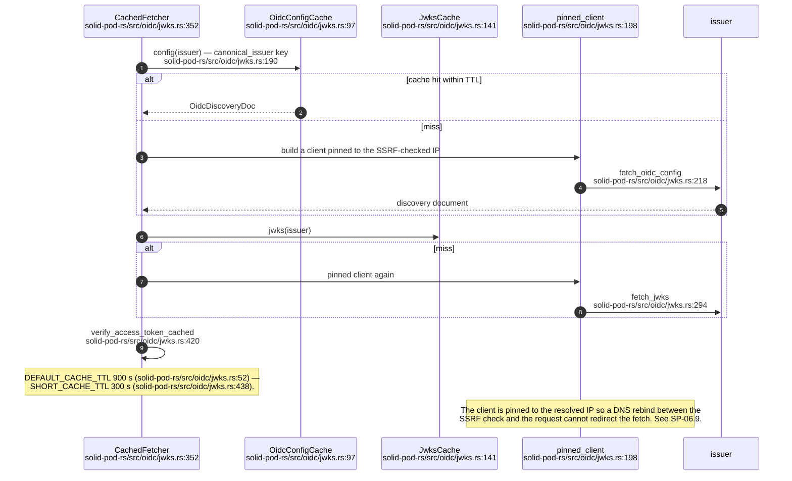
```mermaid
sequenceDiagram
    autonumber
    participant V as CachedFetcher<br/>solid-pod-rs/src/oidc/jwks.rs:352
    participant CC as OidcConfigCache<br/>solid-pod-rs/src/oidc/jwks.rs:97
    participant JC as JwksCache<br/>solid-pod-rs/src/oidc/jwks.rs:141
    participant P as pinned_client<br/>solid-pod-rs/src/oidc/jwks.rs:198
    participant I as issuer

    V->>CC: config(issuer) — canonical_issuer key<br/>solid-pod-rs/src/oidc/jwks.rs:190
    alt cache hit within TTL
        CC-->>V: OidcDiscoveryDoc
    else miss
        V->>P: build a client pinned to the SSRF-checked IP
        P->>I: fetch_oidc_config<br/>solid-pod-rs/src/oidc/jwks.rs:218
        I-->>V: discovery document
    end
    V->>JC: jwks(issuer)
    alt miss
        V->>P: pinned client again
        P->>I: fetch_jwks<br/>solid-pod-rs/src/oidc/jwks.rs:294
    end
    V->>V: verify_access_token_cached<br/>solid-pod-rs/src/oidc/jwks.rs:420
    Note over V: DEFAULT_CACHE_TTL 900 s (solid-pod-rs/src/oidc/jwks.rs:52) —<br/>SHORT_CACHE_TTL 300 s (solid-pod-rs/src/oidc/jwks.rs:438).
    Note over P: The client is pinned to the resolved IP so a DNS rebind between the<br/>SSRF check and the request cannot redirect the fetch. See SP-06.9.
```

## SP-05.11 WebID — generation, parsing and the pod URL family

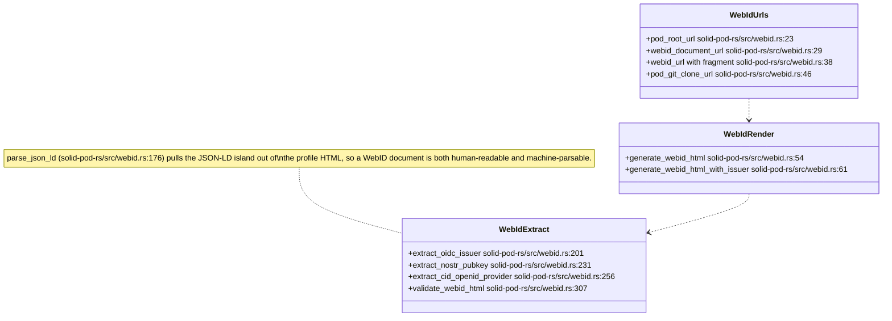
```mermaid
classDiagram
    class WebIdUrls {
        +pod_root_url  solid-pod-rs/src/webid.rs:23
        +webid_document_url  solid-pod-rs/src/webid.rs:29
        +webid_url with fragment  solid-pod-rs/src/webid.rs:38
        +pod_git_clone_url  solid-pod-rs/src/webid.rs:46
    }
    class WebIdRender {
        +generate_webid_html  solid-pod-rs/src/webid.rs:54
        +generate_webid_html_with_issuer  solid-pod-rs/src/webid.rs:61
    }
    class WebIdExtract {
        +extract_oidc_issuer  solid-pod-rs/src/webid.rs:201
        +extract_nostr_pubkey  solid-pod-rs/src/webid.rs:231
        +extract_cid_openid_provider  solid-pod-rs/src/webid.rs:256
        +validate_webid_html  solid-pod-rs/src/webid.rs:307
    }
    WebIdUrls ..> WebIdRender
    WebIdRender ..> WebIdExtract
    note for WebIdExtract "parse_json_ld (solid-pod-rs/src/webid.rs:176) pulls the JSON-LD island out of\nthe profile HTML, so a WebID document is both human-readable and machine-parsable."
```

## SP-05.12 did:nostr — document rendering and the bidirectional binding

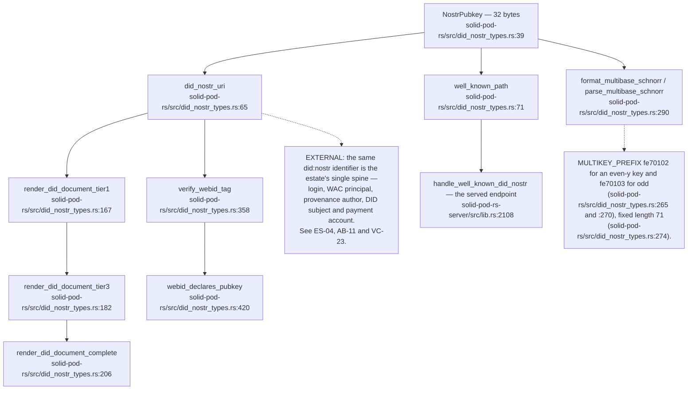
```mermaid
flowchart TD
    PK["NostrPubkey — 32 bytes<br/>solid-pod-rs/src/did_nostr_types.rs:39"]
    URI["did_nostr_uri<br/>solid-pod-rs/src/did_nostr_types.rs:65"]
    WKP["well_known_path<br/>solid-pod-rs/src/did_nostr_types.rs:71"]
    T1["render_did_document_tier1<br/>solid-pod-rs/src/did_nostr_types.rs:167"]
    T3["render_did_document_tier3<br/>solid-pod-rs/src/did_nostr_types.rs:182"]
    TC["render_did_document_complete<br/>solid-pod-rs/src/did_nostr_types.rs:206"]
    MB["format_multibase_schnorr / parse_multibase_schnorr<br/>solid-pod-rs/src/did_nostr_types.rs:290"]
    VT["verify_webid_tag<br/>solid-pod-rs/src/did_nostr_types.rs:358"]
    WD["webid_declares_pubkey<br/>solid-pod-rs/src/did_nostr_types.rs:420"]
    RT["handle_well_known_did_nostr — the served endpoint<br/>solid-pod-rs-server/src/lib.rs:2108"]

    PK --> URI --> T1
    PK --> WKP --> RT
    T1 --> T3 --> TC
    PK --> MB
    URI --> VT --> WD

    N["MULTIKEY_PREFIX fe70102 for an even-y key and fe70103 for odd<br/>(solid-pod-rs/src/did_nostr_types.rs:265 and :270), fixed length 71<br/>(solid-pod-rs/src/did_nostr_types.rs:274)."]
    MB -.-> N
    N2["EXTERNAL: the same did:nostr identifier is the estate's single spine —<br/>login, WAC principal, provenance author, DID subject and payment account.<br/>See ES-04, AB-11 and VC-23."]
    URI -.-> N2
```

## SP-05.13 did:nostr resolution — WebID and DID-Doc must agree

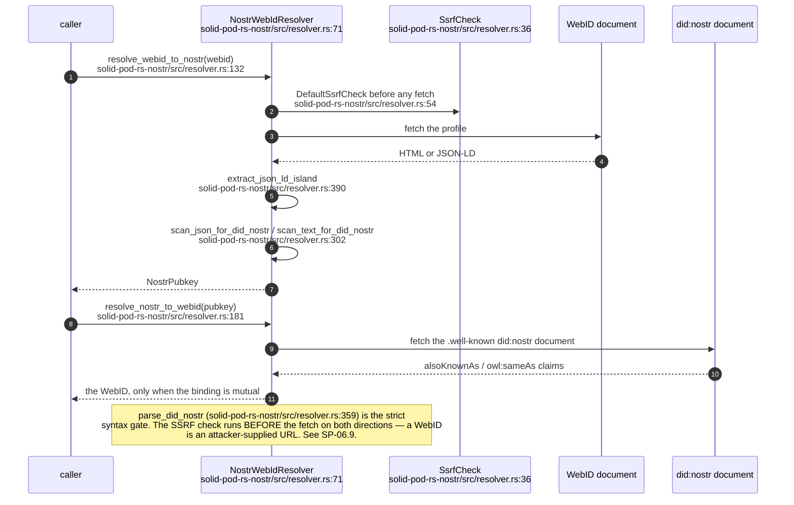
```mermaid
sequenceDiagram
    autonumber
    participant A as caller
    participant R as NostrWebIdResolver<br/>solid-pod-rs-nostr/src/resolver.rs:71
    participant SS as SsrfCheck<br/>solid-pod-rs-nostr/src/resolver.rs:36
    participant W as WebID document
    participant D as did:nostr document

    A->>R: resolve_webid_to_nostr(webid)<br/>solid-pod-rs-nostr/src/resolver.rs:132
    R->>SS: DefaultSsrfCheck before any fetch<br/>solid-pod-rs-nostr/src/resolver.rs:54
    R->>W: fetch the profile
    W-->>R: HTML or JSON-LD
    R->>R: extract_json_ld_island<br/>solid-pod-rs-nostr/src/resolver.rs:390
    R->>R: scan_json_for_did_nostr / scan_text_for_did_nostr<br/>solid-pod-rs-nostr/src/resolver.rs:302
    R-->>A: NostrPubkey

    A->>R: resolve_nostr_to_webid(pubkey)<br/>solid-pod-rs-nostr/src/resolver.rs:181
    R->>D: fetch the .well-known did:nostr document
    D-->>R: alsoKnownAs / owl:sameAs claims
    R-->>A: the WebID, only when the binding is mutual
    Note over R: parse_did_nostr (solid-pod-rs-nostr/src/resolver.rs:359) is the strict<br/>syntax gate. The SSRF check runs BEFORE the fetch on both directions — a WebID<br/>is an attacker-supplied URL. See SP-06.9.
```

## SP-05.14 did:key — multicodec and self-signed JWT

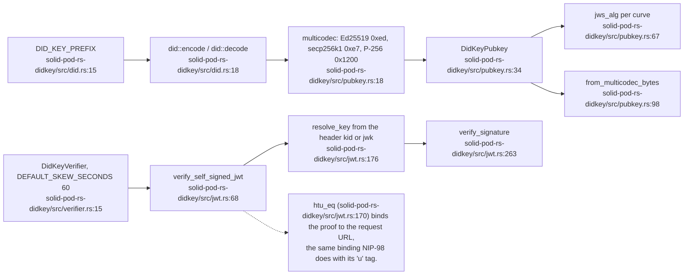
```mermaid
flowchart LR
    ENC["did::encode / did::decode<br/>solid-pod-rs-didkey/src/did.rs:18"]
    PFX["DID_KEY_PREFIX<br/>solid-pod-rs-didkey/src/did.rs:15"]
    CODEC["multicodec: Ed25519 0xed, secp256k1 0xe7, P-256 0x1200<br/>solid-pod-rs-didkey/src/pubkey.rs:18"]
    ENUM["DidKeyPubkey<br/>solid-pod-rs-didkey/src/pubkey.rs:34"]
    ALG["jws_alg per curve<br/>solid-pod-rs-didkey/src/pubkey.rs:67"]
    FROM["from_multicodec_bytes<br/>solid-pod-rs-didkey/src/pubkey.rs:98"]
    JWT["verify_self_signed_jwt<br/>solid-pod-rs-didkey/src/jwt.rs:68"]
    RK["resolve_key from the header kid or jwk<br/>solid-pod-rs-didkey/src/jwt.rs:176"]
    VS["verify_signature<br/>solid-pod-rs-didkey/src/jwt.rs:263"]
    VER["DidKeyVerifier, DEFAULT_SKEW_SECONDS 60<br/>solid-pod-rs-didkey/src/verifier.rs:15"]

    PFX --> ENC --> CODEC --> ENUM --> ALG
    ENUM --> FROM
    JWT --> RK --> VS
    VER --> JWT

    N["htu_eq (solid-pod-rs-didkey/src/jwt.rs:170) binds the proof to the request URL,<br/>the same binding NIP-98 does with its 'u' tag."]
    JWT -.-> N
```

## SP-05.15 The self-signed / CID verifier registry

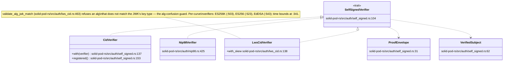
```mermaid
classDiagram
    class SelfSignedVerifier {
        <<trait>>
        solid-pod-rs/src/auth/self_signed.rs:104
    }
    class CidVerifier {
        +with(verifier)  solid-pod-rs/src/auth/self_signed.rs:137
        +registered()  solid-pod-rs/src/auth/self_signed.rs:153
    }
    class Nip98Verifier {
        solid-pod-rs/src/auth/nip98.rs:425
    }
    class LwsCidVerifier {
        +with_skew  solid-pod-rs/src/auth/lws_cid.rs:138
    }
    class ProofEnvelope {
        solid-pod-rs/src/auth/self_signed.rs:31
    }
    class VerifiedSubject {
        solid-pod-rs/src/auth/self_signed.rs:62
    }
    SelfSignedVerifier <|.. CidVerifier
    SelfSignedVerifier <|.. Nip98Verifier
    SelfSignedVerifier <|.. LwsCidVerifier
    SelfSignedVerifier ..> ProofEnvelope
    SelfSignedVerifier ..> VerifiedSubject
    note for LwsCidVerifier "validate_alg_jwk_match (solid-pod-rs/src/auth/lws_cid.rs:463) refuses an alg\nthat does not match the JWK's key type — the alg-confusion guard. Per-curve\nverifiers: ES256K (:503), ES256 (:523), EdDSA (:543); time bounds at :341."
```

## SP-05.16 The bundled IdP — authorisation-code flow with PKCE and DPoP

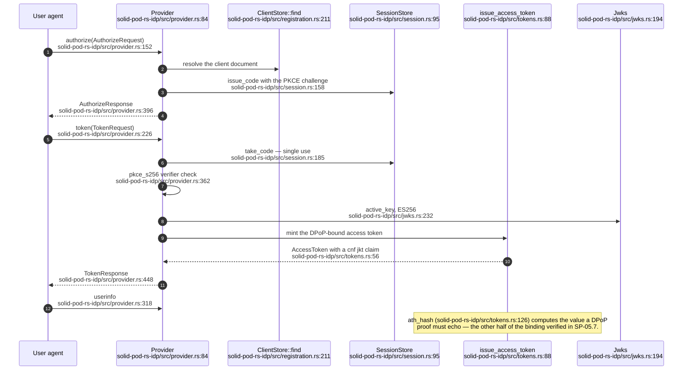
```mermaid
sequenceDiagram
    autonumber
    participant U as User agent
    participant P as Provider<br/>solid-pod-rs-idp/src/provider.rs:84
    participant CS as ClientStore::find<br/>solid-pod-rs-idp/src/registration.rs:211
    participant SS as SessionStore<br/>solid-pod-rs-idp/src/session.rs:95
    participant T as issue_access_token<br/>solid-pod-rs-idp/src/tokens.rs:88
    participant J as Jwks<br/>solid-pod-rs-idp/src/jwks.rs:194

    U->>P: authorize(AuthorizeRequest)<br/>solid-pod-rs-idp/src/provider.rs:152
    P->>CS: resolve the client document
    P->>SS: issue_code with the PKCE challenge<br/>solid-pod-rs-idp/src/session.rs:158
    P-->>U: AuthorizeResponse<br/>solid-pod-rs-idp/src/provider.rs:396
    U->>P: token(TokenRequest)<br/>solid-pod-rs-idp/src/provider.rs:226
    P->>SS: take_code — single use<br/>solid-pod-rs-idp/src/session.rs:185
    P->>P: pkce_s256 verifier check<br/>solid-pod-rs-idp/src/provider.rs:362
    P->>J: active_key, ES256<br/>solid-pod-rs-idp/src/jwks.rs:232
    P->>T: mint the DPoP-bound access token
    T-->>P: AccessToken with a cnf jkt claim<br/>solid-pod-rs-idp/src/tokens.rs:56
    P-->>U: TokenResponse<br/>solid-pod-rs-idp/src/provider.rs:448
    U->>P: userinfo<br/>solid-pod-rs-idp/src/provider.rs:318
    Note over T: ath_hash (solid-pod-rs-idp/src/tokens.rs:126) computes the value a DPoP<br/>proof must echo — the other half of the binding verified in SP-05.7.
```

## SP-05.17 IdP key management and discovery

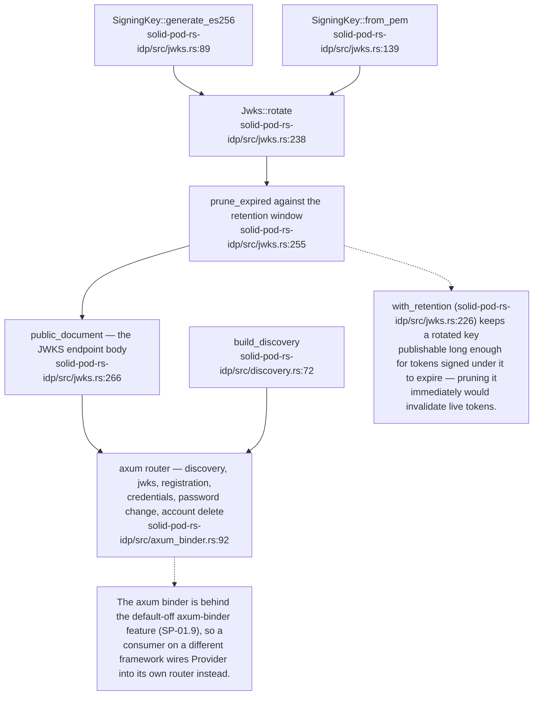
```mermaid
flowchart TD
    GEN["SigningKey::generate_es256<br/>solid-pod-rs-idp/src/jwks.rs:89"]
    PEM["SigningKey::from_pem<br/>solid-pod-rs-idp/src/jwks.rs:139"]
    ROT["Jwks::rotate<br/>solid-pod-rs-idp/src/jwks.rs:238"]
    PRUNE["prune_expired against the retention window<br/>solid-pod-rs-idp/src/jwks.rs:255"]
    PUB["public_document — the JWKS endpoint body<br/>solid-pod-rs-idp/src/jwks.rs:266"]
    DISC["build_discovery<br/>solid-pod-rs-idp/src/discovery.rs:72"]
    ROUTER["axum router — discovery, jwks, registration,<br/>credentials, password change, account delete<br/>solid-pod-rs-idp/src/axum_binder.rs:92"]

    GEN --> ROT --> PRUNE --> PUB --> ROUTER
    PEM --> ROT
    DISC --> ROUTER

    N["with_retention (solid-pod-rs-idp/src/jwks.rs:226) keeps a rotated key<br/>publishable long enough for tokens signed under it to expire — pruning it<br/>immediately would invalidate live tokens."]
    PRUNE -.-> N
    N2["The axum binder is behind the default-off axum-binder feature (SP-01.9), so a<br/>consumer on a different framework wires Provider into its own router instead."]
    ROUTER -.-> N2
```

## SP-05.18 IdP credential surfaces

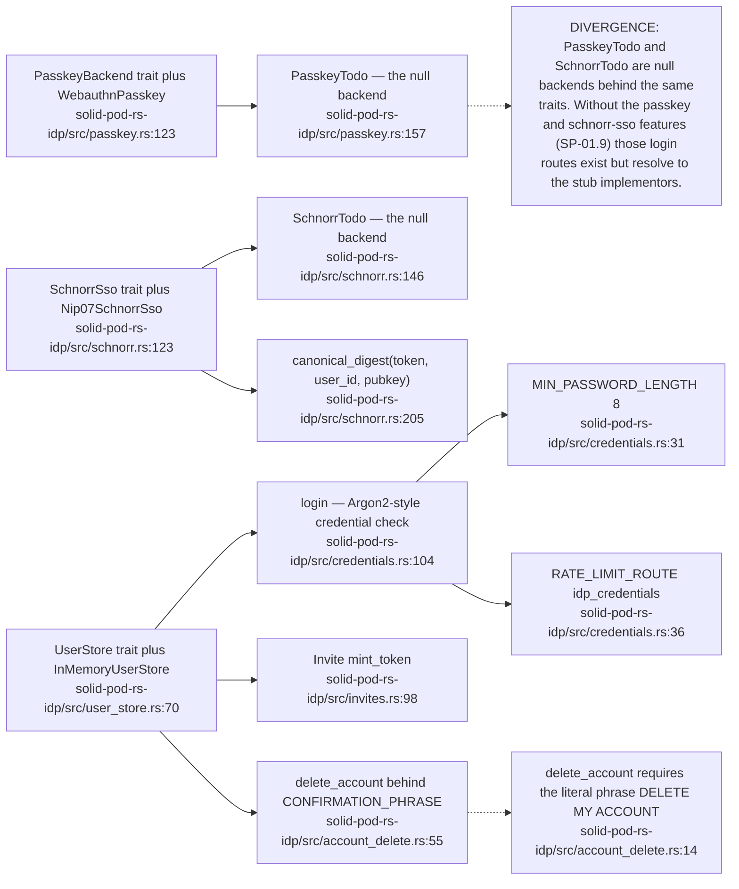
```mermaid
flowchart LR
    PWD["login — Argon2-style credential check<br/>solid-pod-rs-idp/src/credentials.rs:104"]
    MINLEN["MIN_PASSWORD_LENGTH 8<br/>solid-pod-rs-idp/src/credentials.rs:31"]
    RL["RATE_LIMIT_ROUTE idp_credentials<br/>solid-pod-rs-idp/src/credentials.rs:36"]
    PK["PasskeyBackend trait plus WebauthnPasskey<br/>solid-pod-rs-idp/src/passkey.rs:123"]
    TODO["PasskeyTodo — the null backend<br/>solid-pod-rs-idp/src/passkey.rs:157"]
    SCH["SchnorrSso trait plus Nip07SchnorrSso<br/>solid-pod-rs-idp/src/schnorr.rs:123"]
    STODO["SchnorrTodo — the null backend<br/>solid-pod-rs-idp/src/schnorr.rs:146"]
    DIG["canonical_digest(token, user_id, pubkey)<br/>solid-pod-rs-idp/src/schnorr.rs:205"]
    US["UserStore trait plus InMemoryUserStore<br/>solid-pod-rs-idp/src/user_store.rs:70"]
    INV["Invite mint_token<br/>solid-pod-rs-idp/src/invites.rs:98"]
    DEL["delete_account behind CONFIRMATION_PHRASE<br/>solid-pod-rs-idp/src/account_delete.rs:55"]

    PWD --> MINLEN
    PWD --> RL
    PK --> TODO
    SCH --> STODO
    SCH --> DIG
    US --> PWD
    US --> INV
    US --> DEL

    N["DIVERGENCE: PasskeyTodo and SchnorrTodo are null backends behind the same<br/>traits. Without the passkey and schnorr-sso features (SP-01.9) those login<br/>routes exist but resolve to the stub implementors."]
    TODO -.-> N
    N2["delete_account requires the literal phrase DELETE MY ACCOUNT<br/>solid-pod-rs-idp/src/account_delete.rs:14"]
    DEL -.-> N2
```

## SP-05.19 Pod key provisioning — deliberately not an HTTP route

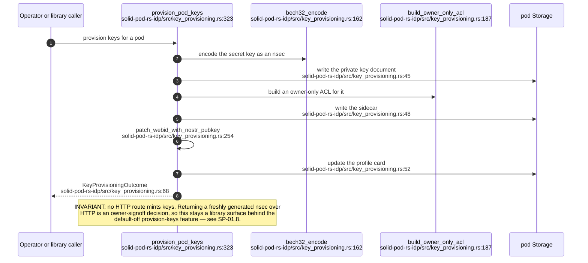
```mermaid
sequenceDiagram
    autonumber
    participant OP as Operator or library caller
    participant PV as provision_pod_keys<br/>solid-pod-rs-idp/src/key_provisioning.rs:323
    participant B32 as bech32_encode<br/>solid-pod-rs-idp/src/key_provisioning.rs:162
    participant ACL as build_owner_only_acl<br/>solid-pod-rs-idp/src/key_provisioning.rs:187
    participant S as pod Storage

    OP->>PV: provision keys for a pod
    PV->>B32: encode the secret key as an nsec
    PV->>S: write the private key document<br/>solid-pod-rs-idp/src/key_provisioning.rs:45
    PV->>ACL: build an owner-only ACL for it
    PV->>S: write the sidecar<br/>solid-pod-rs-idp/src/key_provisioning.rs:48
    PV->>PV: patch_webid_with_nostr_pubkey<br/>solid-pod-rs-idp/src/key_provisioning.rs:254
    PV->>S: update the profile card<br/>solid-pod-rs-idp/src/key_provisioning.rs:52
    PV-->>OP: KeyProvisioningOutcome<br/>solid-pod-rs-idp/src/key_provisioning.rs:68
    Note over PV: INVARIANT: no HTTP route mints keys. Returning a freshly generated nsec over<br/>HTTP is an owner-signoff decision, so this stays a library surface behind the<br/>default-off provision-keys feature — see SP-01.8.
```

## SP-05.20 Pod-resident identity discovery endpoints

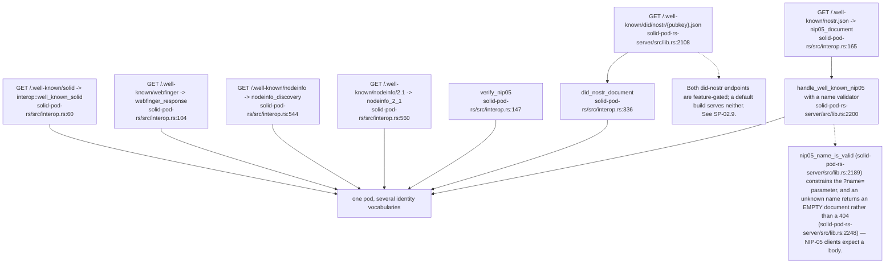
```mermaid
flowchart TD
    WKS["GET /.well-known/solid -> interop::well_known_solid<br/>solid-pod-rs/src/interop.rs:60"]
    WF["GET /.well-known/webfinger -> webfinger_response<br/>solid-pod-rs/src/interop.rs:104"]
    NI["GET /.well-known/nodeinfo -> nodeinfo_discovery<br/>solid-pod-rs/src/interop.rs:544"]
    NI21["GET /.well-known/nodeinfo/2.1 -> nodeinfo_2_1<br/>solid-pod-rs/src/interop.rs:560"]
    DN["GET /.well-known/did/nostr/{pubkey}.json<br/>solid-pod-rs-server/src/lib.rs:2108"]
    N05["GET /.well-known/nostr.json -> nip05_document<br/>solid-pod-rs/src/interop.rs:165"]
    N05V["verify_nip05<br/>solid-pod-rs/src/interop.rs:147"]
    N05H["handle_well_known_nip05 with a name validator<br/>solid-pod-rs-server/src/lib.rs:2200"]
    DND["did_nostr_document<br/>solid-pod-rs/src/interop.rs:336"]

    WKS --> OUT["one pod, several identity vocabularies"]
    WF --> OUT
    NI --> OUT
    NI21 --> OUT
    DN --> DND --> OUT
    N05 --> N05H --> OUT
    N05V --> OUT

    N["nip05_name_is_valid (solid-pod-rs-server/src/lib.rs:2189) constrains the ?name=<br/>parameter, and an unknown name returns an EMPTY document rather than a 404<br/>(solid-pod-rs-server/src/lib.rs:2248) — NIP-05 clients expect a body."]
    N05H -.-> N
    N2["Both did-nostr endpoints are feature-gated; a default build serves neither.<br/>See SP-02.9."]
    DN -.-> N2
```
