## SP-06.1 The Storage seam and its two shipped backends

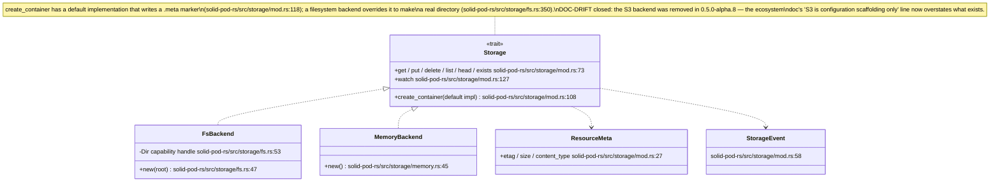

## SP-06.2 Path normalisation — the traversal gate

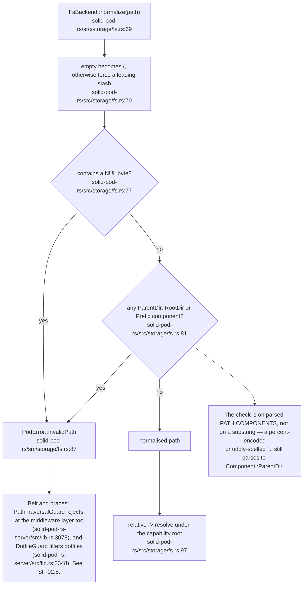

## SP-06.3 Capability-confined filesystem access

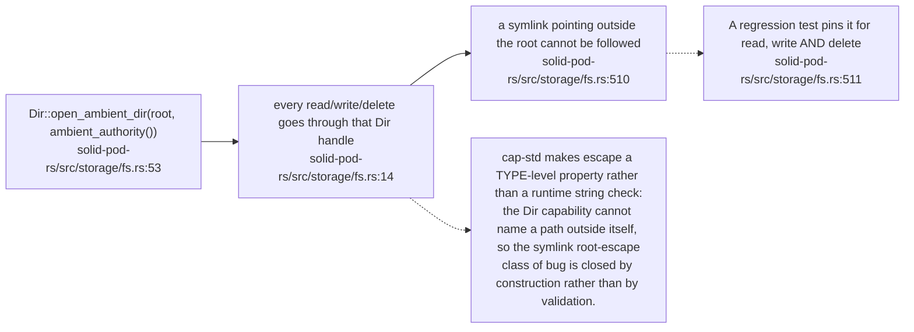

## SP-06.4 Atomic write and the body/metadata pair

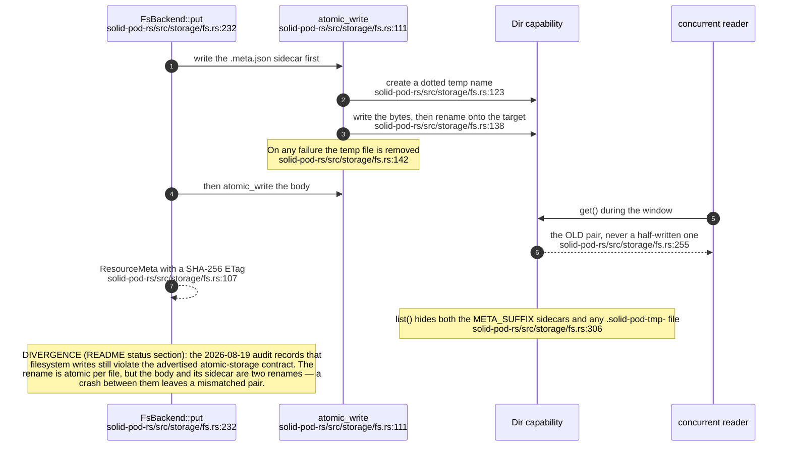

## SP-06.5 Change events — the notification source

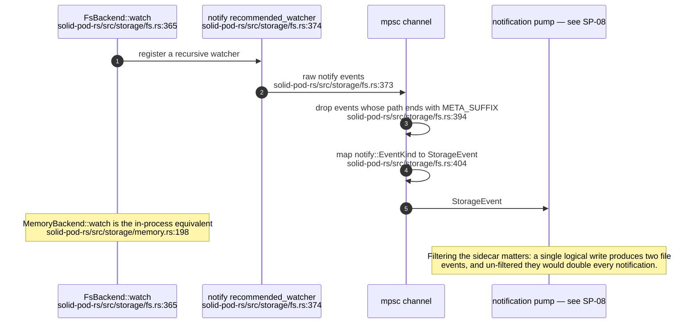

## SP-06.6 Per-pod quota — atomic reservation

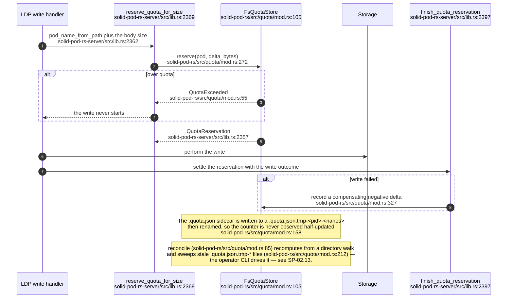

## SP-06.7 Multitenancy — path versus subdomain resolution

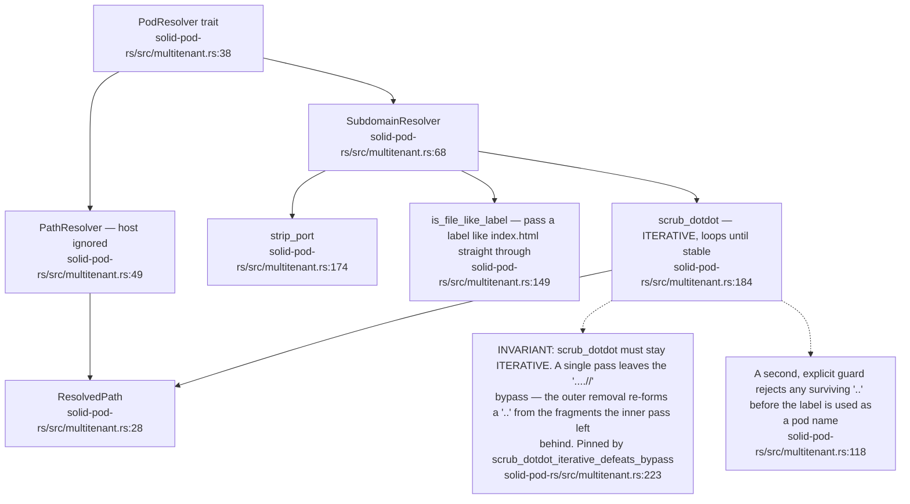

## SP-06.8 Pod provisioning

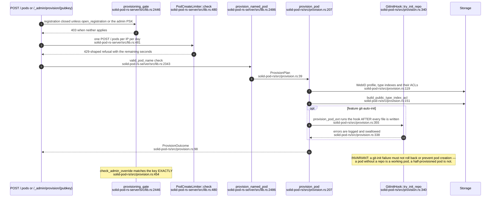

## SP-06.9 The SSRF policy

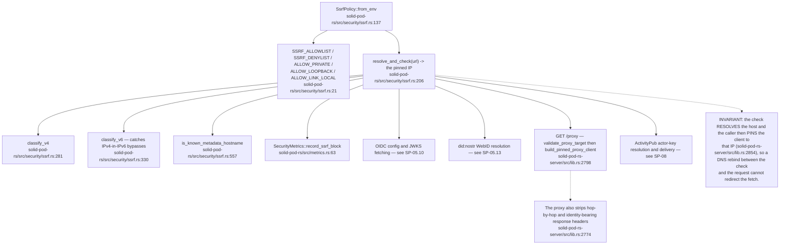

## SP-06.10 Dotfile allowlist, CORS and rate limiting

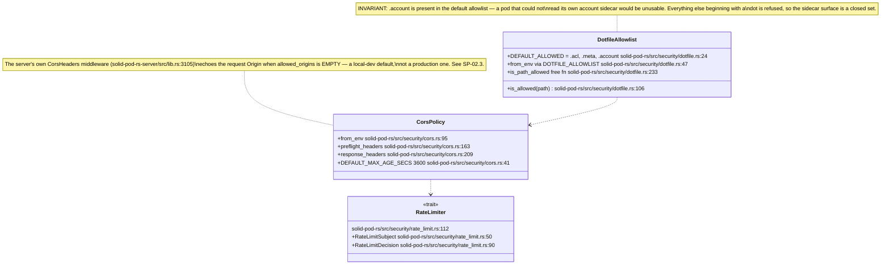

## SP-06.11 Git-versioned pods — repository lifecycle

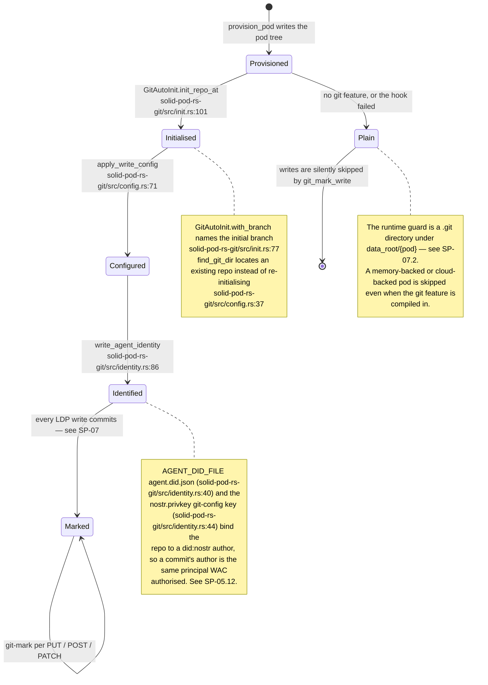

## SP-06.12 Git smart-HTTP — the WAC-gated CGI bridge

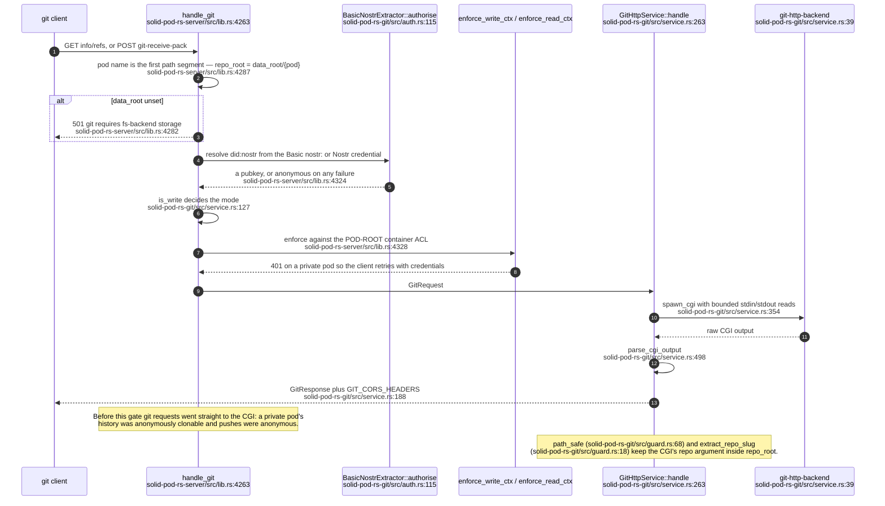

## SP-06.13 The `_git` control-panel REST surface

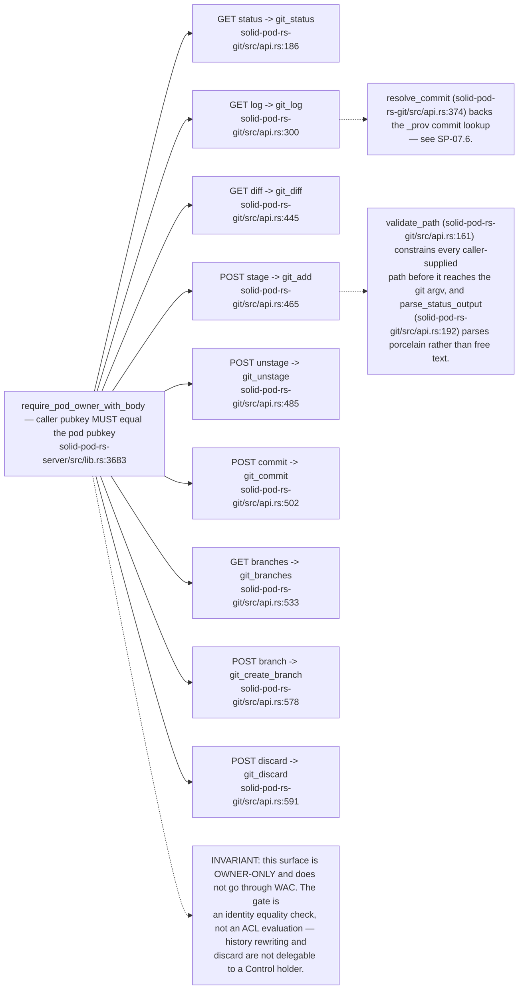

## SP-06.14 Pod export — the exit right

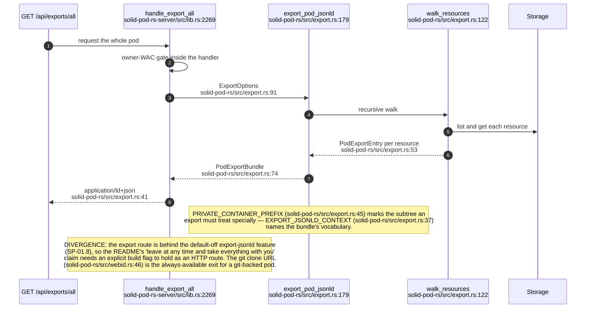
