## SP-07.1 The two provenance tiers

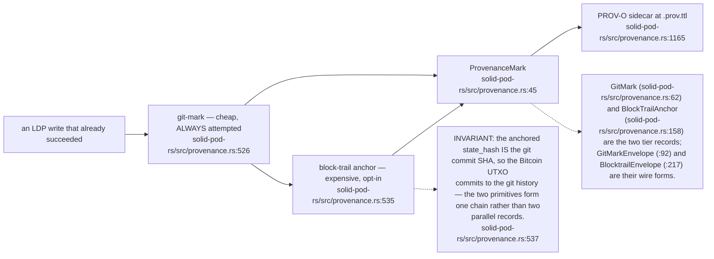

## SP-07.2 git_mark_write — the skip ladder

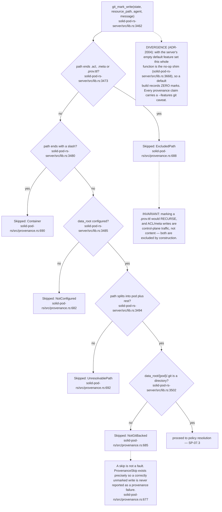

## SP-07.3 Anchor policy resolution

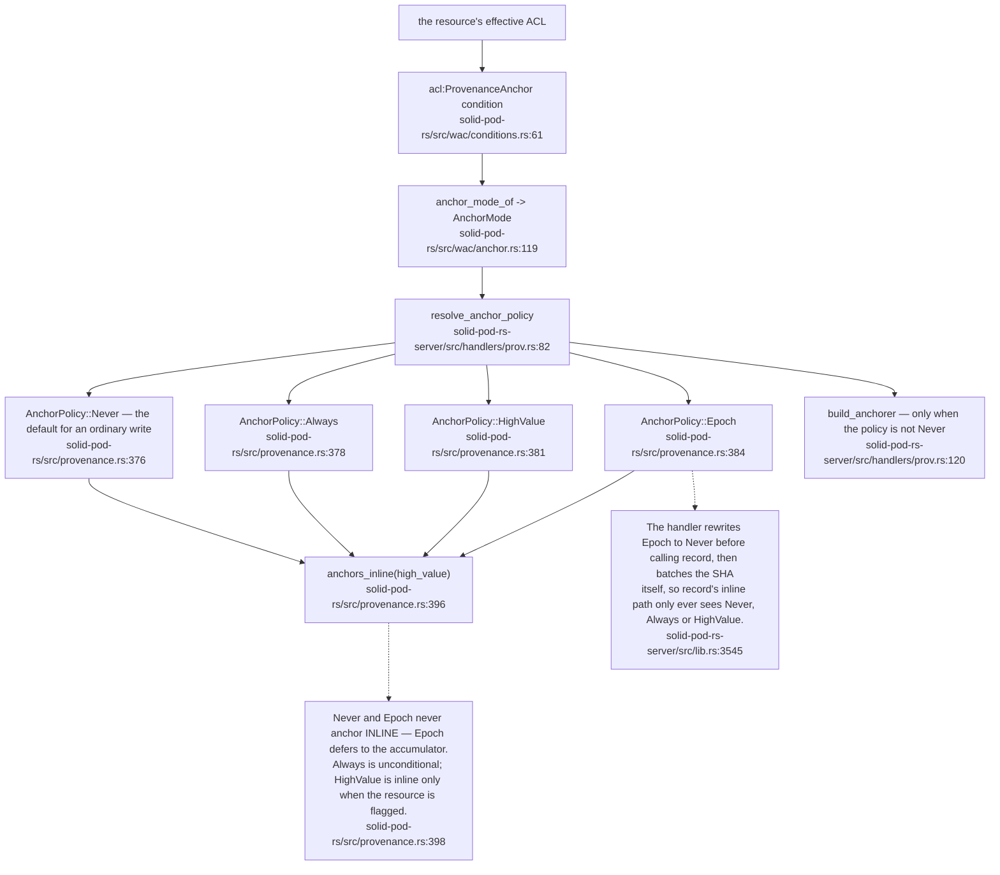

## SP-07.4 record_receipt — typed, per-tier outcomes (ADR-2004)

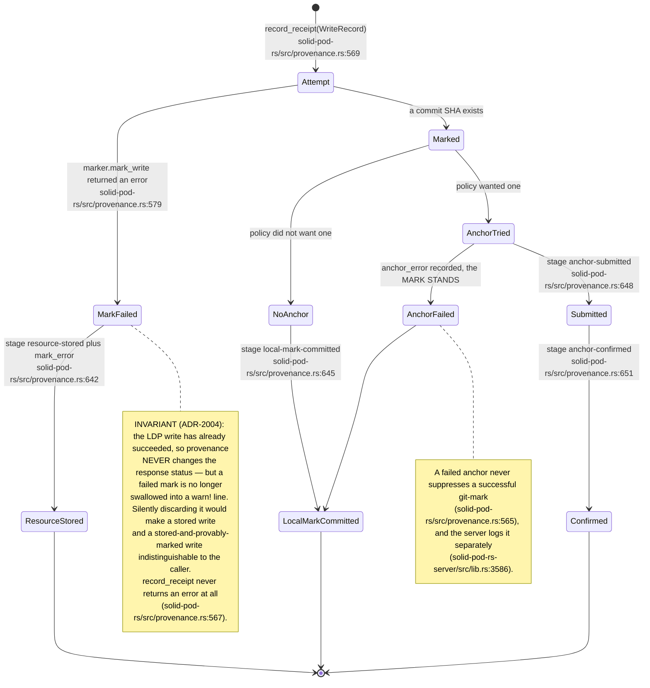

## SP-07.5 The receipt on the wire

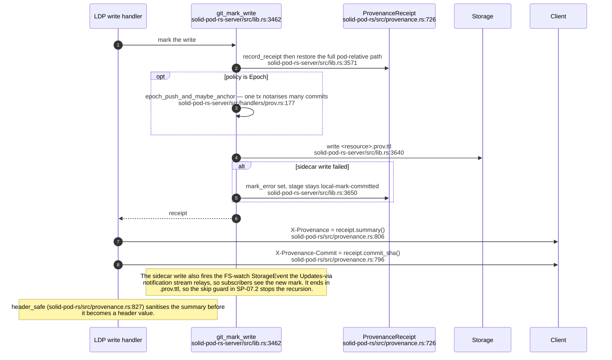

## SP-07.6 The `_prov` query surface

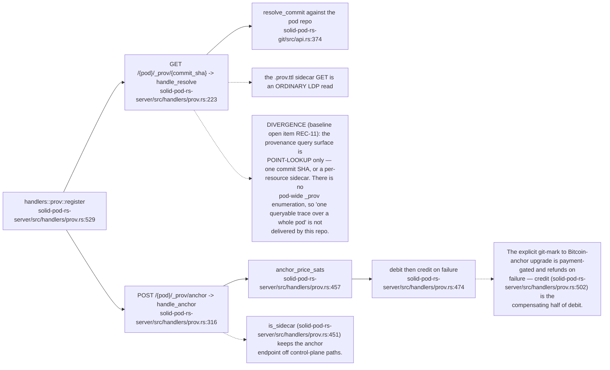

## SP-07.7 Epoch batching — one transaction, many commits

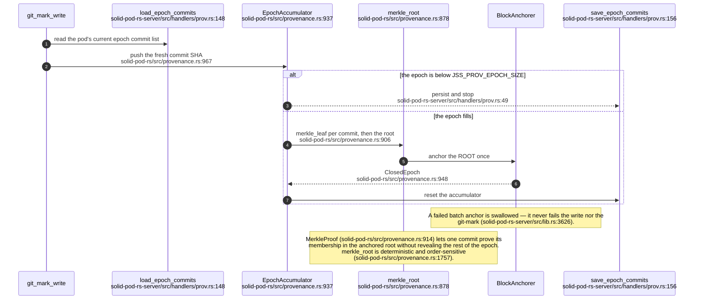

## SP-07.8 The git marker — shelling out to git

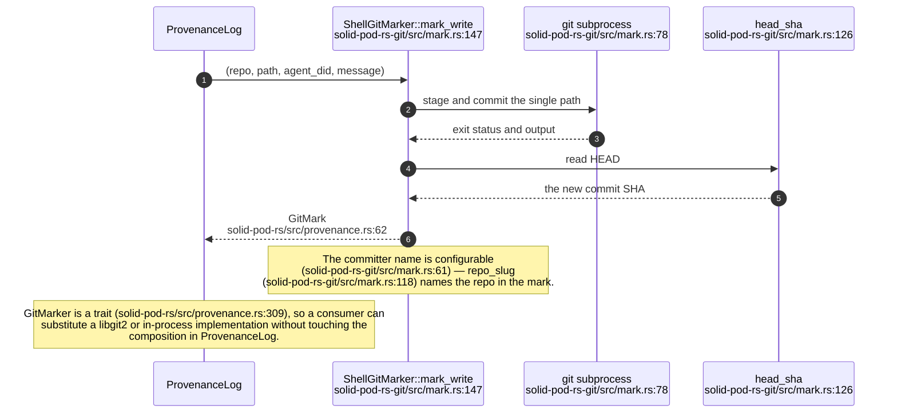

## SP-07.9 MRC20 state chain and Bitcoin anchoring

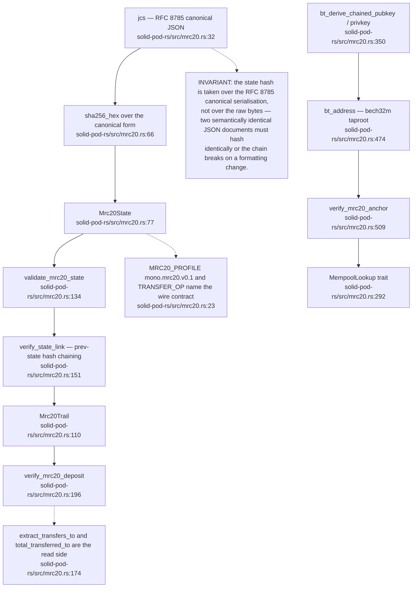

## SP-07.10 The hand-rolled Bitcoin transaction path

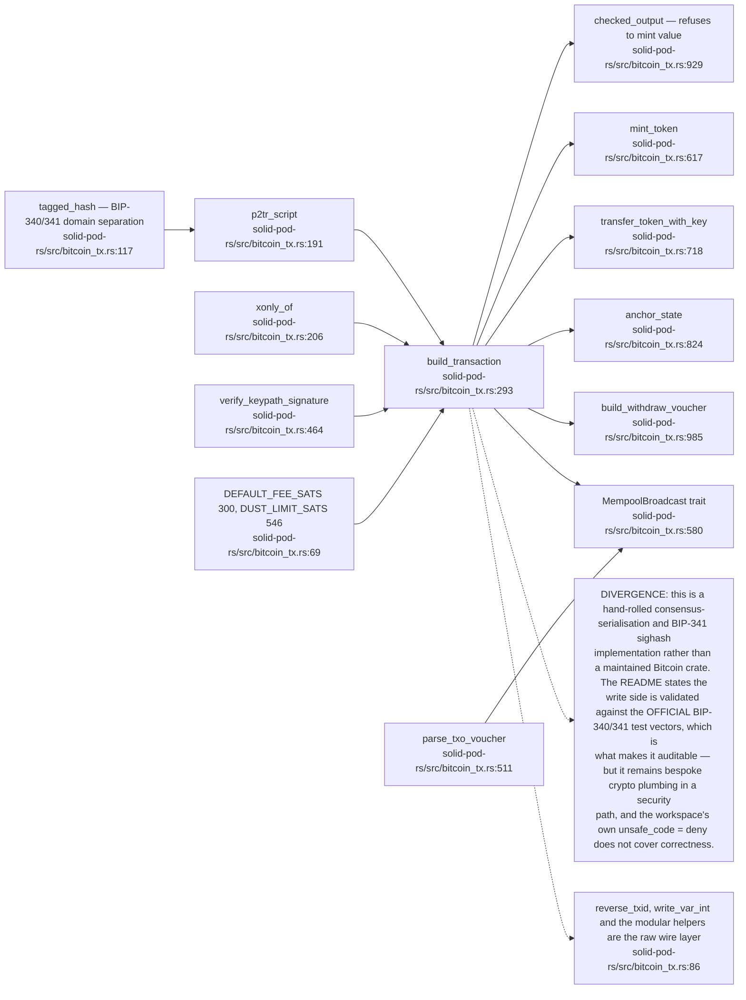

## SP-07.11 Mempool endpoint selection (ADR-2007)

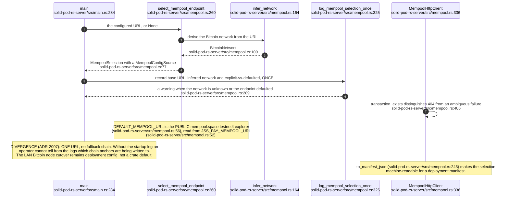

## SP-07.12 The block anchorer

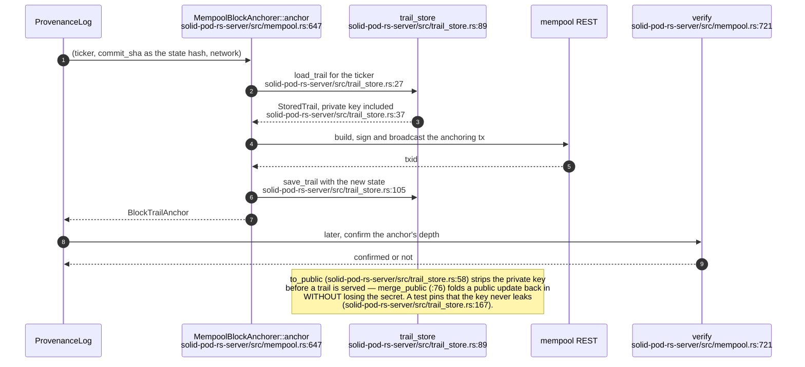

## SP-07.13 The web ledger

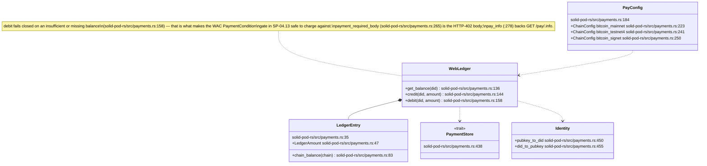

## SP-07.14 The `/pay/*` route family

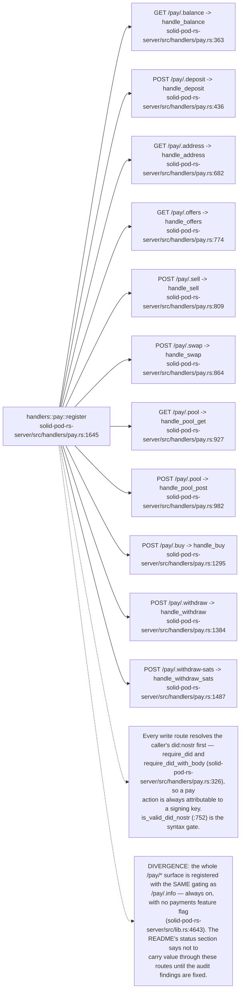

## SP-07.15 Payment-state atomicity

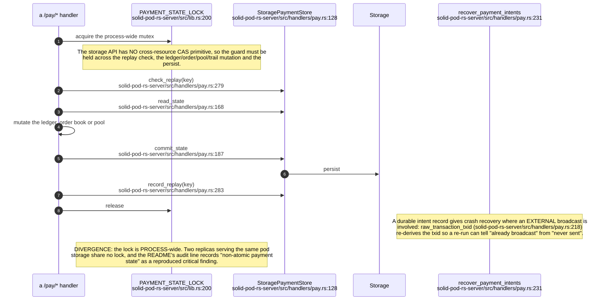

## SP-07.16 Order book and AMM

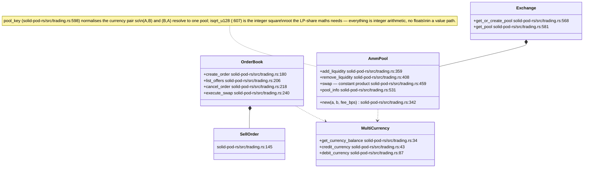

## SP-07.17 The unverified deposit stand-in

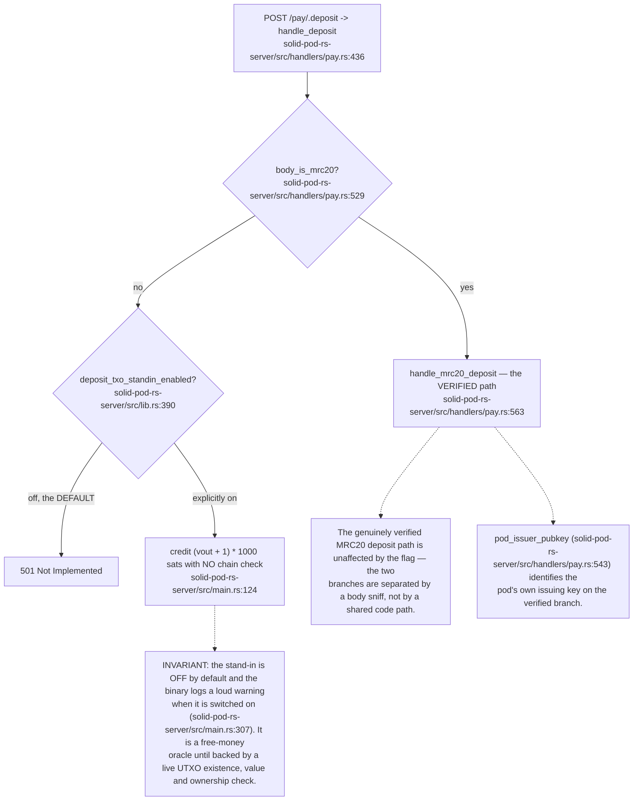
