## SP-07.1 The two provenance tiers

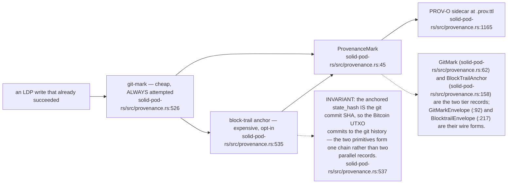
```mermaid
flowchart LR
    W["an LDP write that already succeeded"]
    GM["git-mark — cheap, ALWAYS attempted<br/>solid-pod-rs/src/provenance.rs:526"]
    AN["block-trail anchor — expensive, opt-in<br/>solid-pod-rs/src/provenance.rs:535"]
    SC["PROV-O sidecar at <resource>.prov.ttl<br/>solid-pod-rs/src/provenance.rs:1165"]
    MK["ProvenanceMark<br/>solid-pod-rs/src/provenance.rs:45"]

    W --> GM --> MK
    GM --> AN --> MK
    MK --> SC

    N["INVARIANT: the anchored state_hash IS the git commit SHA, so the Bitcoin UTXO<br/>commits to the git history — the two primitives form one chain rather than two<br/>parallel records.<br/>solid-pod-rs/src/provenance.rs:537"]
    AN -.-> N
    N2["GitMark (solid-pod-rs/src/provenance.rs:62) and BlockTrailAnchor<br/>(solid-pod-rs/src/provenance.rs:158) are the two tier records;<br/>GitMarkEnvelope (:92) and BlocktrailEnvelope (:217) are their wire forms."]
    MK -.-> N2
```

## SP-07.2 git_mark_write — the skip ladder

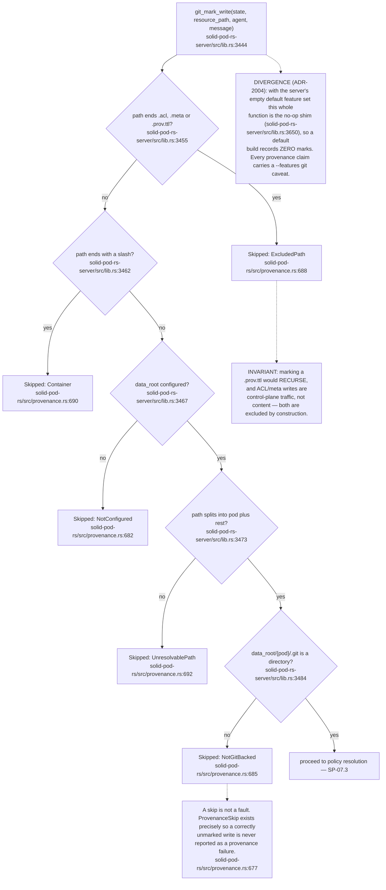
```mermaid
flowchart TD
    IN["git_mark_write(state, resource_path, agent, message)<br/>solid-pod-rs-server/src/lib.rs:3444"]
    SIDE{"path ends .acl, .meta or .prov.ttl?<br/>solid-pod-rs-server/src/lib.rs:3455"}
    S1["Skipped: ExcludedPath<br/>solid-pod-rs/src/provenance.rs:688"]
    CONT{"path ends with a slash?<br/>solid-pod-rs-server/src/lib.rs:3462"}
    S2["Skipped: Container<br/>solid-pod-rs/src/provenance.rs:690"]
    ROOT{"data_root configured?<br/>solid-pod-rs-server/src/lib.rs:3467"}
    S3["Skipped: NotConfigured<br/>solid-pod-rs/src/provenance.rs:682"]
    SPLIT{"path splits into pod plus rest?<br/>solid-pod-rs-server/src/lib.rs:3473"}
    S4["Skipped: UnresolvablePath<br/>solid-pod-rs/src/provenance.rs:692"]
    GITD{"data_root/{pod}/.git is a directory?<br/>solid-pod-rs-server/src/lib.rs:3484"}
    S5["Skipped: NotGitBacked<br/>solid-pod-rs/src/provenance.rs:685"]
    GO["proceed to policy resolution — SP-07.3"]

    IN --> SIDE
    SIDE -- yes --> S1
    SIDE -- no --> CONT
    CONT -- yes --> S2
    CONT -- no --> ROOT
    ROOT -- no --> S3
    ROOT -- yes --> SPLIT
    SPLIT -- no --> S4
    SPLIT -- yes --> GITD
    GITD -- no --> S5
    GITD -- yes --> GO

    N["INVARIANT: marking a .prov.ttl would RECURSE, and ACL/meta writes are<br/>control-plane traffic, not content — both are excluded by construction."]
    S1 -.-> N
    N2["A skip is not a fault. ProvenanceSkip exists precisely so a correctly<br/>unmarked write is never reported as a provenance failure.<br/>solid-pod-rs/src/provenance.rs:677"]
    S5 -.-> N2
    N3["DIVERGENCE (ADR-2004): with the server's empty default feature set this whole<br/>function is the no-op shim (solid-pod-rs-server/src/lib.rs:3650), so a default<br/>build records ZERO marks. Every provenance claim carries a --features git caveat."]
    IN -.-> N3
```

## SP-07.3 Anchor policy resolution

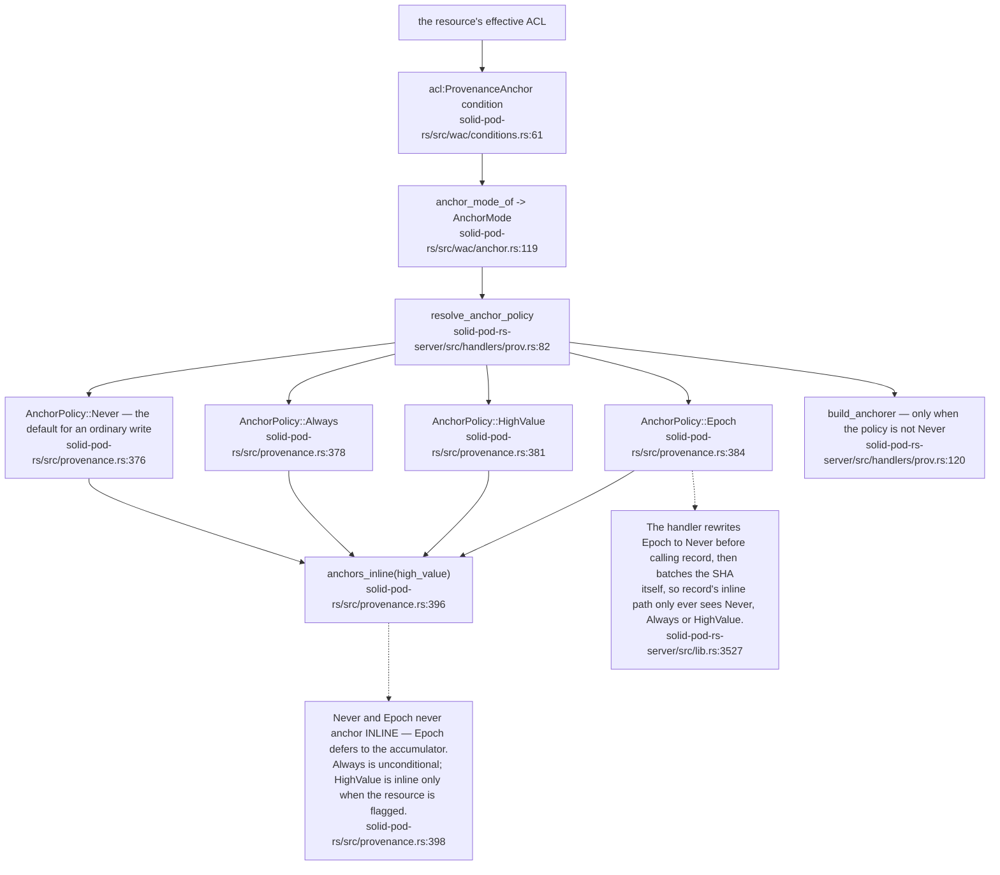
```mermaid
flowchart TD
    ACL["the resource's effective ACL"]
    COND["acl:ProvenanceAnchor condition<br/>solid-pod-rs/src/wac/conditions.rs:61"]
    MODE["anchor_mode_of -> AnchorMode<br/>solid-pod-rs/src/wac/anchor.rs:119"]
    RES["resolve_anchor_policy<br/>solid-pod-rs-server/src/handlers/prov.rs:82"]
    NEVER["AnchorPolicy::Never — the default for an ordinary write<br/>solid-pod-rs/src/provenance.rs:376"]
    ALWAYS["AnchorPolicy::Always<br/>solid-pod-rs/src/provenance.rs:378"]
    HV["AnchorPolicy::HighValue<br/>solid-pod-rs/src/provenance.rs:381"]
    EP["AnchorPolicy::Epoch<br/>solid-pod-rs/src/provenance.rs:384"]
    INLINE["anchors_inline(high_value)<br/>solid-pod-rs/src/provenance.rs:396"]
    BLD["build_anchorer — only when the policy is not Never<br/>solid-pod-rs-server/src/handlers/prov.rs:120"]

    ACL --> COND --> MODE --> RES
    RES --> NEVER
    RES --> ALWAYS
    RES --> HV
    RES --> EP
    NEVER --> INLINE
    ALWAYS --> INLINE
    HV --> INLINE
    EP --> INLINE
    RES --> BLD

    N["Never and Epoch never anchor INLINE — Epoch defers to the accumulator.<br/>Always is unconditional; HighValue is inline only when the resource is flagged.<br/>solid-pod-rs/src/provenance.rs:398"]
    INLINE -.-> N
    N2["The handler rewrites Epoch to Never before calling record, then batches the SHA<br/>itself, so record's inline path only ever sees Never, Always or HighValue.<br/>solid-pod-rs-server/src/lib.rs:3527"]
    EP -.-> N2
```

## SP-07.4 record_receipt — typed, per-tier outcomes (ADR-2004)

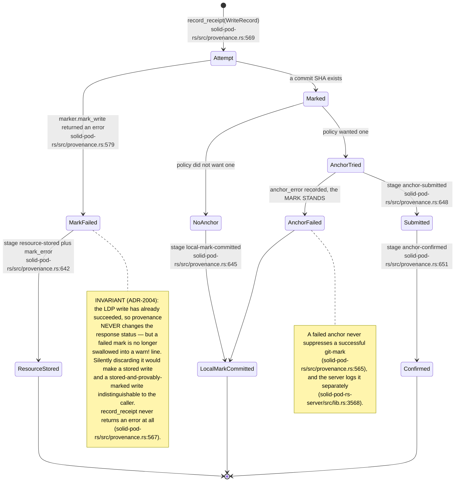
```mermaid
stateDiagram-v2
    [*] --> Attempt: record_receipt(WriteRecord)<br/>solid-pod-rs/src/provenance.rs:569
    Attempt --> MarkFailed: marker.mark_write returned an error<br/>solid-pod-rs/src/provenance.rs:579
    Attempt --> Marked: a commit SHA exists

    MarkFailed --> ResourceStored: stage resource-stored plus mark_error<br/>solid-pod-rs/src/provenance.rs:642
    Marked --> NoAnchor: policy did not want one
    Marked --> AnchorTried: policy wanted one

    NoAnchor --> LocalMarkCommitted: stage local-mark-committed<br/>solid-pod-rs/src/provenance.rs:645
    AnchorTried --> AnchorFailed: anchor_error recorded, the MARK STANDS
    AnchorTried --> Submitted: stage anchor-submitted<br/>solid-pod-rs/src/provenance.rs:648
    Submitted --> Confirmed: stage anchor-confirmed<br/>solid-pod-rs/src/provenance.rs:651
    AnchorFailed --> LocalMarkCommitted

    ResourceStored --> [*]
    LocalMarkCommitted --> [*]
    Confirmed --> [*]

    note right of MarkFailed
      INVARIANT (ADR-2004): the LDP write has already succeeded, so provenance
      NEVER changes the response status — but a failed mark is no longer
      swallowed into a warn! line. Silently discarding it would make a stored write
      and a stored-and-provably-marked write indistinguishable to the caller.
      record_receipt never returns an error at all
      (solid-pod-rs/src/provenance.rs:567).
    end note
    note right of AnchorFailed
      A failed anchor never suppresses a successful git-mark
      (solid-pod-rs/src/provenance.rs:565), and the server logs it separately
      (solid-pod-rs-server/src/lib.rs:3568).
    end note
```

## SP-07.5 The receipt on the wire

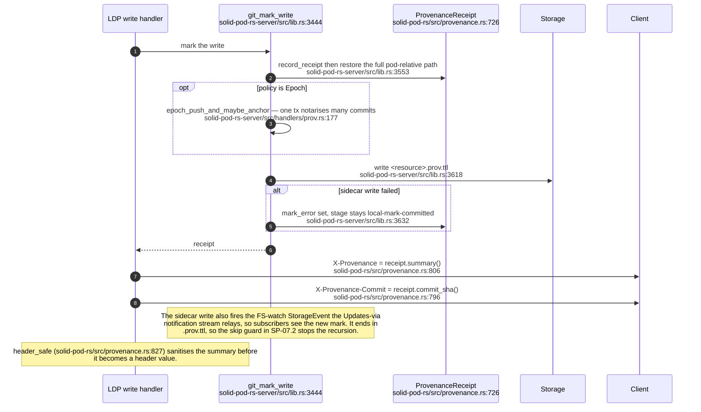
```mermaid
sequenceDiagram
    autonumber
    participant H as LDP write handler
    participant G as git_mark_write<br/>solid-pod-rs-server/src/lib.rs:3444
    participant R as ProvenanceReceipt<br/>solid-pod-rs/src/provenance.rs:726
    participant S as Storage
    participant C as Client

    H->>G: mark the write
    G->>R: record_receipt then restore the full pod-relative path<br/>solid-pod-rs-server/src/lib.rs:3553
    opt policy is Epoch
        G->>G: epoch_push_and_maybe_anchor — one tx notarises many commits<br/>solid-pod-rs-server/src/handlers/prov.rs:177
    end
    G->>S: write <resource>.prov.ttl<br/>solid-pod-rs-server/src/lib.rs:3618
    alt sidecar write failed
        G->>R: mark_error set, stage stays local-mark-committed<br/>solid-pod-rs-server/src/lib.rs:3632
    end
    G-->>H: receipt
    H->>C: X-Provenance = receipt.summary()<br/>solid-pod-rs/src/provenance.rs:806
    H->>C: X-Provenance-Commit = receipt.commit_sha()<br/>solid-pod-rs/src/provenance.rs:796
    Note over G: The sidecar write also fires the FS-watch StorageEvent the Updates-via<br/>notification stream relays, so subscribers see the new mark. It ends in<br/>.prov.ttl, so the skip guard in SP-07.2 stops the recursion.
    Note over H: header_safe (solid-pod-rs/src/provenance.rs:827) sanitises the summary before<br/>it becomes a header value.
```

## SP-07.6 The `_prov` query surface

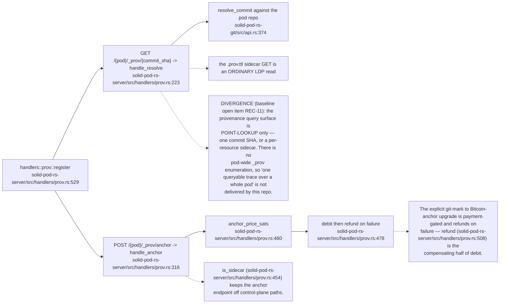
```mermaid
flowchart LR
    R1["GET /{pod}/_prov/{commit_sha} -> handle_resolve<br/>solid-pod-rs-server/src/handlers/prov.rs:223"]
    R2["POST /{pod}/_prov/anchor -> handle_anchor<br/>solid-pod-rs-server/src/handlers/prov.rs:316"]
    REG["handlers::prov::register<br/>solid-pod-rs-server/src/handlers/prov.rs:529"]
    RC["resolve_commit against the pod repo<br/>solid-pod-rs-git/src/api.rs:374"]
    PRICE["anchor_price_sats<br/>solid-pod-rs-server/src/handlers/prov.rs:460"]
    DEB["debit then refund on failure<br/>solid-pod-rs-server/src/handlers/prov.rs:478"]
    SIDE["the .prov.ttl sidecar GET is an ORDINARY LDP read"]

    REG --> R1 --> RC
    REG --> R2 --> PRICE --> DEB
    R1 -.-> SIDE

    N["DIVERGENCE (baseline open item REC-11): the provenance query surface is<br/>POINT-LOOKUP only — one commit SHA, or a per-resource sidecar. There is no<br/>pod-wide _prov enumeration, so 'one queryable trace over a whole pod' is not<br/>delivered by this repo."]
    R1 -.-> N
    N2["The explicit git-mark to Bitcoin-anchor upgrade is payment-gated and refunds on<br/>failure — refund (solid-pod-rs-server/src/handlers/prov.rs:508) is the<br/>compensating half of debit."]
    DEB -.-> N2
    N3["is_sidecar (solid-pod-rs-server/src/handlers/prov.rs:454) keeps the anchor<br/>endpoint off control-plane paths."]
    R2 -.-> N3
```

## SP-07.7 Epoch batching — one transaction, many commits

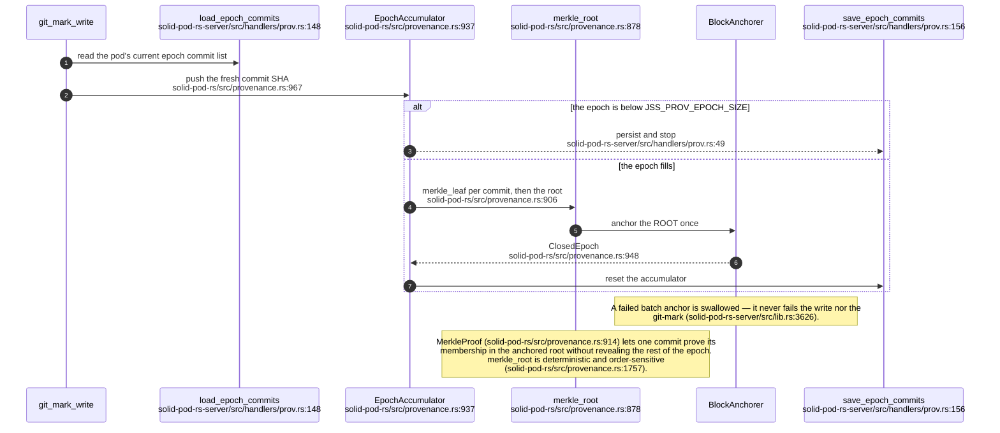
```mermaid
sequenceDiagram
    autonumber
    participant G as git_mark_write
    participant L as load_epoch_commits<br/>solid-pod-rs-server/src/handlers/prov.rs:148
    participant A as EpochAccumulator<br/>solid-pod-rs/src/provenance.rs:937
    participant M as merkle_root<br/>solid-pod-rs/src/provenance.rs:878
    participant AN as BlockAnchorer
    participant S as save_epoch_commits<br/>solid-pod-rs-server/src/handlers/prov.rs:156

    G->>L: read the pod's current epoch commit list
    G->>A: push the fresh commit SHA<br/>solid-pod-rs/src/provenance.rs:967
    alt the epoch is below JSS_PROV_EPOCH_SIZE
        A-->>S: persist and stop<br/>solid-pod-rs-server/src/handlers/prov.rs:49
    else the epoch fills
        A->>M: merkle_leaf per commit, then the root<br/>solid-pod-rs/src/provenance.rs:906
        M->>AN: anchor the ROOT once
        AN-->>A: ClosedEpoch<br/>solid-pod-rs/src/provenance.rs:948
        A->>S: reset the accumulator
    end
    Note over AN: A failed batch anchor is swallowed — it never fails the write nor the<br/>git-mark (solid-pod-rs-server/src/lib.rs:3626).
    Note over M: MerkleProof (solid-pod-rs/src/provenance.rs:914) lets one commit prove its<br/>membership in the anchored root without revealing the rest of the epoch.<br/>merkle_root is deterministic and order-sensitive<br/>(solid-pod-rs/src/provenance.rs:1757).
```

## SP-07.9 MRC20 state chain and Bitcoin anchoring

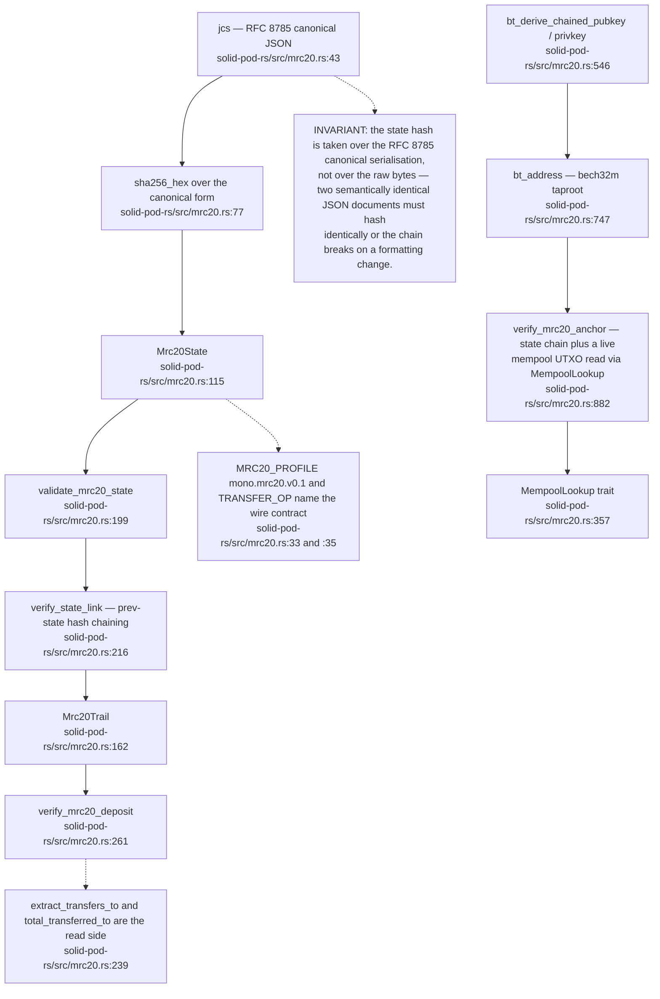
```mermaid
flowchart TD
    JCS["jcs — RFC 8785 canonical JSON<br/>solid-pod-rs/src/mrc20.rs:43"]
    SHA["sha256_hex over the canonical form<br/>solid-pod-rs/src/mrc20.rs:77"]
    ST["Mrc20State<br/>solid-pod-rs/src/mrc20.rs:115"]
    VAL["validate_mrc20_state<br/>solid-pod-rs/src/mrc20.rs:199"]
    LNK["verify_state_link — prev-state hash chaining<br/>solid-pod-rs/src/mrc20.rs:216"]
    TR["Mrc20Trail<br/>solid-pod-rs/src/mrc20.rs:162"]
    DEP["verify_mrc20_deposit<br/>solid-pod-rs/src/mrc20.rs:261"]
    KEY["bt_derive_chained_pubkey / privkey<br/>solid-pod-rs/src/mrc20.rs:546"]
    ADDR["bt_address — bech32m taproot<br/>solid-pod-rs/src/mrc20.rs:747"]
    VER["verify_mrc20_anchor — state chain plus a live<br/>mempool UTXO read via MempoolLookup<br/>solid-pod-rs/src/mrc20.rs:882"]
    ML["MempoolLookup trait<br/>solid-pod-rs/src/mrc20.rs:357"]

    JCS --> SHA --> ST --> VAL --> LNK --> TR
    TR --> DEP
    KEY --> ADDR --> VER --> ML

    N["INVARIANT: the state hash is taken over the RFC 8785 canonical serialisation,<br/>not over the raw bytes — two semantically identical JSON documents must hash<br/>identically or the chain breaks on a formatting change."]
    JCS -.-> N
    N2["MRC20_PROFILE mono.mrc20.v0.1 and TRANSFER_OP name the wire contract<br/>solid-pod-rs/src/mrc20.rs:33 and :35"]
    ST -.-> N2
    N3["extract_transfers_to and total_transferred_to are the read side<br/>solid-pod-rs/src/mrc20.rs:239"]
    DEP -.-> N3
```

## SP-07.10 The rust-bitcoin transaction builder (ADR-2008 D1, landed)

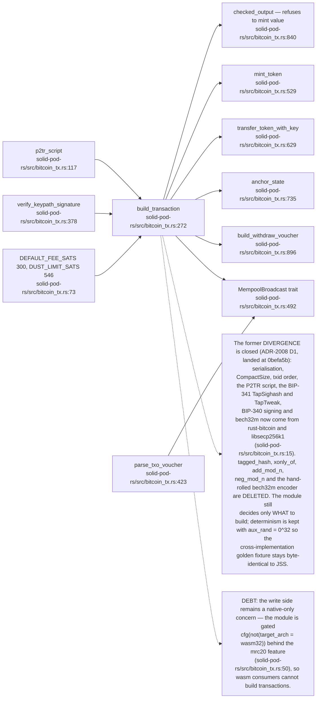
```mermaid
flowchart LR
    BLD["build_transaction<br/>solid-pod-rs/src/bitcoin_tx.rs:272"]
    P2TR["p2tr_script<br/>solid-pod-rs/src/bitcoin_tx.rs:117"]
    VS["verify_keypath_signature<br/>solid-pod-rs/src/bitcoin_tx.rs:378"]
    FEE["DEFAULT_FEE_SATS 300, DUST_LIMIT_SATS 546<br/>solid-pod-rs/src/bitcoin_tx.rs:73"]
    CO["checked_output — refuses to mint value<br/>solid-pod-rs/src/bitcoin_tx.rs:840"]
    MINT["mint_token<br/>solid-pod-rs/src/bitcoin_tx.rs:529"]
    XFER["transfer_token_with_key<br/>solid-pod-rs/src/bitcoin_tx.rs:629"]
    ANC["anchor_state<br/>solid-pod-rs/src/bitcoin_tx.rs:735"]
    VCH["build_withdraw_voucher<br/>solid-pod-rs/src/bitcoin_tx.rs:896"]
    TXO["parse_txo_voucher<br/>solid-pod-rs/src/bitcoin_tx.rs:423"]
    BC["MempoolBroadcast trait<br/>solid-pod-rs/src/bitcoin_tx.rs:492"]

    P2TR --> BLD --> CO
    BLD --> MINT
    BLD --> XFER
    BLD --> ANC
    BLD --> VCH
    BLD --> BC
    VS --> BLD
    FEE --> BLD
    TXO --> BC

    N["The former DIVERGENCE is closed (ADR-2008 D1, landed at 0befa5b): serialisation,<br/>CompactSize, txid order, the P2TR script, the BIP-341 TapSighash and TapTweak,<br/>BIP-340 signing and bech32m now come from rust-bitcoin and libsecp256k1<br/>(solid-pod-rs/src/bitcoin_tx.rs:15). tagged_hash, xonly_of, add_mod_n,<br/>neg_mod_n and the hand-rolled bech32m encoder are DELETED. The module still<br/>decides only WHAT to build; determinism is kept with aux_rand = 0^32 so the<br/>cross-implementation golden fixture stays byte-identical to JSS."]
    BLD -.-> N
    N2["DEBT: the write side remains a native-only concern — the module is gated<br/>cfg(not(target_arch = wasm32)) behind the mrc20 feature<br/>(solid-pod-rs/src/bitcoin_tx.rs:50), so wasm consumers cannot build transactions."]
    BLD -.-> N2
```

## SP-07.11 Mempool endpoint selection (ADR-2007)

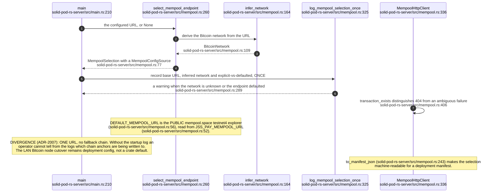
```mermaid
sequenceDiagram
    autonumber
    participant M as main<br/>solid-pod-rs-server/src/main.rs:210
    participant SEL as select_mempool_endpoint<br/>solid-pod-rs-server/src/mempool.rs:260
    participant INF as infer_network<br/>solid-pod-rs-server/src/mempool.rs:164
    participant LOG as log_mempool_selection_once<br/>solid-pod-rs-server/src/mempool.rs:325
    participant C as MempoolHttpClient<br/>solid-pod-rs-server/src/mempool.rs:336

    M->>SEL: the configured URL, or None
    SEL->>INF: derive the Bitcoin network from the URL
    INF-->>SEL: BitcoinNetwork<br/>solid-pod-rs-server/src/mempool.rs:109
    SEL-->>M: MempoolSelection with a MempoolConfigSource<br/>solid-pod-rs-server/src/mempool.rs:77
    M->>LOG: record base URL, inferred network and explicit-vs-defaulted, ONCE
    LOG-->>M: a warning when the network is unknown or the endpoint defaulted<br/>solid-pod-rs-server/src/mempool.rs:289
    C->>C: transaction_exists distinguishes 404 from an ambiguous failure<br/>solid-pod-rs-server/src/mempool.rs:406

    Note over SEL: DEFAULT_MEMPOOL_URL is the PUBLIC mempool.space testnet4 explorer<br/>(solid-pod-rs-server/src/mempool.rs:56), read from JSS_PAY_MEMPOOL_URL<br/>(solid-pod-rs-server/src/mempool.rs:52).
    Note over M: DIVERGENCE (ADR-2007): ONE URL, no fallback chain. Without the startup log an<br/>operator cannot tell from the logs which chain anchors are being written to.<br/>The LAN Bitcoin node cutover remains deployment config, not a crate default.
    Note over C: to_manifest_json (solid-pod-rs-server/src/mempool.rs:243) makes the selection<br/>machine-readable for a deployment manifest.
```

## SP-07.12 The block anchorer

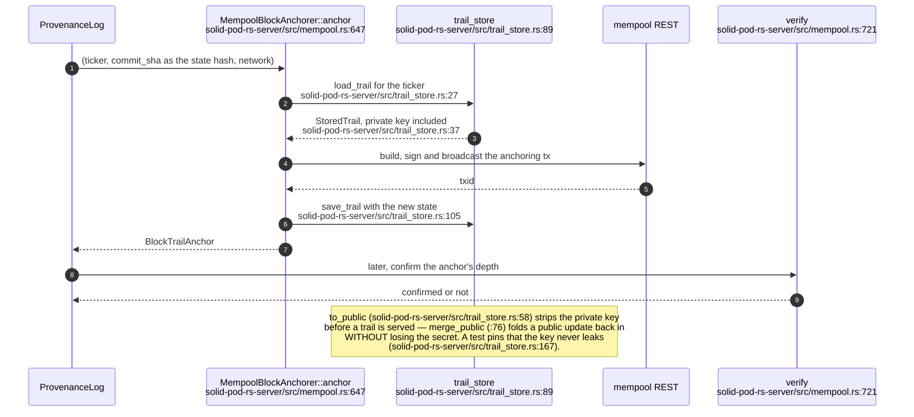
```mermaid
sequenceDiagram
    autonumber
    participant P as ProvenanceLog
    participant A as MempoolBlockAnchorer::anchor<br/>solid-pod-rs-server/src/mempool.rs:647
    participant TS as trail_store<br/>solid-pod-rs-server/src/trail_store.rs:89
    participant M as mempool REST
    participant V as verify<br/>solid-pod-rs-server/src/mempool.rs:721

    P->>A: (ticker, commit_sha as the state hash, network)
    A->>TS: load_trail for the ticker<br/>solid-pod-rs-server/src/trail_store.rs:27
    TS-->>A: StoredTrail, private key included<br/>solid-pod-rs-server/src/trail_store.rs:37
    A->>M: build, sign and broadcast the anchoring tx
    M-->>A: txid
    A->>TS: save_trail with the new state<br/>solid-pod-rs-server/src/trail_store.rs:105
    A-->>P: BlockTrailAnchor
    P->>V: later, confirm the anchor's depth
    V-->>P: confirmed or not

    Note over TS: to_public (solid-pod-rs-server/src/trail_store.rs:58) strips the private key<br/>before a trail is served — merge_public (:76) folds a public update back in<br/>WITHOUT losing the secret. A test pins that the key never leaks<br/>(solid-pod-rs-server/src/trail_store.rs:167).
```
- **Debt:** `load_trail` maps every storage read error to `Ok(None)` (`solid-pod-rs-server/src/trail_store.rs:93-99`), so a transient or permissions failure reads identically to "no trail exists yet" — a durability fault and a genuinely fresh ticker are indistinguishable to the anchorer.

## SP-07.13 The web ledger

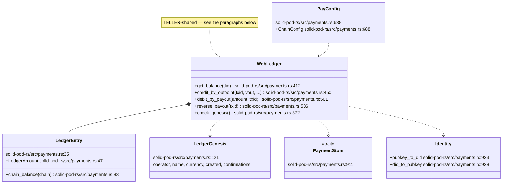
```mermaid
classDiagram
    direction TB
    class WebLedger {
        +get_balance(did)  solid-pod-rs/src/payments.rs:412
        +credit_by_outpoint(txid, vout, ...)  solid-pod-rs/src/payments.rs:450
        +debit_by_payout(amount, txid)  solid-pod-rs/src/payments.rs:501
        +reverse_payout(txid)  solid-pod-rs/src/payments.rs:536
        +check_genesis()  solid-pod-rs/src/payments.rs:372
    }
    class LedgerEntry {
        solid-pod-rs/src/payments.rs:35
        +LedgerAmount  solid-pod-rs/src/payments.rs:47
        +chain_balance(chain)  solid-pod-rs/src/payments.rs:83
    }
    class LedgerGenesis {
        solid-pod-rs/src/payments.rs:121
        operator, name, currency, created, confirmations
    }
    class PayConfig {
        solid-pod-rs/src/payments.rs:638
        +ChainConfig  solid-pod-rs/src/payments.rs:688
    }
    class PaymentStore {
        <<trait>>
        solid-pod-rs/src/payments.rs:911
    }
    class Identity {
        +pubkey_to_did  solid-pod-rs/src/payments.rs:923
        +did_to_pubkey  solid-pod-rs/src/payments.rs:928
    }
    WebLedger *-- LedgerEntry
    WebLedger ..> LedgerGenesis
    WebLedger ..> PaymentStore
    PayConfig ..> WebLedger
    WebLedger ..> Identity
    note for WebLedger "TELLER-shaped — see the paragraphs below"
```
- **What it shows:** the ledger is TELLER-shaped (solidpayorg/teller parity): a fresh ledger is born with a genesis whose identity is `sha256(JCS(genesis))`, and `check_genesis` (`solid-pod-rs/src/payments.rs:372`) refuses a document whose hash is not the hash of its genesis. The only credit is `credit_by_outpoint` — the deposit's outpoint is the receipt, and a second credit for a recorded outpoint is a no-op (`ReceiptOutcome::AlreadyApplied`, `solid-pod-rs/src/payments.rs:450`). Debits are recorded as payout receipts; `reverse_payout` (`:536`) undoes a payout whose transaction never reached the chain. ADR-2008 D4/D5 (chain-derived view, credit/debit removal) are NOT built — this is still a stored number. `payment_required_body` (`solid-pod-rs/src/payments.rs:738`) is the HTTP-402 body; `pay_info` (`:751`) backs GET /pay/.info.

## SP-07.14 The `/pay/*` route family

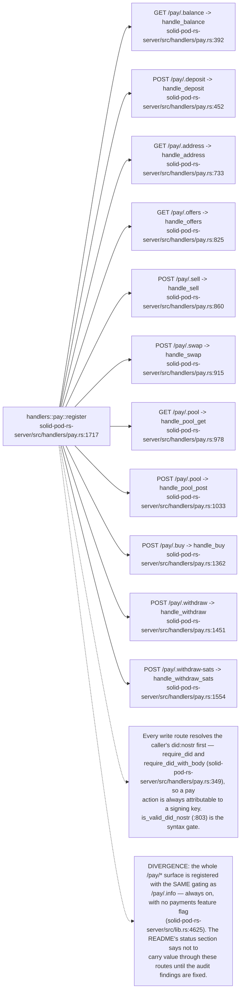
```mermaid
flowchart LR
    REG["handlers::pay::register<br/>solid-pod-rs-server/src/handlers/pay.rs:1717"]
    BAL["GET /pay/.balance -> handle_balance<br/>solid-pod-rs-server/src/handlers/pay.rs:392"]
    DEP["POST /pay/.deposit -> handle_deposit<br/>solid-pod-rs-server/src/handlers/pay.rs:452"]
    ADDR["GET /pay/.address -> handle_address<br/>solid-pod-rs-server/src/handlers/pay.rs:733"]
    OFF["GET /pay/.offers -> handle_offers<br/>solid-pod-rs-server/src/handlers/pay.rs:825"]
    SELL["POST /pay/.sell -> handle_sell<br/>solid-pod-rs-server/src/handlers/pay.rs:860"]
    SWAP["POST /pay/.swap -> handle_swap<br/>solid-pod-rs-server/src/handlers/pay.rs:915"]
    POOLG["GET /pay/.pool -> handle_pool_get<br/>solid-pod-rs-server/src/handlers/pay.rs:978"]
    POOLP["POST /pay/.pool -> handle_pool_post<br/>solid-pod-rs-server/src/handlers/pay.rs:1033"]
    BUY["POST /pay/.buy -> handle_buy<br/>solid-pod-rs-server/src/handlers/pay.rs:1362"]
    WD["POST /pay/.withdraw -> handle_withdraw<br/>solid-pod-rs-server/src/handlers/pay.rs:1451"]
    WDS["POST /pay/.withdraw-sats -> handle_withdraw_sats<br/>solid-pod-rs-server/src/handlers/pay.rs:1554"]

    REG --> BAL
    REG --> DEP
    REG --> ADDR
    REG --> OFF
    REG --> SELL
    REG --> SWAP
    REG --> POOLG
    REG --> POOLP
    REG --> BUY
    REG --> WD
    REG --> WDS

    N["Every write route resolves the caller's did:nostr first — require_did and<br/>require_did_with_body (solid-pod-rs-server/src/handlers/pay.rs:349), so a pay<br/>action is always attributable to a signing key.<br/>is_valid_did_nostr (:803) is the syntax gate."]
    REG -.-> N
    N2["DIVERGENCE: the whole /pay/* surface is registered with the SAME gating as<br/>/pay/.info — always on, with no payments feature flag<br/>(solid-pod-rs-server/src/lib.rs:4625). The README's status section says not to<br/>carry value through these routes until the audit findings are fixed."]
    REG -.-> N2
```

## SP-07.15 Payment-state atomicity

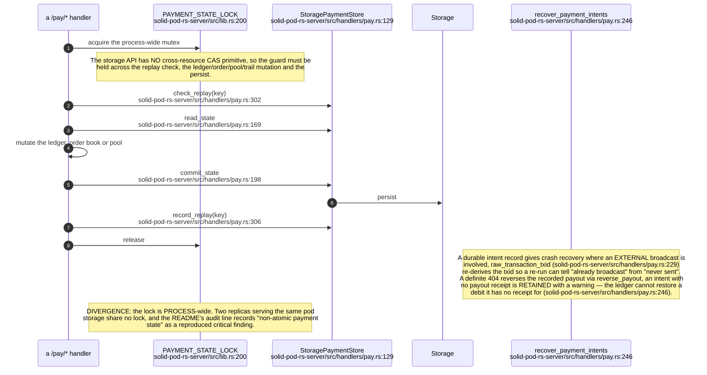
```mermaid
sequenceDiagram
    autonumber
    participant H as a /pay/* handler
    participant L as PAYMENT_STATE_LOCK<br/>solid-pod-rs-server/src/lib.rs:200
    participant PS as StoragePaymentStore<br/>solid-pod-rs-server/src/handlers/pay.rs:129
    participant S as Storage
    participant RC as recover_payment_intents<br/>solid-pod-rs-server/src/handlers/pay.rs:246

    H->>L: acquire the process-wide mutex
    Note over L: The storage API has NO cross-resource CAS primitive, so the guard must be<br/>held across the replay check, the ledger/order/pool/trail mutation and the<br/>persist.
    H->>PS: check_replay(key)<br/>solid-pod-rs-server/src/handlers/pay.rs:302
    H->>PS: read_state<br/>solid-pod-rs-server/src/handlers/pay.rs:169
    H->>H: mutate the ledger, order book or pool
    H->>PS: commit_state<br/>solid-pod-rs-server/src/handlers/pay.rs:198
    PS->>S: persist
    H->>PS: record_replay(key)<br/>solid-pod-rs-server/src/handlers/pay.rs:306
    H->>L: release

    Note over RC: A durable intent record gives crash recovery where an EXTERNAL broadcast is<br/>involved, raw_transaction_txid (solid-pod-rs-server/src/handlers/pay.rs:229)<br/>re-derives the txid so a re-run can tell "already broadcast" from "never sent".<br/>A definite 404 reverses the recorded payout via reverse_payout, an intent with<br/>no payout receipt is RETAINED with a warning — the ledger cannot restore a<br/>debit it has no receipt for (solid-pod-rs-server/src/handlers/pay.rs:246).
    Note over L: DIVERGENCE: the lock is PROCESS-wide. Two replicas serving the same pod<br/>storage share no lock, and the README's audit line records "non-atomic payment<br/>state" as a reproduced critical finding.
```

## SP-07.16 Order book and AMM

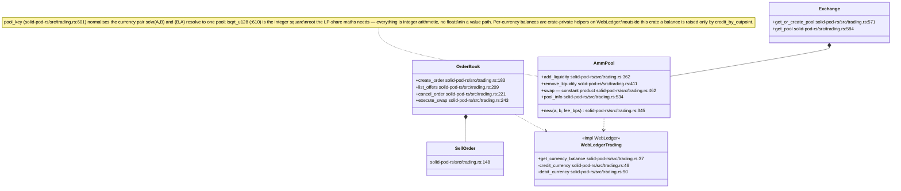
```mermaid
classDiagram
    class OrderBook {
        +create_order  solid-pod-rs/src/trading.rs:183
        +list_offers  solid-pod-rs/src/trading.rs:209
        +cancel_order  solid-pod-rs/src/trading.rs:221
        +execute_swap  solid-pod-rs/src/trading.rs:243
    }
    class SellOrder {
        solid-pod-rs/src/trading.rs:148
    }
    class AmmPool {
        +new(a, b, fee_bps)  solid-pod-rs/src/trading.rs:345
        +add_liquidity  solid-pod-rs/src/trading.rs:362
        +remove_liquidity  solid-pod-rs/src/trading.rs:411
        +swap — constant product  solid-pod-rs/src/trading.rs:462
        +pool_info  solid-pod-rs/src/trading.rs:534
    }
    class Exchange {
        +get_or_create_pool  solid-pod-rs/src/trading.rs:571
        +get_pool  solid-pod-rs/src/trading.rs:584
    }
    class WebLedgerTrading {
        <<impl WebLedger>>
        +get_currency_balance  solid-pod-rs/src/trading.rs:37
        -credit_currency  solid-pod-rs/src/trading.rs:46
        -debit_currency  solid-pod-rs/src/trading.rs:90
    }
    Exchange *-- AmmPool
    OrderBook *-- SellOrder
    OrderBook ..> WebLedgerTrading
    AmmPool ..> WebLedgerTrading
    note for AmmPool "pool_key (solid-pod-rs/src/trading.rs:601) normalises the currency pair so\n(A,B) and (B,A) resolve to one pool; isqrt_u128 (:610) is the integer square\nroot the LP-share maths needs — everything is integer arithmetic, no floats\nin a value path. Per-currency balances are crate-private helpers on WebLedger:\noutside this crate a balance is raised only by credit_by_outpoint."
```

## SP-07.17 Deposits are MRC20-only — the stand-in is deleted (ADR-2008 D6)

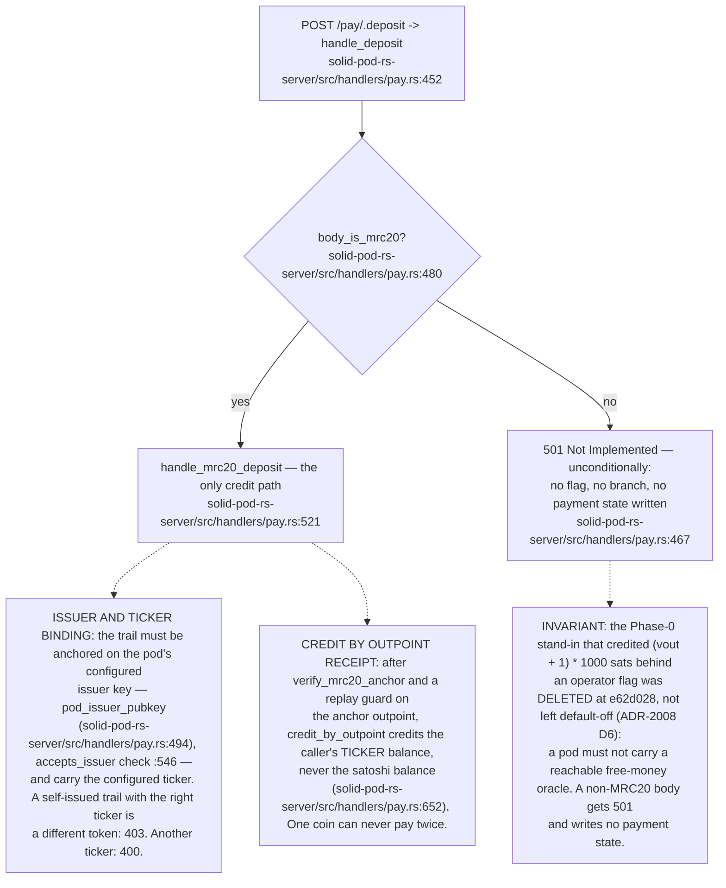
```mermaid
flowchart TD
    IN["POST /pay/.deposit -> handle_deposit<br/>solid-pod-rs-server/src/handlers/pay.rs:452"]
    SNIFF{"body_is_mrc20?<br/>solid-pod-rs-server/src/handlers/pay.rs:480"}
    MRC["handle_mrc20_deposit — the only credit path<br/>solid-pod-rs-server/src/handlers/pay.rs:521"]
    R501["501 Not Implemented — unconditionally:<br/>no flag, no branch, no payment state written<br/>solid-pod-rs-server/src/handlers/pay.rs:467"]

    IN --> SNIFF
    SNIFF -- yes --> MRC
    SNIFF -- no --> R501

    N["INVARIANT: the Phase-0 stand-in that credited (vout + 1) * 1000 sats behind<br/>an operator flag was DELETED at e62d028, not left default-off (ADR-2008 D6):<br/>a pod must not carry a reachable free-money oracle. A non-MRC20 body gets 501<br/>and writes no payment state."]
    R501 -.-> N
    N2["ISSUER AND TICKER BINDING: the trail must be anchored on the pod's configured<br/>issuer key — pod_issuer_pubkey<br/>(solid-pod-rs-server/src/handlers/pay.rs:494), accepts_issuer check :546 —<br/>and carry the configured ticker. A self-issued trail with the right ticker is<br/>a different token: 403. Another ticker: 400."]
    MRC -.-> N2
    N3["CREDIT BY OUTPOINT RECEIPT: after verify_mrc20_anchor and a replay guard on<br/>the anchor outpoint, credit_by_outpoint credits the caller's TICKER balance,<br/>never the satoshi balance<br/>(solid-pod-rs-server/src/handlers/pay.rs:652). One coin can never pay twice."]
    MRC -.-> N3
```

## SP-07.18 The ledger today, and the remaining chain-view work (ADR-2008, partial)

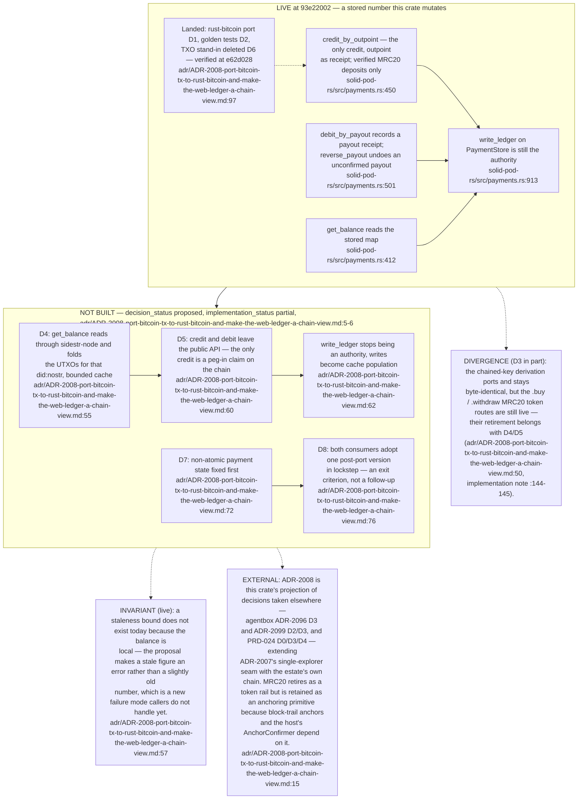
```mermaid
flowchart TB
    subgraph LIVE["LIVE at 93e22002 — a stored number this crate mutates"]
        GB["get_balance reads the stored map<br/>solid-pod-rs/src/payments.rs:412"]
        CR["credit_by_outpoint — the only credit, outpoint<br/>as receipt; verified MRC20 deposits only<br/>solid-pod-rs/src/payments.rs:450"]
        DB["debit_by_payout records a payout receipt;<br/>reverse_payout undoes an unconfirmed payout<br/>solid-pod-rs/src/payments.rs:501"]
        WL["write_ledger on PaymentStore is still the authority<br/>solid-pod-rs/src/payments.rs:913"]
        ST["Landed: rust-bitcoin port D1, golden tests D2,<br/>TXO stand-in deleted D6 — verified at e62d028<br/>adr/ADR-2008-port-bitcoin-tx-to-rust-bitcoin-and-make-the-web-ledger-a-chain-view.md:97"]
        ST -.-> CR
        CR --> WL
        DB --> WL
        GB --> WL
    end
    subgraph PROP["NOT BUILT — decision_status proposed, implementation_status partial,<br/>adr/ADR-2008-port-bitcoin-tx-to-rust-bitcoin-and-make-the-web-ledger-a-chain-view.md:5-6"]
        P1["D4: get_balance reads through sidestr-node and folds<br/>the UTXOs for that did:nostr, bounded cache<br/>adr/ADR-2008-port-bitcoin-tx-to-rust-bitcoin-and-make-the-web-ledger-a-chain-view.md:55"]
        P2["D5: credit and debit leave the public API — the only<br/>credit is a peg-in claim on the chain<br/>adr/ADR-2008-port-bitcoin-tx-to-rust-bitcoin-and-make-the-web-ledger-a-chain-view.md:60"]
        P3["write_ledger stops being an authority, writes<br/>become cache population<br/>adr/ADR-2008-port-bitcoin-tx-to-rust-bitcoin-and-make-the-web-ledger-a-chain-view.md:62"]
        P4["D7: non-atomic payment state fixed first<br/>adr/ADR-2008-port-bitcoin-tx-to-rust-bitcoin-and-make-the-web-ledger-a-chain-view.md:72"]
        P5["D8: both consumers adopt one post-port version<br/>in lockstep — an exit criterion, not a follow-up<br/>adr/ADR-2008-port-bitcoin-tx-to-rust-bitcoin-and-make-the-web-ledger-a-chain-view.md:76"]
        P1 --> P2 --> P3
        P4 --> P5
    end
    LIVE --> PROP

    N["INVARIANT (live): a staleness bound does not exist today because the balance is<br/>local — the proposal makes a stale figure an error rather than a slightly old<br/>number, which is a new failure mode callers do not handle yet.<br/>adr/ADR-2008-port-bitcoin-tx-to-rust-bitcoin-and-make-the-web-ledger-a-chain-view.md:57"]
    PROP -.-> N
    N2["EXTERNAL: ADR-2008 is this crate's projection of decisions taken elsewhere —<br/>agentbox ADR-2096 D3 and ADR-2099 D2/D3, and PRD-024 D0/D3/D4 — extending<br/>ADR-2007's single-explorer seam with the estate's own chain. MRC20 retires as a<br/>token rail but is retained as an anchoring primitive because block-trail anchors<br/>and the host's AnchorConfirmer depend on it.<br/>adr/ADR-2008-port-bitcoin-tx-to-rust-bitcoin-and-make-the-web-ledger-a-chain-view.md:15"]
    PROP -.-> N2
    N3["DIVERGENCE (D3 in part): the chained-key derivation ports and stays<br/>byte-identical, but the .buy / .withdraw MRC20 token routes are still live —<br/>their retirement belongs with D4/D5<br/>(adr/ADR-2008-port-bitcoin-tx-to-rust-bitcoin-and-make-the-web-ledger-a-chain-view.md:50,<br/>implementation note :144-145)."]
    LIVE -.-> N3
```
- **Tension (ADR-2008 vs code):** D3 declares MRC20 "retired as a token rail" (adr/ADR-2008-port-bitcoin-tx-to-rust-bitcoin-and-make-the-web-ledger-a-chain-view.md:50-52), yet `/pay/.buy` and `/pay/.withdraw` still execute token trades and withdrawals against the stored ledger (`solid-pod-rs-server/src/handlers/pay.rs:1362`, `:1451`) — the record itself concedes this is D3 "in part", pending D4/D5 (adr/ADR-2008-port-bitcoin-tx-to-rust-bitcoin-and-make-the-web-ledger-a-chain-view.md:98, :144-145).
- **Open:** the record makes fixing non-atomic payment state a precondition of the port (adr/ADR-2008-port-bitcoin-tx-to-rust-bitcoin-and-make-the-web-ledger-a-chain-view.md:72), but the lock it would have to replace is process-wide with no cross-resource CAS primitive behind it (`solid-pod-rs-server/src/lib.rs:200`) — nothing states what replaces it.
- **Invariant:** the PROPOSED half is drawn as not built; the record carries `decision_status: proposed` and `implementation_status: partial` (adr/ADR-2008-port-bitcoin-tx-to-rust-bitcoin-and-make-the-web-ledger-a-chain-view.md:5-6), and its Verification section states exactly what landed — "D1, D2 and D6 are built and verified at `e62d028`" while "D4, D5, D7 and D8 are not built" (adr/ADR-2008-port-bitcoin-tx-to-rust-bitcoin-and-make-the-web-ledger-a-chain-view.md:97-98).
