## SP-08.1 Solid Notifications 0.2 — the three channels

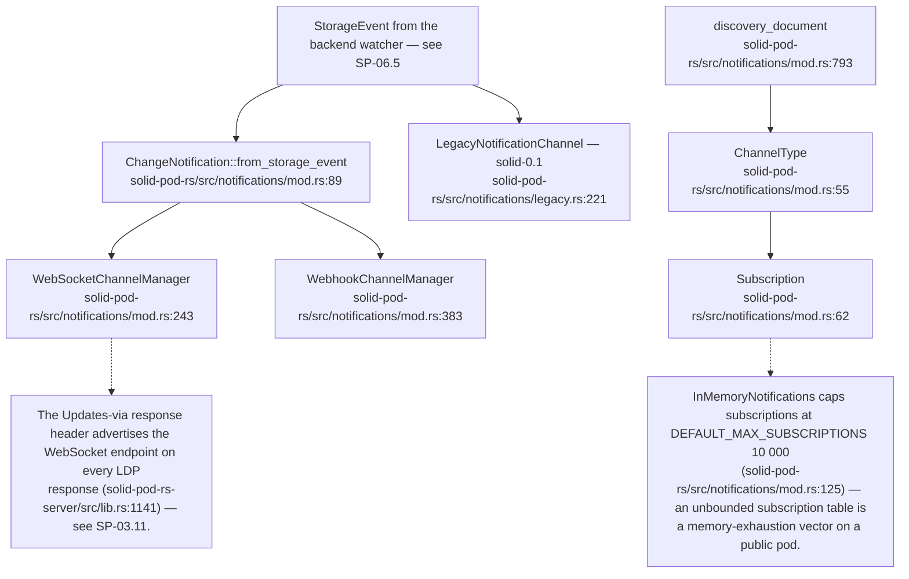

## SP-08.2 WebSocket notification pump

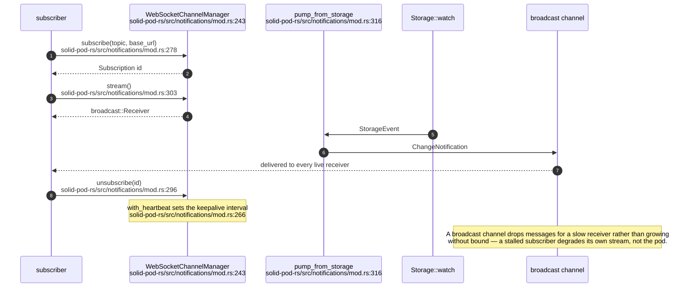

## SP-08.3 Webhook delivery — signing, retry and the circuit breaker

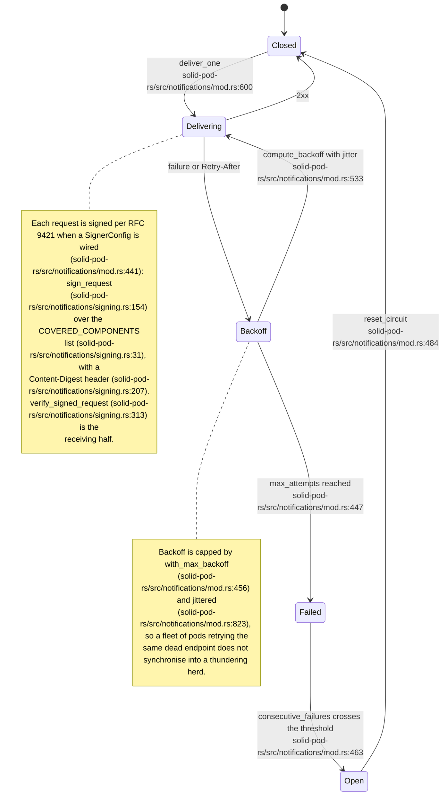

## SP-08.4 The legacy `solid-0.1` WebSocket adapter

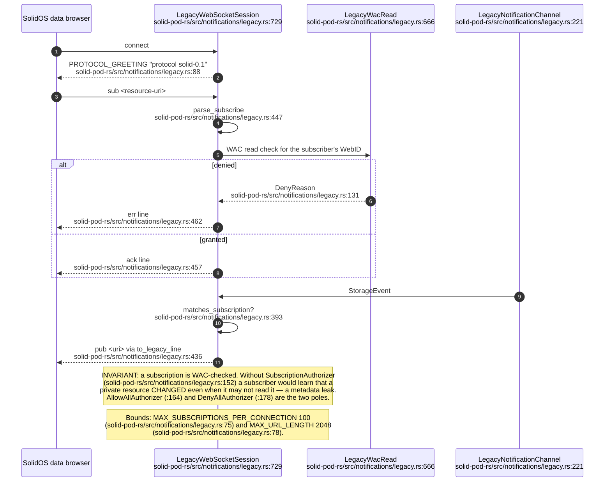

## SP-08.5 ActivityPub — actor and inbox

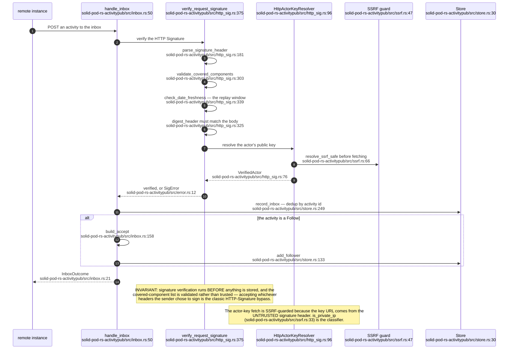

## SP-08.6 ActivityPub — outbox and delivery

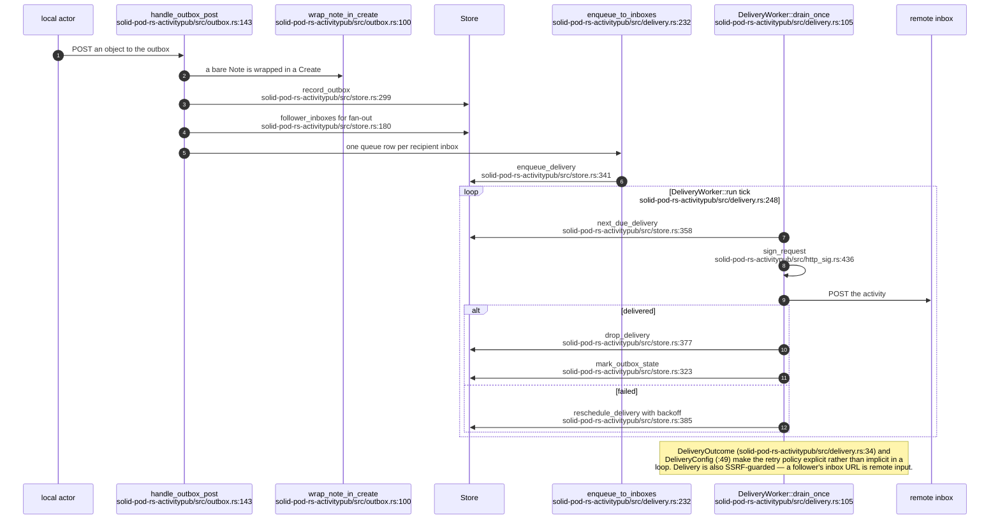

## SP-08.7 ActivityPub — actor documents, caching and NodeInfo

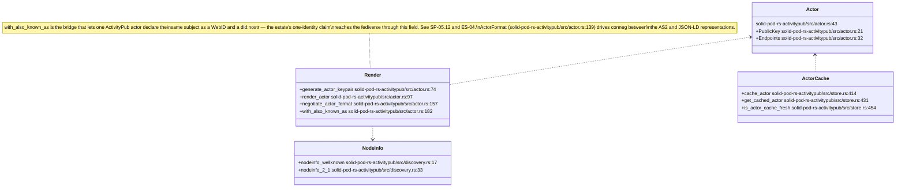

## SP-08.8 The embedded NIP-01 relay

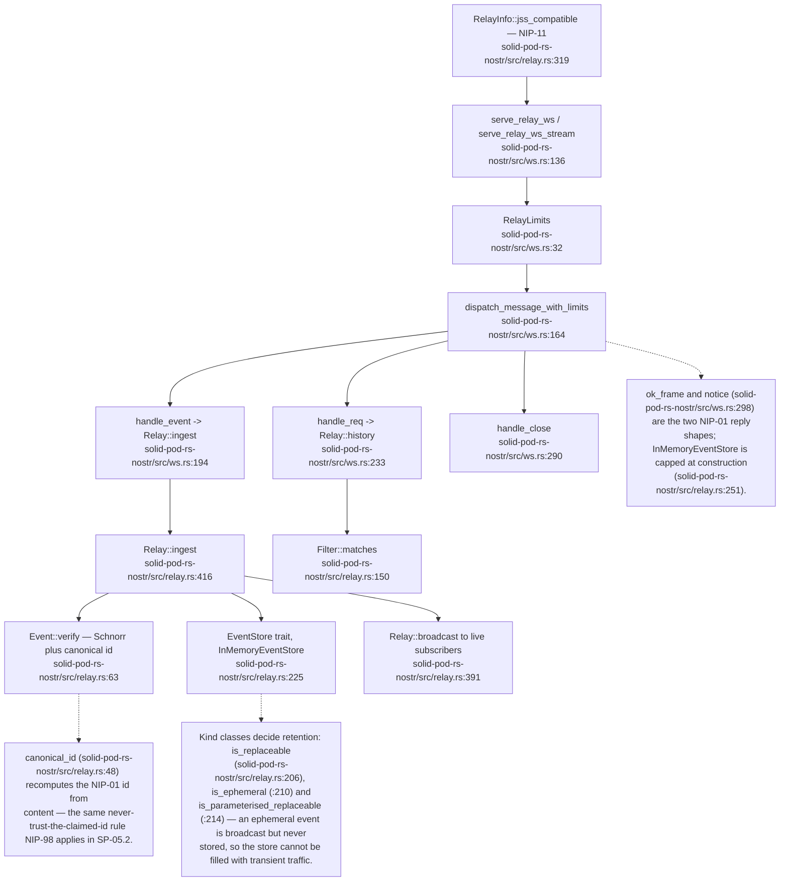

## SP-08.9 The relay typestate — verification cannot be skipped

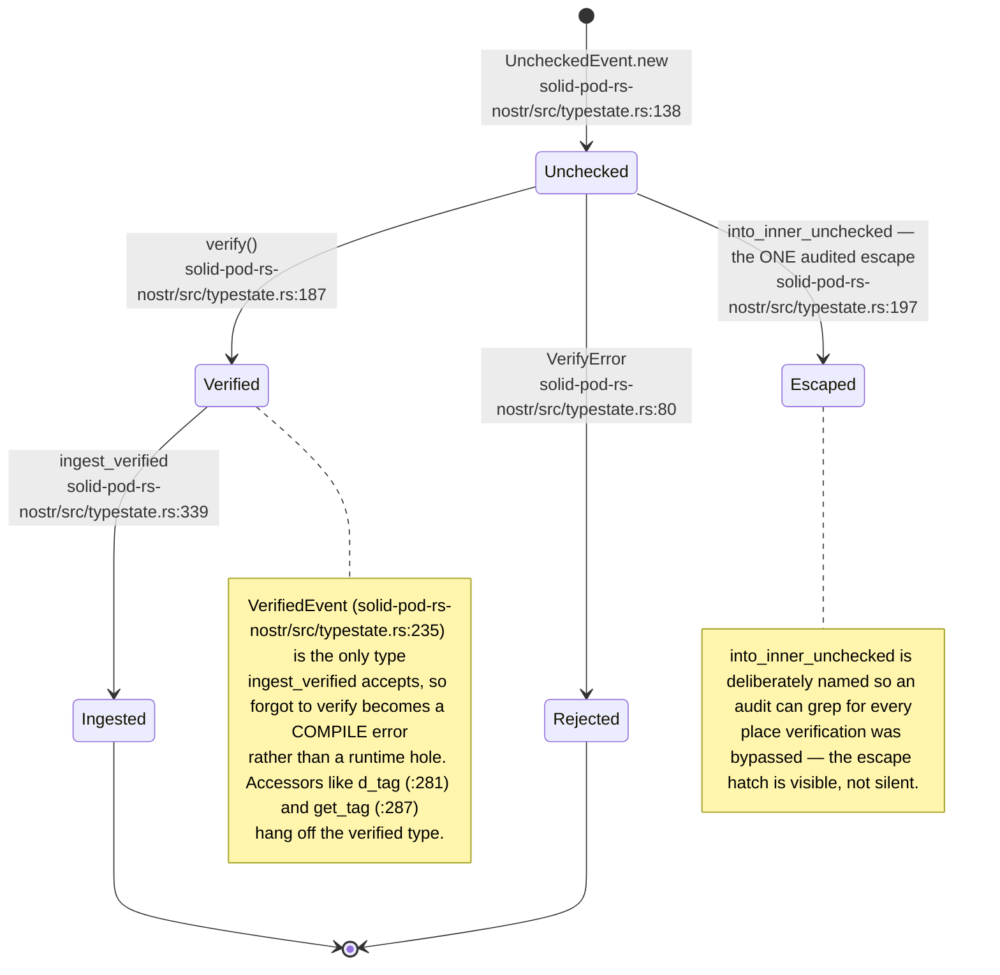

## SP-08.10 The forge — request dispatch

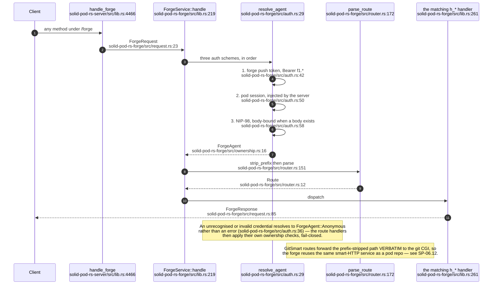

## SP-08.11 The forge push token

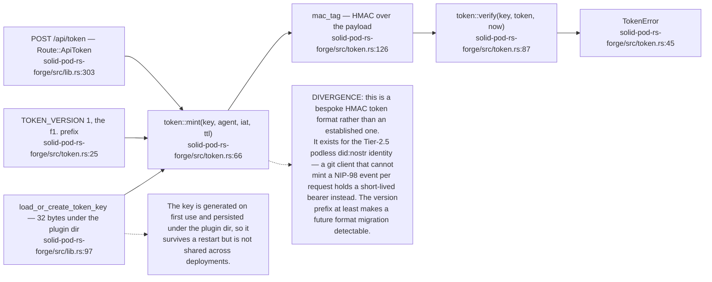

## SP-08.12 The forge ownership model

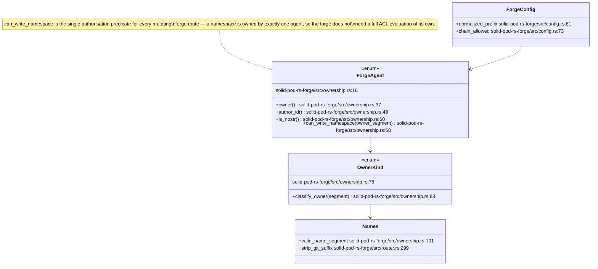

## SP-08.13 Forge repository browsing and the issue spine

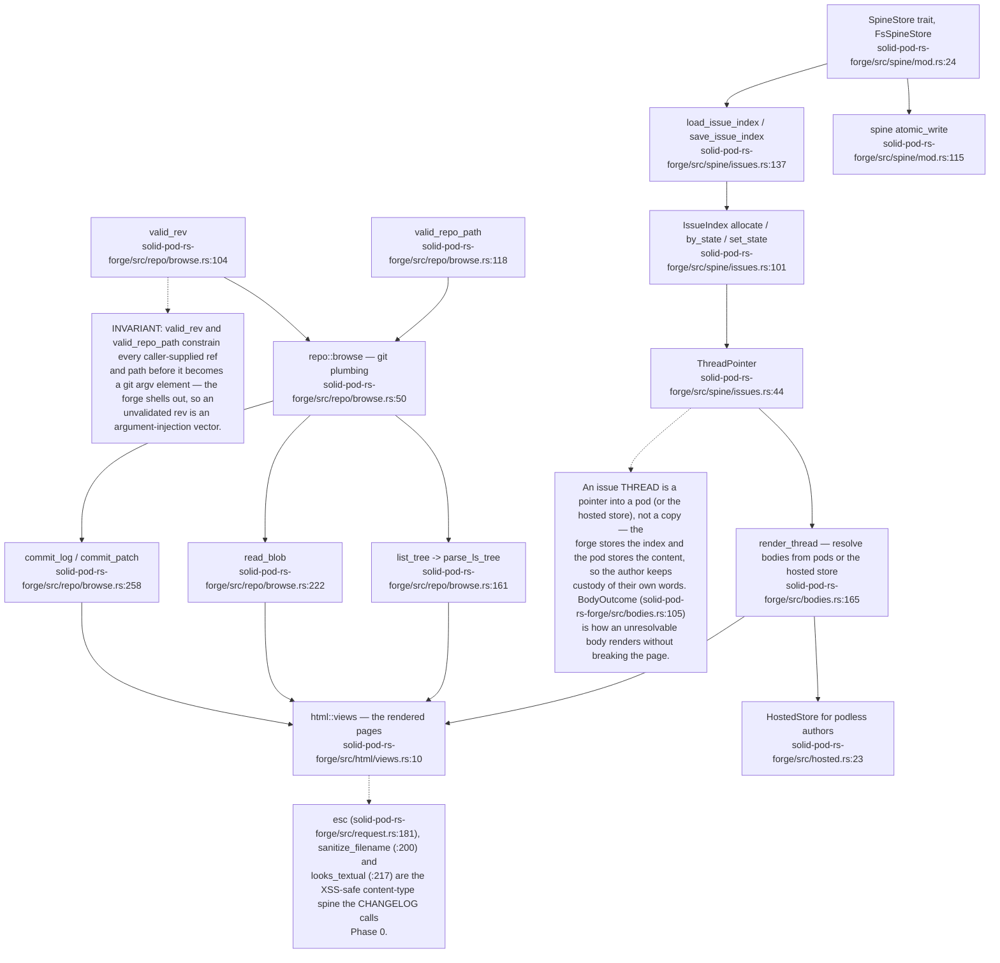

## SP-08.14 The pod as an MCP tool surface

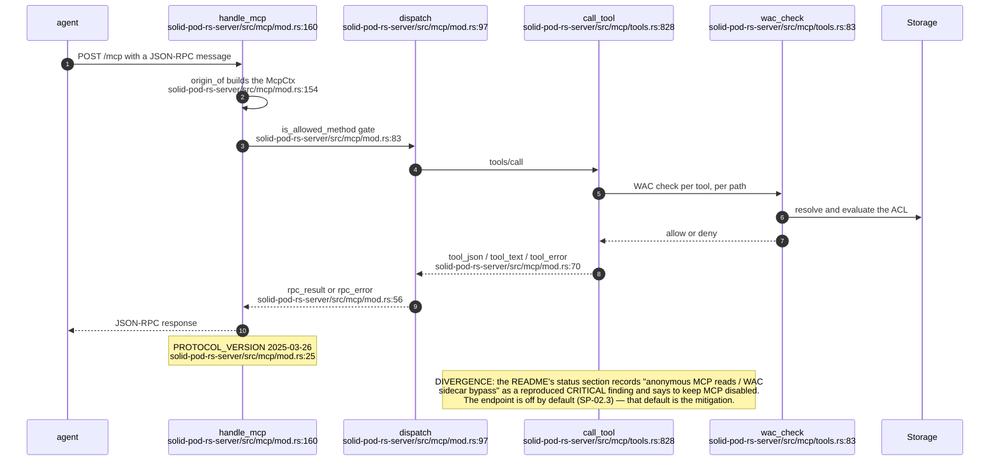

## SP-08.15 The MCP tool catalogue

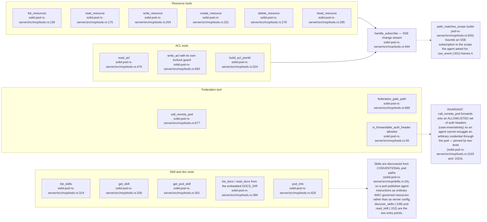

## SP-08.16 Estate consumers of these surfaces

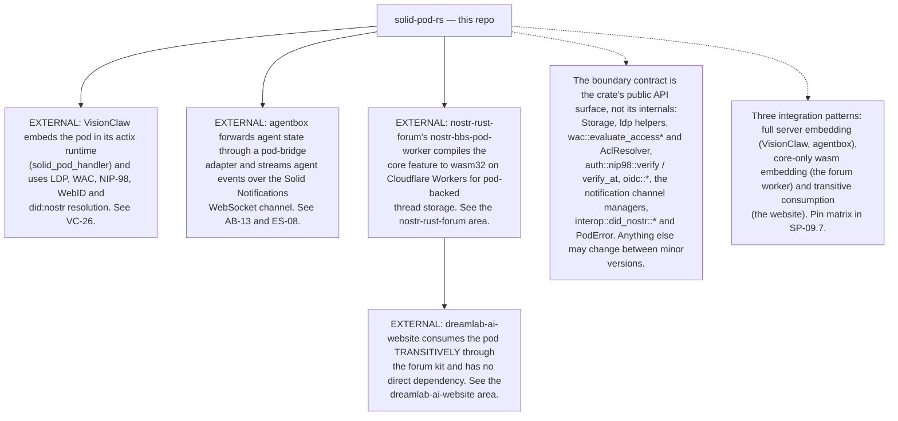

## SP-08.17 The legacy `solid-0.1` driver — the crate mounts nothing

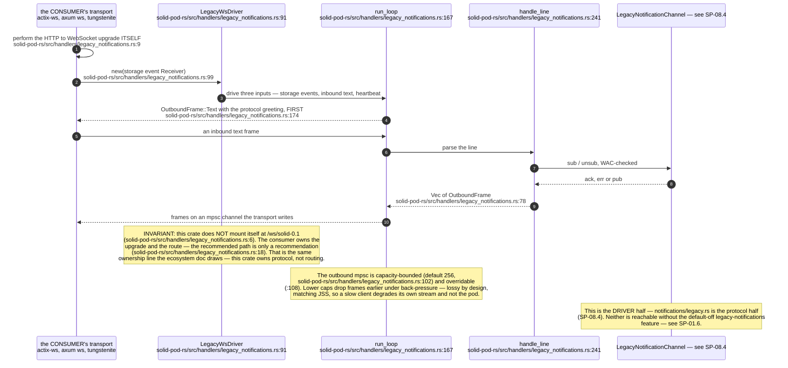
