## SP-09.1 CI triggers and the concurrency guard

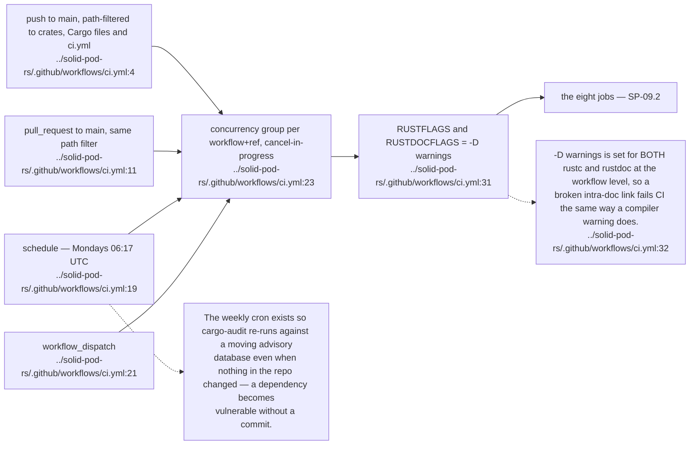

## SP-09.2 The eight CI jobs and the required-check aggregator

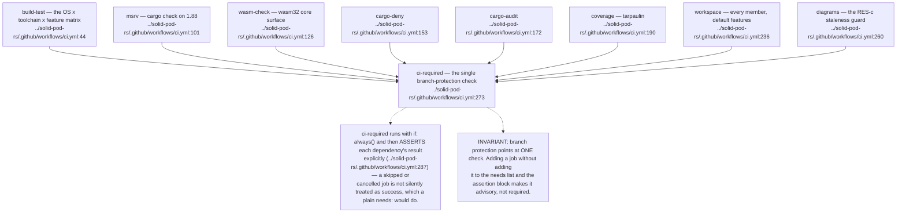

## SP-09.3 The build matrix

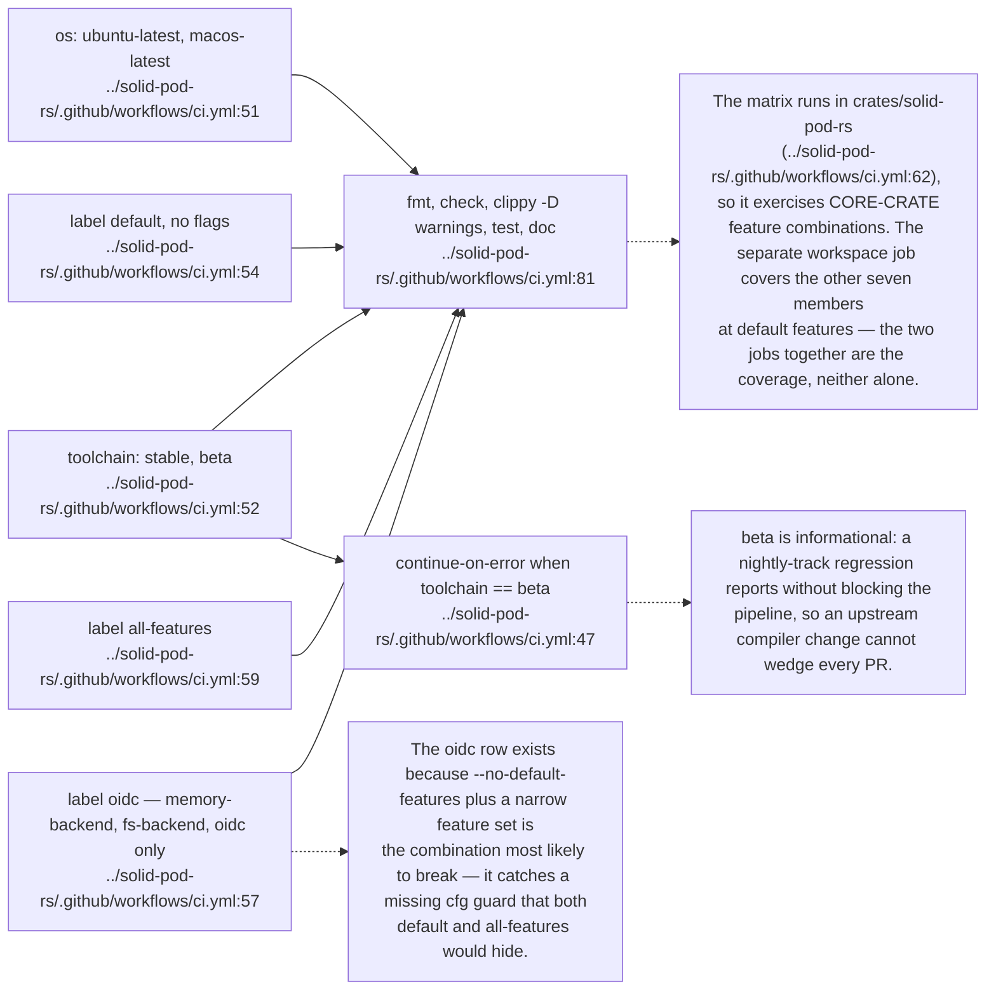

## SP-09.4 Supply-chain and quality gates

```mermaid
flowchart TD
    MSRV["cargo check --all-targets on toolchain 1.88<br/>../solid-pod-rs/.github/workflows/ci.yml:117"]
    WASM["cargo check --target wasm32-unknown-unknown<br/>--no-default-features --features core<br/>../solid-pod-rs/.github/workflows/ci.yml:144"]
    DENY["cargo-deny-action against the root deny.toml<br/>../solid-pod-rs/.github/workflows/ci.yml:161"]
    AUD["cargo audit --deny warnings, at the REPO ROOT<br/>../solid-pod-rs/.github/workflows/ci.yml:185"]
    COV["cargo tarpaulin --all-features --workspace --fail-under 60<br/>../solid-pod-rs/.github/workflows/ci.yml:213"]
    CC["Codecov upload, fail_ci_if_error false<br/>../solid-pod-rs/.github/workflows/ci.yml:220"]
    WSJ["cargo clippy --workspace and cargo test --workspace<br/>../solid-pod-rs/.github/workflows/ci.yml:236"]
    DIA["bash scripts/check-diagram-staleness.sh<br/>../solid-pod-rs/.github/workflows/ci.yml:268"]

    MSRV --> GATE["ci-required"]
    WASM --> GATE
    DENY --> GATE
    AUD --> GATE
    COV --> GATE
    WSJ --> GATE
    DIA --> GATE

    N["INVARIANT: the wasm job is the ONLY thing keeping the core feature genuinely<br/>no-IO. A stray tokio import behind core compiles fine on the host and fails only<br/>here — which is what protects the edge consumer in SP-01.4."]
    WASM -.-> N
    N2["cargo audit runs at the REPO ROOT deliberately, so the whole-workspace<br/>Cargo.lock is audited rather than the core crate's slice.<br/>../solid-pod-rs/.github/workflows/ci.yml:183"]
    AUD -.-> N2
    N3["The coverage GATE is tarpaulin's --fail-under; the Codecov upload is reporting<br/>only, so a missing CODECOV_TOKEN cannot mask a passing gate.<br/>../solid-pod-rs/.github/workflows/ci.yml:225"]
    CC -.-> N3
    N4["DIVERGENCE (README status, 2026-08-19): cargo audit --deny warnings FAILS on<br/>RUSTSEC-2026-0258 in both shipped HTTP/2 stacks. The gate is real and it is<br/>currently red."]
    AUD -.-> N4
```

## SP-09.5 The diagram staleness guard

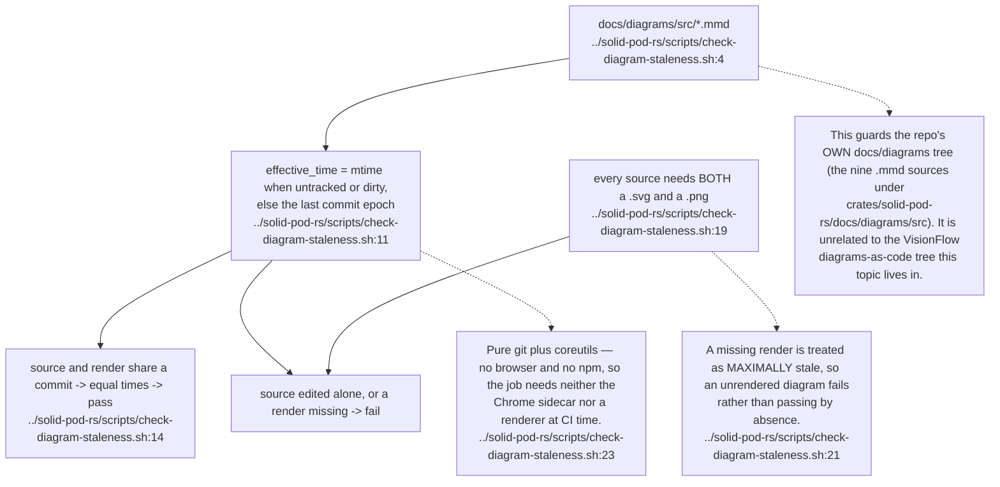

## SP-09.6 The release pipeline

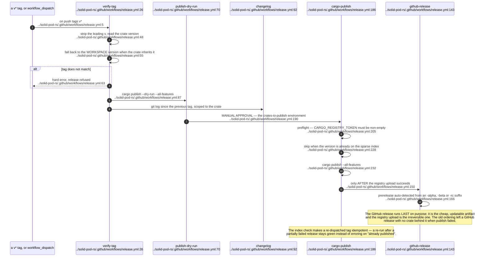

## SP-09.7 Version alignment and the consumer pin matrix

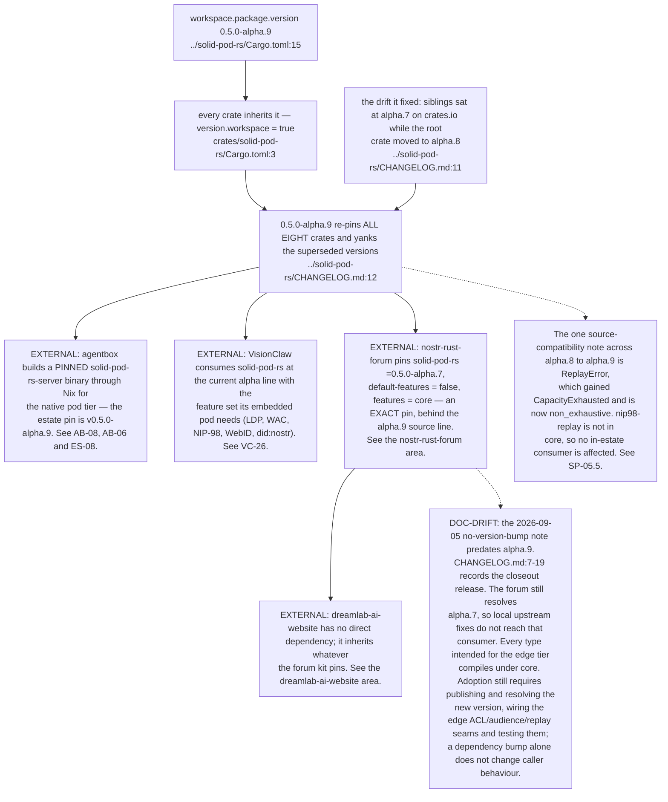

## SP-09.8 Release history and what each bump changed

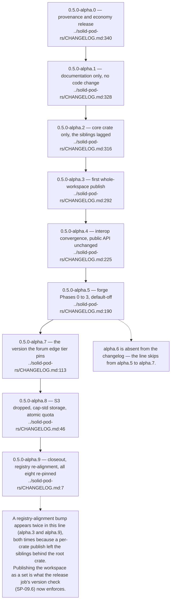

## SP-09.9 Repository governance and maintenance automation

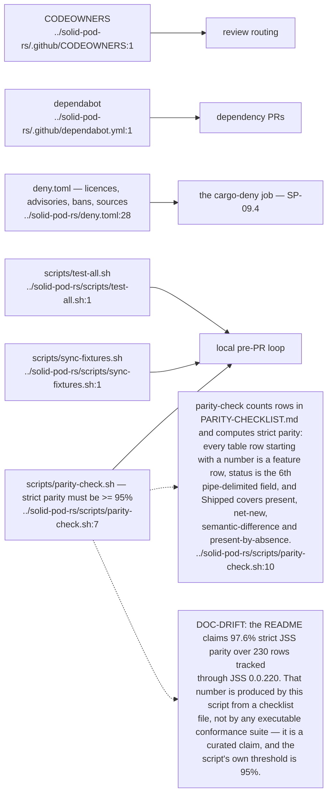

## SP-09.10 What CI does NOT gate

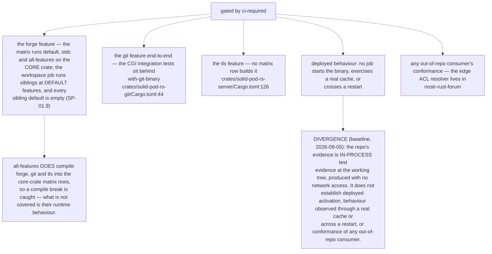

## SP-09.11 Benches and the fuzz target — the surfaces CI never runs

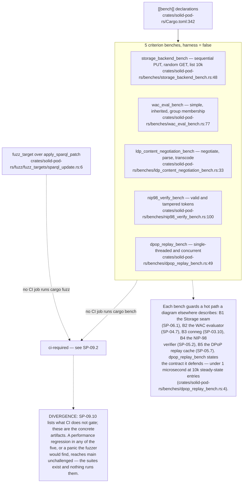

## SP-09.12 The SPARQL-Update fuzz contract

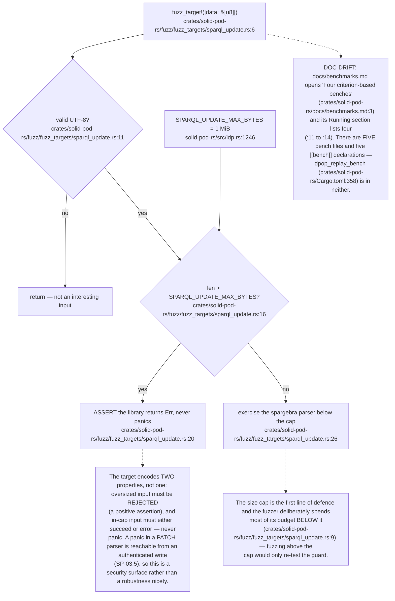
