## SP-10.1 The seven baseline invariants and where each lives in code

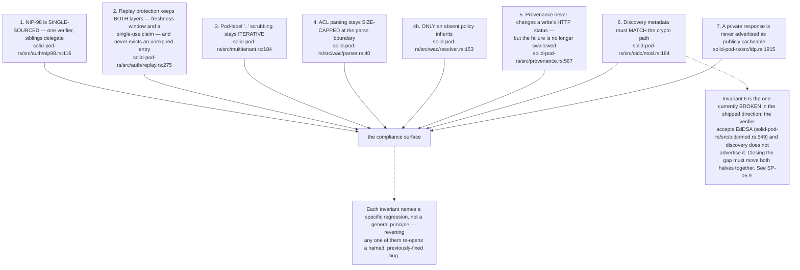

## SP-10.2 Fail-closed boundaries, in request order

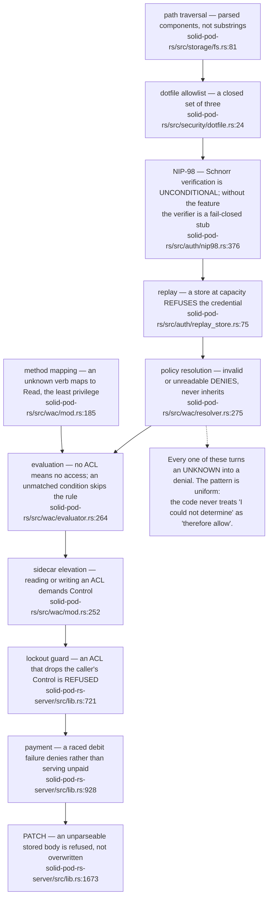

## SP-10.3 Where a partial failure is visible rather than swallowed

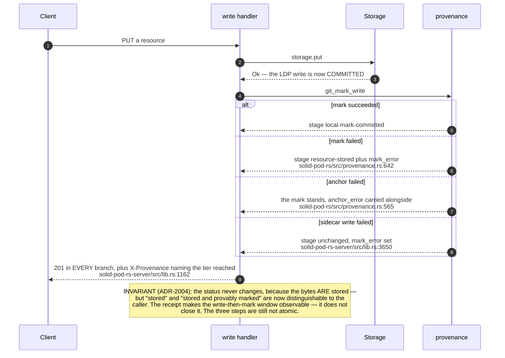

## SP-10.4 Windows that are open by construction

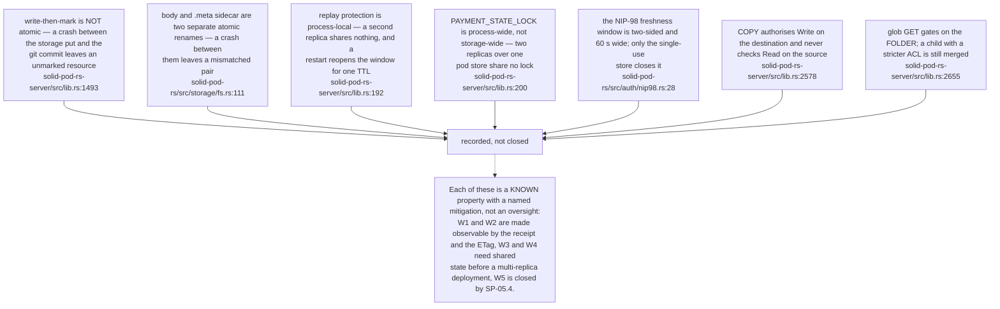

## SP-10.5 Default-off switches — the security posture of a bare binary

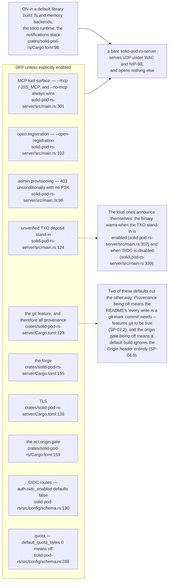

## SP-10.6 The DIVERGENCE register — governing-doc open items

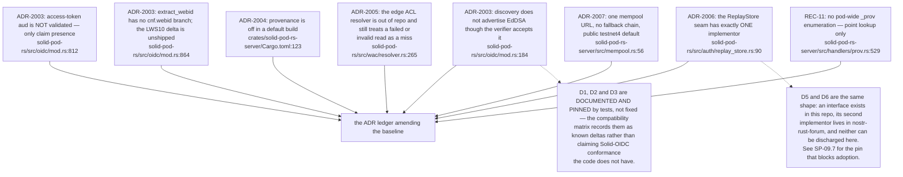

## SP-10.7 The DOC-DRIFT register

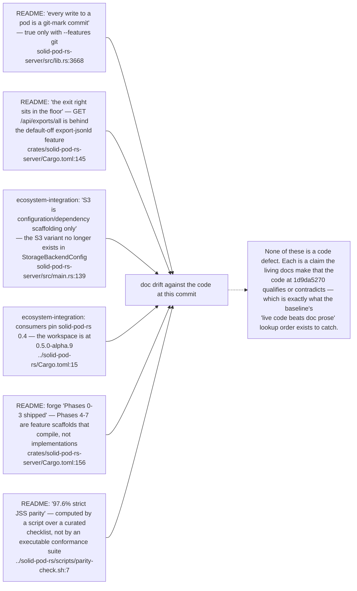

## SP-10.8 The audit findings the README itself records

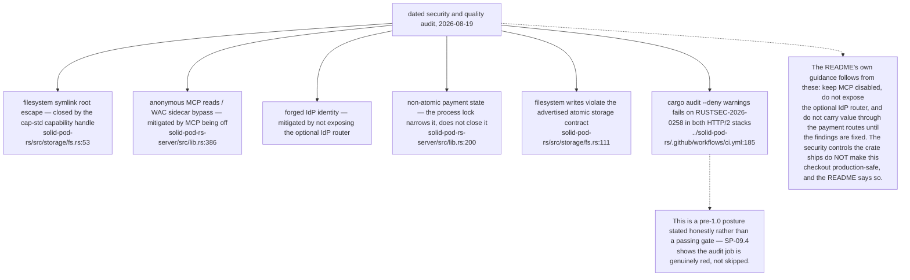

## SP-10.9 Error taxonomy and how a failure reaches the caller

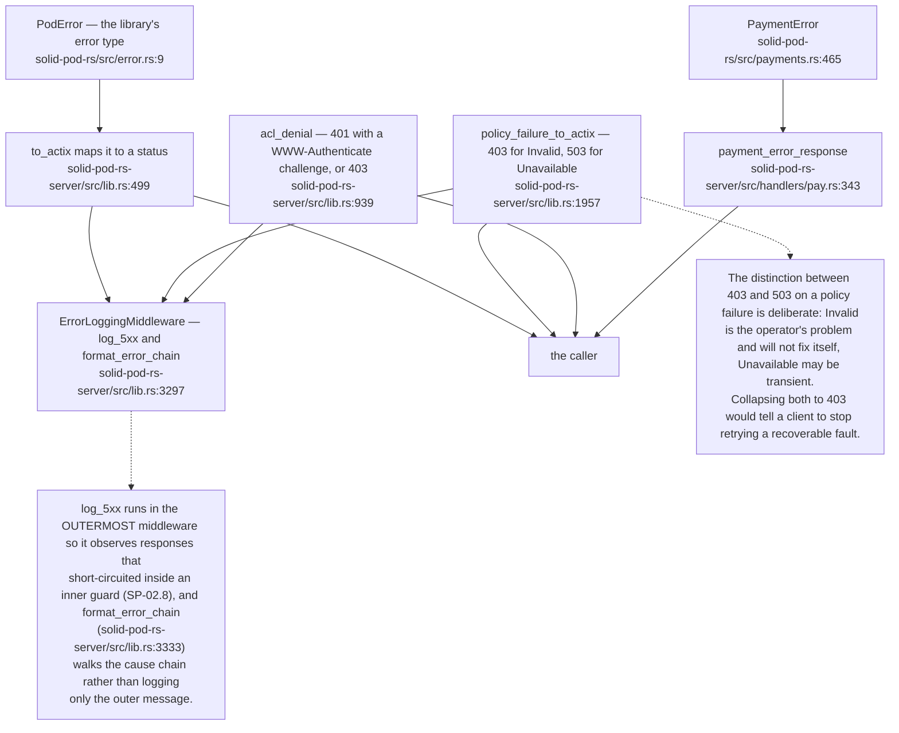

## SP-10.10 Denial-of-service bounds

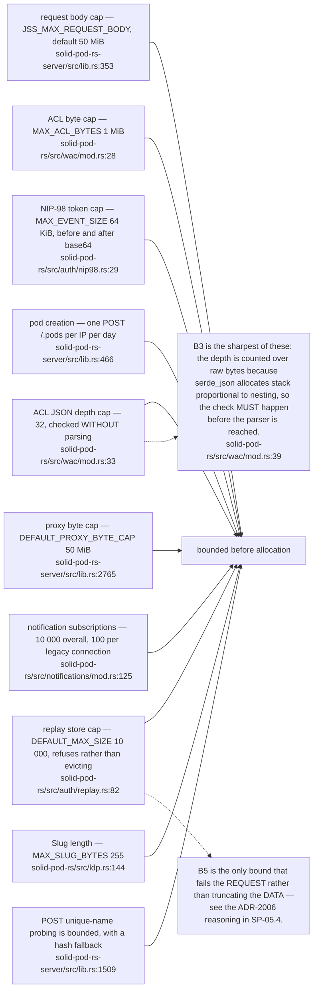

## SP-10.11 What a reviewer should re-check first after any change

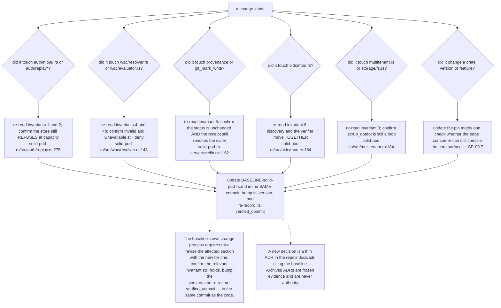

## SP-10.12 Observability — everything the pod emits

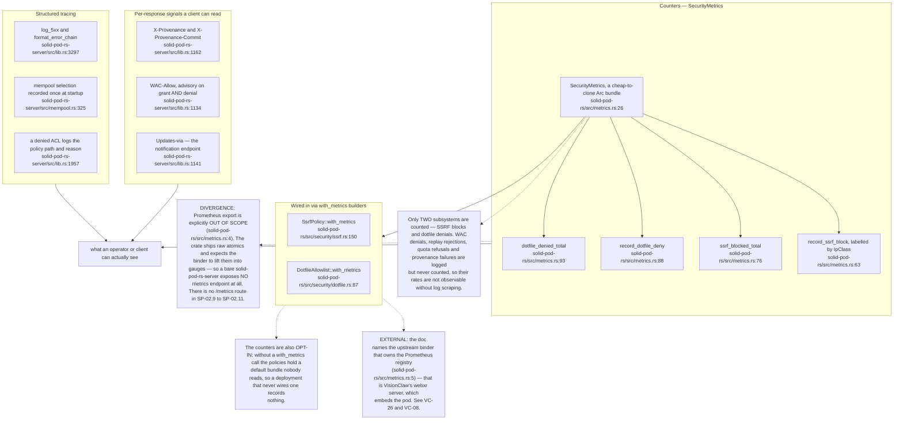
