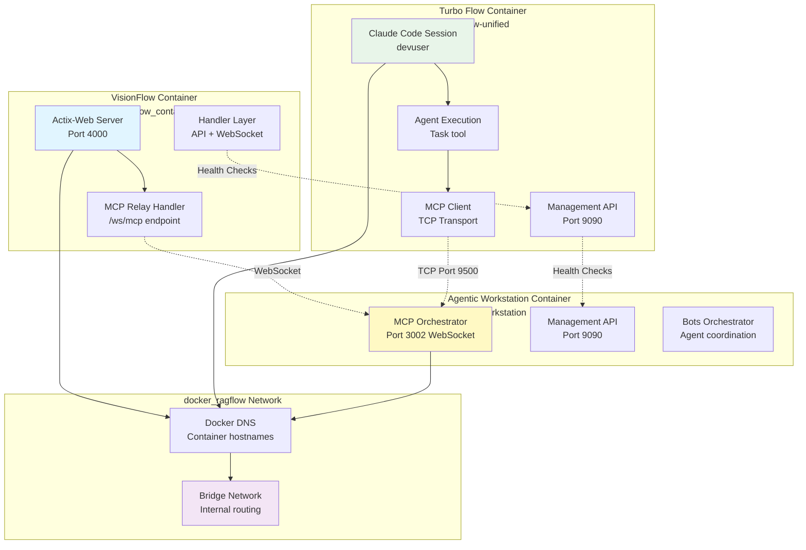
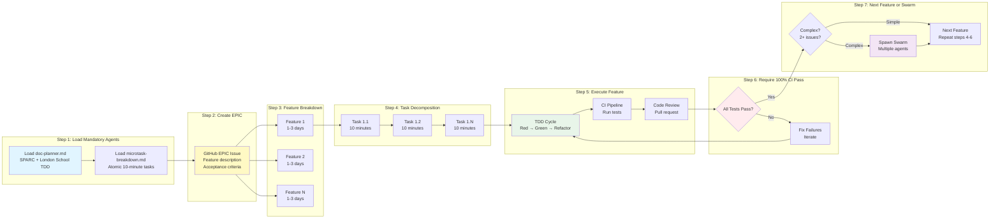
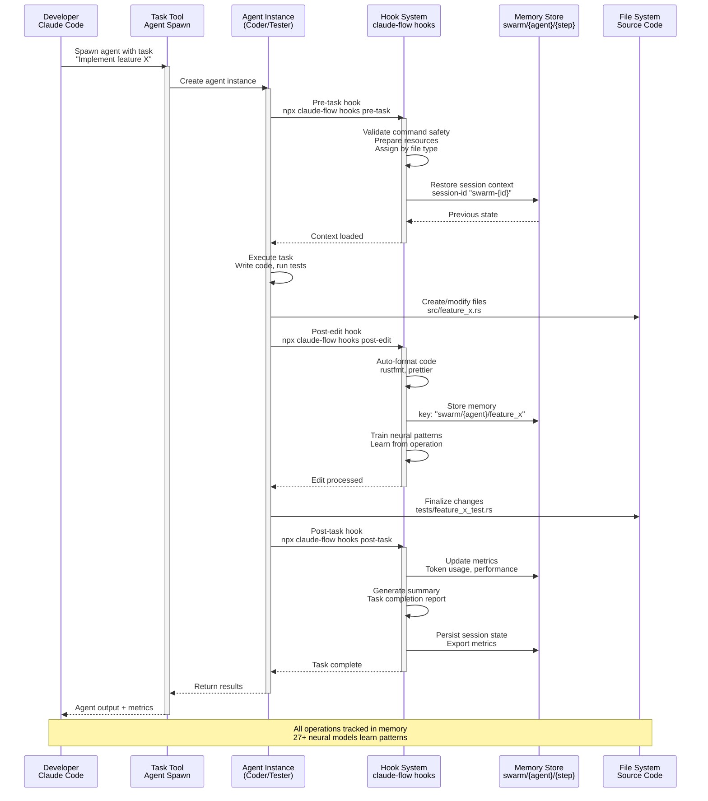
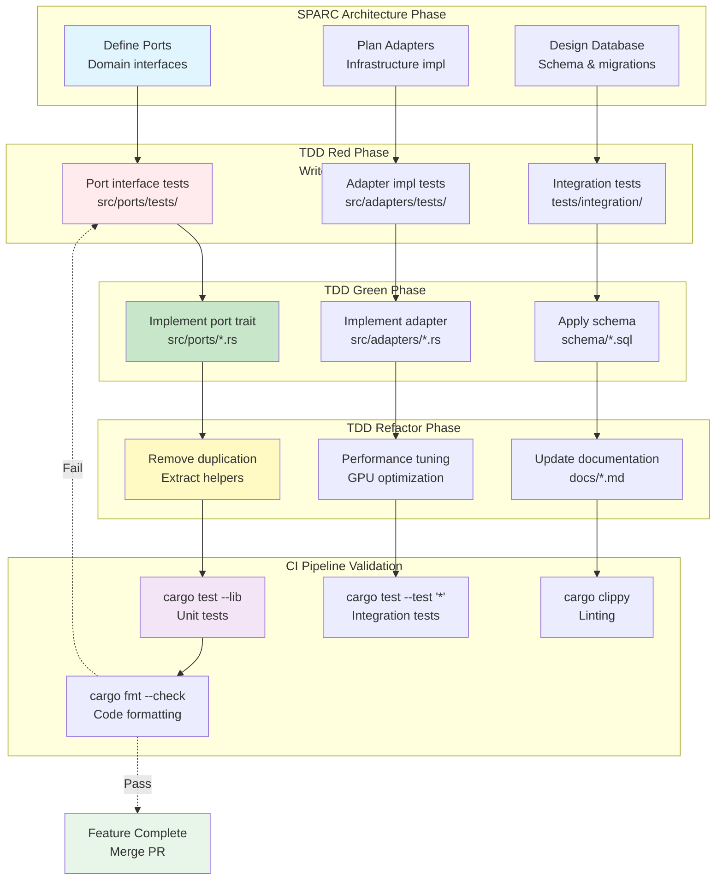
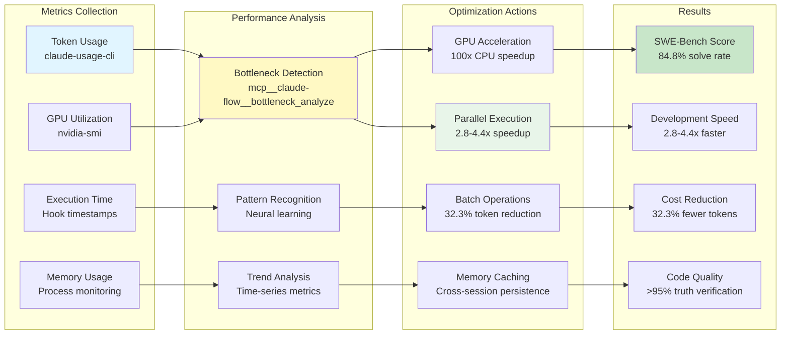

# SPARC Methodology & Turbo Flow Architecture

**Version:** 1.0.0
**Last Updated:** 2025-10-27
**Focus:** SPARC development workflow and Turbo Flow multi-agent integration

---

## 1. SPARC Development Workflow

```mermaid
flowchart TB
    subgraph "SPARC Phases<br/>Specification → Pseudocode → Architecture → Refinement → Completion"

        subgraph "Phase 1: Specification"
            SPEC_REQ[Requirements Analysis<br/>doc-planner.md agent]
            SPEC_BREAK[Microtask Breakdown<br/>10-minute atomic tasks]
            SPEC_EPIC[GitHub EPIC Issue<br/>Feature tracking]
        end

        subgraph "Phase 2: Pseudocode"
            PSEUDO_ALGO[Algorithm Design<br/>Language-agnostic logic]
            PSEUDO_FLOW[Data Flow Diagrams<br/>Input/Output mapping]
            PSEUDO_REVIEW[Peer Review<br/>Logic validation]
        end

        subgraph "Phase 3: Architecture"
            ARCH_SYSTEM[System Design<br/>Hexagonal architecture]
            ARCH_PORTS[Port Definition<br/>Domain interfaces]
            ARCH_DB[Database Schema<br/>Three-DB model]
        end

        subgraph "Phase 4: Refinement"
            TDD_RED[Red Phase<br/>Write failing tests]
            TDD_GREEN[Green Phase<br/>Implement feature]
            TDD_REFACTOR[Refactor Phase<br/>Optimize code]
        end

        subgraph "Phase 5: Completion"
            COMP_INTEGRATE[Integration Testing<br/>End-to-end validation]
            COMP_DEPLOY[Deployment<br/>Docker compose]
            COMP_DOC[Documentation<br/>API + Architecture]
        end
    end

    SPEC_REQ --> SPEC_BREAK
    SPEC_BREAK --> SPEC_EPIC
    SPEC_EPIC --> PSEUDO_ALGO

    PSEUDO_ALGO --> PSEUDO_FLOW
    PSEUDO_FLOW --> PSEUDO_REVIEW
    PSEUDO_REVIEW --> ARCH_SYSTEM

    ARCH_SYSTEM --> ARCH_PORTS
    ARCH_PORTS --> ARCH_DB
    ARCH_DB --> TDD_RED

    TDD_RED --> TDD_GREEN
    TDD_GREEN --> TDD_REFACTOR
    TDD_REFACTOR -.Iterate.-> TDD_RED
    TDD_REFACTOR --> COMP_INTEGRATE

    COMP_INTEGRATE --> COMP_DEPLOY
    COMP_DEPLOY --> COMP_DOC

    style SPEC_REQ fill:#e1f5ff
    style PSEUDO_ALGO fill:#fff9c4
    style ARCH_SYSTEM fill:#e8f5e9
    style TDD_RED fill:#ffebee
    style TDD_GREEN fill:#c8e6c9
    style COMP_DEPLOY fill:#f3e5f5
```



---

## 2. Agent Orchestration Topology

```mermaid
graph TB
    subgraph "Claude Code<br/>Primary Development Interface"
        CLAUDE_MAIN[Claude Code Session<br/>Human Developer]
        CLAUDE_TASK[Task Tool<br/>Spawn Agents Concurrently]
    end

    subgraph "MCP Coordination Layer<br/>Optional for Complex Tasks"
        MCP_SWARM[mcp__claude-flow__swarm_init<br/>Topology Setup]
        MCP_AGENT[mcp__claude-flow__agent_spawn<br/>Agent Type Definitions]
        MCP_TASK[mcp__claude-flow__task_orchestrate<br/>High-Level Planning]
    end

    subgraph "Agent Execution<br/>Concurrent Task Processing"
        AGENT_RESEARCH[Researcher Agent<br/>Analyze patterns & requirements]
        AGENT_CODER[Coder Agent<br/>Implement features]
        AGENT_TESTER[Tester Agent<br/>Write & run tests]
        AGENT_REVIEWER[Reviewer Agent<br/>Code quality review]
        AGENT_ARCHITECT[System Architect Agent<br/>Design decisions]
        AGENT_DBENG[Database Engineer Agent<br/>Schema design]
    end

    subgraph "Coordination Hooks<br/>Pre/Post Task Automation"
        HOOK_PRE[Pre-Task Hook<br/>npx claude-flow hooks pre-task]
        HOOK_POST[Post-Task Hook<br/>npx claude-flow hooks post-task]
        HOOK_EDIT[Post-Edit Hook<br/>Auto-format + memory store]
        HOOK_SESSION[Session Management<br/>Restore context]
    end

    subgraph "Shared Memory<br/>Cross-Agent Communication"
        MEMORY_SWARM[Swarm Memory<br/>swarm/{agent}/{step}]
        MEMORY_SESSION[Session State<br/>session-id persistence]
        MEMORY_METRICS[Performance Metrics<br/>Token usage tracking]
    end

    subgraph "Output Artifacts"
        ARTIFACT_CODE[Source Code<br/>./src/**/*.rs]
        ARTIFACT_TESTS[Test Suite<br/>./tests/**/*.rs]
        ARTIFACT_DOCS[Documentation<br/>./docs/**/*.md]
        ARTIFACT_DB[Database Schemas<br/>./schema/**/*.sql]
    end

    CLAUDE_MAIN --> CLAUDE_TASK

    CLAUDE_TASK -.Optional.-> MCP_SWARM
    MCP_SWARM --> MCP_AGENT
    MCP_AGENT --> MCP_TASK

    CLAUDE_TASK --> AGENT_RESEARCH
    CLAUDE_TASK --> AGENT_CODER
    CLAUDE_TASK --> AGENT_TESTER
    CLAUDE_TASK --> AGENT_REVIEWER
    CLAUDE_TASK --> AGENT_ARCHITECT
    CLAUDE_TASK --> AGENT_DBENG

    AGENT_RESEARCH --> HOOK_PRE
    AGENT_CODER --> HOOK_PRE
    AGENT_TESTER --> HOOK_PRE

    HOOK_PRE --> HOOK_SESSION
    HOOK_SESSION --> MEMORY_SESSION

    AGENT_RESEARCH --> HOOK_POST
    AGENT_CODER --> HOOK_EDIT
    AGENT_TESTER --> HOOK_POST

    HOOK_POST --> MEMORY_SWARM
    HOOK_EDIT --> MEMORY_SWARM
    HOOK_POST --> MEMORY_METRICS

    AGENT_CODER --> ARTIFACT_CODE
    AGENT_TESTER --> ARTIFACT_TESTS
    AGENT_ARCHITECT --> ARTIFACT_DOCS
    AGENT_DBENG --> ARTIFACT_DB

    style CLAUDE_MAIN fill:#e1f5ff
    style CLAUDE_TASK fill:#fff9c4
    style AGENT_RESEARCH fill:#e8f5e9
    style AGENT_CODER fill:#e8f5e9
    style MEMORY_SWARM fill:#f3e5f5
    style ARTIFACT_CODE fill:#ffebee
```

---

## 3. Turbo Flow Unified Container Architecture

```mermaid
graph TB
    subgraph "Turbo Flow Unified Container<br/>CachyOS Base System"

        subgraph "Multi-User Isolation"
            USER_DEV[devuser (1000:1000)<br/>Primary Claude Code<br/>Full sudo access]
            USER_GEMINI[gemini-user (1001:1001)<br/>Google Gemini tools<br/>Isolated credentials]
            USER_OPENAI[openai-user (1002:1002)<br/>OpenAI tools<br/>Isolated credentials]
            USER_ZAI[zai-user (1003:1003)<br/>Z.AI service<br/>Port 9600 internal]
        end

        subgraph "Supervisord Service Manager<br/>Priority-Based Startup"
            SVC_DBUS[DBus (Priority 10)<br/>System messaging]
            SVC_SSH[SSH Server (Priority 50)<br/>Port 22 → 2222]
            SVC_VNC[VNC Server (Priority 100)<br/>Port 5901 TigerVNC]
            SVC_XFCE[XFCE4 Desktop (Priority 200)<br/>Full GUI environment]
            SVC_MGMT[Management API (Priority 300)<br/>Port 9090 Health endpoint]
            SVC_ZAI[Z.AI Service (Priority 500)<br/>Port 9600 Claude wrapper]
            SVC_TMUX[tmux Autostart (Priority 900)<br/>8-window workspace]
        end

        subgraph "Development Stack"
            LANG_RUST[Rust Toolchain<br/>Latest stable + clippy]
            LANG_PYTHON[Python 3.12+<br/>venv + torch]
            LANG_NODE[Node.js LTS<br/>npm + claude-flow]
            LANG_CUDA[CUDA Toolkit<br/>cuDNN + drivers]
            LANG_LATEX[LaTeX<br/>TeX Live full]
        end

        subgraph "Claude Code Skills<br/>/home/devuser/.claude/skills/"
            SKILL_WEB[web-summary<br/>YouTube + web scraping]
            SKILL_BLENDER[blender<br/>3D modeling socket]
            SKILL_QGIS[qgis<br/>GIS operations]
            SKILL_KICAD[kicad<br/>PCB design]
            SKILL_IMAGE[imagemagick<br/>Image processing]
            SKILL_PBR[pbr-rendering<br/>Material generation]
        end

        subgraph "Agent Library"
            AGENTS_610[610+ Agent Templates<br/>/home/devuser/agents/*.md]
            AGENT_DOC[doc-planner.md<br/>SPARC methodology]
            AGENT_MICRO[microtask-breakdown.md<br/>10-minute tasks]
            AGENT_GITHUB[GitHub specialists<br/>13 agents]
        end

        subgraph "Persistent Volumes"
            VOL_WORKSPACE[turbo-flow-unified_workspace<br/>/home/devuser/workspace]
            VOL_AGENTS[turbo-flow-unified_agents<br/>/home/devuser/agents]
            VOL_CLAUDE[turbo-flow-unified_claude-config<br/>/home/devuser/.claude]
            VOL_MODELS[turbo-flow-unified_model-cache<br/>/home/devuser/models]
        end
    end

    subgraph "Network Integration"
        DOCKER_NET[docker_ragflow<br/>Bridge Network]
        HOSTNAME[Hostname: turbo-devpod<br/>Aliases: turbo-devpod.ragflow]
        PORTS[Ports:<br/>2222 (SSH)<br/>5901 (VNC)<br/>9090 (Management)<br/>9600 (Z.AI internal)]
    end

    USER_DEV --> SVC_SSH
    USER_DEV --> SVC_VNC
    USER_DEV --> SVC_XFCE
    USER_ZAI --> SVC_ZAI

    SVC_DBUS --> SVC_SSH
    SVC_SSH --> SVC_VNC
    SVC_VNC --> SVC_XFCE
    SVC_XFCE --> SVC_MGMT
    SVC_MGMT --> SVC_ZAI
    SVC_ZAI --> SVC_TMUX

    USER_DEV --> LANG_RUST
    USER_DEV --> LANG_PYTHON
    USER_DEV --> LANG_NODE
    USER_DEV --> LANG_CUDA

    LANG_NODE --> SKILL_WEB
    LANG_PYTHON --> SKILL_BLENDER
    LANG_PYTHON --> SKILL_QGIS

    USER_DEV --> AGENTS_610
    AGENTS_610 --> AGENT_DOC
    AGENTS_610 --> AGENT_MICRO
    AGENTS_610 --> AGENT_GITHUB

    USER_DEV --> VOL_WORKSPACE
    USER_DEV --> VOL_AGENTS
    USER_DEV --> VOL_CLAUDE
    USER_DEV --> VOL_MODELS

    SVC_SSH --> DOCKER_NET
    DOCKER_NET --> HOSTNAME
    HOSTNAME --> PORTS

    style USER_DEV fill:#e1f5ff
    style USER_ZAI fill:#fff9c4
    style SVC_MGMT fill:#e8f5e9
    style AGENTS_610 fill:#f3e5f5
    style VOL_WORKSPACE fill:#ffebee
```

---

## 4. VisionFlow + Turbo Flow Integration



---

## 5. Work Chunking Protocol (WCP)



---

## 6. Agent Hook Integration



---

## 7. SPARC + TDD Integration



---

## 8. Performance Metrics & Optimization



---

## Key Architectural Patterns

### 1. Concurrent Execution
**Golden Rule:** "1 Message = All Related Operations"
- TodoWrite: Batch ALL todos in ONE call (5-10+ minimum)
- Task tool: Spawn ALL agents in ONE message
- File operations: Batch ALL reads/writes/edits
- Bash commands: Batch ALL terminal operations

### 2. Agent Coordination
- **Claude Code Task tool**: PRIMARY way to spawn agents
- **MCP tools**: ONLY for coordination setup (topology, planning)
- **Hooks**: Pre/post task automation (format, memory, metrics)
- **Memory**: Shared state across agents (swarm/{agent}/{step})

### 3. SPARC Methodology
- **Specification**: Requirements analysis with doc-planner
- **Pseudocode**: Algorithm design, language-agnostic
- **Architecture**: Hexagonal design, ports & adapters
- **Refinement**: TDD cycle (Red → Green → Refactor)
- **Completion**: Integration, deployment, documentation

### 4. Multi-User Isolation
- **4 Linux users**: devuser, gemini-user, openai-user, zai-user
- **Credential separation**: API keys distributed at startup
- **Process isolation**: supervisord per-user services
- **Workspace separation**: /home/{user}/workspace

### 5. Performance Optimization
- **84.8% SWE-Bench** solve rate
- **32.3% token reduction** via batching
- **2.8-4.4x speed** improvement via parallel execution
- **27+ neural models** learn from operations

---

## Integration Checklist

### VisionFlow Development
- ✅ Load doc-planner.md and microtask-breakdown.md
- ✅ Use hexagonal architecture (ports & adapters)
- ✅ Follow CQRS pattern (Directives & Queries)
- ✅ Database-first design (three separate databases)
- ✅ Server-authoritative (no client caching)
- ✅ Binary WebSocket protocol (36 bytes/update)
- ✅ GPU-accelerated physics (39 CUDA kernels)

### Turbo Flow Container
- ✅ Multi-user isolation (4 users)
- ✅ Supervisord service management
- ✅ Claude Code skills (6 available)
- ✅ 610+ agent templates
- ✅ Development stack (Rust, Python, Node.js, CUDA)
- ✅ Persistent volumes (workspace, agents, config)

### SPARC + TDD Workflow
- ✅ GitHub EPIC issue for features
- ✅ 10-minute atomic tasks
- ✅ TDD cycle: Red → Green → Refactor
- ✅ 100% CI pass before next feature
- ✅ Swarm for complex features (2+ issues)
- ✅ Hooks for automation (pre/post task)
- ✅ Memory for cross-agent coordination

---

**For detailed implementation:**
- [CLAUDE.md](../multi-agent-docker/CLAUDE.md) - Turbo Flow configuration
- [ARCHITECTURE.md](../ARCHITECTURE.md) - VisionFlow hexagonal design
- [claude-flow-quick-reference.md](../multi-agent-docker/devpods/claude-flow-quick-reference.md) - CLI commands
