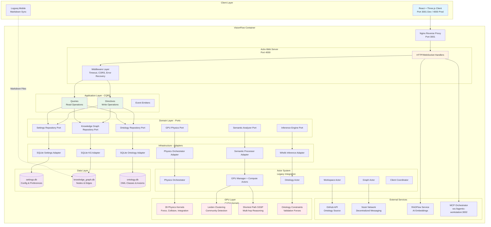
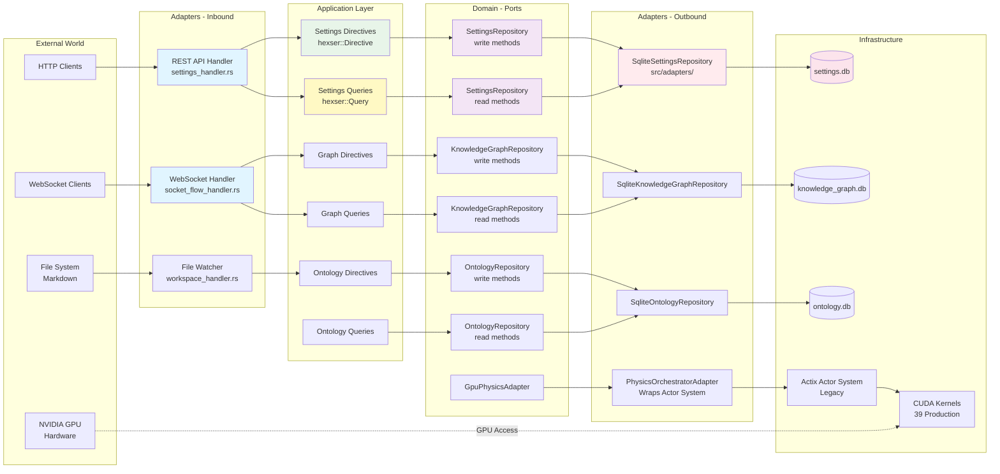
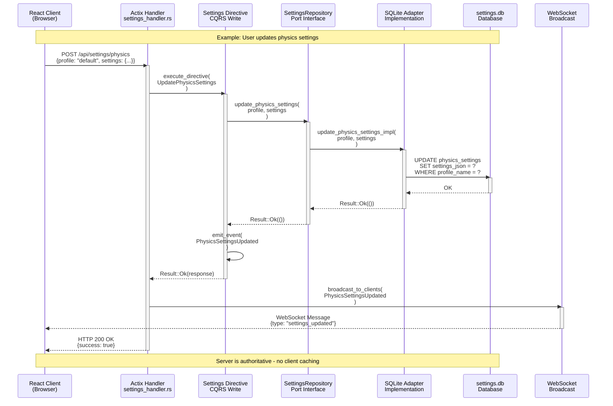
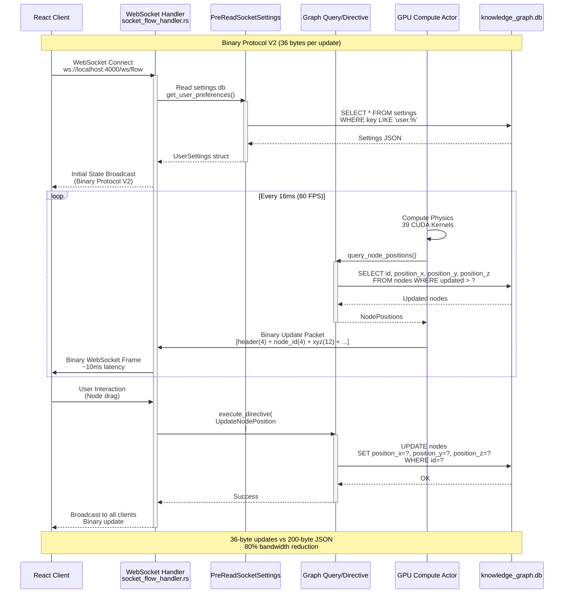
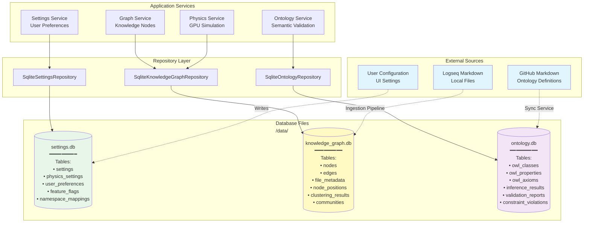
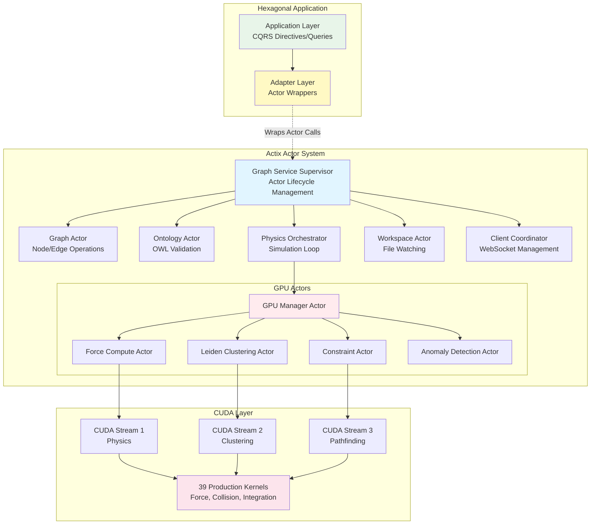
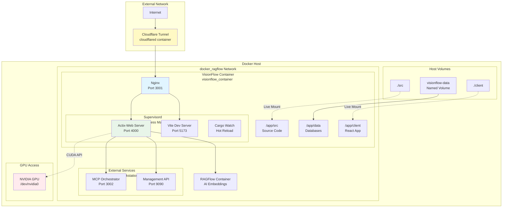

# VisionFlow System Architecture Diagrams

**Version:** 1.0.0
**Last Updated:** 2025-10-27
**Status:** Production-Ready Architecture

---

## 1. System Architecture Overview



---

## 2. Hexagonal Architecture - Ports and Adapters



---

## 3. Component Interaction - Data Flow



---

## 4. Binary WebSocket Protocol Flow



---

## 5. Three-Database Architecture



---

## 6. Actor System Integration (Legacy)



---

## 7. Deployment Architecture



---

## 8. API Endpoint Architecture

```mermaid
graph LR
    subgraph "HTTP REST API"
        API_SETTINGS[/api/settings/*<br/>Settings Management]
        API_GRAPH[/api/graph/*<br/>Graph Operations]
        API_ONTOLOGY[/api/ontology/*<br/>OWL Validation]
        API_WORKSPACE[/api/workspace/*<br/>File Management]
        API_HEALTH[/api/health<br/>Health Check]
    end

    subgraph "WebSocket API"
        WS_FLOW[/ws/flow<br/>Binary Protocol V2<br/>Real-time Graph Updates]
        WS_SPEECH[/ws/speech<br/>Voice Commands<br/>Spatial Audio]
        WS_MCP[/ws/mcp<br/>MCP Relay<br/>Agent Communication]
        WS_REALTIME[/ws/realtime<br/>Multi-user Sync<br/>Collaborative Editing]
    end

    subgraph "Static Routes"
        PAGES[/<br/>React SPA<br/>index.html]
        ASSETS[/assets/*<br/>Static Resources<br/>JS, CSS, WASM]
    end

    subgraph "Handler Modules<br/>src/handlers/"
        H_SETTINGS[settings_handler.rs<br/>1,100 lines]
        H_GRAPH[graph_state_handler.rs<br/>400 lines]
        H_ONTOLOGY[ontology_handler.rs<br/>600 lines]
        H_SOCKET[socket_flow_handler.rs<br/>1,800 lines]
        H_SPEECH[speech_socket_handler.rs<br/>700 lines]
    end

    API_SETTINGS --> H_SETTINGS
    API_GRAPH --> H_GRAPH
    API_ONTOLOGY --> H_ONTOLOGY
    WS_FLOW --> H_SOCKET
    WS_SPEECH --> H_SPEECH

    style API_SETTINGS fill:#e8f5e9
    style API_GRAPH fill:#e8f5e9
    style API_ONTOLOGY fill:#e8f5e9
    style WS_FLOW fill:#fff9c4
    style WS_SPEECH fill:#fff9c4
    style H_SETTINGS fill:#e1f5ff
    style H_SOCKET fill:#e1f5ff
```

---

## Architecture Principles

### 1. Database-First Design
- All state persists in three separate databases
- No in-memory caching at application layer
- Database is single source of truth

### 2. Server-Authoritative
- Client never caches state
- All updates flow through server
- Binary protocol for efficiency (36 bytes/update)

### 3. CQRS Pattern
- Directives for write operations (mutations)
- Queries for read operations (no side effects)
- Clear separation of concerns

### 4. Hexagonal Architecture
- Ports define domain interfaces
- Adapters implement infrastructure
- Business logic independent of frameworks

### 5. GPU-First Performance
- 39 production CUDA kernels
- 100x speedup over CPU
- 60 FPS at 100k+ nodes
- Sub-10ms WebSocket latency

---

## Performance Metrics

| Metric | Value | Notes |
|--------|-------|-------|
| **Frame Rate** | 60 FPS | At 100k+ nodes |
| **WebSocket Latency** | <10ms | Binary protocol V2 |
| **GPU Speedup** | 100x | vs CPU baseline |
| **Bandwidth Reduction** | 80% | Binary vs JSON |
| **Database Size** | ~300 MB | 100k nodes + edges |
| **Memory Usage** | 8-16 GB | Active development |
| **Concurrent Users** | 50+ | Real-time collaboration |

---

## Migration Status

**Current Phase:** ✅ Completed
**Architecture Version:** 3.1.0
**Last Verified:** 2025-10-25

All legacy file-based configuration has been migrated to database-backed storage. The hexagonal architecture is fully implemented with CQRS pattern and three-database separation.

---

**For detailed migration history, see:** [MIGRATION_PLAN.md](../MIGRATION_PLAN.md)
**For database schemas, see:** [DATABASE.md](../DATABASE.md)
**For API documentation, see:** [REST API](../reference/api/rest-api.md) and [WebSocket API](../reference/api/websocket-api.md)
