## VC-01.1 main() phase 1 — hygiene, logging, settings, stores
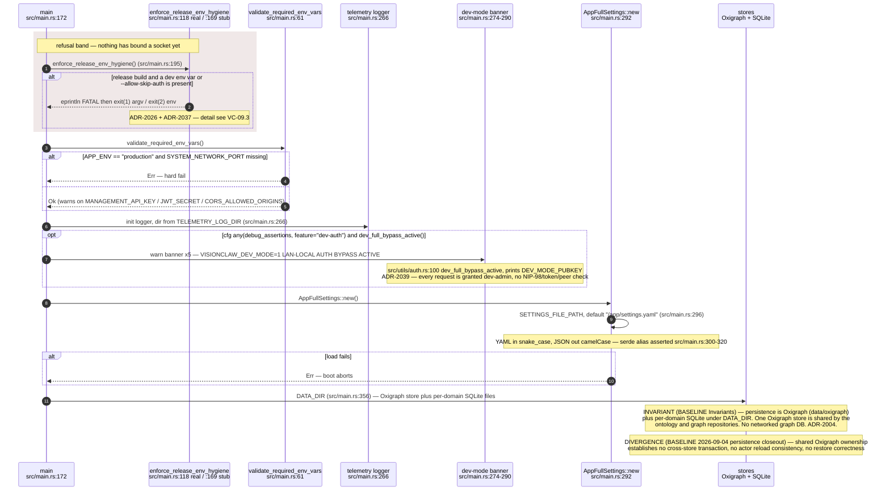

## VC-01.2 main() phase 2 — service graph and RBAC owner bootstrap
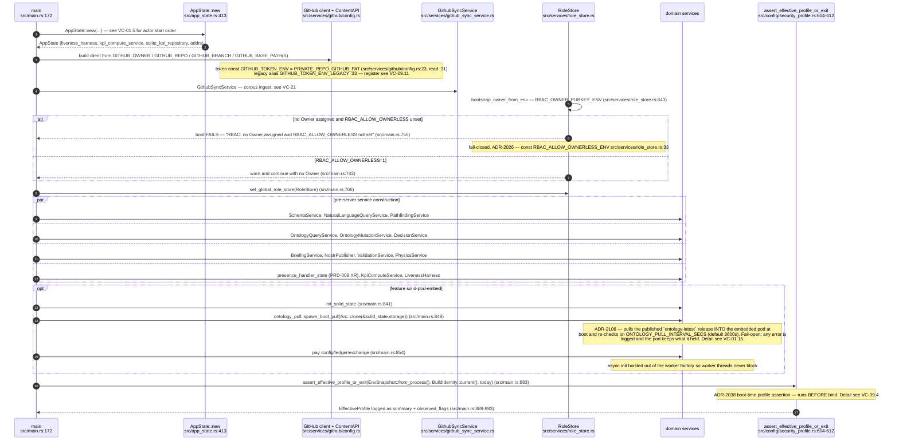

## VC-01.3 HttpServer worker factory and middleware stack order
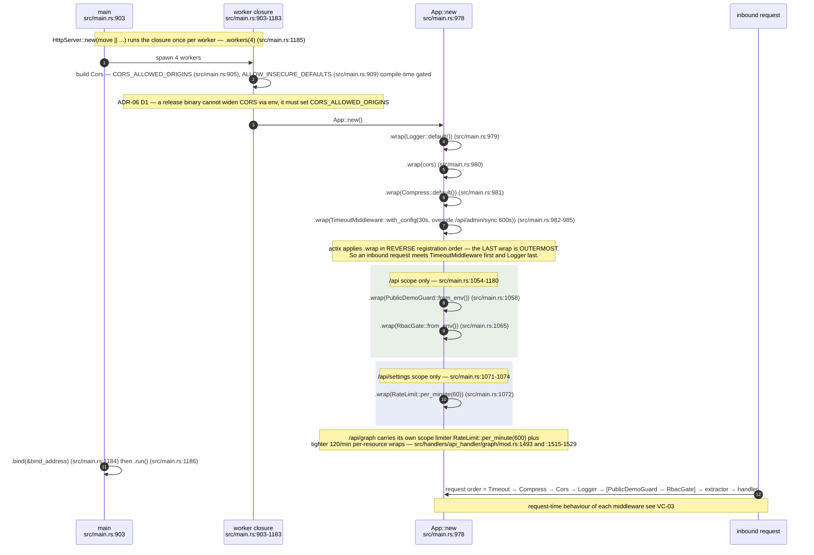

## VC-01.4 app_data registry — what each worker gets injected
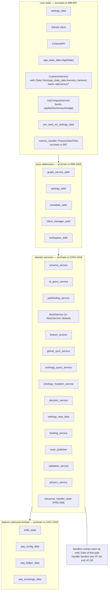

## VC-01.5 AppState::new — actor start order and the coordinator re-bind
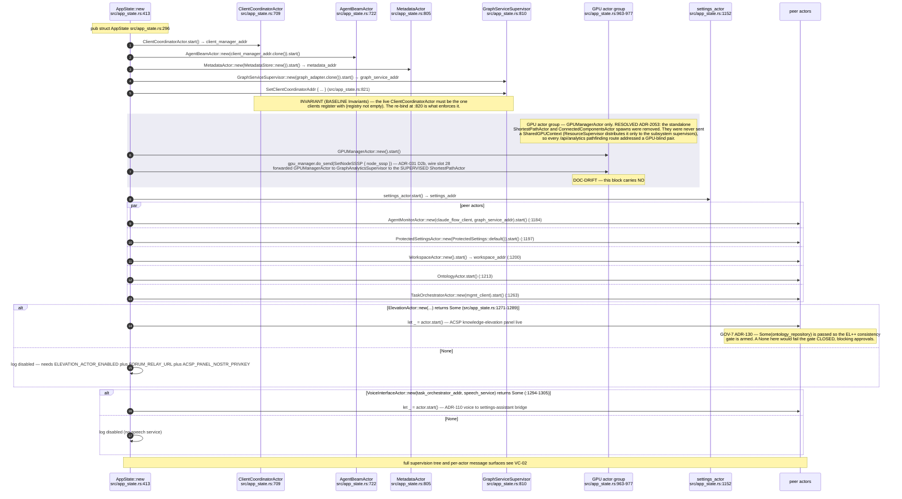

## VC-01.6 Feature and flag gates that change the boot shape
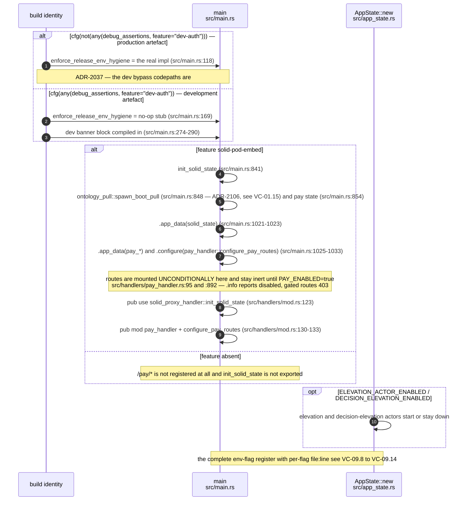

## VC-01.7 Health and readiness composition
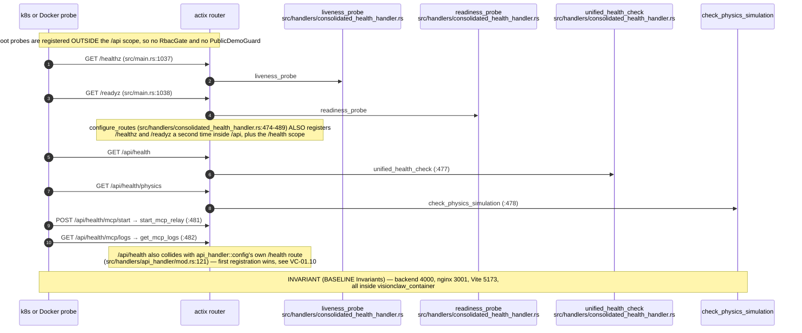

## VC-01.8 Post-bind background tasks and graceful shutdown
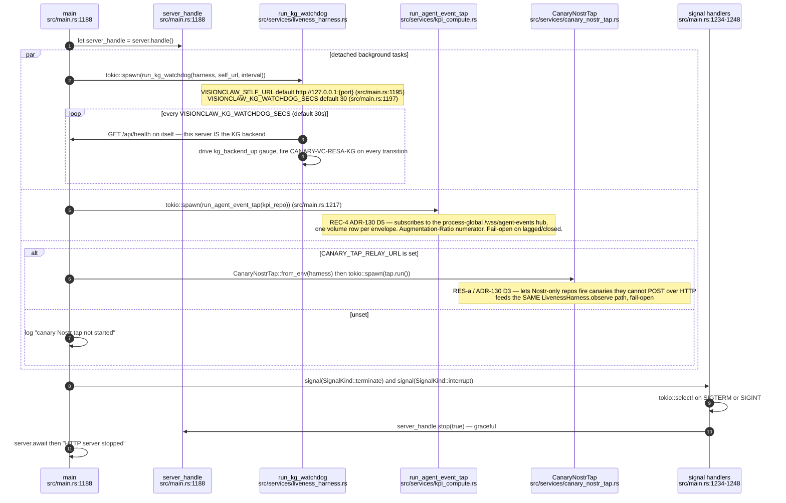

## VC-01.9 Route table 1 — root scope, WebSocket upgrades and OpenAPI
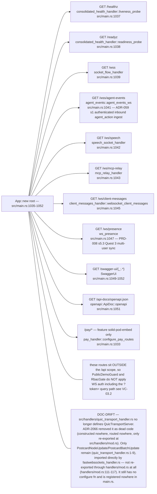

## VC-01.10 Route table 2 — /api scope registration ORDER
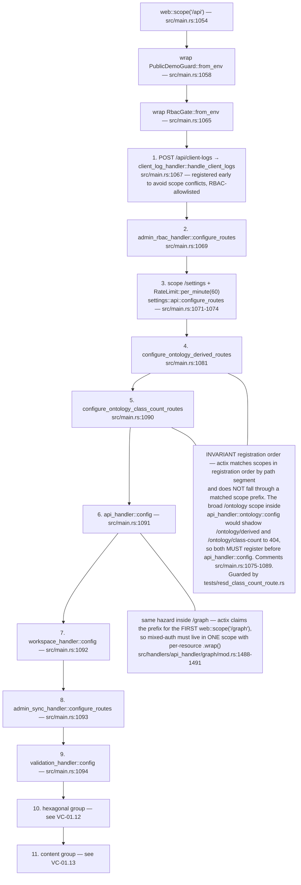

## VC-01.11 Route table 3 — api_handler::config fan-out
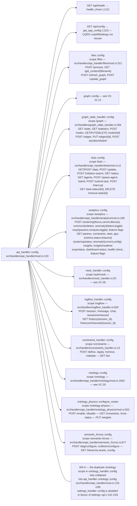

## VC-01.12 Route table 4 — hexagonal, health and MCP groups
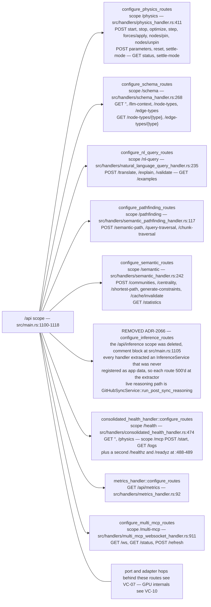

## VC-01.13 Route table 5 — content, governance and observability groups
```mermaid
flowchart LR
    S["/api scope — src/main.rs:1120-1178"]
    S --> PG["scope /pages + pages_handler::config<br/>src/main.rs:1120, src/handlers/pages_handler.rs:148 — GET ''"]
    S --> BO["scope /bots + api_handler::bots::config<br/>src/main.rs:1121"]
    S --> BV["bots_visualization_handler::configure_routes<br/>scope /visualization — src/handlers/bots_visualization_handler.rs:500<br/>GET /agents/ws, GET snapshot, POST initialize<br/>plus POST /bots/mock-agents at :513"]
    S --> GE["configure_graph_export_routes<br/>scope /graph-export — src/handlers/graph_export_handler.rs:319<br/>POST '', /share, /publish — GET /shared/{id}, /stats — DELETE /shared/{id}"]
    S --> OA["configure_ontology_agent_routes<br/>scope /ontology-agent — src/handlers/ontology_agent_handler.rs:434<br/>POST /discover, /read, /query, /traverse, /validate — GET /status<br/>nested scope /propose POST '' — see VC-05"]
    S --> DE["configure_decision_routes<br/>scope /decisions — src/handlers/decision_handler.rs:323<br/>GET /{urn}/trace — nested scope /record POST '' — PRD-022 W-B / ADR-048"]
    S --> SO["configure_solid_routes<br/>src/handlers/solid_proxy_handler.rs:1752<br/>re-exported at src/handlers/mod.rs:121 — see VC-05"]
    S --> IG["configure_image_gen_routes<br/>scope /image-gen — src/handlers/image_gen_handler.rs:779<br/>GET /health, /status/{job_id} — POST /submit, /agent-submit"]
    S --> BR["configure_briefing_routes<br/>scope /briefs — src/handlers/briefing_handler.rs:118<br/>POST '' submit_brief, POST /{brief_id}/debrief"]
    S --> MF["configure_memory_flash_routes<br/>POST /api/memory-flash and the batch route<br/>src/handlers/memory_flash_handler.rs:134-137"]
    S --> EP["configure_enrichment_proposals_routes<br/>POST /api/enrichment-proposals/{id}/decide<br/>src/handlers/enrichment_proposals_handler.rs:540"]
    S --> BI["configure_broker_inbox_routes<br/>scope /broker — src/handlers/broker_inbox_handler.rs:164<br/>GET /inbox, GET /cases/{id}, POST decide_as_operator — WS-12"]
    S --> IW["configure_ingest_writeback_routes<br/>POST /api/ingest/writeback — src/handlers/ingest_writeback_handler.rs:103 — GOV-4"]
    S --> LV["configure_liveness_routes<br/>scope /canary — src/handlers/liveness_harness_handler.rs:212<br/>POST /register, POST /observe/{canary_id}, GET /status — RES-a"]
    S --> KP["configure_kpi_routes<br/>scope /kpi — src/handlers/kpi_handler.rs:49<br/>GET /summary, GET /lineage/{snapshot_id} — REC-4 ADR-043"]
    S --> IL["configure_insight_loop_routes<br/>scope /insight-loop — src/handlers/insight_loop_handler.rs:91<br/>GET /trace, GET /trace/{case_id} — REC-10 PRD-023 WP-12"]
    S --> TR["configure_trace_routes<br/>GET /api/trace — src/handlers/trace_handler.rs:76<br/>REC-11 joins agent-events and broker decisions on did:nostr"]
    S --> LA["configure_layout_routes<br/>scope /layout — src/handlers/layout_handler.rs:282<br/>GET /modes, /status, /zones — POST /mode, /radial, /zones, /reset — ADR-031"]
    N["handler internals for this group see VC-04 and VC-05"]
    S --- N
```

## VC-01.14 Route table 6 — /api/graph mixed-auth scope and /api/settings
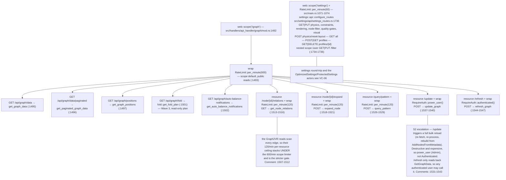

## VC-01.15 ADR-2106 — the embedded pod pulls the published ontology at boot
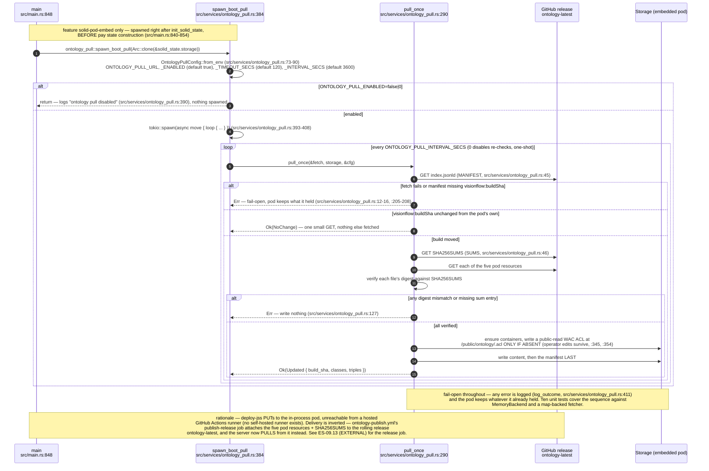

