## VC-02.1 Supervision-tree topology — AppState::new boot order
```mermaid
flowchart TB
    APP["AppState::new<br/>src/app_state.rs:413"]
    CC["ClientCoordinatorActor<br/>src/app_state.rs:714<br/>Addr~ClientCoordinatorActor~"]
    AB["AgentBeamActor<br/>src/app_state.rs:722<br/>no Addr held — hub-subscription lifetime"]
    MD["MetadataActor<br/>src/app_state.rs:805<br/>Addr~MetadataActor~"]
    GSS["GraphServiceSupervisor<br/>src/app_state.rs:810<br/>Addr~GraphServiceSupervisor~"]
    REBIND["SetClientCoordinatorAddr<br/>src/app_state.rs:821"]
    GPU["GPUManagerActor boundary<br/>src/app_state.rs:963<br/>Note: GPU internals see VC-10"]
    ANA["analytics actors — supervised, not started here<br/>src/app_state.rs:965-971<br/>ADR-2053 removed the standalone ShortestPathActor and<br/>ConnectedComponentsActor pair, see VC-10"]
    SET["OptimizedSettingsActor<br/>src/app_state.rs:1152-1161<br/>Addr~OptimizedSettingsActor~"]
    AM["AgentMonitorActor<br/>src/app_state.rs:1184<br/>Addr~AgentMonitorActor~"]
    PS["ProtectedSettingsActor<br/>src/app_state.rs:1197<br/>Addr~ProtectedSettingsActor~"]
    WS["WorkspaceActor<br/>src/app_state.rs:1200<br/>Addr~WorkspaceActor~"]
    ONT["OntologyActor<br/>src/app_state.rs:1213<br/>Option~Addr~OntologyActor~~"]
    TO["TaskOrchestratorActor<br/>src/app_state.rs:1263<br/>Addr~TaskOrchestratorActor~"]
    EL["ElevationActor<br/>src/app_state.rs:1271<br/>anon start — no Addr retained"]
    VI["VoiceInterfaceActor<br/>src/app_state.rs:1294<br/>anon start — no Addr retained"]
    DE["DecisionElevationActor<br/>src/main.rs:544<br/>started OUTSIDE AppState::new"]

    APP --> CC
    CC --> AB
    CC -.->|"rebind"| REBIND
    AB --> MD
    MD --> GSS
    GSS -.->|"do_send"| REBIND
    GSS --> GPU
    GPU --> ANA
    ANA --> SET
    SET --> AM
    AM --> PS
    PS --> WS
    WS --> ONT
    ONT --> TO
    TO --> EL
    EL --> VI
    VI -.->|"same process, later in main()"| DE

    N1["INVARIANT (BASELINE Invariants) — the live ClientCoordinatorActor clients register<br/>with must be the CC instance above, not GraphServiceSupervisor's own child.<br/>REBIND at app_state.rs:821 makes GSS forward broadcasts through CC's non-empty registry."]
    REBIND --- N1
```

## VC-02.2 GraphServiceSupervisor::initialize_actors — child start order and wiring
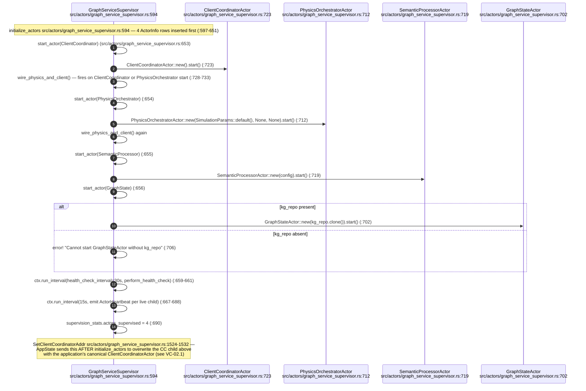

## VC-02.3 GraphServiceSupervisor message routing table
```mermaid
flowchart LR
    subgraph SUP["GraphServiceSupervisor handlers — grep impl Handler< src/actors/graph_service_supervisor.rs"]
        H1["SupervisorMessage graph_service_supervisor.rs:1411"]
        H2["ActorHeartbeat graph_service_supervisor.rs:1419"]
        H3["GetSupervisorStatus graph_service_supervisor.rs:1434"]
        H4["RestartActor graph_service_supervisor.rs:1442"]
        H5["RestartAllActors graph_service_supervisor.rs:1451"]
        H6["RESOLVED ADR-2045 (2026-09-05)<br/>SetParentSupervisor handler removed<br/>with src/actors/supervisor.rs, see VC-02.7"]
        H7["msgs::GetGraphData graph_service_supervisor.rs:1465"]
        H8["NotifyGraphUpdated graph_service_supervisor.rs:1500"]
        H9["SetClientCoordinatorAddr graph_service_supervisor.rs:1524"]
        H10["msgs::ReloadGraphFromDatabase graph_service_supervisor.rs:1534"]
        H11["msgs::ComputeShortestPaths graph_service_supervisor.rs:1638"]
        H12["msgs::UpdateGraphData graph_service_supervisor.rs:1664"]
        H13["msgs::AddNodesFromMetadata graph_service_supervisor.rs:1694"]
        H14["msgs::StartSimulation graph_service_supervisor.rs:1720"]
        H15["msgs::SimulationStep graph_service_supervisor.rs:1737"]
        H16["msgs::GetBotsGraphData graph_service_supervisor.rs:1764"]
        H17["msgs::UpdateSimulationParams graph_service_supervisor.rs:1797"]
        H18["msgs::ForceResumePhysics graph_service_supervisor.rs:1825"]
        H19["msgs::InitializeGPUConnection graph_service_supervisor.rs:1854"]
        H20["msgs::SetAppGpuComputeAddr graph_service_supervisor.rs:1952"]
        H21["msgs::UpdateBotsGraph graph_service_supervisor.rs:1966"]
        H22["msgs::UpdateNodePositions graph_service_supervisor.rs:1983"]
        H23["msgs::NodeInteractionMessage graph_service_supervisor.rs:2010"]
        H24["msgs::GetGraphStateActor graph_service_supervisor.rs:2078"]
        H25["msgs::GetPhysicsOrchestratorActor graph_service_supervisor.rs:2087"]
        H26["msgs::GetNodeTypeArrays graph_service_supervisor.rs:2102"]
        H27["msgs::GetNodeIdMapping graph_service_supervisor.rs:2124"]
        H28["msgs::AddEdge graph_service_supervisor.rs:2146"]
    end
    GS["self.graph_state (GraphStateActor)"]
    PH["self.physics (PhysicsOrchestratorActor)"]
    CL["self.client (ClientCoordinatorActor)"]
    GM["self.gpu_manager (GPUManagerActor) — boundary, see VC-10"]
    SELF["self (in-place state)"]

    H7 --> GS
    H10 --> GS
    H11 --> GS
    H12 --> GS
    H13 --> GS
    H16 --> GS
    H21 --> GS
    H26 --> GS
    H27 --> GS
    H28 --> GS
    H22 -->|"do_send both"| GS
    H22 --> PH
    H14 --> PH
    H15 --> PH
    H17 --> PH
    H18 --> PH
    H23 --> PH
    H25 --> PH
    H19 -->|"query GetForceComputeActor, InitializeGPU"| GM
    H19 -->|"StoreGPUComputeAddress"| PH
    H1 --> SELF
    H2 --> SELF
    H3 --> SELF
    H4 --> SELF
    H5 --> SELF
    H8 --> SELF
    H9 -->|"self.client = msg.addr, rewire"| CL
    H20 --> SELF
    H24 --> SELF

    N1["H12/H13/H28 also call notify_graph_updated (debounced graphUpdated broadcast) before forwarding<br/>H24/H26/H27 default-value fallback when the target child is None (never propagate an error to caller)"]
    H12 --- N1
```

## VC-02.4 GraphServiceSupervisor restart and backoff lifecycle — the one live supervision path
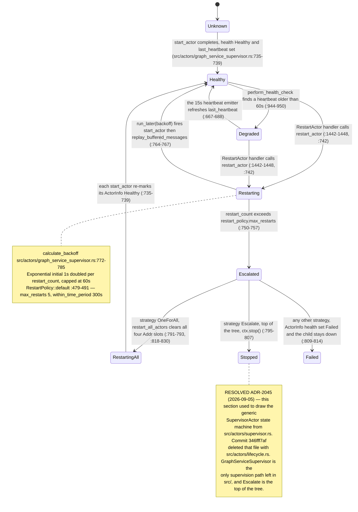

## VC-02.5 GraphServiceSupervisor restart sequence — RestartActor to replay or escalate
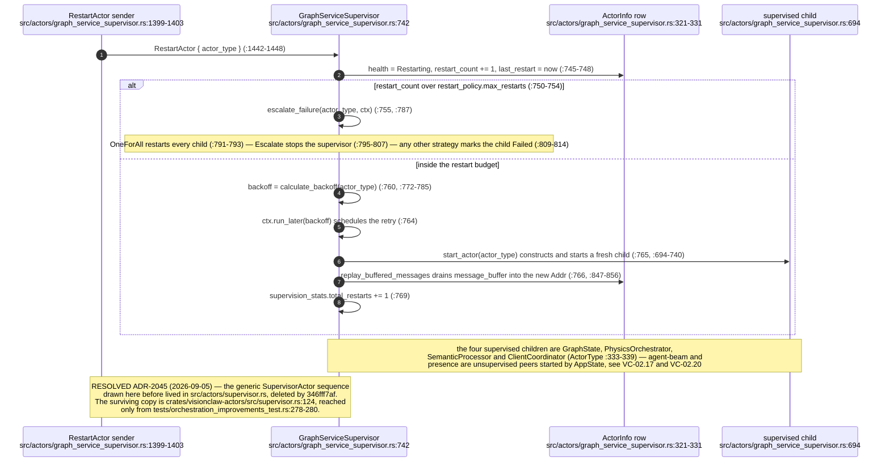

## VC-02.6 Drain and shutdown — GraphServiceSupervisor stop and the test-only crate drain
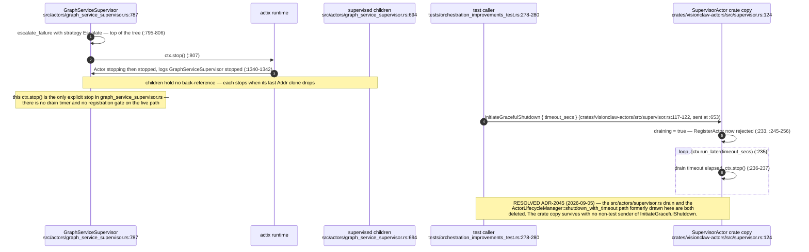

## VC-02.7 RESOLVED ADR-2045 — the removed supervision machinery and its survivor
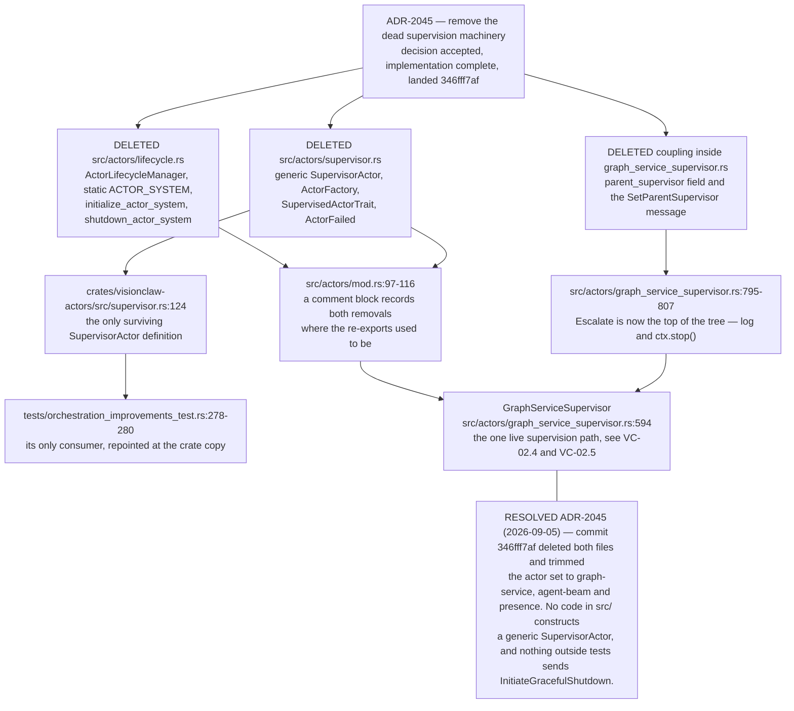

## VC-02.8 event_coordination.rs — coordination event publish/consume (ADR-2007 partial)
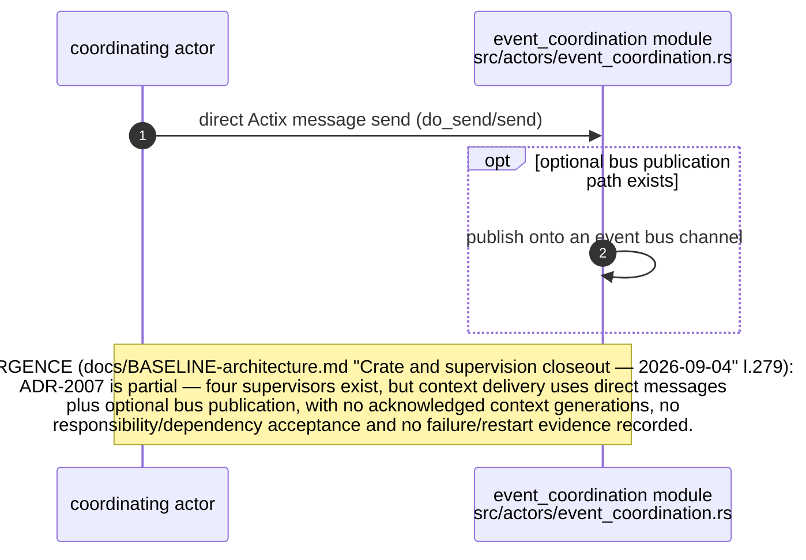

## VC-02.9 Message catalogue — client_messages, graph_messages, broadcast_messages
```mermaid
classDiagram
    class ClientCoordinatorActor {
      <<actor>>
      src/actors/client_coordinator_actor.rs
    }
    class RegisterClient {
      +ClientRecipients recipients
      result() Result~usize,String~
    }
    class ClientRecipients {
      +Recipient~SendToClientBinary~ binary
      +Recipient~SendToClientText~ text
      +Recipient~SendInitialGraphLoad~ initial_load
    }
    class UnregisterClient {
      +usize client_id
    }
    class BroadcastMessage {
      +String message
    }
    class GraphServiceSupervisor {
      <<actor>>
    }
    class GetGraphData {
      result() Result~Arc,String~
    }
    class UpdateGraphData {
      +Arc~ServiceGraphData~ graph_data
      result() Result~(),String~
    }
    class UpdateNodePositions {
      +List~u32,BinaryNodeData~ positions
      +Option~MessageId~ correlation_id
      result() Result~(),String~
    }
    class AddNodesFromMetadata {
      +MetadataStore metadata
      result() Result~(),String~
    }
    class AddEdge {
      +Edge edge
      result() Result~(),String~
    }
    class NodeInteractionMessage {
      +u32 node_id
      +NodeInteractionType interaction_type
      +Option~List~f32~~ position
      result() Result~(),VisionClawError~
    }
    RegisterClient *-- ClientRecipients
    ClientCoordinatorActor ..> RegisterClient
    ClientCoordinatorActor ..> UnregisterClient
    ClientCoordinatorActor ..> BroadcastMessage
    GraphServiceSupervisor ..> GetGraphData
    GraphServiceSupervisor ..> UpdateGraphData
    GraphServiceSupervisor ..> UpdateNodePositions
    GraphServiceSupervisor ..> AddNodesFromMetadata
    GraphServiceSupervisor ..> AddEdge
    GraphServiceSupervisor ..> NodeInteractionMessage
    note for GetGraphData "src/actors/messages/ — RegisterClient/UnregisterClient/BroadcastMessage\nowned by client_coordinator_actor.rs consumer; Result types confirmed from\nHandler impls at graph_service_supervisor.rs:1465,1664,1983,1694,2146,2010"
```

## VC-02.10 Message catalogue — supervision and heartbeat messages
```mermaid
classDiagram
    class GraphServiceSupervisor {
      <<actor>>
    }
    class SupervisorMessage {
      <<enum>>
      UpdateGraphData
      ReloadGraphFromDatabase
      StartSimulation
      StopSimulation
      SimulationStep
      UpdateSimulationParams
      UpdateNodePositions
      BroadcastMessage
      result() Result~(),VisionClawError~
    }
    class ActorHeartbeat {
      +ActorType actor_type
      +Instant timestamp
      +ActorHealth health
      +Option~ActorStats~ stats
    }
    class GetSupervisorStatus {
      result() SupervisorStatus
    }
    class RestartActor {
      +ActorType actor_type
      result() Result~(),VisionClawError~
    }
    class RestartAllActors {
      result() Result~(),VisionClawError~
    }
    class SetParentSupervisor {
      +Addr~SupervisorActor~ parent
    }
    class SetClientCoordinatorAddr {
      +Addr~ClientCoordinatorActor~ addr
    }
    class NotifyGraphUpdated {
      +str reason
    }
    class ActorFailed {
      +String actor_name
      +VisionClawError error
    }
    GraphServiceSupervisor ..> SupervisorMessage
    GraphServiceSupervisor ..> ActorHeartbeat
    GraphServiceSupervisor ..> GetSupervisorStatus
    GraphServiceSupervisor ..> RestartActor
    GraphServiceSupervisor ..> RestartAllActors
    GraphServiceSupervisor ..> SetClientCoordinatorAddr
    GraphServiceSupervisor ..> NotifyGraphUpdated
    note for SetClientCoordinatorAddr "src/actors/graph_service_supervisor.rs:1524-1532 —\nfield and handler both confirmed by direct read.\nRESOLVED ADR-2045 (2026-09-05) — SetParentSupervisor and ActorFailed\nwere removed from this actor with src/actors/supervisor.rs, see VC-02.7"
```

## VC-02.11 GraphStateActor — representative read and write sequence
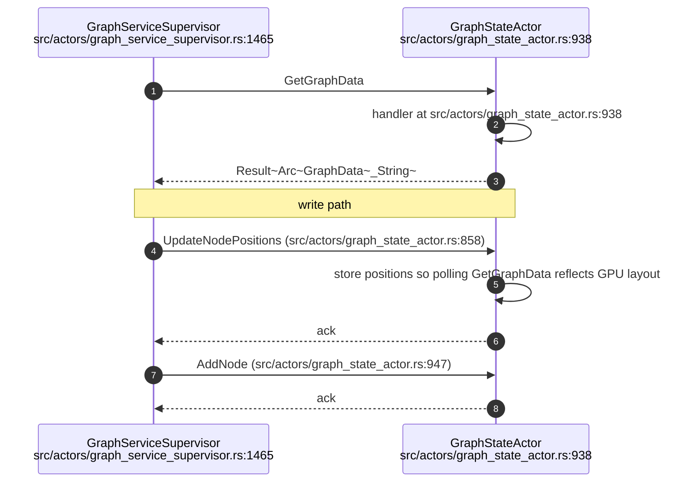

## VC-02.12 PhysicsOrchestratorActor — handled messages and broadcast invariant
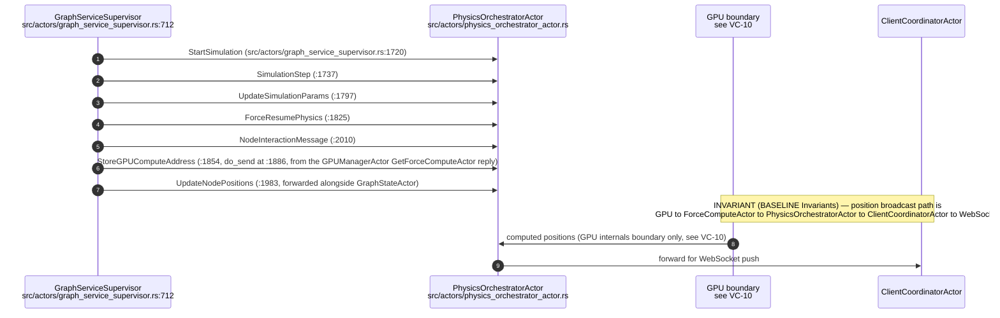

## VC-02.13 ClientCoordinatorActor + client_filter.rs — actor-side message surface
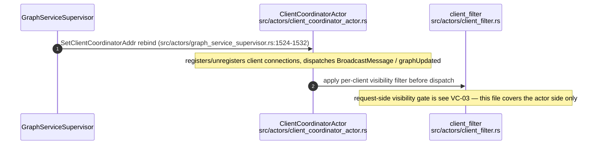

## VC-02.14 MetadataActor and OntologyActor — message surfaces
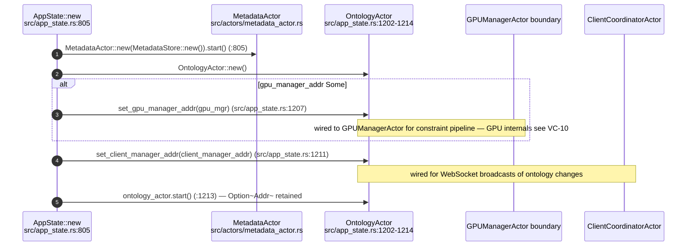

## VC-02.15 SemanticProcessorActor and OptimizedSettingsActor — message surfaces
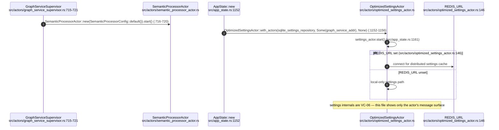

## VC-02.16 ProtectedSettingsActor and WorkspaceActor — message surfaces
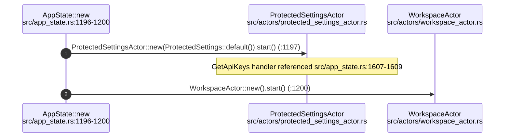

## VC-02.17 PresenceActor and TaskOrchestratorActor — message surfaces
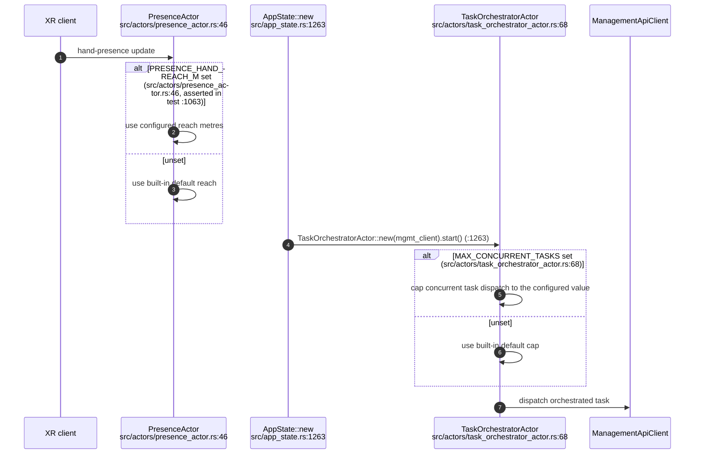

## VC-02.18 ElevationActor (+ elevation_voice.rs) and DecisionElevationActor
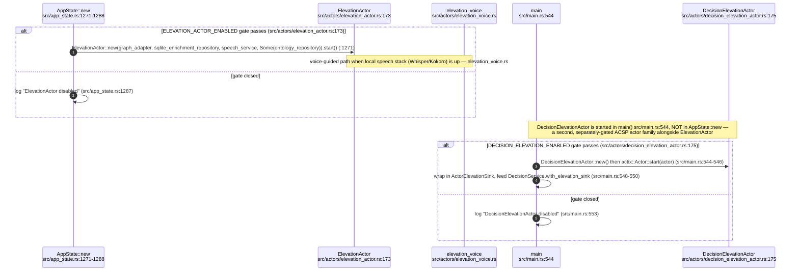

## VC-02.19 VoiceInterfaceActor (+ voice_commands.rs) and MultiMcpVisualizationActor
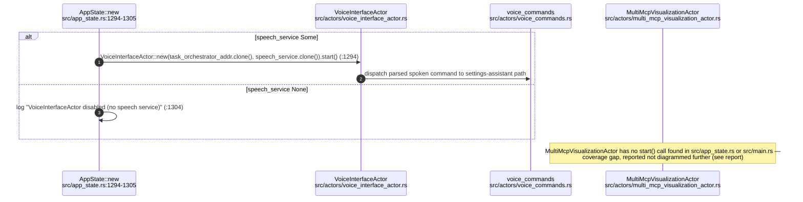

## VC-02.20 AgentMonitorActor and AgentBeamActor — message surfaces
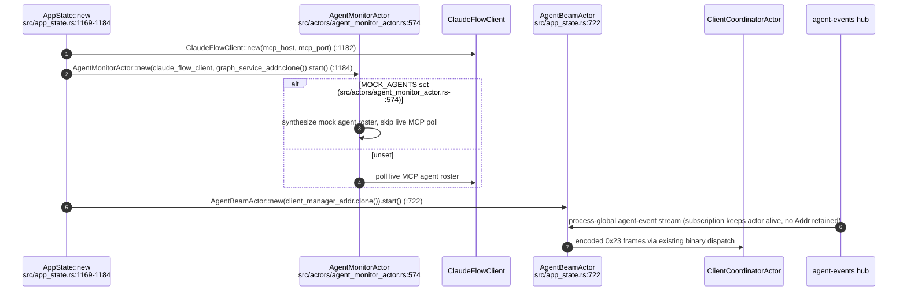
