## VC-03.1 REST request end-to-end — nginx to handler, real middleware order
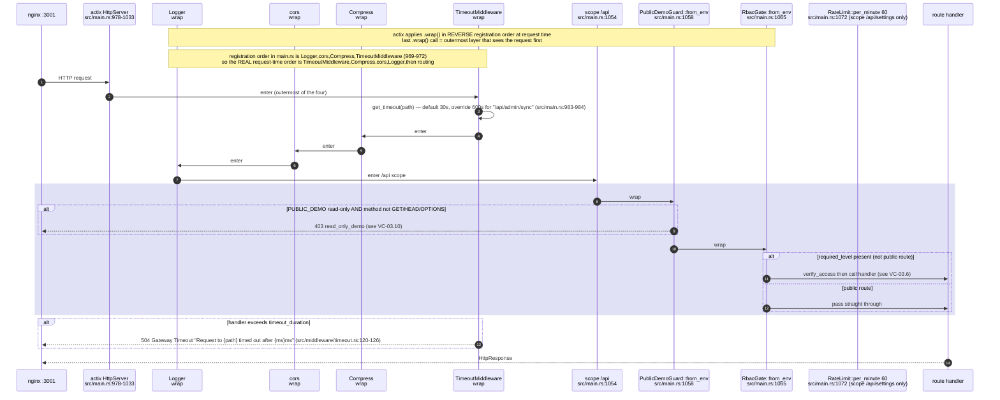

## VC-03.2 WebSocket upgrade lifecycle — every upgrade route, the `?token=` DIVERGENCE
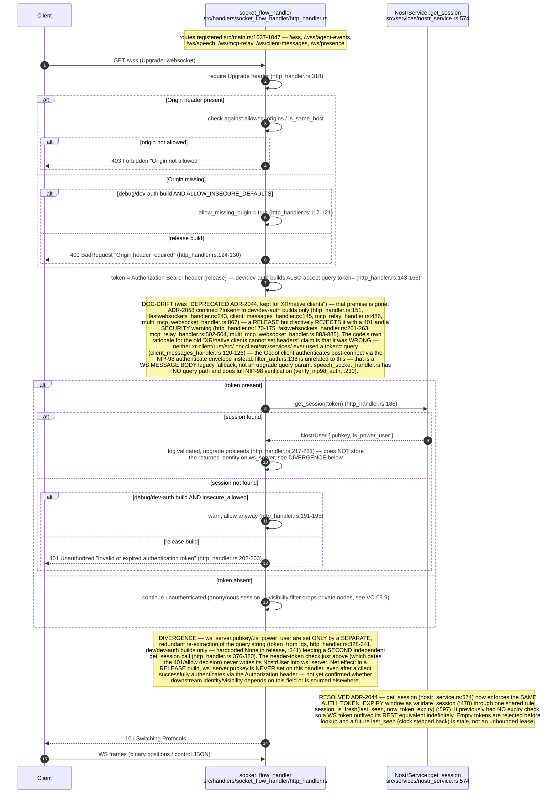

## VC-03.3 `AuthenticatedUser` extractor — settings API dual-auth
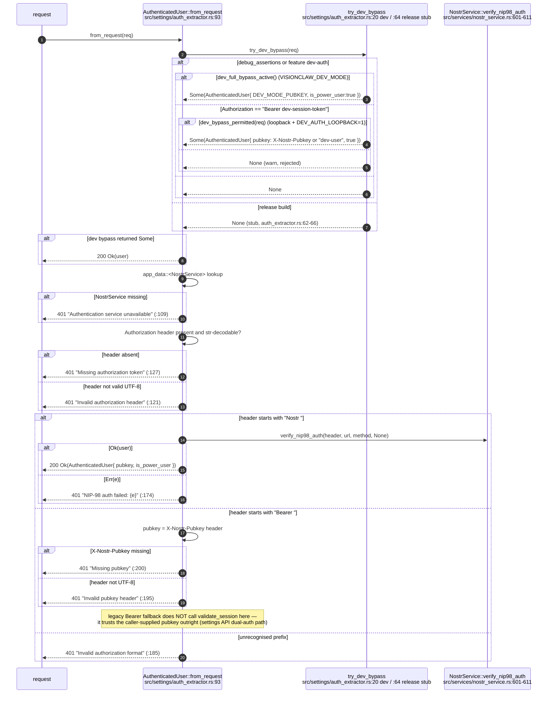

## VC-03.4 NIP-98 verification (kind 27235) — fixed order, single-use replay claim
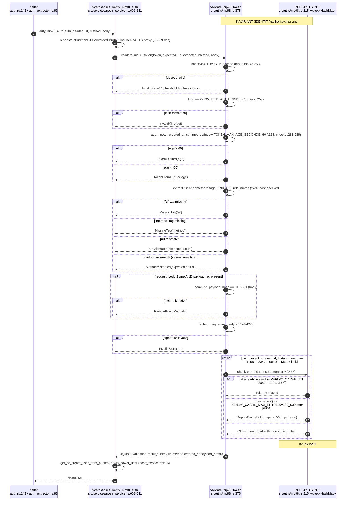

## VC-03.5 Session-bearer realm (ADR-2009) — NIP-98 signing vs opaque session token
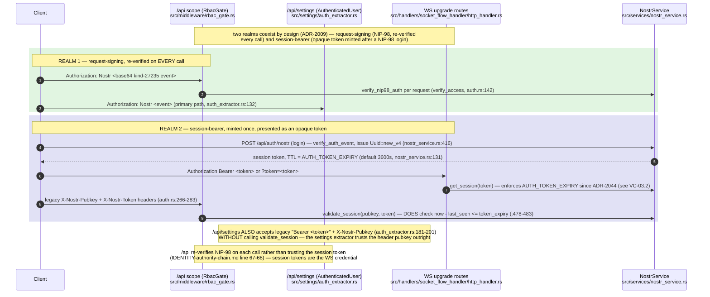

## VC-03.6 `RbacGate` decision sequence — env flags, allowlist, method classification
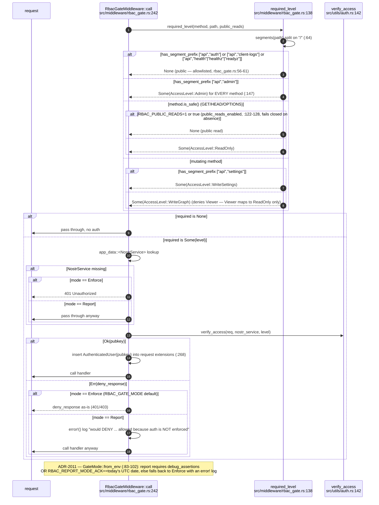

## VC-03.7 Role lattice — Owner > Admin > Editor > Viewer, default-role resolution
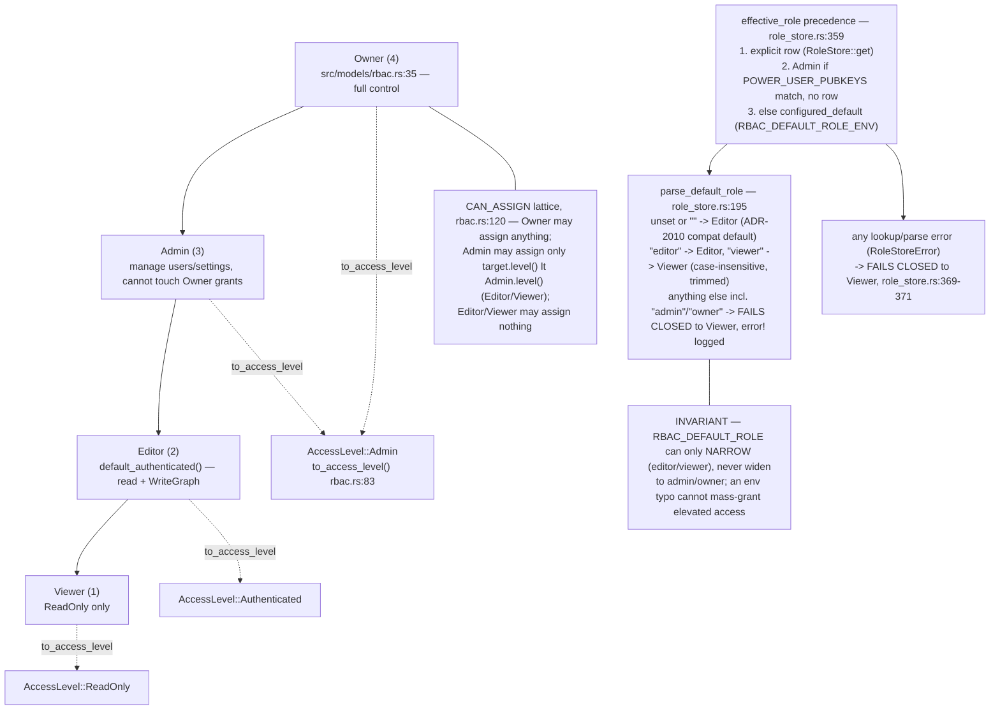

## VC-03.8 `role_store` atomic mutations (ADR-2010) — grant/revoke/transfer
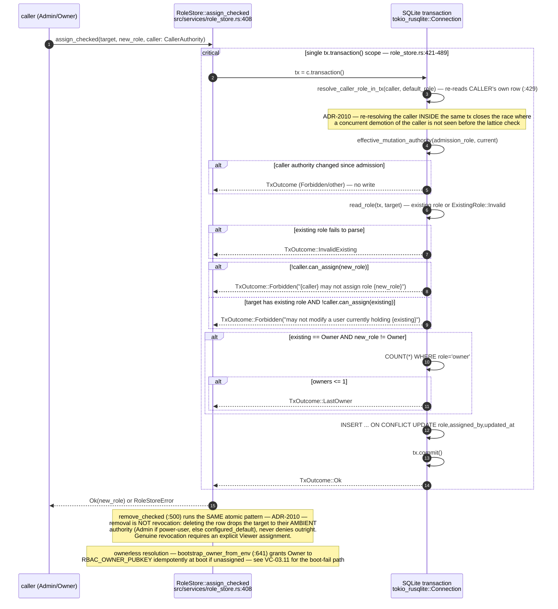

## VC-03.9 `PUBKEY_VISIBILITY_FILTER` — filtered vs unfiltered wire frame
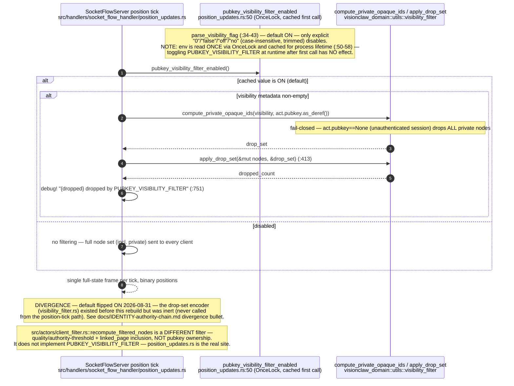

## VC-03.10 `PublicDemoGuard` — read-only demo mode
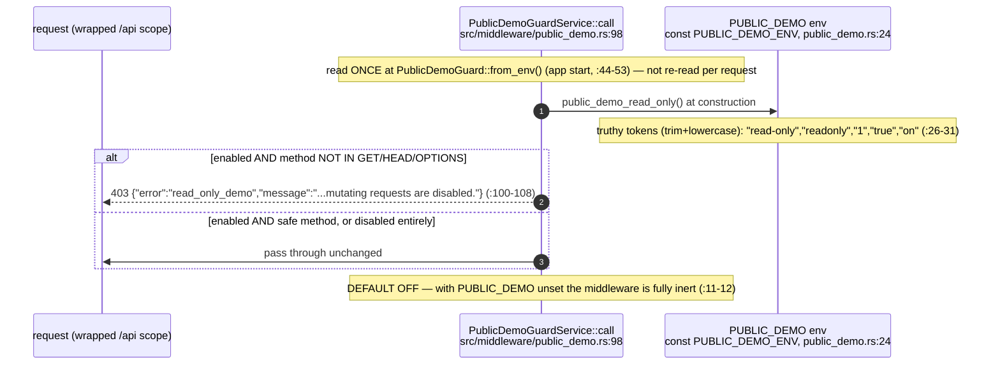

## VC-03.11 Dev bypass triple gate (ADR-2012 / ADR-2039) — nested conditions
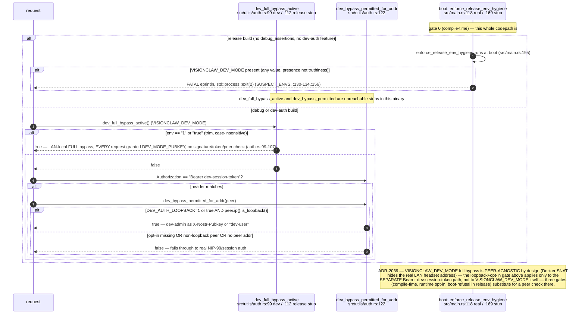

## VC-03.12 `RateLimit` middleware — sliding window per identifier
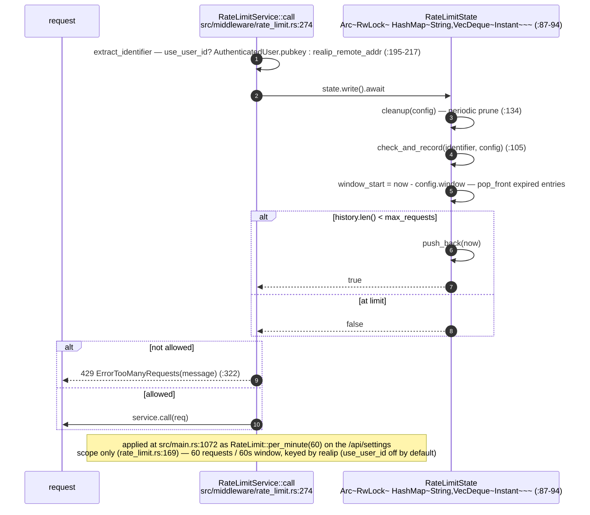

## VC-03.13 `TimeoutMiddleware` — default 30s, per-path override
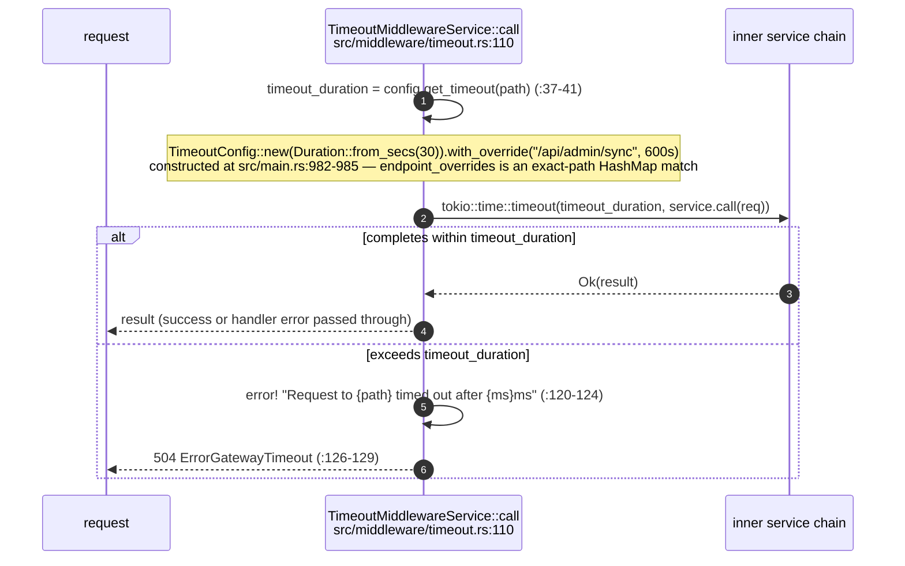

## VC-03.14 `validation` middleware — content-length and injection helpers
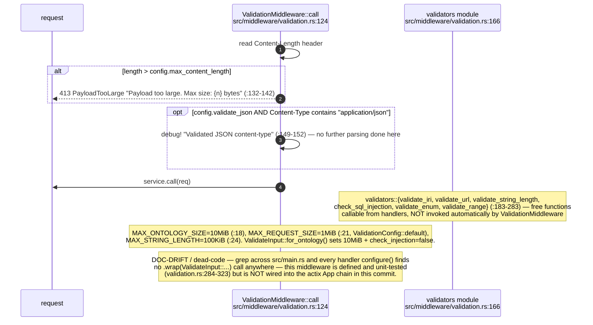

## VC-03.15 Identity authority chain end-to-end — Nostr key to role
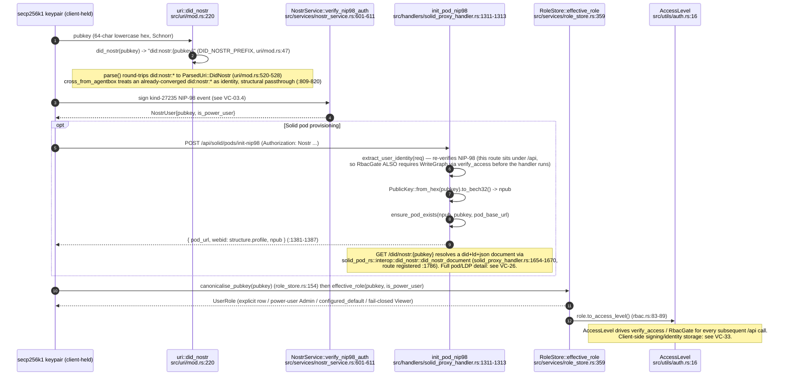

## VC-03.16 ADR-2013 federation-delegation boundary — NOT implemented
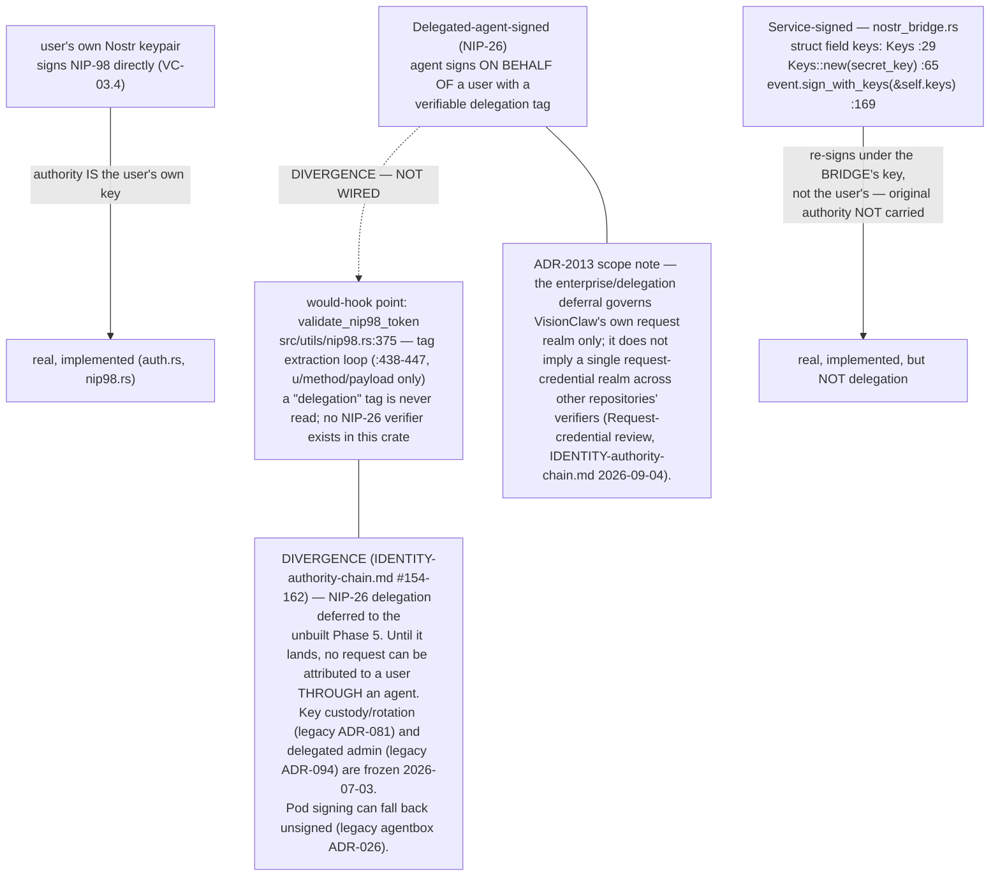
