## VC-05.1 `admin_rbac_handler` — whoami / list / assign / revoke (ADR-2010)
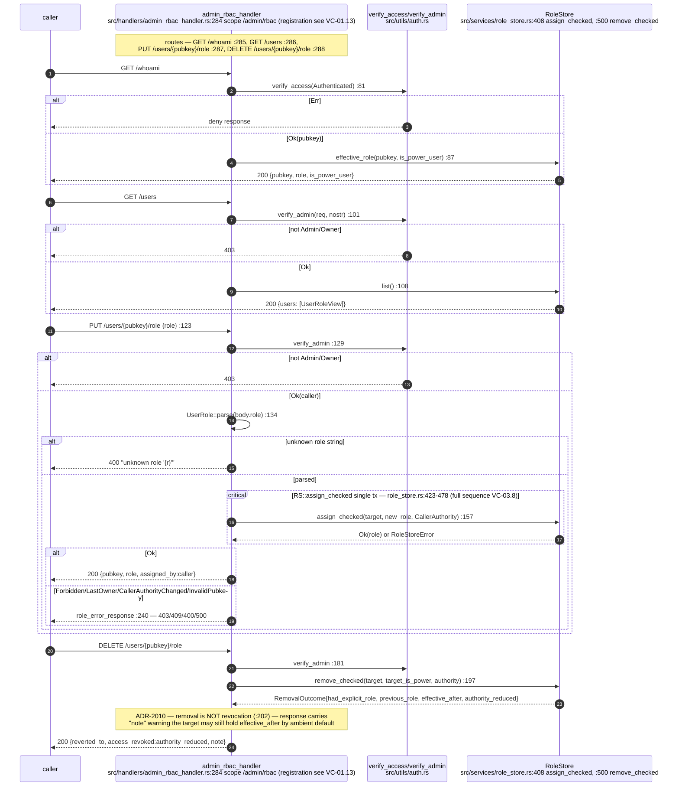
```mermaid
sequenceDiagram
    autonumber
    participant C as caller
    participant H as admin_rbac_handler<br/>src/handlers/admin_rbac_handler.rs:284 scope /admin/rbac (registration see VC-01.13)
    participant VA as verify_access/verify_admin<br/>src/utils/auth.rs
    participant RS as RoleStore<br/>src/services/role_store.rs:408 assign_checked, :500 remove_checked

    Note over H: routes — GET /whoami :285, GET /users :286,<br/>PUT /users/{pubkey}/role :287, DELETE /users/{pubkey}/role :288
    C->>H: GET /whoami
    H->>VA: verify_access(Authenticated) :81
    alt Err
        VA-->>C: deny response
    else Ok(pubkey)
        H->>RS: effective_role(pubkey, is_power_user) :87
        RS-->>C: 200 {pubkey, role, is_power_user}
    end
    C->>H: GET /users
    H->>VA: verify_admin(req, nostr) :101
    alt not Admin/Owner
        VA-->>C: 403
    else Ok
        H->>RS: list() :108
        RS-->>C: 200 {users: [UserRoleView]}
    end
    C->>H: PUT /users/{pubkey}/role {role} :123
    H->>VA: verify_admin :129
    alt not Admin/Owner
        VA-->>C: 403
    else Ok(caller)
        H->>H: UserRole::parse(body.role) :134
        alt unknown role string
            H-->>C: 400 "unknown role '{r}'"
        else parsed
            critical RS::assign_checked single tx — role_store.rs:423-478 (full sequence VC-03.8)
                H->>RS: assign_checked(target, new_role, CallerAuthority) :157
                RS-->>H: Ok(role) or RoleStoreError
            end
            alt Ok
                H-->>C: 200 {pubkey, role, assigned_by:caller}
            else Forbidden/LastOwner/CallerAuthorityChanged/InvalidPubkey
                H-->>C: role_error_response :240 — 403/409/400/500
            end
        end
    end
    C->>H: DELETE /users/{pubkey}/role
    H->>VA: verify_admin :181
    H->>RS: remove_checked(target, target_is_power, authority) :197
    RS-->>H: RemovalOutcome{had_explicit_role, previous_role, effective_after, authority_reduced}
    Note over H: ADR-2010 — removal is NOT revocation (:202) — response carries<br/>"note" warning the target may still hold effective_after by ambient default
    H-->>C: 200 {reverted_to, access_revoked:authority_reduced, note}
```

## VC-05.2 `admin_sync_handler` — trigger_sync with the 600s timeout override
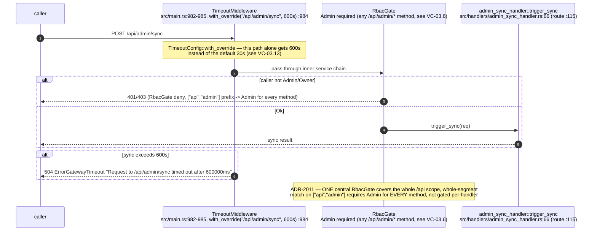
```mermaid
sequenceDiagram
    autonumber
    participant C as caller
    participant TO as TimeoutMiddleware<br/>src/main.rs:982-985, with_override("/api/admin/sync", 600s) :984
    participant RG as RbacGate<br/>Admin required (any /api/admin/* method, see VC-03.6)
    participant H as admin_sync_handler::trigger_sync<br/>src/handlers/admin_sync_handler.rs:66 (route :115)

    C->>TO: POST /api/admin/sync
    Note over TO: TimeoutConfig::with_override — this path alone gets 600s<br/>instead of the default 30s (see VC-03.13)
    TO->>RG: pass through inner service chain
    alt caller not Admin/Owner
        RG-->>C: 401/403 (RbacGate deny, ["api","admin"] prefix -> Admin for every method)
    else Ok
        RG->>H: trigger_sync(req)
        H-->>C: sync result
    end
    alt sync exceeds 600s
        TO-->>C: 504 ErrorGatewayTimeout "Request to /api/admin/sync timed out after 600000ms"
    end
    Note over RG: ADR-2011 — ONE central RbacGate covers the whole /api scope, whole-segment<br/>match on ["api","admin"] requires Admin for EVERY method, not gated per-handler
```

## VC-05.3 `nostr_handler` — session lifecycle routes (scope `/auth/nostr`)
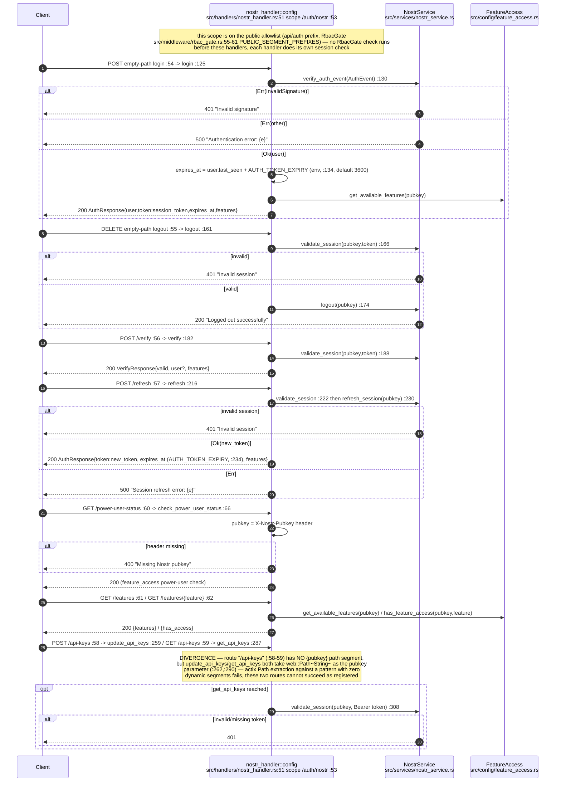
```mermaid
sequenceDiagram
    autonumber
    participant C as Client
    participant H as nostr_handler::config<br/>src/handlers/nostr_handler.rs:51 scope /auth/nostr :53
    participant NS as NostrService<br/>src/services/nostr_service.rs
    participant FA as FeatureAccess<br/>src/config/feature_access.rs

    Note over H: this scope is on the public allowlist (api/auth prefix, RbacGate<br/>src/middleware/rbac_gate.rs:55-61 PUBLIC_SEGMENT_PREFIXES) — no RbacGate check runs<br/>before these handlers, each handler does its own session check
    C->>H: POST empty-path login :54 -> login :125
    H->>NS: verify_auth_event(AuthEvent) :130
    alt Err(InvalidSignature)
        NS-->>C: 401 "Invalid signature"
    else Err(other)
        NS-->>C: 500 "Authentication error: {e}"
    else Ok(user)
        H->>H: expires_at = user.last_seen + AUTH_TOKEN_EXPIRY (env, :134, default 3600)
        H->>FA: get_available_features(pubkey)
        H-->>C: 200 AuthResponse{user,token:session_token,expires_at,features}
    end
    C->>H: DELETE empty-path logout :55 -> logout :161
    H->>NS: validate_session(pubkey,token) :166
    alt invalid
        NS-->>C: 401 "Invalid session"
    else valid
        H->>NS: logout(pubkey) :174
        NS-->>C: 200 "Logged out successfully"
    end
    C->>H: POST /verify :56 -> verify :182
    H->>NS: validate_session(pubkey,token) :188
    H-->>C: 200 VerifyResponse{valid, user?, features}
    C->>H: POST /refresh :57 -> refresh :216
    H->>NS: validate_session :222 then refresh_session(pubkey) :230
    alt invalid session
        NS-->>C: 401 "Invalid session"
    else Ok(new_token)
        H-->>C: 200 AuthResponse{token:new_token, expires_at (AUTH_TOKEN_EXPIRY, :234), features}
    else Err
        H-->>C: 500 "Session refresh error: {e}"
    end
    C->>H: GET /power-user-status :60 -> check_power_user_status :66
    H->>H: pubkey = X-Nostr-Pubkey header
    alt header missing
        H-->>C: 400 "Missing Nostr pubkey"
    end
    H-->>C: 200 (feature_access power-user check)
    C->>H: GET /features :61 / GET /features/{feature} :62
    H->>FA: get_available_features(pubkey) / has_feature_access(pubkey,feature)
    H-->>C: 200 {features} / {has_access}
    C->>H: POST /api-keys :58 -> update_api_keys :259 / GET /api-keys :59 -> get_api_keys :287
    Note over H: DIVERGENCE — route "/api-keys" (:58-59) has NO {pubkey} path segment,<br/>but update_api_keys/get_api_keys both take web::Path~String~ as the pubkey<br/>parameter (:262,:290) — actix Path extraction against a pattern with zero<br/>dynamic segments fails, these two routes cannot succeed as registered
    opt get_api_keys reached
        H->>NS: validate_session(pubkey, Bearer token) :308
        alt invalid/missing token
            NS-->>C: 401
        end
    end
```

## VC-05.4 `presence_handler` — PRD-008 `/ws/presence` handshake (T-WS-1)
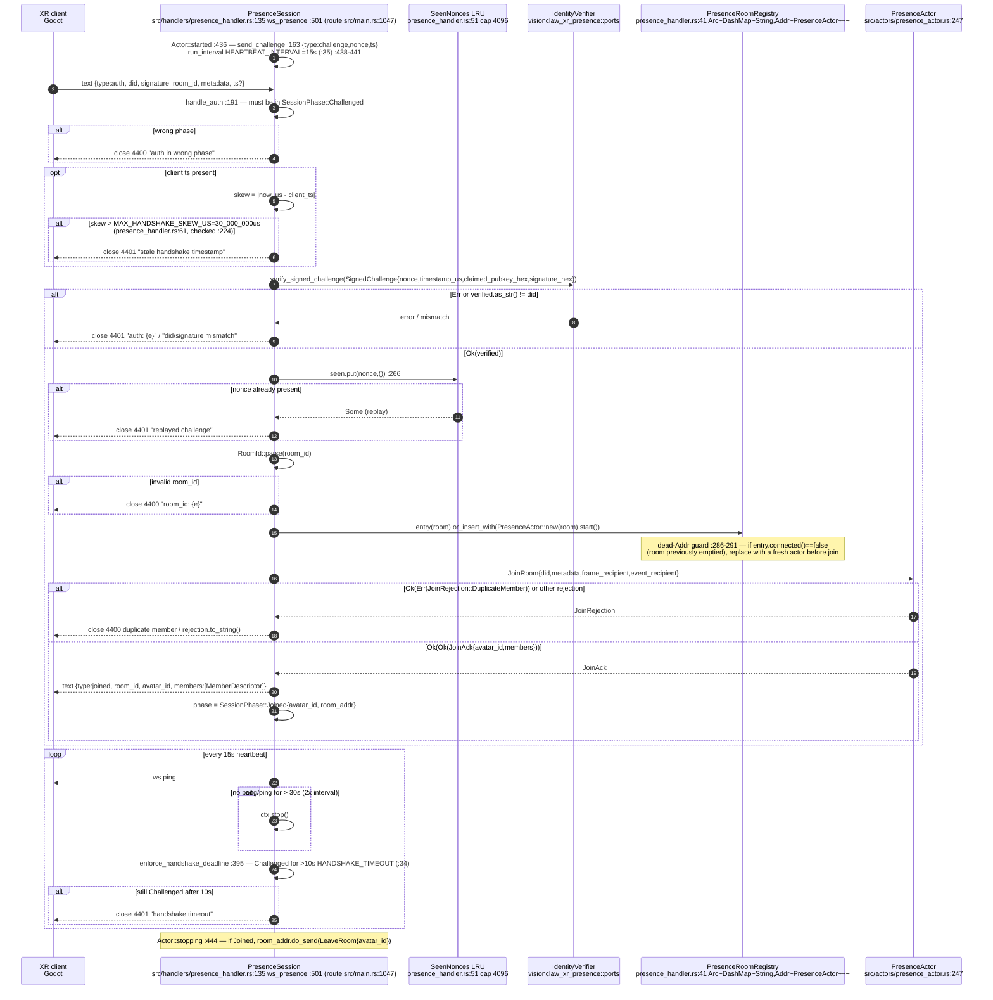
```mermaid
sequenceDiagram
    autonumber
    participant C as XR client<br/>Godot
    participant WS as PresenceSession<br/>src/handlers/presence_handler.rs:135 ws_presence :501 (route src/main.rs:1047)
    participant NC as SeenNonces LRU<br/>presence_handler.rs:51 cap 4096
    participant IV as IdentityVerifier<br/>visionclaw_xr_presence::ports
    participant REG as PresenceRoomRegistry<br/>presence_handler.rs:41 Arc~DashMap~String,Addr~PresenceActor~~~
    participant PA as PresenceActor<br/>src/actors/presence_actor.rs:247

    WS->>WS: Actor::started :436 — send_challenge :163 {type:challenge,nonce,ts}<br/>run_interval HEARTBEAT_INTERVAL=15s (:35) :438-441
    C->>WS: text {type:auth, did, signature, room_id, metadata, ts?}
    WS->>WS: handle_auth :191 — must be in SessionPhase::Challenged
    alt wrong phase
        WS-->>C: close 4400 "auth in wrong phase"
    end
    opt client ts present
        WS->>WS: skew = |now_us - client_ts|
        alt skew > MAX_HANDSHAKE_SKEW_US=30_000_000us (presence_handler.rs:61, checked :224)
            WS-->>C: close 4401 "stale handshake timestamp"
        end
    end
    WS->>IV: verify_signed_challenge(SignedChallenge{nonce,timestamp_us,claimed_pubkey_hex,signature_hex})
    alt Err or verified.as_str() != did
        IV-->>WS: error / mismatch
        WS-->>C: close 4401 "auth: {e}" / "did/signature mismatch"
    else Ok(verified)
        WS->>NC: seen.put(nonce,()) :266
        alt nonce already present
            NC-->>WS: Some (replay)
            WS-->>C: close 4401 "replayed challenge"
        end
        WS->>WS: RoomId::parse(room_id)
        alt invalid room_id
            WS-->>C: close 4400 "room_id: {e}"
        end
        WS->>REG: entry(room).or_insert_with(PresenceActor::new(room).start())
        Note over REG: dead-Addr guard :286-291 — if entry.connected()==false<br/>(room previously emptied), replace with a fresh actor before join
        WS->>PA: JoinRoom{did,metadata,frame_recipient,event_recipient}
        alt Ok(Err(JoinRejection::DuplicateMember)) or other rejection
            PA-->>WS: JoinRejection
            WS-->>C: close 4400 duplicate member / rejection.to_string()
        else Ok(Ok(JoinAck{avatar_id,members}))
            PA-->>WS: JoinAck
            WS-->>C: text {type:joined, room_id, avatar_id, members:[MemberDescriptor]}
            WS->>WS: phase = SessionPhase::Joined{avatar_id, room_addr}
        end
    end
    loop every 15s heartbeat
        WS->>C: ws ping
        alt no pong/ping for > 30s (2x interval)
            WS->>WS: ctx.stop()
        end
        WS->>WS: enforce_handshake_deadline :395 — Challenged for >10s HANDSHAKE_TIMEOUT (:34)
        alt still Challenged after 10s
            WS-->>C: close 4401 "handshake timeout"
        end
    end
    Note over WS: Actor::stopping :444 — if Joined, room_addr.do_send(LeaveRoom{avatar_id})
```

## VC-05.5 `presence_handler`/`PresenceActor` — binary pose frame ingest and broadcast
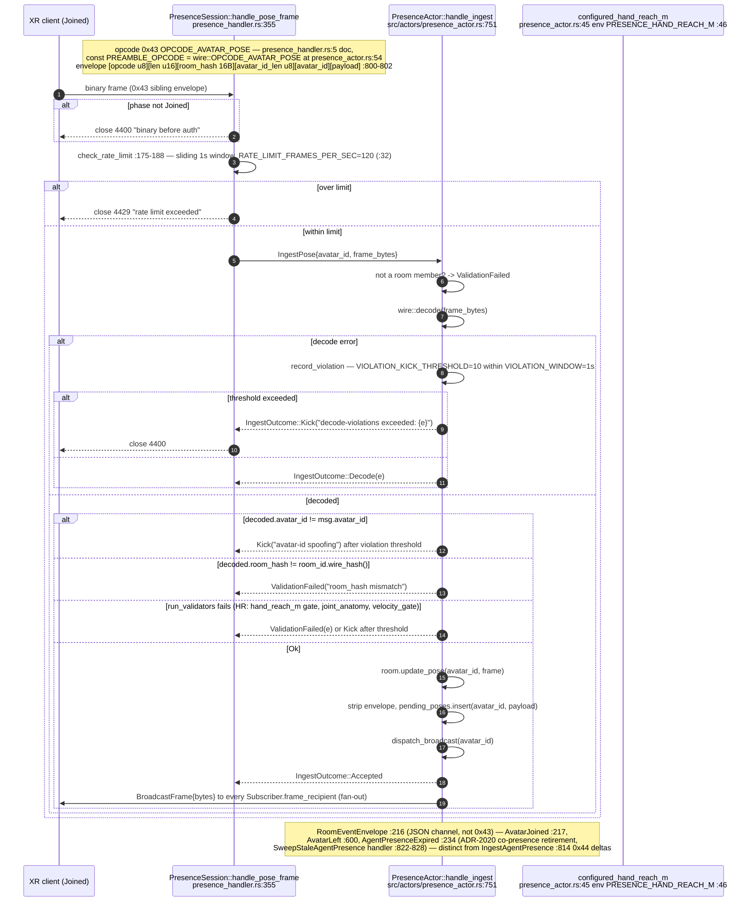
```mermaid
sequenceDiagram
    autonumber
    participant C as XR client (Joined)
    participant WS as PresenceSession::handle_pose_frame<br/>presence_handler.rs:355
    participant PA as PresenceActor::handle_ingest<br/>src/actors/presence_actor.rs:751
    participant HR as configured_hand_reach_m<br/>presence_actor.rs:45 env PRESENCE_HAND_REACH_M :46

    Note over WS: opcode 0x43 OPCODE_AVATAR_POSE — presence_handler.rs:5 doc,<br/>const PREAMBLE_OPCODE = wire::OPCODE_AVATAR_POSE at presence_actor.rs:54<br/>envelope [opcode u8][len u16][room_hash 16B][avatar_id_len u8][avatar_id][payload] :800-802
    C->>WS: binary frame (0x43 sibling envelope)
    alt phase not Joined
        WS-->>C: close 4400 "binary before auth"
    end
    WS->>WS: check_rate_limit :175-188 — sliding 1s window, RATE_LIMIT_FRAMES_PER_SEC=120 (:32)
    alt over limit
        WS-->>C: close 4429 "rate limit exceeded"
    else within limit
        WS->>PA: IngestPose{avatar_id, frame_bytes}
        PA->>PA: not a room member? -> ValidationFailed
        PA->>PA: wire::decode(frame_bytes)
        alt decode error
            PA->>PA: record_violation — VIOLATION_KICK_THRESHOLD=10 within VIOLATION_WINDOW=1s
            alt threshold exceeded
                PA-->>WS: IngestOutcome::Kick("decode-violations exceeded: {e}")
                WS-->>C: close 4400
            else
                PA-->>WS: IngestOutcome::Decode(e)
            end
        else decoded
            alt decoded.avatar_id != msg.avatar_id
                PA-->>WS: Kick("avatar-id spoofing") after violation threshold
            else decoded.room_hash != room_id.wire_hash()
                PA-->>WS: ValidationFailed("room_hash mismatch")
            else run_validators fails (HR: hand_reach_m gate, joint_anatomy, velocity_gate)
                PA-->>WS: ValidationFailed(e) or Kick after threshold
            else Ok
                PA->>PA: room.update_pose(avatar_id, frame)
                PA->>PA: strip envelope, pending_poses.insert(avatar_id, payload)
                PA->>PA: dispatch_broadcast(avatar_id)
                PA-->>WS: IngestOutcome::Accepted
                PA->>C: BroadcastFrame{bytes} to every Subscriber.frame_recipient (fan-out)
            end
        end
    end
    Note over PA: RoomEventEnvelope :216 (JSON channel, not 0x43) — AvatarJoined :217,<br/>AvatarLeft :600, AgentPresenceExpired :234 (ADR-2020 co-presence retirement,<br/>SweepStaleAgentPresence handler :822-828) — distinct from IngestAgentPresence :814 0x44 deltas
```

## VC-05.6 `decision_handler` — record (authed, append-only) / trace (anon, bounded)
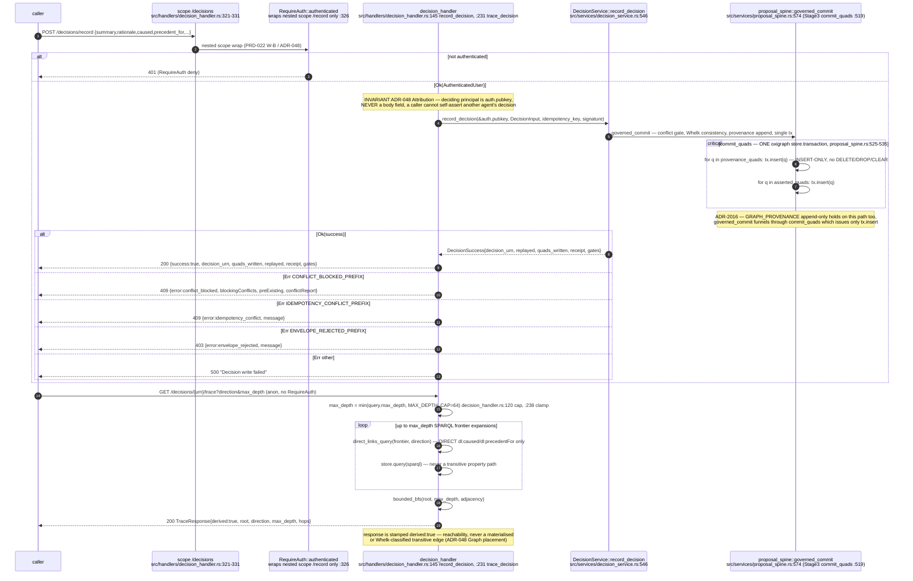
```mermaid
sequenceDiagram
    autonumber
    participant C as caller
    participant SC as scope /decisions<br/>src/handlers/decision_handler.rs:321-331
    participant RA as RequireAuth::authenticated<br/>wraps nested scope /record only :326
    participant H as decision_handler<br/>src/handlers/decision_handler.rs:145 record_decision, :231 trace_decision
    participant DS as DecisionService::record_decision<br/>src/services/decision_service.rs:546
    participant SP as proposal_spine::governed_commit<br/>src/services/proposal_spine.rs:574 (Stage3 commit_quads :519)

    C->>SC: POST /decisions/record {summary,rationale,caused,precedent_for,...}
    SC->>RA: nested scope wrap (PRD-022 W-B / ADR-048)
    alt not authenticated
        RA-->>C: 401 (RequireAuth deny)
    else Ok(AuthenticatedUser)
        Note over H: INVARIANT ADR-048 Attribution — deciding principal is auth.pubkey,<br/>NEVER a body field, a caller cannot self-assert another agent's decision
        H->>DS: record_decision(&auth.pubkey, DecisionInput, idempotency_key, signature)
        DS->>SP: governed_commit — conflict gate, Whelk consistency, provenance append, single tx
        critical commit_quads — ONE oxigraph store.transaction, proposal_spine.rs:525-535
            SP->>SP: for q in provenance_quads: tx.insert(q) — INSERT-ONLY, no DELETE/DROP/CLEAR
            SP->>SP: for q in asserted_quads: tx.insert(q)
        end
        Note over SP: ADR-2016 — GRAPH_PROVENANCE append-only holds on this path too,<br/>governed_commit funnels through commit_quads which issues only tx.insert
        alt Ok(success)
            DS-->>H: DecisionSuccess{decision_urn, replayed, quads_written, receipt, gates}
            H-->>C: 200 {success:true, decision_urn, quads_written, replayed, receipt, gates}
        else Err CONFLICT_BLOCKED_PREFIX
            H-->>C: 409 {error:conflict_blocked, blockingConflicts, preExisting, conflictReport}
        else Err IDEMPOTENCY_CONFLICT_PREFIX
            H-->>C: 409 {error:idempotency_conflict, message}
        else Err ENVELOPE_REJECTED_PREFIX
            H-->>C: 403 {error:envelope_rejected, message}
        else Err other
            H-->>C: 500 "Decision write failed"
        end
    end
    C->>H: GET /decisions/{urn}/trace?direction&max_depth (anon, no RequireAuth)
    H->>H: max_depth = min(query.max_depth, MAX_DEPTH_CAP=64) decision_handler.rs:120 cap, :238 clamp
    loop up to max_depth SPARQL frontier expansions
        H->>H: direct_links_query(frontier, direction) — DIRECT dl:caused/dl:precedentFor only
        H->>H: store.query(sparql) — never a transitive property path
    end
    H->>H: bounded_bfs(root, max_depth, adjacency)
    H-->>C: 200 TraceResponse{derived:true, root, direction, max_depth, hops}
    Note over H: response is stamped derived:true — reachability, never a materialised<br/>or Whelk-classified transitive edge (ADR-048 Graph placement)
```

## VC-05.7 shared enrichment-decide core (ADR-2006 / ADR-130 Decision 2) — three callers, one path
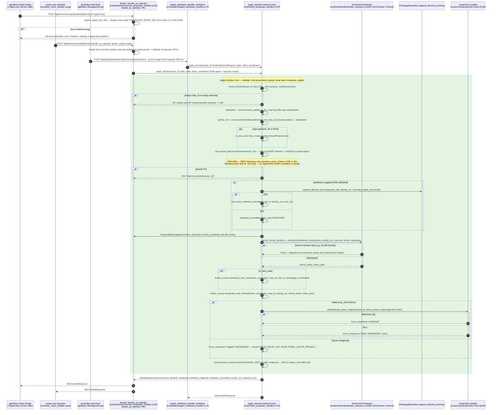
```mermaid
sequenceDiagram
    autonumber
    participant AB as agentbox broker-bridge<br/>X-Agent-Key service caller
    participant OP as power-user operator<br/>via broker_inbox_handler scope
    participant GB as git-bridge write-back<br/>agentbox management-api
    participant D as decide / decide_as_operator<br/>src/handlers/enrichment_proposals_handler.rs:321<br/>decide_as_operator :351
    participant WB as ingest_writeback_handler::writeback<br/>src/handlers/ingest_writeback_handler.rs:75
    participant AD as apply_decision (shared core)<br/>enrichment_proposals_handler.rs:370
    participant OK as DecisionOrchestrator<br/>src/domain/broker/broker_decision.rs (ADR-130 Decision 2 kernel)
    participant OX as OntologyRepository::append_derived_summary
    participant FR as AcspClient::publish<br/>src/services/acsp/mod.rs kind 31403

    AB->>D: POST /api/enrichment-proposals/{id}/decide (X-Agent-Key)
    D->>D: require_agent_key :165 — header must equal VISIONCLAW_AGENT_KEY (env read :171, ADR-2093)
    alt key invalid/missing
        D-->>AB: 401 {success:false, error:"Invalid or missing X-Agent-Key header"}
    end
    OP->>D: POST /api/broker/cases/{id}/decide (decide_as_operator, power_user() scope)
    D->>D: if body has no broker_pubkey and user.pubkey is canonical hex -> attribute to operator (HITL)
    GB->>WB: POST /api/ingest/writeback {decision:{caseId,decision,...}} (no X-Agent-Key required, GOV-4)
    WB->>AD: apply_decision(case_id, BrokerDecisionRequest, state, client_coordinator)
    D->>AD: apply_decision(case_id, body, state, client_coordinator) (both agent + operator routes)
    rect rgb(225,245,225)
    Note over AD: single decision core — validate, mint provenance, persist, write-back, broadcast, project
    AD->>AD: record_decision(case_id, req) :376 — trim outcome, classify(outcome)
    alt empty case_id or empty outcome
        AD-->>D: Err "empty case id"/"empty decision outcome" -> 400
    end
    AD->>AD: attribution — 64-hex broker_pubkey -> did_nostr+kg URN, else unattributed
    AD->>AD: activity_urn = uri::execution(content-addressed over case_id,outcome,pubkey) — idempotent
    opt repo.get(case_id) is None
        AD->>AD: is_new_case=true, create pending StoredProposal stub
    end
    AD->>AD: repo.record_decision(StoredDecision) :431 — atomic INSERT decision + UPDATE proposal.status
    Note over AD: ADR-2006 — REST decisions carry decision_event_id:None (:428, in the<br/>StoredDecision built at :413-430) — no signed kind-31403 correlation is stored
    alt persist Err
        AD-->>D: 500 "failed to persist decision: {e}"
    end
    alt writeback_triggered AND attributed
        AD->>OX: append_derived_summary(owner_did, activity_urn, summary_triples_for(record))
        alt Ok
            AD->>AD: repo.mark_writeback_committed(case_id, activity_urn, now_ms)
        else Err
            AD->>AD: writeback_committed=false, warn DEGRADED
        end
    end
    AD->>D: BroadcastMessage{enrichment_decision} to client_coordinator (all WS clients)
    AD->>OK: derive_kernel_decision — DecisionOrchestrator::decide(case, activity_urn, outcome, broker, reasoning)
    alt kernel invariant note (e.g. no-self-review)
        OK-->>AD: Err(e) -> degrade to raw outcome string, warn (record-don't-reject)
    else Ok(report)
        OK-->>AD: kernel_action, share_plan
    end
    opt is_new_case
        AD->>AD: broker_events::broadcast_new_case(client_coordinator, case_id, case_id, knowledge_enrichment)
    end
    AD->>AD: broker_events::broadcast_case_decided(client_coordinator, case_id, activity_urn, kernel_action, share_plan)
    alt state.acsp_client Some
        AD->>FR: publish(build_action_response(case_id, kernel_action, reasoning)) kind 31403
        alt Ok(event_id)
            FR-->>AD: forum_projection="published"
        else Err
            FR-->>AD: forum_projection="failed" (DEGRADED, warn)
        end
    else None configured
        AD->>AD: forum_projection="skipped" (DEGRADED — needs FORUM_RELAY_URL+ACSP_PANEL_NOSTR_PRIVKEY)
    end
    AD->>AD: state.liveness_harness.observe(CANARY_REC2_CASE, evidence) — REC-2 canary, real traffic only
    end
    AD-->>D: DecideResponse{success:true, decision, attributed, writeback_triggered, writeback_committed, activity_urn, proposal_urn}
    D-->>AB: 200 DecideResponse
    D-->>OP: 200 DecideResponse
    AD-->>WB: 200 DecideResponse
```

## VC-05.8 `broker_inbox_handler` — dedicated privileged read scope (WS-12)
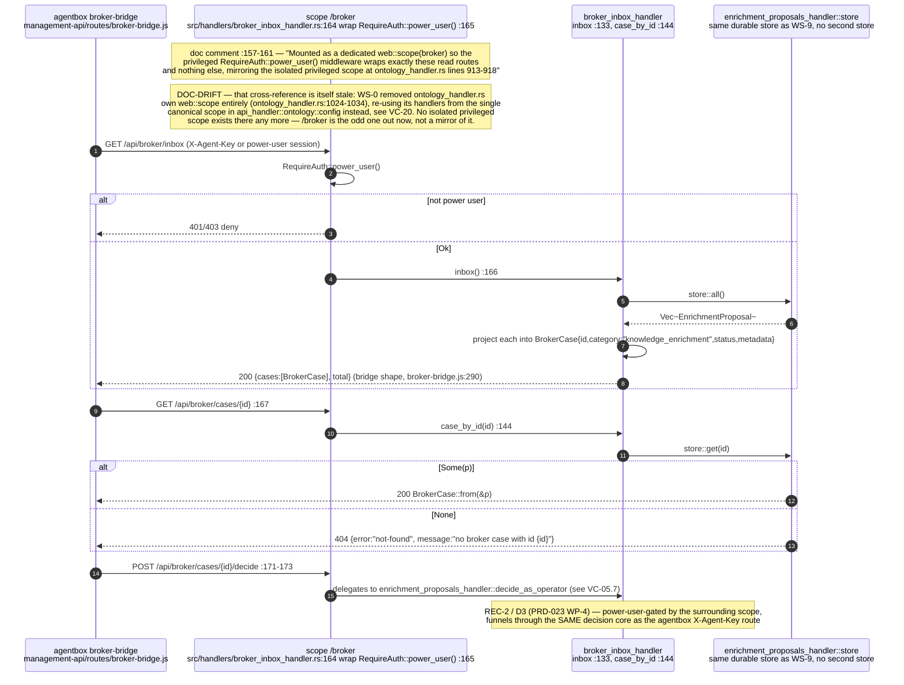
```mermaid
sequenceDiagram
    autonumber
    participant C as agentbox broker-bridge<br/>management-api/routes/broker-bridge.js
    participant SC as scope /broker<br/>src/handlers/broker_inbox_handler.rs:164 wrap RequireAuth::power_user() :165
    participant H as broker_inbox_handler<br/>inbox :133, case_by_id :144
    participant ST as enrichment_proposals_handler::store<br/>same durable store as WS-9, no second store

    Note over SC: doc comment :157-161 — "Mounted as a dedicated web::scope(broker) so the<br/>privileged RequireAuth::power_user() middleware wraps exactly these read routes<br/>and nothing else, mirroring the isolated privileged scope at ontology_handler.rs lines 913-918"
    Note over SC: DOC-DRIFT — that cross-reference is itself stale: WS-0 removed ontology_handler.rs<br/>own web::scope entirely (ontology_handler.rs:1024-1034), re-using its handlers from the single<br/>canonical scope in api_handler::ontology::config instead, see VC-20. No isolated privileged<br/>scope exists there any more — /broker is the odd one out now, not a mirror of it.
    C->>SC: GET /api/broker/inbox (X-Agent-Key or power-user session)
    SC->>SC: RequireAuth::power_user()
    alt not power user
        SC-->>C: 401/403 deny
    else Ok
        SC->>H: inbox() :166
        H->>ST: store::all()
        ST-->>H: Vec~EnrichmentProposal~
        H->>H: project each into BrokerCase{id,category:"knowledge_enrichment",status,metadata}
        H-->>C: 200 {cases:[BrokerCase], total} (bridge shape, broker-bridge.js:290)
    end
    C->>SC: GET /api/broker/cases/{id} :167
    SC->>H: case_by_id(id) :144
    H->>ST: store::get(id)
    alt Some(p)
        ST-->>C: 200 BrokerCase::from(&p)
    else None
        ST-->>C: 404 {error:"not-found", message:"no broker case with id {id}"}
    end
    C->>SC: POST /api/broker/cases/{id}/decide :171-173
    SC->>H: delegates to enrichment_proposals_handler::decide_as_operator (see VC-05.7)
    Note over H: REC-2 / D3 (PRD-023 WP-4) — power-user-gated by the surrounding scope,<br/>funnels through the SAME decision core as the agentbox X-Agent-Key route
```

## VC-05.9 `briefing_handler` — brief submit / debrief, Management API bridge
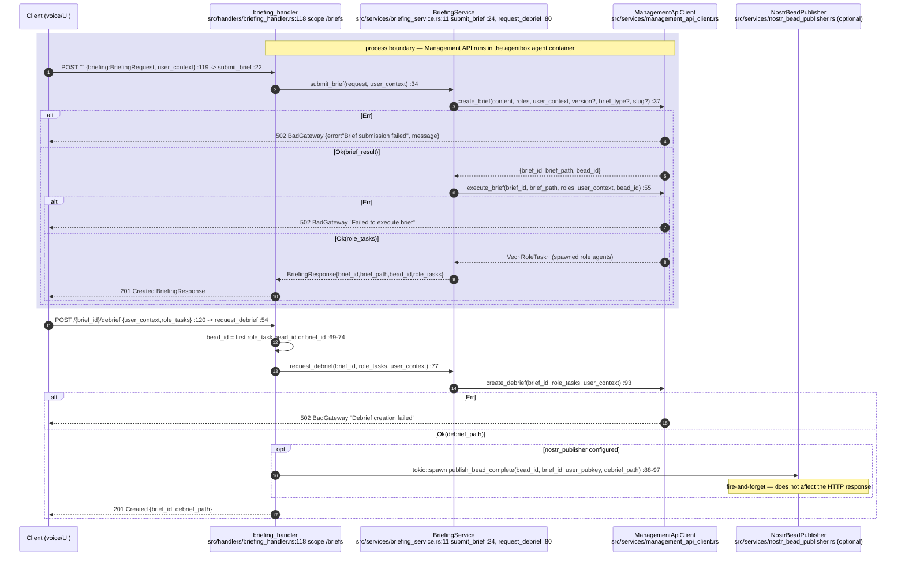
```mermaid
sequenceDiagram
    autonumber
    participant C as Client (voice/UI)
    participant H as briefing_handler<br/>src/handlers/briefing_handler.rs:118 scope /briefs
    participant BS as BriefingService<br/>src/services/briefing_service.rs:11 submit_brief :24, request_debrief :80
    participant MA as ManagementApiClient<br/>src/services/management_api_client.rs
    participant NB as NostrBeadPublisher<br/>src/services/nostr_bead_publisher.rs (optional)

    rect rgb(225,225,245)
    Note over H,MA: process boundary — Management API runs in the agentbox agent container
    C->>H: POST "" {briefing:BriefingRequest, user_context} :119 -> submit_brief :22
    H->>BS: submit_brief(request, user_context) :34
    BS->>MA: create_brief(content, roles, user_context, version?, brief_type?, slug?) :37
    alt Err
        MA-->>C: 502 BadGateway {error:"Brief submission failed", message}
    else Ok(brief_result)
        MA-->>BS: {brief_id, brief_path, bead_id}
        BS->>MA: execute_brief(brief_id, brief_path, roles, user_context, bead_id) :55
        alt Err
            MA-->>C: 502 BadGateway "Failed to execute brief"
        else Ok(role_tasks)
            MA-->>BS: Vec~RoleTask~ (spawned role agents)
            BS-->>H: BriefingResponse{brief_id,brief_path,bead_id,role_tasks}
            H-->>C: 201 Created BriefingResponse
        end
    end
    end
    C->>H: POST /{brief_id}/debrief {user_context,role_tasks} :120 -> request_debrief :54
    H->>H: bead_id = first role_task.bead_id or brief_id :69-74
    H->>BS: request_debrief(brief_id, role_tasks, user_context) :77
    BS->>MA: create_debrief(brief_id, role_tasks, user_context) :93
    alt Err
        MA-->>C: 502 BadGateway "Debrief creation failed"
    else Ok(debrief_path)
        opt nostr_publisher configured
            H->>NB: tokio::spawn publish_bead_complete(bead_id, brief_id, user_pubkey, debrief_path) :88-97
            Note over NB: fire-and-forget — does not affect the HTTP response
        end
        H-->>C: 201 Created {brief_id, debrief_path}
    end
```

## VC-05.10 `insight_loop_handler` — REC-10 Mesh Velocity trace reads
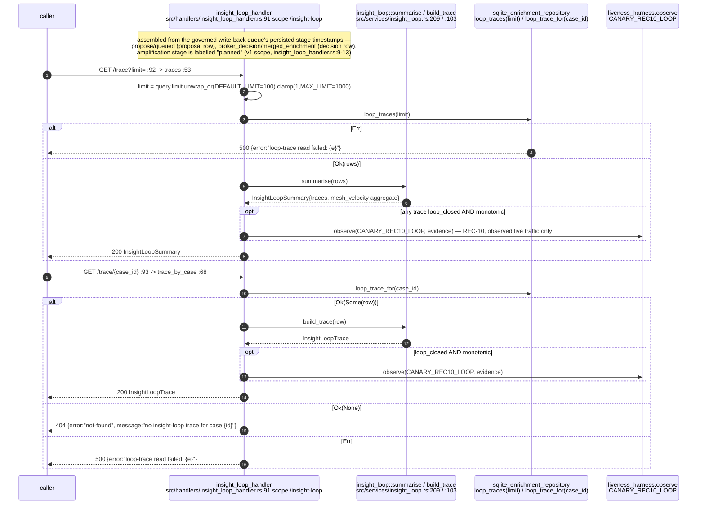
```mermaid
sequenceDiagram
    autonumber
    participant C as caller
    participant H as insight_loop_handler<br/>src/handlers/insight_loop_handler.rs:91 scope /insight-loop
    participant IL as insight_loop::summarise / build_trace<br/>src/services/insight_loop.rs:209 / :103
    participant DB as sqlite_enrichment_repository<br/>loop_traces(limit) / loop_trace_for(case_id)
    participant LH as liveness_harness.observe<br/>CANARY_REC10_LOOP

    Note over H: assembled from the governed write-back queue's persisted stage timestamps —<br/>propose/queued (proposal row), broker_decision/merged_enrichment (decision row).<br/>amplification stage is labelled "planned" (v1 scope, insight_loop_handler.rs:9-13)
    C->>H: GET /trace?limit= :92 -> traces :53
    H->>H: limit = query.limit.unwrap_or(DEFAULT_LIMIT=100).clamp(1,MAX_LIMIT=1000)
    H->>DB: loop_traces(limit)
    alt Err
        DB-->>C: 500 {error:"loop-trace read failed: {e}"}
    else Ok(rows)
        H->>IL: summarise(rows)
        IL-->>H: InsightLoopSummary{traces, mesh_velocity aggregate}
        opt any trace loop_closed AND monotonic
            H->>LH: observe(CANARY_REC10_LOOP, evidence) — REC-10, observed live traffic only
        end
        H-->>C: 200 InsightLoopSummary
    end
    C->>H: GET /trace/{case_id} :93 -> trace_by_case :68
    H->>DB: loop_trace_for(case_id)
    alt Ok(Some(row))
        H->>IL: build_trace(row)
        IL-->>H: InsightLoopTrace
        opt loop_closed AND monotonic
            H->>LH: observe(CANARY_REC10_LOOP, evidence)
        end
        H-->>C: 200 InsightLoopTrace
    else Ok(None)
        H-->>C: 404 {error:"not-found", message:"no insight-loop trace for case {id}"}
    else Err
        H-->>C: 500 {error:"loop-trace read failed: {e}"}
    end
```

## VC-05.11 `memory_flash_handler` — RuVector-access notification relay to WS clients
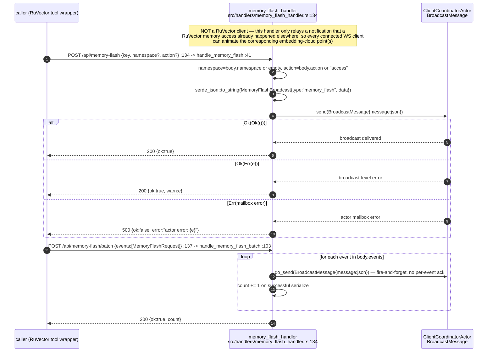
```mermaid
sequenceDiagram
    autonumber
    participant C as caller (RuVector tool wrapper)
    participant H as memory_flash_handler<br/>src/handlers/memory_flash_handler.rs:134
    participant CC as ClientCoordinatorActor<br/>BroadcastMessage

    Note over H: NOT a RuVector client — this handler only relays a notification that a<br/>RuVector memory access already happened elsewhere, so every connected WS client<br/>can animate the corresponding embedding-cloud point(s)
    C->>H: POST /api/memory-flash {key, namespace?, action?} :134 -> handle_memory_flash :41
    H->>H: namespace=body.namespace or empty, action=body.action or "access"
    H->>H: serde_json::to_string(MemoryFlashBroadcast{type:"memory_flash", data})
    H->>CC: send(BroadcastMessage{message:json})
    alt Ok(Ok(()))
        CC-->>H: broadcast delivered
        H-->>C: 200 {ok:true}
    else Ok(Err(e))
        CC-->>H: broadcast-level error
        H-->>C: 200 {ok:true, warn:e}
    else Err(mailbox error)
        CC-->>H: actor mailbox error
        H-->>C: 500 {ok:false, error:"actor error: {e}"}
    end
    C->>H: POST /api/memory-flash/batch {events:[MemoryFlashRequest]} :137 -> handle_memory_flash_batch :103
    loop for each event in body.events
        H->>CC: do_send(BroadcastMessage{message:json}) — fire-and-forget, no per-event ack
        H->>H: count += 1 on successful serialize
    end
    H-->>C: 200 {ok:true, count}
```

## VC-05.12 `mcp_relay_handler` — `/ws/mcp-relay` bidirectional bridge to the orchestrator
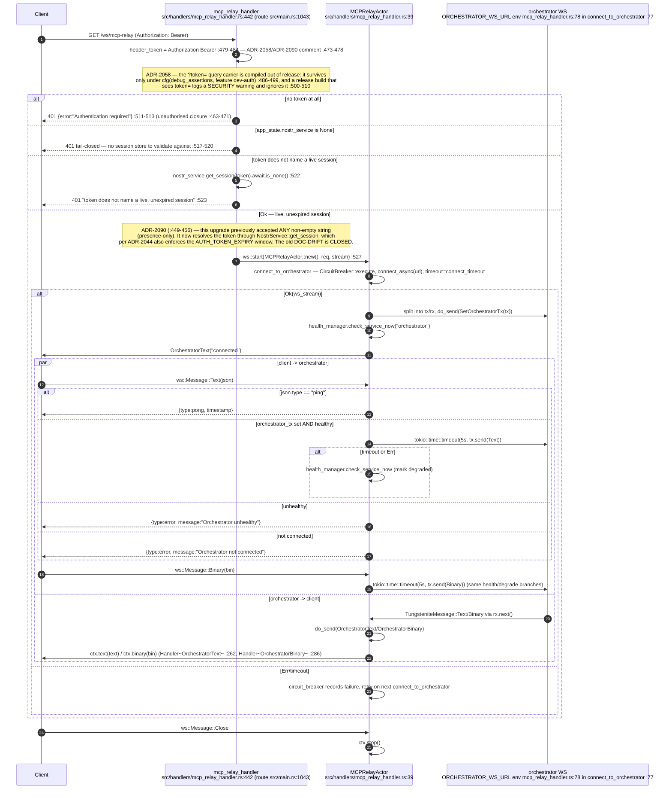
```mermaid
sequenceDiagram
    autonumber
    participant C as Client
    participant H as mcp_relay_handler<br/>src/handlers/mcp_relay_handler.rs:442 (route src/main.rs:1043)
    participant A as MCPRelayActor<br/>src/handlers/mcp_relay_handler.rs:39
    participant O as orchestrator WS<br/>ORCHESTRATOR_WS_URL env mcp_relay_handler.rs:78 in connect_to_orchestrator :77

    C->>H: GET /ws/mcp-relay (Authorization: Bearer)
    H->>H: header_token = Authorization Bearer :479-484 — ADR-2058/ADR-2090 comment :473-478
    Note over H: ADR-2058 — the ?token= query carrier is compiled out of release: it survives<br/>only under cfg(debug_assertions, feature dev-auth) :486-499, and a release build that<br/>sees token= logs a SECURITY warning and ignores it :500-510
    alt no token at all
        H-->>C: 401 {error:"Authentication required"} :511-513 (unauthorised closure :463-471)
    else app_state.nostr_service is None
        H-->>C: 401 fail-closed — no session store to validate against :517-520
    else token does not name a live session
        H->>H: nostr_service.get_session(token).await.is_none() :522
        H-->>C: 401 "token does not name a live, unexpired session" :523
    else Ok — live, unexpired session
        Note over H: ADR-2090 (:449-456) — this upgrade previously accepted ANY non-empty string<br/>(presence-only). It now resolves the token through NostrService::get_session, which<br/>per ADR-2044 also enforces the AUTH_TOKEN_EXPIRY window. The old DOC-DRIFT is CLOSED.
        H->>A: ws::start(MCPRelayActor::new(), req, stream) :527
        A->>A: connect_to_orchestrator — CircuitBreaker::execute, connect_async(url), timeout=connect_timeout
        alt Ok(ws_stream)
            A->>O: split into tx/rx, do_send(SetOrchestratorTx(tx))
            A->>A: health_manager.check_service_now("orchestrator")
            A->>C: OrchestratorText("connected")
            par client -> orchestrator
                C->>A: ws::Message::Text(json)
                alt json.type == "ping"
                    A-->>C: {type:pong, timestamp}
                else orchestrator_tx set AND healthy
                    A->>O: tokio::time::timeout(5s, tx.send(Text))
                    alt timeout or Err
                        A->>A: health_manager.check_service_now (mark degraded)
                    end
                else unhealthy
                    A-->>C: {type:error, message:"Orchestrator unhealthy"}
                else not connected
                    A-->>C: {type:error, message:"Orchestrator not connected"}
                end
                C->>A: ws::Message::Binary(bin)
                A->>O: tokio::time::timeout(5s, tx.send(Binary)) (same health/degrade branches)
            and orchestrator -> client
                O->>A: TungsteniteMessage::Text/Binary via rx.next()
                A->>A: do_send(OrchestratorText/OrchestratorBinary)
                A->>C: ctx.text(text) / ctx.binary(bin) (Handler~OrchestratorText~ :262, Handler~OrchestratorBinary~ :286)
            end
        else Err/timeout
            A->>A: circuit_breaker records failure, retry on next connect_to_orchestrator
        end
    end
    C->>A: ws::Message::Close
    A->>A: ctx.stop()
```

## VC-05.13 `multi_mcp_websocket_handler` — `/multi-mcp/ws` only, `/status` + `/refresh` deleted (ADR-2091)
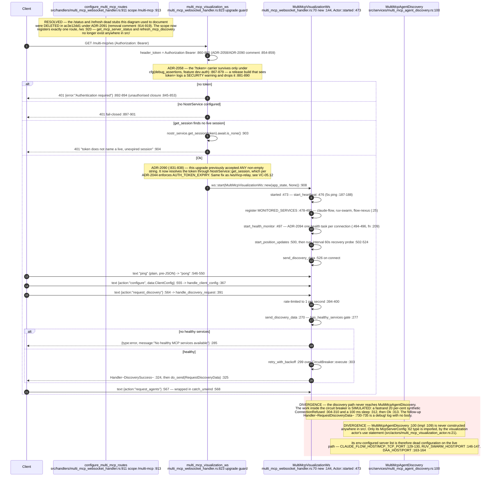
```mermaid
sequenceDiagram
    autonumber
    participant C as Client
    participant H as configure_multi_mcp_routes<br/>src/handlers/multi_mcp_websocket_handler.rs:911 scope /multi-mcp :913
    participant U as multi_mcp_visualization_ws<br/>multi_mcp_websocket_handler.rs:823 upgrade guard
    participant WS as MultiMcpVisualizationWs<br/>multi_mcp_websocket_handler.rs:70 new :144, Actor::started :473
    participant DS as MultiMcpAgentDiscovery<br/>src/services/multi_mcp_agent_discovery.rs:100

    Note over H: RESOLVED — the /status and /refresh dead stubs this diagram used to document<br/>were DELETED in ac3e12dd1 under ADR-2091 (removal comment :914-919). The scope now<br/>registers exactly one route, /ws :920 — get_mcp_server_status and refresh_mcp_discovery<br/>no longer exist anywhere in src/
    C->>U: GET /multi-mcp/ws (Authorization: Bearer)
    U->>U: header_token = Authorization Bearer :860-865 (ADR-2058/ADR-2090 comment :854-859)
    Note over U: ADR-2058 — the ?token= carrier survives only under<br/>cfg(debug_assertions, feature dev-auth) :867-879 — a release build that sees<br/>token= logs a SECURITY warning and drops it :881-890
    alt no token
        U-->>C: 401 {error:"Authentication required"} :892-894 (unauthorised closure :845-853)
    else no NostrService configured
        U-->>C: 401 fail-closed :897-901
    else get_session finds no live session
        U->>U: nostr_service.get_session(token).await.is_none() :903
        U-->>C: 401 "token does not name a live, unexpired session" :904
    else Ok
        Note over U: ADR-2090 (:831-838) — this upgrade previously accepted ANY non-empty<br/>string. It now resolves the token through NostrService::get_session, which per<br/>ADR-2044 enforces AUTH_TOKEN_EXPIRY. Same fix as /ws/mcp-relay, see VC-05.12
        U->>WS: ws::start(MultiMcpVisualizationWs::new(app_state, None)) :908
        WS->>WS: started :473 — start_heartbeat :476 (5s ping :187-188)
        WS->>WS: register MONITORED_SERVICES :478-492 — claude-flow, ruv-swarm, flow-nexus (:25)
        WS->>WS: start_health_monitor :497 — ADR-2094 one health task per connection (:494-496, fn :209)
        WS->>WS: start_position_updates :500, then run_interval 60s recovery probe :502-524
        WS->>WS: send_discovery_data :526 on connect
        C->>WS: text "ping" (plain, pre-JSON) -> "pong" :546-550
        C->>WS: text {action:"configure", data:ClientConfig} :555 -> handle_client_config :367
        C->>WS: text {action:"request_discovery"} :564 -> handle_discovery_request :391
        WS->>WS: rate-limited to 1 per second :394-400
        WS->>WS: send_discovery_data :270 — has_healthy_services gate :277
        alt no healthy services
            WS-->>C: {type:error, message:"No healthy MCP services available"} :285
        else healthy
            WS->>WS: retry_with_backoff :299 over CircuitBreaker::execute :303
            WS-->>C: Handler~DiscoverySuccess~ :324, then do_send(RequestDiscoveryData) :325
        end
        C->>WS: text {action:"request_agents"} :567 — wrapped in catch_unwind :568
    end
    rect rgb(255,235,235)
    Note over WS,DS: DIVERGENCE — the discovery path never reaches MultiMcpAgentDiscovery.<br/>The work inside the circuit breaker is SIMULATED: a fastrand 20 per-cent synthetic<br/>ConnectionRefused :304-310 and a 100 ms sleep :312, then Ok :313. The follow-up<br/>Handler~RequestDiscoveryData~ :730-735 is a debug! log with no body.
    Note over DS: DIVERGENCE — MultiMcpAgentDiscovery :100 (impl :109) is never constructed<br/>anywhere in src/. Only its McpServerConfig :62 type is imported, by the visualization<br/>actor's use statement (src/actors/multi_mcp_visualization_actor.rs:21).
    Note over DS: its env-configured server list is therefore dead configuration on the live<br/>path — CLAUDE_FLOW_HOST/MCP_TCP_PORT :129-130, RUV_SWARM_HOST/PORT :146-147,<br/>DAA_HOST/PORT :163-164
    end
```

## VC-05.14 `ontology_agent_handler` — MCP tool surface + `/propose` governance door
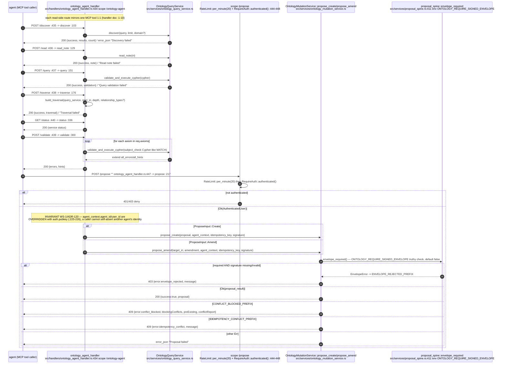
```mermaid
sequenceDiagram
    autonumber
    participant AG as agent (MCP tool caller)
    participant H as ontology_agent_handler<br/>src/handlers/ontology_agent_handler.rs:434 scope /ontology-agent
    participant QS as OntologyQueryService<br/>src/services/ontology_query_service.rs
    participant PS as scope /propose<br/>RateLimit::per_minute(20) + RequireAuth::authenticated() :444-448
    participant MS as OntologyMutationService::propose_create/propose_amend<br/>src/services/ontology_mutation_service.rs
    participant SP as proposal_spine::envelope_required<br/>src/services/proposal_spine.rs:411 env ONTOLOGY_REQUIRE_SIGNED_ENVELOPE

    Note over H: each read-side route mirrors one MCP tool 1:1 (handler doc :1-10)
    AG->>H: POST /discover :435 -> discover :103
    H->>QS: discover(query, limit, domain?)
    QS-->>AG: 200 {success, results, count} / error_json "Discovery failed"
    AG->>H: POST /read :436 -> read_note :129
    H->>QS: read_note(iri)
    QS-->>AG: 200 {success, note} / "Read note failed"
    AG->>H: POST /query :437 -> query :151
    H->>QS: validate_and_execute_cypher(cypher)
    QS-->>AG: 200 {success, validation} / "Query validation failed"
    AG->>H: POST /traverse :438 -> traverse :176
    H->>H: build_traversal(query_service, start_iri, depth, relationship_types?)
    H-->>AG: 200 {success, traversal} / "Traversal failed"
    AG->>H: GET /status :440 -> status :336
    H-->>AG: 200 (service status)
    AG->>H: POST /validate :439 -> validate :300
    loop for each axiom in req.axioms
        H->>QS: validate_and_execute_cypher(subject_check Cypher-like MATCH)
        QS-->>H: extend all_errors/all_hints
    end
    H-->>AG: 200 {errors, hints}
    AG->>PS: POST /propose "" ontology_agent_handler.rs:447 -> propose :217
    PS->>PS: RateLimit::per_minute(20) then RequireAuth::authenticated()
    alt not authenticated
        PS-->>AG: 401/403 deny
    else Ok(AuthenticatedUser)
        Note over H: INVARIANT WS-1/ADR-120 — agent_context.agent_id/user_id are<br/>OVERRIDDEN with auth.pubkey (:225-226), a caller cannot self-assert another agent's identity
        alt ProposeInput::Create
            H->>MS: propose_create(proposal, agent_context, idempotency_key, signature)
        else ProposeInput::Amend
            H->>MS: propose_amend(target_iri, amendment, agent_context, idempotency_key, signature)
        end
        MS->>SP: envelope_required() — ONTOLOGY_REQUIRE_SIGNED_ENVELOPE truthy check, default false
        alt required AND signature missing/invalid
            SP-->>MS: EnvelopeError -> ENVELOPE_REJECTED_PREFIX
            MS-->>AG: 403 {error:envelope_rejected, message}
        else Ok(proposal_result)
            MS-->>AG: 200 {success:true, proposal}
        else CONFLICT_BLOCKED_PREFIX
            MS-->>AG: 409 {error:conflict_blocked, blockingConflicts, preExisting, conflictReport}
        else IDEMPOTENCY_CONFLICT_PREFIX
            MS-->>AG: 409 {error:idempotency_conflict, message}
        else other Err
            MS-->>AG: error_json "Proposal failed"
        end
    end
```

## VC-05.15 `solid_proxy_handler` — pod lifecycle, DID resolution, double-auth DIVERGENCE
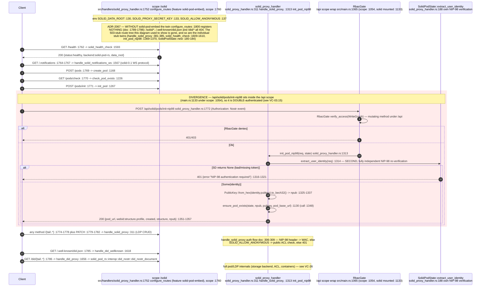
```mermaid
sequenceDiagram
    autonumber
    participant C as Client
    participant SC as scope /solid<br/>src/handlers/solid_proxy_handler.rs:1752 configure_routes (feature solid-pod-embed), scope :1760
    participant H as solid_proxy_handler<br/>solid_proxy_handler.rs:311 handle_solid_proxy, :1313 init_pod_nip98
    participant RG as RbacGate<br/>/api scope wrap src/main.rs:1065 (scope :1054, solid mounted :1133)
    participant SD as SolidPodState::extract_user_identity<br/>solid_proxy_handler.rs:188 own NIP-98 verification

    Note over SC: env SOLID_DATA_ROOT :130, SOLID_PROXY_SECRET_KEY :133, SOLID_ALLOW_ANONYMOUS :137
    Note over SC: ADR-2067 — WITHOUT solid-pod-embed the twin configure_routes :1800 registers<br/>NOTHING (doc :1789-1798): /solid/*, /.well-known/did.json and /did/* all 404. The<br/>503-stub route tree this diagram used to show is gone, and so are the individual<br/>stub twins (handle_solid_proxy :381-385, solid_health_check :1609-1610,<br/>init_pod_nip98 :1369-1370, SolidPodState::new :180-184)
    C->>SC: GET /health :1762 -> solid_health_check :1593
    SC-->>C: 200 {status:healthy, backend:solid-pod-rs, data_root}
    C->>SC: GET /.notifications :1764-1767 -> handle_solid_notifications_ws :1567 (solid-0.1 WS protocol)
    C->>SC: POST /pods :1769 -> create_pod :1168
    C->>SC: GET /pods/check :1770 -> check_pod_exists :1226
    C->>SC: POST /pods/init :1771 -> init_pod :1267
    rect rgb(255,235,235)
    Note over C,SD: DIVERGENCE — /api/solid/pods/init-nip98 sits inside the /api scope<br/>(main.rs:1133 under scope :1054), so it is DOUBLE-authenticated (see VC-03.15)
    C->>RG: POST /api/solid/pods/init-nip98 solid_proxy_handler.rs:1772 (Authorization: Nostr event)
    RG->>RG: RbacGate verify_access(WriteGraph) — mutating method under /api
    alt RbacGate denies
        RG-->>C: 401/403
    else Ok
        RG->>H: init_pod_nip98(req, state) solid_proxy_handler.rs:1313
        H->>SD: extract_user_identity(req) :1314 — SECOND, fully independent NIP-98 re-verification
        alt SD returns None (bad/missing token)
            SD-->>C: 401 {error:"NIP-98 authentication required"} :1316-1321
        else Some(identity)
            H->>H: PublicKey::from_hex(identity.pubkey).to_bech32() -> npub :1325-1337
            H->>H: ensure_pod_exists(state, npub, pubkey, pod_base_url) :1130 (call :1348)
            H-->>C: 200 {pod_url, webid:structure.profile, created, structure, npub} :1351-1357
        end
    end
    end
    C->>SC: any method /{tail:.*} :1774-1778 plus PATCH :1779-1782 -> handle_solid_proxy :311 (LDP CRUD)
    Note over H: handle_solid_proxy auth flow doc :306-309 — NIP-98 header -> WAC, else<br/>SOLID_ALLOW_ANONYMOUS -> public ACL check, else 401
    C->>SC: GET /.well-known/did.json :1785 -> handle_did_wellknown :1618
    C->>SC: GET /did/{tail:.*} :1786 -> handle_did_proxy :1656 -> solid_pod_rs::interop::did_nostr::did_nostr_document
    Note over H: full pod/LDP internals (storage backend, ACL, containers) — see VC-26
```

## VC-05.16 `speech_socket_handler` — `/ws/speech`, ADR-2075 post-upgrade NIP-98
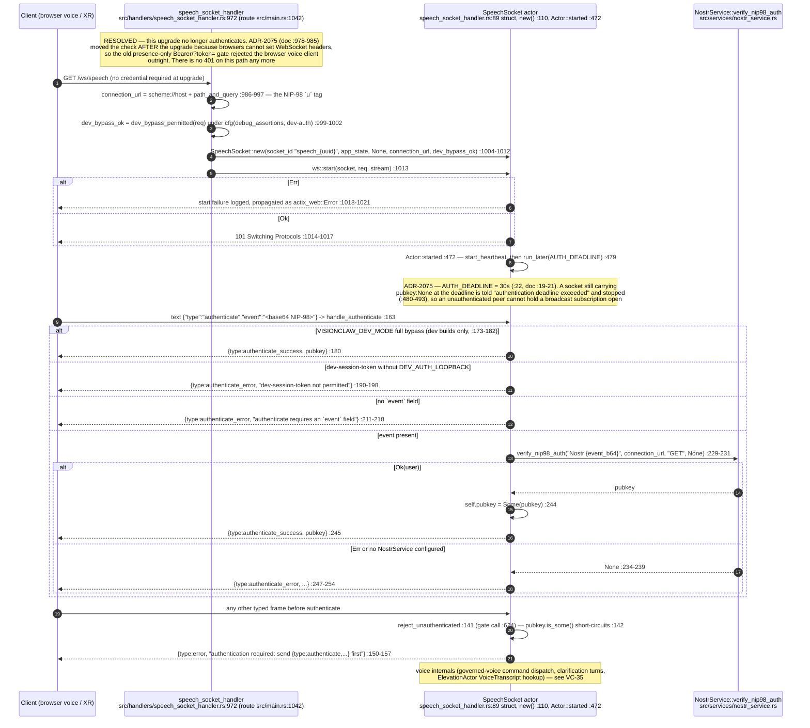
```mermaid
sequenceDiagram
    autonumber
    participant C as Client (browser voice / XR)
    participant H as speech_socket_handler<br/>src/handlers/speech_socket_handler.rs:972 (route src/main.rs:1042)
    participant SS as SpeechSocket actor<br/>speech_socket_handler.rs:89 struct, new() :110, Actor::started :472
    participant NS as NostrService::verify_nip98_auth<br/>src/services/nostr_service.rs

    Note over H: RESOLVED — this upgrade no longer authenticates. ADR-2075 (doc :978-985)<br/>moved the check AFTER the upgrade because browsers cannot set WebSocket headers,<br/>so the old presence-only Bearer/?token= gate rejected the browser voice client<br/>outright. There is no 401 on this path any more
    C->>H: GET /ws/speech (no credential required at upgrade)
    H->>H: connection_url = scheme://host + path_and_query :986-997 — the NIP-98 `u` tag
    H->>H: dev_bypass_ok = dev_bypass_permitted(req) under cfg(debug_assertions, dev-auth) :999-1002
    H->>SS: SpeechSocket::new(socket_id "speech_{uuid}", app_state, None, connection_url, dev_bypass_ok) :1004-1012
    H->>SS: ws::start(socket, req, stream) :1013
    alt Err
        SS-->>C: start failure logged, propagated as actix_web::Error :1018-1021
    else Ok
        SS-->>C: 101 Switching Protocols :1014-1017
    end
    SS->>SS: Actor::started :472 — start_heartbeat, then run_later(AUTH_DEADLINE) :479
    Note over SS: ADR-2075 — AUTH_DEADLINE = 30s (:22, doc :19-21). A socket still carrying<br/>pubkey:None at the deadline is told "authentication deadline exceeded" and stopped<br/>(:480-493), so an unauthenticated peer cannot hold a broadcast subscription open
    C->>SS: text {"type":"authenticate","event":"<base64 NIP-98>"} -> handle_authenticate :163
    alt VISIONCLAW_DEV_MODE full bypass (dev builds only, :173-182)
        SS-->>C: {type:authenticate_success, pubkey} :180
    else dev-session-token without DEV_AUTH_LOOPBACK
        SS-->>C: {type:authenticate_error, "dev-session-token not permitted"} :190-198
    else no `event` field
        SS-->>C: {type:authenticate_error, "authenticate requires an `event` field"} :211-218
    else event present
        SS->>NS: verify_nip98_auth("Nostr {event_b64}", connection_url, "GET", None) :229-231
        alt Ok(user)
            NS-->>SS: pubkey
            SS->>SS: self.pubkey = Some(pubkey) :244
            SS-->>C: {type:authenticate_success, pubkey} :245
        else Err or no NostrService configured
            NS-->>SS: None :234-239
            SS-->>C: {type:authenticate_error, ...} :247-254
        end
    end
    C->>SS: any other typed frame before authenticate
    SS->>SS: reject_unauthenticated :141 (gate call :624) — pubkey.is_some() short-circuits :142
    SS-->>C: {type:error, "authentication required: send {type:authenticate,...} first"} :150-157
    Note over SS: voice internals (governed-voice command dispatch, clarification turns,<br/>ElevationActor VoiceTranscript hookup) — see VC-35
```

## VC-05.17 ADR-2006 human-approval journey — handler side, two disconnected producers, one store

```mermaid
sequenceDiagram
    autonumber
    participant V as voice/RunCycle trigger<br/>src/actors/elevation_actor.rs:832 Handler~RunCycle~ (VC-02 internals)
    participant EA as ElevationActor/DecisionElevationActor<br/>src/actors/elevation_actor.rs:98, decision_elevation_actor.rs:128 (VC-02)
    participant FR as forum kind-31403<br/>src/services/acsp/client.rs:22 CaseDecision{event_id,created_at}
    participant DB as SqliteEnrichmentRepository::record_decision<br/>StoredDecision table — SHARED sink
    participant D as decide/decide_as_operator -> apply_decision<br/>src/handlers/enrichment_proposals_handler.rs:321 decide, :351 decide_as_operator, :370 apply_decision
    participant BI as broker_inbox_handler::inbox<br/>src/handlers/broker_inbox_handler.rs:133

    Note over V,FR: no HTTP handler in this file (decision_handler, enrichment_proposals_handler,<br/>broker_inbox_handler) ever sends a message to ElevationActor or DecisionElevationActor —<br/>grep across src/handlers finds zero references to either actor type
    V->>EA: RunCycle / VoiceTranscript (actor-internal, see VC-02)
    EA->>FR: publish ActionRequest kind-31402, poll PollPrs for the signed kind-31403 reply
    Note over FR: ADR-2013 — AcspClient signs with its OWN Keys (field acsp/client.rs:67,<br/>let keys = Keys::new(secret_key) :77, publish :99 — mirrors nostr_bridge.rs:65<br/>sign_with_keys) — the panel event carries the PANEL's authority, never the admin's key
    FR-->>EA: CaseDecision{case_id,action,responder_pubkey,event_id,created_at}
    EA->>EA: decision_record(&CaseDecision) :1227 — correlation on event_id when present
    EA->>DB: repo.record_decision(StoredDecision{decision_event_id:Some(event_id), decision_created_at_s:Some(...)}) :987, :1053, :1060
    Note over EA,DB: this producer DOES retain signed-event correlation — decision_event_id is<br/>set from the signed event id (elevation_actor.rs:1282), rationale :1243-1252
    D->>DB: repo.record_decision(StoredDecision{decision_event_id:None,...}) :413-430 built, :431 written — REST path, no forum event to correlate
    Note over D,DB: DIVERGENCE — the agentbox/operator/git-bridge REST path (VC-05.7) writes<br/>decision_event_id:None every time, since it never carries a signed 31403 event
    BI->>DB: store::all() / store::get(id) — reads the SAME table both producers wrote to
    BI-->>BI: projects EITHER kind of row into the SAME BrokerCase shape, indistinguishable to the bridge
    Note over V,BI: DIVERGENCE (ADR-2006 closeout, docs/BASELINE-architecture.md:295) —<br/>"the retained domain kernel's presence does not prove integration into the elevation<br/>actor or inbox DTO. Current source review does not certify a complete human-approval journey."<br/>Verified precisely: the two producers only converge at the SQLite table, no handler route<br/>calls into either actor, and case authority/failure/restart receipts are not modelled here
```

## VC-05.18 `src/domain/broker/` verification — BrokerActor never merged (BASELINE l.244)
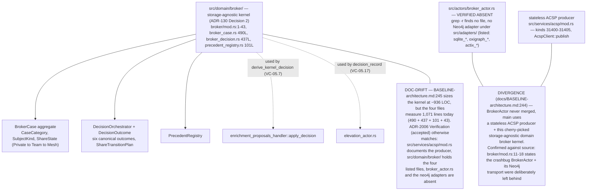
```mermaid
flowchart TB
    KERNEL["src/domain/broker/ — storage-agnostic kernel (ADR-130 Decision 2)<br/>broker/mod.rs:1-43, broker_case.rs 490L, broker_decision.rs 437L, precedent_registry.rs 101L"]
    BC["BrokerCase aggregate<br/>CaseCategory, SubjectKind, ShareState (Private to Team to Mesh)"]
    BD["DecisionOrchestrator + DecisionOutcome<br/>six canonical outcomes, ShareTransitionPlan"]
    PR["PrecedentRegistry"]
    KERNEL --> BC
    KERNEL --> BD
    KERNEL --> PR
    ACSP["stateless ACSP producer<br/>src/services/acsp/mod.rs — kinds 31400-31405, AcspClient::publish"]
    ABSENT["src/actors/broker_actor.rs — VERIFIED ABSENT<br/>grep -r finds no file, no Neo4j adapter under src/adapters/ (listed: sqlite_*, oxigraph_*, actix_*)"]
    KERNEL -.->|"used by derive_kernel_decision (VC-05.7)"| CALLER["enrichment_proposals_handler::apply_decision"]
    KERNEL -.->|"used by decision_record (VC-05.17)"| CALLER2["elevation_actor.rs"]
    N1["DIVERGENCE (docs/BASELINE-architecture.md:244) — BrokerActor never merged, main uses<br/>a stateless ACSP producer + this cherry-picked storage-agnostic domain broker kernel.<br/>Confirmed against source: broker/mod.rs:11-18 states the crashbug BrokerActor + its Neo4j<br/>transport were deliberately left behind"]
    ABSENT --- N1
    ACSP --- N1
    N2["DOC-DRIFT — BASELINE-architecture.md:245 sizes the kernel at ~936 LOC, but the four files<br/>measure 1,071 lines today (490 + 437 + 101 + 43). ADR-2006 Verification (accepted) otherwise<br/>matches: src/services/acsp/mod.rs documents the producer, src/domain/broker/ holds the four<br/>listed files, broker_actor.rs and the neo4j adapters are absent"]
    KERNEL --- N2
```
