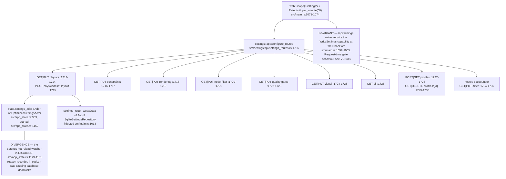
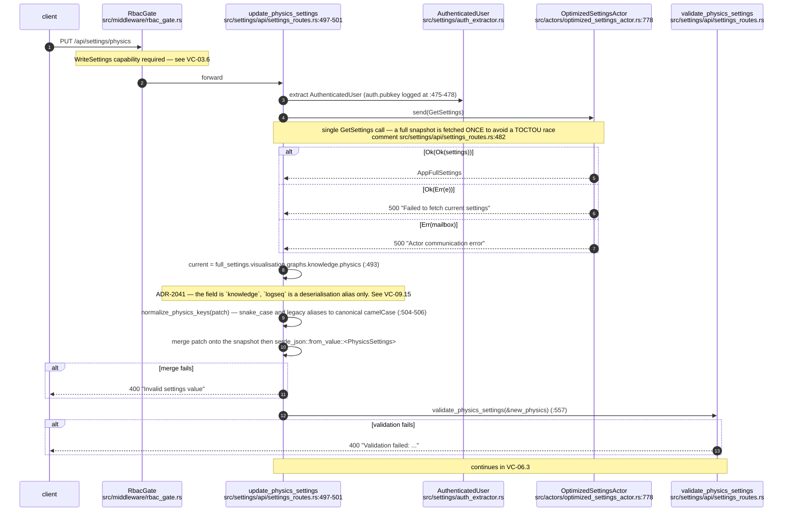
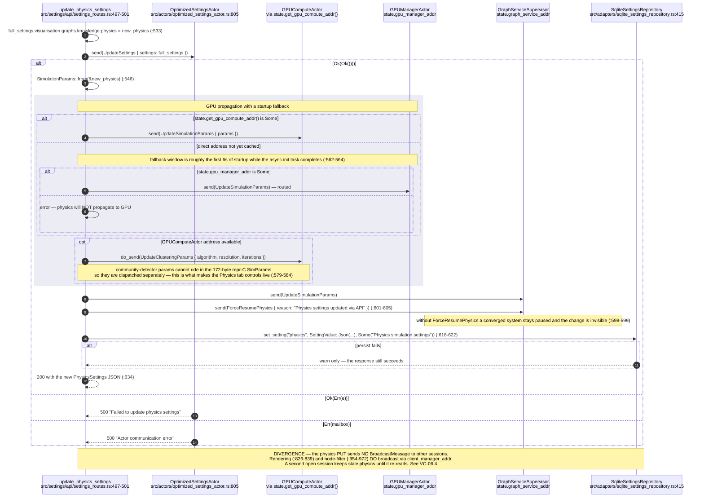
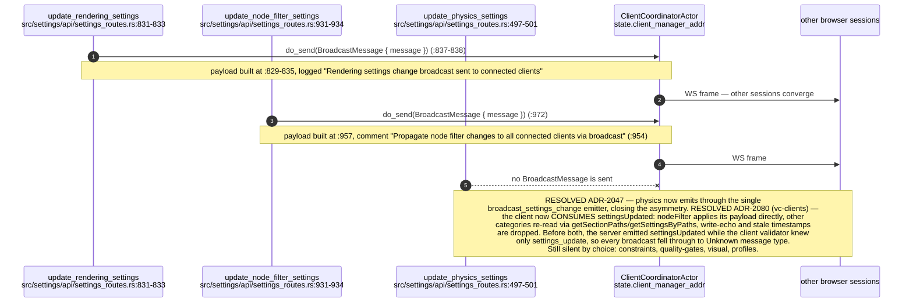
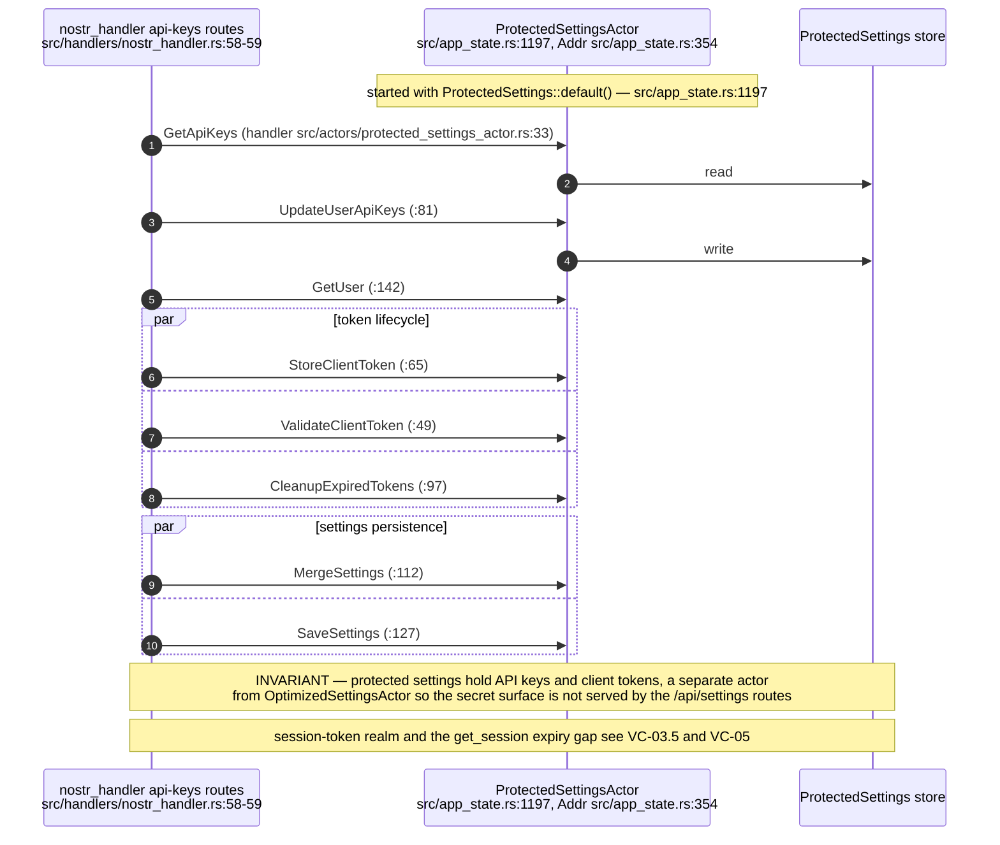
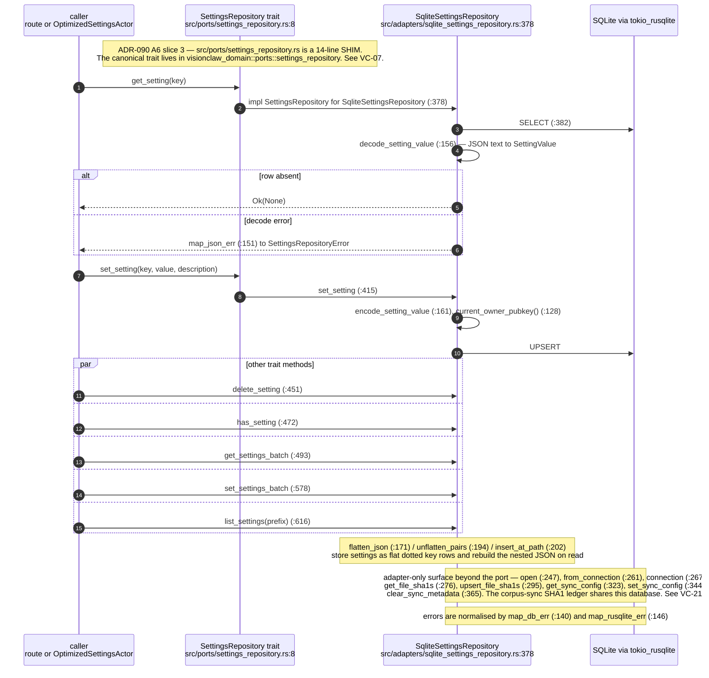
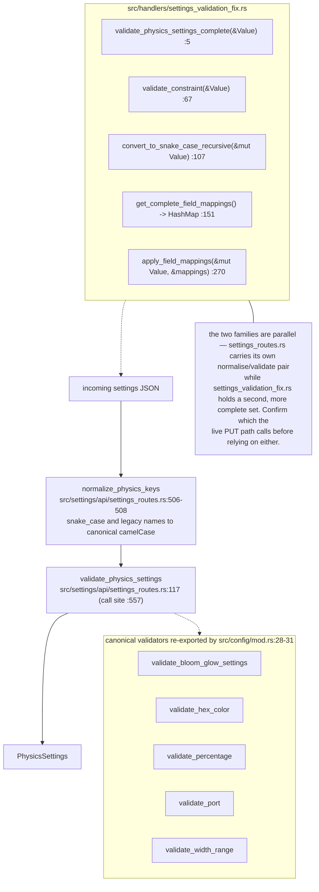
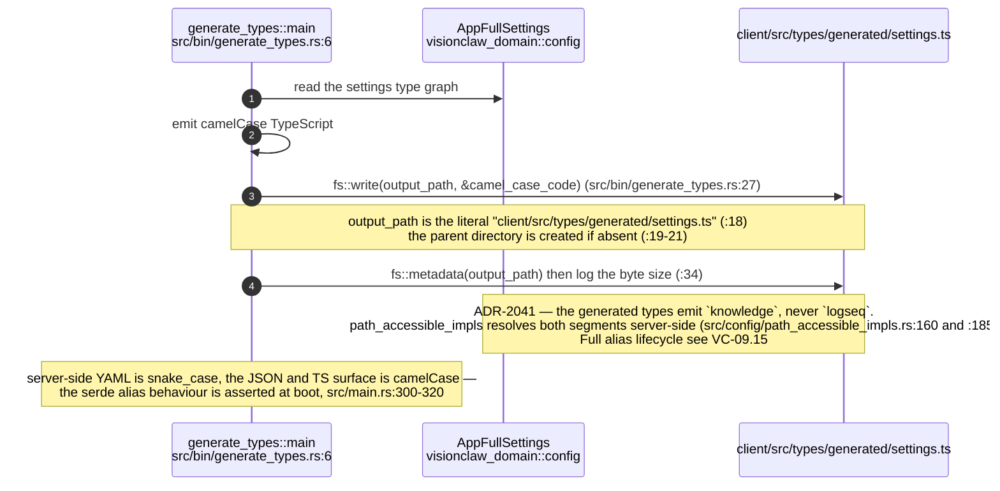
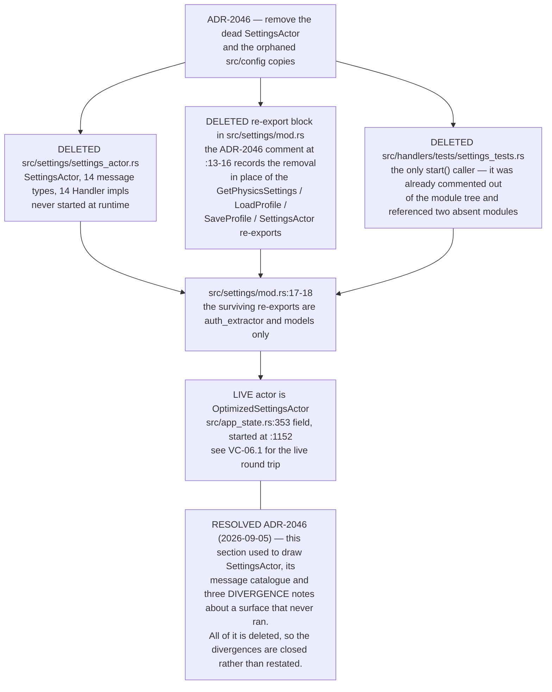

## VC-06.1 Settings route surface and the actor behind it

## VC-06.2 PUT /api/settings/physics — the flagship round trip, phase 1 read and merge

## VC-06.3 PUT /api/settings/physics — phase 2 write-back, GPU propagation, persistence

## VC-06.4 Broadcast asymmetry — which settings reach other sessions

## VC-06.5 OptimizedSettingsActor message surface

```mermaid
classDiagram
    class OptimizedSettingsActor {
      <<src/actors/optimized_settings_actor.rs>>
      +started app_state.rs:1152
      +with_actors(repo, gs_addr, None)
    }
    class WarmCacheMessage {
      +Handler impl at line 765
    }
    class GetSettings {
      +Handler impl at line 778
    }
    class UpdateSettings {
      +AppFullSettings settings
      +Handler impl at line 805
    }
    class GetSettingByPath {
      +Handler impl at line 816
    }
    class GetSettingsByPaths {
      +Handler impl at line 847
    }
    class SetSettingsByPaths {
      +Handler impl at line 906
    }
    class UpdatePhysicsFromAutoBalance {
      +Handler impl at line 1093
    }
    class GetPerformanceMetrics {
      +Handler impl at line 1159
    }
    class ClearCaches {
      +Handler impl at line 1174
    }
    class ReloadSettings {
      +Handler impl at line 1187
    }
    OptimizedSettingsActor <|.. WarmCacheMessage
    OptimizedSettingsActor <|.. GetSettings
    OptimizedSettingsActor <|.. UpdateSettings
    OptimizedSettingsActor <|.. GetSettingByPath
    OptimizedSettingsActor <|.. GetSettingsByPaths
    OptimizedSettingsActor <|.. SetSettingsByPaths
    OptimizedSettingsActor <|.. UpdatePhysicsFromAutoBalance
    OptimizedSettingsActor <|.. GetPerformanceMetrics
    OptimizedSettingsActor <|.. ClearCaches
    OptimizedSettingsActor <|.. ReloadSettings
```

## VC-06.6 ProtectedSettingsActor — API keys, client tokens and user records

## VC-06.7 Hexagonal hop — SettingsRepository port to the SQLite adapter

## VC-06.8 Validation and field-mapping helpers

## VC-06.9 Generated client types — src/bin/generate_types.rs

## VC-06.10 RESOLVED ADR-2046 — the dead SettingsActor surface and what replaced it

