## VC-07.1 The hexagon — ports, adapters and where each canonical type lives
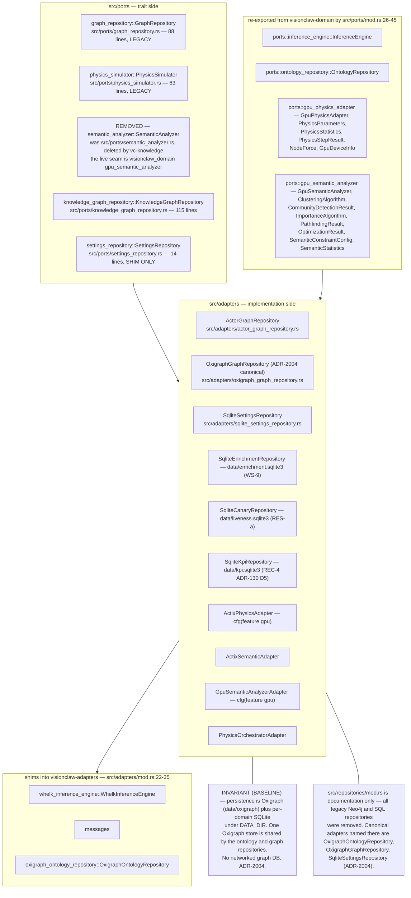

## VC-07.2 ADR-2005 extraction state — what is actually a shim
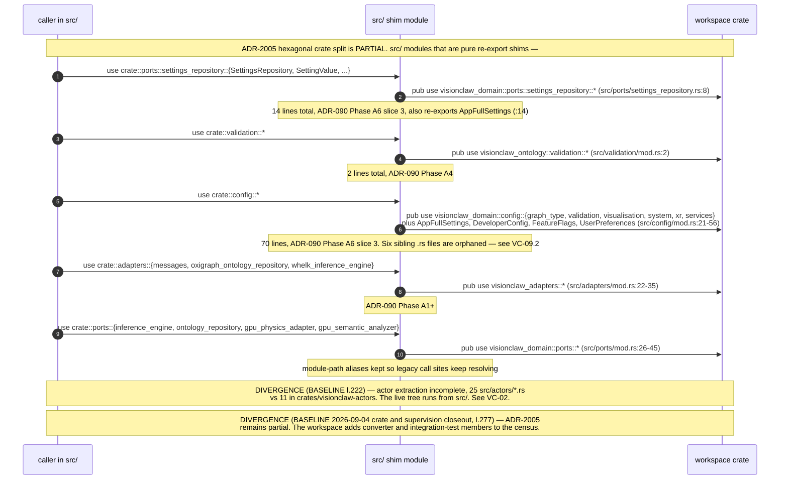

## VC-07.3 Workspace membership and the excluded contexts
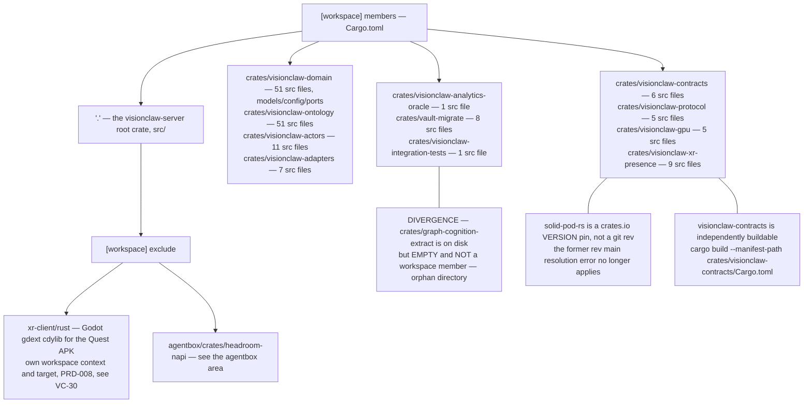

## VC-07.4 Root-crate module surface — src/lib.rs
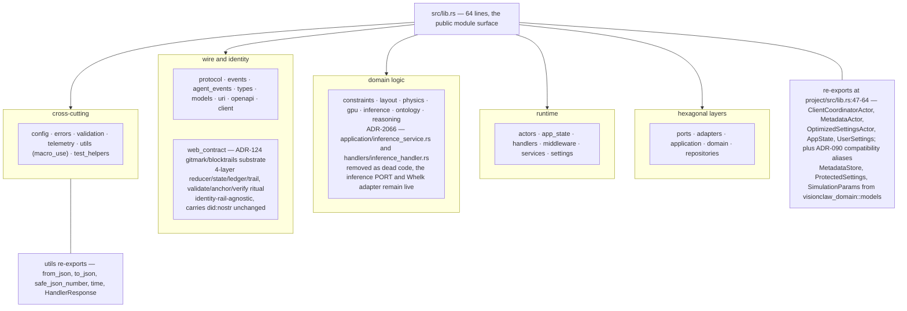

## VC-07.5 CQRS application layer — settings and knowledge-graph domains
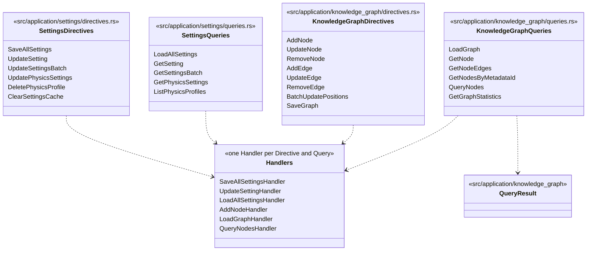

## VC-07.6 CQRS application layer — ontology, graph and services
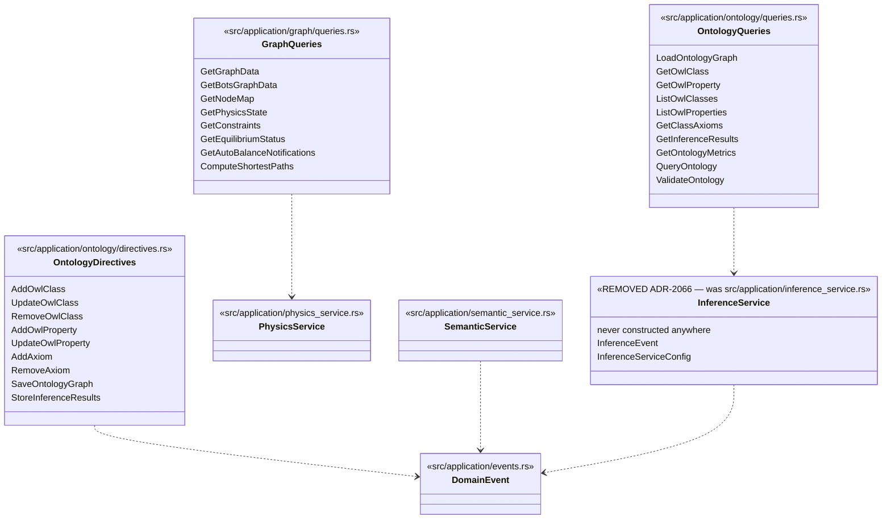

## VC-07.7 A CQRS call in flight — GET /api/config
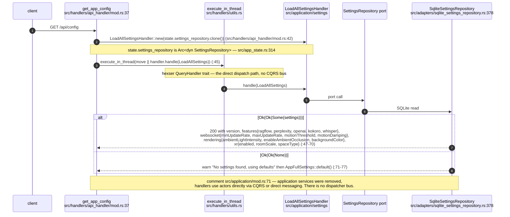

## VC-07.8 Storage-agnostic domain kernel — src/domain/broker
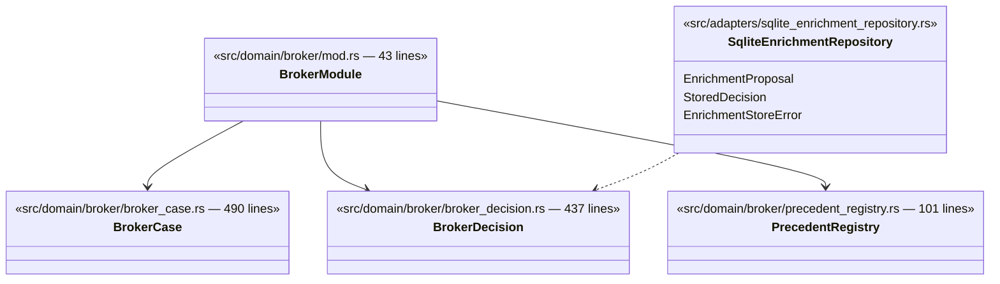

## VC-07.9 Broker kernel placement and the never-merged BrokerActor
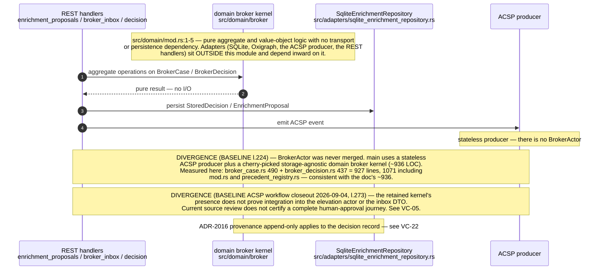

## VC-07.10 Error taxonomy — src/errors/mod.rs
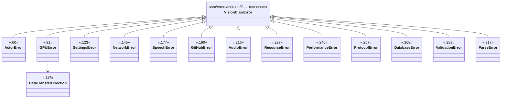

## VC-07.11 Feature-gated adapter slots
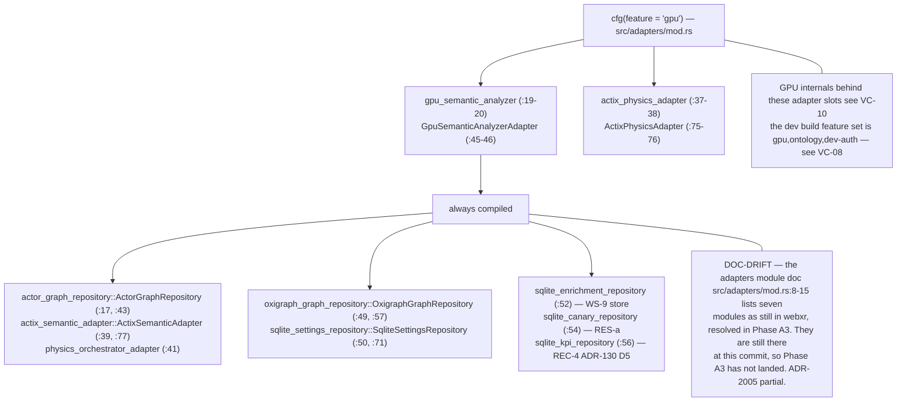

## VC-07.12 `visionclaw-contracts` — the cross-boundary DTO crate and its actual blast radius
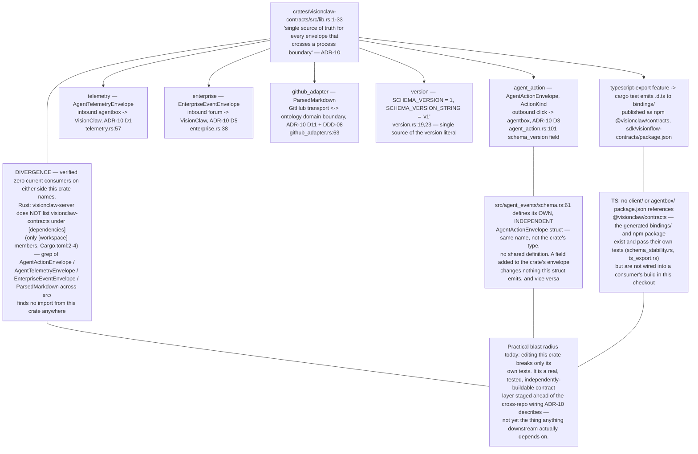
