## VC-08.1 Health and readiness — what each probe actually asserts
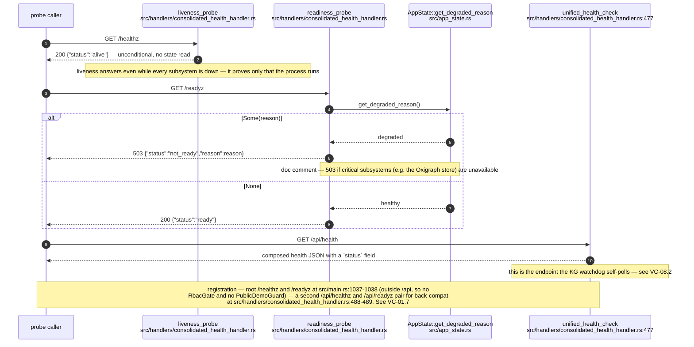

## VC-08.2 KG watchdog — the self-poll that drives kg_backend_up
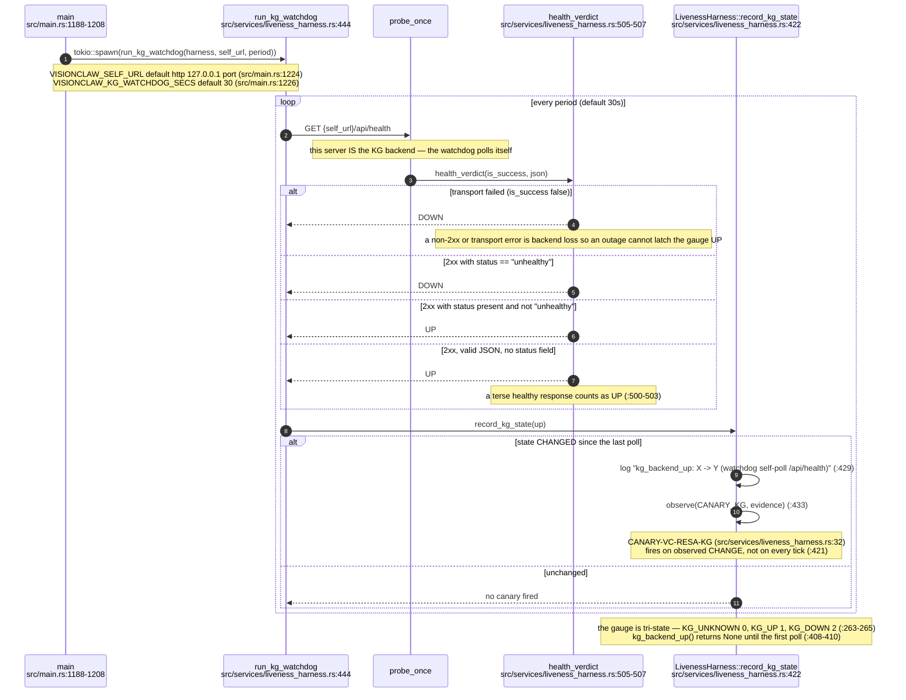

## VC-08.3 LivenessHarness — the canary registry and observation surface
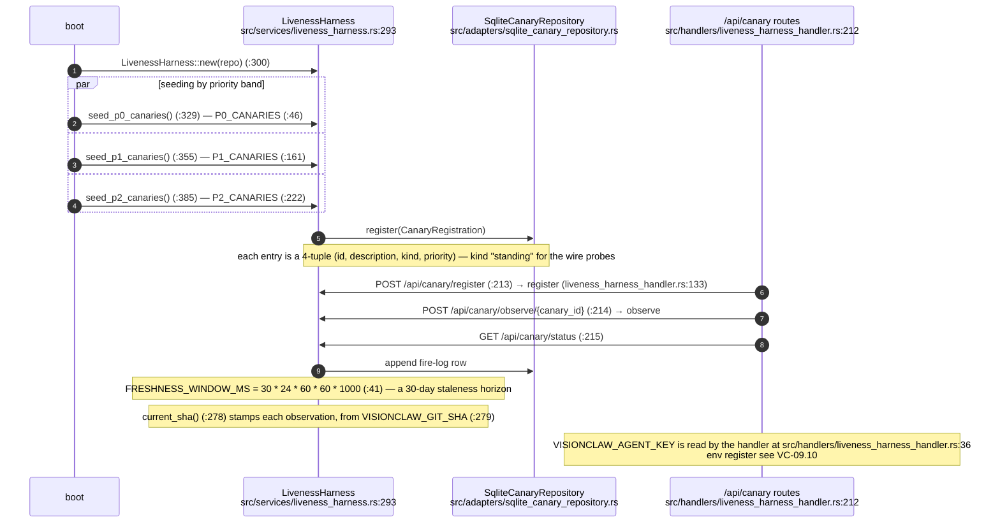

## VC-08.4 Canary identifier register
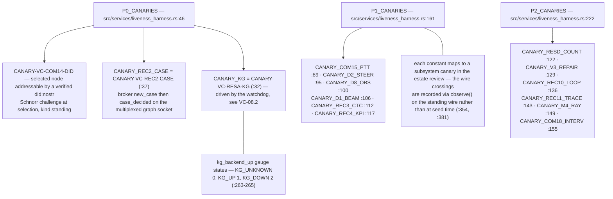

## VC-08.5 Canary Nostr tap — the relay-side observation path
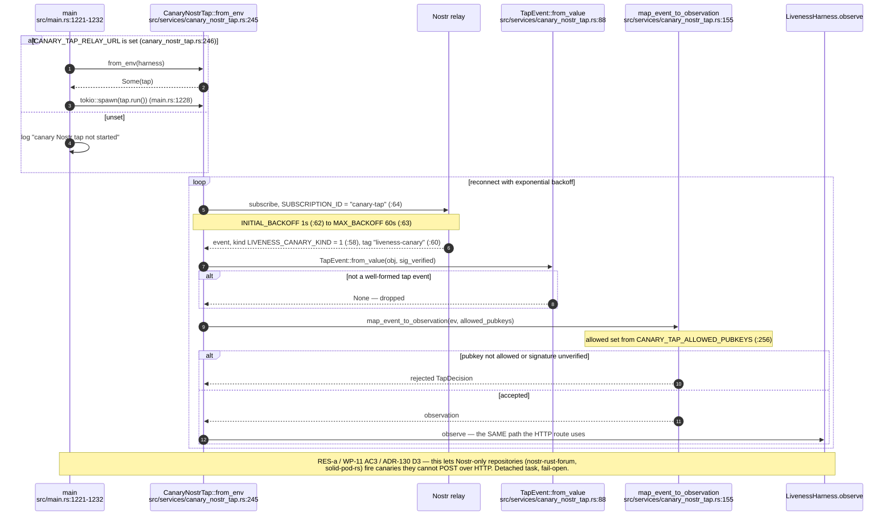

## VC-08.6 Metrics endpoint and telemetry logger
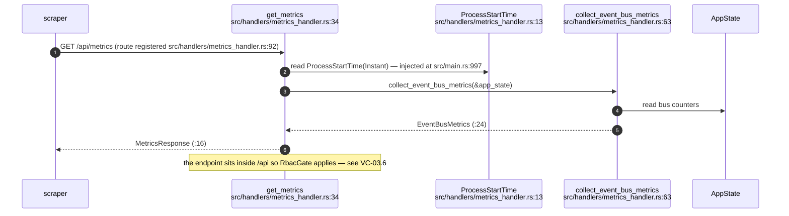

## VC-08.7 Agent telemetry logger — structured event capture
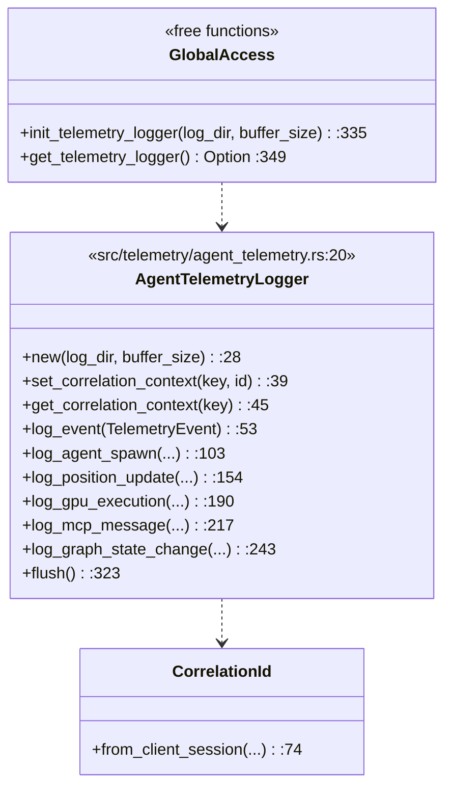

## VC-08.8 Client-log ingest
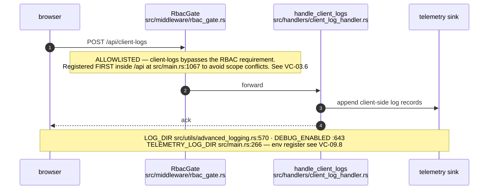

## VC-08.9 ADR-2008 dev restart loop — the timestamp-gated wrapper
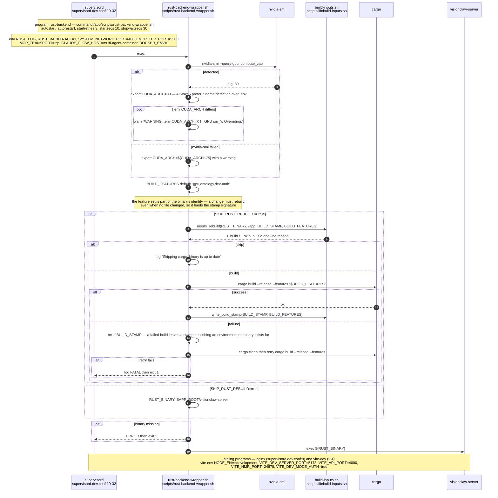

## VC-08.10 ADR-2008 build-input inventory — what counts as a build input
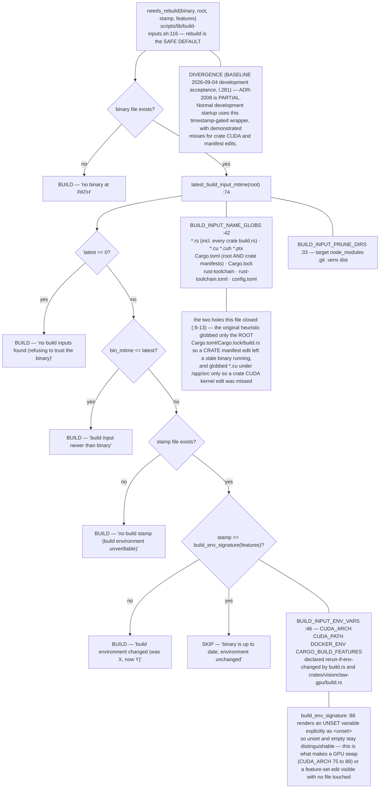

## VC-08.11 Image builds and the dev-auth exclusion (ADR-2037)
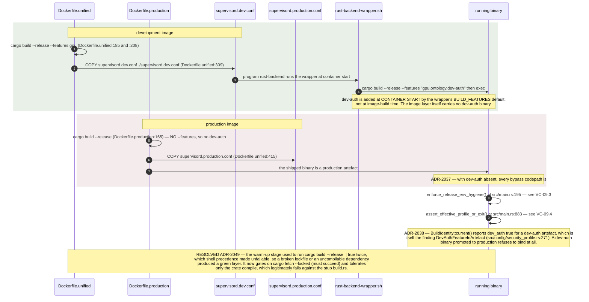

## VC-08.12 Degraded-state and boot-receipt observability
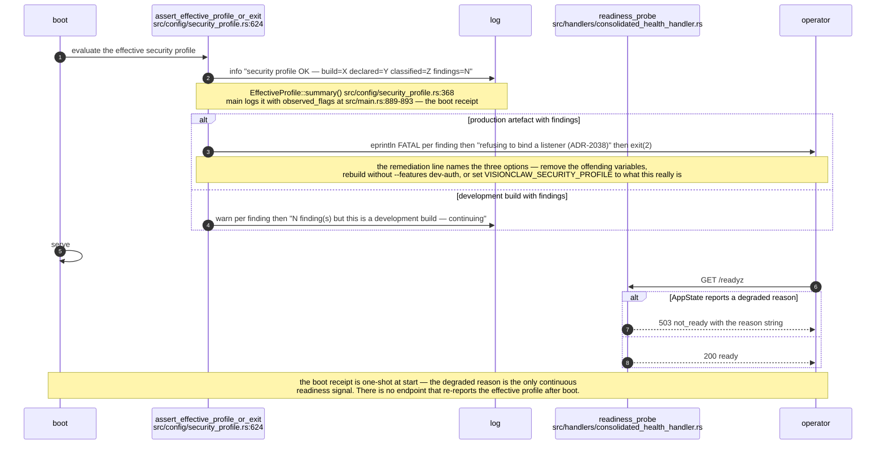
