## VC-09.1 Config load precedence — main() boot order
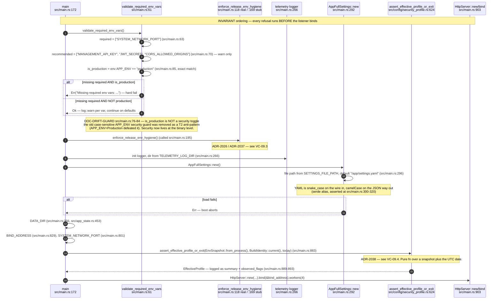

## VC-09.2 src/config module surface — shims into visionclaw-domain, orphans removed
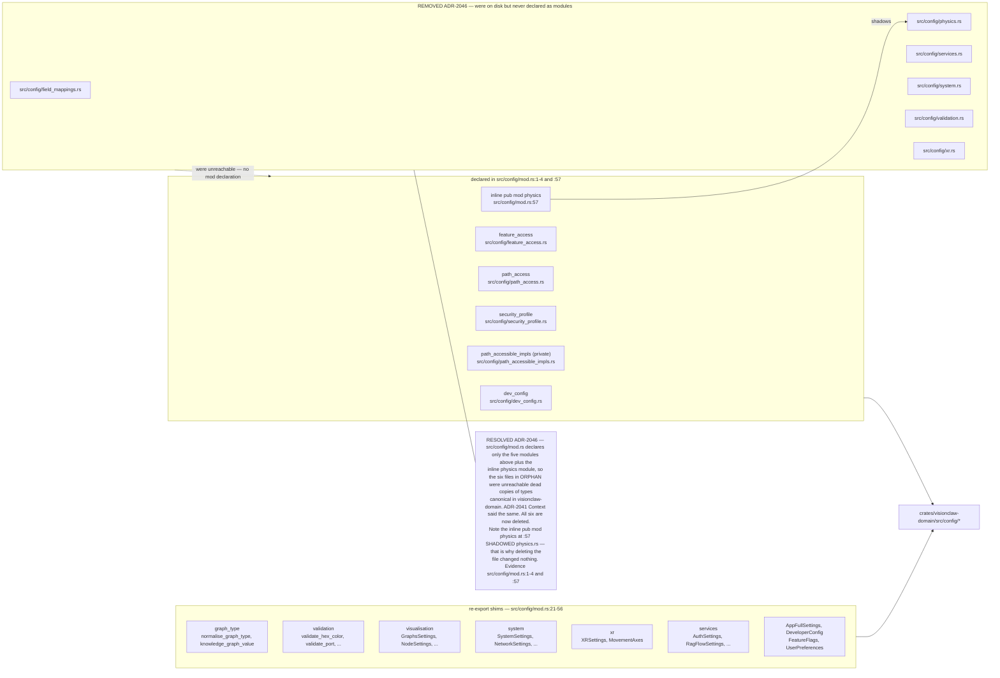

## VC-09.3 enforce_release_env_hygiene — argv and env refusal (ADR-2026, ADR-2037)
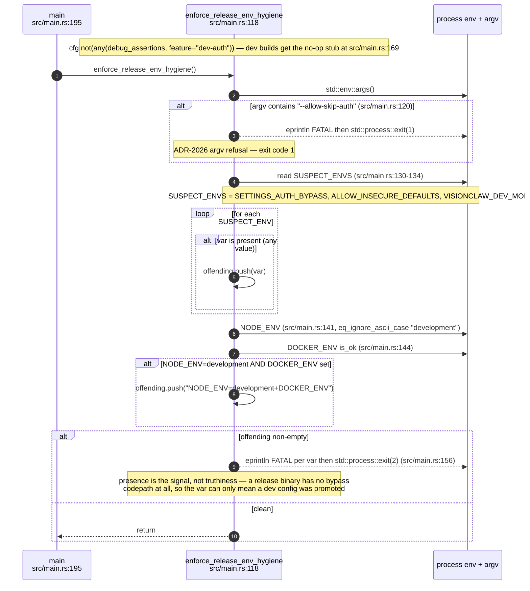

## VC-09.4 Boot-time effective-profile assertion (ADR-2038) — the pure evaluator
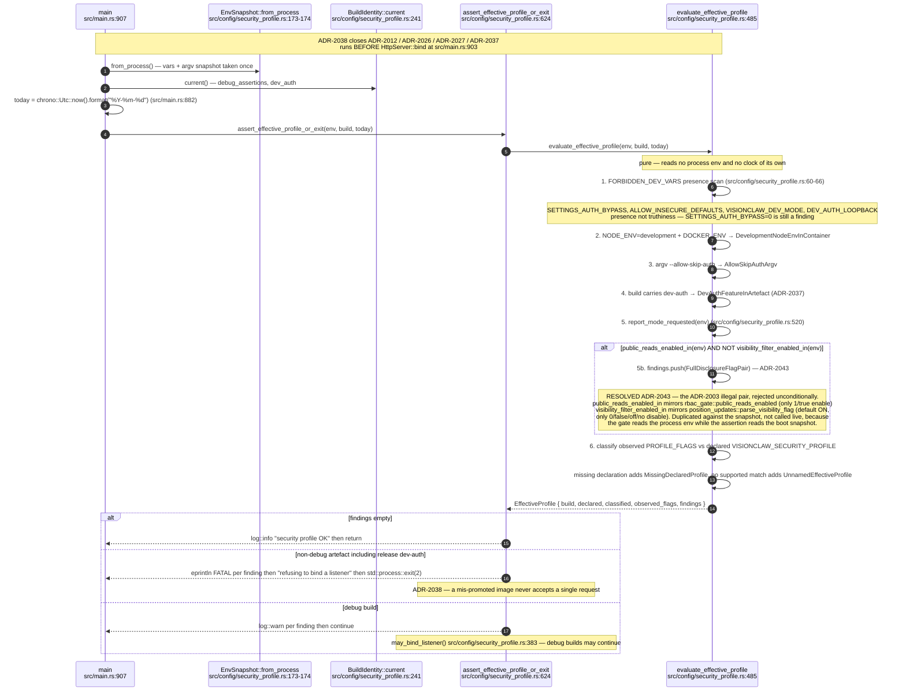

## VC-09.5 ProfileFinding and EffectiveProfile — the rejection vocabulary
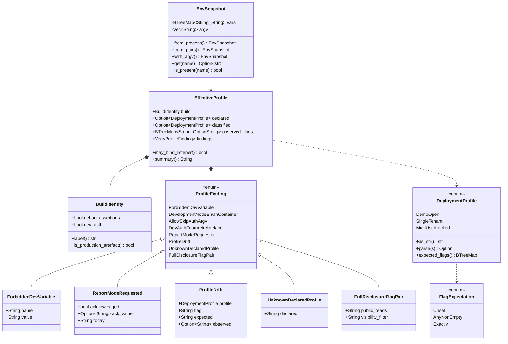

## VC-09.6 DeploymentProfile expected-flag matrix (ADR-2027 as coded)
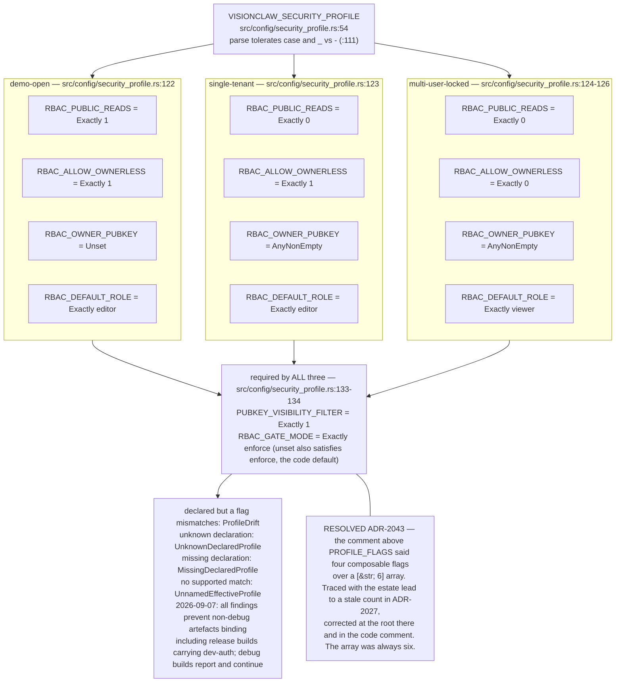

## VC-09.7 RBAC report mode — the dated acknowledgement (ADR-2012)
```mermaid
sequenceDiagram
    autonumber
    participant C as caller<br/>src/config/security_profile.rs:427
    participant R as report_mode_requested<br/>src/config/security_profile.rs:459
    participant K as report_mode_acknowledged<br/>src/config/security_profile.rs:473
    participant G as RbacGate::from_env<br/>src/middleware/rbac_gate.rs:185-200

    Note over C,G: single implementation shared with the gate so the two cannot drift
    C->>R: report_mode_requested(env)
    R->>R: RBAC_GATE_MODE trimmed, eq_ignore_ascii_case "report"
    alt not requested
        R-->>C: false — mode is enforce (the code default)
    else requested
        R-->>C: true
        C->>K: report_mode_acknowledged(env, build, today)
        alt build.debug_assertions
            K-->>C: true — a debug build acknowledges implicitly
        else RBAC_REPORT_MODE_ACK trimmed == today exactly
            K-->>C: true
            Note over K: the acknowledgement expires at the UTC date rollover
        else
            K-->>C: false
        end
        C->>C: findings.push(ReportModeRequested { acknowledged, ack_value, today })
        Note over C: ADR-2012 gap closed — a dated ack makes report mode AUDITABLE,<br/>never ACCEPTABLE in production. Fatal either way in a production artefact.
    end
    Note over G: the gate reads the same pair at construction — see VC-03 for the request-time behaviour
```

## VC-09.8 Env register — boot, process identity and storage
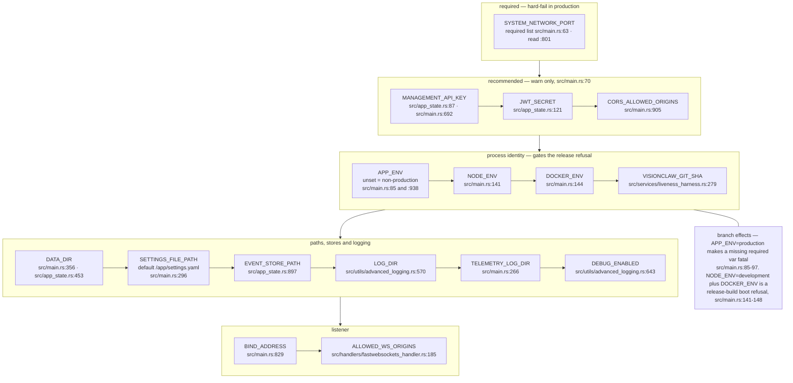

## VC-09.9 Env register — security and authorisation
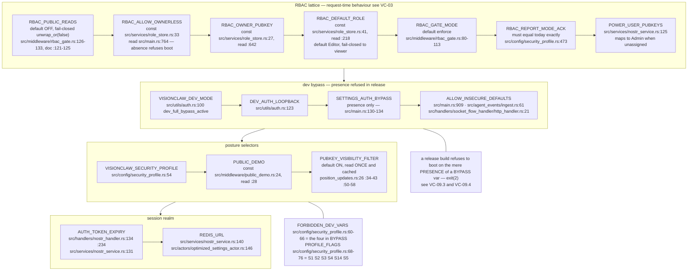

## VC-09.10 Env register — Nostr, ACSP and canary taps
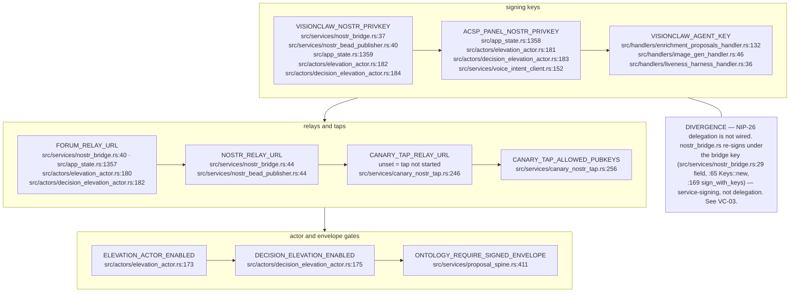

## VC-09.11 Env register — GitHub corpus sync
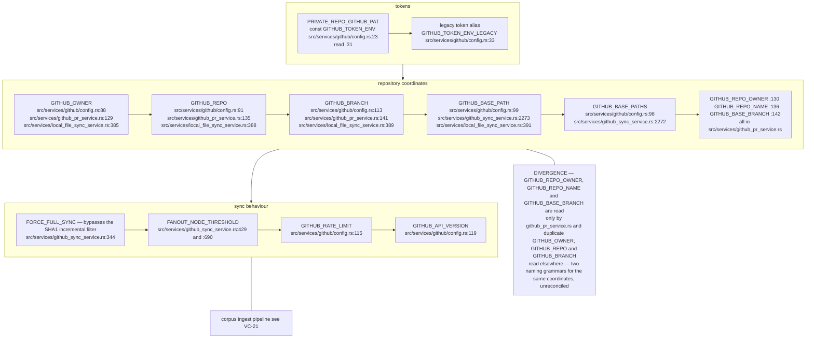

## VC-09.12 Env register — MCP, agents and the management plane
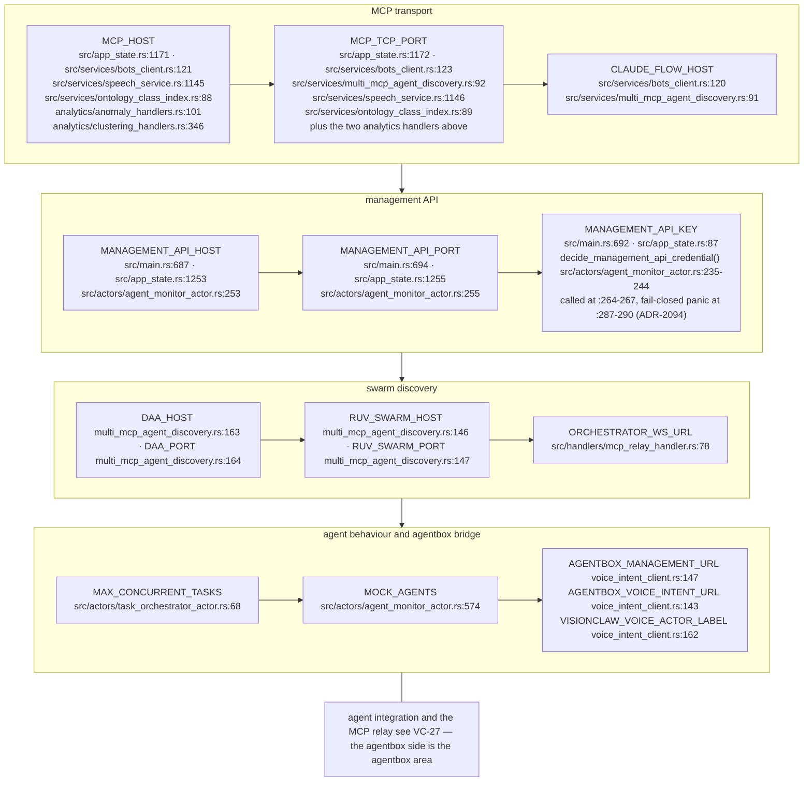

## VC-09.13 Env register — external services, payment and Solid
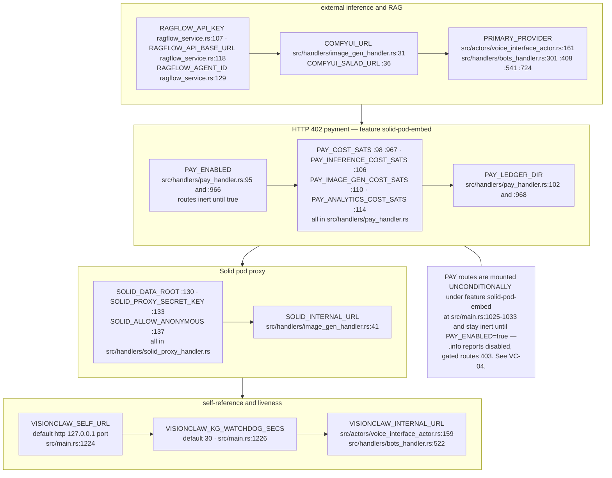

## VC-09.14 Env register — GPU, ontology index and XR presence
```mermaid
flowchart LR
    subgraph GPU["GPU runtime"]
        U1["CUDA_VISIBLE_DEVICES<br/>src/utils/gpu_diagnostics.rs:316"]
        U2["VISIONCLAW_PTX_PATH<br/>src/utils/gpu_diagnostics.rs:86"]
        U3["VISIONCLAW_BLOCK_SIZE<br/>src/utils/unified_gpu_compute/execution.rs:123"]
    end
    subgraph ONT["ontology class index"]
        C1["ONTOLOGY_CLASS_INDEX_ENABLED<br/>src/services/ontology_class_index.rs:75"]
        C2["ONTOLOGY_CLASS_INDEX_NAMESPACE<br/>src/services/ontology_class_index.rs:82"]
        C3["ONTOLOGY_CLASS_INDEX_CANARY_QUERY<br/>src/services/ontology_class_index.rs:94"]
    end
    subgraph XR["XR presence"]
        Y1["PRESENCE_HAND_REACH_M<br/>src/actors/presence_actor.rs:46, :1063"]
    end
    subgraph DYN["dynamic reads — name not a literal"]
        Z1["src/config/feature_access.rs:30<br/>env::var(var_name) — feature-gate name resolved at runtime"]
        Z2["src/main.rs:65 and :72<br/>env::var(var) over the required and recommended lists"]
        Z3["src/utils/gpu_diagnostics.rs:129<br/>env::var(var) over a diagnostic list"]
    end
    GPU --> ONT --> XR
    DYN -.->|"invisible to a literal grep"| GPU
    N6["GPU internals see VC-10. The register above lists only the env surface."]
    GPU --- N6
```

## VC-09.15 ADR-2041 — the knowledge graph-settings key and its one-release logseq alias
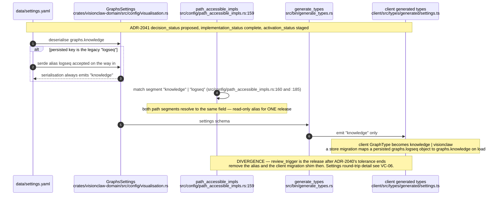
