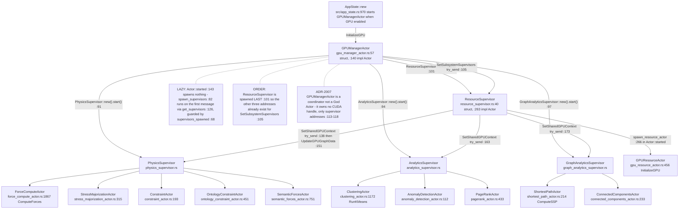
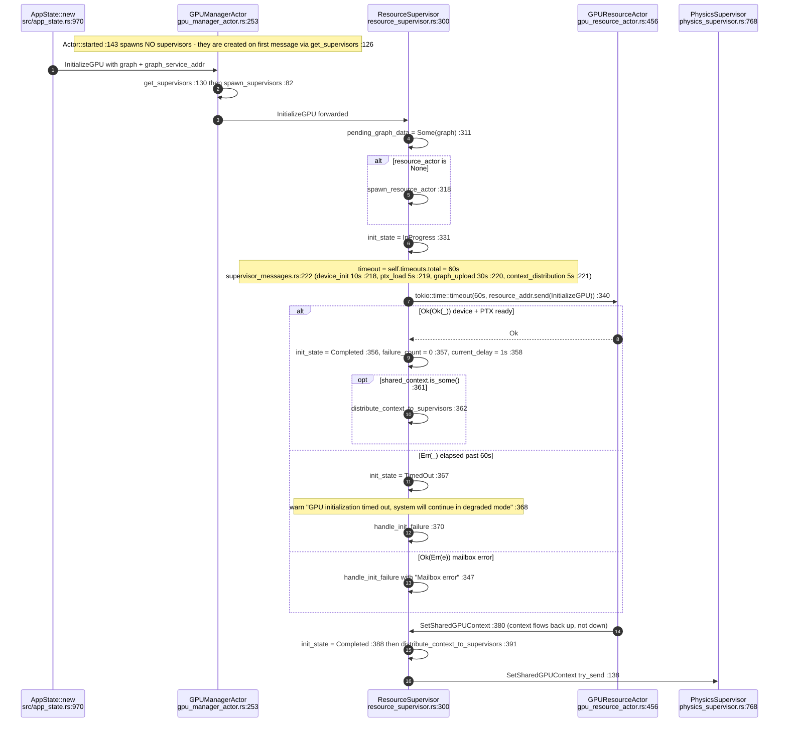
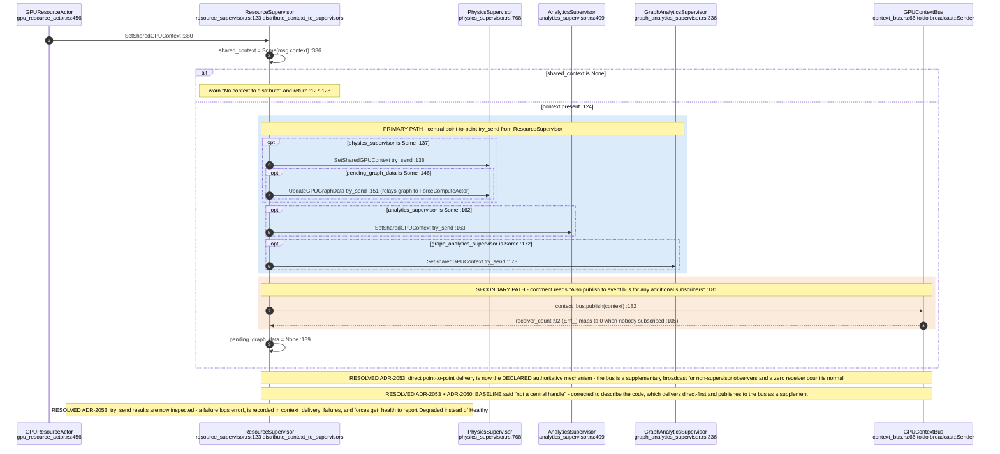
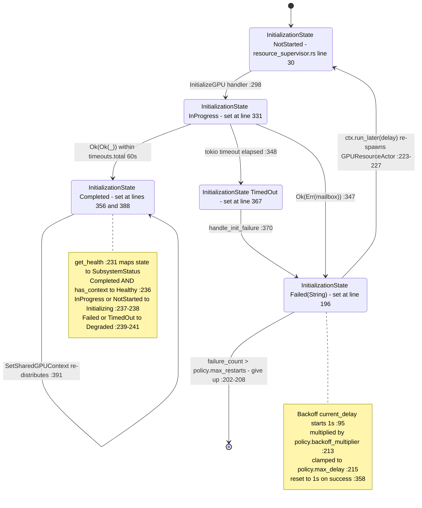
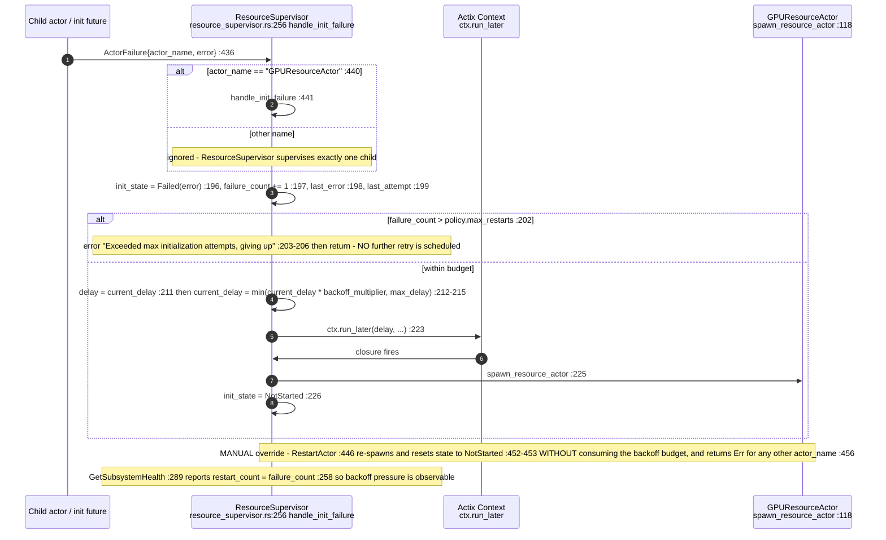
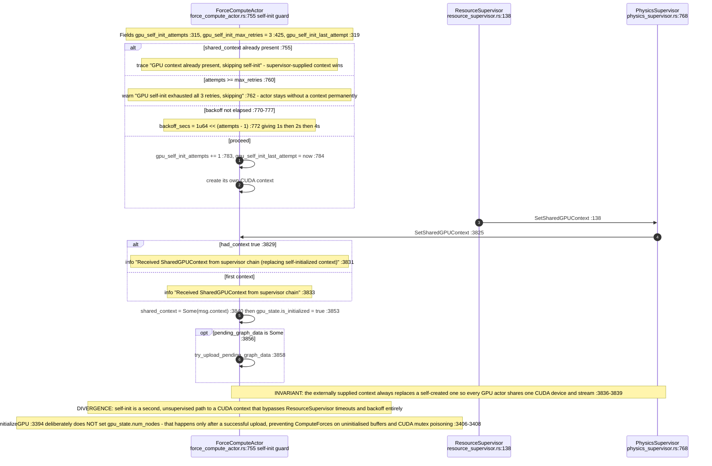
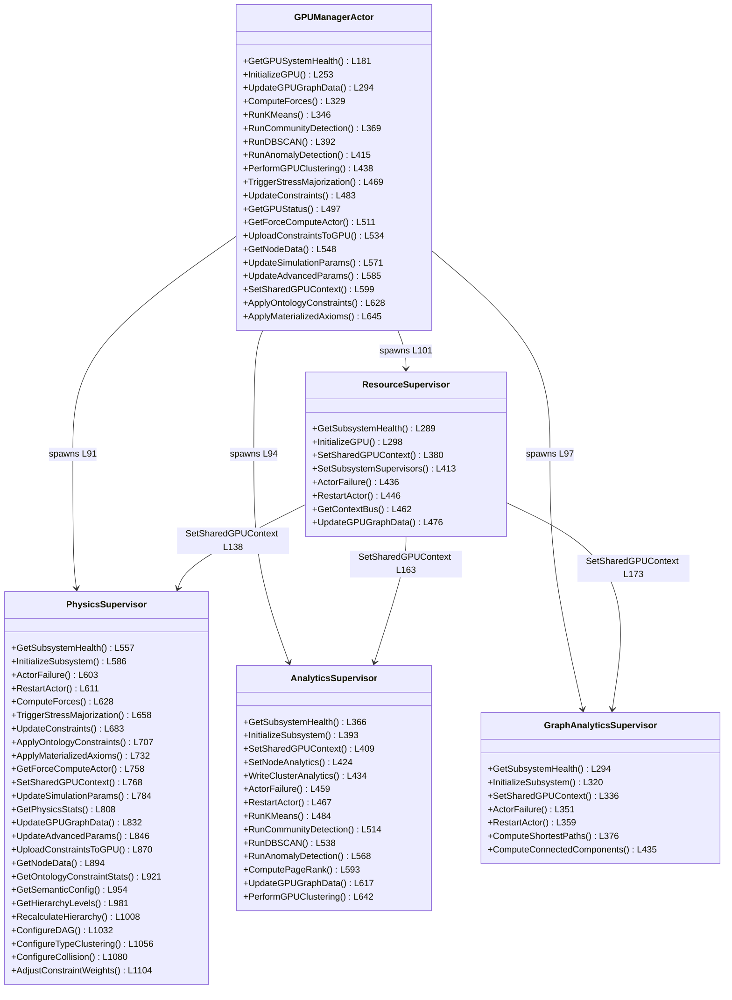
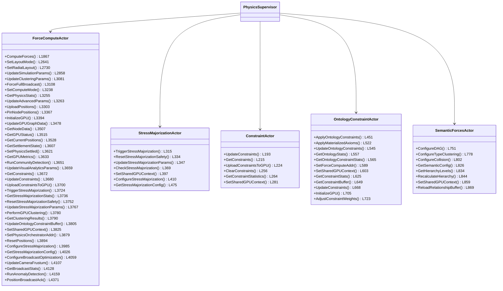
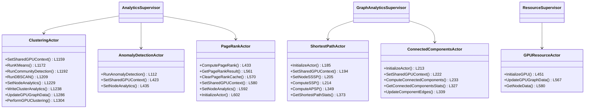
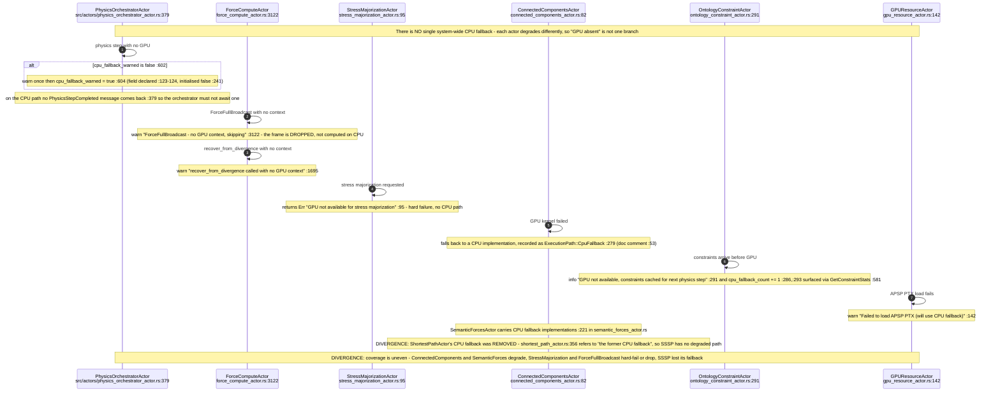

## VC-10.1 GPU supervision tree

## VC-10.2 Boot — GPU initialisation with total timeout

## VC-10.3 SharedGPUContext distribution — direct messages, bus is additive

## VC-10.4 GPU readiness lifecycle

## VC-10.5 Initialisation failure, backoff and manual restart

## VC-10.6 ForceComputeActor self-initialisation and supersession

## VC-10.7 Message surface — coordinator and supervisors

## VC-10.8 Message surface — physics leaf actors

## VC-10.9 Message surface — analytics and graph-analytics leaf actors

## VC-10.10 GPU-absent and CPU-fallback behaviour per actor

