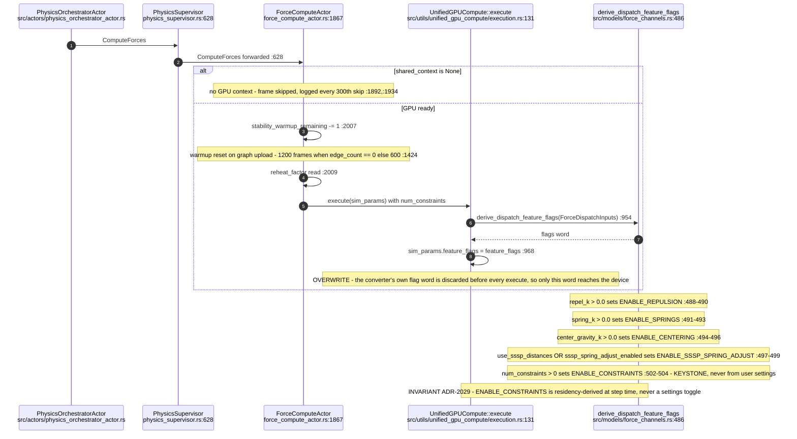
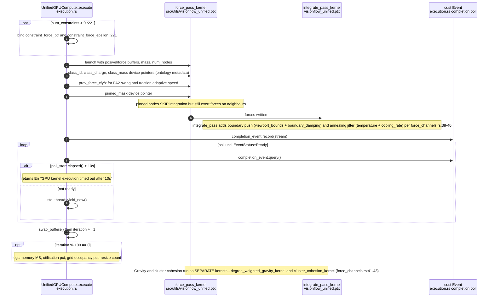
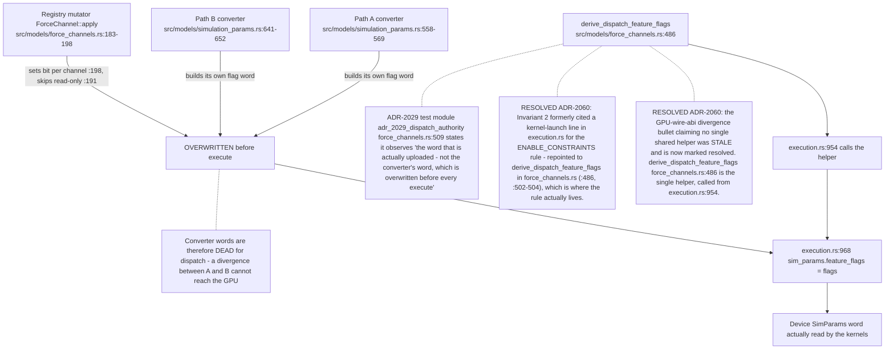
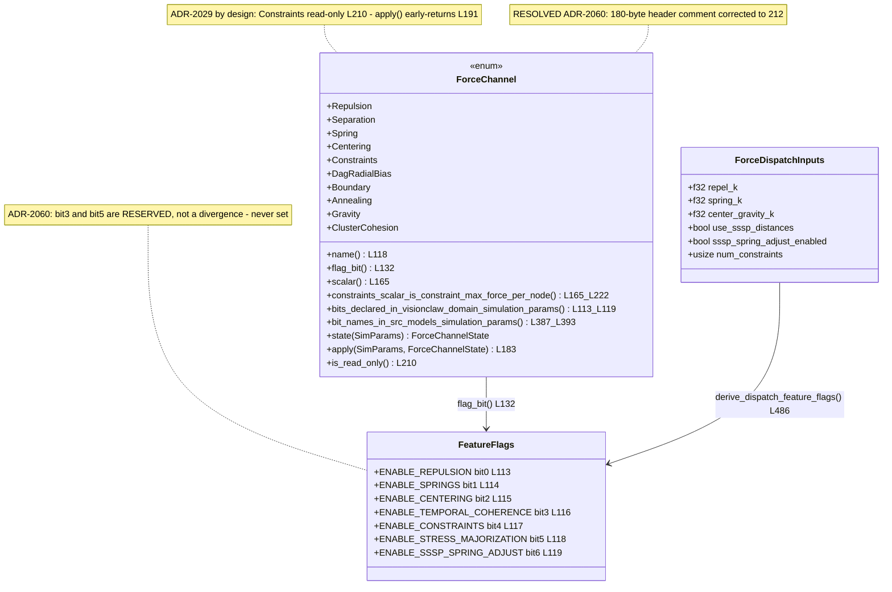
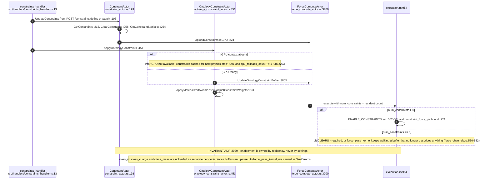
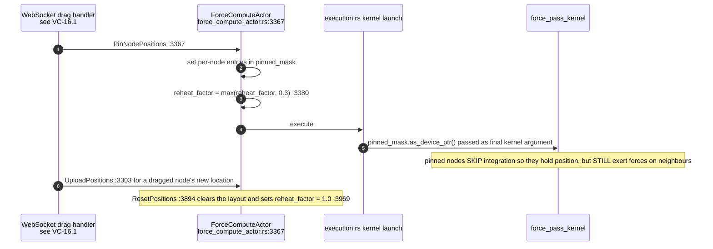
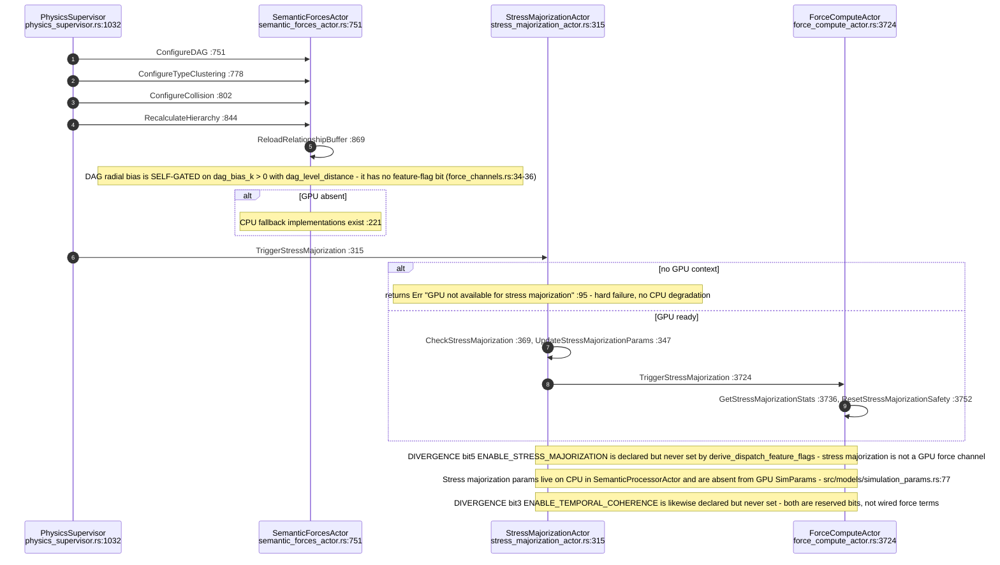
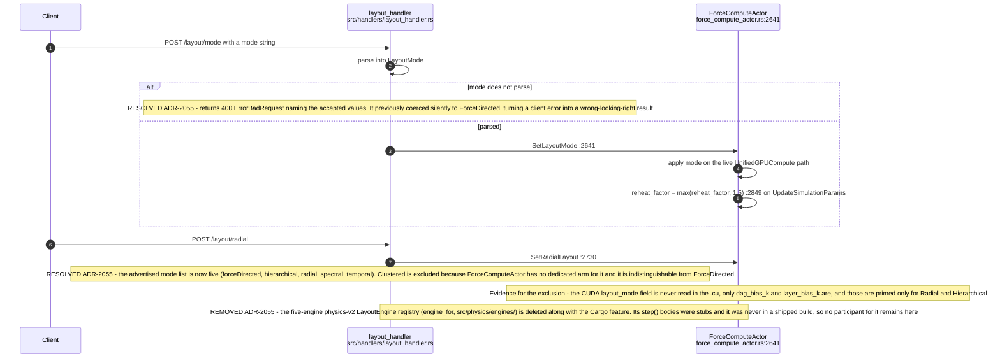
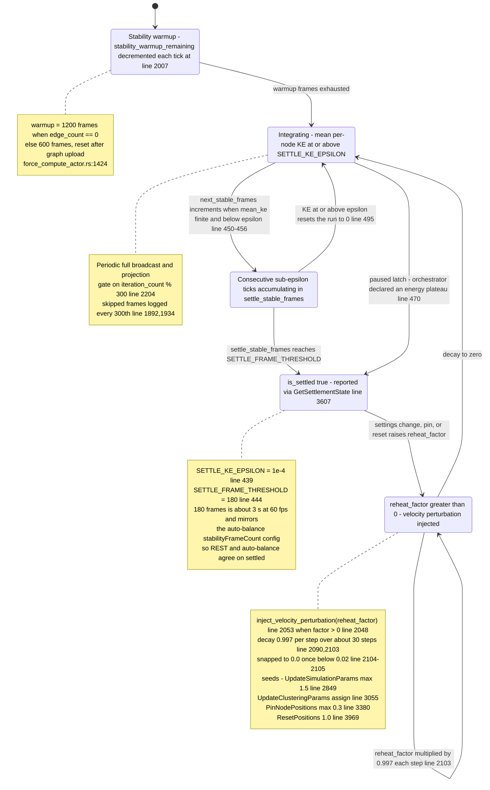

## VC-11.1 Physics tick — phase 1, params and flag word

## VC-11.2 Physics tick — phase 2, kernel launch and integrate

## VC-11.3 Feature-flag derivation across the conversion paths

## VC-11.4 Force-channel registry

## VC-11.5 Constraint residency — upload and flag consequence

## VC-11.6 Node pinning and the pinned mask

## VC-11.7 Semantic forces and stress majorization

## VC-11.8 Layout mode switch — post-ADR-2055

## VC-11.9 Warmup, settle and reheat cycle

