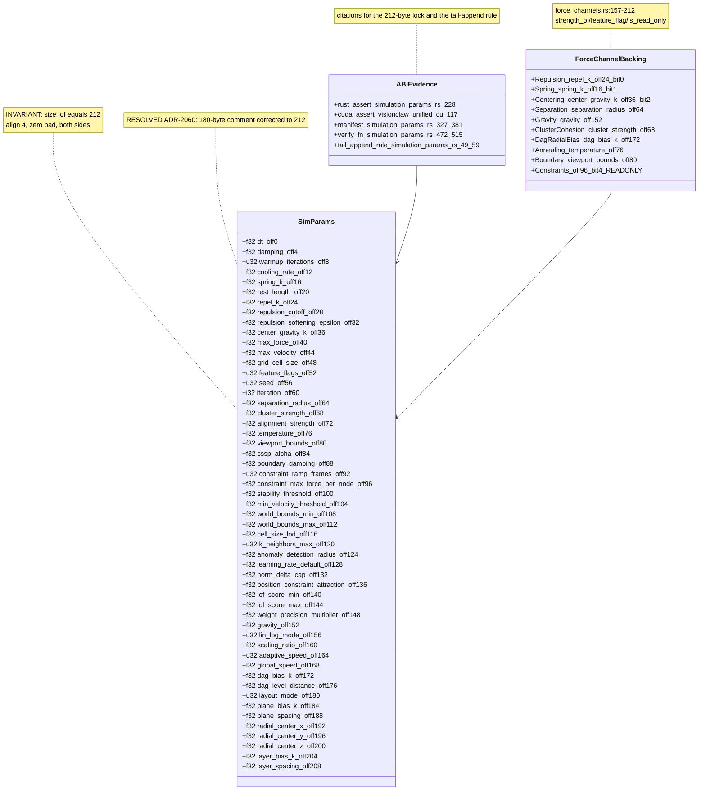
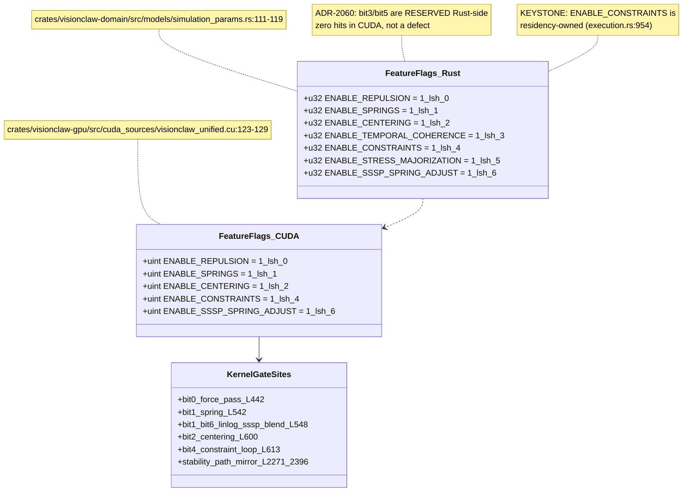
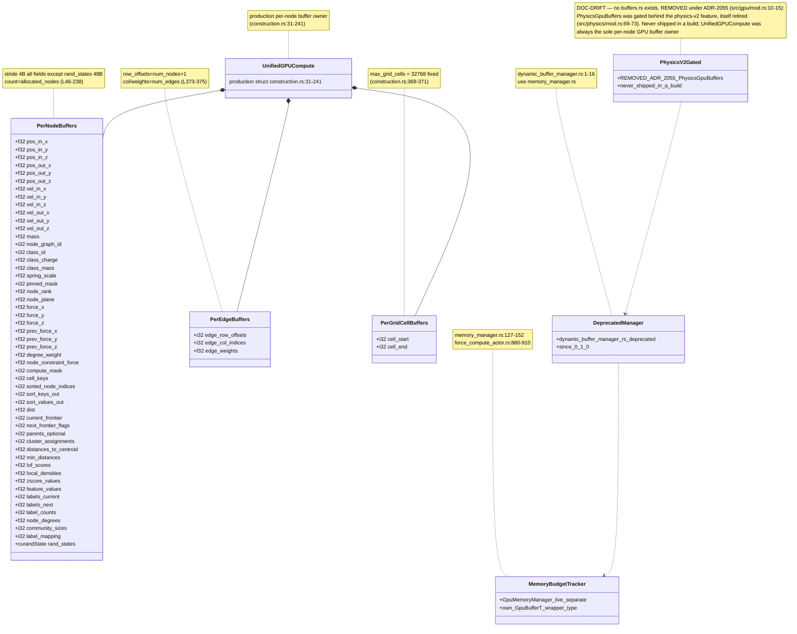
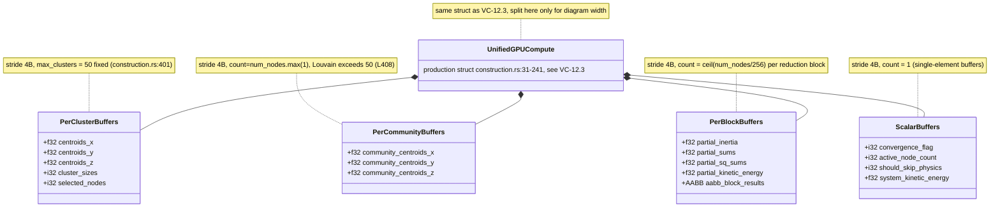
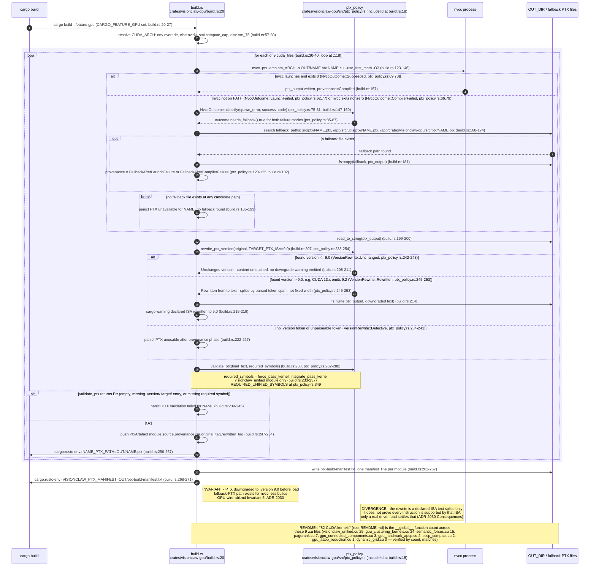
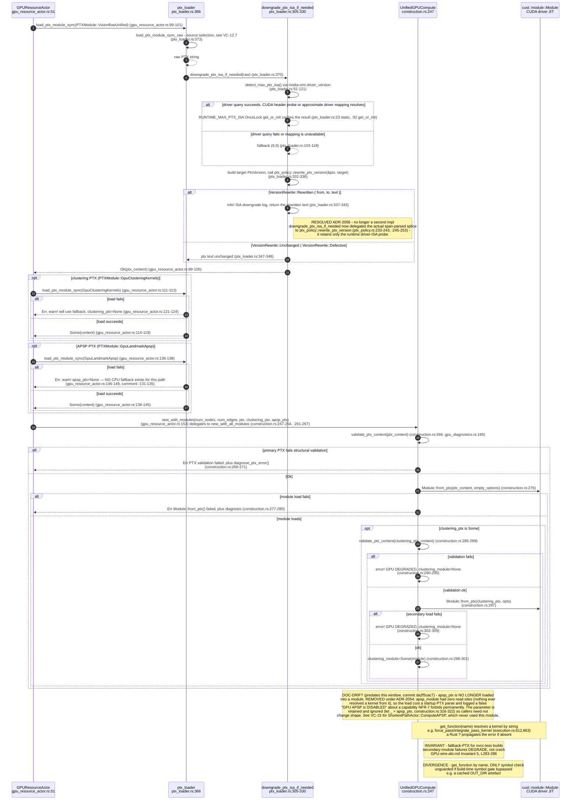
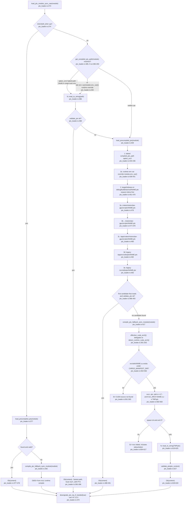

## VC-12.1 SimParams full 212-byte repr(C) layout

## VC-12.2 feature_flags bitfield (u32 at offset 52)

## VC-12.3 GPU core physics buffers: per-node, per-edge, per-grid-cell

## VC-12.4 GPU analytics-adjacent buffers: cluster, community, block, scalar

## VC-12.5 build.rs: nvcc to PTX to .version 9.0 downgrade

## VC-12.6 runtime PTX load, module init and kernel handle lookup

## VC-12.7 PTX source selection: compiled vs pre-shipped vs runtime-compiled

