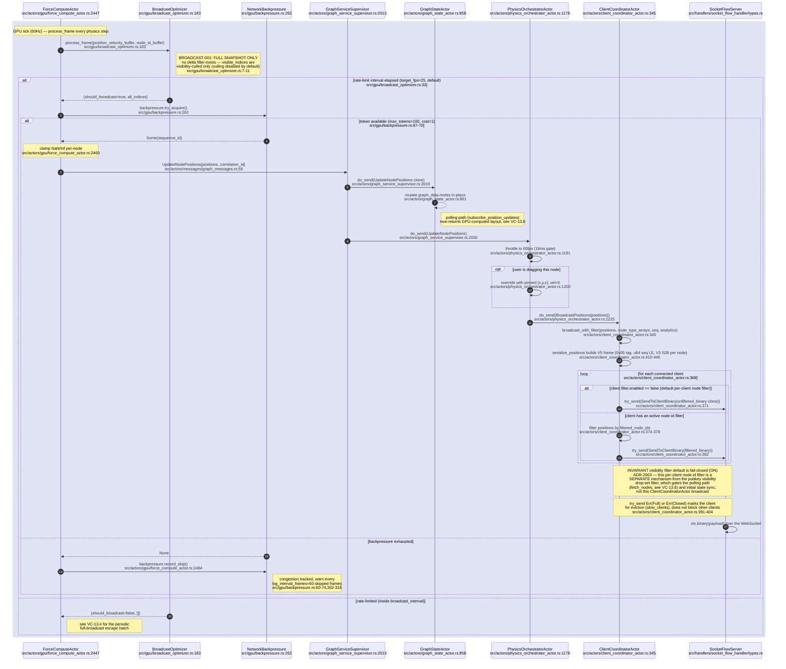
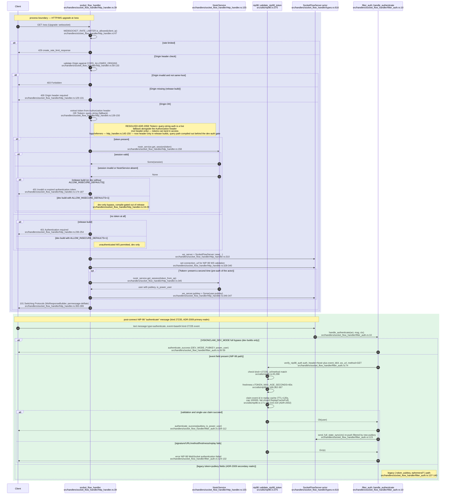
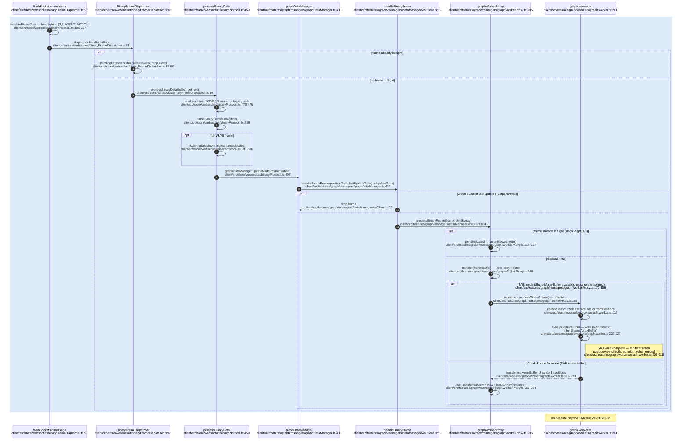
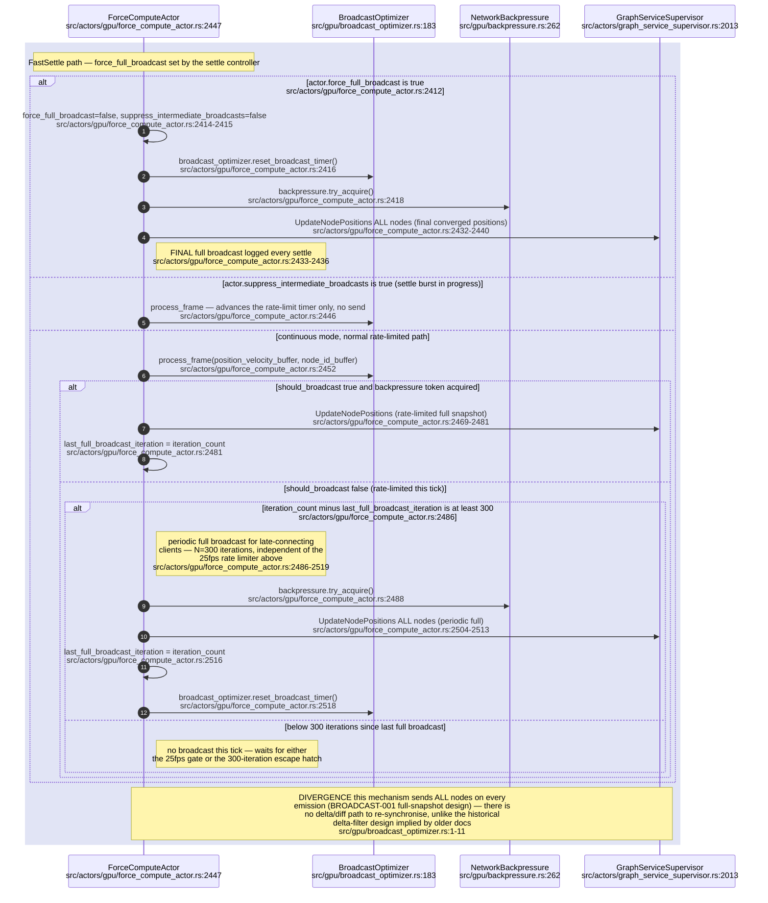
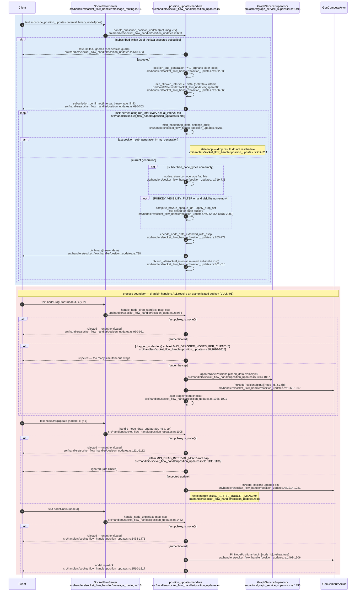
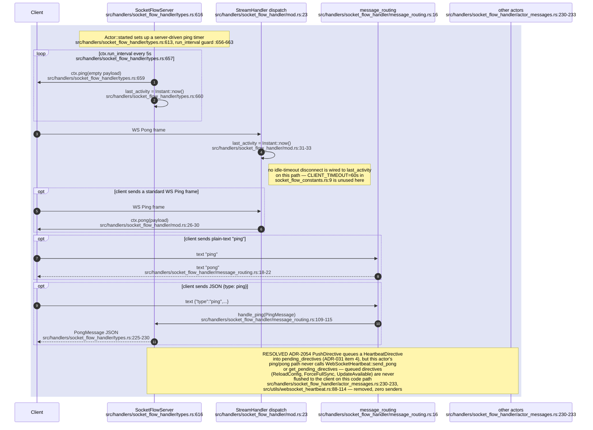
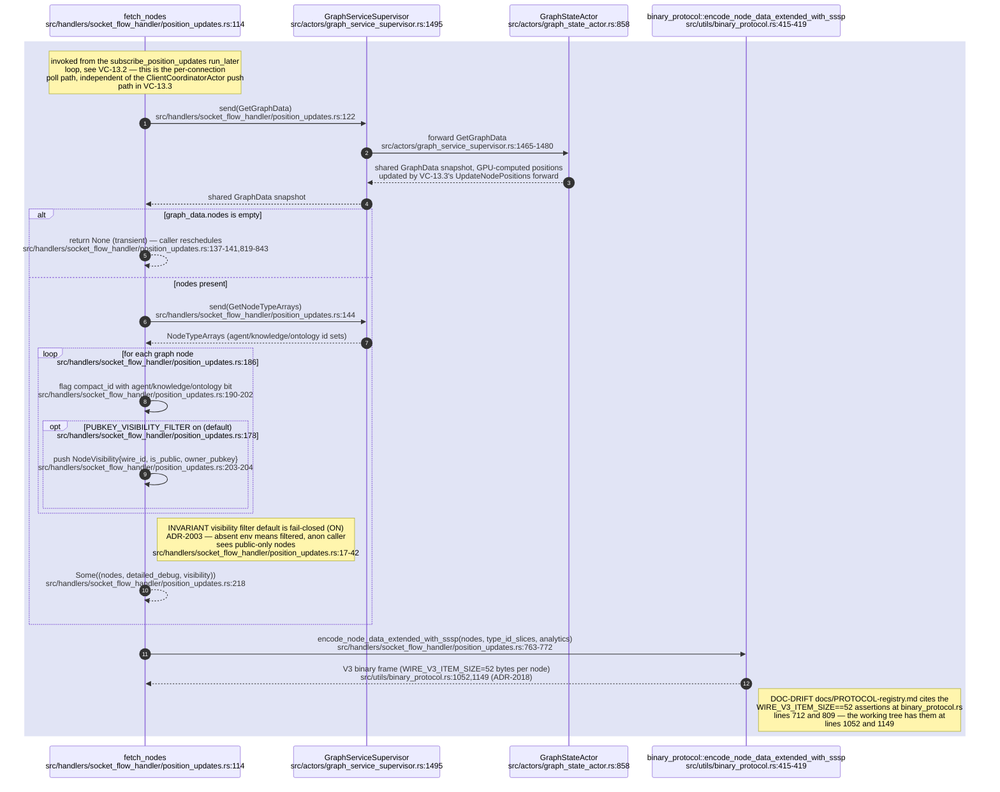
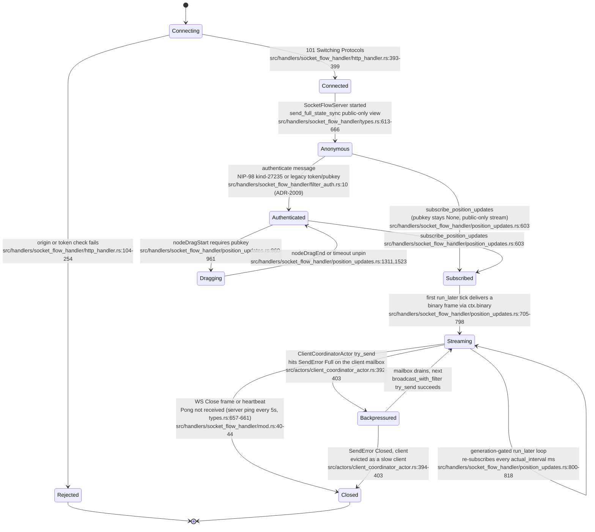

## VC-13.3 GPU broadcast frame end to end

## VC-13.1 WS connect, upgrade and authentication

## VC-13.7 Client decode: binary frame to SharedArrayBuffer

## VC-13.4 Periodic full-broadcast escape hatch

## VC-13.2 Subscribe to position updates, and drag/pin control messages

## VC-13.5 Heartbeat and ping/pong

## VC-13.6 Polling path — GetGraphData to binary encode

## VC-13.8 Client session lifecycle

