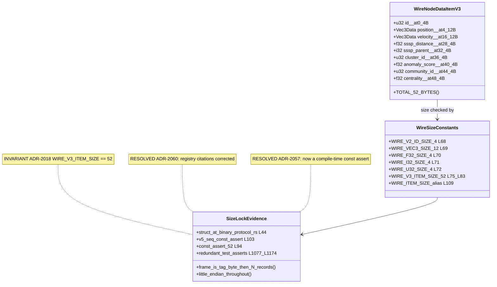
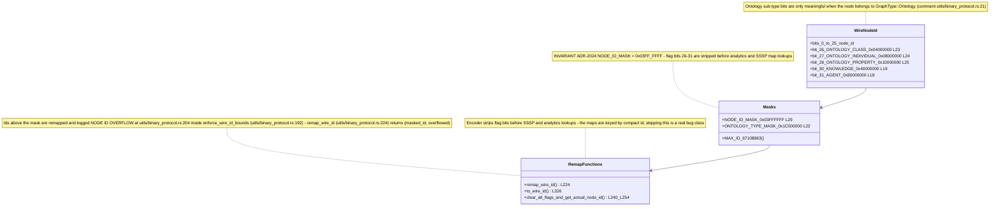
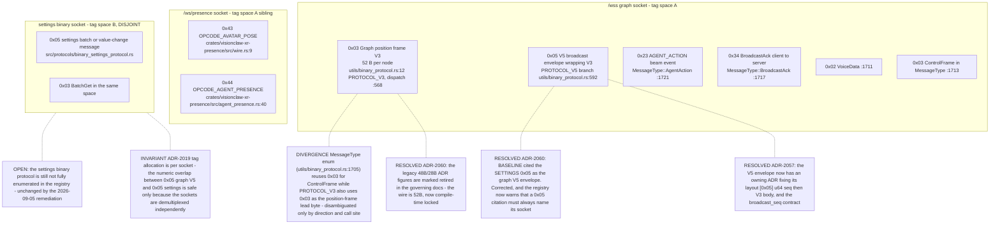
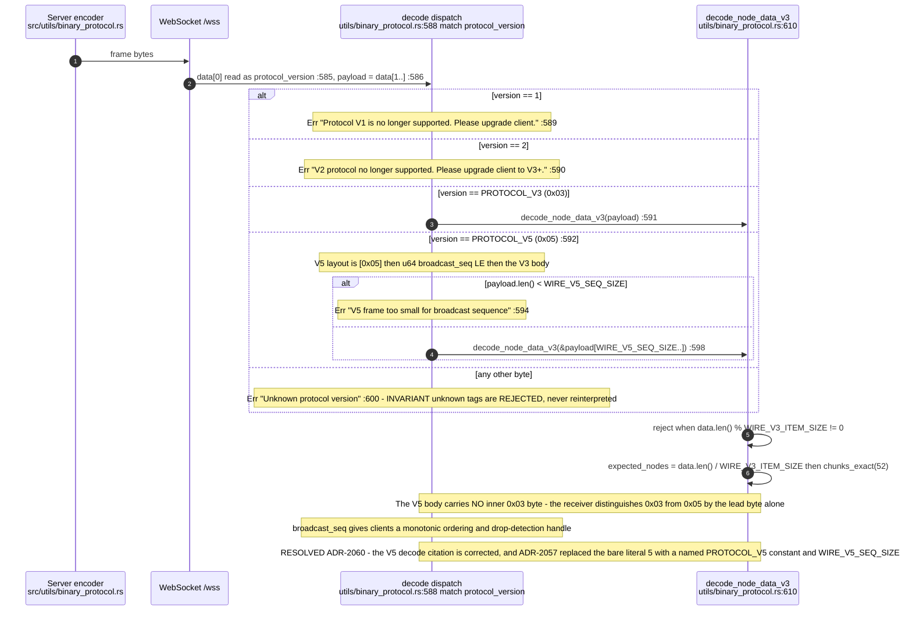
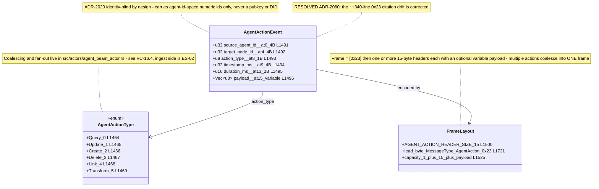
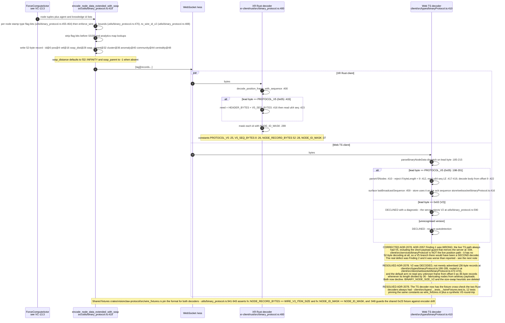
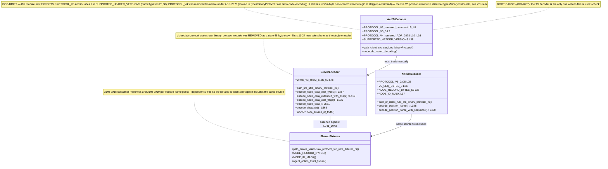
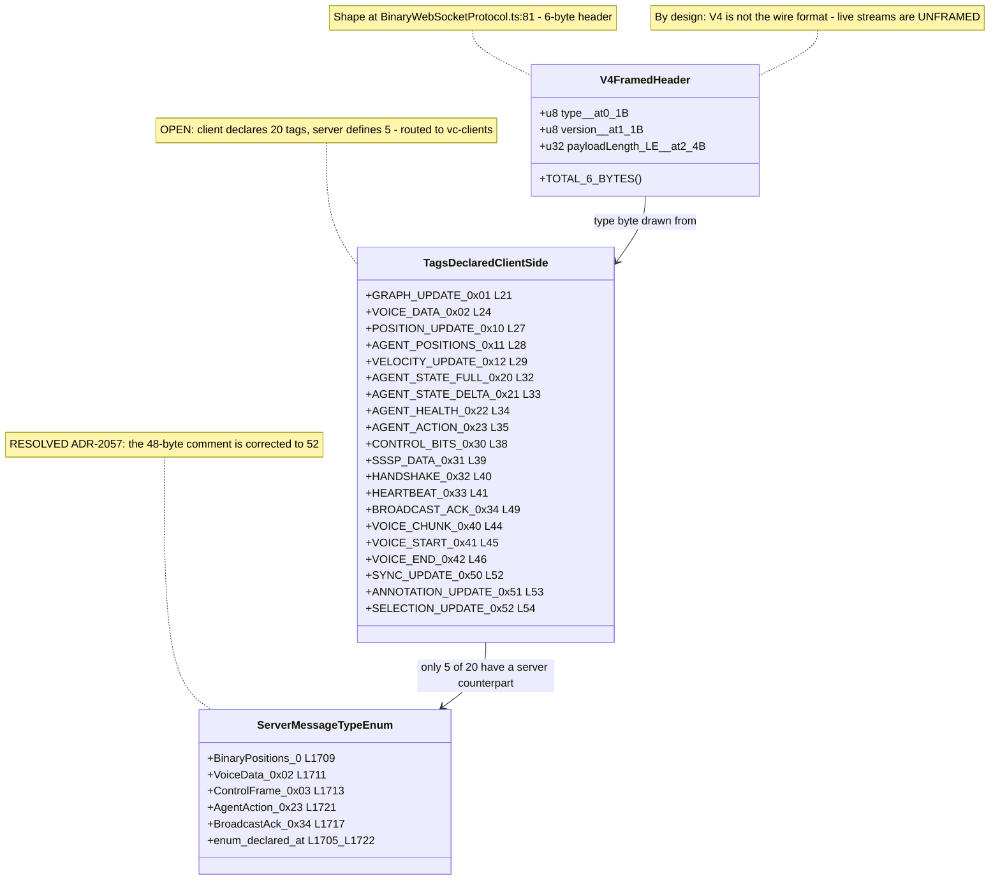
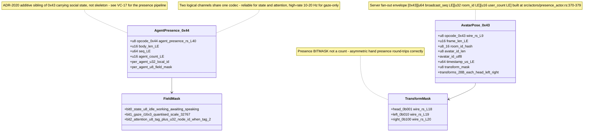

## VC-14.1 V3 position record — 52 bytes, little-endian

## VC-14.2 Wire node id — 26-bit id plus type flag bits

## VC-14.3 Tag byte 0 registry — two disjoint socket spaces

## VC-14.4 V5 envelope and tag dispatch with unknown-tag rejection

## VC-14.5 0x23 AGENT_ACTION frame

## VC-14.6 Encode to decode of one V5 frame, server to clients

## VC-14.7 The coexisting binary codecs

## VC-14.8 V4 framed-message header — client-emitted only

## VC-14.9 Presence sibling opcodes 0x43 and 0x44

