## VC-15.1 POST /analytics/clustering/run — spectral/kmeans/louvain/default dispatch with CPU fallback

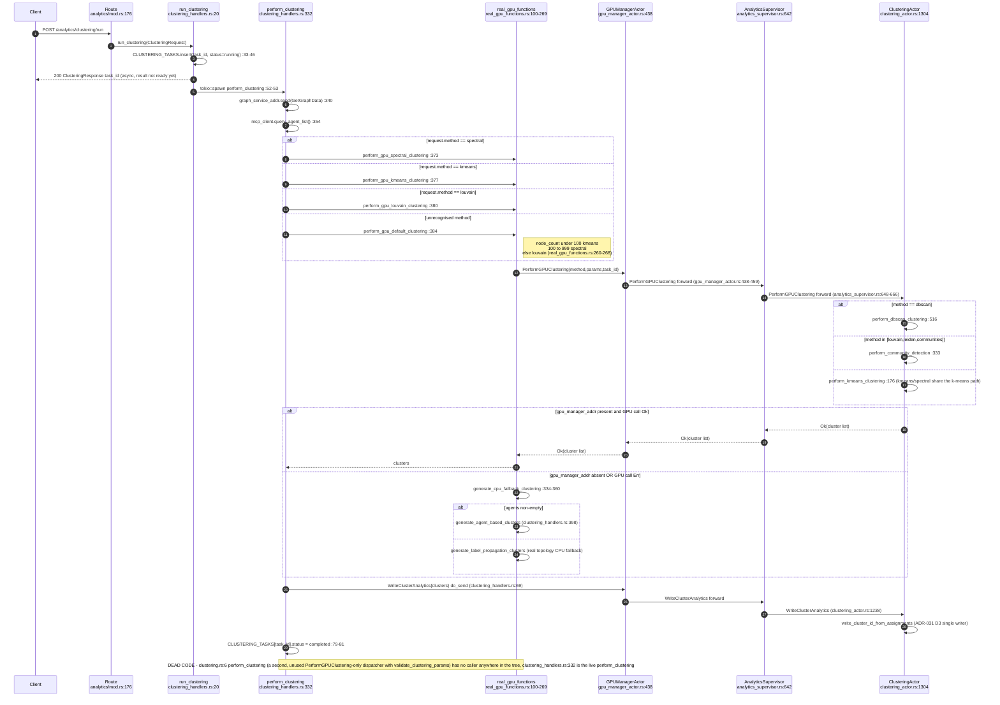

## VC-15.2 POST /analytics/clustering/dbscan — direct RunDBSCAN, GPU-only, precondition refusals

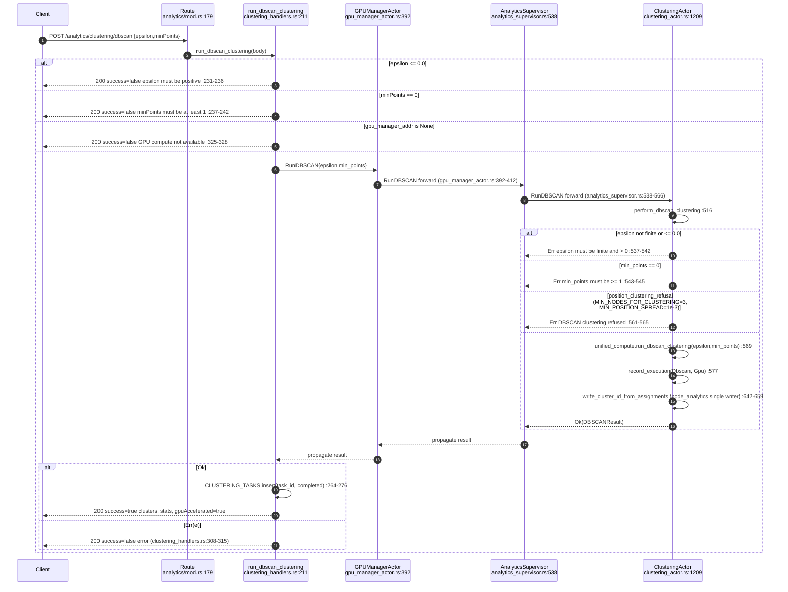

## VC-15.3 POST /analytics/community/detect — LabelPropagation/Louvain/Leiden with the modularity gate

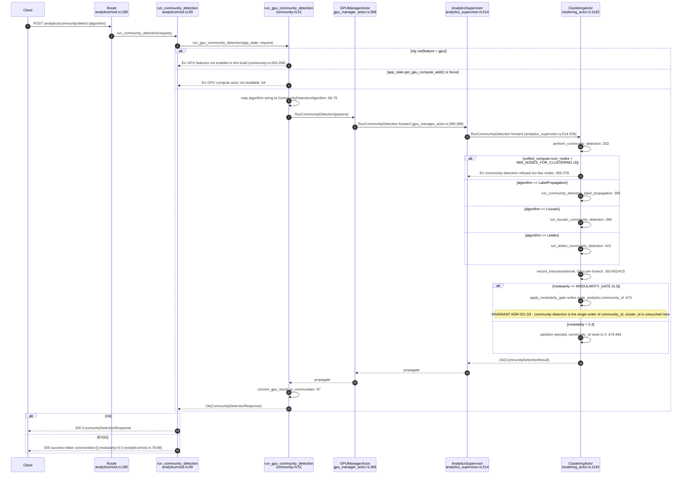

## VC-15.4 POST /analytics/anomaly/detect — LOF / Z-score / DBSCAN-noise structural anomaly

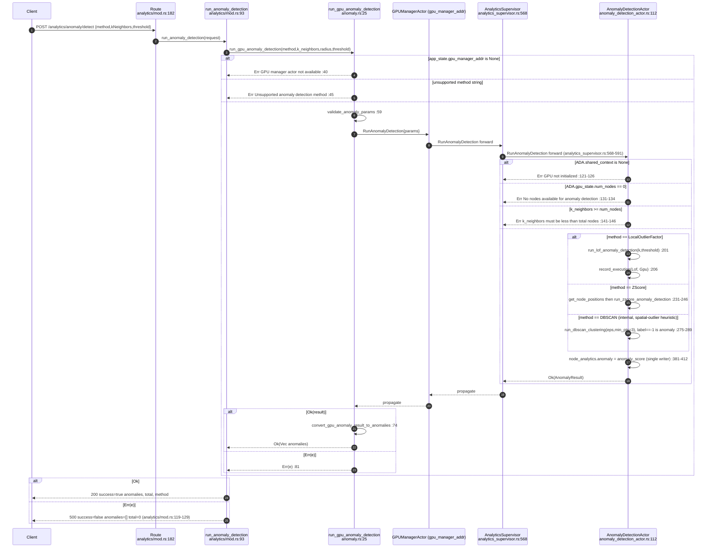

## VC-15.5 PageRank compute / cached result / cache clear — direct-addr, bypasses AnalyticsSupervisor

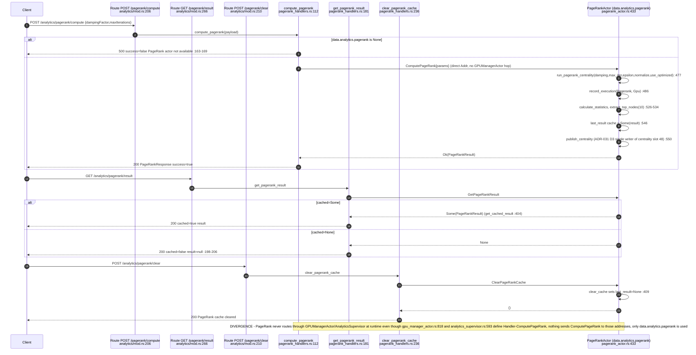

## VC-15.6 POST /analytics/pathfinding/sssp and /pathfinding/apsp — GPU ShortestPathActor, direct-addr

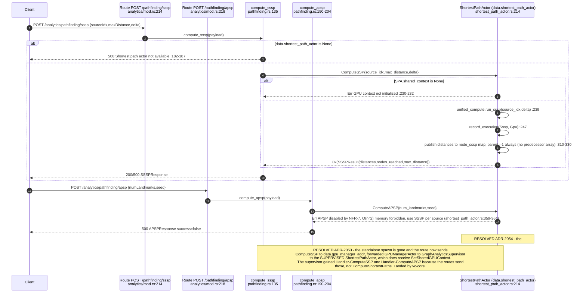

## VC-15.7 POST /analytics/sssp/compute — CPU Dijkstra via GraphServiceSupervisor, bypasses the GPU actor entirely

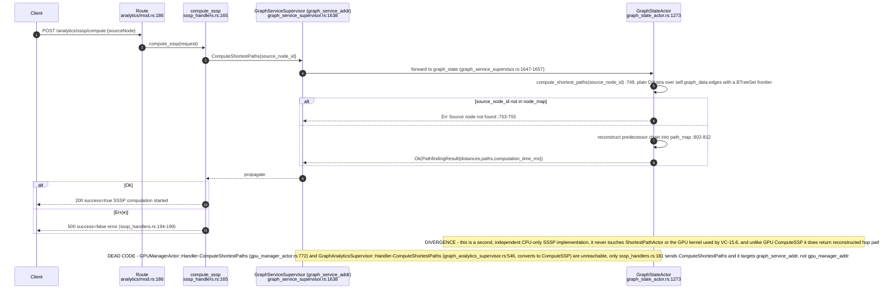

## VC-15.8 POST /analytics/pathfinding/connected-components — GPU with CPU fallback, direct-addr

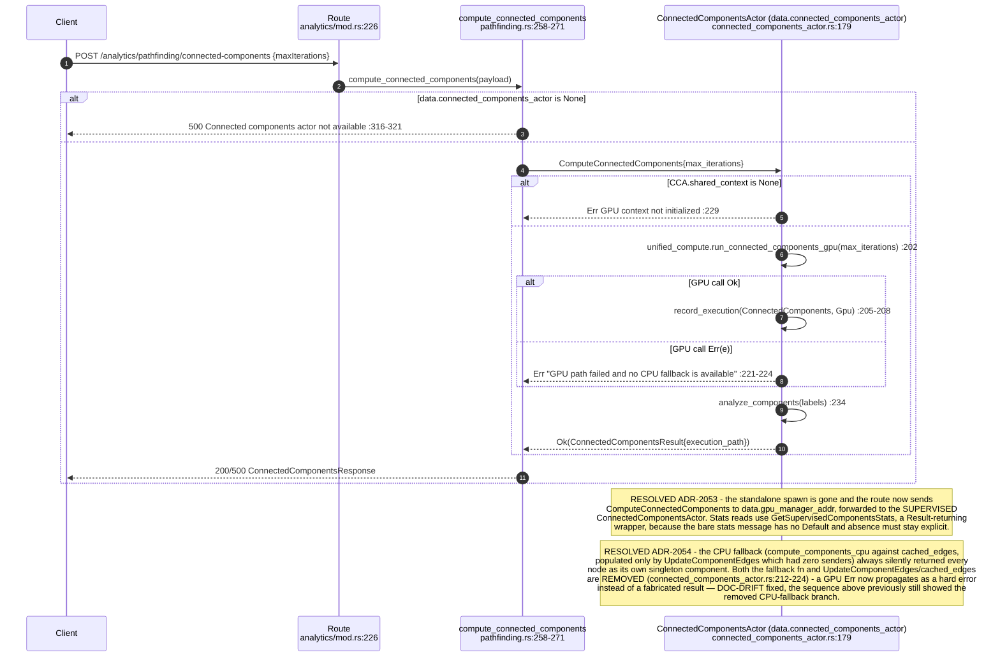

## VC-15.9 POST /analytics/pathfinding/path — point-to-point A* / Bidirectional Dijkstra / Semantic / SSSP dispatch

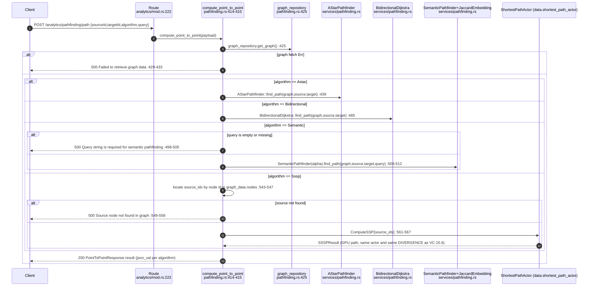

## VC-15.10 POST /pathfinding/semantic-path, /query-traversal, /chunk-traversal — CPU semantic A*

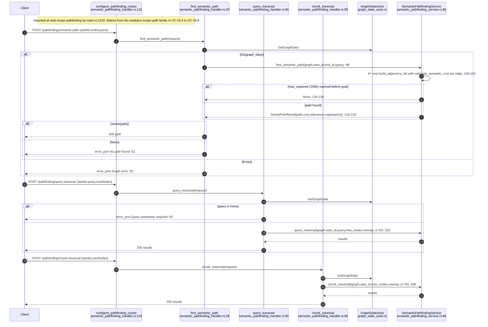

## VC-15.11 Semantic analyzer hexagonal slot — the dead port is gone, the live port remains

```mermaid
classDiagram
    class SemanticAnalyzer {
        <<trait, DEAD - zero impls>>
        run_sssp(graph, source) Result~SSSPResult~
        run_clustering(graph, algorithm) Result~ClusteringResult~
        detect_communities(graph) Result~CommunityResult~
        get_shortest_path(graph, source, target) Result~Vec~u32~~
        invalidate_cache() Result~()~
    }
    note for SemanticAnalyzer "REMOVED: dead port deleted by vc-knowledge on my ADR-2054 routing"

    class GpuSemanticAnalyzer {
        <<trait, LIVE hexagonal port>>
        initialize(graph) Result~()~
        detect_communities(algorithm) Result~CommunityDetectionResult~
        compute_shortest_paths(source_node_id) Result~PathfindingResult~
        compute_sssp_distances(source_node_id) Result~Vec~f32~~
        compute_landmark_apsp(num_landmarks) Result~Vec~Vec~f32~~~
        analyze_node_importance(algorithm) Result~OptimizationResult~
        get_statistics() Result~SemanticStatistics~
    }
    note for GpuSemanticAnalyzer "visionclaw-domain/src/ports/gpu_semantic_analyzer.rs:95"

    class GpuSemanticAnalyzerAdapter {
        gpu_compute: Option~UnifiedGPUCompute~
        sssp_cache: HashMap~u32,Vec~f32~~
        apsp_cache: Option~Vec~Vec~f32~~~
        initialize_gpu(num_nodes, num_edges) Result~()~
        compute_landmark_apsp_internal(num_landmarks)
    }
    note for GpuSemanticAnalyzerAdapter "adapters/gpu_semantic_analyzer.rs:22, real CUDA path via sssp_compact.ptx + gpu_landmark_apsp.ptx"

    class ActixSemanticAdapter {
        actor_addr: Option~Addr~SemanticProcessorActor~~
        timeout: Duration
    }
    note for ActixSemanticAdapter "adapters/actix_semantic_adapter.rs:26, wraps SemanticProcessorActor over an Addr"

    class GpuSemanticAnalyzerAdapter_NoGpu {
        <<cfg not feature gpu, CPU stub>>
        compute_shortest_paths(source_node_id) Result~PathfindingResult~
    }
    note for GpuSemanticAnalyzerAdapter_NoGpu "semantic_processor_actor.rs:49, returns an empty result, no-op initialize"

    class MockSemanticAnalyzer {
        <<test double>>
    }
    note for MockSemanticAnalyzer "application/semantic_service.rs:229"

    GpuSemanticAnalyzer <|.. GpuSemanticAnalyzerAdapter
    GpuSemanticAnalyzer <|.. ActixSemanticAdapter
    GpuSemanticAnalyzer <|.. GpuSemanticAnalyzerAdapter_NoGpu
    GpuSemanticAnalyzer <|.. MockSemanticAnalyzer
```

## VC-15.12 Visual analytics GPU types (src/gpu/visual_analytics.rs) with validate() failure modes

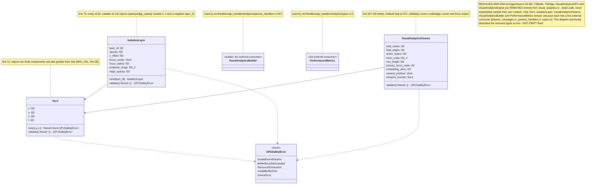

## VC-15.13 Analytics kernel trust status and the CPU reference oracle

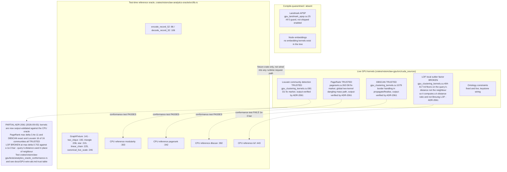
