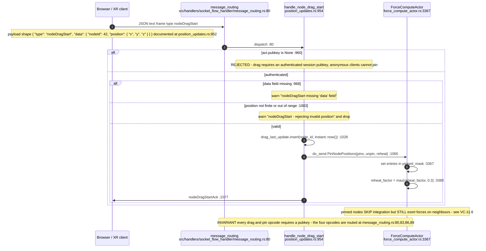
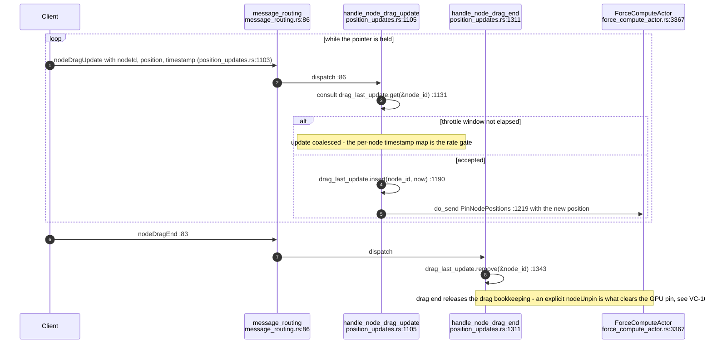
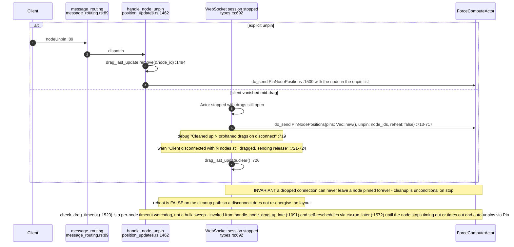
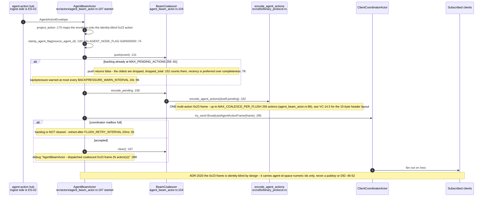
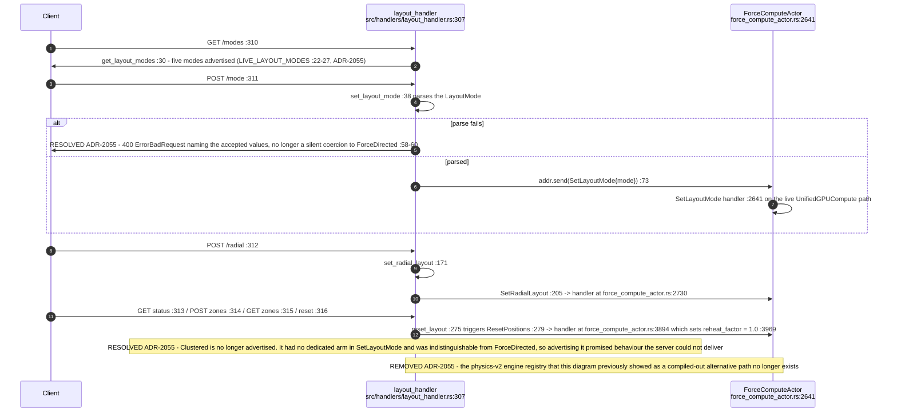
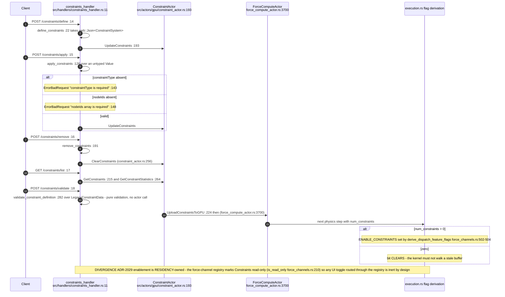
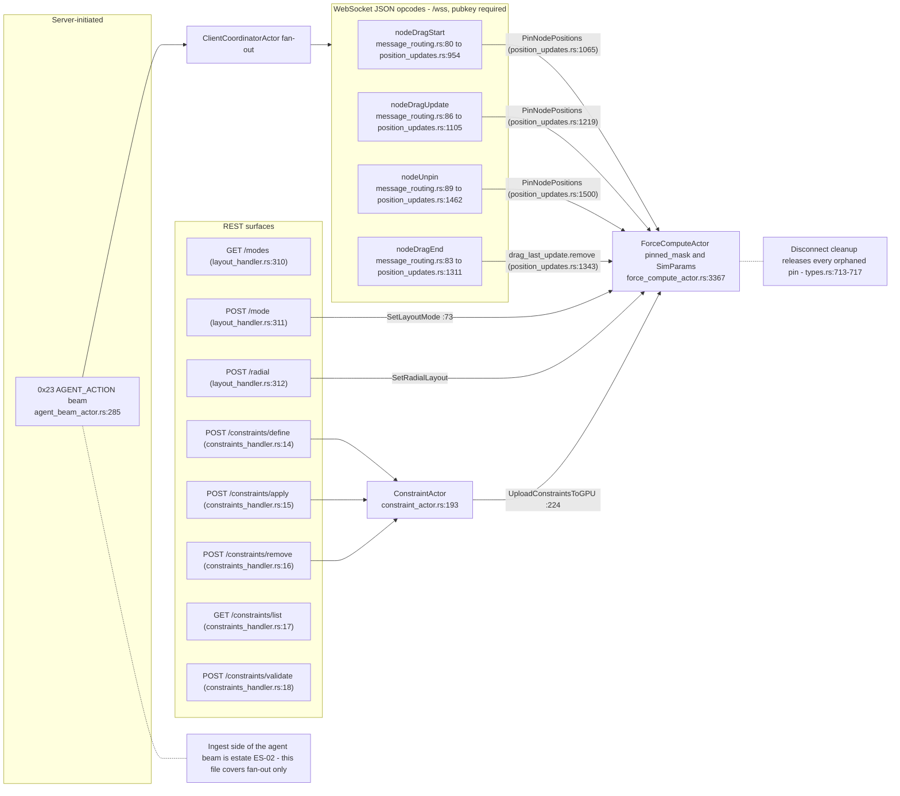

## VC-16.1 Node drag start — pin acquisition

## VC-16.2 Drag update and drag end

## VC-16.3 Unpin and orphaned-drag cleanup on disconnect

## VC-16.4 Agent beam 0x23 fan-out

## VC-16.5 Layout mode switch over REST — post-ADR-2055

## VC-16.6 Constraint CRUD to GPU residency

## VC-16.7 Interaction surface map

