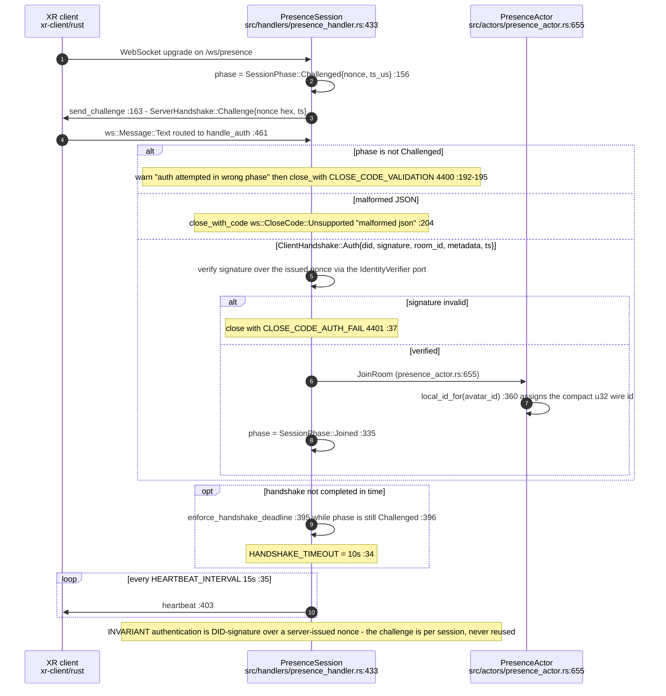
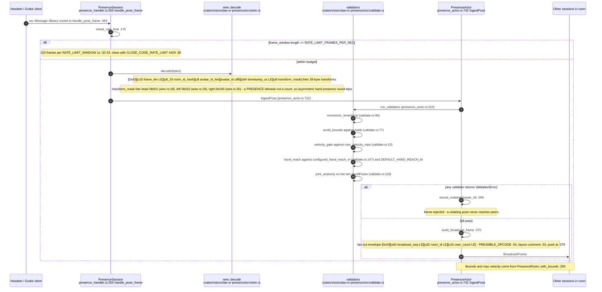
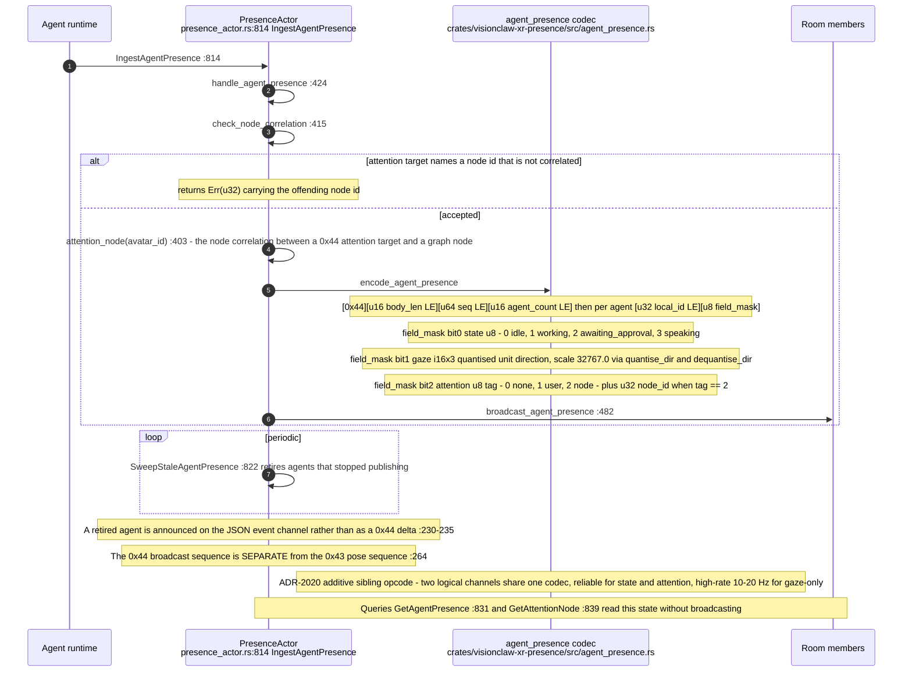
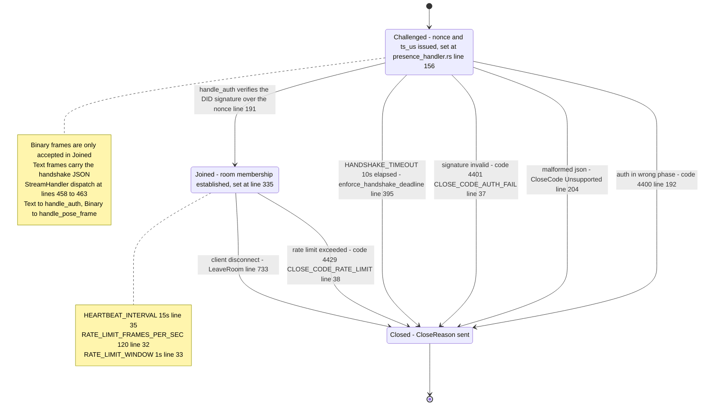
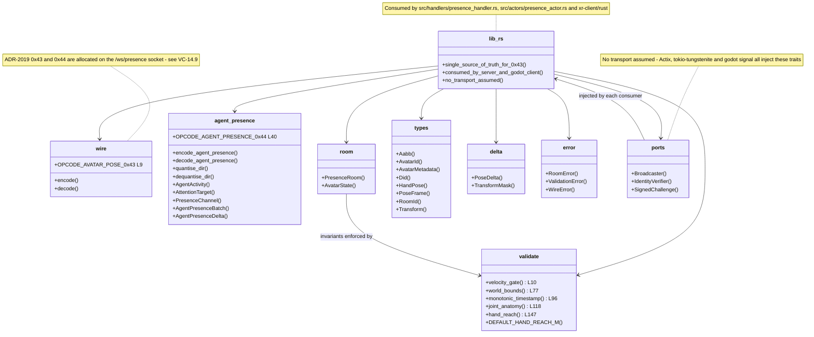
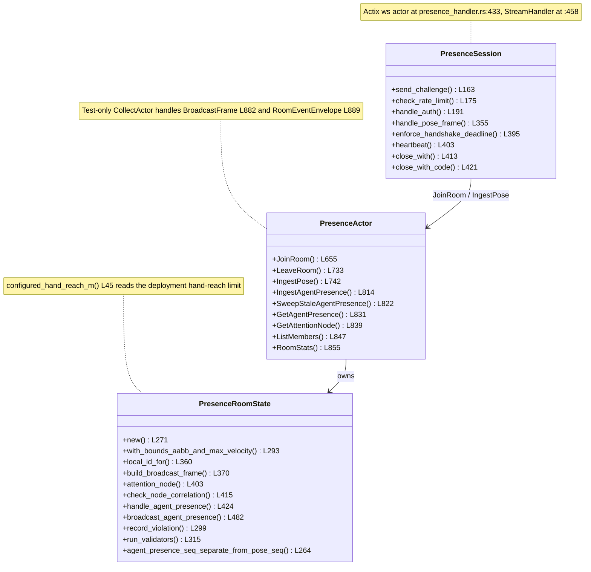

## VC-17.1 Presence session handshake and authentication

## VC-17.2 Headset pose to peers — 0x43 path

## VC-17.3 Agent co-presence — 0x44 sibling channel

## VC-17.4 Session phase lifecycle

## VC-17.5 Crate structure and transport-agnostic ports

## VC-17.6 PresenceActor message surface

