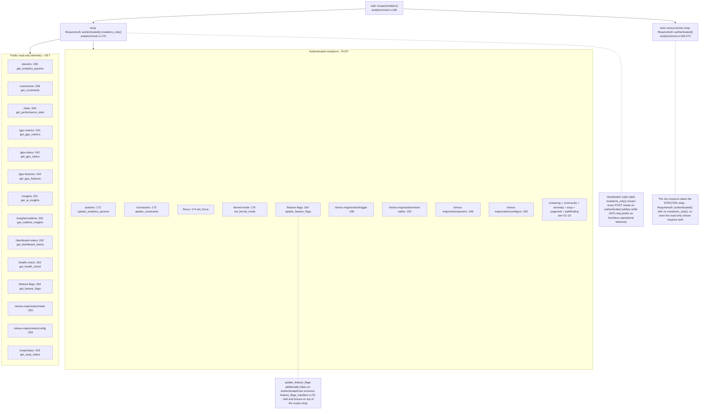
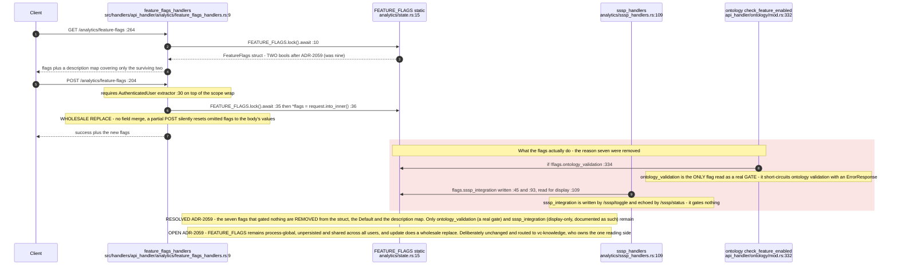
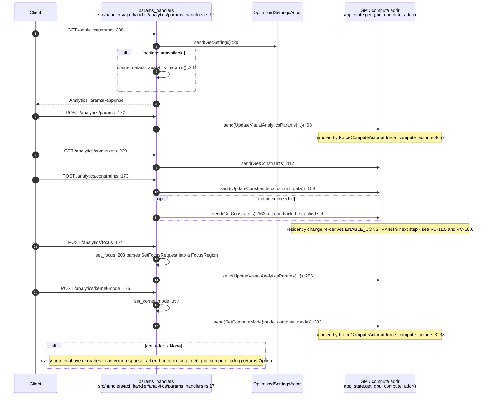
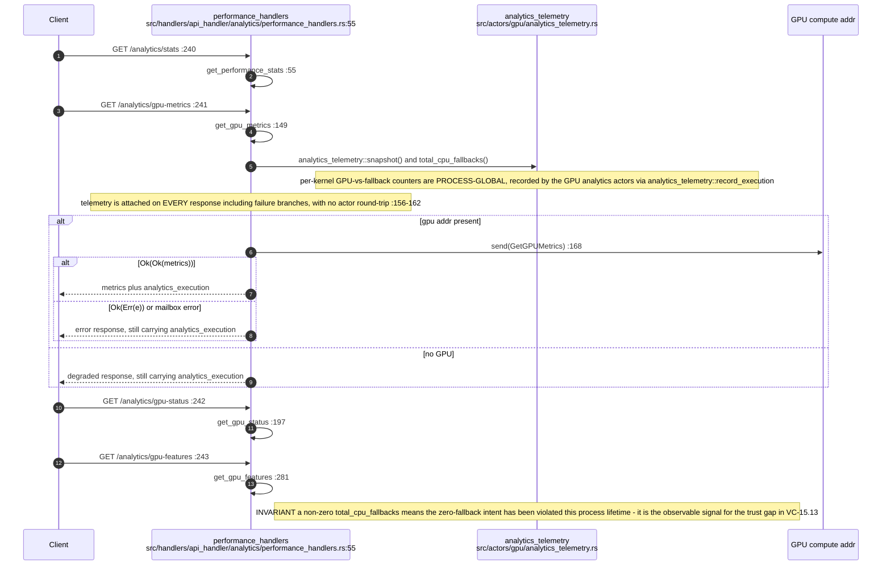
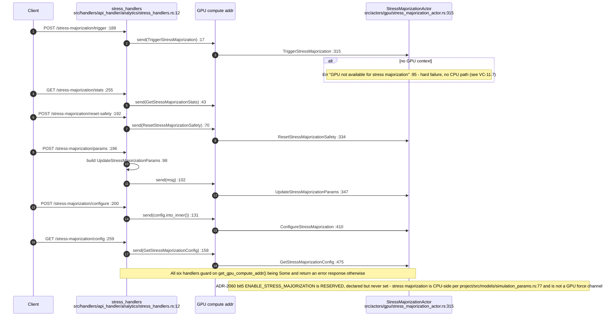
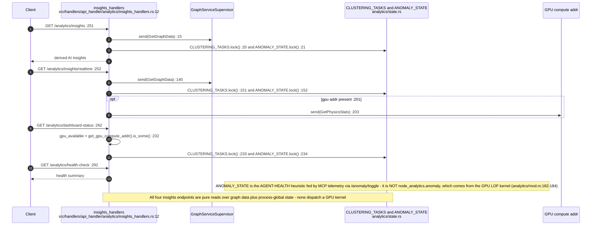
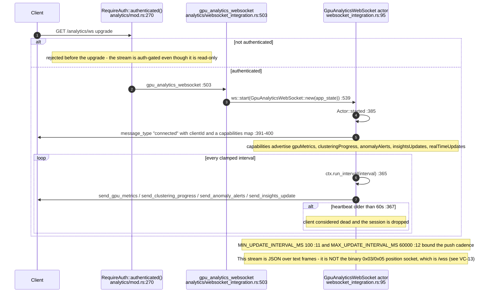
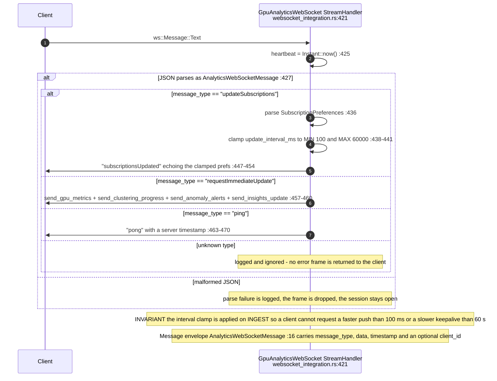
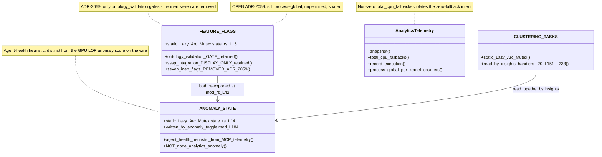

## VC-18.1 /analytics scope — auth wrapper and route table

## VC-18.2 Feature flags — get, update, and what they actually gate

## VC-18.3 Params handlers — analytics params, constraints, focus, kernel mode

## VC-18.4 Performance handlers — stats, GPU metrics, status and features

## VC-18.5 Stress-majorization handlers

## VC-18.6 Insights handlers

## VC-18.7 Analytics WebSocket — connect, subscribe, stream

## VC-18.8 Analytics WebSocket — inbound message handling

## VC-18.9 Analytics process-global state

