## VC-20.1 load_ontology bin - actual sample-data loader
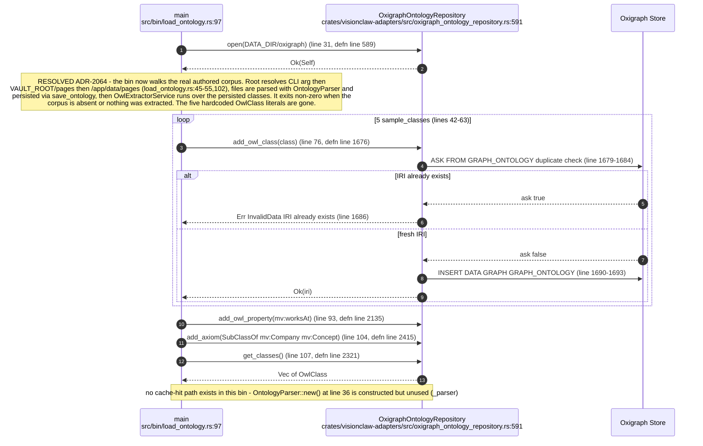

## VC-20.2 Oxigraph named-graph layout — authored and reasoner graphs
```mermaid
erDiagram
    GRAPH_ONTOLOGY_ASSERT {
        string iri "urn:ngm:graph:ontology:assert (oxigraph_ontology_repository.rs:48)"
        string contents "OwlClass/OwlProperty/OwlAxiom triples, vc: ns"
    }
    GRAPH_ONTOLOGY_INFERRED {
        string iri "urn:ngm:graph:ontology:inferred (line 47)"
        string contents "whelk-derived SubClassOf/EquivalentClass closure"
    }
    GRAPH_KNOWLEDGE {
        string iri "urn:ngm:graph:knowledge (line 48)"
        string contents "KGNode + KGEdge triples"
    }
    GRAPH_AGENT {
        string iri "urn:ngm:graph:agent (line 49)"
        string contents "agent-flagged nodes"
    }
    GRAPH_SHAPES {
        string iri "urn:ngm:graph:shapes (line 54)"
        string contents "SHACL shape triples loaded from ttl at startup"
    }
    GRAPH_PROVENANCE {
        string iri "urn:ngm:graph:provenance (line 55)"
        string contents "append-only PROV-O activity triples, see VC-22"
    }
    OxigraphOntologyRepository ||--o{ GRAPH_ONTOLOGY_ASSERT : "add_owl_class add_axiom lines 1676 2415"
    OxigraphOntologyRepository ||--o{ GRAPH_ONTOLOGY_INFERRED : "store_inference_results CLEAR+INSERT line 2466 ADR-2004 D9"
    OxigraphGraphRepository ||--o{ GRAPH_KNOWLEDGE : "src/adapters/oxigraph_graph_repository.rs:6"
    OxigraphGraphRepository ||--o{ GRAPH_AGENT : "src/adapters/oxigraph_graph_repository.rs:16"
    OxigraphOntologyRepository ||--o{ GRAPH_SHAPES : "load_shacl_shapes line 408"
    OxigraphOntologyRepository ||--o{ GRAPH_PROVENANCE : "emit_provenance line 646 see VC-22"
```

## VC-20.3 Whelk EL++ reasoning cycle (github_sync post-sync)
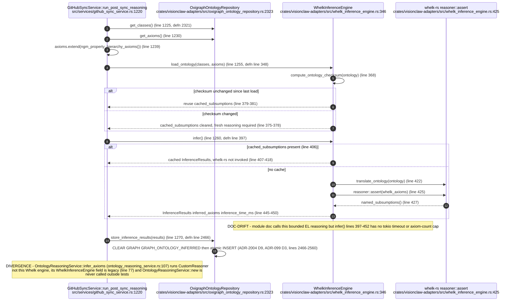

## VC-20.4 inferred-edge materialisation and class-summary index
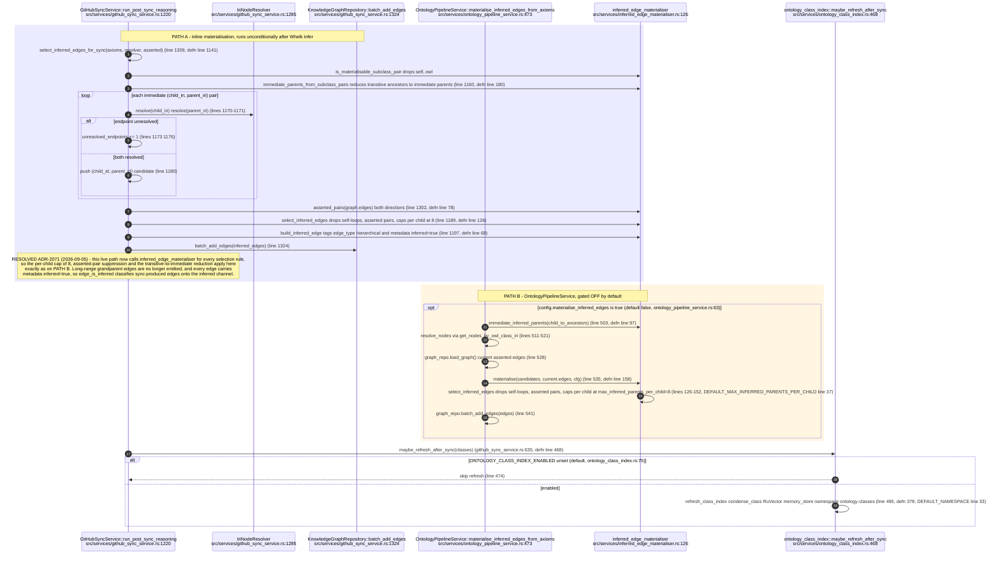

## VC-20.5 governed mutation - propose_create
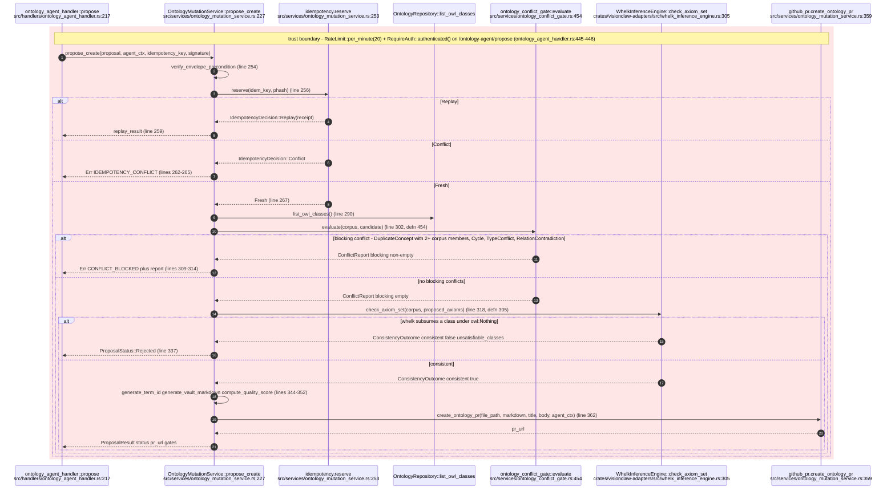

## VC-20.6 SPARQL read path - /ontology/query
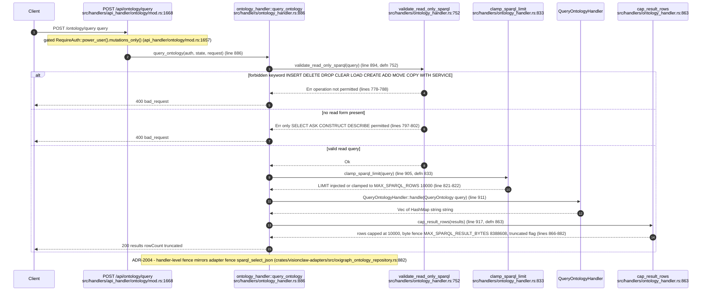

## VC-20.7 ontology HTTP route families
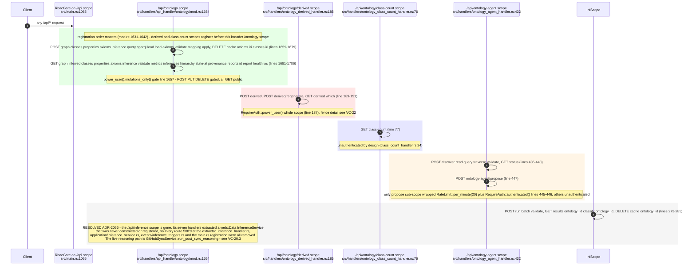

## VC-20.8 OntologyActor message set
```mermaid
classDiagram
    class OntologyActor
    class InitializeActor
    class JobCompleted
    class LoadOntologyAxioms
    class UpdateOntologyMapping
    class ValidateOntology
    class ApplyInferences
    class GetOntologyReport
    class GetOntologyHealth
    class ClearOntologyCaches
    class TriggerReasoning
    class GetCachedOntologies
    class ProcessOntologyData
    class ApplyMaterializedAxioms

    OntologyActor ..> InitializeActor : Handler ontology_actor.rs 707
    OntologyActor ..> JobCompleted : Handler line 739
    OntologyActor ..> LoadOntologyAxioms : Handler line 749
    OntologyActor ..> UpdateOntologyMapping : Handler line 781
    OntologyActor ..> ValidateOntology : Handler line 791
    OntologyActor ..> ApplyInferences : Handler line 849
    OntologyActor ..> GetOntologyReport : Handler line 871
    OntologyActor ..> GetOntologyHealth : Handler line 906
    OntologyActor ..> ClearOntologyCaches : Handler line 938
    OntologyActor ..> TriggerReasoning : Handler line 962
    OntologyActor ..> GetCachedOntologies : Handler line 985

    note for ValidateOntology "fields ontology_id, graph_data, mode, job_id (ontology_messages.rs:36-46), rtype<br/>Result of ValidationReport or String"
    note for ApplyInferences "fields rdf_triples, max_depth (ontology_messages.rs:50-55)"
    note for TriggerReasoning "fields ontology_id i64, source String (ontology_actor.rs:957-960), handler forwards<br/>to ReasoningActor per comment lines 971-973 which no longer exists"
    note for ApplyMaterializedAxioms "fields axioms, graph_data (ontology_messages.rs:85-88); NOT handled by OntologyActor<br/>- routed GPUManagerActor gpu_manager_actor.rs 645 to PhysicsSupervisor<br/>physics_supervisor.rs 732 to OntologyConstraintActor ontology_constraint_actor.rs 522"
    note for ProcessOntologyData "fields pages Vec of LogseqPage (ontology_messages.rs:69-72)"
```

## VC-20.9 OntologyFileCache read and invalidate
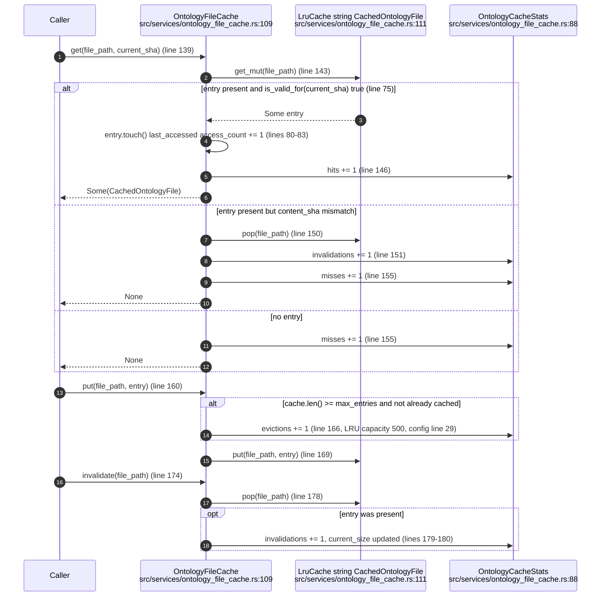

## VC-20.10 owl_validator shim and orphaned stubs
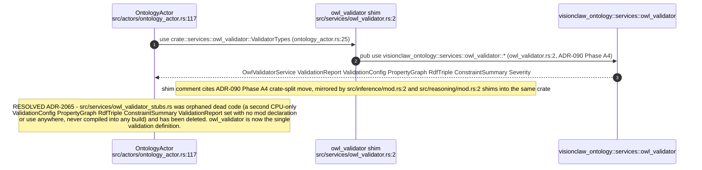

## VC-20.11 ontology_physics.toml consumption
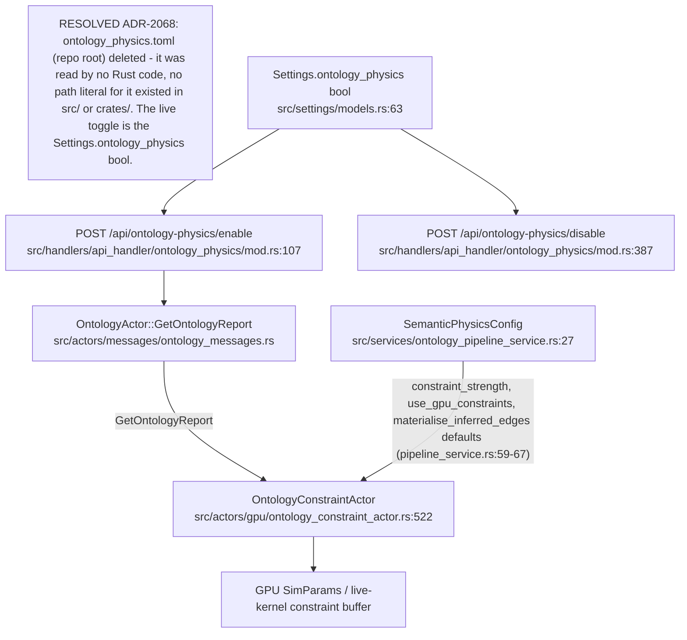

## VC-20.12 Oxigraph named-graph layout — fenced-derived, cache and migration graphs
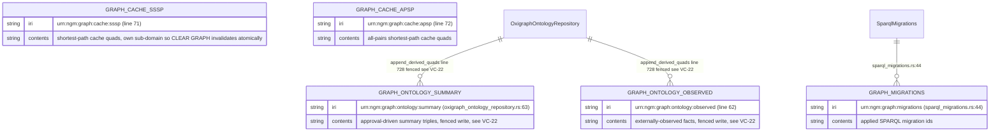
