## VC-21.1 GitHubSyncService::sync_graphs — full ingest path
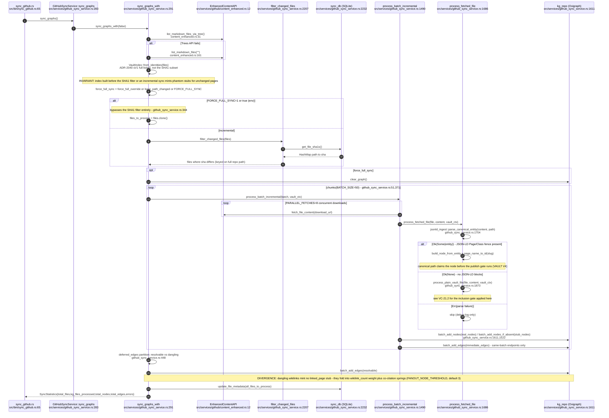

## VC-21.2 Frontmatter inclusion gate (ADR-2040 s V4, supersedes ADR-2014)
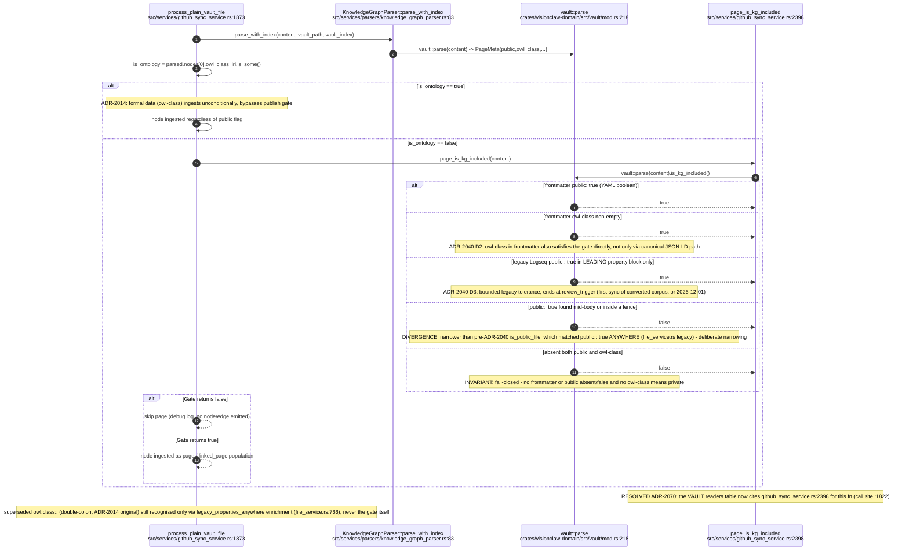

## VC-21.3 Node-type derivation: file to page / linked_page / owl_*
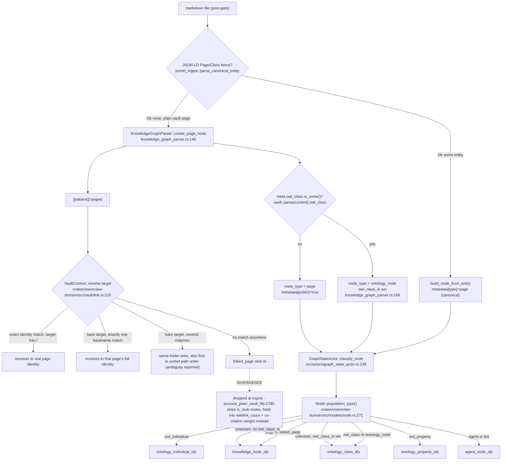

## VC-21.4 local_file_sync_service + sync_local binary
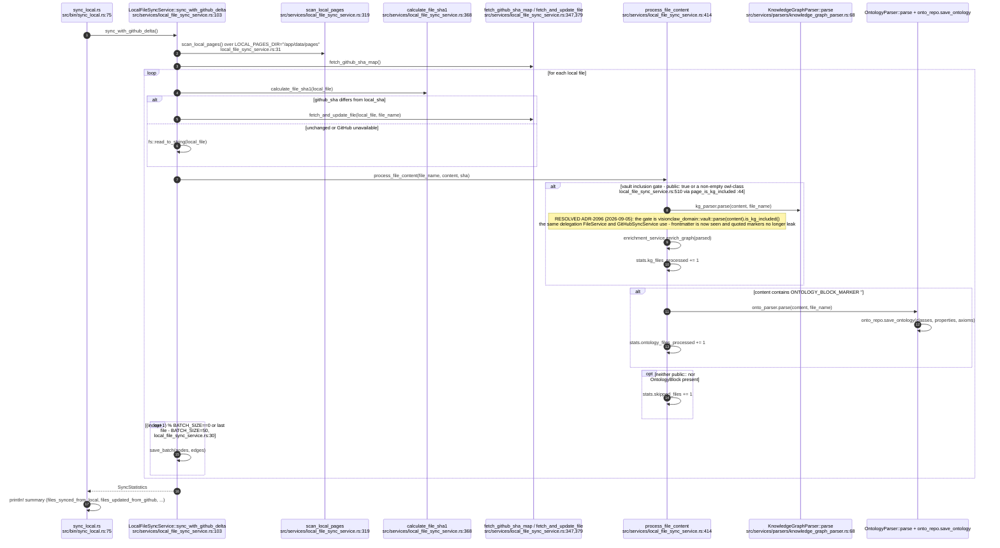

## VC-21.5 sync_github binary (full remote pull)
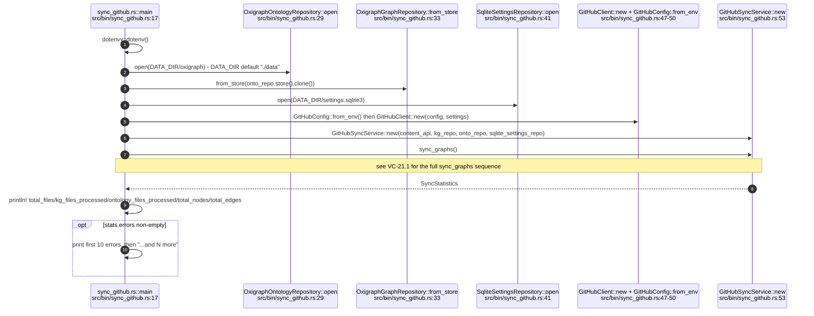

## VC-21.6 validate_md binary (JSON-LD validator CLI)
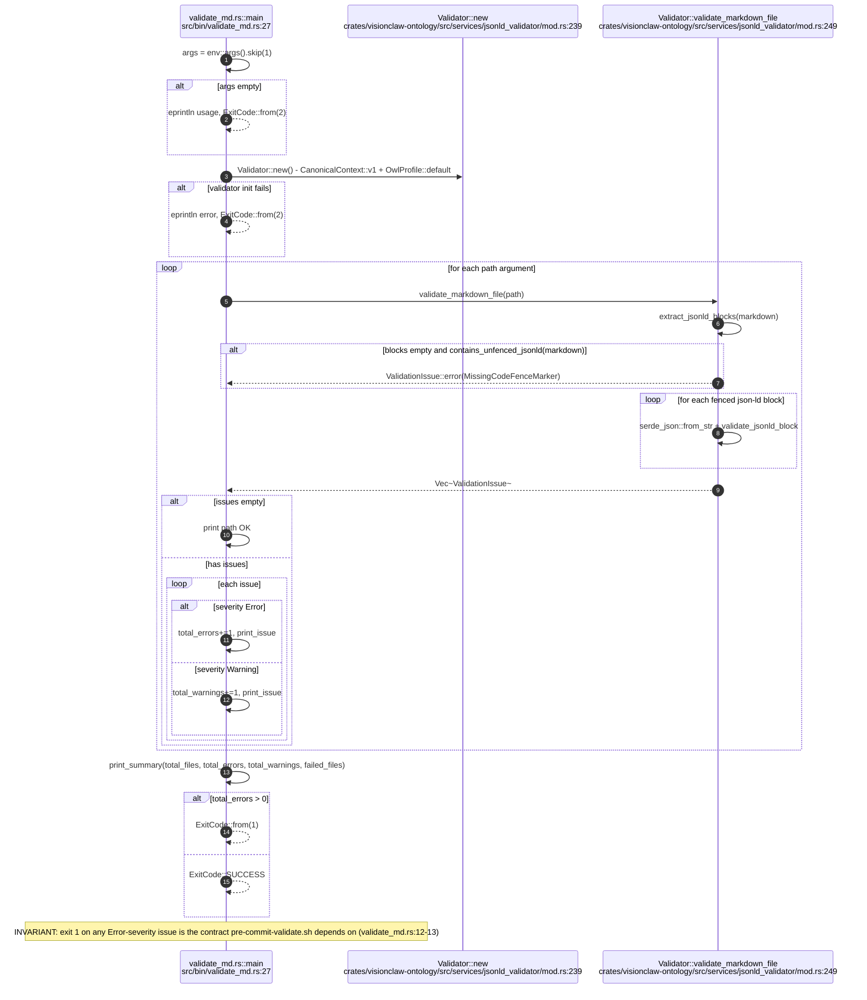

## VC-21.7 vault-migrate: one file through conversion
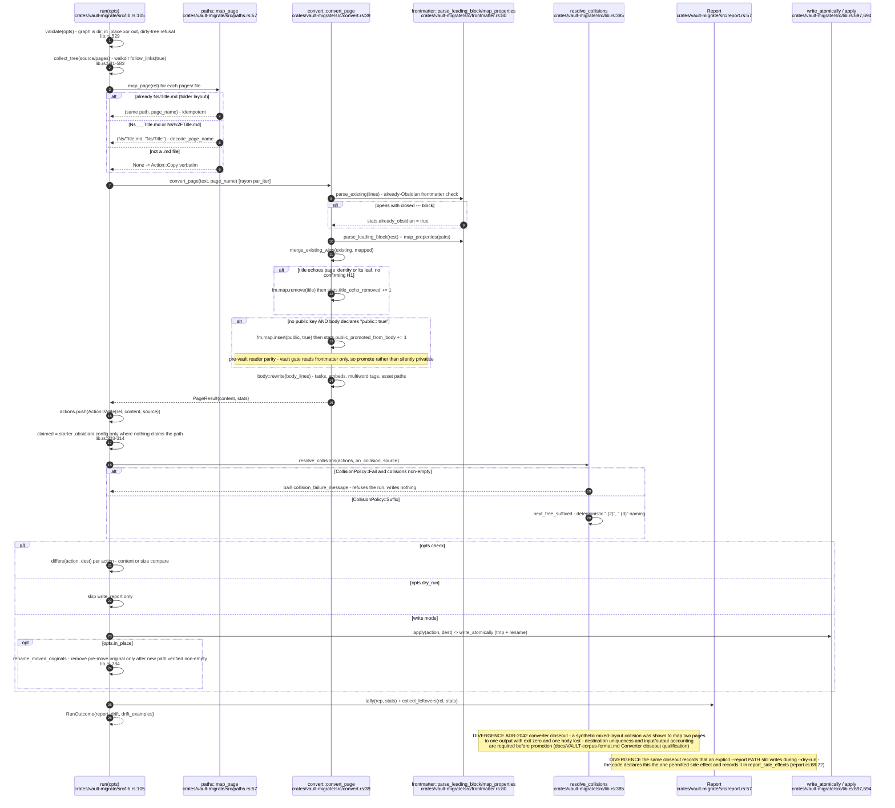

## VC-21.8 vault-migrate: per-file lifecycle
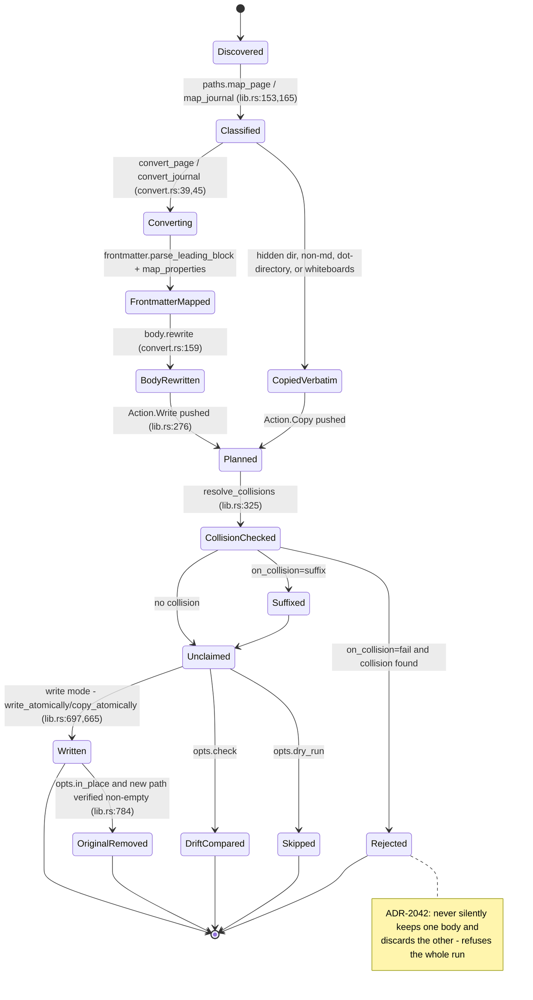

## VC-21.9 vault-migrate report structs
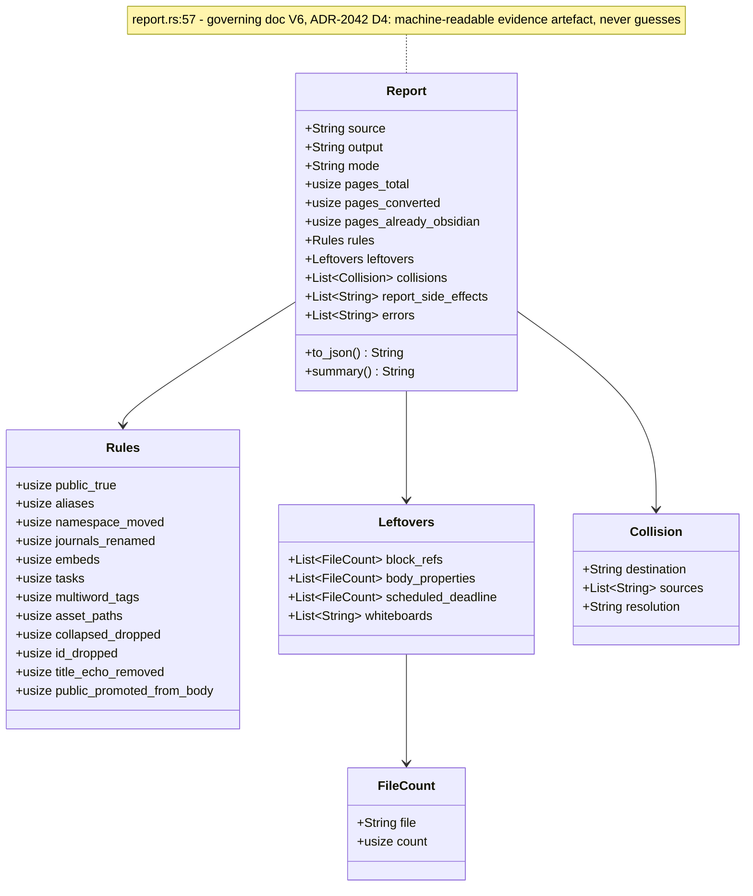

## VC-21.10 V1 vault layout (Obsidian vault root)
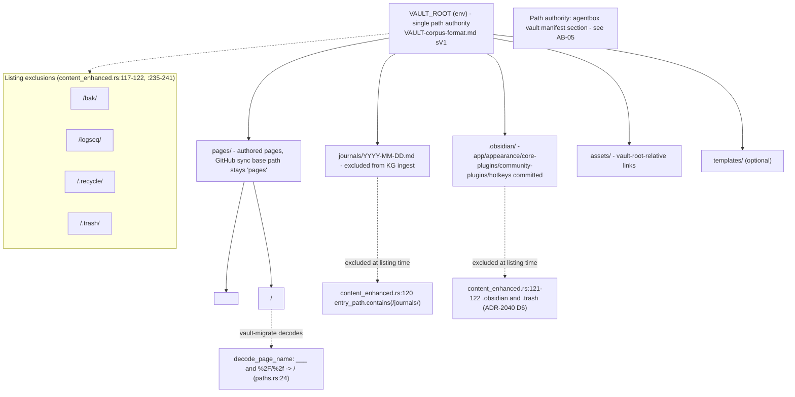

## VC-21.11 Settings and wire vocabulary — the bounded `logseq` alias (V7, ADR-2041)
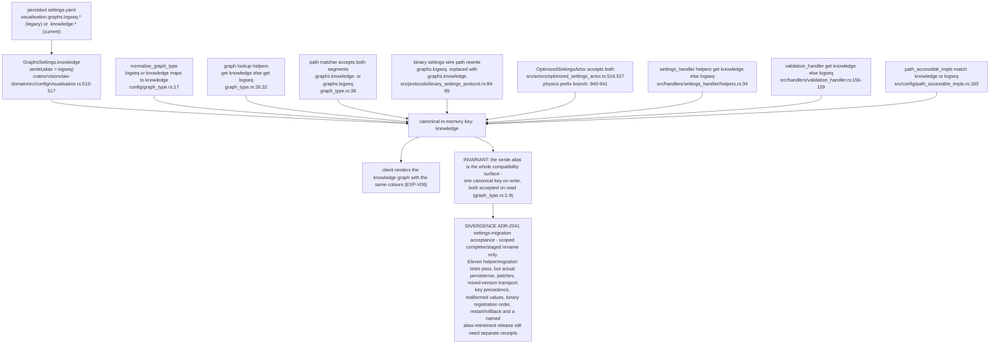

## VC-21.12 `owl-class` class-marker grammar — the typed inclusion half
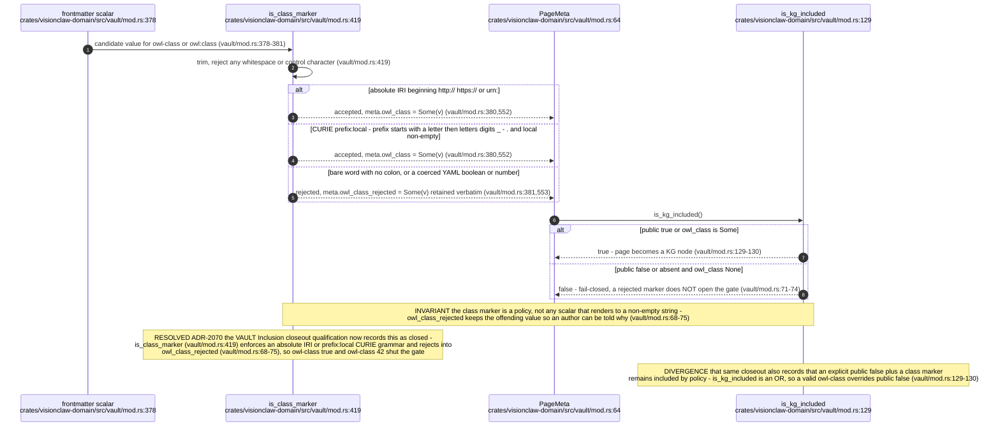
