## VC-22.1 Write-master per data class

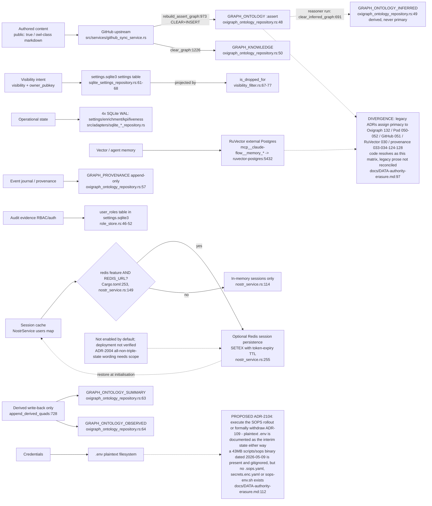

## VC-22.2 SQLite schemas (four write-master databases)

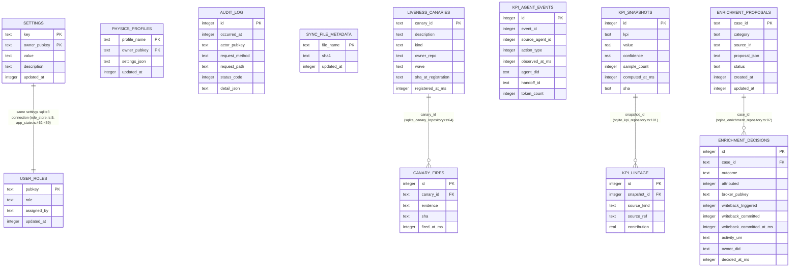

## VC-22.3 Derived-writeback fence (`POST /api/ingest/writeback`, ADR-2015)

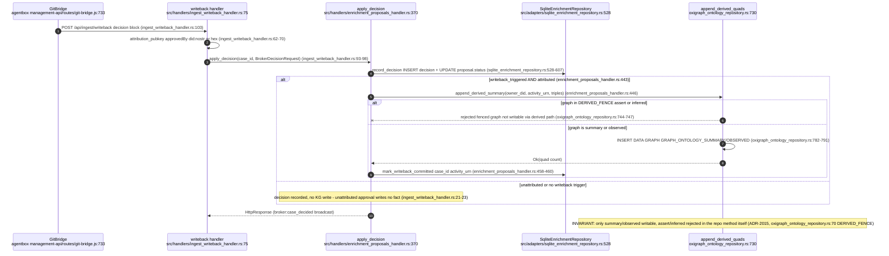

## VC-22.4 Provenance write — two producers, one append-only graph (ADR-2016)

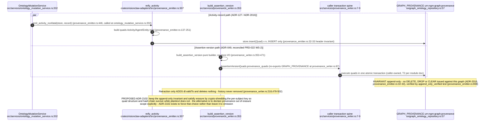

## VC-22.5 Unified provenance trace read path (`GET /api/trace`)

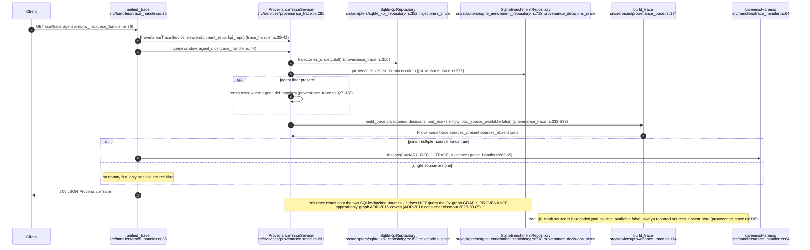

## VC-22.6 Erasure — `deleteAgentMemory` Pod path (RuVector tombstone gap)

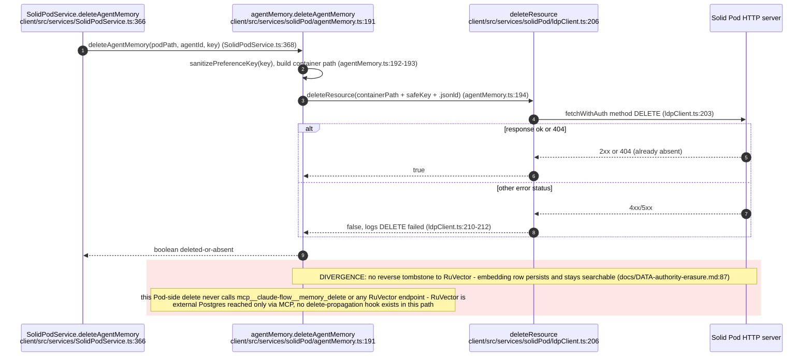

## VC-22.7 SQLite online backup (`scripts/backup-sqlite.sh`, ADR-2017)

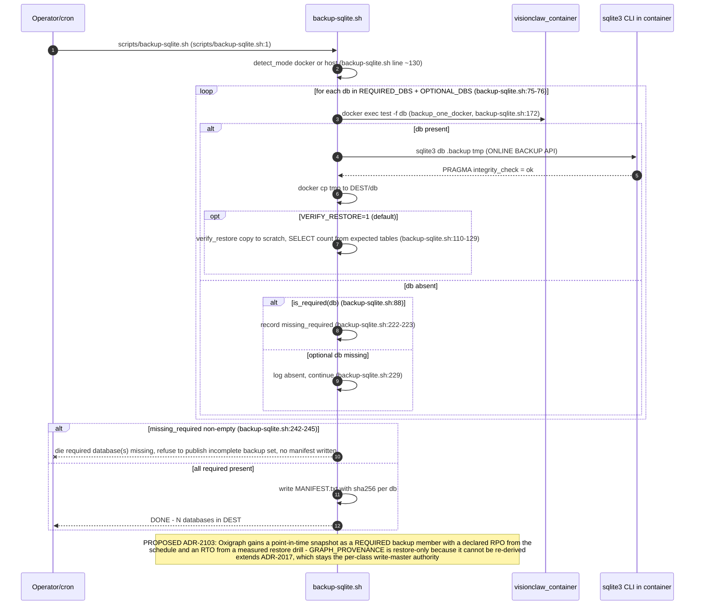

## VC-22.8 Dual-writes: fact fan-out to two stores

```mermaid
sequenceDiagram
    autonumber
    participant SYNC as GithubSyncService<br/>src/services/github_sync_service.rs:992 rebuild_assert_graph
    participant KG as GRAPH_KNOWLEDGE<br/>oxigraph_ontology_repository.rs:50
    participant AG as GRAPH_ONTOLOGY assert<br/>oxigraph_ontology_repository.rs:48
    participant APD as apply_decision<br/>src/handlers/enrichment_proposals_handler.rs:370
    participant SQ as enrichment_decisions row<br/>sqlite_enrichment_repository.rs:528
    participant SUM as GRAPH_ONTOLOGY_SUMMARY<br/>oxigraph_ontology_repository.rs:63
    participant PROV as GRAPH_PROVENANCE<br/>oxigraph_ontology_repository.rs:57

    critical content sync fan-out (github_sync_service.rs:992-1043)
        SYNC->>KG: load_graph, ingest KG nodes (github_sync_service.rs:994-996)
        SYNC->>AG: save_ontology_graph atomic CLEAR GRAPH assert then INSERT DATA (github_sync_service.rs:1034-1043)
    end
    Note over SYNC,AG: authoritative store (GitHub) commits first via sync run - the Oxigraph projection is regenerated, never hand-edited (docs/DATA-authority-erasure.md:62)

    critical decision fan-out (enrichment_proposals_handler.rs:412-471)
        APD->>SQ: record_decision INSERT+UPDATE one transaction (sqlite_enrichment_repository.rs:528-607)
        APD->>SUM: append_derived_summary INSERT DATA :summary (enrichment_proposals_handler.rs:446, oxigraph_ontology_repository.rs:782-786)
        SUM->>PROV: prov:wasGeneratedBy marker on each subject (oxigraph_ontology_repository.rs:818-824)
    end
    Note over APD,SUM: no cross-store 2PC - the durable decision commits in SQLite first (writeback_triggered=true) - the Oxigraph<br/>write is best-effort, writeback_committed flips only on Ok (enrichment_proposals_handler.rs:443-465)
```

## VC-22.9 RBAC open-by-default posture on a read

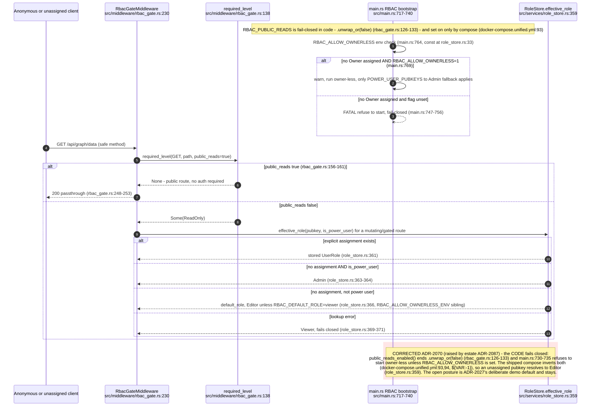

## VC-22.10 Full-sync corpus rebuild vs runtime writers (asserted-graph fence gap)

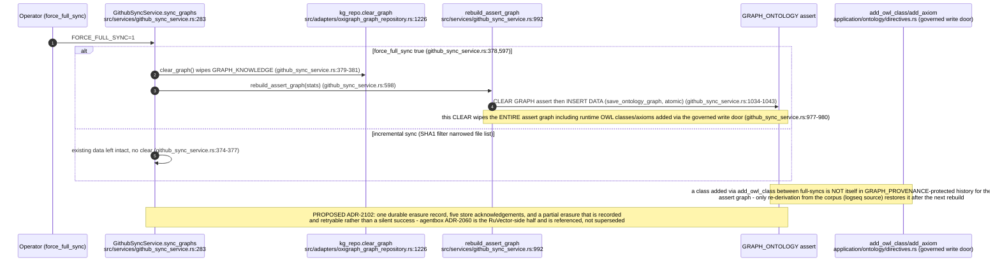

## VC-22.11 SQLite membership contract vs KPI/enrichment sole-source risk

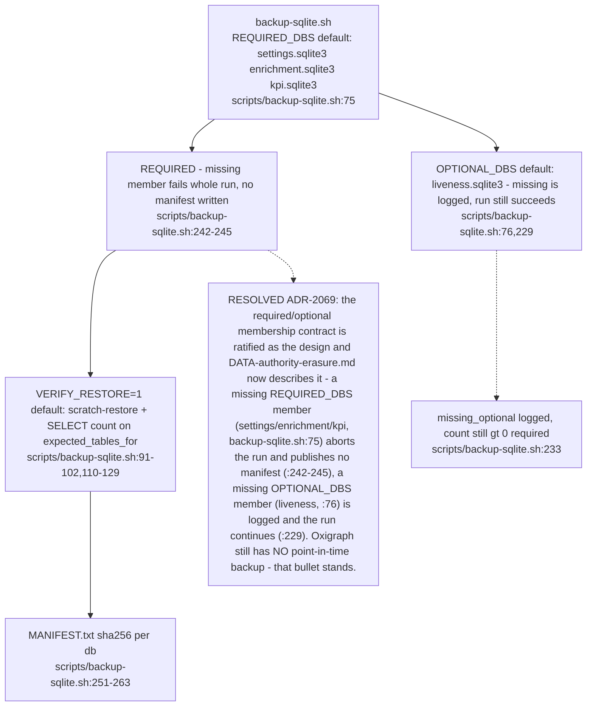
