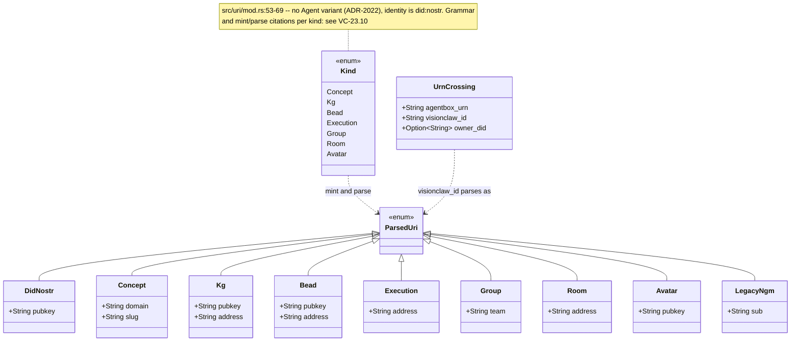
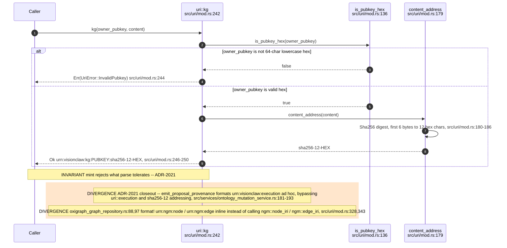
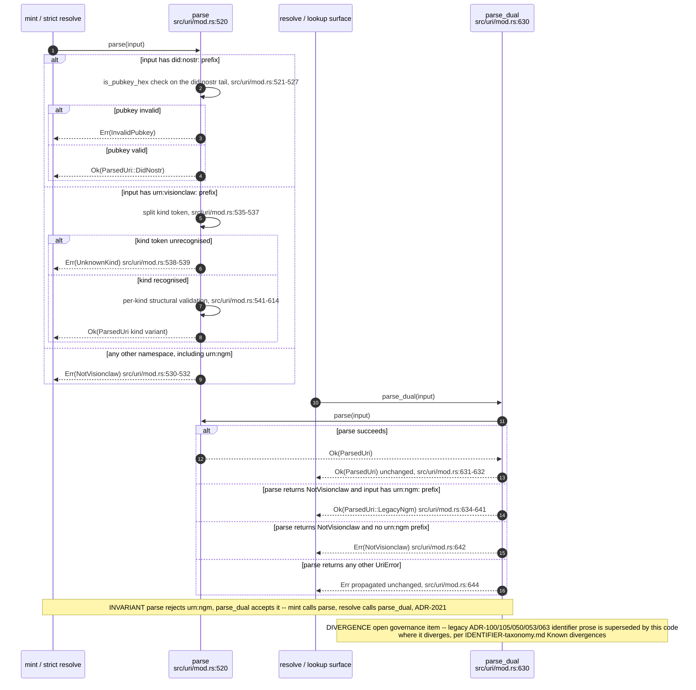
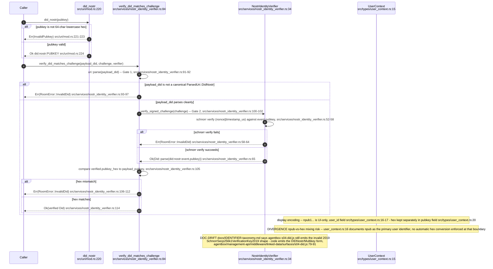
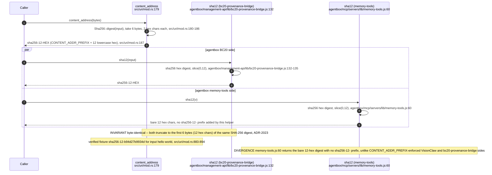
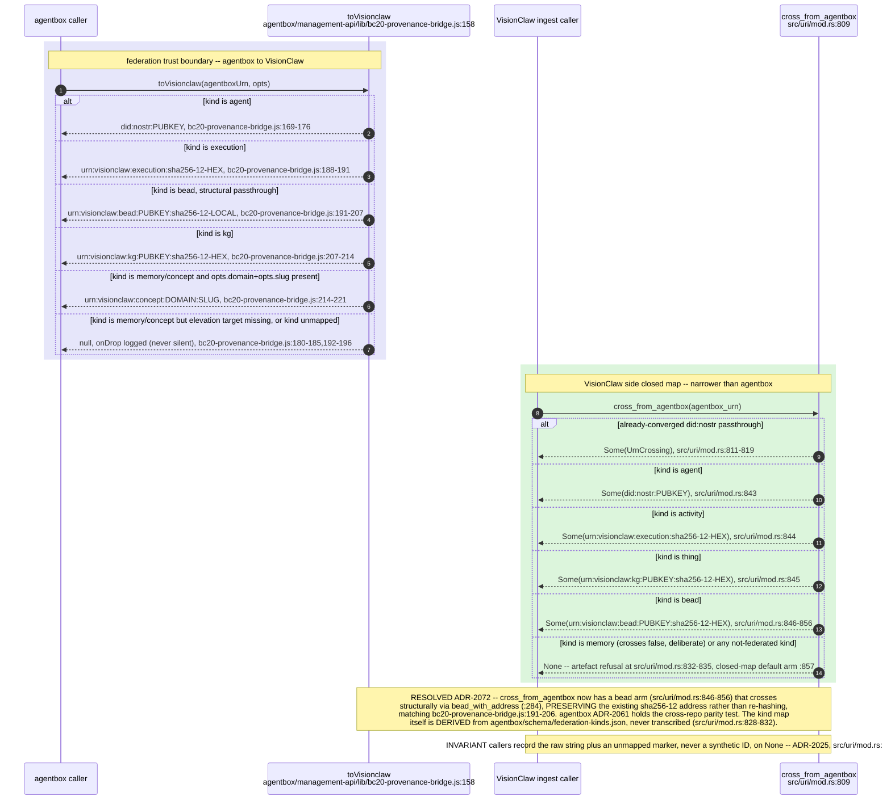
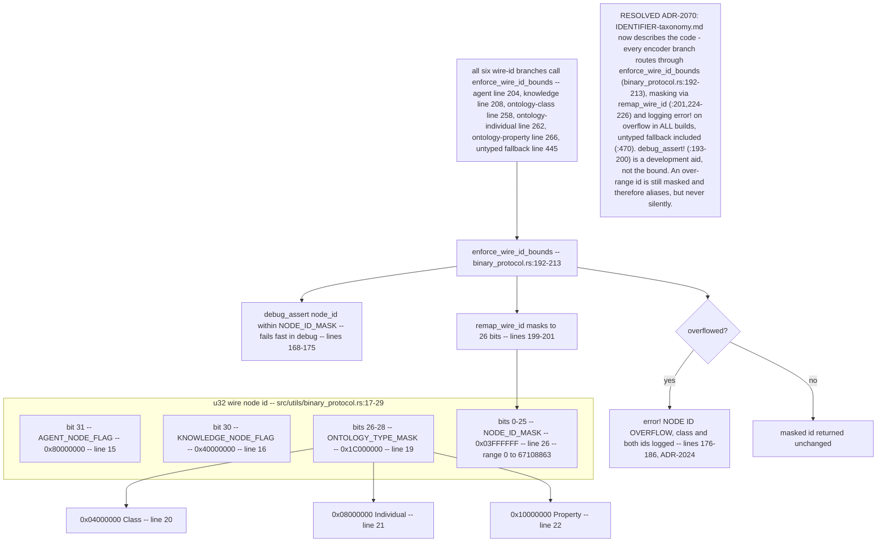
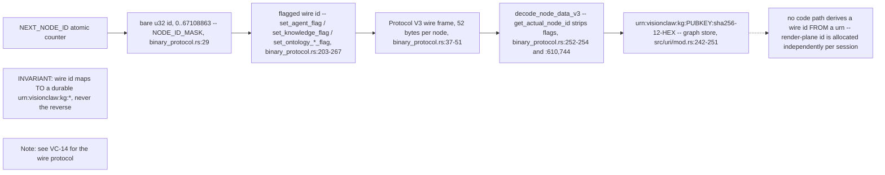
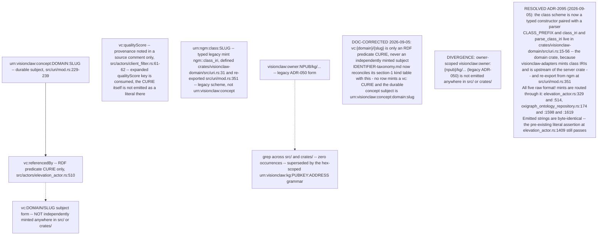

## VC-23.1 Typed URN kind taxonomy — src/uri/mod.rs

## VC-23.2 Fail-closed mint path — kg() (ADR-2021)

## VC-23.3 parse (strict) vs parse_dual (lenient legacy resolve)

## VC-23.4 did:nostr identity — hex canonical, npub display-only (ADR-2022)

## VC-23.5 sha256-12 content addressing — VisionClaw and agentbox (ADR-2023)

## VC-23.6 Federation crossing — toVisionclaw / cross_from_agentbox closed map (ADR-2025)

## VC-23.7 Wire node-id u32 bit layout and overflow policy (ADR-2024)

## VC-23.8 Durable urn:visionclaw vs ephemeral wire node-id

## VC-23.9 vc: CURIE, unminted legacy forms, and the ADR-050 owner-scoped path

## VC-23.10 Per-kind URN grammar, mint/parse sites and live emission

```mermaid
flowchart TD
    subgraph ID["Identity kinds"]
        direction TB
        K1["DidNostr<br/>did:nostr:HEXPUBKEY<br/>mint src/uri/mod.rs:220-225<br/>parse :521-527<br/>kind() returns None :467-470"]
        K9["Avatar<br/>urn:visionclaw:avatar:HEXPUBKEY<br/>1:1 with the avatar DID<br/>mint :297-302 / parse :579-586"]
    end
    subgraph OWNED["Owner-scoped content-addressed kinds"]
        direction TB
        K3["Kg<br/>urn:visionclaw:kg:HEXPUBKEY:sha256-12-HEX<br/>mint :242-251<br/>kg_with_address :255-262<br/>parse :530-551"]
        K4["Bead<br/>urn:visionclaw:bead:HEXPUBKEY:sha256-12-HEX<br/>mint :265-274 / parse :530-551"]
    end
    subgraph UNSCOPED["Unscoped content-addressed kinds"]
        direction TB
        K5["Execution<br/>urn:visionclaw:execution:sha256-12-HEX<br/>owner travels in owner_did, not the URN<br/>mint :277-279 / parse :552-559<br/>live emission enrichment_proposals_handler.rs:219"]
        K7["Room<br/>urn:visionclaw:room:sha256-12-HEX<br/>unscoped XR presence room<br/>mint :292-294 / parse :571-578"]
    end
    subgraph SHARED["Shared and team-scoped kinds"]
        direction TB
        K2["Concept<br/>urn:visionclaw:concept:DOMAIN:SLUG<br/>mint :229-239 / parse :515-529<br/>live emission precedent_registry.rs:88"]
        K6["Group<br/>urn:visionclaw:group:TEAM-hash-members<br/>mint :282-288 / parse :560-570"]
    end
    subgraph LEGACY["Legacy exception"]
        direction TB
        K8["LegacyNgm<br/>urn:ngm:SUB opaque<br/>accepted only by parse_dual :603-619<br/>rejected by parse :503-505<br/>typed ngm module :320-404 -- ADR-2021"]
    end
    XR["Room has no production emission site -- only RoomId::parse under cfg(test), presence_actor.rs:920-921"]
    K7 -.-> XR
    CROSS["UrnCrossing -- federation boundary record, src/uri/mod.rs:772-779 -- see VC-23.6"]
    ID --> CROSS
    OWNED --> CROSS
    UNSCOPED --> CROSS
```

