## VC-24.1 Enrichment-proposal lifecycle (real status values)

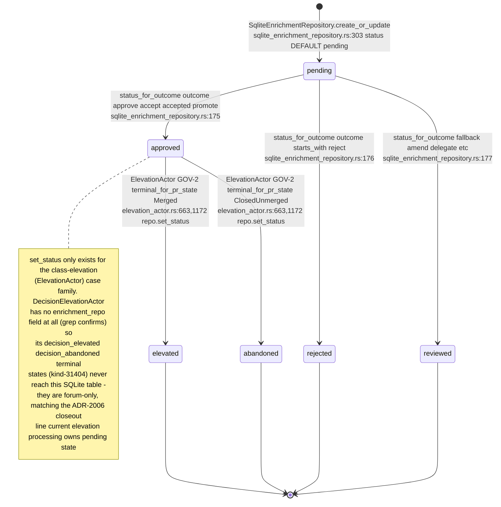

## VC-24.2 Enrichment-proposal creation — the real call chain

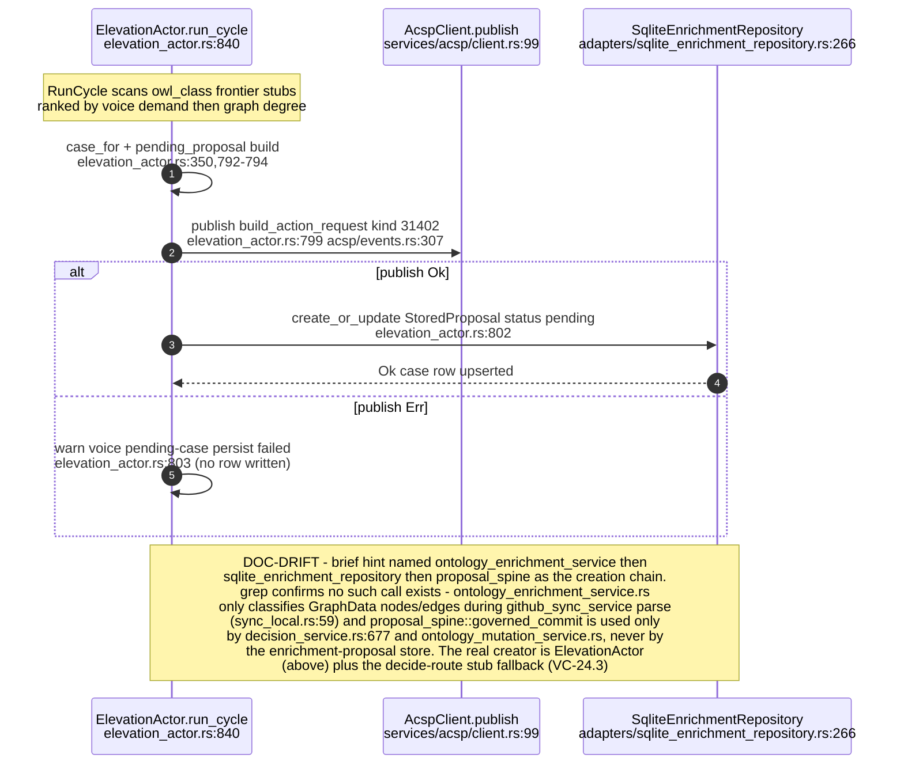

## VC-24.3 POST /api/enrichment-proposals/{id}/decide — decide route

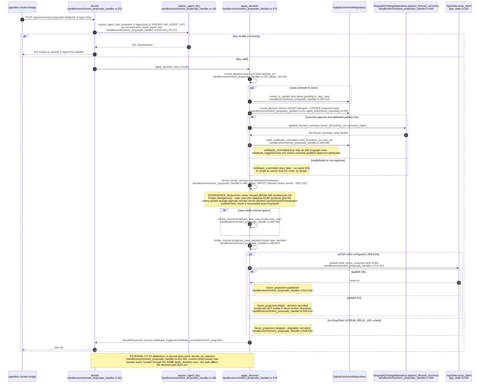

## VC-24.4 ElevationActor — draft → PR → GOV-2 merge poll → concept_elevated

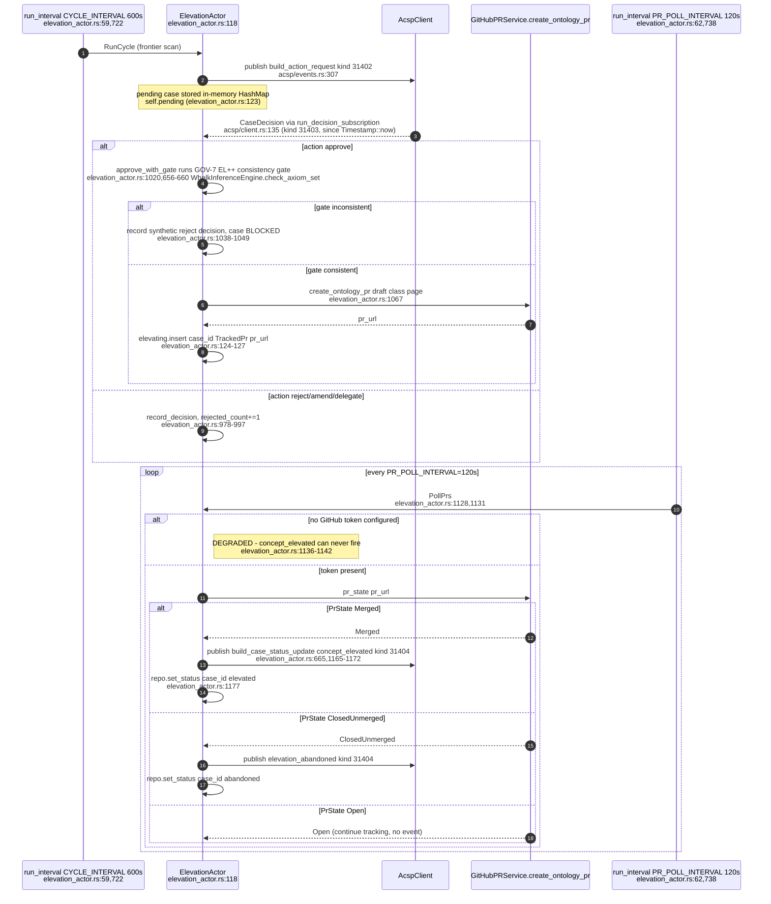

## VC-24.5 GOV-2 terminal PR state mapping + publish-failure warn path

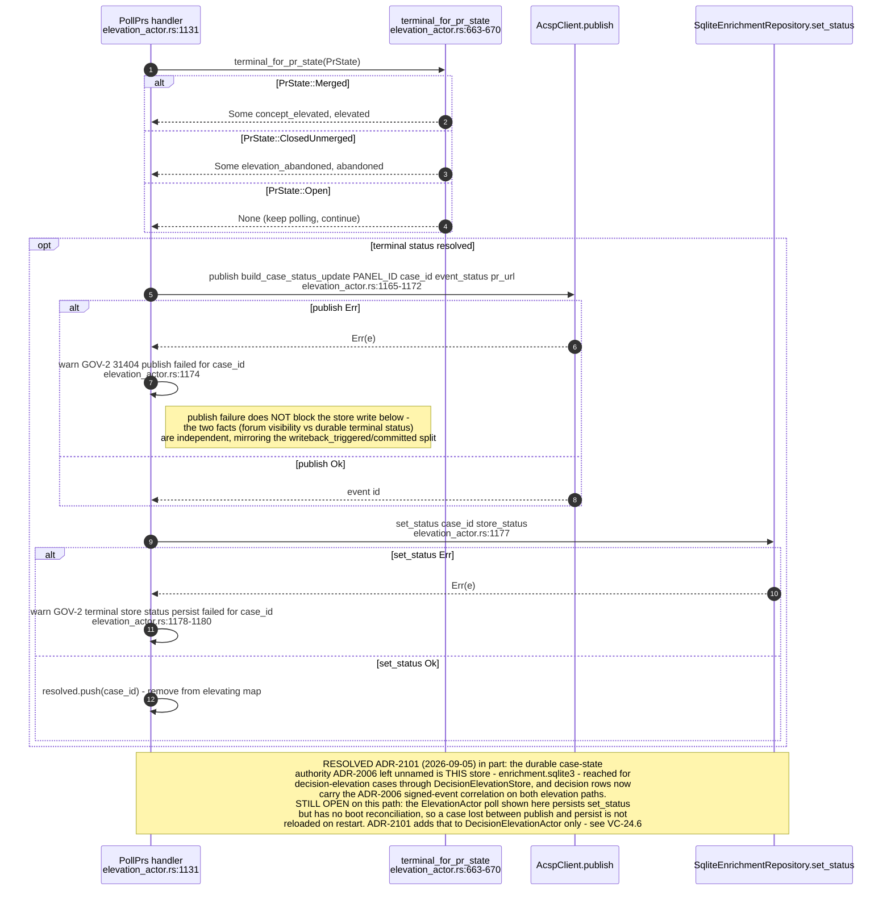

## VC-24.6 DecisionElevationActor — parallel path vs ElevationActor

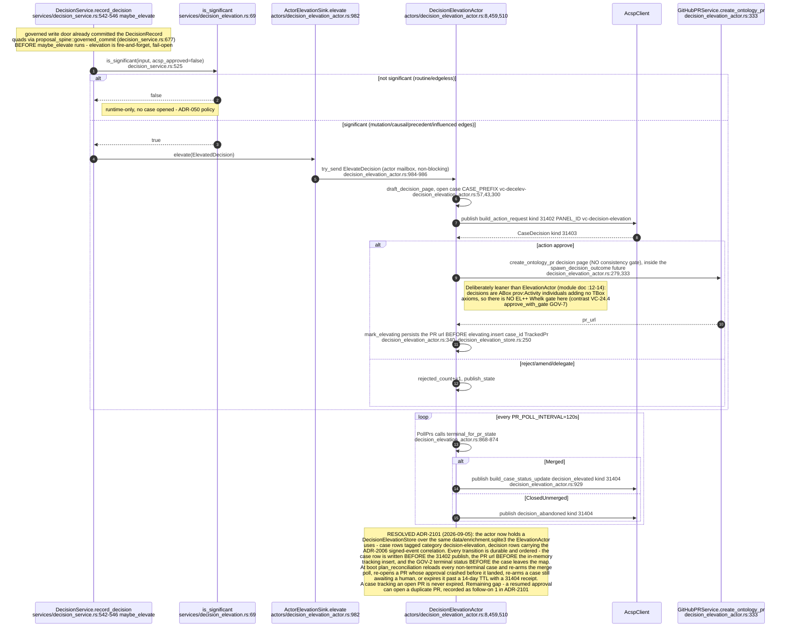

## VC-24.7 broker_inbox_handler and decision_handler routes

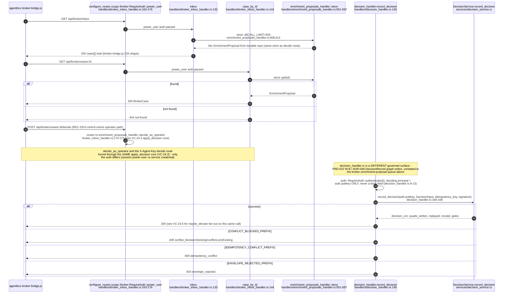

## VC-24.8 nostr_bead_publisher / nostr_bridge — governance event publish

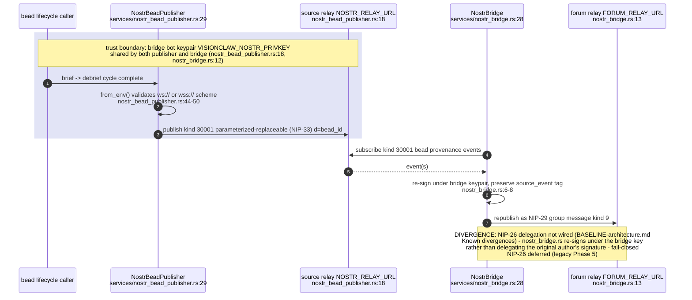

## VC-24.9 Governance kind map (31400-31405)

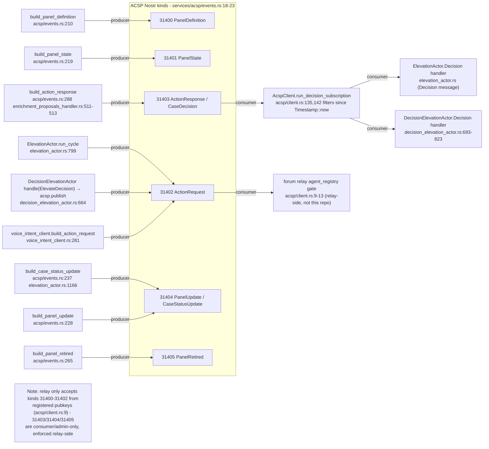

## VC-24.10 web_contract layer structure (reducer/state/ledger/trail/ritual)

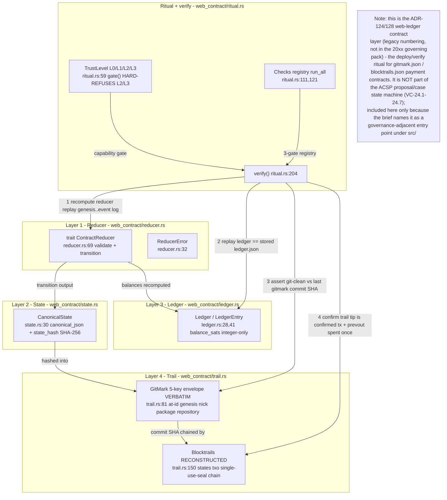

## VC-24.11 ACSP decision-projection client — app_state.rs boot + relay connect

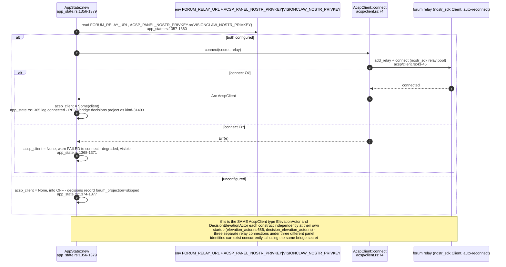

