## VC-25.1 Insight loop trace assembly (REC-10, compute-on-read)

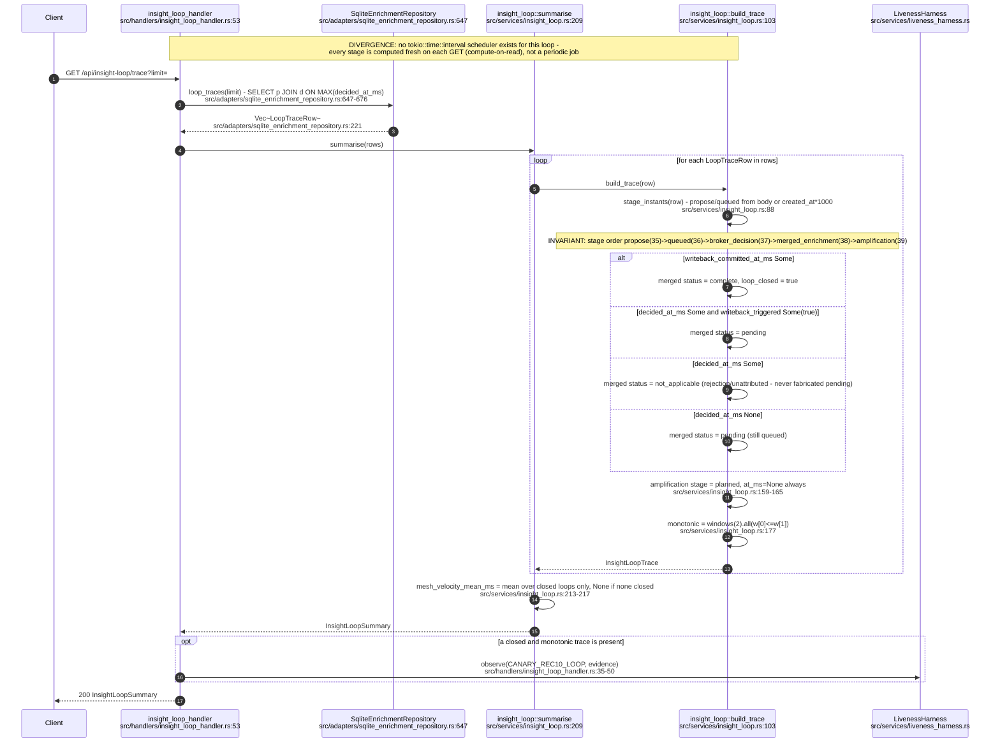

## VC-25.2 insight_loop_handler routes

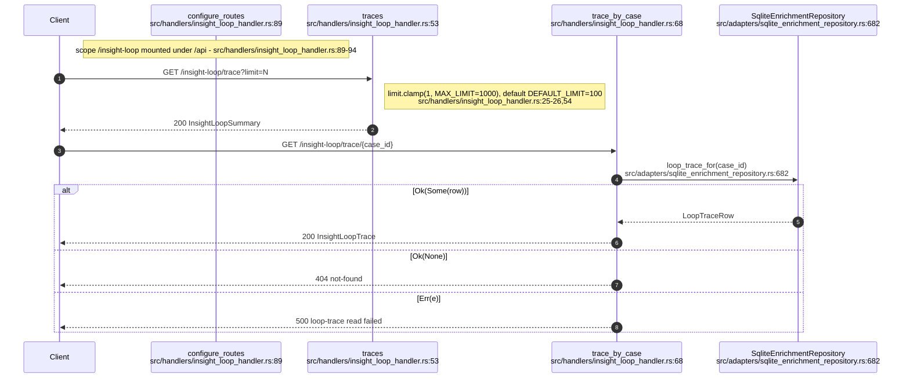

## VC-25.3 KPI compute and persist (kpi_snapshots / kpi_lineage / kpi_agent_events)

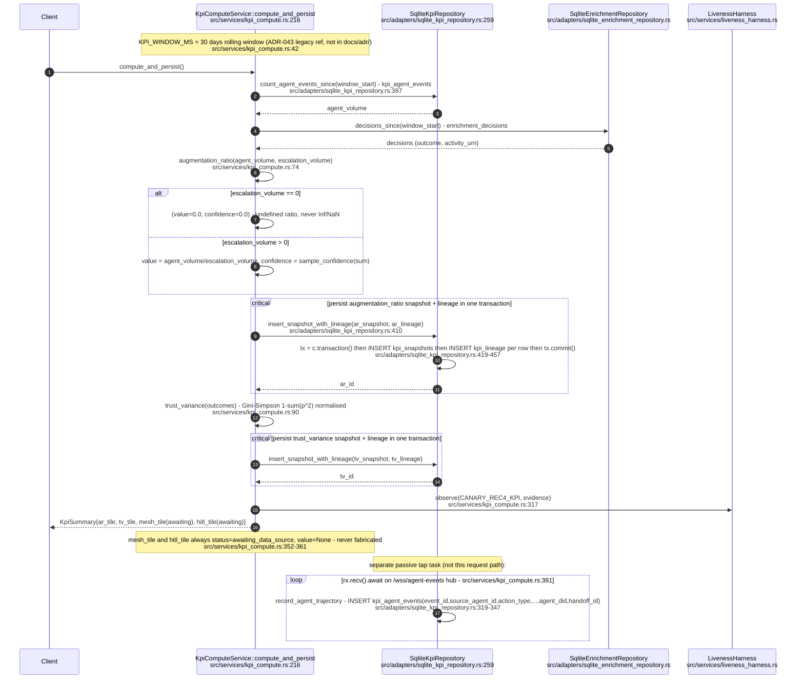

## VC-25.4 kpi_handler read routes

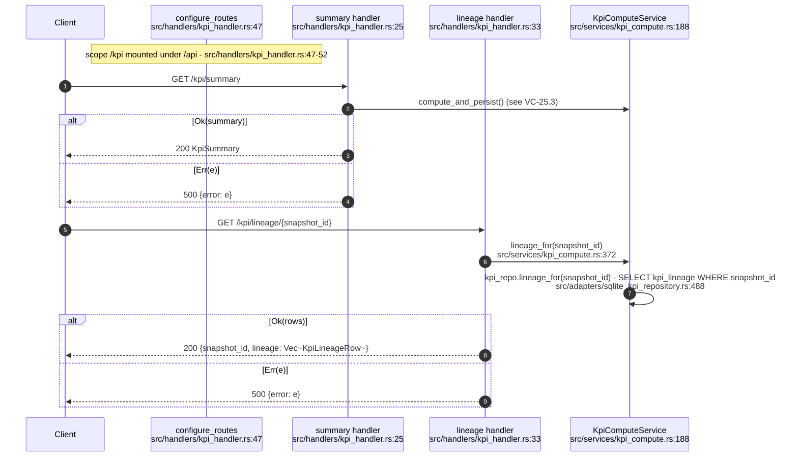

## VC-25.5 KPI SQLite schema (kpi.sqlite3)

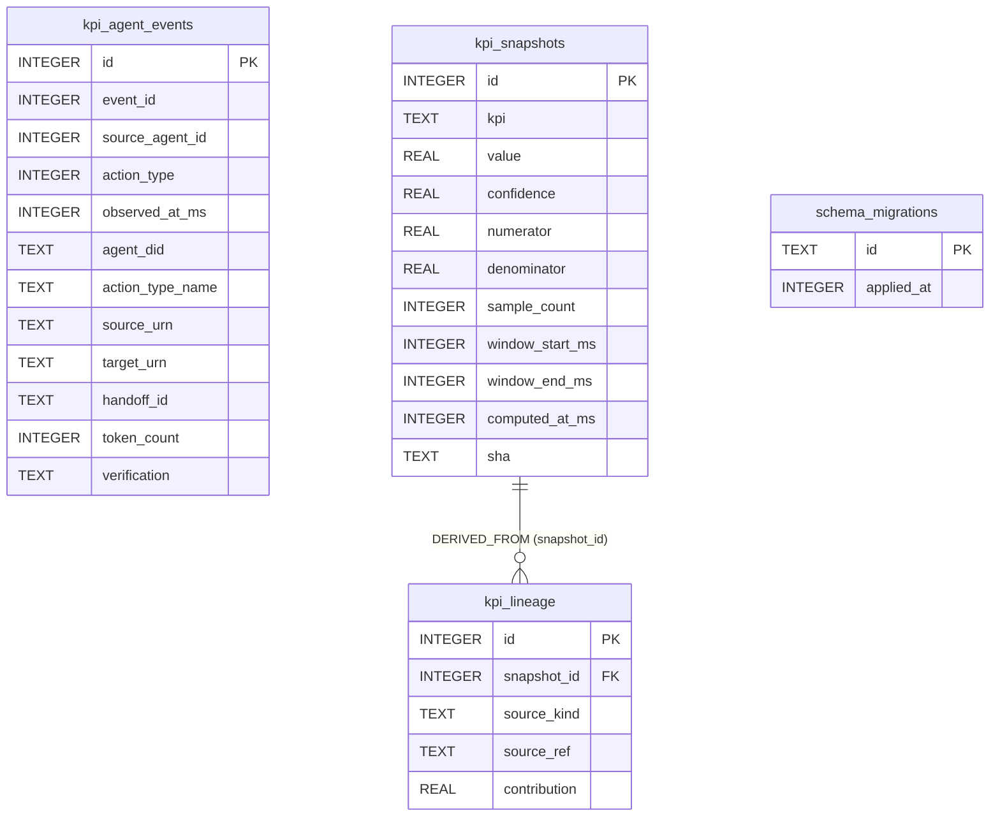

## VC-25.6 Briefing service and handler (submit + debrief)

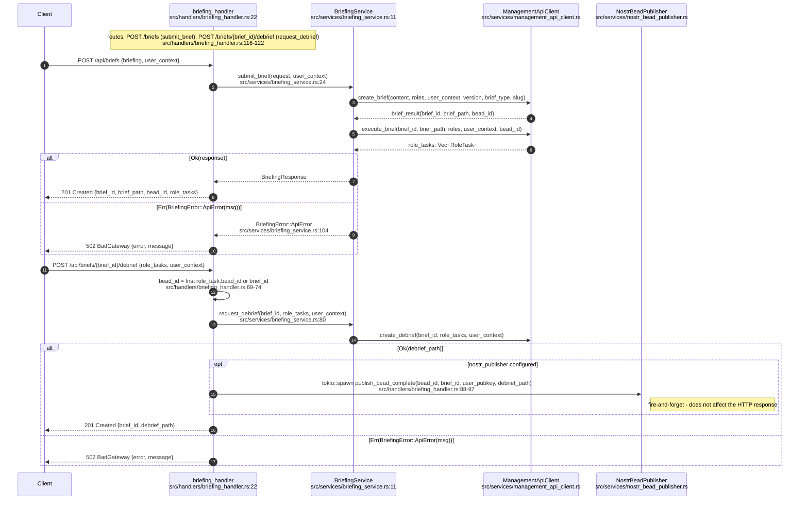

## VC-25.7 Natural language query: parse -> plan -> execute

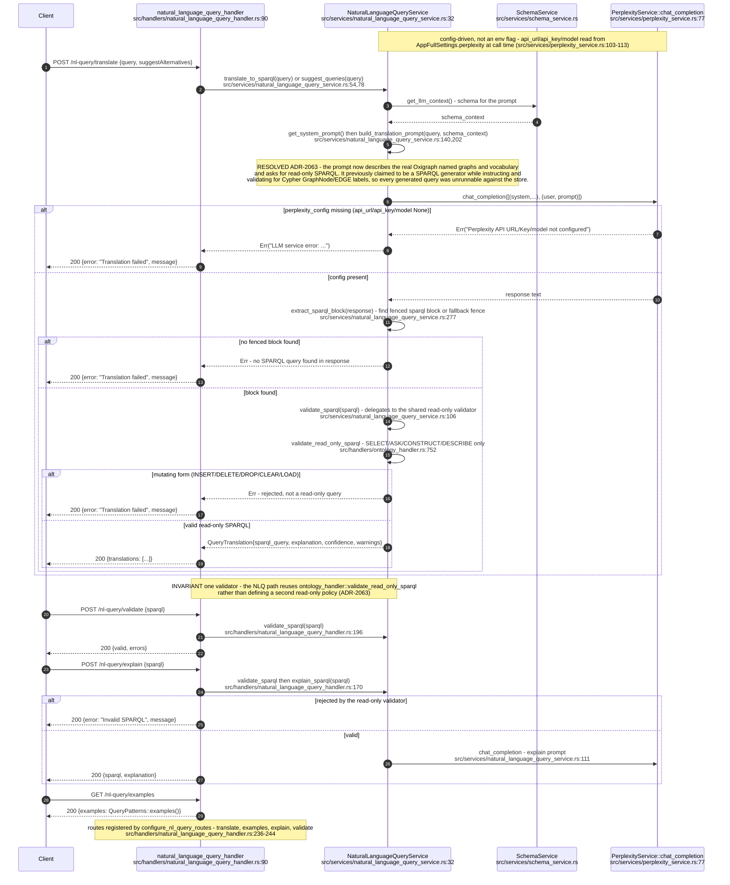

## VC-25.8 SemanticProcessorActor message handling

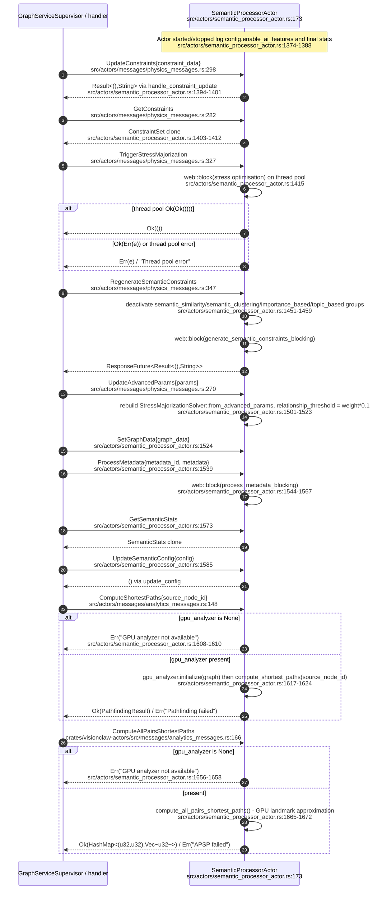

## VC-25.9 semantic_analyzer feature extraction + semantic_type_registry lookup/register

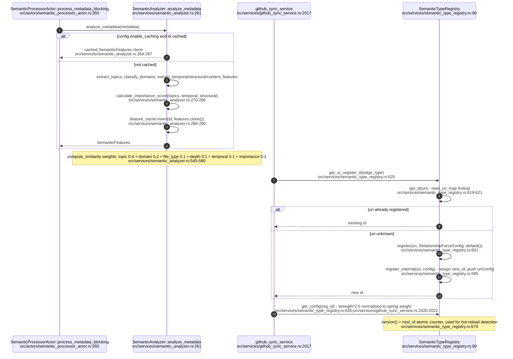

## VC-25.10 edge_classifier classification rules

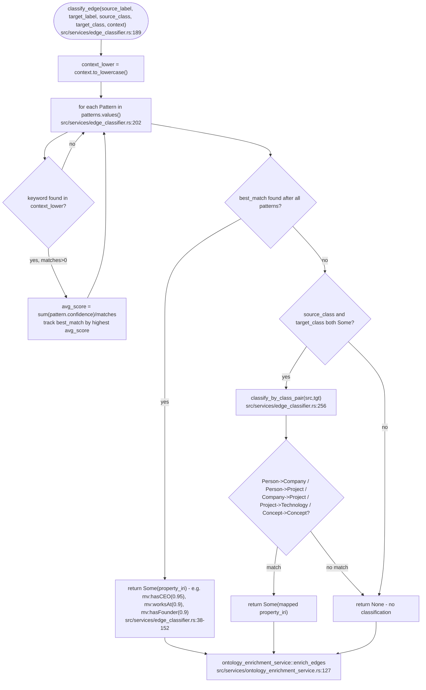

## VC-25.11 ontology_content_analyzer content analysis

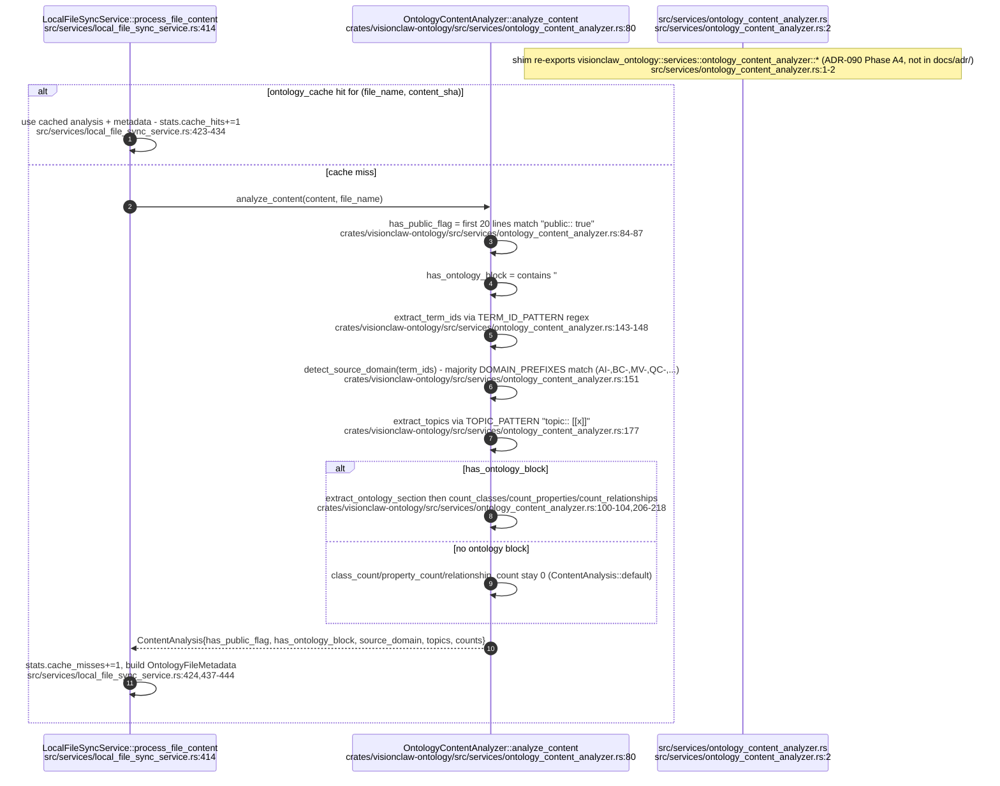

## VC-25.12 MetadataActor message handling

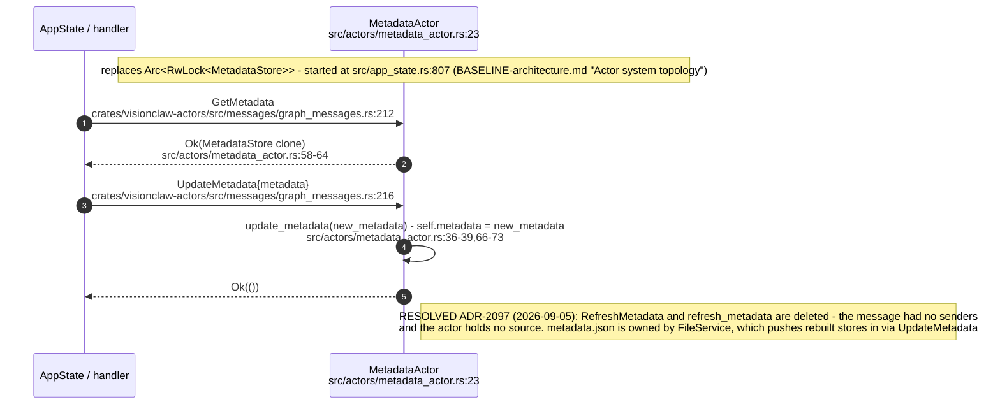

## VC-25.13 file_service + graph_serialization + empty-graph guard

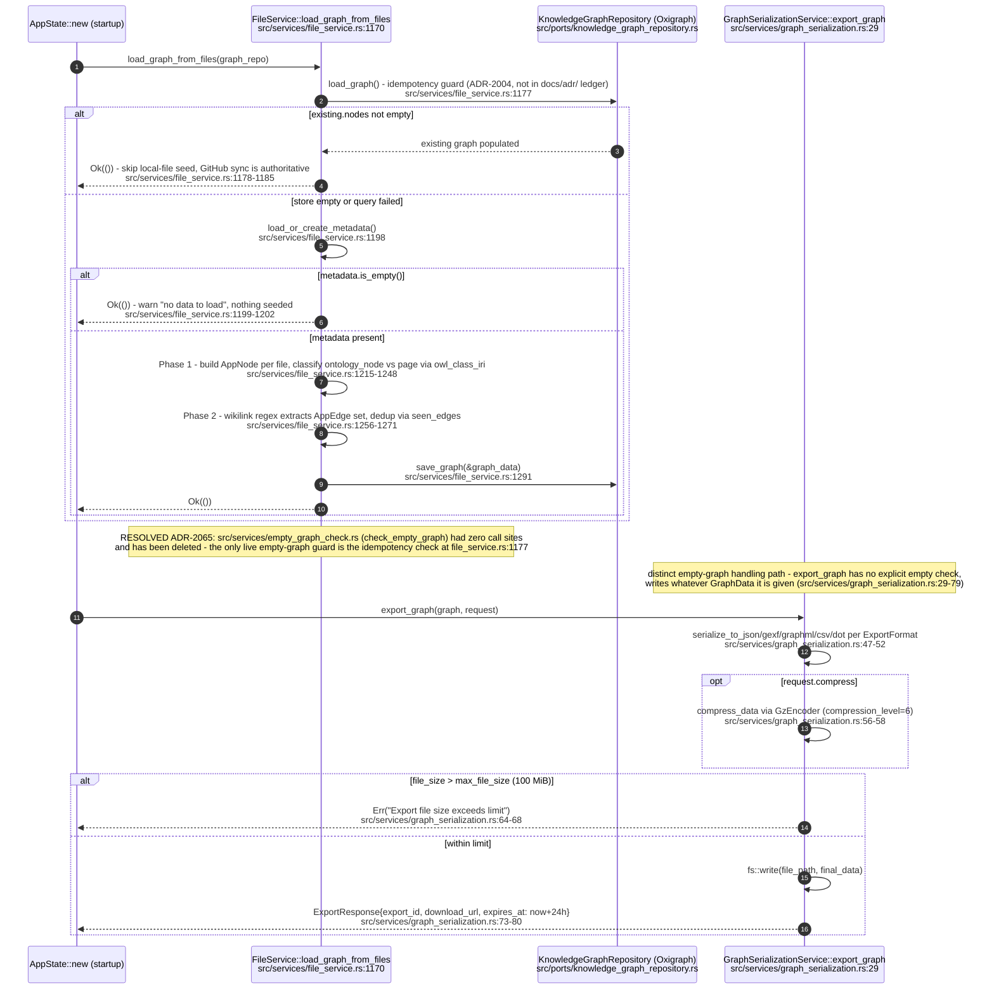
